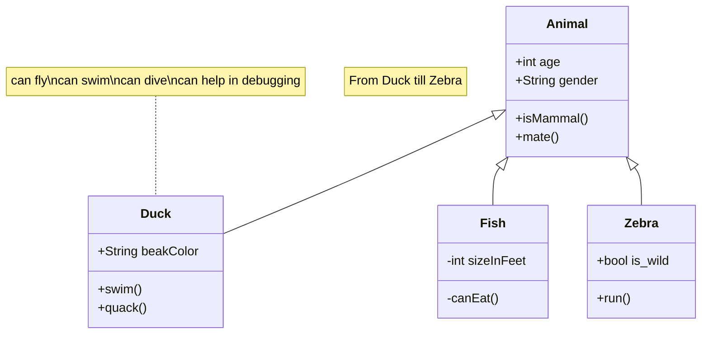

### Support <a href="https://remixicon.com" target="_blank"> Remixicon </a>

```text
:i{class="ri-poker-hearts-fill"}
:i{class="ri-poker-clubs-fill"}
```

:i{class="ri-poker-hearts-fill"}
:i{class="ri-poker-clubs-fill"}

### Support Button

```text
:btn[Google]{href="https://www.google.com"}
```

:btn[Google]{href="https://www.google.com"}

```text
:::btn{href="#"}
:i{class="ri-share-box-line"} Open in new tab
:::
```

:::btn{href="#"}
:i{class="ri-share-box-line"} Open in new tab
:::

### Support Github Card

```text
::github{repo="actionanand/ollama-chat"}
```

::github{repo="actionanand/ollama-chat"}

### Support collapse

**Basic collapse (default title):**
```bash
:::collapse
Hello World!
:::
```

:::collapse
Hello World!
:::

**Collapse with custom title:**
```bash
:::collapse[Custom Title Here]
This is content inside a collapse with a custom title!
:::
```

:::collapse[Custom Title Here]
This is content inside a collapse with a custom title!
:::

**Another example with a longer title:**
```bash
:::collapse[Click to expand detailed information]
This collapse section has a descriptive title that explains what's inside.

You can put any content here:
- Lists
- Code blocks
- Images
- Any markdown content
:::
```

:::collapse[Click to expand detailed information]
This collapse section has a descriptive title that explains what's inside.

You can put any content here:
- Lists
- Code blocks  
- Images
- Any markdown content

**Testing overlapping fix:** This content should not overlap with the elements below when the collapse is expanded. The new CSS styling should provide proper spacing and container behavior.

```javascript
// This code block should be properly contained
function testFunction() {
  console.log("Testing collapse content");
  return "No overlap should occur";
}
```

1. First item in a list
2. Second item with more content to test spacing
3. Third item to ensure proper layout
:::

**Using 'details' syntax (alternative):**
```bash
:::details[Technical Details]
The collapse feature also supports the `:::details` syntax as an alternative to `:::collapse`.
:::
```

:::details[Technical Details]
The collapse feature also supports the `:::details` syntax as an alternative to `:::collapse`.
:::

### Support collapse with Custom Title

:::collapse[🎯 Custom Title with Emoji]
This collapse has a custom title with an emoji and should show a nice SVG arrow that rotates smoothly when expanded.

The arrow changes color based on the theme (light/dark mode) and has a subtle scale effect on hover.
:::

:::collapse[📋 Technical Features Demo]
**Features of the new SVG arrow:**

1. **Smooth rotation animation** (90 degrees)
2. **Theme-aware colors** (dark/light mode support)
3. **Hover effects** with subtle scaling
4. **Cubic-bezier easing** for professional feel
5. **No overlap issues** with proper spacing

```javascript
// Example code to test formatting
function testCollapse() {
  console.log("SVG arrow animation working!");
  return "Perfect spacing and animation";
}
```

**List items work perfectly:**
- First item
- Second item with longer content
- Third item to test spacing
:::

:::collapse[🎨 Visual Design Improvements]
The new design includes:

- **SVG-based arrow icon** instead of Unicode character
- **Flexbox layout** for better alignment  
- **Theme-aware styling** with proper contrast
- **Smooth animations** with easing functions
- **Hover interactions** for better UX

> This blockquote should also be properly spaced within the collapse content.
:::

### Support admonitions/Callouts 

```markdown
:::tip[Customized Title]
hello world
:::

:::note
note
:::

:::caution
caution
:::

:::danger
danger
:::

:::warning
warning
:::

:::info
info
:::

:::tip[New Tips]
How is my new idea?
:::


:::::info[Parent]

Parent content

::::danger[Child]

Child content

:::tip[Deep Child]

**AST**(Abstract Syntax Tree) in Admonitions

:::

::::

:::::

```

:::tip[Customized Title]
hello world
:::

:::note
note

```js
console.log('hello world')
```

:::

:::caution
caution
:::

:::danger
danger
:::

:::warning
warning
:::

:::info
info
:::

:::tip[New Tips]
How is my new idea?
:::

:::::info[Parent]

Parent content

::::danger[Child]

Child content

:::tip[Deep Child]

**AST**(Abstract Syntax Tree) in Admonitions

:::

::::

:::::

:::info[Custom Info Title]
This is a new info admonition with custom title and blue styling.
:::

:::warning[Custom Warning Title]
This is a warning admonition that should look like caution with orange styling.
:::

:::info
This is a standard info admonition without custom title.
:::

:::warning
This is a standard warning admonition without custom title.
:::

## Character Chats

```md title="Custom character chat" wrap
:::duck
**Did you know?** You can easily create custom character chats for your blog!
:::
```

:::duck
**Did you know?** You can easily create custom character chats for your blog!
:::

### Adding Your Own

To add your own character, first add an image files to the directory `/public/admonitions` in your  repo. Astro cannot automatically optimize image assets from markdown plugins, so make sure to compress the image to a web-friendly size (<100kb).

I recommend Google's free [Squoosh](https://squoosh.app) web app for creating super small webp files. The characters here have been resized to 300 pixels wide and exported to webp with 75% quality using Squoosh.

After you've added your image, update the exported constant `characters` in `consts.ts` with your newly added image file and restart the development server.

### Character Conversations

When there are multiple character chats in a row, the order of the chat image and chat bubble reverses to give the chat more of a back-and-forth appearance.

```md title="Sequential character chats"
:::owl
This is a cool feature!
:::

:::unicorn
I agree!
:::
```

:::owl
This is a cool feature!
:::

:::unicorn
I agree!
:::

You can specify the alignment (`left` or `right`) to override the default `left, right, left, ...` ordering.

```md wrap title="Character chats with specific alignment"
:::unicorn{align="right"}
Over here, to the right!
:::
```

:::unicorn{align="right"}
Over here, to the right!
:::


### Support mermaid

A [Mermaid](https://mermaid.js.org/intro/) diagram is a diagram and flowcharting tool that allows users to create visualizations using simple text and code. It is based on JavaScript and uses a Markdown-inspired syntax to dynamically create and modify diagrams. This approach of **diagrams as code** allows for easy version control and maintenance of visual documentation. 

How to Use:

+ start with **```mermaid**
+ end with **```**
+ set markdown frontmatter `mermaid: true`.

Mermaid Code:

```html title="mermaid.md"
classDiagram
note "From Duck till Zebra"
Animal <|-- Duck
note for Duck "can fly\ncan swim\ncan dive\ncan help in debugging"
Animal <|-- Fish
Animal <|-- Zebra
Animal : +int age
Animal : +String gender
Animal: +isMammal()
Animal: +mate()
class Duck{
+String beakColor
+swim()
+quack()
}
class Fish{
-int sizeInFeet
-canEat()
}
class Zebra{
+bool is_wild
+run()
}
```

Result:



### SupportSupport mathjax (LaTeX/KaTeX)

+ set markdown frontmatter `mathjax: true`.

You can also display inline math via [remark-math and rehype-katex](https://github.com/remarkjs/remark-math). Check out the [KaTeX docs](https://katex.org/docs/supported) to learn about the syntax.

#### Block Mode

```yaml title="Mathjax.md"
---
mathjax: true
---
hello!
$$ \sum_{i=0}^N\int_{a}^{b}g(t,i)\text{d}t $$
hello!
```

hello!
$$ \sum_{i=0}^N\int_{a}^{b}g(t,i)\text{d}t $$
hello!

```md title="Rendering a block of KaTeX"
---
mathjax: true
---
$$
a + ar + ar^2 + ar^3 + \dots + ar^{n-1} = \displaystyle\sum_{k=0}^{n - 1}ar^k = a \bigg(\dfrac{1 - r^n}{1 -r}\bigg)
$$
```

$$
a + ar + ar^2 + ar^3 + \dots + ar^{n-1} = \displaystyle\sum_{k=0}^{n - 1}ar^k = a \bigg(\dfrac{1 - r^n}{1 -r}\bigg)
$$

#### Inline Mode

```yaml title="Mathjax.md"
---
mathjax: true
---
hello! $ \sum_{i=0}^N\int_{a}^{b}g(t,i)\text{d}t $ hello!
```

hello! $ \sum_{i=0}^N\int_{a}^{b}g(t,i)\text{d}t $ hello!

```txt title="Rendering inline math with KaTeX"
---
mathjax: true
---
Make those equations pretty! $ \frac{a}{b} \cdot b = a $
```

Make those equations pretty! $ \frac{a}{b} \cdot b = a $


### Integration with Expressive Code

See the [Expressive Code Docs](https://expressive-code.com/key-features/syntax-highlighting/) for more information on available features like wrapping text, line highlighting, diffs, etc. [Expressive Code](https://expressive-code.com/) has several advanced features that go beyond the basic syntax highlighting offered by [Prism](https://prismjs.com/), positioning it as a more modern and powerful tool for developers and technical writers. While Prism is known for being lightweight and simple to use, Expressive Code builds on this foundation with rich annotations and UI elements. 


```js title="line-markers.js" del={2} ins={3-4} {6}
function demo() {
  console.log('this line is marked as deleted')
  // This line and the next one are marked as inserted
  console.log('this is the second inserted line')

  return 'this line uses the neutral default marker type'
}
```

### Code folding is supported by default

```js
var myArr = [1, 2]
console.log(myArr)

var myObj = {a: 1, b: 2}

for (let key of myArr) {
  console.log(key)
}

var it = myArr[Symbol.iterator]()
it.next() // {value: 1, done: false}

// VM704:12 Uncaught TypeError: myObj is not iterable
for (let key of myObj) {
  console.log(key)
}

```

