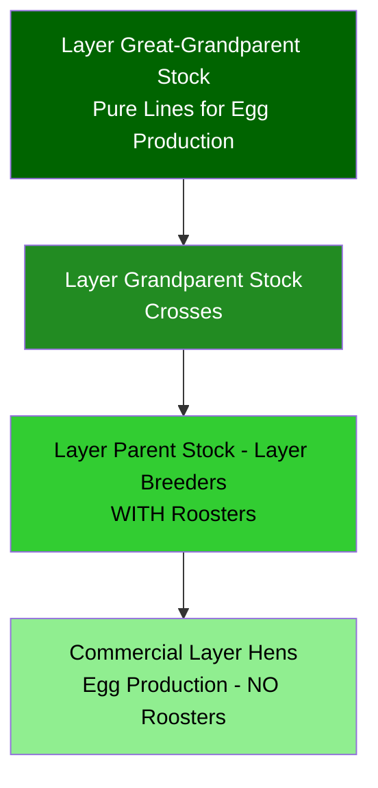
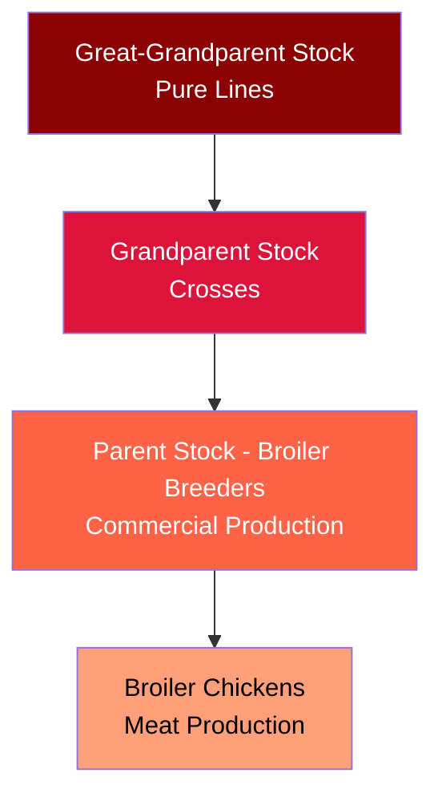

import Highlight from "@/react/Highlight/Highlight.jsx";

The chicken on your dinner plate didn't just happen by chance. Behind every broiler chicken is a sophisticated breeding system involving specialized birds called **broiler breeders**. Understanding this system reveals the complexity of modern food production and raises important questions about genetics, nutrition, and animal welfare.

## <Highlight color='#800031' highlight='fg' fontWeight='bold'> Broilers vs. Layers: Two Different Birds </Highlight>

### <Highlight color='#004080' highlight='fg' fontWeight='bold'> Understanding the Fundamental Difference </Highlight>

Before diving into broiler breeding, it's crucial to understand that **the chickens we eat (broilers) are completely different from the chickens that produce the eggs we buy (layers)**. These are two separate genetic lines, bred for entirely different purposes.

:::important[Key Distinction]
- **Broiler chickens** = Meat production (what you eat as chicken meat)
- **Layer chickens** = Egg production (produce eggs you buy at the store)
- **Broiler breeders** = Parent birds that produce eggs that hatch into broiler chickens (NOT the eggs you eat)
:::

**Why This Matters:**

The eggs you buy at the grocery store come from **layer hens** and will NEVER hatch because:
1. **They are unfertilized** - No roosters are kept with commercial laying hens
2. **Layer genetics** - These chickens are bred for egg production, not meat
3. **Different purpose** - Commercial egg production vs. hatching chicks

Let's explore both types:

## <Highlight color='#800031' highlight='fg' fontWeight='bold'> What Are Broiler Chickens? </Highlight>

### <Highlight color='#004080' highlight='fg' fontWeight='bold'> The Meat Birds </Highlight>

**Broiler chickens** are birds specifically bred for meat production. Unlike laying hens (bred for egg production) or dual-purpose breeds, broilers are genetically engineered to:

- **Grow extremely fast**: Reach market weight (2-2.5 kg) in just 35-42 days
- **Have high feed conversion efficiency**: Convert feed into meat at ratios of 1.6-1.8:1
- **Develop large breast muscles**: The white meat consumers prefer
- **Mature quickly**: Ready for slaughter at just 5-7 weeks old

:::note[Historical Comparison]
In the 1950s, it took **84 days** for a chicken to reach 1.8 kg. Today's broilers reach **2.5 kg in just 35-42 days**—a remarkable transformation through selective breeding.
:::

### <Highlight color='#004080' highlight='fg' fontWeight='bold'> Why Are They So Different? </Highlight>

Modern broilers are the result of over 60 years of intensive genetic selection. Every generation, breeding companies select birds with:

1. **Faster growth rates**
2. **Better feed conversion**
3. **Larger muscle mass** (especially breast meat)
4. **Disease resistance**
5. **Improved meat quality**

This selective breeding has created birds that are fundamentally different from their ancestors or wild counterparts.

## <Highlight color='#800031' highlight='fg' fontWeight='bold'> What Are Layer Chickens (Egg-Laying Hens)? </Highlight>

### <Highlight color='#004080' highlight='fg' fontWeight='bold'> The Egg Production Specialists </Highlight>

**Layer chickens** are completely different birds, bred specifically for egg production:

**Key Characteristics:**
- **High egg production**: 280-320 eggs per year
- **Small body size**: 1.5-2.0 kg at maturity
- **Low feed consumption**: Efficient conversion to eggs, not meat
- **Long productive life**: 72-80 weeks of egg laying
- **No meat value**: Very little muscle, mostly bone and organs

**Major Differences from Broilers:**

| Trait | Broiler Chickens | Layer Chickens |
|-------|------------------|----------------|
| **Purpose** | Meat production | Egg production |
| **Lifespan** | 35-42 days | 18-24 months |
| **Weight at maturity** | 2.5 kg (5-6 weeks) | 1.8 kg (18 weeks) |
| **Eggs laid** | 0 (slaughtered young) | 280-320 per year |
| **Feed efficiency** | Convert to meat (1.6:1) | Convert to eggs |
| **Breast muscle** | Large, heavy | Small, minimal |
| **Body type** | Chunky, muscular | Lean, lightweight |
| **Genetics** | Cornish × White Rock crosses | Leghorn or Rhode Island crosses |

### <Highlight color='#004080' highlight='fg' fontWeight='bold'> Why Store-Bought Eggs Don't Hatch </Highlight>

**The Simple Answer: They're Unfertilized**

When you buy eggs at the supermarket:

1. **No roosters present**: Commercial layer farms keep ONLY hens
2. **Unfertilized eggs**: Without a rooster, eggs cannot be fertilized
3. **No embryo development**: These eggs will never become chicks, no matter how long you incubate them
4. **Economic efficiency**: Roosters eat feed but don't lay eggs, so they're not kept

### <Highlight color='#004080' highlight='fg' fontWeight='bold'> How Do Hens Lay Eggs Without a Rooster? </Highlight>

**The Biology of Egg Production:**

Many people are surprised to learn that **hens lay eggs whether or not a rooster is present**. Here's how:

**The Egg Formation Process (24-26 hours):**

1. **Ovulation** (Hour 0):
   - Hen's ovary releases a yolk (ovum)
   - This happens naturally every 24-26 hours in laying hens
   - **No rooster needed** for this process

2. **Fertilization Window** (0-30 minutes):
   - If a rooster has mated with the hen in the past 2 weeks
   - Sperm stored in hen's body can fertilize the yolk here
   - **This is the ONLY step where a rooster is involved**
   - Without a rooster: yolk proceeds unfertilized

3. **Albumen Formation** (Hours 3-4):
   - Yolk moves through oviduct
   - Egg white (albumen) layers form around yolk
   - Chalazae (twisted strands) develop to hold yolk centered

4. **Shell Membrane Formation** (Hour 5):
   - Two protective membranes form around albumen

5. **Shell Formation** (Hours 5-20):
   - Calcium carbonate deposited to form hard shell
   - Takes about 20 hours (longest part of process)
   - Shell gland adds pigment (if brown egg)

6. **Bloom/Cuticle** (Hour 24):
   - Final protective coating applied
   - Seals pores in shell

7. **Laying** (Hour 24-26):
   - Hen lays the complete egg
   - Process immediately starts again with next yolk

**Key Point:**

Out of this entire 24-26 hour process, **fertilization only happens in the first 30 minutes, and ONLY if a rooster was present**. All the other steps—which is 99% of egg formation—happen exactly the same whether or not there's a rooster.

:::note[Think of it Like This]
A hen's reproductive system is like a factory producing eggs. The rooster only adds one ingredient (sperm) at the very beginning. If that ingredient isn't there, the factory still runs and produces the egg—it just won't be fertilized.
:::

**Hormonal Trigger:**

Egg laying is triggered by:
- **Light exposure**: 14-16 hours of light per day
- **Hormones**: Luteinizing hormone (LH) causes ovulation
- **Genetics**: Modern layers bred to lay almost daily
- **Age**: Peak production at 25-35 weeks of age

**None of these require a rooster!**

:::note[Fertilization Basics]
- **Fertilized egg**: Rooster mates with hen → sperm meets ovum → embryo can develop
- **Unfertilized egg**: No rooster → no sperm → just an egg → will NEVER hatch
- You cannot tell the difference by looking at them!
:::

**What About "Fertile" Eggs?**

Some specialty stores sell fertilized eggs from farms that keep roosters:
- These CAN hatch if incubated properly
- Usually from small farms or backyard flocks
- More expensive than regular eggs
- Marketed as "fertilized" or from "mixed flocks"

**Can You Tell the Difference?**

Without special equipment, no! Both look identical:
- **Blood spot**: Does NOT mean fertilized (broken blood vessel)
- **White spot (chalaza)**: Normal, not an embryo
- **Ring on yolk**: Only visible after several days of incubation in fertilized eggs

### <Highlight color='#004080' highlight='fg' fontWeight='bold'> How Layer Breeds Are Created </Highlight>

If commercial eggs don't hatch, how do layer farms get new chickens? The answer: **Layer Breeders** - a separate breeding system parallel to broiler breeders.

**The Layer Breeding Pyramid:**



**Layer Breeding System:**

**Level 1: Great-Grandparent Layer Stock**
- Pure lines selected for egg production traits
- Companies: Hy-Line, Lohmann, Bovans, ISA
- Traits selected:
  - **Egg numbers** (280-320 eggs/year)
  - **Egg size** (60-65 grams)
  - **Shell quality** (strong, no cracks)
  - **Feed efficiency** (converts feed to eggs)
  - **Livability** (low mortality)
  - **Egg color** (white or brown, depending on market)

**Level 2: Grandparent Layer Stock**
- Crosses between pure lines
- Produce the parent stock
- Hybrid vigor for productivity

**Level 3: Parent Stock (Layer Breeders)**
- **Key difference**: These flocks HAVE roosters (ratio 1:10)
- Males and females housed together
- Eggs are FERTILIZED and sent to hatcheries
- These eggs hatch into commercial layer chicks

**Level 4: Commercial Layer Hens**
- **NO roosters** - females only
- Produce unfertilized table eggs
- These eggs go to grocery stores
- Will NEVER hatch

:::important[Critical Point]
Layer breeders (with roosters) produce fertilized eggs → hatch into layer chicks → raised to 18 weeks → become commercial layers (without roosters) → produce unfertilized eggs for human consumption.
:::

### <Highlight color='#004080' highlight='fg' fontWeight='bold'> Mating Systems: Broilers vs. Layers </Highlight>

**Understanding the Critical Difference:**

**Broiler Breeding System:**

✅ **Natural mating ALWAYS happens**
- Broiler breeder flocks have roosters (males) with hens (females)
- Ratio: 1 rooster per 8-10 hens
- Males and females housed together 24/7
- Natural mating occurs continuously
- **Result**: Nearly all eggs are FERTILIZED (85-95%)
- **Purpose**: These fertilized eggs hatch into broiler chickens for meat production
- **Eggs never sold for consumption** - all sent to hatcheries

**Layer Breeding System - Two Separate Stages:**

**Stage 1: Layer Breeder Flocks (For Regeneration Only)**

✅ **Natural mating happens here** (Only at this level)
- Layer breeder flocks have roosters with hens
- Ratio: 1 rooster per 10-12 hens
- Natural mating occurs
- **Result**: Fertilized eggs (90-95%)
- **Purpose**: These eggs hatch into the next generation of layer chickens
- **This is ONLY for creating new layer birds** - not for table eggs

**Stage 2: Commercial Layer Flocks (For Egg Production)**

❌ **NO mating happens**
- Commercial layer farms have ZERO roosters
- 100% female birds only
- No mating possible
- **Result**: All eggs are UNFERTILIZED (100%)
- **Purpose**: These eggs sold as table eggs in stores
- **Will NEVER hatch** - meant for human consumption

**Summary Table:**

| Type | Roosters Present? | Mating? | Eggs Fertilized? | Egg Purpose |
|------|-------------------|---------|------------------|-------------|
| **Broiler Breeders** | ✅ Yes (always) | ✅ Yes | ✅ Yes (85-95%) | Hatch into broilers for meat |
| **Layer Breeders** | ✅ Yes (only this level) | ✅ Yes | ✅ Yes (90-95%) | Hatch into layer chickens |
| **Commercial Layers** | ❌ No | ❌ No | ❌ No (0%) | Sold as table eggs for eating |
| **Broiler Chickens** | N/A | N/A | N/A | Slaughtered at 35-42 days for meat |

:::info[Why This System Exists]
- **Broiler eggs hatch** because broiler breeders always have roosters and mate naturally—these eggs become the broiler chickens we eat as meat
- **Layer eggs don't hatch** because commercial layer farms have no roosters and no mating happens—these eggs go to grocery stores for consumption
- **Layer breeds regenerate** through a separate layer breeder flock (with roosters) that produces fertilized eggs specifically to create new layer hens
- **The key**: Broiler breeders ALWAYS mate; commercial layers NEVER mate; layer breeders mate ONLY for regeneration
:::

**Layer Breeding Selection:**

Modern layer genetics focus on:

1. **Egg Production:**
   - Peak production: 95-98% (almost every hen lays daily)
   - Total eggs: 320-350 over 80 weeks
   - Persistency: Maintain high production longer

2. **Egg Quality:**
   - Shell strength (prevent cracks during handling)
   - Shell color uniformity (white or brown)
   - Yolk color (consumer preference)
   - Albumen (egg white) height and quality

3. **Feed Efficiency:**
   - Feed per dozen eggs produced
   - Body weight maintenance
   - Lower feed costs

4. **Health and Welfare:**
   - Disease resistance
   - Skeletal strength (calcium demands)
   - Reduced feather pecking
   - Calm temperament

5. **Livability:**
   - Low mortality rates
   - Adaptability to different housing systems
   - Heat tolerance

**Major Layer Genetics Companies:**

- **Hy-Line International** (USA) - Hy-Line Brown, W-36 White
- **Lohmann Tierzucht** (Germany) - LSL, LB
- **Hendrix Genetics** (Netherlands) - Bovans, ISA
- **Novogen** (France) - Brown and white lines

**White Eggs vs. Brown Eggs:**

Different layer breeds produce different egg colors:

- **White eggs**: White Leghorn breeds (most efficient)
  - Lighter body weight
  - Lower feed consumption
  - Popular in USA, Asia
  
- **Brown eggs**: Rhode Island Red crosses
  - Slightly heavier birds
  - Higher feed needs
  - Premium pricing in some markets
  - Popular in Europe, India

:::note[Color Note]
Egg shell color has ZERO impact on nutrition or quality—it's purely genetic! The breed determines shell color, not diet or health.
:::

### <Highlight color='#004080' highlight='fg' fontWeight='bold'> Male Chicks in Layer Production </Highlight>

**The Controversial Reality:**

When layer breeder eggs hatch:
- 50% are females (will become layers)
- 50% are males (cannot lay eggs, poor meat quality)

**What Happens to Male Layer Chicks?**

This is one of the most controversial aspects:

1. **Culled at hatchery** (most common)
   - Males are euthanized on day 1
   - Cannot lay eggs (useless for egg production)
   - Wrong genetics for meat production (too lean)
   - Billions annually worldwide

2. **New Technology - In-Ovo Sexing:**
   - Determine sex before hatching
   - Prevent development of male embryos
   - Companies: Orbem, Seleggt
   - Being adopted in Europe

3. **Dual-Purpose Breeds** (alternative)
   - Heritage breeds good for both eggs AND meat
   - Much less productive than specialized breeds
   - Growing niche market

:::caution[Welfare Concern]
The culling of day-old male layer chicks is a major animal welfare issue. The industry is moving toward in-ovo sexing technology to prevent this, with some countries (Germany, France) banning the practice.
:::

## <Highlight color='#800031' highlight='fg' fontWeight='bold'> What Are Broiler Breeders? </Highlight>

### <Highlight color='#004080' highlight='fg' fontWeight='bold'> The Parent Stock </Highlight>

**Broiler breeders** are the parent birds that produce the eggs which hatch into broiler chickens. They are essentially the same genetic stock as broilers, but they are:

- **Raised to sexual maturity** (around 22-24 weeks)
- **Maintained for reproduction** rather than slaughtered for meat
- **Fed controlled diets** to prevent excessive weight gain
- **Kept for 40-65 weeks** to produce fertilized eggs

:::important[Key Distinction]
Broiler breeders are **not a different breed**—they are the same genetic line as broiler chickens, just raised and managed differently for reproduction rather than meat production.
:::

### <Highlight color='#004080' highlight='fg' fontWeight='bold'> The Breeding Pyramid </Highlight>

The poultry industry operates on a **genetic pyramid** structure:



**Level 1: Great-Grandparent Stock (GGP)**
- Pure genetic lines maintained by breeding companies (like Cobb, Ross, Aviagen)
- Extremely valuable and heavily protected
- Small population (thousands worldwide)
- Source of all genetic improvements

**Level 2: Grandparent Stock (GP)**
- Crosses between pure lines
- Produce parent stock
- Medium-sized operations

**Level 3: Parent Stock (Broiler Breeders)**
- The commercial broiler breeders
- Produce fertilized eggs for broiler production
- Large-scale operations (millions of birds)

**Level 4: Broiler Chickens**
- The end product for meat consumption
- Billions of birds annually worldwide

## <Highlight color='#800031' highlight='fg' fontWeight='bold'> How Broiler Breeders Are Created </Highlight>

### <Highlight color='#004080' highlight='fg' fontWeight='bold'> Genetic Selection Process </Highlight>

Creating broiler breeders involves sophisticated genetic programs:

#### **1. Pure Line Development (Great-Grandparent Level)**

Breeding companies maintain separate **pure lines** with specific traits:

- **Line A**: Exceptional growth rate and feed efficiency
- **Line B**: Superior breast meat yield and conformation
- **Line C**: Disease resistance and survivability
- **Line D**: Egg production and hatchability

Scientists measure thousands of traits including:
- Daily weight gain
- Feed conversion ratio
- Breast meat percentage
- Leg strength
- Immune response
- Egg production capacity

#### **2. Crossbreeding (Grandparent Level)**

Selected pure lines are crossed to create **hybrid vigor** (heterosis):

```
Line A (Male) × Line B (Female) = Grandparent Male Line
Line C (Male) × Line D (Female) = Grandparent Female Line
```

These crosses combine desirable traits while maintaining genetic diversity.

#### **3. Commercial Crosses (Parent/Breeder Level)**

The grandparent lines are crossed to produce the **broiler breeders**:

```
GP Male × GP Female = Broiler Breeder (Parent Stock)
```

These birds carry the genetic potential for:
- Rapid growth (when fed ad libitum)
- Efficient meat production
- Good egg production (for breeding purposes)

### <Highlight color='#004080' highlight='fg' fontWeight='bold'> Modern Breeding Technologies </Highlight>

Today's breeding companies use advanced technologies:

1. **Genomic Selection**: DNA markers identify desirable genes without waiting for traits to express
2. **Artificial Insemination**: Ensures genetic diversity and optimal crosses
3. **CT Scanning**: Measures internal composition without slaughtering birds
4. **Big Data Analytics**: Processes millions of data points for breeding decisions
5. **Family Breeding**: Tracks pedigrees to optimize genetic gains

:::note[Genetic Companies]
Major broiler genetics companies include:
- **Cobb-Vantress** (USA)
- **Aviagen** (UK/USA) - produces Ross, Arbor Acres
- **Hubbard** (France)

These companies invest $50-100 million annually in genetic research.
:::

## <Highlight color='#800031' highlight='fg' fontWeight='bold'> How Broiler Breeder Eggs Are Produced </Highlight>

### <Highlight color='#004080' highlight='fg' fontWeight='bold'> The Breeder Flock Management </Highlight>

Managing broiler breeders is a delicate balance:

#### **Growing Period (0-22 weeks)**

**The Feed Restriction Challenge:**

Broiler breeders have the same genetic potential for rapid growth as broiler chickens. If allowed to eat freely:
- They would become obese by 10-12 weeks
- Reproductive organs wouldn't develop properly
- They couldn't mate naturally
- Egg production would be poor or zero

Therefore, **feed restriction** is mandatory:

- **Feed allocation**: 30-40% of what they would eat freely
- **Daily weighing**: Ensures target body weight curves
- **Specialized diets**: Lower energy, higher fiber
- **Controlled lighting**: Delays sexual maturity

:::caution[Welfare Concern]
Feed restriction is one of the most controversial aspects of broiler breeder management. Birds are constantly hungry, which raises significant animal welfare questions. However, without restriction, they cannot reproduce successfully.
:::

#### **Production Period (22-65 weeks)**

Once sexually mature:

**Housing:**
- Males and females housed together (ratio 1:8 to 1:10)
- Nest boxes for egg laying
- Perches and enrichment (increasingly common)

**Feeding:**
- Gradually increased feed to support egg production
- Still controlled to prevent obesity
- Separate feeding programs for males and females

**Egg Collection:**
- Eggs collected 4-6 times daily
- Immediately fumigated and cooled
- Stored at 65-68°F (18-20°C) with 75% humidity
- Held for maximum 7 days before incubation

### <Highlight color='#004080' highlight='fg' fontWeight='bold'> Fertilization and Egg Production </Highlight>

**Natural Mating:**
- Roosters (males) mate with hens (females)
- One mating can fertilize eggs for up to 2 weeks
- Fertilization rates: 85-95% in well-managed flocks

**Artificial Insemination (AI):**
- Increasingly used for heavy breeds
- Better fertility rates (95-98%)
- Requires less males (1:20 ratio)
- Labor intensive but more efficient

**Egg Production:**
- A breeder hen produces 150-180 hatching eggs in her lifetime
- Peak production: 85-90% (weeks 30-40)
- Each hatching egg produces one broiler chicken
- From one breeder hen: 150-180 broiler chickens produced

## <Highlight color='#800031' highlight='fg' fontWeight='bold'> From Egg to Broiler: The Incubation Process </Highlight>

### <Highlight color='#004080' highlight='fg' fontWeight='bold'> The Hatchery </Highlight>

Fertilized eggs go through a precise incubation process:

**Stage 1: Setting (Days 0-18)**
- Temperature: 99.5-100°F (37.5-37.8°C)
- Humidity: 50-60%
- Turning: Every hour (prevents embryo adhesion)
- CO₂ monitoring: Critical for development

**Stage 2: Hatching (Days 18-21)**
- Eggs transferred to hatching baskets
- Temperature: 98.5-99°F (36.9-37.2°C)
- Humidity: 65-70% (higher for shell penetration)
- No turning (chicks need to position themselves)

**Day 21: Hatch Day**
- Chicks pip (break shell) and emerge
- Hatchability: 85-90% of fertile eggs
- Quality control: Remove weak or deformed chicks

### <Highlight color='#004080' highlight='fg' fontWeight='bold'> First Day Processing </Highlight>

Newly hatched chicks undergo:
1. **Sexing**: Separating males and females (if needed)
2. **Vaccination**: Against Marek's disease, Newcastle disease, etc.
3. **Quality grading**: Only vigorous chicks are shipped
4. **Transportation**: To broiler farms within 24-48 hours

:::note[No Food Needed]
Chicks can survive 48-72 hours without food or water, living off their absorbed yolk sac. This allows for transportation to farms.
:::

## <Highlight color='#800031' highlight='fg' fontWeight='bold'> How Fast-Growing Breeds Are Created </Highlight>

### <Highlight color='#004080' highlight='fg' fontWeight='bold'> The Science of Genetic Selection </Highlight>

**Historical Progress:**

| Year | Days to 2kg | Feed Conversion | Breast Yield |
|------|-------------|-----------------|--------------|
| 1957 | 84 days | 3.0:1 | 15% |
| 1977 | 56 days | 2.3:1 | 18% |
| 1997 | 42 days | 1.9:1 | 21% |
| 2017 | 35 days | 1.6:1 | 24% |
| 2025 | 33 days | 1.5:1 | 26% |

**Key Selection Criteria:**

**1. Growth Rate:**
- Selection for genes controlling muscle development
- Focus on IGF-1 (Insulin-like Growth Factor) pathways
- Target: Maximum weight gain per day

**2. Feed Efficiency:**
- Measure feed consumed vs. weight gained
- Select birds with best conversion ratios
- Economic driver: Feed is 60-70% of production costs

**3. Breast Meat Yield:**
- Consumer preference for white meat
- Genetic markers for pectoralis muscle development
- Some lines now 26-28% breast meat

**4. Leg Health:**
- Balance rapid growth with skeletal strength
- Selection for bone density and leg conformation
- Reduce lameness issues

**5. Survivability:**
- Disease resistance through genetic markers
- Cardiovascular health (rapid growth stresses heart)
- Overall vitality and vigor

### <Highlight color='#004080' highlight='fg' fontWeight='bold'> The Trade-offs </Highlight>

Extreme selection for growth has created challenges:

**Metabolic Issues:**
- Heart and lung capacity struggle to keep up
- Ascites (fluid in abdomen) from heart failure
- Sudden death syndrome

**Skeletal Problems:**
- Leg weakness and lameness (3-5% of birds)
- Rapid muscle growth outpaces bone development
- Joint problems and difficulty walking

**Reproductive Challenges:**
- Broiler breeders must be feed-restricted
- Natural mating becomes difficult with heavy birds
- Welfare concerns about chronic hunger

:::important[Industry Response]
Modern breeding programs now include:
- Welfare traits in selection indexes
- Balanced breeding for growth AND health
- Development of slower-growing alternatives
- Investment in animal welfare research
:::

## <Highlight color='#800031' highlight='fg' fontWeight='bold'> Nutrition: Feeding Broilers vs. Breeders </Highlight>

### <Highlight color='#004080' highlight='fg' fontWeight='bold'> Broiler Chicken Nutrition </Highlight>

Broilers are fed to maximize growth:

**Starter Diet (0-10 days):**
- Crude Protein: 23-24%
- Energy: 3,000-3,100 kcal/kg
- High in amino acids (lysine, methionine)
- Easily digestible ingredients
- Medicated (coccidiostat)

**Grower Diet (11-24 days):**
- Crude Protein: 21-22%
- Energy: 3,100-3,200 kcal/kg
- Balanced amino acid profile
- Added enzymes for digestion

**Finisher Diet (25-42 days):**
- Crude Protein: 19-20%
- Energy: 3,200-3,300 kcal/kg
- Focus on fat deposition and meat quality
- Withdrawal of medications (before slaughter)

**Key Ingredients:**
- Corn/maize (energy source)
- Soybean meal (protein source)
- Fish meal or meat and bone meal (protein)
- Vitamins and minerals
- Synthetic amino acids (lysine, methionine)
- Enzymes (phytase, protease, xylanase)

**Feed Consumption:**
- Total feed consumed: 3.2-3.8 kg per bird
- Final body weight: 2.0-2.5 kg
- Feed conversion ratio: 1.5-1.7:1

### <Highlight color='#004080' highlight='fg' fontWeight='bold'> Broiler Breeder Nutrition </Highlight>

Breeders require specialized nutrition:

**Growing Period (0-22 weeks):**
- **Restricted feeding**: 30-40% of ad libitum intake
- Lower energy density: 2,700-2,800 kcal/kg
- Higher fiber: 5-7% (provides satiety)
- Moderate protein: 15-17%
- Focus: Controlled growth to target body weight

**Production Period (22-65 weeks):**
- Increased feed: Supports egg production
- Energy: 2,800-2,900 kcal/kg
- Protein: 16-18%
- High calcium: 3.5-4.0% (for egg shells)
- Phosphorus: 0.4-0.5%
- Vitamins: Especially D₃, E, biotin
- Omega-3 fatty acids: Improved hatchability

**Male Nutrition:**
- Separate feeding programs
- Lower energy than females
- Maintain body condition without obesity
- Support sperm production and viability

:::note[Nutritional Goals for Breeders]
- **Females**: Optimal egg production, shell quality, and hatchability
- **Males**: Maintain fertility and mating ability
- **Both**: Prevent obesity while supporting reproduction
:::

## <Highlight color='#800031' highlight='fg' fontWeight='bold'> Health and Welfare Considerations </Highlight>

### <Highlight color='#004080' highlight='fg' fontWeight='bold'> Broiler Chicken Health </Highlight>

**Common Health Issues:**

1. **Respiratory Diseases:**
   - Newcastle disease
   - Infectious bronchitis
   - Aspergillosis
   - Prevention: Vaccination, ventilation

2. **Digestive Disorders:**
   - Coccidiosis (parasitic)
   - Necrotic enteritis
   - Prevention: Anticoccidials, probiotics

3. **Metabolic Problems:**
   - Ascites (fluid in body cavity)
   - Sudden death syndrome
   - Cause: Rapid growth, heart/lung stress

4. **Leg Disorders:**
   - Tibial dyschondroplasia
   - Bacterial chondronecrosis
   - Lameness
   - Prevention: Nutrition, lighting, genetics

**Welfare Improvements:**
- **Slower growing genetics**: 48-56 day birds
- **Lower stocking density**: More space per bird
- **Environmental enrichment**: Perches, pecking objects
- **Natural lighting**: Windows in barns
- **Outdoor access**: Free-range and organic systems

### <Highlight color='#004080' highlight='fg' fontWeight='bold'> Broiler Breeder Health </Highlight>

**Unique Challenges:**

1. **Feed Restriction Stress:**
   - Chronic hunger
   - Stereotypic behaviors (pecking, pacing)
   - Solutions: Higher fiber, scatter feeding, enrichment

2. **Obesity Prevention:**
   - Essential for reproduction
   - Requires constant monitoring
   - Balance between welfare and productivity

3. **Reproductive Issues:**
   - Egg peritonitis (egg material in body cavity)
   - Prolapse (oviduct protrusion)
   - Male infertility from excessive weight

4. **Foot Pad Dermatitis:**
   - From poor litter quality
   - Leads to lameness and infection
   - Prevention: Litter management, lower density

**Welfare Enhancements:**
- **Qualitative feed restriction**: Lower energy density vs. quantitative
- **Scatter feeding**: Encourages foraging behavior
- **Environmental enrichment**: Reduces stress behaviors
- **Breeding for welfare**: Selection includes welfare traits

:::caution[Welfare Debate]
The broiler industry faces ongoing criticism regarding:
- Extreme growth rates causing health problems
- Feed restriction practices for breeders
- High stocking densities
- Indoor confinement systems

Many organizations advocate for slower-growing breeds and higher welfare standards.
:::

## <Highlight color='#800031' highlight='fg' fontWeight='bold'> What Happens to Broiler Breeders After Laying? </Highlight>

### <Highlight color='#004080' highlight='fg' fontWeight='bold'> The End of Production </Highlight>

**Broiler Breeder Lifecycle:**

- **Production period**: 22-65 weeks (about 40-43 weeks of egg laying)
- **Total eggs produced**: 150-180 hatching eggs per hen
- **After 65 weeks**: Egg production declines significantly
- **Fertility drops**: Hatchability decreases
- **Decision point**: No longer economically viable

**What Happens Next: Culling and Processing**

✅ **Yes, broiler breeders are eaten after their laying period ends**

Unlike layer hens (which have minimal meat value), broiler breeders have substantial meat because they share the same genetics as broiler chickens.

### <Highlight color='#004080' highlight='fg' fontWeight='bold'> Broiler Breeder Meat Characteristics </Highlight>

**Why They're So Heavy:**

You're correct in observing 4-5 kg weights! Here's why:

**Female Broiler Breeders:**
- **Target body weight**: 3.2-3.8 kg (during production)
- **After 60+ weeks**: 3.5-4.5 kg
- **Heavy for a hen**: Because they have broiler genetics (rapid growth genes)
- **Feed restriction prevented obesity**: Without restriction, they'd be even heavier

**Male Broiler Breeders (Roosters):**
- **Target body weight**: 4.5-5.5 kg (during production)
- **After 60+ weeks**: 5.0-6.5 kg
- **Very large birds**: Massive compared to layer males
- **Also feed restricted**: Would be 7-8 kg without restriction

**Comparison:**

| Bird Type | Weight at Culling | Meat Value |
|-----------|-------------------|------------|
| Commercial broiler | 2.5 kg (42 days) | High - primary product |
| Broiler breeder female | 3.5-4.5 kg (65 weeks) | High - substantial meat |
| Broiler breeder male | 5.0-6.5 kg (65 weeks) | Very high - large bird |
| Layer hen | 1.5-2.0 kg (90 weeks) | Very low - mostly bone |
| Layer rooster | 2.0-2.5 kg (65 weeks) | Low - lean, tough |

### <Highlight color='#004080' highlight='fg' fontWeight='bold'> Market for Spent Broiler Breeders </Highlight>

**Commercial Uses:**

1. **Processed Chicken Products:**
   - Mechanically separated chicken (MSC)
   - Chicken sausages
   - Chicken nuggets and patties
   - Canned chicken
   - Chicken soup bases
   - Pet food (high-quality protein)

2. **Food Service Industry:**
   - Restaurant chains (curries, stews)
   - Institutions (hospitals, schools)
   - Catering companies
   - Any application requiring cooked, processed chicken

3. **Retail Markets (Some Regions):**
   - **India**: Sold as "country chicken" or "desi murgi" (higher price than broiler)
   - **Africa**: Sold as mature chicken for soups
   - **Asia**: Popular for traditional dishes requiring older birds
   - Marketed as free-range or farm chicken

4. **Export Markets:**
   - Leg quarters to Africa
   - Dark meat to Asian markets
   - Processed products globally

**Meat Quality Differences:**

**Broiler Breeder Meat vs. Young Broiler Meat:**

| Characteristic | Young Broiler (42 days) | Broiler Breeder (65 weeks) |
|----------------|-------------------------|----------------------------|
| **Texture** | Very tender, soft | Firmer, tougher (older bird) |
| **Flavor** | Mild, neutral | More pronounced, "chickeny" |
| **Fat content** | Moderate | Lower (feed restricted) |
| **Muscle development** | Tender, underdeveloped | Mature, well-developed |
| **Cooking method** | Grill, fry, roast | Stew, curry, slow cook |
| **Breast meat** | Large, very tender | Large but tougher |
| **Dark meat** | Tender | Flavorful but chewy |
| **Price** | Standard (₹120-180/kg) | Lower (₹80-120/kg) or Higher (if sold as "country" ₹250-350/kg) |

**Why the Texture Difference?**

1. **Age**: 65 weeks vs. 42 days = much older bird
2. **Exercise**: Breeders moved around more = developed muscles
3. **Collagen**: Older birds have more connective tissue
4. **Muscle fiber**: Longer life = tougher muscle fibers

**Cooking Recommendations:**

- **Best methods**: Slow cooking, pressure cooking, stewing, curries
- **Avoid**: Quick grilling or frying (will be tough)
- **Soups**: Excellent for rich, flavorful chicken stock
- **Traditional dishes**: Perfect for recipes calling for older chickens

### <Highlight color='#004080' highlight='fg' fontWeight='bold'> Economic Value </Highlight>

**Why Farmers Sell Spent Breeders:**

**Revenue from one broiler breeder hen:**
- **Hatching eggs**: 150-180 eggs × ₹8-12/egg = ₹1,200-2,160
- **Meat value at culling**: 3.5-4.5 kg × ₹80-120/kg = ₹280-540
- **Total value**: ₹1,480-2,700 over lifetime

**Why they have meat value:**
- Same genetics as broilers (growth genes)
- Substantial body weight (4-5 kg as you observed)
- Much better meat quality than layer hens
- Processors want them for specific products

**Spent Layer Hens (For Comparison):**

Layer hens also get culled, but their meat value is much lower:
- Weight: 1.5-2.0 kg only
- Very little breast meat
- Extremely tough (90+ weeks old)
- Mostly used for: Soups, pet food, rendering
- Price: ₹30-60/kg (very low)

:::note[Industry Practice]
In commercial poultry, nothing goes to waste. Spent broiler breeders are valuable for their meat (4-5 kg as you've seen), while spent layers have minimal meat value. This is why broiler breeder meat appears in markets as "farm chicken," "mature chicken," or processed products, whereas layer hen meat rarely appears in retail.
:::

### <Highlight color='#004080' highlight='fg' fontWeight='bold'> Identification in Markets </Highlight>

**How to Recognize Broiler Breeder Meat:**

If you're buying chicken and notice:
- **Large size**: 3.5-5+ kg whole bird
- **Firm texture**: Not as soft as young broiler
- **Yellow skin**: Often has more yellow pigmentation
- **Larger bones**: Thick, mature skeletal structure
- **Lower price**: Cheaper than young broiler OR
- **"Country chicken" label**: Higher price, marketed as traditional

Likely it's a spent broiler breeder or similar older bird.

**In India:**
- Often sold as "desi murgi" (country chicken) even though it's not truly indigenous
- Preferred for curries, biryanis, and traditional dishes
- Consumers appreciate stronger flavor
- Price varies: Sometimes cheaper (as spent breeder), sometimes premium (as "country")

## <Highlight color='#800031' highlight='fg' fontWeight='bold'> Global Production and Economics </Highlight>

### <Highlight color='#004080' highlight='fg' fontWeight='bold'> Industry Scale </Highlight>

**Global Broiler Production (2025):**
- Total birds: ~70 billion annually
- Meat production: 100+ million tons
- Top producers: USA, China, Brazil, EU
- Fastest growing: Southeast Asia, Africa

**Broiler Breeder Operations:**
- Global flock: ~700 million breeders
- Each hen produces: 150-180 chicks/lifetime
- Ratio: 1 breeder produces ~100 kg of broiler meat annually

### <Highlight color='#004080' highlight='fg' fontWeight='bold'> Economic Factors </Highlight>

**Cost Structure:**
- Feed: 60-70% of total cost
- Chicks: 15-20%
- Labor, utilities, medicine: 10-15%
- Housing and equipment: Amortized over years

**Why Broilers Dominate:**
- **Efficiency**: Best feed conversion of all livestock
- **Speed**: 35-42 days production cycle
- **Cost**: Cheapest protein source ($/kg)
- **Versatility**: Whole birds, parts, processed products
- **Cultural acceptance**: Widely eaten globally

## <Highlight color='#800031' highlight='fg' fontWeight='bold'> The Future of Broiler Production </Highlight>

### <Highlight color='#004080' highlight='fg' fontWeight='bold'> Emerging Trends </Highlight>

**1. Welfare-Focused Genetics:**
- Development of robust, slower-growing lines
- Selection for leg health, heart health
- Companies like Hubbard JA57, Aviagen Rowan Ranger

**2. Precision Farming:**
- AI and sensors monitor individual bird health
- Automated feeding and climate control
- Early disease detection through behavior analysis

**3. Antibiotic Reduction:**
- No-antibiotic-ever (NAE) production
- Probiotics, prebiotics, organic acids
- Vaccination improvements

**4. Sustainability:**
- Lower carbon footprint genetics
- Waste reduction and recycling
- Alternative protein feeds (insects, algae)

**5. Cell-Cultured Meat:**
- Broiler cells grown in bioreactors
- No live birds needed
- Still early stage but advancing

### <Highlight color='#004080' highlight='fg' fontWeight='bold'> Alternative Systems </Highlight>

Growing consumer demand for:

**Free-Range:**
- Outdoor access during daytime
- Lower stocking density
- Slower-growing breeds

**Organic:**
- Organic feed only
- No synthetic medications
- Outdoor access required
- Much slower growth (70-81 days)

**Pasture-Raised:**
- Mobile coops on grass
- Rotational grazing
- Very low density
- Premium prices

**Animal Welfare Certified:**
- Third-party audited standards
- Better living conditions
- Higher welfare outcomes

## <Highlight color='#800031' highlight='fg' fontWeight='bold'> Popular Chicken Breeds Around the World </Highlight>

Beyond commercial broilers and layers, there's a fascinating diversity of chicken breeds, each with unique characteristics. From fast-growing commercial hybrids to ancient indigenous breeds, let's explore the varieties you might encounter.

### <Highlight color='#004080' highlight='fg' fontWeight='bold'> Commercial Breeds </Highlight>

**1. Modern Broiler Hybrids (Meat Production)**

These are not true "breeds" but genetic crosses:

**Cobb 500** (Most popular worldwide)
- Origin: USA (Cobb-Vantress)
- Market weight: 2.5 kg at 35-38 days
- Feed conversion: 1.5-1.6:1
- Breast yield: 26-28%
- Global market share: ~30%
- Best for: Intensive commercial production

**Ross 308** (Second most popular)
- Origin: UK/USA (Aviagen)
- Market weight: 2.5 kg at 35-40 days
- Feed conversion: 1.55-1.65:1
- Excellent leg health
- Global market share: ~25%
- Best for: Whole bird and parts production

**Hubbard Classic**
- Origin: France
- Slower growing: 42-49 days
- More robust, better welfare
- Popular in Europe for free-range
- Yellow skin (European preference)

**2. Layer Breeds (Egg Production)**

**White Leghorn**
- Origin: Italy (Livorno)
- Color: White feathers, white eggs
- Egg production: 280-320 eggs/year
- Body weight: 1.5-1.8 kg
- Temperament: Active, flighty, nervous
- Feed efficiency: Excellent (lowest feed per egg)
- Most common: Hy-Line W-36, Lohmann LSL
- Best for: Commercial white egg production

**Rhode Island Red Crosses** (Brown egg layers)
- Origin: USA (Rhode Island)
- Color: Reddish-brown feathers, brown eggs
- Egg production: 250-290 eggs/year
- Body weight: 2.0-2.5 kg
- Temperament: Calmer than Leghorns
- Common hybrids: Hy-Line Brown, Lohmann Brown
- Best for: Commercial brown egg production, backyard flocks

### <Highlight color='#004080' highlight='fg' fontWeight='bold'> Indigenous Indian Breeds </Highlight>

India has a rich heritage of native chicken breeds, developed over centuries for local conditions:

**1. Kadaknath (Kali Masi - Black Meat Fowl)**

Perhaps the most unique chicken breed in India:

- **Origin**: Jhabua district, Madhya Pradesh
- **Unique feature**: Black flesh, black bones, black organs (due to melanin)
- **Color**: Black feathers with greenish sheen
- **Size**: 1.5-2.0 kg at maturity
- **Egg production**: 80-100 eggs/year (low)
- **Growth**: Very slow (120-150 days to maturity)
- **Meat quality**: 
  - High protein content (25-27% vs. 18% in broilers)
  - Low fat content (0.73-1.03%)
  - Rich in amino acids
  - Believed to have medicinal properties
- **Price**: Premium (₹800-1200/kg vs. ₹150-200 for broiler)
- **Status**: Geographical Indication (GI) tag
- **Best for**: Gourmet market, traditional medicine (Ayurveda)

:::note[Kadaknath Genetics]
The black coloration comes from a genetic trait called **fibromelanosis**, which deposits excessive melanin in tissues. This rare trait is also found in Silkie chickens from China.
:::

**2. Aseel (Asil)**

Ancient Indian fighting breed:

- **Origin**: Rajasthan, Punjab, Andhra Pradesh
- **Purpose**: Originally for cockfighting, now for meat
- **Characteristics**:
  - Muscular, broad-chested, aggressive
  - Compact, upright posture
  - Strong legs and beak
  - Varieties: Peela (golden), Yakub (black), Reza (white)
- **Size**: 3-5 kg (males), 2-3 kg (females) - one of the largest
- **Egg production**: 40-60 eggs/year (very low)
- **Growth**: Extremely slow (180-240 days)
- **Meat**: Very firm, muscular, gamy flavor
- **Temperament**: Highly aggressive, territorial
- **Price**: High (₹500-800/kg)
- **Best for**: Backyard breeding, specialty meat market

**3. Giriraja (Gramapriya)**

Semi-intensive Indian crossbreed:

- **Origin**: ICAR-Directorate of Poultry Research, Hyderabad
- **Type**: Crossbreed (improved dual-purpose)
- **Development**: Cross between local breeds and commercial stock
- **Characteristics**:
  - Color: Multicolored (brown, black, white patterns)
  - Hardy, disease-resistant
  - Adaptable to free-range
- **Size**: 1.5-2.0 kg at 70-75 days
- **Egg production**: 180-200 eggs/year (good for backyard)
- **Growth**: Moderate (faster than pure indigenous, slower than broilers)
- **Purpose**: Dual-purpose (eggs and meat)
- **Price**: Moderate (₹250-350/kg)
- **Best for**: Rural backyard poultry, small farmers
- **Advantages**:
  - Can survive on kitchen scraps and foraging
  - Better disease resistance than commercial breeds
  - Lower input costs
  - Suitable for organic farming

**4. Tamil Nadu Native Breeds**

Tamil Nadu has several unique indigenous varieties:

**Siruvidai Kozhi** (Small-bodied chicken)
- **Name meaning**: "Siru" = small, "Vidai" = category/type
- **Size**: 0.8-1.2 kg (smallest indigenous variety)
- **Color**: Varied (black, brown, white, mixed)
- **Egg production**: 60-80 eggs/year
- **Characteristics**:
  - Extremely hardy
  - Good foragers
  - Minimal feed requirements
  - Excellent mothering instinct
- **Growth**: 150-180 days to maturity
- **Best for**: Backyard poultry, poor rural households
- **Advantages**: Survives on minimal inputs

**Peruvidai Kozhi** (Large-bodied chicken)
- **Name meaning**: "Peru" = big/large, "Vidai" = category/type
- **Size**: 2.0-3.0 kg (largest Tamil Nadu variety)
- **Color**: Varied, often multicolored
- **Egg production**: 70-90 eggs/year
- **Characteristics**:
  - Larger frame, heavier
  - Good meat quality
  - Better egg size
  - Hardy and disease-resistant
- **Growth**: 180-210 days to maturity
- **Best for**: Meat production in backyard systems
- **Price**: ₹300-400/kg

**Kili Mookku Kozhi** (Parrot-beaked chicken)
- **Name meaning**: "Kili" = parrot, "Mookku" = nose/beak
- **Unique feature**: Short, curved beak resembling a parrot
- **Size**: 1.5-2.0 kg
- **Color**: Usually black or dark brown
- **Rarity**: Very rare, endangered
- **Characteristics**:
  - Distinctive short beak (genetic mutation)
  - Compact body
  - Good foragers despite beak shape
  - Strong, active birds
- **Status**: Conservation efforts underway
- **Best for**: Genetic conservation, specialty breeding

### <Highlight color='#004080' highlight='fg' fontWeight='bold'> Other Notable Indigenous Breeds </Highlight>

**5. Chittagong (Bangladesh/Bengal)**
- Origin: Chittagong, Bangladesh
- Size: One of the tallest (roosters up to 60 cm)
- Weight: 3-5 kg
- Egg production: 100-120 eggs/year
- Known for: Large size, good meat

**6. Nicobari**
- Origin: Nicobar Islands, India
- Unique: Only indigenous breed in Bay of Bengal islands
- Color: Multiple colors, iridescent black most prized
- Size: Medium (1.5-2.0 kg)
- Adaptation: Coastal climate, tsunami-resistant (survived 2004)
- Status: Rare, conservation priority

**7. Naked Neck (Turken)**
- Origin: Transylvania (found in India too)
- Unique feature: No feathers on neck (looks like turkey)
- Advantage: Heat tolerance (fewer feathers)
- Weight: 2-3 kg
- Popular in: Hot climates

### <Highlight color='#004080' highlight='fg' fontWeight='bold'> Guinea Fowl - Not a Chicken! </Highlight>

**Important Distinction**: Guinea fowl are NOT chickens—they're a different species entirely.

**Guinea Fowl (Numida meleagris)**

- **Family**: Numididae (chickens are Phasianidae)
- **Origin**: Africa (domesticated in ancient Egypt)
- **Appearance**:
  - Gray/black feathers with white spots
  - Bald, colorful head (blue, red)
  - Hunchback posture
  - No comb or wattle like chickens
- **Size**: 1.5-2.0 kg
- **Egg production**: 60-100 eggs/year (seasonal)
- **Eggs**: Smaller than chicken eggs, very hard shells
- **Meat**: Dark, gamy, lean (like game birds)
- **Temperament**: Wild, noisy, flighty
- **Special traits**:
  - Excellent pest control (eat ticks, insects)
  - Alert "watchdogs" (loud calls warn of predators)
  - Roost in trees
  - Terrible mothers (often abandon nests)

**Differences from Chickens:**

| Trait | Chickens | Guinea Fowl |
|-------|----------|-------------|
| **Species** | Gallus gallus domesticus | Numida meleagris |
| **Domestication** | 8,000+ years | 5,000+ years |
| **Temperament** | Calm (most breeds) | Wild, nervous |
| **Noise level** | Moderate | Very loud |
| **Flying ability** | Limited | Excellent |
| **Purpose in India** | Meat, eggs | Pest control, meat |
| **Mothering** | Good | Poor |
| **Egg incubation** | 21 days | 26-28 days |

**Uses in India:**
- Pest control in orchards and farms (eat insects, snakes)
- Specialty meat market (₹400-600/kg)
- Alarm birds (warn of predators, intruders)
- Organic farming systems

### <Highlight color='#004080' highlight='fg' fontWeight='bold'> Comparison: Commercial vs. Indigenous Breeds </Highlight>

**Why Broilers Dominate Commercial Production:**

| Factor | Commercial Broilers | Indigenous Breeds |
|--------|---------------------|-------------------|
| **Days to 2 kg** | 35-42 days | 120-210 days |
| **Feed conversion** | 1.5-1.7:1 | 3.5-5.0:1 |
| **Breast meat %** | 26-28% | 12-18% |
| **Cost/kg** | ₹120-180 | ₹250-1200 |
| **Disease resistance** | Low (need antibiotics) | High (hardy) |
| **Feed requirements** | Commercial feed only | Can forage |
| **Survival rate** | High (with management) | Very high |
| **Meat texture** | Tender, mild | Firm, gamy |
| **Nutrition** | Moderate protein | Higher protein |
| **Suitability** | Intensive farming | Free-range, backyard |

**Why Indigenous Breeds Persist:**

Despite slower growth:
1. **Hardiness**: Survive harsh conditions, diseases
2. **Low inputs**: Minimal commercial feed needed
3. **Free-range**: Excellent foragers
4. **Flavor**: Preferred taste for traditional dishes
5. **Cultural**: Traditional recipes require native breeds
6. **Medicinal**: Beliefs about health benefits (especially Kadaknath)
7. **Livelihood**: Small farmers with limited resources
8. **Premium market**: Urban demand for "country chicken"
9. **Organic farming**: Fit organic/sustainable systems
10. **Genetic diversity**: Conservation importance

:::important[Backyard Poultry Movement]
There's growing interest in indigenous breeds for:
- **Food security**: Self-sufficiency
- **Nutrition**: Higher protein, lower fat
- **Sustainability**: Lower environmental impact
- **Culture**: Preserving traditional breeds
- **Income**: Women's empowerment through poultry
:::

### <Highlight color='#004080' highlight='fg' fontWeight='bold'> The Best Breed for You? </Highlight>

**Choose based on your goal:**

**Commercial Farming (Large Scale):**
- Broilers: Cobb 500, Ross 308
- Layers: Hy-Line, Lohmann

**Backyard (Eggs + Meat):**
- Giriraja/Gramapriya (best balance)
- Rhode Island Red
- Plymouth Rock

**Organic/Free-Range:**
- Indigenous breeds (Kadaknath, Aseel)
- Slower-growing broilers (Hubbard)

**Premium Meat Market:**
- Kadaknath (highest price)
- Aseel (gourmet/specialty)
- Country chicken

**Minimal Input/Survival:**
- Siruvidai Kozhi
- Any local indigenous variety

**Pest Control:**
- Guinea Fowl (technically not chicken)

**Conservation/Hobby:**
- Rare breeds (Kili Mookku, Nicobari)
- Heritage breeds

## <Highlight color='#800031' highlight='fg' fontWeight='bold'> Summary: The Complete Picture </Highlight>

### <Highlight color='#004080' highlight='fg' fontWeight='bold'> Three Separate Systems </Highlight>

To clarify the entire chicken production system:

**1. Broiler System (Meat Production):**
```
Broiler Breeders (with roosters) 
    → Fertilized eggs 
    → Hatch into broiler chicks 
    → Raised 35-42 days 
    → Slaughtered for MEAT
```

**2. Layer System (Egg Production):**
```
Layer Breeders (with roosters) 
    → Fertilized eggs 
    → Hatch into layer chicks 
    → Raised 18 weeks to maturity 
    → Commercial layers (NO roosters) 
    → Lay unfertilized eggs for 80 weeks 
    → Eggs sold as TABLE EGGS (won't hatch)
```

**3. Breeding System (For Both):**
```
Great-Grandparents (elite genetics)
    → Grandparents (crosses)
    → Parents/Breeders (with males)
    → Commercial production (meat or eggs)
```

**Key Points to Remember:**

1. **Store eggs won't hatch** because they're from layer hens kept without roosters (unfertilized)
2. **Broilers and layers are different breeds** - one for meat, one for eggs
3. **Both systems have breeders** - special flocks WITH roosters that produce fertilized eggs for hatching
4. **Commercial operations** (broiler farms, layer farms) are the final step, producing meat or eggs for consumers
5. **Breeding companies** maintain elite genetic lines separate from commercial production

## <Highlight color='#800031' highlight='fg' fontWeight='bold'> Conclusion </Highlight>

The broiler breeding system is a marvel of modern agriculture—a complex genetic and management program that produces affordable protein for billions of people. From elite great-grandparent flocks to the breeder farms that produce billions of eggs, to the hatcheries and growout farms, every step is optimized for efficiency.

Similarly, the layer system operates in parallel, producing the billions of eggs consumed daily worldwide—eggs that will never hatch because they're designed for food, not reproduction.

Yet this efficiency comes with challenges:
- **Genetic extremes** that compromise health
- **Welfare concerns** particularly for feed-restricted breeders
- **Environmental impacts** of large-scale production
- **Antibiotic use** and resistance concerns

The future likely holds:
- **Balance** between productivity and welfare
- **Transparency** in production methods
- **Consumer choice** among production systems
- **Innovation** in genetics, nutrition, and technology

Whether you choose conventional, free-range, organic, or alternative proteins, understanding where your food comes from—including the sophisticated breeding behind that chicken breast—empowers better decisions for your health, ethics, and the planet.

:::note[Key Takeaways]
1. **Broilers (meat) and layers (eggs) are different genetic lines** - one optimized for meat, one for eggs
2. **Store-bought eggs never hatch** because they're unfertilized (no roosters with commercial layers)
3. **Breeding flocks exist for both systems** with roosters to produce the next generation of production birds
4. **Broiler breeders produce fertilized eggs** that hatch into broiler chicks for meat production
5. **Layer breeders produce fertilized eggs** that hatch into layer chicks who eventually produce table eggs
6. **The system is highly specialized** - 60+ years of genetics have created birds that excel at one thing: meat OR eggs, but not both
:::

