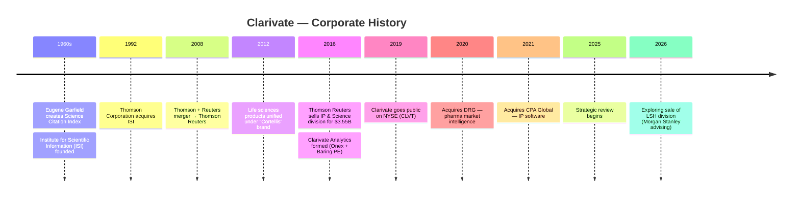
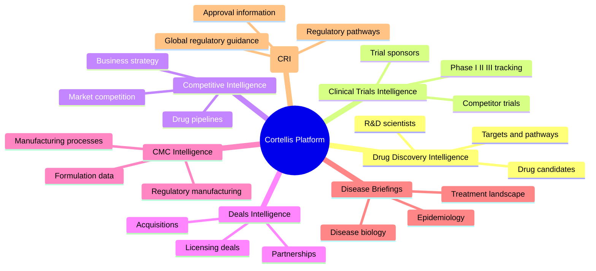
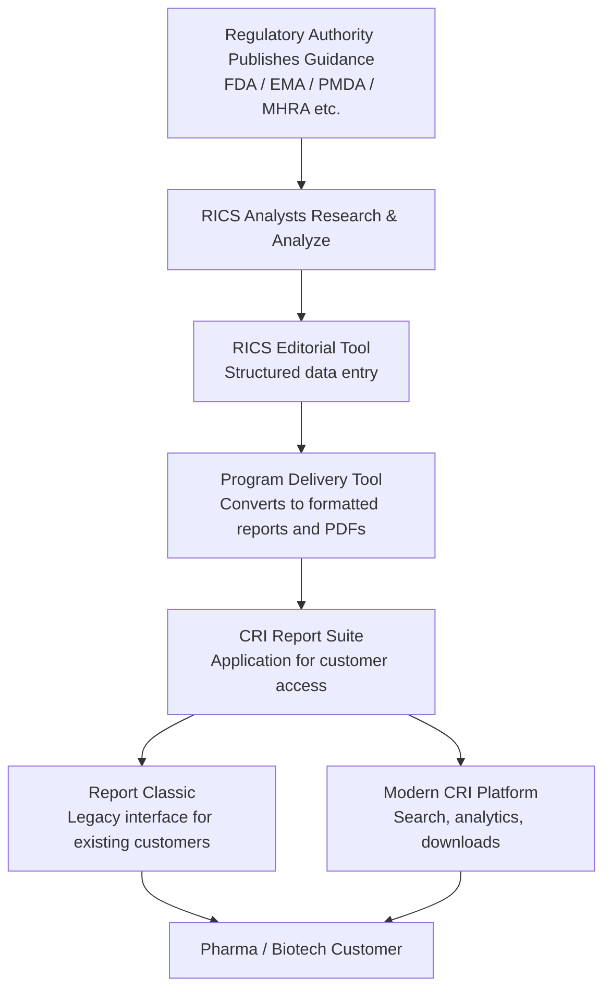
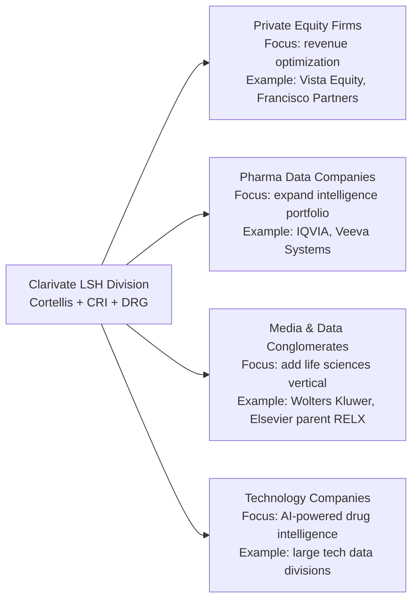
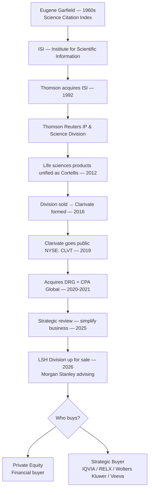

# Clarivate is Selling its Life Sciences Division — What You Need to Know

Clarivate — the global analytics company behind **Web of Science**, **Derwent Innovation**, and **Cortellis** — is now exploring the **sale of its Life Sciences & Healthcare (LSH) division**.

This is a major business event. LSH includes **Cortellis**, one of the most important pharma intelligence platforms in the world.

This post explains:
- What Clarivate is and where it came from
- What Cortellis and CRI are
- Why the LSH division is being sold
- Who the potential buyers are

---

## Part 1 — History of Clarivate

Clarivate did not appear out of nowhere. Its roots go back more than **60 years** to a scientist with a simple but powerful idea.

---

### 1960s — The Origin: Science Citation Index

A scientist named **Eugene Garfield** created the **Science Citation Index** (SCI).

The idea was brilliant:
> Instead of just listing scientific papers, track *how papers cite each other*.

This allowed researchers to see which papers were most influential — a completely new way of measuring scientific impact.

Garfield founded the **Institute for Scientific Information (ISI)**, which became the home of this growing database.

---

### 1992 — Thomson Acquires ISI

The media giant **The Thomson Corporation** saw the value in ISI and acquired it.

Over time, Thomson merged with Reuters to form **Thomson Reuters**, and the research business became a division called:

> **Intellectual Property (IP) & Science**

Products under this division included:

| Product | Purpose |
|---|---|
| Web of Science | Research citation database |
| EndNote | Reference management tool |
| Derwent Innovation | Patent analytics |
| Life sciences intelligence | (later branded as Cortellis) |

---

### 2016 — Thomson Reuters Sells the Division

In **2016**, Thomson Reuters decided this division was no longer core to its business.

It was sold to two private equity firms:

- **Onex Corporation**
- **Baring Private Equity Asia**

**Deal value: ~$3.55 billion**

This newly independent company was named **Clarivate Analytics** (later shortened to **Clarivate**).

All the products moved together — Web of Science, Derwent, and the life sciences databases that would become Cortellis.

---

### 2017–2019 — Expansion Phase

Clarivate began buying other companies to expand:

- **Publons** — research peer review platform
- **Kopernio** — research access tools

They also strengthened their patent analytics and research analytics products.

---

### 2019 — Clarivate Goes Public

Clarivate merged with a **SPAC (Special Purpose Acquisition Company)** and became publicly traded on the **NYSE** (New York Stock Exchange).

**Ticker: CLVT**

---

### 2020–2022 — Major Acquisitions into Life Sciences

Clarivate made two very important acquisitions:

- **DRG (Decision Resources Group)** — pharma market intelligence company
- **CPA Global** — intellectual property software

These deals significantly expanded the life sciences business, bringing in many new customers and datasets.

**Cortellis** became the flagship product of the **Life Sciences & Healthcare (LSH)** segment.

---

### 2025–2026 — Strategic Simplification

Clarivate leadership decided to **simplify** the business.

Their new strategy: focus purely on:
- **Intellectual Property** analytics
- **Academia & Government** analytics

To fund this focus and raise money, they began exploring the **sale of the LSH division**.

**Morgan Stanley** was hired to advise on the sale.

---

### Full Timeline

---

## Part 2 — What is Cortellis?

Many people confuse Clarivate's products. Here is the clear breakdown:

| Product | Segment |
|---|---|
| Web of Science | Academia & Government |
| EndNote | Research tools |
| Derwent Innovation | Intellectual Property |
| **Cortellis** | **Life Sciences & Healthcare** |

**Cortellis is completely different from Web of Science and Derwent.**

It is a **pharma and biotech intelligence platform** — a giant database of knowledge used by drug companies.

---

### What Does Cortellis Do?

Pharma and biotech companies use Cortellis to answer questions like:

- Which company is developing a drug for Alzheimer's?
- What phase is the clinical trial in?
- What regulatory pathway was used for a similar drug?
- Which competitors are entering the market?
- What were the terms of recent licensing deals?

Think of Cortellis as a **real-time pharma knowledge database + analytics platform** — covering drugs, trials, regulations, deals, and diseases.

---

### Cortellis Modules

Cortellis is divided into specialized intelligence modules:

---

### Was Cortellis Created by Clarivate?

**No.** The **underlying products existed during the Thomson Reuters era**.

Inside Thomson Reuters' IP & Science division, there were several life sciences databases and intelligence products:

- pharma pipeline intelligence
- regulatory intelligence
- disease intelligence reports
- pharma market research tools

Around **2012–2014**, Thomson Reuters unified these under a single platform brand: **"Cortellis"**.

When the division became **Clarivate in 2016**, Cortellis moved with it — along with all the teams and engineers.

---

## Part 3 — Cortellis Regulatory Intelligence (CRI)

Among all the Cortellis modules, **CRI is one of the most strategically important**.

---

### What is CRI?

CRI = **Cortellis Regulatory Intelligence**

It is a specialized module focused on **global drug regulatory information**.

Pharmaceutical companies use it to answer:

- What are the FDA guidelines for a gene therapy drug?
- What changed in EMA regulations for biosimilars?
- What are approval requirements in Japan or China?
- What regulatory pathway should we use for our new drug?

---

### Regulatory Authorities CRI Covers

| Country | Regulatory Authority |
|---|---|
| USA | FDA |
| Europe | EMA |
| Japan | PMDA |
| UK | MHRA |
| China | NMPA |
| India | CDSCO |
| + many others | Global coverage |

---

### What CRI Provides

**Regulatory guidance** — Rules issued by health authorities for clinical trials, drug approvals, and safety monitoring.

**Regulatory approvals** — Drug approvals, label changes, and safety updates across countries.

**Regulatory pathways** — Details about special routes like:
- Fast Track
- Breakthrough Therapy
- Orphan Drug Designation
- Accelerated Approval

**Country-specific frameworks** — The specific procedures and requirements in each major country.

---

### Why Regulatory Intelligence is Extremely Valuable

A single drug can cost:
- **$1–3 billion** to develop
- **10–15 years** of research

If a regulatory submission fails or gets delayed, a pharma company can lose **hundreds of millions of dollars**.

So companies pay high subscription fees for reliable regulatory intelligence — because it helps them avoid these disasters.

---

### CRI Subscription Cost (Approximate)

| Customer Size | Annual Subscription |
|---|---|
| Small biotech | $20,000 – $50,000 |
| Mid-size pharma | $50,000 – $150,000 |
| Large pharma | $200,000 – $500,000+ |

Enterprise contracts across multiple Cortellis modules can exceed **$1 million per year**.

---

### Who Uses CRI Inside Pharma Companies?

- **Regulatory Affairs teams** — Plan drug approval strategies
- **Clinical Development teams** — Design trials according to regulatory expectations
- **Corporate Strategy teams** — Monitor regulatory trends
- **Market Access teams** — Understand regulatory barriers before drug launch

---

## Part 4 — The RICS Team and Content Creation

Cortellis data does not appear by magic. There is a large team of experts creating the intelligence content.

---

### What is the RICS Team?

**RICS** (Research & Intelligence Content Services) is the internal team that:

- Researches regulatory announcements from health authorities
- Analyzes regulatory policy changes
- Writes structured intelligence reports
- Maintains regulatory datasets continuously

Their output becomes the data that customers search and read on the CRI platform.

---

### How CRI Content Gets Delivered — The Full Flow

Each layer serves a purpose:

| Layer | Purpose |
|---|---|
| RICS Editorial Tool | Analysts input and structure regulatory information |
| Program Delivery Tool | Transforms structured content into reports and PDFs |
| CRI Report Suite | Customer-facing application for accessing reports |
| Report Classic | Legacy interface maintained for enterprise customers |

---

### Why Legacy Systems Like "Report Classic" Still Exist

Cortellis systems evolved over **20+ years**.

Enterprise pharmaceutical customers configure their internal workflows around these platforms. Changing them is expensive. So Clarivate maintains older interfaces alongside modern ones.

This is why developers see many coexisting systems:
- CRI apps
- Report Classic
- Report Suite
- Content pipelines
- Delivery tools

---

### The Singularity Platform

**Singularity** is a critical, **AI-powered content technology platform** used by editorial teams and data analysts, primarily within the Life Sciences & Healthcare division.

It acts as a **centralized repository** for:

- Managing massive amounts of **unstructured data**
- Structuring and organizing that data for downstream use
- Enabling powerful **search across large content sets**
- Generating insights for **drug development and market intelligence**

In simple terms: Singularity is the backbone that helps the RICS and editorial teams work efficiently at scale — ingesting raw regulatory and life sciences content, making it structured, searchable, and usable across Cortellis products like CRI.

It is one of the most important internal platforms that will be inherited by the new buyer of the LSH division.

---

## Part 5 — The LSH Sale: Why is Clarivate Selling?

---

### The Business Reason

Clarivate has three main business segments:
1. **Intellectual Property** (patents, trademarks)
2. **Academia & Government** (Web of Science, research analytics)
3. **Life Sciences & Healthcare** (Cortellis, DRG)

The company has had a difficult few years:
- Share price declined significantly after 2022
- Heavy acquisition debt from DRG and CPA Global deals
- Analysts pushed for a simpler, more focused business

So Clarivate decided to **double down on IP and Academia** — and sell LSH to raise money and simplify operations.

---

### What is Being Sold?

The LSH division includes:
- Cortellis (all modules including CRI)
- DRG intelligence products
- Life sciences analytics teams
- Engineering teams supporting LSH
- Content teams (including RICS)

---

### Who are the Potential Buyers?

Several types of buyers are interested in a platform like Cortellis:

| Buyer Type | Why They Want It | Strength |
|---|---|---|
| **Private Equity** | Extract value from subscriptions, cut costs, sell later | Financial discipline |
| **IQVIA** | Biggest pharma data company globally — natural fit | Industry leader, massive integration potential |
| **RELX / Elsevier** | Already owns scientific publishing, LSH adds pharma intel | Content + data synergy |
| **Wolters Kluwer** | Strong in regulatory and legal data — CRI fits perfectly | Regulatory data expertise |
| **Veeva Systems** | Life sciences cloud platform — Cortellis adds intelligence layer | Industry relationships |
| **Vista / Francisco (PE)** | Proven track record buying data businesses | Operational efficiency |

---

### Which Buyer Would Be Best?

Depends on perspective:

**For customers** — A strategic buyer like **IQVIA or RELX** would likely invest more in the product and maintain quality.

**For employees** — A strategic buyer with existing life sciences operations would mean more opportunities and product investment. Private equity buyers often cut costs.

**For the product** — A buyer that understands pharma data (IQVIA, Wolters Kluwer) is better than purely financial buyers, because they understand the value of continuous investment in content and platform.

---

## Part 6 — Why CRI is the Crown Jewel of LSH

Among everything inside the LSH division, **CRI is considered especially valuable**.

Here is why:

### 1. Regulatory data is hard to replicate

You cannot simply scrape FDA.gov and call it intelligence. CRI value comes from:
- **Expert analysts** who interpret complex legal/regulatory documents
- **Continuous monitoring** across dozens of regulatory agencies worldwide
- **Structured intelligence** that converts raw documents into searchable, organized datasets

That takes years to build.

### 2. Pharma companies can't afford to miss regulatory changes

A single missed regulatory update can delay a drug launch by months — costing the company tens of millions.

So customers renew CRI subscriptions consistently. **Churn is very low.**

### 3. The subscription model creates stable revenue

High-value enterprise customers pay annually. Revenue is predictable.

### 4. CRI demand only grows

Regulations are getting more complex globally. More countries are developing their own regulatory frameworks. Pharma companies need more help navigating this.

---

## Summary — The Big Picture

---

### Key Takeaways

- Clarivate came from **Thomson Reuters' research and IP division**, sold in 2016 for $3.55 billion.
- **Cortellis** is Clarivate's pharma intelligence platform — it existed in Thomson Reuters' era and was unified under the Cortellis brand around 2012.
- **CRI (Cortellis Regulatory Intelligence)** is the module focused on global drug regulatory information — one of the most valuable and sticky datasets in the portfolio.
- **RICS teams** create the regulatory content that powers CRI.
- Clarivate is selling the **LSH division** to simplify its business and focus on IP and Academia segments.
- **Strategic buyers** like IQVIA, RELX, or Wolters Kluwer would likely be best for the product and customers.
- CRI is valuable because regulatory intelligence is hard to replicate, has low customer churn, and demand is growing globally.

