# The Complete Loan Guide

> **A simple story about ₹5 lakh, four confusing interest words, one gold box, and a credit card.**

Loans often look simple:

> “Interest rate: 8%.”

But that single number does **not** tell the whole story.

Before choosing a loan, you need answers to several questions:

- Is the rate **fixed** or **floating**?
- Is interest calculated using the **flat method** or the **reducing-balance method**?
- Is repayment through **EMI** or a **bullet payment**?
- Are there processing fees, insurance, foreclosure charges or other costs?
- What is the **APR**?
- What happens if you repay early?
- If it is a gold loan, does interest reduce when you repay part of the principal?
- If it is a credit-card EMI, is it really “no cost”?

This chapter explains all of these from the beginning.

---

# 1. Meet Arun and His ₹5 Lakh Question

Imagine Arun needs **₹5,00,000**.

He visits different lenders.

:::owl
**One says:** “7.9% flat.”
:::

:::duck{align="left"}
**Another says:** “11% reducing balance.”
:::

:::owl{align="left"}
**Another says:** “8.5% floating.”
:::

:::duck{align="left"}
**A gold-loan counter says:** “9% for one year, bullet repayment.”
:::

:::owl{align="left"}
**His credit card app says:** “Convert ₹50,000 purchase into 12 EMIs.”
:::

Arun is confused.

:::unicorn{align="right"}
**He asks:** “Why can't everyone just tell me how much the loan costs?”
:::

That is exactly the right question.

The first lesson is:

:::note[The interest-rate number alone is not enough.]
We need to know **how the rate behaves** and **how the interest is calculated**.
:::

# 2. There Are Two Different Questions

People often mix these four words:

- Fixed
- Floating
- Flat
- Reducing

But they answer **two different questions**.

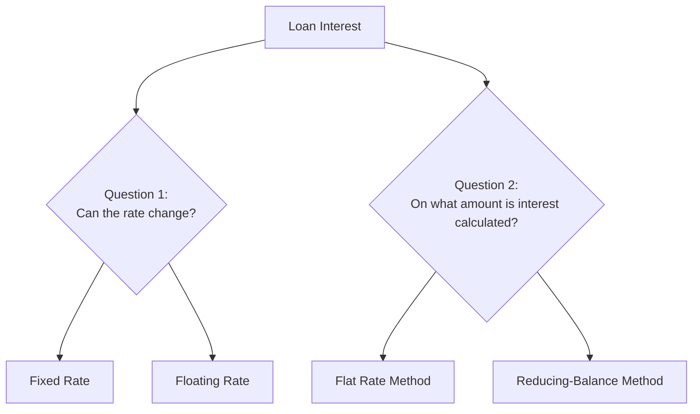

So:

> **Fixed vs Floating** = Will the interest rate itself change?

> **Flat vs Reducing Balance** = On which principal amount will interest be calculated?

A loan can therefore be:

- fixed + reducing balance
- floating + reducing balance
- fixed + flat
- in some products, other specially defined structures

> Do not treat “fixed” and “flat” as the same thing.

They are completely different ideas.

---

# 3. Fixed Interest Rate

A **fixed interest rate** means the contracted interest rate stays unchanged for the fixed period specified in the loan agreement.

Example:

> Loan: ₹5,00,000  
> Rate: 10% fixed  
> Tenure: 5 years

If the rate is genuinely fixed for the whole tenure, it remains 10% even if market interest rates move.

## Think of it like a fixed-price movie ticket

You buy a ticket for ₹250.

Even if ticket prices increase tomorrow, your already-purchased ticket still cost ₹250.

That is the idea behind a fixed rate.

## But check one important detail

Some loans may be marketed as “fixed” but the agreement may contain:

- a reset date,
- a fixed period followed by floating interest,
- a conversion clause,
- or other conditions.

So always ask:

> **“Is the rate fixed for the entire tenure, or only for an initial period?”**

---

# 4. Floating Interest Rate

A **floating interest rate** can move up or down during the loan tenure.

It is commonly linked to a benchmark.

A simplified structure is:

$$
\text{Loan Rate} = \text{Benchmark Rate} + \text{Spread}
$$

For example:

$$
8\% = 6.5\% + 1.5\%
$$

If the benchmark later becomes 7%:

$$
\text{New Rate} = 7\% + 1.5\% = 8.5\%
$$

The lender may respond to a rate increase by changing:

- the EMI,
- the remaining tenure,
- or sometimes both,

depending on the loan agreement and applicable rules.

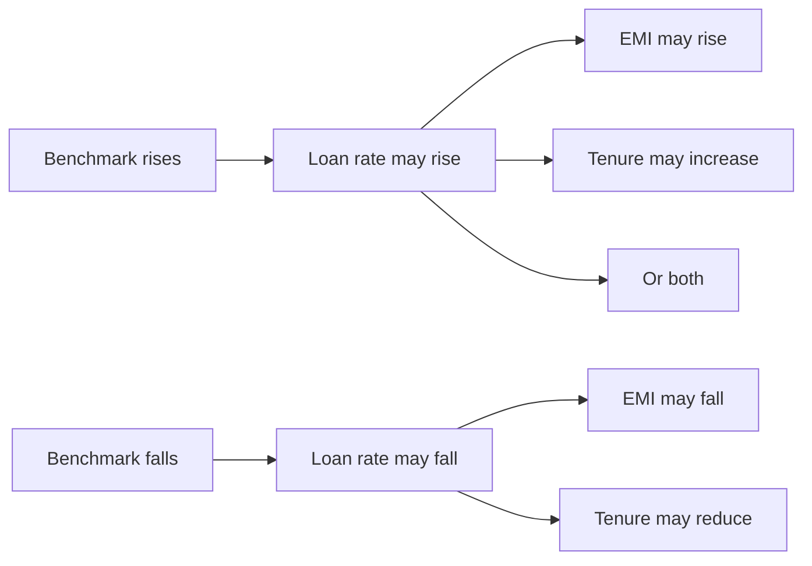

## Floating-rate loans can be useful when

- you have a long loan tenure,
- you are comfortable with rate changes,
- you expect rates may fall,
- or the product has favourable prepayment terms.

:::Danger[Main risk]

Your future cost is not fully known on day one.
:::

# 5. Flat-Rate Interest

Now we come to one of the most misunderstood terms.

In the **flat-rate method**, interest is calculated using the **original principal** for the agreed tenure.

Suppose:

- Principal = ₹5,00,000
- Flat rate = 8%
- Tenure = 5 years

The simplified flat-interest formula is:

$$
I = P \times R \times T
$$

where:

- $I$ = interest
- $P$ = original principal
- $R$ = annual interest rate in decimal form
- $T$ = tenure in years

So:

$$
I = 5,00,000 \times 0.08 \times 5
$$

$$
I = ₹2,00,000
$$

Total repayment:

$$
₹5,00,000 + ₹2,00,000 = ₹7,00,000
$$

For 60 months:

$$
EMI = \frac{₹7,00,000}{60}
$$

$$
EMI \approx ₹11,666.67
$$

## Why flat rate can be misleading

Imagine you have already repaid half the loan.

Your actual outstanding debt may have fallen significantly.

But the original flat-interest calculation was based on the original ₹5 lakh for the whole agreed tenure.

That is why a **small-looking flat percentage can represent a much higher borrowing cost** than the same numerical percentage on a reducing-balance loan.

---

# 6. Reducing-Balance Interest

The **reducing-balance method** calculates interest on the principal that is still outstanding.

This is also commonly called:

- **diminishing-balance method**
- **declining-balance method**
- **reducing-principal method**
- **outstanding-balance method**
- **diminishing-rate method** in casual banking language

If someone writes or says something like **“definition rate”**, they may actually mean **“diminishing rate”**. Always verify the original loan document rather than relying on an informal message.

## A simple example

Suppose you owe:

$$
₹5,00,000
$$

After several EMIs, the outstanding principal falls to:

$$
₹4,00,000
$$

Future interest is then calculated using approximately ₹4 lakh, not the original ₹5 lakh.

Later, when it falls to:

$$
₹3,00,000
$$

interest is calculated on the lower outstanding amount again.

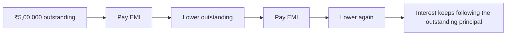

---

# 7. How a Reducing-Balance EMI Works

A normal EMI contains two parts:

$$
\text{EMI} = \text{Interest Part} + \text{Principal Part}
$$

At the beginning of a loan:

- outstanding principal is high,
- interest portion is relatively high,
- principal portion is relatively lower.

Later:

- outstanding principal becomes smaller,
- interest portion falls,
- more of the EMI goes toward principal.

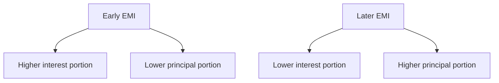

For a standard monthly reducing-balance loan, the EMI formula is:

$$
EMI =
P \times
\frac{r(1+r)^n}
{(1+r)^n - 1}
$$

where:

- $P$ = principal
- $r$ = monthly interest rate
- $n$ = total number of monthly instalments

If the annual rate is 12%:

$$
r = \frac{12\%}{12} = 1\% = 0.01
$$

---

# 8. Flat Rate vs Reducing Rate: Never Compare the Numbers Directly

Suppose one lender says:

> **8% flat**

and another says:

> **10% reducing**

You cannot conclude that 8% is cheaper simply because 8 is smaller than 10.

They are different calculation methods.

The right comparison is:

> **How many rupees will I actually receive, and how many rupees will I actually repay?**

Also compare the **APR**.

---

# 9. What Is APR?

**APR** means **Annual Percentage Rate**.

It is intended to represent the annualised cost of borrowing more comprehensively than the headline interest rate alone.

Depending on the product and applicable disclosure rules, the cost calculation may take account of relevant charges in addition to interest.

Think of it this way:

> **Interest rate = price written on the shelf.**

> **APR = closer to the total annualised cost after included borrowing charges.**

Always examine the lender's **KFS**.

---

# 10. What Is KFS?

**KFS** means **Key Facts Statement**.

It is the loan's summary sheet containing important information such as:

- loan amount,
- tenure,
- interest rate,
- type of interest,
- EMI,
- APR,
- charges,
- repayment schedule,
- and other important conditions.

Before accepting a loan, ask:

> **“Please give me the KFS and repayment schedule.”**

Do not rely only on a phone call, advertisement or chat message.

---

# 11. Fixed + Reducing Is Very Common

Suppose a personal loan says:

> 11.99% fixed for 5 years.

That can still be a **reducing-balance loan**.

“Fixed” tells you:

> 11.99% does not change.

“Reducing” tells you:

> Interest each period is calculated on the outstanding principal.

So the loan can be described as:

> **11.99% fixed-rate, reducing-balance loan.**

---

# 12. Is There an Equivalent Flat Rate?

You can calculate an **approximate equivalent flat rate** from the total interest paid.

Suppose:

- Principal = $P$
- Total interest over the full loan = $I$
- Tenure = $T$ years

Then:

$$
\text{Equivalent Flat Rate}
=
\frac{I}{P \times T} \times 100
$$

But be careful:

> There is no single universal conversion such as “12% reducing always equals 6% flat.”

The equivalent changes with:

- tenure,
- repayment frequency,
- fees,
- timing of payments,
- and loan structure.

So calculate it for the actual loan.

---

# 13. What Is Bullet Repayment?

A **bullet repayment** means a large part—often the entire principal—is paid at the end rather than gradually through monthly principal repayments.

Imagine borrowing ₹5 lakh for one year.

Instead of reducing the principal every month:

```text
Month 1   ₹5,00,000 outstanding
Month 2   ₹5,00,000 outstanding
Month 3   ₹5,00,000 outstanding
...
Month 12  ₹5,00,000 outstanding
```

At maturity, you repay the principal according to the product terms.

That is a bullet structure.

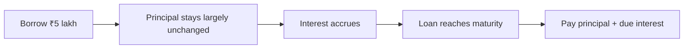

---

# 14. Is Bullet Repayment the Same as Flat Interest?

**No.**

This is a very important distinction.

- **Bullet** describes **when principal is repaid**.
- **Flat/reducing** describes **how interest is calculated**.

Suppose a one-year bullet loan is ₹5 lakh at 9%.

If you make **no principal repayment during the year**, then approximately:

$$
₹5,00,000 \times 9\% = ₹45,000
$$

The result looks like flat interest because the outstanding principal remained ₹5 lakh for the whole year.

But technically, the loan can still calculate interest on the **outstanding balance**.

The difference becomes obvious if you make a principal part-payment.

---

# 15. Part-Payment in a Bullet Gold Loan

Suppose:

- Gold loan = ₹5,00,000
- Interest = 9% p.a.
- Tenure = 1 year

For the first six months:

$$
₹5,00,000 \times 9\% \times \frac{6}{12}
=
₹22,500
$$

After six months, you pay ₹2 lakh **toward principal**.

New outstanding:

$$
₹5,00,000 - ₹2,00,000 = ₹3,00,000
$$

Approximate interest for the remaining six months:

$$
₹3,00,000 \times 9\% \times \frac{6}{12}
=
₹13,500
$$

Approximate total:

$$
₹22,500 + ₹13,500 = ₹36,000
$$

Without the principal part-payment:

$$
₹5,00,000 \times 9\% = ₹45,000
$$

So the part-payment could reduce interest by approximately:

$$
₹45,000 - ₹36,000 = ₹9,000
$$

Actual interest depends on the lender's day-count, repayment dates and product rules.

Always confirm that a payment is being applied to **principal**, not merely toward accrued interest.

---

# 16. Gold / Jewel Loan and “Swarna” Loan

A gold loan is a **secured loan**.

You pledge eligible gold jewellery as security.

Some lenders use product names containing words such as **“Swarna”**, which simply refers to gold. The important thing is not the product name; it is the actual repayment structure written in the loan agreement.

A “Swarna”-style jewel loan may therefore be:

- a bullet-repayment gold loan,
- a monthly-interest gold loan,
- an EMI-style gold loan,
- an overdraft-style facility,
- or another structure.

Always ask what **your exact scheme** requires.

The lender gives you money based partly on the assessed value and eligible **LTV**.

## LTV

**LTV** means **Loan-to-Value ratio**.

Simplified example:

If eligible gold value is:

$$
₹8,00,000
$$

and the applicable LTV allows 75%:

$$
₹8,00,000 \times 75\% = ₹6,00,000
$$

The lender may lend up to the applicable eligible amount, subject to its rules and regulation.

The gold remains pledged until the loan and applicable dues are settled.

---

# 17. One-Year Gold Loan With Bullet Repayment

A common structure for some gold-loan products is:

- short tenure, often up to around one year,
- interest accrues during the tenure,
- principal is due at maturity,
- interest may be serviced periodically or together with principal depending on the scheme.

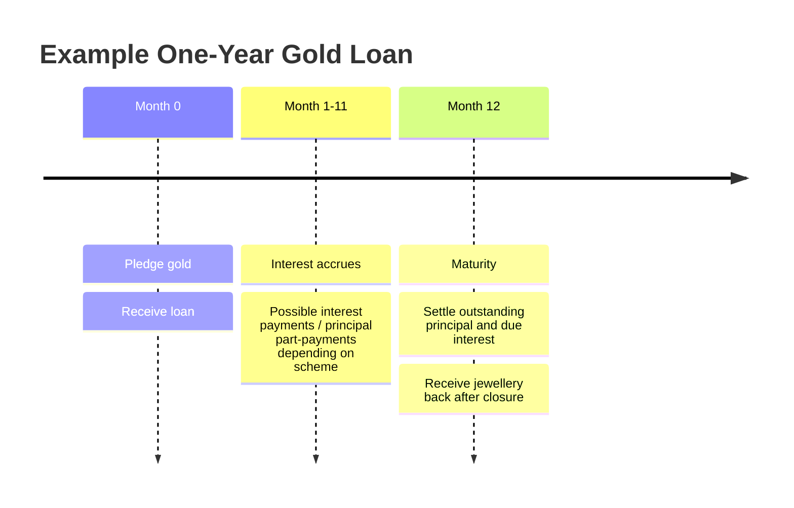

## If you want to continue after maturity

Do not assume the loan automatically rolls over.

Renewal may involve:

- repayment or adjustment of accrued interest,
- fresh valuation of the jewellery,
- current LTV rules,
- fresh documentation,
- applicable charges,
- and the lender's current eligibility rules.

Ask:

> **“At maturity, if I want to continue with the same pledged jewellery, what exactly must I pay and what gets re-sanctioned?”**

---

# 18. When a Gold Bullet Loan Can Be Useful

A short-term bullet loan can make sense when you have a **known future source of repayment**.

Example:

> “I need ₹5 lakh now, but I know I will receive ₹5.5 lakh from a maturity/payment in eight months.”

Then a one-year secured loan may be practical.

But consider another story:

> “I need ₹5 lakh now, and I have no idea how I will repay ₹5 lakh next year.”

Now the bullet structure can become dangerous.

You may reach maturity with almost the entire principal still outstanding.

So:

> **Low monthly burden does not mean low repayment risk.**

---

# 19. EMI Loan vs Bullet Loan

| Feature | EMI Loan | Bullet Loan |
|---|---|---|
| Principal repayment | Gradually every month | Mostly/all at maturity |
| Outstanding principal | Keeps falling | Can remain high |
| Monthly cash burden | Higher | Often lower |
| Maturity burden | Usually small/none after final EMI | Potentially very large |
| Interest benefit from principal reduction | Automatic | Only if part-payment is allowed and made |
| Good for | Salary-based regular repayment | Short-term need with known repayment source |
| Main risk | Long tenure can increase total interest | Large lump sum due later |

---

# 20. Personal Loan

**PL** means **Personal Loan**.

A typical PL is:

- unsecured,
- repaid through EMIs,
- often fixed-rate,
- commonly reducing-balance,
- usually more expensive than a comparable secured loan because the lender does not hold an asset as security.

Before accepting a PL, check:

1. reducing or flat rate?
2. fixed or floating?
3. APR?
4. processing fee?
5. insurance?
6. amount actually credited?
7. foreclosure charge?
8. part-payment rules?
9. lock-in period?
10. late-payment / penal charges?
11. repayment schedule?

---

# 21. Home Loan

A home loan is usually much longer than a personal loan.

That makes small differences in rates very important.

For a home loan, check:

- fixed or floating,
- benchmark,
- spread over benchmark,
- reset frequency,
- whether EMI or tenure changes after a reset,
- conversion options,
- processing fee,
- legal and valuation charges,
- mortgage-related charges where applicable,
- prepayment rules,
- insurance,
- staged-disbursement rules,
- pre-EMI interest for under-construction property,
- total sanctioned amount vs actual disbursement.

## Why tenure matters

A lower EMI obtained by extending the tenure can feel comfortable today but can increase total interest significantly.

Never ask only:

> “What is my EMI?”

Also ask:

> **“What is my total repayment if I continue for the full tenure?”**

---

# 22. Credit Card EMI

Now Arun buys a television for ₹60,000.

The credit card offers:

> “Convert to 12-month EMI.”

Credit-card EMI is another loan-like repayment structure.

There are two broad cases.

---

# 23. Interest-Bearing Credit Card EMI

Suppose:

- Purchase = ₹60,000
- EMI tenure = 12 months
- Interest = stated annual rate

The issuer converts the transaction into instalments.

Each EMI may include:

- principal,
- interest,
- applicable fees/taxes.

Before converting, check:

- annual interest / APR,
- processing fee,
- foreclosure charge,
- applicable taxes,
- total of all instalments,
- how much credit limit remains blocked,
- when the limit is restored,
- what happens on missed payment.

Do not compare credit-card EMI merely by looking at the monthly EMI.

Compare:

$$
\text{Total Cost}
=
\text{All EMIs}
+
\text{Fees}
+
\text{Applicable Taxes}
-
\text{Any Genuine Discount}
$$

---

# 24. What Is “No-Cost EMI”?

“No-cost EMI” does **not necessarily mean that no interest calculation exists behind the scenes**.

A common structure is:

1. the card issuer calculates EMI interest;
2. the merchant/platform gives an upfront discount intended to offset that interest;
3. the customer effectively pays approximately the original product price through instalments, subject to fees/taxes/terms.

Simplified example:

Product price:

$$
₹60,000
$$

Suppose calculated EMI interest is approximately:

$$
₹3,000
$$

Merchant discount:

$$
₹3,000
$$

Then the discount offsets the interest:

$$
₹60,000 - ₹3,000 + ₹3,000 = ₹60,000
$$

But you must still check:

- processing fee,
- applicable taxes,
- loss of another cash/instant discount,
- foreclosure fee,
- whether the “discount” fully offsets interest.

The card issuer should clearly show the principal, interest and upfront discount when converting transactions to EMI rather than hiding an interest-bearing conversion behind a “no-cost” label.

---

# 25. Credit Card EMI vs Revolving Credit Card Balance

These are **not the same**.

If you simply pay only the **Minimum Amount Due (MAD)** on a normal credit-card bill, the remaining balance can attract high finance charges.

**MAD** = Minimum Amount Due.

That is very different from a planned transaction EMI.

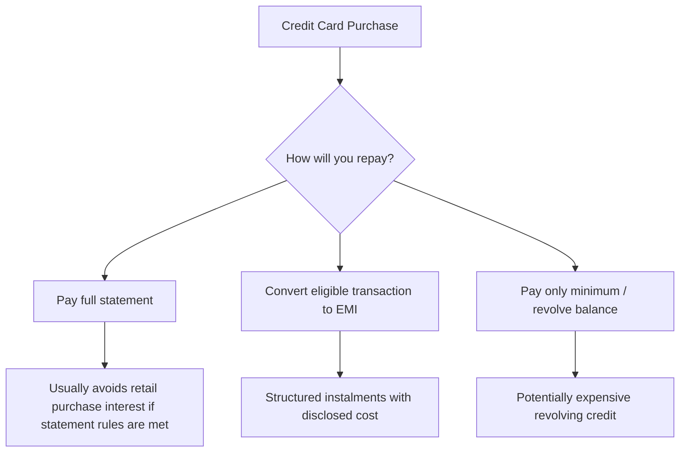

Paying only the minimum due repeatedly is generally not a strategy for cheaply financing a purchase.

---

# 26. The Most Important Loan Comparison Formula

Forget the advertisement for a moment.

Write these four numbers down:

1. **Cash you actually receive**
2. **Total of all repayments**
3. **All compulsory charges**
4. **How quickly principal falls**

A useful practical measure is:

$$
\text{Total Borrowing Cost}
=
\text{Total Repayments}
+
\text{Compulsory Upfront/Periodic Charges}
-
\text{Net Cash Received}
$$

This is not a replacement for APR, but it helps you understand the rupee cost.

---

# 27. Example: ₹5 Lakh Loan

Imagine two offers.

## Offer A

- ₹5 lakh
- 8% flat
- 5 years

Interest:

$$
₹5,00,000 \times 8\% \times 5
=
₹2,00,000
$$

Total:

$$
₹7,00,000
$$

Approximate EMI:

$$
₹7,00,000 / 60
=
₹11,666.67
$$

## Offer B

- ₹5 lakh
- reducing-balance loan
- rate shown separately in the KFS
- EMI calculated using the outstanding principal

Even if Offer B has a numerically higher headline rate, it can still be cheaper than Offer A.

That is why:

> **Never compare flat % directly with reducing %.**

---

# 28. Which Type Is “Good”?

There is no single loan type that is always best.

Instead ask:

> **Which structure matches my repayment ability at the lowest reasonable total cost and risk?**

## A reducing-balance loan is generally easier to understand for long-term EMI borrowing

Because principal falls with each repayment and interest follows the outstanding balance.

## A fixed rate is useful when

you want predictable repayments and protection from future rate increases.

## A floating rate is useful when

you are comfortable with changes and want the possibility of benefiting when benchmark rates decline.

## A bullet loan is useful when

you genuinely expect a lump sum within the short loan tenure.

## A bullet loan is risky when

you are using it only because the monthly payment looks small but have no plan for the final principal.

---

# 29. The “Kid Test”

Imagine borrowing 10 chocolates.

## Flat method

The lender says:

> “I will calculate my charge as if you had all 10 chocolates for the entire agreed period.”

Even after you start returning some chocolates, the original calculation was based on 10.

## Reducing balance

You return 2 chocolates.

Now you owe 8.

The next charge is based on 8.

Return 3 more.

Now you owe 5.

The next charge is based on 5.

## Fixed rate

The price charged per chocolate does not change.

## Floating rate

The price charged per chocolate can change according to an agreed reference.

## Bullet repayment

You keep all 10 chocolates until near the end and return them together.

That is why the final payment is big.

---

# 30. Loan Decision Tree

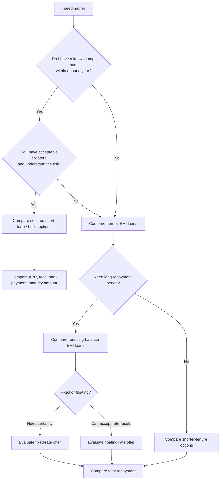

---

# 31. Questions to Ask Before Signing Any Loan

Take this checklist with you.

## Interest

- What is the annual interest rate?
- Is it fixed or floating?
- Is it flat or reducing balance?
- If reducing, is it daily, monthly or another rest basis?
- What is the APR?
- If floating, what is the benchmark?
- What is the spread?
- How frequently can the rate reset?

## Money

- What is the sanctioned amount?
- What is the actual amount credited to me?
- What are the processing charges?
- What are the applicable taxes?
- Is insurance added?
- Are there valuation/legal/documentation charges?

## Repayment

- What is the EMI?
- How many EMIs?
- What is total repayment?
- Can I part-pay?
- Does part-payment reduce tenure, EMI, or both?
- Is there a lock-in period?
- What is the foreclosure charge?
- What happens if I pay late?

## Bullet / Gold Loan

- When is interest due?
- When is principal due?
- Can I pay principal during the year?
- Will future interest reduce after part-payment?
- Is there a charge for part-payment?
- Can part of the jewellery be released after part-payment?
- What happens at maturity?
- Can the facility be renewed?
- Is fresh valuation required?
- What happens if gold value falls significantly?
- What are the auction/default rules?

## Credit Card EMI

- What is the APR?
- Is this interest-bearing or no-cost EMI?
- What merchant discount offsets the interest?
- What is the processing fee?
- What taxes apply?
- What is the total of all EMIs?
- What is the foreclosure charge?
- How much card limit will remain blocked?

---

# 32. Red Flags

Be careful if someone says only:

> “Sir, only 7.9%!”

Ask:

> “7.9% **what**?”

You need to know:

- flat or reducing?
- fixed or floating?
- annual or monthly?
- APR?
- fees?
- tenure?
- total repayment?

Other warning signs:

- only EMI is disclosed, not total repayment;
- flat rate is compared directly with another lender's reducing rate;
- compulsory insurance is hidden inside the loan;
- processing fees are deducted but ignored when describing the cost;
- “no-cost EMI” is advertised without explaining fees/discount;
- bullet repayment is offered without clearly explaining the maturity amount;
- verbal promises differ from the KFS or loan agreement.

---

# 33. Important Abbreviations

| Abbreviation | Full Form | Meaning |
|---|---|---|
| **EMI** | Equated Monthly Instalment | Regular monthly loan payment |
| **ROI / RoI** | Rate of Interest | Interest rate charged on the loan |
| **APR** | Annual Percentage Rate | Annualised measure of borrowing cost as disclosed under applicable rules |
| **KFS** | Key Facts Statement | Standard summary of important loan facts and costs |
| **PL** | Personal Loan | Usually unsecured loan for personal use |
| **HL** | Home Loan | Loan generally used for purchase/construction of a home |
| **LTV** | Loan-to-Value | Loan amount compared with value of pledged/financed asset |
| **MAD** | Minimum Amount Due | Minimum credit-card payment required by the statement |
| **NPA** | Non-Performing Asset | A loan/account classified as non-performing under applicable rules |
| **p.a.** | Per Annum | Per year |
| **T&C** | Terms and Conditions | Contractual rules of the product |

---

# 34. Other Names for Reducing Balance

You may encounter different wording.

These often refer to broadly the same core idea of charging interest on the outstanding principal:

- reducing balance
- reducing principal
- diminishing balance
- diminishing principal
- declining balance
- outstanding balance
- monthly reducing balance
- daily reducing balance

However, **monthly reducing** and **daily reducing** are not mathematically identical because the frequency/timing of interest calculation differs.

Always read the exact product definition.

---

# 35. Monthly Rest, Daily Rest and Annual Rest

A **rest** describes how frequently the interest calculation recognises changes in outstanding balance.

## Monthly rest

Interest calculation is updated monthly.

## Daily rest

Interest is based on the outstanding amount for the relevant number of days.

If you make an early principal payment, a daily-rest structure may recognise the lower balance sooner than a structure that waits for the next monthly calculation date, depending on product rules.

This is another reason why two loans showing the same annual rate can produce slightly different total interest.

---

# 36. Longer Tenure: Friend and Enemy

Longer tenure:

✅ reduces EMI

but

❌ usually increases total interest.

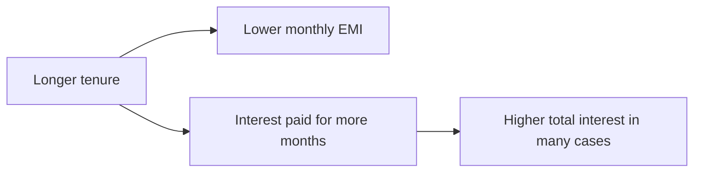

Shorter tenure:

✅ higher EMI

but

✅ usually lower total interest if you can comfortably afford it.

Never choose the shortest tenure if it makes your monthly budget unsafe.

---

# 37. Part-Payment: A Powerful Tool

On a reducing-balance loan, principal part-payment can save future interest.

Suppose outstanding principal is:

$$
₹10,00,000
$$

You make a principal part-payment:

$$
₹2,00,000
$$

New outstanding:

$$
₹8,00,000
$$

Future interest is then calculated using the lower outstanding balance according to the product terms.

This is why borrowers should check:

- part-payment charges,
- minimum part-payment amount,
- number of permitted part-payments,
- lock-in period,
- whether EMI or tenure is reduced.

If you can choose, reducing **tenure** while keeping EMI affordable can often save more total interest than merely reducing the EMI, because the loan ends sooner.

---

# 38. Foreclosure

**Foreclosure** means closing the entire loan before its scheduled final date.

Example:

Outstanding:

$$
₹3,50,000
$$

You pay the required closure amount.

The lender closes the loan.

Before doing this, check:

- foreclosure fee,
- applicable taxes,
- accrued interest until closure date,
- lock-in conditions,
- closure/NOC documentation.

---

# 39. Secured vs Unsecured Loan

## Secured loan

Backed by collateral.

Examples can include:

- home loan,
- vehicle loan,
- gold/jewel loan.

Because the lender has security, rates may be lower than comparable unsecured borrowing.

But the asset is at risk if the borrower fails to meet obligations.

## Unsecured loan

No specific pledged asset backs the loan.

Personal loans and many credit-card borrowings are common examples.

Rates can be higher because lender risk is higher.

---

# 40. The Best Way to Compare Two Loans

Create a table like this before choosing:

| Item | Loan A | Loan B |
|---|---:|---:|
| Amount sanctioned |  |  |
| Net amount received |  |  |
| Fixed / Floating |  |  |
| Flat / Reducing |  |  |
| Annual interest |  |  |
| APR |  |  |
| Tenure |  |  |
| EMI |  |  |
| Total of EMIs/payments |  |  |
| Processing fee |  |  |
| Insurance |  |  |
| Other compulsory charges |  |  |
| Part-payment charge |  |  |
| Foreclosure charge |  |  |
| Total borrowing cost |  |  |
| Security required |  |  |
| Maturity lump sum |  |  |

The “smaller interest-rate number” does **not** automatically win.

---

# 41. A Simple Rule for Choosing

Use this order:

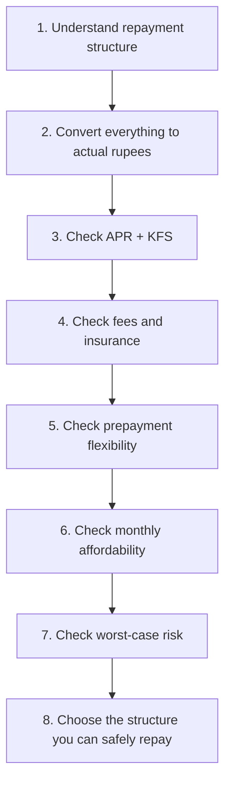

The “best” loan is not simply:

> lowest EMI

or:

> lowest advertised percentage.

A better loan is one whose:

- calculation method you understand,
- total cost is competitive,
- repayment fits your cash flow,
- fees are transparent,
- prepayment conditions are reasonable,
- and risks are acceptable.

---

# 42. Final Story: Arun Now Knows What to Ask

Arun returns to the lender.

This time, when someone says:

> “7.9%!”

he smiles and asks:

> “Flat or reducing?”

Then:

> “Fixed or floating?”

Then:

> “What is the APR?”

Then:

> “Show me the KFS.”

Then:

> “How much money will actually reach my account?”

Then:

> “What is the total amount I will repay?”

For the gold loan he asks:

> “If I repay principal after six months, will future interest be calculated on the reduced principal?”

For the credit-card EMI he asks:

> “Show me the interest, merchant discount, processing fee, taxes and total of all instalments.”

Now the salesperson cannot confuse Arun with one small percentage.

Because Arun understands the most important rule of borrowing:

> **Do not borrow based on the rate printed in big letters. Borrow only after understanding how the money moves from the first day to the last day.**

---

# 43. One-Page Memory Summary

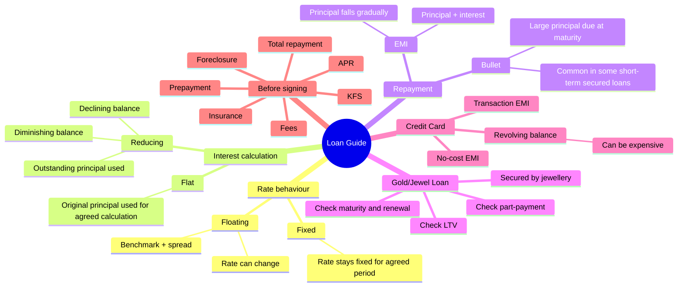

---

# 44. Final Golden Rules

1. **Fixed is not the same as flat.**
2. **Floating is not the same as reducing.**
3. **Flat and reducing rates cannot be compared only by their percentage numbers.**
4. **Bullet repayment describes when principal is paid, not how interest is calculated.**
5. **A one-year bullet loan may look mathematically like flat interest if principal never reduces, but that does not automatically make it a flat-rate loan.**
6. **Principal part-payment can reduce future interest when the product calculates interest on outstanding principal and allows such part-payment.**
7. **The lowest EMI is not always the cheapest loan.**
8. **The lowest advertised interest number is not always the cheapest loan.**
9. **Check APR, KFS, fees and total repayment.**
10. **For a bullet loan, know exactly where the maturity money will come from before borrowing.**
11. **For a floating loan, understand what happens when the benchmark rises.**
12. **For credit-card EMI, check the total cost—not just the “no-cost” label.**
13. **Always read the loan agreement and current product terms before signing.**

---

# Regulatory Notes and Further Reading

This guide is educational and uses simplified examples. Actual interest can vary with exact disbursement date, day-count convention, rest frequency, repayment date, taxes, fees and product rules.

Useful official regulatory references for India:

- Key Facts Statement / all-in loan cost guidance:  
  https://www.rbi.org.in/scripts/AnnualReportPublications.aspx?Id=1436
- Fixed and floating interest-rate framework:  
  https://systemhealth.rbi.org.in/Scripts/BS_ViewMasDirections.aspx_id%3D10295.html
- Floating-rate EMI reset guidance and borrower options:  
  https://www.rbi.org.in/scripts/FAQView.aspx/FAQView.aspx/FAQView.aspx?Id=170
- Credit-card EMI transparency and APR requirements:  
  https://systemhealth.rbi.org.in/Scripts/BS_ViewMasDirections.aspx_id%3D12300.html
- Regulatory example of gold-loan bullet repayment structure:  
  https://www.rbi.org.in/scripts/NotificationUser.aspx?Id=12827

> **Important:** Loan products and regulations can change. Use this article to understand the concepts, then verify the latest KFS, sanction letter, repayment schedule and product terms before borrowing.
