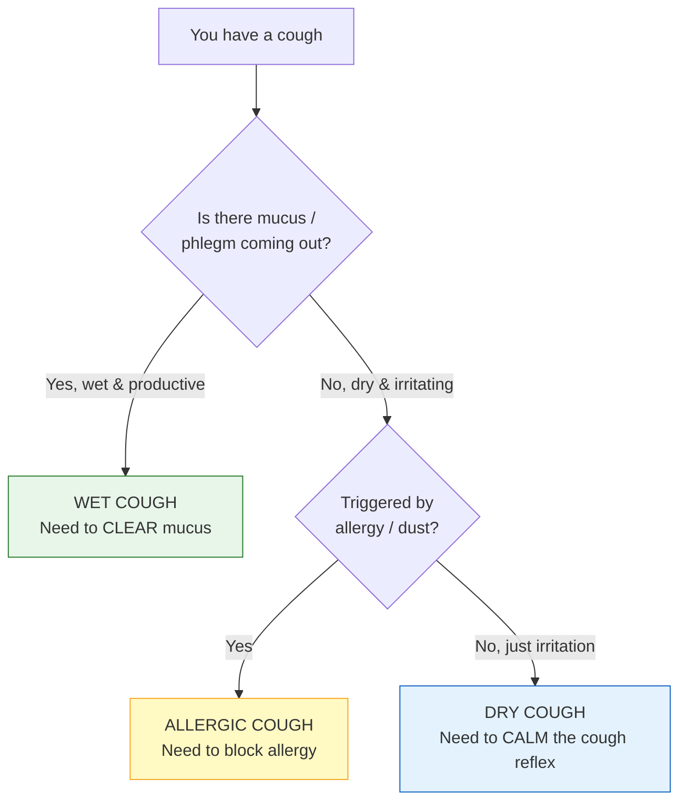
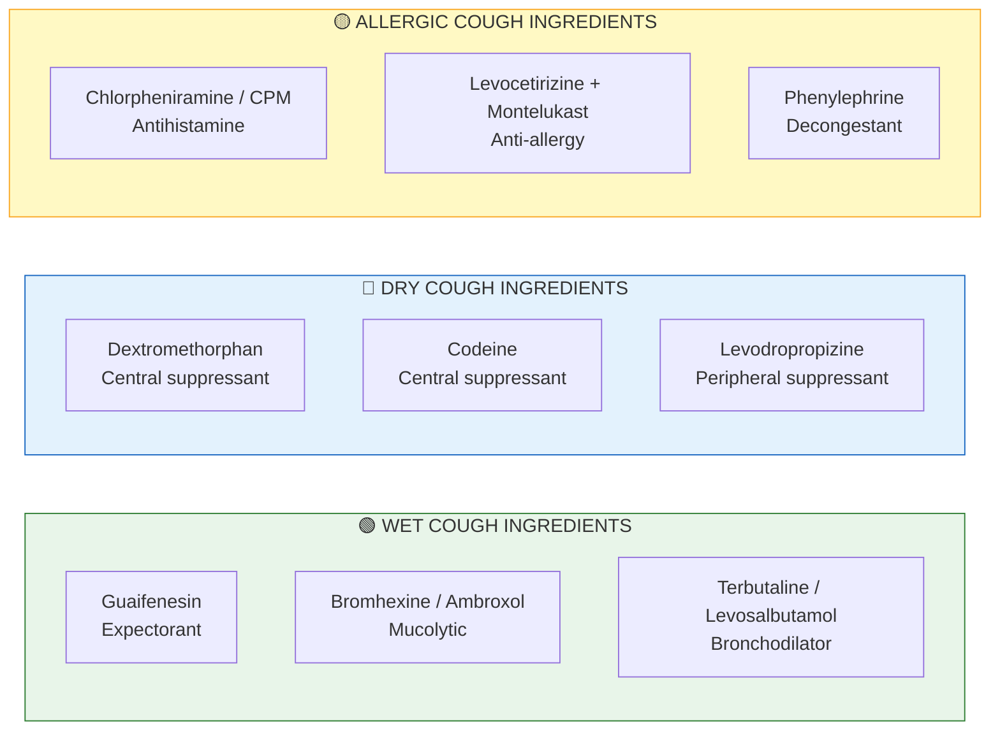
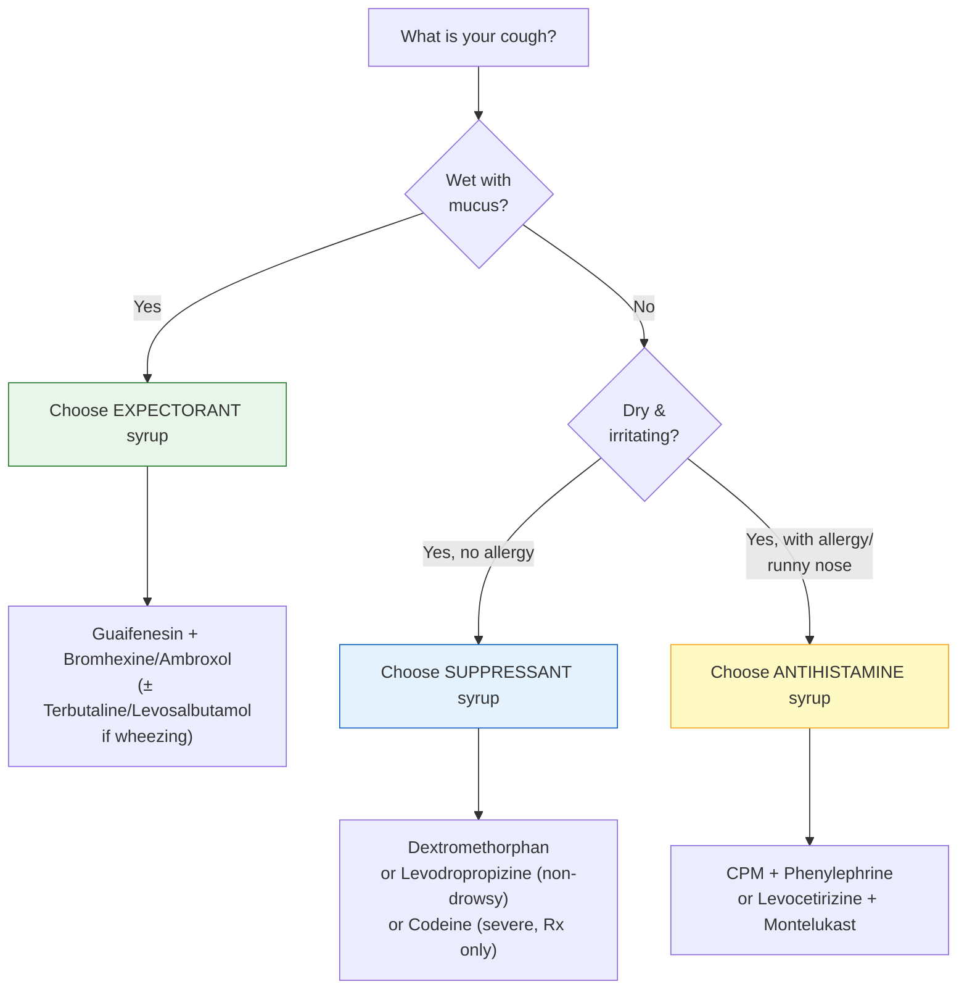

import Highlight from "@/react/Highlight/Highlight.jsx";

# Cough Syrup Decoded 🧪💊

Walk into any pharmacy with a cough and you'll be handed one of a dozen different bottles — each with a long, confusing name printed on the label. The secret is this: **the brand name doesn't matter — the salt composition does.** Once you learn to read the ingredients, you can tell exactly what a syrup does and whether it's right for *your* cough.

This guide decodes cough syrups the way a doctor does, inspired by Dr. Prakash Murthy's popular Tamil explainer reel.

:::note[📋 Important Medical Disclaimer]

This guide is for **educational purposes only**. It is NOT a substitute for professional medical advice.

- ✅ Always consult a doctor or pharmacist before choosing a cough syrup
- ✅ Read the salt composition printed on the label
- ✅ Be extra careful with syrups for **children** and the **elderly**
- ❌ Never mix a "dry cough" syrup with a "wet cough" syrup
- ❌ Never give codeine-based syrups to young children

**தமிழ் குறிப்பு:** இந்த தகவல் கல்வி நோக்கத்திற்காக மட்டுமே. இருமல் மருந்து எடுப்பதற்கு முன் மருத்துவரை அணுகவும். குழந்தைகளுக்கு மிகவும் கவனமாக இருங்கள்.

:::

---

## <Highlight color='#C0392B' highlight='fg' fontWeight='bold'> Step 1: First Identify Your Type of Cough </Highlight>

Before you look at any syrup, you must know **what kind of cough** you have. This single decision determines which ingredients you need.

| Cough Type | Feels Like | Goal of Treatment |
|------------|-----------|-------------------|
| **Wet (Productive)** | Mucus/phlegm, chest congestion, "rattly" | **Loosen & clear** the mucus |
| **Dry (Non-productive)** | Tickly, irritating, no phlegm, hurts throat | **Suppress** the cough reflex |
| **Allergic** | Dry cough with sneezing, runny nose, itchy throat | **Block the allergy** trigger |

:::danger[The #1 Mistake]
**Never suppress a wet cough.** A productive cough is your body clearing mucus from the lungs. If you take a cough *suppressant* for a wet cough, the mucus stays trapped and infection can worsen. Match the syrup to the cough!
:::

---

## <Highlight color='#8E44AD' highlight='fg' fontWeight='bold'> Step 2: Learn the 5 Building Blocks (Salt Categories) </Highlight>

Almost every cough syrup is a mix of ingredients from these **five families**. Learn these, and you can decode any label.

| Family | What It Does | Common Salts | For Which Cough |
|--------|--------------|--------------|-----------------|
| **1. Expectorants** | Loosen mucus so it's easier to cough out | Guaifenesin | Wet cough |
| **2. Mucolytics** | Thin & break down thick mucus | Bromhexine, Ambroxol | Wet cough |
| **3. Bronchodilators** | Open up narrowed airways (relieve wheezing) | Terbutaline, Levosalbutamol, Salbutamol | Wet cough with wheeze |
| **4. Cough Suppressants (Antitussives)** | Calm the cough reflex | Dextromethorphan, Codeine, Levodropropizine | Dry cough |
| **5. Antihistamines / Decongestants** | Block allergy & clear a blocked nose | Chlorpheniramine (CPM), Levocetirizine, Montelukast, Phenylephrine | Allergic cough |

---

## <Highlight color='#16A085' highlight='fg' fontWeight='bold'> Step 3: Decoding the Common Syrup Combinations </Highlight>

Now let's decode the exact combinations Dr. Murthy shows in the reel — the ones you'll actually see on pharmacy shelves.

### <Highlight color='#2e7d32' highlight='fg' fontWeight='bold'> 🟢 For WET Cough — Expectorant Combinations </Highlight>

These syrups **loosen, thin, and push out** mucus. Often they add a bronchodilator to open the airways too.

**Terbutaline + Bromhexine + Guaifenesin**
- **Terbutaline:** Bronchodilator — opens narrowed airways (helps wheezing)
- **Bromhexine:** Mucolytic — thins thick mucus
- **Guaifenesin:** Expectorant — helps you cough the mucus out
- **Decode:** This is an **expectorant syrup** for a **wet, chesty cough with tightness**

---

**Terbutaline + Ambroxol + Guaifenesin**
- **Terbutaline:** Bronchodilator
- **Ambroxol:** Mucolytic (stronger cousin of bromhexine) — dissolves sticky mucus
- **Guaifenesin:** Expectorant
- **Decode:** Same idea as above — a **wet-cough expectorant**, using ambroxol instead of bromhexine

---

**Levosalbutamol + Ambroxol + Guaifenesin**
- **Levosalbutamol:** Bronchodilator (opens airways, relieves wheeze)
- **Ambroxol + Guaifenesin:** Thin and clear mucus
- **Decode:** A **wet-cough syrup** especially useful when there is **wheezing with mucus**

:::tip[How to Recognise a Wet-Cough Syrup]
If you see **Guaifenesin, Bromhexine, or Ambroxol** on the label → it is meant to **clear mucus** → it is for a **WET / productive cough**.
:::

---

### <Highlight color='#1565c0' highlight='fg' fontWeight='bold'> 🔵 For DRY Cough — Cough Suppressant Combinations </Highlight>

These **calm the cough reflex** so an irritating, tickly dry cough stops. Most act **centrally** (on the brain's cough centre).

**Dextromethorphan + Phenylephrine**
- **Dextromethorphan (DMP):** Centrally acting cough suppressant — signals the brain to reduce coughing
- **Phenylephrine:** Decongestant — clears a blocked nose
- **Decode:** A **dry-cough syrup** that also relieves nasal blockage

:::note[As the doctor explains]
*"Both of these are centrally acting cough suppressants — meaning both go to the brain and give a signal to reduce coughing."* Dextromethorphan and codeine both work on the **brain's cough centre**.
:::

---

**Levodropropizine**
- **Levodropropizine:** A **peripherally** acting cough suppressant — works on the sensory nerves in the airways rather than the brain
- **Decode:** A **dry-cough syrup** that is **non-drowsy** (a big advantage over central suppressants), often preferred when you need to stay alert

---

**Codeine-based syrups**
- **Codeine:** A strong centrally acting suppressant (opioid)
- **Decode:** For **severe dry cough** — but **prescription-controlled**, sedating, and **never for young children**

:::danger[Dry-Cough Caution]
Cough suppressants like **dextromethorphan and codeine cause drowsiness**. Avoid driving, avoid alcohol, and **never give them to a wet/productive cough** — the mucus needs to come out, not be trapped.
:::

---

### <Highlight color='#f9a825' highlight='fg' fontWeight='bold'> 🟡 For ALLERGIC Cough — Antihistamine Combinations </Highlight>

When a cough is driven by **allergy, dust, or post-nasal drip**, you need to **block the allergy**, not suppress the cough.

**CPM (Chlorpheniramine Maleate) + Phenylephrine**
- **Chlorpheniramine (CPM):** First-generation antihistamine — blocks allergy, dries secretions (also causes drowsiness)
- **Phenylephrine:** Decongestant — unblocks the nose
- **Decode:** As the doctor says, *"This CPM + phenylephrine is for cough caused by allergy."* Good for a **cold/allergy cough with a blocked, runny nose**

---

**Montelukast + Levocetirizine syrup**
- **Levocetirizine:** Second-generation antihistamine — blocks allergy with **less drowsiness**
- **Montelukast:** Leukotriene blocker — reduces airway allergy/inflammation (also used in asthma)
- **Decode:** An **anti-allergy syrup** for a **persistent allergic cough**, allergic rhinitis, or cough with an asthmatic/allergic tendency

:::tip[How to Recognise an Allergy Syrup]
If you see **Chlorpheniramine (CPM), Levocetirizine, Cetirizine, or Montelukast** → the syrup is targeting **allergy** → it's for an **allergic / cold-related cough**.
:::

---

## <Highlight color='#000080' highlight='fg' fontWeight='bold'> Step 4: The Master Decision Chart </Highlight>

Put it all together — find your cough, then find the matching ingredients.

**Quick Summary Table:**

| Your Cough | Look For These Salts | Avoid |
|------------|---------------------|-------|
| **Wet / Chesty** | Guaifenesin, Bromhexine, Ambroxol (+ Terbutaline/Levosalbutamol) | Cough suppressants (DMP, codeine) |
| **Dry / Tickly** | Dextromethorphan, Levodropropizine, Codeine | Expectorants |
| **Allergic** | CPM, Levocetirizine, Montelukast, Phenylephrine | — |

---

## <Highlight color='#8B4513' highlight='fg' fontWeight='bold'> Ingredient Glossary (Quick Reference) </Highlight>

| Salt | Type | Action |
|------|------|--------|
| **Guaifenesin** | Expectorant | Loosens mucus to cough it out |
| **Bromhexine** | Mucolytic | Thins thick mucus |
| **Ambroxol** | Mucolytic | Dissolves sticky mucus (stronger) |
| **Terbutaline** | Bronchodilator | Opens airways (relieves wheeze) |
| **Levosalbutamol** | Bronchodilator | Opens airways (relieves wheeze) |
| **Dextromethorphan (DMP)** | Central suppressant | Calms brain cough centre |
| **Codeine** | Central suppressant | Strong suppressant (Rx, sedating) |
| **Levodropropizine** | Peripheral suppressant | Calms airway nerves (non-drowsy) |
| **Chlorpheniramine (CPM)** | Antihistamine | Blocks allergy, dries secretions |
| **Levocetirizine** | Antihistamine | Blocks allergy (less drowsy) |
| **Montelukast** | Leukotriene blocker | Reduces airway allergy/inflammation |
| **Phenylephrine** | Decongestant | Unblocks a stuffy nose |

---

## <Highlight color='#8B0000' highlight='fg' fontWeight='bold'> ⚠️ Safety Rules for Cough Syrups </Highlight>

**Golden Rules:**
- 🟢 **Wet cough** → clear the mucus (expectorant); **don't suppress it**
- 🔵 **Dry cough** → suppress the reflex; suppressants can cause **drowsiness**
- 🟡 **Allergic cough** → block the allergy (antihistamine)
- 🚫 **Never combine** a suppressant with an expectorant (opposite actions)
- 🚫 **Never give codeine/dextromethorphan** to young children without a doctor
- ⚠️ **Diabetics:** choose **sugar-free (SF)** syrups
- ⚠️ **Avoid alcohol** with any drowsy (antihistamine/suppressant) syrup
- 🩺 **See a doctor** if cough lasts **more than 1-2 weeks**, or with fever, blood, or breathlessness

:::warning[When a Cough Needs a Doctor, Not a Syrup]
Cough with **high fever, blood in phlegm, chest pain, breathlessness, or lasting over 2-3 weeks** may signal infection (pneumonia, TB) or asthma. A syrup won't fix these — see a doctor.
:::

---

## <Highlight color='#006400' highlight='fg' fontWeight='bold'> தமிழில் சுருக்கம் (Tamil Summary) </Highlight>

**இருமல் மருந்தை புரிந்துகொள்ளுங்கள்:**

- 🟢 **சளி இருமல் (Wet cough)** — சளியை வெளியேற்ற உதவும் மருந்து: Guaifenesin, Bromhexine, Ambroxol (Terbutaline/Levosalbutamol சேர்ந்திருந்தால் மூச்சுத்திணறலுக்கு நல்லது)
- 🔵 **உலர் இருமல் (Dry cough)** — இருமலை அடக்கும் மருந்து: Dextromethorphan, Levodropropizine (தூக்கம் வராதது), Codeine (கடுமையானது)
- 🟡 **அலர்ஜி இருமல் (Allergic cough)** — அலர்ஜியைத் தடுக்கும் மருந்து: CPM, Levocetirizine, Montelukast, Phenylephrine

**முக்கியம்:** சளி இருமலுக்கு இருமல் அடக்கும் மருந்து (suppressant) எடுக்க வேண்டாம் — சளி உள்ளேயே தங்கிவிடும்!

---

## <Highlight color='#4169E1' highlight='fg' fontWeight='bold'> Conclusion </Highlight>

The next time a pharmacist hands you a cough syrup, **flip the bottle and read the salt composition** instead of trusting the brand name:

- See **Guaifenesin / Bromhexine / Ambroxol**? → **Wet cough** syrup (clears mucus)
- See **Dextromethorphan / Codeine / Levodropropizine**? → **Dry cough** syrup (suppresses)
- See **CPM / Levocetirizine / Montelukast**? → **Allergic cough** syrup (blocks allergy)

Match the ingredient to your cough type, respect the safety rules, and you'll never be confused at the pharmacy again.

:::note[🎥 Source & Credit]
This article is based on the **"Cough Syrups Decoded"** Tamil explainer reel by **Dr. Prakash Murthy (drprakashmurthymbbs_md)**. Watch the original video embedded below for his full explanation.
:::

:::tip[📚 Related Reading]
For a wider medicine reference, see the **Common Medicines Cheat Sheet — Part 1** (respiratory & cough medicines) and **Part 3** (generic salt names & uses).
:::
