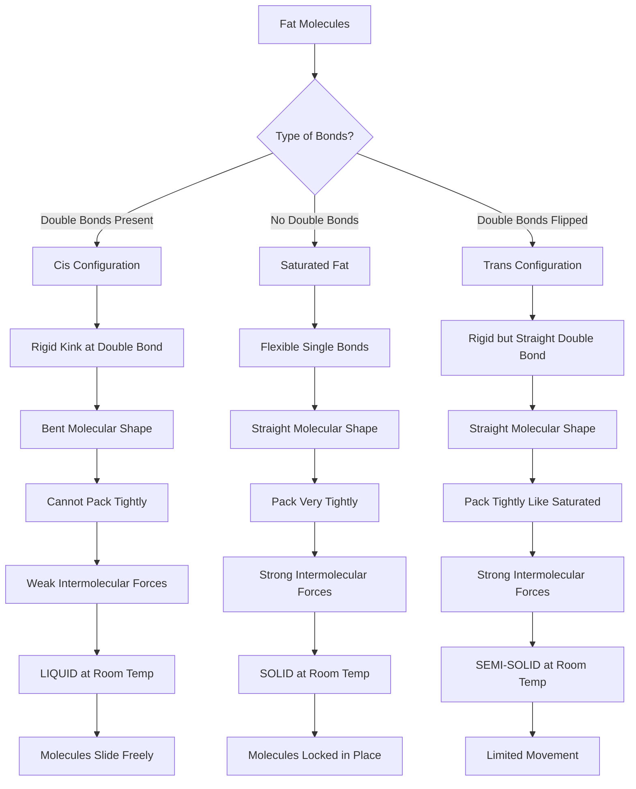
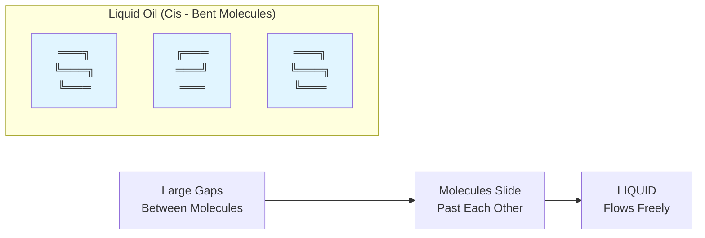
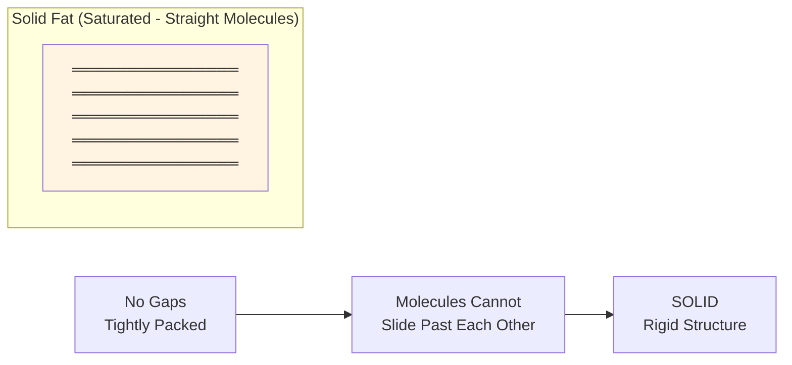
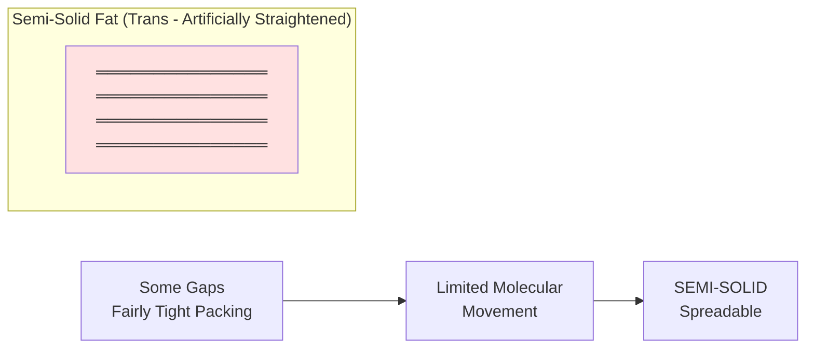
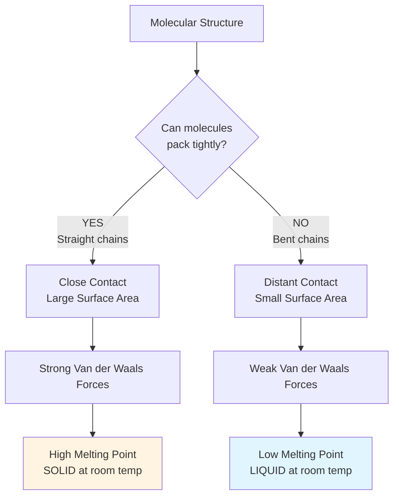
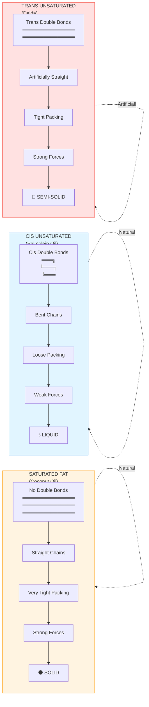
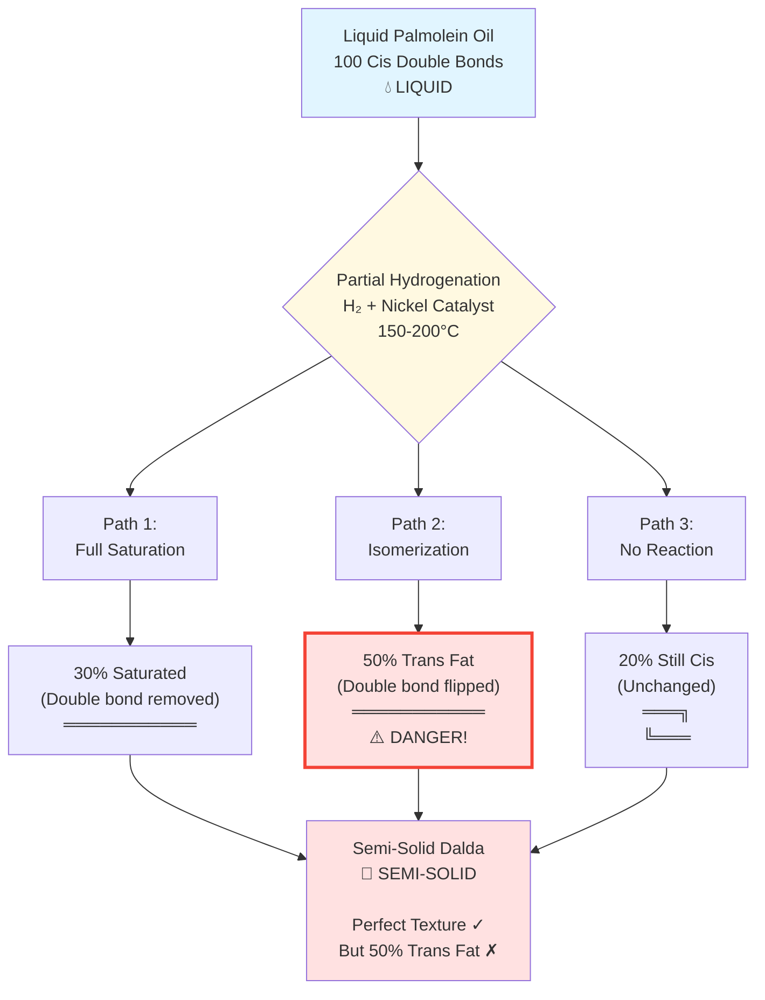
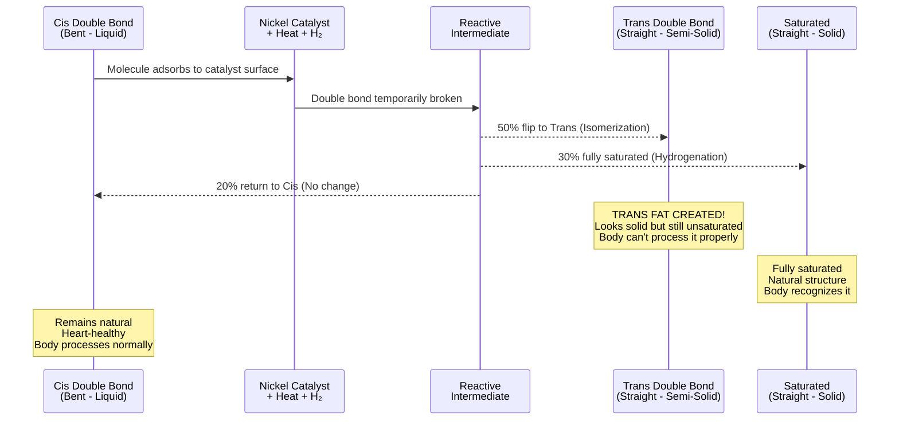
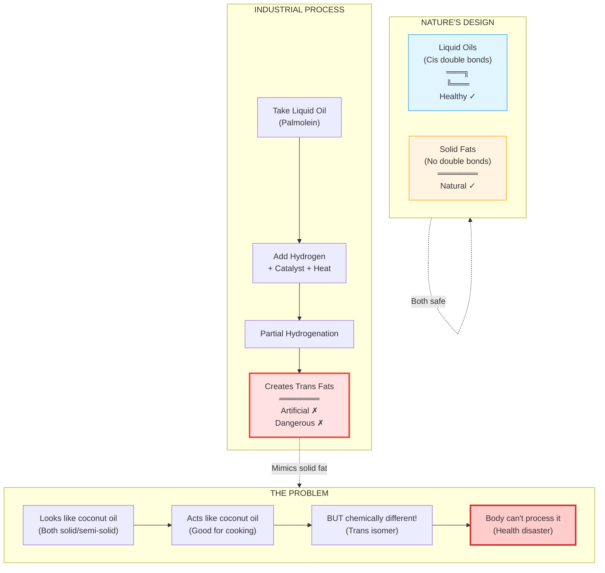

import Highlight from "@/react/Highlight/Highlight.jsx";

The story of Dalda is more than just a tale of vegetable fat—it's a journey through India's industrial revolution, brilliant marketing, chemical innovation, and eventually, a cautionary tale about health and nutrition. From being a revolutionary cooking medium to becoming synonymous with health risks, Dalda's trajectory mirrors our evolving understanding of nutrition science.

## <Highlight color='#800031' highlight='fg' fontWeight='bold'> The Birth of Dalda: A Dutch-British Collaboration </Highlight>

### <Highlight color='#004080' highlight='fg' fontWeight='bold'> The Origins: Husain Dada and Lever Brothers </Highlight>

The fascinating story of Dalda begins with an unlikely partnership between **Husain Dada**, a Dutch entrepreneur, and **Lever Brothers** (the company that would eventually become Hindustan Unilever Limited or HUL). In the early 20th century, India was experiencing rapid urbanization and industrialization, creating a demand for affordable, shelf-stable cooking fats.

Traditional cooking mediums like ghee (clarified butter) and pure oils were expensive and had limited shelf life, especially in India's hot and humid climate. Husain Dada recognized this gap in the market and approached Lever Brothers with a revolutionary product: **hydrogenated palmolein**.

:::note[Important Distinction]
It's crucial to note that Dalda was **not** pure palmolein (palm oil), but rather **hydrogenated palmolein**—a chemically modified version that would have profound implications for public health decades later.
:::

### <Highlight color='#004080' highlight='fg' fontWeight='bold'> The Name "Dalda": A Marketing Masterstroke </Highlight>

The brand name "Dalda" itself is a clever portmanteau:
- **"Dada"** from Husain Dada's surname
- **"L"** from Lever Brothers

This simple yet memorable name would become so ubiquitous in Indian households that it transformed from a brand name into a generic term for all hydrogenated vegetable oils—much like "Xerox" for photocopying or "Maggi" for instant noodles.

### <Highlight color='#004080' highlight='fg' fontWeight='bold'> The Corporate Evolution </Highlight>

The business entity behind Dalda underwent several transformations:

1. **Hindustan Vanaspati Manufacturing Company** (Original company)
2. **Hindustan Lever Limited** (After merger and expansion)
3. **Hindustan Unilever Limited (HUL)** (Current entity)

This corporate evolution reflects the growing ambitions and diversification of what started as a single-product venture into one of India's largest FMCG (Fast-Moving Consumer Goods) conglomerates.

## <Highlight color='#800031' highlight='fg' fontWeight='bold'> The Science Behind Trans Fats: Understanding Hydrogenation </Highlight>

### <Highlight color='#004080' highlight='fg' fontWeight='bold'> Understanding Fatty Acids: The Building Blocks </Highlight>

Before diving into hydrogenation, we need to understand the fundamental chemistry of fats and oils.

#### What Are Fatty Acids?

Fats and oils are composed of **fatty acids**—long chains of carbon atoms bonded together. Each carbon atom can form **four bonds**. In a fatty acid chain, carbon atoms bond to:
- Other carbon atoms (forming the chain)
- Hydrogen atoms (filling remaining bond positions)

#### What Is a Double Bond?

A **double bond** occurs when two carbon atoms share **two pairs of electrons** instead of one. Think of it as a stronger, closer connection between carbon atoms.

**Single Bond (Saturated):**
```
    H   H   H   H
    |   |   |   |
—C—C—C—C—C—
    |   |   |   |
    H   H   H   H
```

**Double Bond (Unsaturated):**
```
    H       H
    |       |
—C—C=C—C—
    |       |
    H       H
```

Notice how the double bond (C=C) means fewer hydrogen atoms are attached. This is why it's called **"unsaturated"**—not all carbon atoms are saturated with hydrogen.

#### Why Double Bonds Matter: Molecular Movement and Flexibility

Double bonds have profound effects on fat properties, and understanding this is key to understanding why oils are liquid and fats are solid.

**The Key Principle: Molecular Packing and Movement**

Whether a fat is liquid or solid depends on how tightly the molecules can pack together:

1. **Physical State**: More double bonds = more liquid at room temperature
2. **Shape**: Double bonds create "kinks" or bends in the molecular chain (approximately 30° angle)
3. **Packing**: Bent molecules can't pack tightly together
4. **Melting Point**: Loosely packed molecules melt at lower temperatures
5. **Molecular Movement**: Loose packing allows molecules to slide past each other freely

**The Chemistry of Movement:**

:::caution[Important Distinction]
**"Rigid" vs "Flexible" can be confusing. Let me clarify:**

- **Double bond itself**: RIGID (can't rotate) → Creates a PERMANENT BEND
- **Single bond itself**: FLEXIBLE (can rotate) → But usually aligns STRAIGHT

**The result:**
- Rigid double bonds → Bent molecules → Can't pack tight → LIQUID (molecules slide freely)
- Flexible single bonds → Straight molecules → Pack tight → SOLID (molecules locked)

**Paradox**: The "rigid" double bond creates "free-flowing" liquid. The "flexible" single bond creates "rigid" solid!
:::

When a double bond exists between two carbon atoms:
- The carbon-carbon double bond (C=C) is **rigid and inflexible**
- It **locks the molecular structure** at that point, creating a fixed bend/kink
- The molecule **cannot rotate freely** around the double bond
- This creates a **permanent bend** in the chain
- **Result**: Bent molecules can't pack tightly → Weak intermolecular forces → Molecules slide past each other → LIQUID

When only single bonds exist (saturated fat):
- Carbon-carbon single bonds (C-C) are **flexible** and can rotate
- The chain can **rotate freely** around single bonds
- But this rotation results in a **straight or slightly curved** overall structure (most stable configuration)
- The molecules can **align parallel** to each other perfectly
- **Result**: Straight molecules pack tightly → Strong intermolecular forces → Molecules locked together → SOLID



**Understanding Molecular Freedom:**

:::note[Clarifying "Free to Move"]
When we say oils are "free to move," we mean the **entire molecules can slide past each other**.

**It's NOT about individual carbon atoms being "free"** - the carbon atoms are always bonded in a chain.

**It's about the WHOLE MOLECULE'S ability to move:**
- **Liquid**: Bent molecules → gaps between molecules → molecules can slide past each other → FLOWS
- **Solid**: Straight molecules → no gaps → molecules locked together → RIGID
:::

**In Liquid Oils (Cis Double Bonds - Palmolein):**
- The **rigid bend** created by the double bond means molecules **cannot align closely**
- Picture trying to stack banana-shaped objects - they leave gaps!
- These **gaps** allow molecules to **slide past each other easily**
- Result: **LIQUID** - molecules are "free to move"
- The oil **flows** because molecules aren't locked together
- **Paradox**: The double bond itself is RIGID (can't rotate), but this rigidity creates a BEND that prevents tight packing, allowing the whole molecule to move freely!



**In Solid Fats (No Double Bonds - Coconut Oil):**
- **Straight chains** (no kinks) can **align parallel** perfectly
- Picture stacking pencils - they fit together tightly!
- **No gaps** - molecules are **locked in position**
- Result: **SOLID** - molecules are "locked" and cannot move freely
- The fat is **rigid** because molecules are packed tightly



**In Semi-Solid Fats (Trans Double Bonds - Dalda):**
- **Trans double bonds** are rigid but **don't create bends**
- Molecules are **relatively straight** (like saturated fats)
- They can **pack fairly tightly** (but not as tight as fully saturated)
- Result: **SEMI-SOLID** - molecules have limited movement
- The fat is **spreadable** but not liquid



### <Highlight color='#004080' highlight='fg' fontWeight='bold'> The Science of Intermolecular Forces </Highlight>

#### Why Packing Matters: Van der Waals Forces

The difference between liquid and solid fats comes down to **intermolecular forces**—the attractions between molecules.

**Van der Waals Forces:**
- Weak attractive forces between molecules
- Stronger when molecules are **closer together**
- Stronger when molecules have **more surface area contact**



**The Packing Analogy:**

Think of it like magnets:
- **Straight chains** (saturated/trans): Like straight magnets lying side by side - strong attraction, hard to separate
- **Bent chains** (cis): Like bent magnets with gaps - weak attraction, easy to separate

**Energy Perspective:**

| Molecular Type | Packing | Intermolecular Forces | Energy to Separate | Physical State |
|----------------|---------|----------------------|-------------------|----------------|
| **Saturated (Coconut Oil)** | Very tight | Very strong | High energy needed | SOLID (rigid) |
| **Trans (Dalda)** | Tight | Strong | Medium-high energy | SEMI-SOLID (spreadable) |
| **Cis (Palmolein)** | Loose | Weak | Low energy needed | LIQUID (flows) |

### <Highlight color='#004080' highlight='fg' fontWeight='bold'> Coconut Oil vs. Palmolein: A Tale of Double Bonds </Highlight>

Here's where it gets fascinating—and where many people get confused:

#### Coconut Oil (Solid at Room Temperature)

**Why is coconut oil solid?**

Coconut oil is solid **NOT** because of double bonds, but because it has **very few or NO double bonds**. It is predominantly **saturated fat**.

**Coconut Oil Composition:**
- **Saturated fats**: ~90% (NO double bonds)
- **Monounsaturated fats**: ~6% (ONE double bond per fatty acid)
- **Polyunsaturated fats**: ~2-3% (MULTIPLE double bonds per fatty acid)

*Note: These percentages refer to the types of fatty acids in coconut oil, not the oil molecules themselves.*

Because coconut oil has almost no double bonds, the fatty acid chains are:
- **Straight** (no kinks from double bonds)
- **Tightly packed** (like straight pencils in a box)
- **Solid** at room temperature (strong intermolecular forces)

```
Coconut Oil Fatty Acids (Saturated - No Kinks):

═══════════════  
═══════════════  Pack tightly
═══════════════  → SOLID
═══════════════  
```

#### Palmolein/Palm Oil (Liquid at Room Temperature)

**Why is palmolein liquid?**

Palmolein (the liquid fraction of palm oil) is liquid because it **HAS double bonds**—it is **unsaturated**.

**Palmolein Composition:**
- **Saturated fats**: ~40-45% (NO double bonds)
- **Monounsaturated fats**: ~40-45% (ONE double bond)
- **Polyunsaturated fats**: ~10-15% (MULTIPLE double bonds)

The presence of double bonds means:
- **Bent chains** (double bonds create kinks)
- **Loose packing** (bent chains don't fit together neatly)
- **Liquid** at room temperature (weaker intermolecular forces)

```
Palmolein Fatty Acids (Unsaturated - Kinked):

═══╗   
   ╚═══╗       Bent chains
       ╚═══    can't pack tightly
  ╔════╝       → LIQUID
══╝            
```

### <Highlight color='#004080' highlight='fg' fontWeight='bold'> What is Hydrogenation? The Chemical Transformation </Highlight>

To understand the Dalda phenomenon and its eventual downfall, we must understand how hydrogenation transforms liquid oils into solid fats.

**Hydrogenation** is a chemical process where **hydrogen atoms are added to double bonds** in unsaturated fatty acids, effectively **removing the double bonds**.

**The Chemical Reaction:**

```
BEFORE Hydrogenation (Unsaturated - Liquid):
    H       H
    |       |
—C—C=C—C—    (DOUBLE BOND - bent chain)
    |       |
    H       H

        ↓ + H₂ (Hydrogen gas)
        ↓ + Catalyst (Nickel/Palladium)
        ↓ + Heat (150-200°C)

AFTER Hydrogenation (Saturated - Solid):
    H   H   H   H
    |   |   |   |
—C—C—C—C—    (SINGLE BOND - straight chain)
    |   |   |   |
    H   H   H   H
```

#### Why Palmolein Needed Hydrogenation

Remember: Husain Dada sold **hydrogenated palmolein**, not pure palmolein. Here's why:

**Problem:** Pure palmolein is liquid (has double bonds)
- Hard to package and transport
- Difficult to measure for cooking
- Shorter shelf life
- Not suitable for making solid products like pastries

**Solution:** Hydrogenate it!
- Removes double bonds
- Straightens the molecular chains
- Allows tight packing
- Creates a **semi-solid fat** like Dalda

**Industrial Advantages of Hydrogenation:**

- **Increases shelf life**: Prevents rancidity caused by oxidation (double bonds are vulnerable to oxygen)
- **Raises melting point**: Converts liquid oils into semi-solid fats (straight chains pack tightly)
- **Improves texture**: Creates a smooth, spreadable consistency
- **Enhances stability**: Makes the fat suitable for high-temperature cooking

### <Highlight color='#004080' highlight='fg' fontWeight='bold'> What Are Isomers? The Key to Understanding Trans Fats </Highlight>

#### Understanding Isomers

**Isomers** are molecules that have the **same chemical formula** (same atoms) but **different structural arrangements** (atoms connected differently in space).

Think of it like building with LEGO blocks: you can use the same pieces to build different structures. In chemistry, the same atoms can be arranged in different ways, creating molecules with vastly different properties.

**Example with Fatty Acids:**
- Both cis and trans fats have the **same atoms**: C₁₈H₃₄O₂ (for example)
- But they're arranged **differently in 3D space**
- This makes them **isomers** of each other
- Their different shapes give them completely different health effects!

### <Highlight color='#004080' highlight='fg' fontWeight='bold'> The Isomer Difference: Trans vs. Cis Configuration </Highlight>

The critical health issue with hydrogenated fats lies in the **isomer configuration** of the fatty acid molecules. This is where chemistry becomes crucial to understanding the health implications.

#### Natural Unsaturated Fats (Cis Configuration)

In naturally occurring unsaturated fats, the hydrogen atoms on either side of a double bond are on the **same side** of the molecule. This is called the **cis configuration** (from Latin "cis" meaning "on this side").

```
    H   H
    |   |
—C=C—        ← Both H atoms on SAME side
              Creates a BENT shape
```

**3D Structure:**
```
Cis Configuration (Natural oils like palmolein):

     ╔═══╗     
═════╝   ╚═════  
  ↑ KINK/BEND

This bend prevents tight packing → LIQUID
```

**Characteristics of Cis Fats:**
- Create a **sharp "kink" or bend** in the fatty acid chain (approximately 30° angle)
- **Cannot pack tightly** together (like trying to stack banana-shaped objects)
- Remain **liquid** at room temperature
- Examples: Olive oil, sunflower oil, fish oils, **original palmolein**
- Generally considered **heart-healthy**
- Body's enzymes recognize and process them normally

#### Trans Fats (Trans Configuration)

During **partial hydrogenation**, some double bonds flip, placing hydrogen atoms on **opposite sides** of the molecule. This is the **trans configuration** (from Latin "trans" meaning "across").

```
    H       
    |       
—C=C—        ← H atoms on OPPOSITE sides
        |     Creates a STRAIGHT shape
        H
```

**3D Structure:**
```
Trans Configuration (Dalda - partially hydrogenated):

═══════════════  
  ↑ STRAIGHT (like saturated fat)

Straight chains can pack tightly → SEMI-SOLID
```

**Characteristics of Trans Fats:**
- **Straighter molecular structure** (similar to saturated fats)
- **Can pack tightly together** (like straight pencils)
- **Solid or semi-solid** at room temperature
- Created **artificially** through industrial hydrogenation
- Associated with **serious health risks**
- Body's enzymes don't recognize them properly (they're "unnatural")

:::danger[The Health Crisis]
This seemingly minor molecular difference has **major health implications**. Trans fats behave very differently in the human body compared to their natural cis counterparts. The body's enzymes evolved to process cis fats, not trans fats!
:::

### <Highlight color='#004080' highlight='fg' fontWeight='bold'> Coconut Oil vs. Dalda: The Critical Difference </Highlight>

Now we can understand the crucial difference between naturally solid fats (like coconut oil) and artificially solidified fats (like Dalda):

#### Coconut Oil (Naturally Solid)

**Structure:**
```
Saturated Fat (NO double bonds):

    H   H   H   H   H   H
    |   |   |   |   |   |
—C—C—C—C—C—C—
    |   |   |   |   |   |
    H   H   H   H   H   H

═══════════════  Naturally straight
═══════════════  (no double bonds to create kinks)
═══════════════  → SOLID
```

**Why it's solid:** NO double bonds → naturally straight chains → tight packing → solid

**Health profile:** While saturated, it's **natural**—our bodies evolved eating it.

#### Dalda/Trans Fat (Artificially Solid)

**Structure:**
```
Trans Fat (Has double bonds in TRANS configuration):

    H   H       H   H
    |   |       |   |
—C—C—C=C—C—C—
    |   |       |   |
    H   H   H   H   H
         (trans)

═══════════════  Artificially straightened
═══════════════  (trans double bonds don't create kinks)
═══════════════  → SEMI-SOLID
```

**Why it's semi-solid:** Double bonds flipped to trans → artificially straightened chains → tight packing → semi-solid

**Health profile:** **Artificial isomer**—our bodies didn't evolve to process this configuration!

:::note[Key Insight]
**Both coconut oil and Dalda are solid/semi-solid, but for completely different reasons:**

- **Coconut oil**: Solid because it has NO double bonds (saturated)
- **Dalda**: Semi-solid because its double bonds are in the TRANS configuration (trans unsaturated)

They may look similar, but chemically and biologically, they're vastly different!
:::

#### Visual Comparison: The Three Fat Types



**Summary Table:**

| Property | Coconut Oil | Palmolein | Dalda |
|----------|-------------|-----------|-------|
| **Double Bonds** | None (0%) | Yes - Cis (50-60%) | Yes - Trans (30-50%) |
| **Molecular Shape** | Straight (natural) | Bent (natural) | Straight (artificial) |
| **Packing** | Very tight | Loose with gaps | Fairly tight |
| **Van der Waals Forces** | Very strong | Weak | Strong |
| **Physical State** | Solid | Liquid | Semi-solid |
| **Melting Point** | ~25°C | -5°C to 0°C | 15-20°C |
| **Natural/Artificial** | ✅ Natural | ✅ Natural | ⚠️ Artificial |
| **Health Profile** | Saturated (natural) | Heart-healthy | Dangerous (trans fat) |
| **Molecular Freedom** | Locked in place | Free to slide | Limited movement |

### <Highlight color='#004080' highlight='fg' fontWeight='bold'> Why Partial Hydrogenation Creates Trans Fats: The Chemistry Explained </Highlight>

This is the critical question: **If hydrogenation removes double bonds, how does it CREATE trans fats?**

The answer lies in **partial vs. complete hydrogenation**.

#### The Hydrogenation Process: What Really Happens

During hydrogenation, several things happen simultaneously:

**Step 1: Double Bond Activation**
The catalyst (nickel) temporarily "breaks" the double bond, creating a reactive intermediate.

**Step 2: Three Possible Outcomes**

From this reactive state, three things can happen:

1. **Full Hydrogenation** (Desired for complete saturation):
   ```
   Cis double bond → NO double bond (saturated)
   —C=C— → —C—C—
   LIQUID → SOLID
   ```

2. **Isomerization to Trans** (Undesired side reaction):
   ```
   Cis double bond → Trans double bond (same number of H atoms!)
   
   H   H              H
   |   |              |
   —C=C—    →    —C=C—
   (CIS)              |
                      H
                   (TRANS)
   LIQUID → SEMI-SOLID (looks solid but still has double bond!)
   ```

3. **Remains Cis** (Unchanged):
   ```
   Cis double bond → Cis double bond (no reaction)
   LIQUID → LIQUID
   ```

#### Why Partial Hydrogenation Maximizes Trans Fats

**Full Hydrogenation:**
- All double bonds → saturated (no double bonds left)
- Result: Very hard, waxy fat (like candle wax)
- Trans fat content: Very low (most double bonds are completely removed)
- Problem: **Too hard** for cooking!

**Partial Hydrogenation (What Dalda Used):**
- Some double bonds → saturated
- Many double bonds → **flipped to trans** (not fully saturated)
- Some double bonds → remain cis
- Result: **Semi-solid** fat (perfect spreadable texture)
- Trans fat content: **Very high (10-60%)**
- Problem: **Maximum trans fat creation!**

```
Palmolein (Liquid Oil):
100 double bonds (all cis)

        ↓ PARTIAL Hydrogenation

Dalda (Semi-solid Fat):
30 double bonds removed (saturated)
50 double bonds flipped to TRANS ← DANGER!
20 double bonds remain cis

= 50% TRANS FAT content!
```

#### Why the Trans Formation Happens

The trans configuration forms because:

1. **Energy Considerations**: Trans is slightly more stable than cis (straighter = lower energy)
2. **High Temperature**: The heat (150-200°C) provides energy for molecular rearrangement
3. **Catalyst Surface**: The nickel catalyst can temporarily break and reform the double bond
4. **Incomplete Reaction**: Not enough hydrogen or reaction time to fully saturate
5. **Random Chance**: When the double bond reforms, it can reform as either cis or trans

**At high temperatures on the catalyst surface:**
```
Cis → [Reactive Intermediate] → Can reform as Trans
                               → Can reform as Cis  
                               → Can be saturated
```



**The Molecular Transformation Process:**



#### Why Manufacturers Used Partial Hydrogenation

**Goal:** Create a semi-solid fat with:
- Spreadable consistency ✓
- Long shelf life ✓
- Low cost ✓
- Good cooking properties ✓

**Unintended Consequence:**
- Maximum trans fat production ✗
- Severe health risks ✗

**Types of Hydrogenated Products:**

| Type | Hydrogen Addition | Trans Fat Content | Physical State | Example Products |
|------|-------------------|-------------------|----------------|------------------|
| **Fully Hydrogenated** | Complete saturation (all double bonds removed) | Minimal (0-2%) | Very hard/waxy | Some hard margarines |
| **Partially Hydrogenated** | Incomplete saturation (some double bonds remain but flip to trans) | **High (10-60%)** | Semi-solid (perfect texture) | **Dalda**, bakery shortenings, old margarine |
| **Non-Hydrogenated** | None (all natural double bonds remain as cis) | Natural trace amounts (&lt;1%) | Liquid | Pure vegetable oils, palmolein |

Dalda, being a **partially hydrogenated** product, contained significant amounts of trans fats—typically 30-50% of the total fat content. This was the very component that would seal its fate decades later.

:::warning[The Irony]
**The very property that made Dalda commercially successful (semi-solid texture from partial hydrogenation) was also what made it health hazardous (maximum trans fat creation)!**
:::

### <Highlight color='#004080' highlight='fg' fontWeight='bold'> The Complete Picture: From Liquid to Solid </Highlight>



**Key Takeaway:**

The difference between coconut oil and Dalda teaches us a crucial lesson:

| Aspect | Coconut Oil | Dalda |
|--------|-------------|-------|
| **How it's solid** | NO double bonds<br/>(naturally straight) | Trans double bonds<br/>(artificially straightened) |
| **Molecular structure** | Natural saturated fat | Artificial trans fat |
| **Body recognition** | Enzymes evolved to process it | Enzymes don't recognize it |
| **Health impact** | Raises LDL and HDL | Raises LDL, LOWERS HDL |
| **Safety** | Generally safe in moderation | No safe level |

:::tip[The Fundamental Truth]
**Just because two substances look and behave similarly doesn't mean they're chemically or biologically the same!**

Coconut oil and Dalda may both be solid, but the WAY they achieve that solidity (natural saturation vs. artificial trans configuration) makes all the difference to your health.
:::

## <Highlight color='#800031' highlight='fg' fontWeight='bold'> The Marketing Genius: How Lintas Made Dalda a Household Name </Highlight>

### <Highlight color='#004080' highlight='fg' fontWeight='bold'> From Failure to Fame: The Lintas Intervention </Highlight>

Despite having a revolutionary product, Dalda initially struggled to gain market acceptance. Indian consumers were skeptical of this new "artificial" fat, preferring traditional ghee and oils. This is when Hindustan Vanaspati Manufacturing Company made a pivotal decision: they approached **Lintas**, one of India's most iconic advertising agencies.

### <Highlight color='#004080' highlight='fg' fontWeight='bold'> Lintas: The Advertising Powerhouse </Highlight>

Lintas (short for "Lever's International Advertising Services") was no ordinary agency. They were the creative force behind some of India's most memorable advertising campaigns:

- **"Hamara Bajaj"** (Our Bajaj) - The patriotic scooter campaign that made Bajaj synonymous with Indian aspirations
- **"Daag Acche Hain"** (Dirt is Good) - Surf Excel's revolutionary campaign that changed how Indians viewed children's play
- **Dalda campaigns** - Positioning hydrogenated fat as modern, economical, and aspirational

### <Highlight color='#004080' highlight='fg' fontWeight='bold'> The Campaign Strategy </Highlight>

Lintas employed several brilliant strategies to make Dalda acceptable to Indian households:

#### 1. **Positioning as "Pure" and "Modern"**
The campaigns emphasized Dalda's "purity" and "scientific" production, contrasting it with potentially adulterated traditional oils.

#### 2. **Economic Appeal**
Dalda was positioned as an economical alternative to expensive ghee, making it accessible to middle-class families.

#### 3. **Versatility Message**
Advertisements showcased Dalda's suitability for all types of cooking—frying, baking, and even traditional Indian sweets.

#### 4. **Celebrity and Expert Endorsements**
The campaigns featured doctors and nutrition "experts" (by the standards of that era) endorsing Dalda as a healthy choice.

#### 5. **Emotional Connect**
Like the "Hamara Bajaj" campaign created a sense of national pride, Dalda campaigns connected the product with family, tradition, and prosperity.

:::tip[Marketing Lesson]
Lintas demonstrated that brilliant marketing can overcome initial consumer resistance, but it also raises ethical questions about promoting products whose health implications aren't fully understood.
:::

## <Highlight color='#800031' highlight='fg' fontWeight='bold'> The Health Awakening: Trans Fats Under Scrutiny </Highlight>

### <Highlight color='#004080' highlight='fg' fontWeight='bold'> The Scientific Evidence Mounts </Highlight>

For decades, Dalda and similar hydrogenated fats were considered safe, even healthy alternatives to saturated animal fats. However, starting in the 1990s, scientific research began revealing disturbing truths about trans fats:

**Health Risks Associated with Trans Fats:**

1. **Cardiovascular Disease**
   - Raises LDL (bad) cholesterol
   - Lowers HDL (good) cholesterol
   - Increases risk of heart attacks and strokes
   - Promotes arterial plaque formation

2. **Metabolic Disorders**
   - Increases insulin resistance
   - Higher risk of Type 2 diabetes
   - Contributes to obesity

3. **Inflammatory Conditions**
   - Promotes systemic inflammation
   - Linked to inflammatory diseases

4. **Other Health Concerns**
   - Potential links to certain cancers
   - Cognitive decline in older adults
   - Adverse effects on fetal development

### <Highlight color='#004080' highlight='fg' fontWeight='bold'> Global Regulatory Response </Highlight>

As evidence accumulated, countries worldwide began restricting or banning trans fats:

- **Denmark (2003)**: First country to restrict trans fats in foods
- **United States (2015)**: FDA declared partially hydrogenated oils not "generally recognized as safe"
- **WHO (2018)**: Called for global elimination of industrially produced trans fats by 2023
- **India (2021)**: FSSAI mandated reduction of trans fats to below 2% in oils and fats

### <Highlight color='#004080' highlight='fg' fontWeight='bold'> Dalda's Decline and Transformation </Highlight>

Faced with mounting scientific evidence and changing regulations, the Dalda brand underwent significant transformations:

1. **Reformulation**: Moving away from partially hydrogenated oils
2. **Product Diversification**: Introducing trans-fat-free variants
3. **Brand Repositioning**: Shifting focus to other cooking mediums
4. **Market Share Decline**: Loss of dominance to healthier alternatives

## <Highlight color='#800031' highlight='fg' fontWeight='bold'> Understanding Trans Fats vs. Other Fats </Highlight>

### <Highlight color='#004080' highlight='fg' fontWeight='bold'> The Fat Family: A Comparison </Highlight>

To truly appreciate the trans fat controversy, it helps to understand how different types of fats compare:

| Fat Type | Structure | Sources | Health Impact |
|----------|-----------|---------|---------------|
| **Saturated Fats** | No double bonds | Butter, ghee, coconut oil, animal fats | Moderate consumption; raises both LDL and HDL |
| **Monounsaturated Fats (Cis)** | One double bond | Olive oil, avocado, nuts | Heart-healthy; lowers LDL |
| **Polyunsaturated Fats (Cis)** | Multiple double bonds | Fish oil, sunflower oil, flaxseed | Heart-healthy; essential fatty acids |
| **Trans Fats (Artificial)** | Double bonds in trans configuration | **Dalda**, margarine, baked goods | **Highly harmful**; raises LDL, lowers HDL |

### <Highlight color='#004080' highlight='fg' fontWeight='bold'> Why Trans Fats Are Worse Than Saturated Fats </Highlight>

For years, saturated fats were considered the primary dietary villain. However, research has shown that **artificial trans fats are significantly worse**:

**Saturated Fats:**
- Raise LDL cholesterol
- Also raise HDL cholesterol (protective)
- Natural occurrence in many foods
- Moderate consumption generally acceptable

**Trans Fats:**
- Raise LDL cholesterol (harmful)
- **Lower HDL cholesterol** (double whammy)
- Primarily artificial creation
- No safe consumption level identified

:::warning[The Double Danger]
Trans fats are the only type of fat that simultaneously increases bad cholesterol AND decreases good cholesterol—making them uniquely dangerous for heart health.
:::

## <Highlight color='#800031' highlight='fg' fontWeight='bold'> Lessons Learned: The Dalda Legacy </Highlight>

### <Highlight color='#004080' highlight='fg' fontWeight='bold'> What Dalda Teaches Us </Highlight>

The Dalda story offers several important lessons:

#### 1. **Marketing vs. Health**
Brilliant marketing can make even questionable products successful, but long-term health consequences eventually catch up.

#### 2. **Scientific Understanding Evolves**
What was once considered "safe" or even "healthy" may be re-evaluated as science progresses.

#### 3. **Corporate Responsibility**
Companies have an obligation to reformulate products when health risks become apparent.

#### 4. **Consumer Awareness**
Educated consumers make better choices. Understanding food chemistry empowers healthier decisions.

#### 5. **Regulation Matters**
Government oversight and food safety standards play crucial roles in protecting public health.

### <Highlight color='#004080' highlight='fg' fontWeight='bold'> The Modern Context </Highlight>

Today, awareness about trans fats has transformed the food industry:

**Positive Changes:**
- Reduced trans fat content in processed foods
- Better labeling requirements
- Development of healthier alternatives
- Increased consumer awareness

**Remaining Challenges:**
- Trans fats still present in some bakery items
- Inadequate labeling in small-scale food operations
- Need for continued public education
- Ensuring compliance with regulations

## <Highlight color='#800031' highlight='fg' fontWeight='bold'> Making Healthier Choices Today </Highlight>

### <Highlight color='#004080' highlight='fg' fontWeight='bold'> How to Avoid Trans Fats </Highlight>

:::tip[Practical Tips]
1. **Read Labels**: Look for "partially hydrogenated oils" in ingredients
2. **Choose Wisely**: Opt for oils high in unsaturated fats (olive, sunflower, rice bran)
3. **Cook Smart**: Use traditional methods with minimal oil
4. **Limit Processed Foods**: Bakery items, packaged snacks often contain trans fats
5. **Go Natural**: Traditional ghee and cold-pressed oils are better alternatives
:::

### <Highlight color='#004080' highlight='fg' fontWeight='bold'> Healthier Cooking Fat Alternatives </Highlight>

**Best Choices:**
- **Extra Virgin Olive Oil**: Rich in monounsaturated fats
- **Rice Bran Oil**: High smoke point, heart-healthy
- **Mustard Oil**: Traditional, beneficial fatty acid profile
- **Ghee**: Pure clarified butter (in moderation)
- **Coconut Oil**: Saturated but with unique medium-chain triglycerides
- **Groundnut/Peanut Oil**: Good for high-temperature cooking

## <Highlight color='#800031' highlight='fg' fontWeight='bold'> Conclusion: From Innovation to Caution </Highlight>

The story of Dalda is a microcosm of 20th-century industrial food production. It represents:

- **Innovation**: The ingenuity of creating shelf-stable, affordable cooking fats
- **Marketing Excellence**: How Lintas transformed a struggling product into a household name
- **Scientific Progress**: The evolution of our understanding of nutrition
- **Public Health**: The importance of evidence-based food safety regulations
- **Corporate Evolution**: How companies must adapt to new scientific realities

The name "Dalda," coined from Husain Dada and Lever Brothers, became so embedded in Indian consciousness that it transcended its origins as a brand name. However, the very chemical process that made it revolutionary—hydrogenation creating trans fats through isomer transformation—ultimately became its greatest liability.

Today, as we navigate grocery aisles filled with countless options, the Dalda story reminds us to:
- Question marketing claims
- Understand food chemistry
- Stay informed about nutrition science
- Make conscious, health-based choices

The legacy of Dalda isn't just about a product or a company—it's about the intersection of science, commerce, and public health, and the ongoing need for vigilance in what we consume.

:::note[Final Thought]
While Dalda may have fallen from grace, the lessons it teaches about trans fats, isomer chemistry, marketing ethics, and corporate responsibility remain profoundly relevant in our modern food landscape.
:::

---

**References and Further Reading:**
- FSSAI regulations on trans fats in India
- WHO guidelines on trans fat elimination
- Research on cis vs. trans fatty acid configurations
- History of Hindustan Unilever Limited
- Lintas advertising campaigns archives
