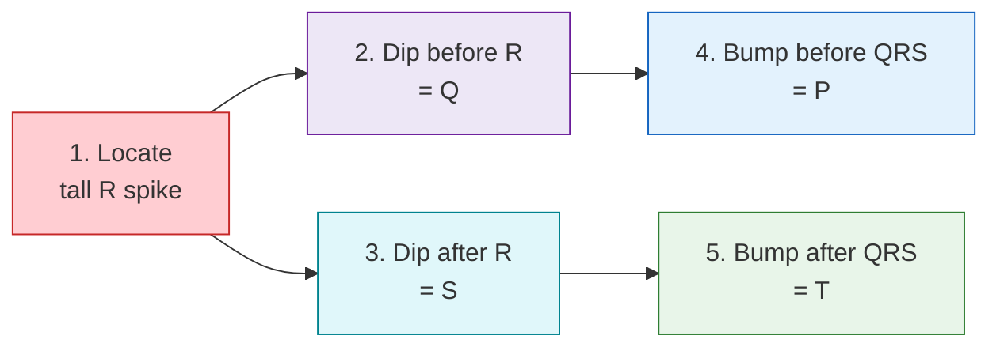
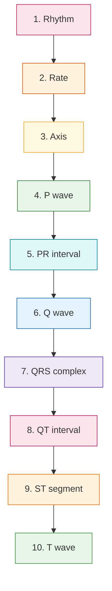
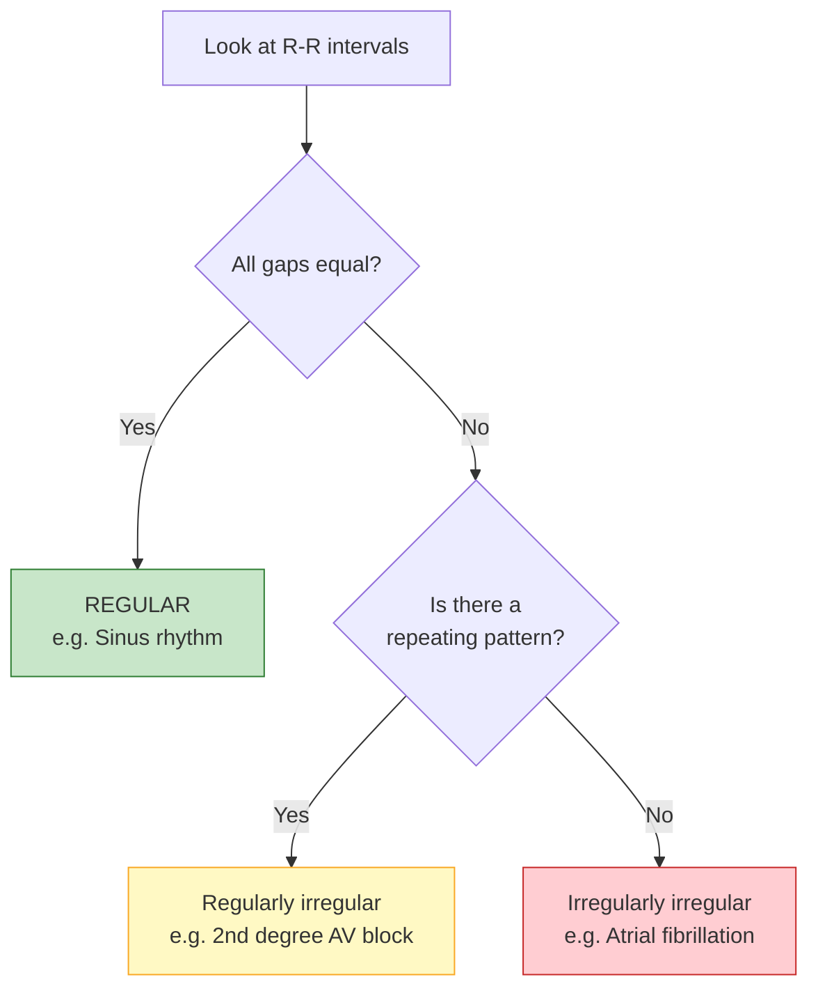
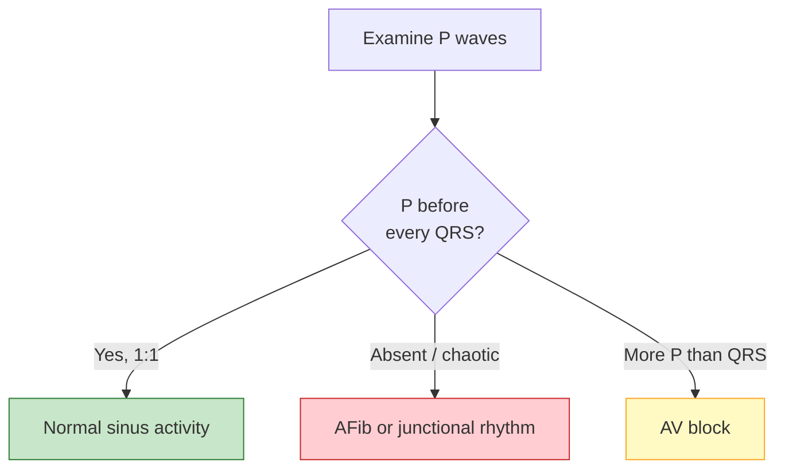
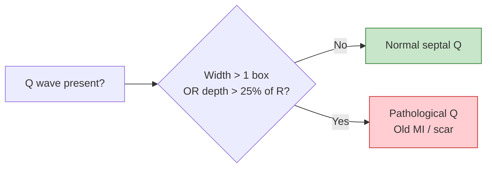
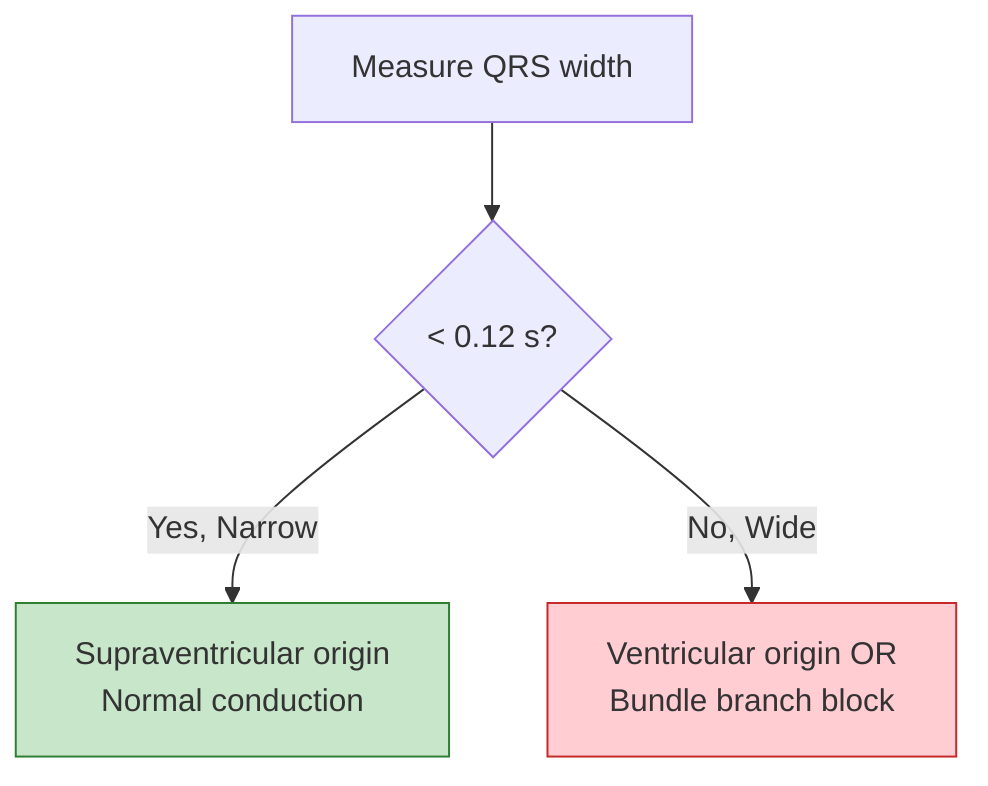
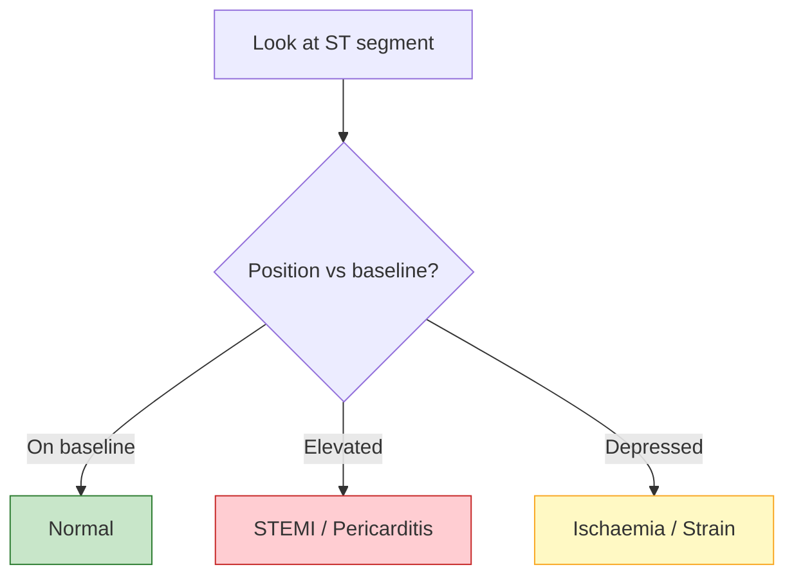
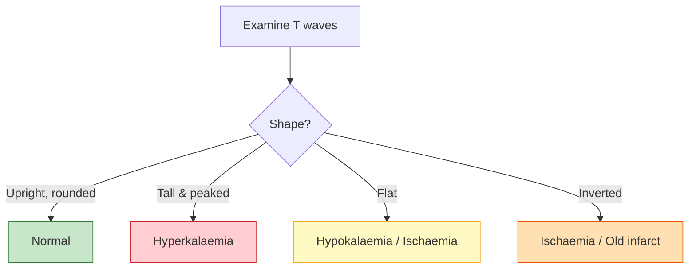
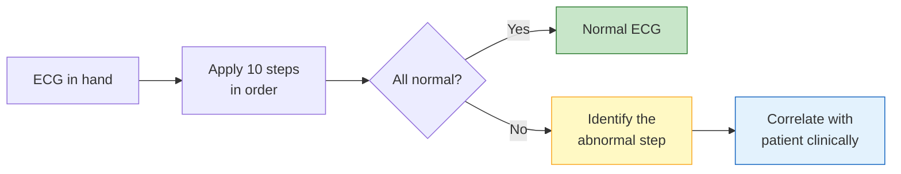
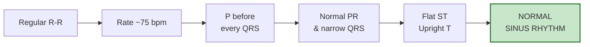

import Highlight from "@/react/Highlight/Highlight.jsx";
import { SvgWrapper } from "@/react/Svg/SvgWrapper.jsx";
import { ECG_WAVEFORM } from "@/data/svg/ecg-waveform.ts";
import { ECG_RHYTHM } from "@/data/svg/ecg-rhythm.ts";
import { ECG_AXIS } from "@/data/svg/ecg-axis.ts";
import { ECG_INTERVALS } from "@/data/svg/ecg-intervals.ts";
import { ECG_IDENTIFY } from "@/data/svg/ecg-identify.ts";
import { ECG_GRID_SCALE } from "@/data/svg/ecg-grid-scale.ts";

An electrocardiogram (ECG or EKG) can look like an intimidating tangle of squiggly lines — but reading one becomes straightforward once you follow the same **systematic order every single time**. This guide breaks ECG interpretation into **10 simple steps**, so you never miss an important finding.

:::note[Educational Purpose Only]
This article is for **learning and revision**. It is **not** a substitute for formal clinical training or professional medical judgment. Always correlate any ECG with the patient's history and examination.
:::

## <Highlight color='#800031' highlight='fg' fontWeight='bold'> First, Know the Waveform </Highlight>

Before the 10 steps, you must recognise the parts of a single heartbeat on the ECG. Every cardiac cycle produces a **P wave**, a **QRS complex** and a **T wave**, connected by **segments** and **intervals**.

<SvgWrapper svg={ECG_WAVEFORM} width="100%" caption="One cardiac cycle: P wave (atrial depolarisation), QRS complex (ventricular depolarisation) and T wave (ventricular repolarisation)." />

**What each part represents:**

| Component | Electrical Event |
|-----------|------------------|
| **P wave** | Atria contract (depolarise) |
| **PR interval** | Delay through the AV node |
| **QRS complex** | Ventricles contract (depolarise) |
| **ST segment** | Ventricles fully depolarised (plateau) |
| **T wave** | Ventricles relax (repolarise) |
| **QT interval** | Total ventricular depolarisation + repolarisation |

**Reading the ECG paper (at standard 25 mm/s and 10 mm/mV):**
- **1 small box** = 0.04 seconds (horizontal) and 0.1 mV (vertical)
- **1 large box** = 0.20 seconds (5 small boxes) and 0.5 mV

Now let's walk through the 10 steps.

## <Highlight color='#800031' highlight='fg' fontWeight='bold'> How to Identify Each Wave on the Graph </Highlight>

When you look at a real ECG it helps to identify the waves in a **fixed order** rather than left to right. The trick is to **find the tall spike first**, then work outward.

<SvgWrapper svg={ECG_IDENTIFY} width="100%" caption="Find the R spike first, then identify Q and S around it, then the P wave before and the T wave after." />

### <Highlight color='#004080' highlight='fg' fontWeight='bold'> Step-by-Step Identification </Highlight>

1. **Find the R wave first** — it is the **tallest, sharpest upward spike**. It is the easiest landmark on the whole trace. The distance between two R waves is the **R-R interval**.
2. **Find the Q wave** — the **small downward dip immediately BEFORE** the R spike. (Not always present.)
3. **Find the S wave** — the **downward dip immediately AFTER** the R spike.
4. **Find the P wave** — the **small, smooth, rounded bump BEFORE the QRS complex**. It represents the atria firing.
5. **Find the T wave** — the **broader, rounded bump AFTER the QRS complex**. It represents the ventricles resetting.

:::tip[The Golden Landmark]
**The R wave is your anchor.** Once you have located the R spike, everything else falls into place: Q is just before it, S is just after it, P comes before the whole QRS, and T comes after.
:::

| Wave | How it looks | Where to find it | Meaning |
|------|--------------|------------------|---------|
| **P** | Small rounded bump | Just **before** QRS | Atria depolarise |
| **Q** | Small downward dip | First dip **before** R | Start of ventricular depolarisation |
| **R** | Tall sharp spike (up) | The obvious peak | Main ventricular depolarisation |
| **S** | Downward dip | Just **after** R | End of ventricular depolarisation |
| **T** | Broad rounded bump | **After** QRS | Ventricles repolarise (reset) |

## <Highlight color='#800031' highlight='fg' fontWeight='bold'> Reading the Grid: What Each Box Measures </Highlight>

ECG paper is printed with a **standardised grid**. As long as the machine runs at the standard **paper speed of 25 mm/s** and **calibration of 10 mm/mV**, every box has a fixed meaning.

<SvgWrapper svg={ECG_GRID_SCALE} width="100%" caption="The horizontal axis measures time; the vertical axis measures voltage. One small box = 0.04 s and 0.1 mV." />

### <Highlight color='#004080' highlight='fg' fontWeight='bold'> The Two Axes </Highlight>

- **Horizontal axis = TIME** (how long an event lasts). Determined by paper **speed**.
- **Vertical axis = VOLTAGE / amplitude** (how strong the electrical signal is, i.e. the height of a wave). Determined by **calibration**.

### <Highlight color='#004080' highlight='fg' fontWeight='bold'> Box Values </Highlight>

| Box | Horizontal (Time) | Vertical (Voltage) |
|-----|:-----------------:|:------------------:|
| **1 small box** (1 mm) | **0.04 s** | **0.1 mV** |
| **1 large box** (5 mm) | **0.20 s** | **0.5 mV** |
| **5 large boxes** | **1.00 s** | 2.5 mV |

### <Highlight color='#004080' highlight='fg' fontWeight='bold'> How to Measure a Wave or Interval </Highlight>

1. **Duration (time):** count how many **small boxes wide** the wave/interval is, then multiply by **0.04 s**.
   - Example: a QRS that is 2 small boxes wide = 2 × 0.04 = **0.08 s** (normal).
2. **Amplitude (voltage):** count how many **small boxes tall** the wave is, then multiply by **0.1 mV**.
   - Example: an R wave 10 small boxes tall = 10 × 0.1 = **1.0 mV**.

:::note[Calibration Check]
Every ECG prints a **calibration pulse** — a small rectangular "step" (usually at the start or end of each row). A normal pulse is **2 large boxes tall (10 mm = 1 mV)** and confirms the machine is calibrated correctly. Always check it before measuring.
:::

## <Highlight color='#800031' highlight='fg' fontWeight='bold'> The 10 Steps at a Glance </Highlight>

## <Highlight color='#800031' highlight='fg' fontWeight='bold'> Step 1: Rhythm </Highlight>

The first question is always: **is the rhythm regular or irregular?** Compare the distance between consecutive **R waves** (the R-R interval). An easy trick is to mark two R-wave peaks on a strip of paper and slide it along the trace.

<SvgWrapper svg={ECG_RHYTHM} width="100%" caption="Regular rhythm has equal R-R gaps; irregular rhythm has varying R-R gaps." />

### <Highlight color='#004080' highlight='fg' fontWeight='bold'> What "Regular" and "Irregular" Mean </Highlight>

- **Regular rhythm**: The R-R intervals are **all equal** (or vary by only a tiny amount). The beats march out like a steady metronome. Normal sinus rhythm is regular.
- **Irregular rhythm**: The R-R intervals **vary**. This is further divided into:
  - **Regularly irregular**: The irregularity follows a **repeating pattern** (e.g., a pattern that recurs every few beats, as in some heart blocks or bigeminy).
  - **Irregularly irregular**: There is **no pattern at all** — the beats are completely random. The classic cause is **atrial fibrillation**.

:::tip[Quick Check]
If R-R intervals are all the same → **regular**. If they wander with no rhythm you can predict → **irregularly irregular** (think AFib).
:::

## <Highlight color='#800031' highlight='fg' fontWeight='bold'> Step 2: Rate </Highlight>

Next, calculate the **heart rate**. A normal resting rate is **60-100 beats per minute (bpm)**.

- **Below 60 bpm** = **bradycardia** (slow)
- **Above 100 bpm** = **tachycardia** (fast)

### <Highlight color='#004080' highlight='fg' fontWeight='bold'> The 300 Rule (for regular rhythms) </Highlight>

Count the number of **large boxes** between two R waves and divide 300 by that number:

> **Heart Rate (bpm) = 300 ÷ (number of large boxes between R-R)**

| Large boxes between R waves | Heart rate (bpm) |
|:---:|:---:|
| 1 | 300 |
| 2 | 150 |
| 3 | 100 |
| 4 | 75 |
| 5 | 60 |
| 6 | 50 |

### <Highlight color='#004080' highlight='fg' fontWeight='bold'> The 6-Second Method (for irregular rhythms) </Highlight>

For irregular rhythms, count the number of QRS complexes in a **6-second strip** and multiply by 10:

> **Heart Rate (bpm) = (QRS complexes in 6 seconds) × 10**

## <Highlight color='#800031' highlight='fg' fontWeight='bold'> Step 3: Axis </Highlight>

The **cardiac axis** describes the **overall direction** of the heart's electrical depolarisation. A quick method uses **Lead I** and **Lead aVF**.

<SvgWrapper svg={ECG_AXIS} width="80%" caption="The four axis quadrants determined by the net deflection in Lead I and Lead aVF." />

| Lead I | Lead aVF | Axis |
|:------:|:--------:|------|
| Positive ⬆ | Positive ⬆ | **Normal** |
| Positive ⬆ | Negative ⬇ | **Left axis deviation (LAD)** |
| Negative ⬇ | Positive ⬆ | **Right axis deviation (RAD)** |
| Negative ⬇ | Negative ⬇ | **Extreme axis** |

:::tip[The "Leaving / Reaching" Trick]
If Leads I and aVF point **toward each other** (both positive) → **normal**. If they point **away from each other** → **leaving = left axis deviation**. If they point **toward each other at the bottom** → **reaching = right axis deviation**.
:::

## <Highlight color='#800031' highlight='fg' fontWeight='bold'> Step 4: P Wave </Highlight>

The **P wave** represents **atrial depolarisation**. Ask:

- **Is a P wave present** before every QRS?
- **Is every QRS preceded by a P wave?**
- Is the P wave **upright** in Lead II (normal sinus origin)?
- Is its **shape and duration** normal (< 0.12 s, < 2.5 small boxes tall)?

- **Tall, peaked P waves** → right atrial enlargement (*P pulmonale*)
- **Wide, notched (M-shaped) P waves** → left atrial enlargement (*P mitrale*)

## <Highlight color='#800031' highlight='fg' fontWeight='bold'> Step 5: PR Interval </Highlight>

The **PR interval** is measured from the **start of the P wave** to the **start of the QRS complex**. It reflects the time taken for the impulse to travel from the atria through the AV node.

<SvgWrapper svg={ECG_INTERVALS} width="100%" caption="Normal duration ranges for the PR interval, QRS complex and QT interval measured against the ECG grid." />

- **Normal PR** = **0.12-0.20 s** (3-5 small boxes)
- **Long PR** (> 0.20 s) = **first-degree AV block**
- **Short PR** (< 0.12 s) = pre-excitation (e.g., Wolff-Parkinson-White)
- **Progressively lengthening PR** → dropped beat = **Mobitz I (Wenckebach)**

## <Highlight color='#800031' highlight='fg' fontWeight='bold'> Step 6: Q Wave </Highlight>

A **Q wave** is the first **downward** deflection of the QRS **before** any upward (R) deflection. Small "septal" Q waves are normal, but **pathological Q waves** signal previous myocardial infarction.

**A Q wave is pathological if it is:**
- **Wider** than 0.04 s (1 small box), **or**
- **Deeper** than 25% of the height of the following R wave

## <Highlight color='#800031' highlight='fg' fontWeight='bold'> Step 7: QRS Complex </Highlight>

The **QRS complex** represents **ventricular depolarisation**. Assess both its **width** and **height (amplitude)**.

**Width:**
- **Normal (narrow)** = **< 0.12 s** (< 3 small boxes) → impulse travelled normally through the fast conduction system
- **Wide** = **≥ 0.12 s** → the beat originates in or is conducted abnormally through the ventricles (bundle branch block, ventricular rhythm, hyperkalaemia)

**Height:**
- **Tall QRS** → ventricular hypertrophy (e.g., left ventricular hypertrophy)
- **Small QRS** → pericardial effusion, obesity, COPD

## <Highlight color='#800031' highlight='fg' fontWeight='bold'> Step 8: QT Interval </Highlight>

The **QT interval** is measured from the **start of the QRS** to the **end of the T wave**. It represents the **total time** for the ventricles to depolarise and repolarise.

Because the QT shortens as heart rate rises, we use the **corrected QT (QTc)**, most commonly with **Bazett's formula**:

> **QTc = QT ÷ √RR**

where **RR** is the R-R interval in seconds.

- **Normal QTc** ≈ **< 0.44 s (men)** and **< 0.46 s (women)**
- **Prolonged QT** → risk of a dangerous arrhythmia (*torsades de pointes*); caused by some drugs, low potassium/magnesium, or congenital long-QT syndrome
- **Short QT** → hypercalcaemia, congenital short-QT syndrome

## <Highlight color='#800031' highlight='fg' fontWeight='bold'> Step 9: ST Segment </Highlight>

The **ST segment** is the flat section between the **end of the QRS** (the J point) and the **start of the T wave**. Normally it sits level with the **baseline (isoelectric line)**.

- **ST elevation** → acute myocardial infarction (**STEMI**), pericarditis
- **ST depression** → myocardial ischaemia, strain

:::danger[Time-Critical]
**ST elevation** in a patient with chest pain may indicate a heart attack in progress — this is a medical emergency requiring immediate action.
:::

## <Highlight color='#800031' highlight='fg' fontWeight='bold'> Step 10: T Wave </Highlight>

The **T wave** represents **ventricular repolarisation** (the ventricles relaxing and resetting). Normally it is **upright** in most leads and **smoothly rounded**.

- **Tall, peaked T waves** → **hyperkalaemia** (high potassium) or very early MI
- **Flattened T waves** → hypokalaemia, ischaemia
- **Inverted T waves** → ischaemia, prior infarction, strain (can be normal in some leads)

## <Highlight color='#800031' highlight='fg' fontWeight='bold'> Putting It All Together </Highlight>

Run through the same 10 steps in the same order every time, and no major abnormality will slip past you.

| Step | What to check | Normal finding |
|:---:|-------------|----------------|
| **1. Rhythm** | R-R regularity | Regular |
| **2. Rate** | 300 rule / 6-second method | 60-100 bpm |
| **3. Axis** | Lead I & aVF direction | Normal (both positive) |
| **4. P wave** | Present, upright, 1:1 with QRS | Upright in Lead II |
| **5. PR interval** | Start of P to start of QRS | 0.12-0.20 s |
| **6. Q wave** | Width & depth | No pathological Q |
| **7. QRS complex** | Width & height | < 0.12 s, narrow |
| **8. QT interval** | Corrected QTc | < 0.44-0.46 s |
| **9. ST segment** | Position vs baseline | Isoelectric (flat) |
| **10. T wave** | Shape & direction | Upright, rounded |

:::tip[The Golden Rule]
**Consistency beats cleverness.** Even experts follow a fixed sequence. Doing the same 10 steps every time is how you avoid missing the one finding that matters.
:::

## <Highlight color='#800031' highlight='fg' fontWeight='bold'> Worked Example: Why This 12-Lead ECG Is Normal </Highlight>

Let's apply the 10 steps to a real **12-lead ECG** printed at the standard settings shown along the bottom: **Speed 25 mm/s**, **Limb leads 10 mm/mV**, **Chest leads 10 mm/mV**. These are exactly the standard calibration values, so every small box = **0.04 s / 0.1 mV**.

:::note[How a 12-Lead Is Laid Out]
The tracing is arranged in **four columns** (I, aVR, V1, V4 → II, aVL, V2, V5 → III, aVF, V3, V6) plus a long **rhythm strip** (usually Lead II) along the bottom. The little rectangular **calibration pulse** at the right edge is 2 large boxes tall, confirming 1 mV = 10 mm.
:::

### <Highlight color='#004080' highlight='fg' fontWeight='bold'> Running the 10 Steps </Highlight>

| Step | Finding on this ECG | Verdict |
|:---:|---------------------|:-------:|
| **1. Rhythm** | R-R intervals on the bottom rhythm strip are **evenly spaced** | Regular ✅ |
| **2. Rate** | About **4 large boxes** between R waves → 300 ÷ 4 ≈ **75 bpm** | Normal ✅ |
| **3. Axis** | Lead I **positive** and Lead aVF **positive** | Normal axis ✅ |
| **4. P wave** | A rounded **P wave precedes every QRS** (upright in II), 1:1 relationship | Sinus rhythm ✅ |
| **5. PR interval** | About **3-4 small boxes** (~0.14 s) | Normal (0.12-0.20 s) ✅ |
| **6. Q wave** | Only tiny septal Q waves; **no wide/deep pathological Q** | Normal ✅ |
| **7. QRS complex** | Narrow, about **2 small boxes** (~0.08 s) | Normal (< 0.12 s) ✅ |
| **8. QT interval** | Roughly **9-10 small boxes** (~0.38 s), proportionate to rate | Normal ✅ |
| **9. ST segment** | Sits **on the baseline** — no elevation or depression | Normal ✅ |
| **10. T wave** | **Upright and rounded** in most leads (normally inverted in aVR) | Normal ✅ |

### <Highlight color='#004080' highlight='fg' fontWeight='bold'> The Verdict </Highlight>

Every one of the 10 checks lands in the normal range, so this tracing is a **normal sinus rhythm** — a regular rhythm at ~75 bpm, originating from the SA node (P before every QRS), conducting normally (normal PR and narrow QRS), with a normal axis and no signs of ischaemia (flat ST, upright T).

:::tip[Reading aVR]
Don't panic when **aVR looks upside-down** — its P wave, QRS and T wave are **normally inverted** because that lead "looks" at the heart from the opposite direction. An inverted aVR is expected on a normal ECG.
:::

## <Highlight color='#800031' highlight='fg' fontWeight='bold'> Conclusion </Highlight>

ECG interpretation stops being scary the moment you replace guesswork with a **repeatable system**. Master these 10 steps — **rhythm, rate, axis, P wave, PR interval, Q wave, QRS complex, QT interval, ST segment and T wave** — and you will be able to read any ECG methodically and confidently.

Practise on as many real tracings as you can, and always interpret the ECG **in the context of the patient**, never in isolation.

:::note[Keep Learning]
The best way to build speed is repetition. Print out ECG strips, cover the interpretation, and run your 10 steps until the sequence becomes automatic.
:::

---

**References and Further Reading:**
- Standard 12-lead ECG interpretation guidelines
- Bazett's formula for QT correction
- AV block classification (first-degree, Mobitz I & II, third-degree)
- Axis determination using the hexaxial reference system
