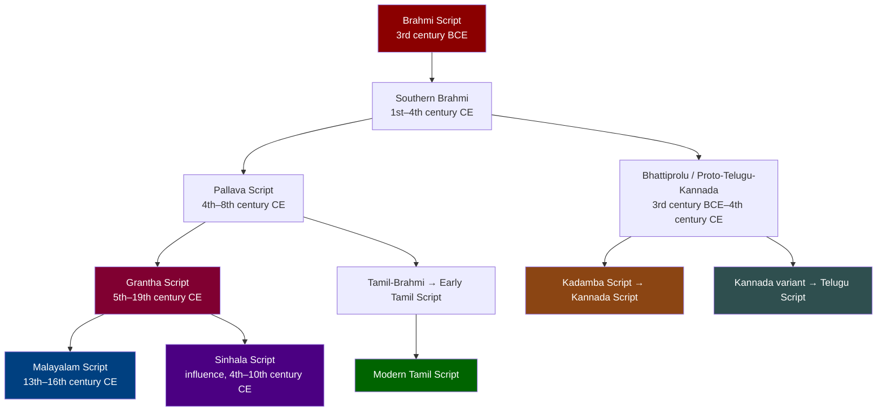
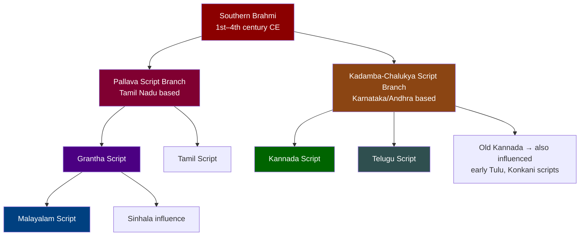
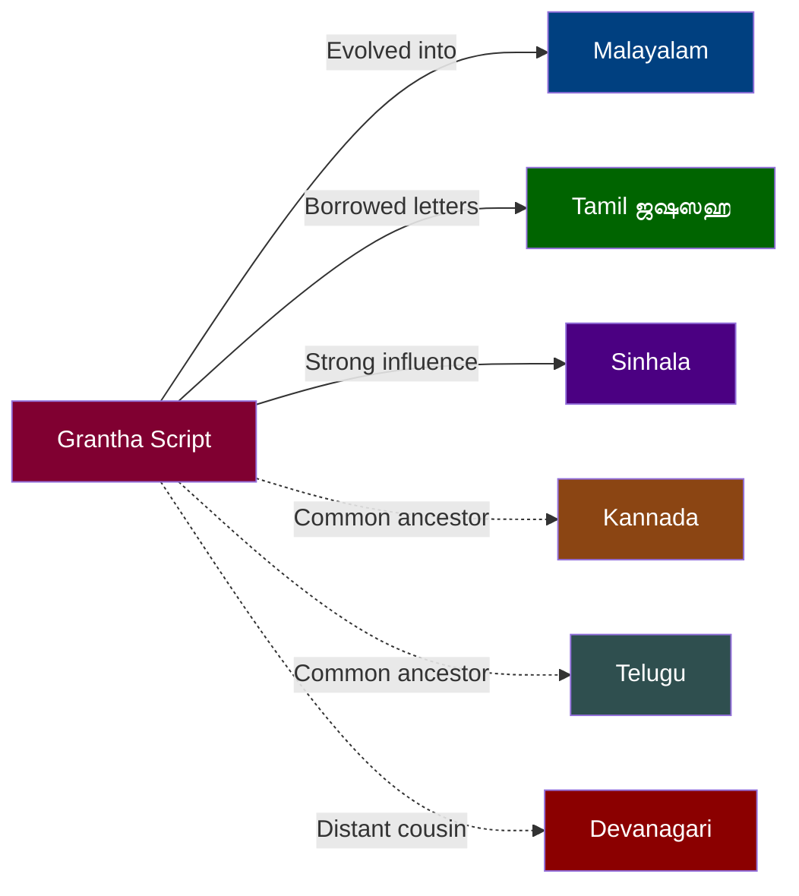

import Highlight from "@/react/Highlight/Highlight.jsx";

Have you ever noticed that Tamil newspapers sometimes contain letters like **ஜ, ஷ, ஸ, ஹ** that look nothing like the rest of Tamil script? Or that Malayalam letters look strikingly similar to ancient inscriptions from Tamil Nadu temples? Or that a Sinhala speaker and a Malayalam speaker can almost recognize each other's letters?

All three phenomena share one ancient source: the **Grantha script** (கிரந்தம் / ഗ്രന്ഥം / ග්‍රන්ථ), a script born in South India to write Sanskrit — and whose influence radiates outward through millennia into the modern alphabets of an entire region.

This article unpacks Grantha thoroughly: what it is, where it came from, who uses it, and fact-checks the popular claim that *"Malayalam script is mostly Grantha."*

---

## <Highlight color='#800031' highlight='fg' fontWeight='bold'> What Is Grantha Script? </Highlight>

### <Highlight color='#004080' highlight='fg' fontWeight='bold'> The Name and Its Meaning </Highlight>

The word **Grantha** (Sanskrit: ग्रन्थ, Tamil: கிரந்தம்) literally means **"book"** or **"text"**. It comes from the Sanskrit root *grath* — meaning to tie, knot, or compose (originally referring to palm leaf manuscripts tied together with cord).

So Grantha is both the script and the concept: the **sacred writing system for composing texts**.

### <Highlight color='#004080' highlight='fg' fontWeight='bold'> Core Purpose: Writing Sanskrit in South India </Highlight>

Grantha was created to solve a specific problem: **Tamil script cannot represent all Sanskrit sounds.**

Tamil has only 18 native consonants — no voiced stops (ga, da, ba), no aspirated consonants (kha, gha, tha, dha), no sibilants (śa, ṣa, sa), no glottal ha. But Sanskrit has **35 consonants** representing sounds completely absent in Tamil phonology.

The solution: develop a separate script — Grantha — alongside Tamil, to write Sanskrit texts in a South Indian context without forcing them through Tamil's limited phonology.

**Grantha served as:**
- The script for **Sanskrit manuscripts** in Tamil Nadu, Kerala, and Sri Lanka
- The medium for **religious texts**: Vedas, Puranas, Ramayana, Mahabharata
- The basis for **Sanskrit inscriptions** on South Indian temples
- The **model** for regional scripts that needed a full Sanskrit phonology

:::note[Grantha is an Abugida]
Like Tamil, Malayalam, and Devanagari, Grantha is an **abugida** (or alphasyllabary) — each character represents a consonant with an inherent vowel "a", and vowel markers modify that default. The system structure is identical across all Brahmic scripts.
:::

---

## <Highlight color='#800031' highlight='fg' fontWeight='bold'> Origins: From Brahmi to Grantha </Highlight>

### <Highlight color='#004080' highlight='fg' fontWeight='bold'> The Common Ancestor: Brahmi Script </Highlight>

All Indic scripts — Tamil, Malayalam, Devanagari, Kannada, Telugu, Bengali, Sinhala, and Grantha — trace back to a single ancestor: **Brahmi script**, used in India from at least the 3rd century BCE.

**The key branch point:**
- **Southern Brahmi** → **Pallava script** (used by the Pallava dynasty, 4th–9th century CE in Tamil Nadu/Andhra)
- Pallava script branched into two lines:
  1. **Grantha** — for Sanskrit, used in Tamil Nadu and Kerala
  2. **Tamil script evolution** — for the Tamil language itself
- Simultaneously, a **different Southern Brahmi branch** → **Kadamba/Chalukya scripts** → **Kannada** and **Telugu** (independent development, not from Grantha)

### <Highlight color='#004080' highlight='fg' fontWeight='bold'> Timeline of Grantha Development </Highlight>

| Period | Development |
|--------|-------------|
| **3rd century BCE** | Brahmi used across India (Ashokan edicts) |
| **1st–3rd century CE** | Southern Brahmi develops regional variants in South India |
| **4th–5th century CE** | Pallava script emerges; Grantha begins taking shape |
| **6th–8th century CE** | Classical Grantha period — used for Sanskrit inscriptions across South India |
| **8th–13th century CE** | Kerala Grantha variant diverges; becomes basis for Malayalam |
| **13th–16th century CE** | Modern Malayalam script crystallizes from Kerala Grantha |
| **17th–18th century CE** | Grantha continues use in Tamil Nadu for Sanskrit manuscripts |
| **1800s–1900s** | Grantha use declines with print; Tamil Grantha letters partially adopted into Tamil print |
| **2012** | Unicode encodes Grantha script (U+11300–U+1137F) as a distinct block |
| **Present** | Revival interest; used in traditional Sanskrit education and temple contexts |

---

## <Highlight color='#800031' highlight='fg' fontWeight='bold'> Grantha Consonants: The Full Sanskrit Alphabet </Highlight>

### <Highlight color='#004080' highlight='fg' fontWeight='bold'> The 5×5 Sanskrit Consonant Grid </Highlight>

Sanskrit organizes consonants into a phonologically logical **5×5 matrix** based on place and manner of articulation, plus sonorants and sibilants. Grantha represents all of them. Here's the full Grantha consonant system compared with Tamil, Malayalam, and Sinhala:

**Group 1: Velars (ka-varga) — क-वर्ग**

| Sound | Latin | Grantha | Tamil | Malayalam | Sinhala | Notes |
|-------|-------|---------|-------|-----------|---------|-------|
| Unaspirated voiceless | ka | 𑌕 | க | ക | ක | Tamil has this natively |
| Aspirated voiceless | kha | 𑌖 | ஃக / — | ഖ | ඛ | Tamil: no native letter (uses ஃக informally) |
| Voiced unaspirated | ga | 𑌗 | — | ഗ | ග | Tamil: no native letter |
| Voiced aspirated | gha | 𑌘 | — | ഘ | ඝ | Tamil: no native letter |
| Velar nasal | ṅa | 𑌙 | ங | ങ | ඞ | Tamil has ங natively |

**Group 2: Palatals (ca-varga) — च-वर्ग**

| Sound | Latin | Grantha | Tamil | Malayalam | Sinhala | Notes |
|-------|-------|---------|-------|-----------|---------|-------|
| Unaspirated voiceless | ca | 𑌚 | ச | ച | ච | Tamil uses ச for both ca and cha |
| Aspirated voiceless | cha | 𑌛 | — | ഛ | ඡ | Tamil: no distinct letter |
| Voiced unaspirated | ja | 𑌜 | ஜ (Grantha loan) | ജ | ජ | Tamil borrowed ஜ from Grantha |
| Voiced aspirated | jha | 𑌝 | — | ഝ | ඣ | Tamil: no letter |
| Palatal nasal | ña | 𑌞 | ஞ | ഞ | ඤ | Tamil has ஞ natively |

**Group 3: Retroflexes (ṭa-varga) — ट-वर्ग**

| Sound | Latin | Grantha | Tamil | Malayalam | Sinhala | Notes |
|-------|-------|---------|-------|-----------|---------|-------|
| Unaspirated voiceless | ṭa | 𑌟 | ட | ട | ට | Tamil has ட natively |
| Aspirated voiceless | ṭha | 𑌠 | — | ഠ | ඨ | Tamil: no letter |
| Voiced unaspirated | ḍa | 𑌡 | — | ഡ | ඩ | Tamil: no letter |
| Voiced aspirated | ḍha | 𑌢 | — | ഢ | ඪ | Tamil: no letter |
| Retroflex nasal | ṇa | 𑌣 | ண | ണ | ණ | Tamil has ண natively |

**Group 4: Dentals (ta-varga) — त-वर्ग**

| Sound | Latin | Grantha | Tamil | Malayalam | Sinhala | Notes |
|-------|-------|---------|-------|-----------|---------|-------|
| Unaspirated voiceless | ta | 𑌤 | த | ത | ත | Tamil has த natively |
| Aspirated voiceless | tha | 𑌥 | — | ഥ | ථ | Tamil: no letter |
| Voiced unaspirated | da | 𑌦 | — | ദ | ද | Tamil: no letter |
| Voiced aspirated | dha | 𑌧 | — | ധ | ධ | Tamil: no letter |
| Dental nasal | na | 𑌨 | ந | ന | න | Tamil has ந natively |

**Group 5: Labials (pa-varga) — प-वर्ग**

| Sound | Latin | Grantha | Tamil | Malayalam | Sinhala | Notes |
|-------|-------|---------|-------|-----------|---------|-------|
| Unaspirated voiceless | pa | 𑌪 | ப | പ | ප | Tamil has ப natively |
| Aspirated voiceless | pha | 𑌫 | ஃப (informal) | ഫ | ඵ | Tamil: no distinct letter |
| Voiced unaspirated | ba | 𑌬 | — | ബ | බ | Tamil: no native letter |
| Voiced aspirated | bha | 𑌭 | — | ഭ | භ | Tamil: no letter |
| Labial nasal | ma | 𑌮 | ம | മ | ම | Tamil has ம natively |

**Group 6: Sonorants and Sibilants**

| Sound | Latin | Grantha | Tamil | Malayalam | Sinhala | Notes |
|-------|-------|---------|-------|-----------|---------|-------|
| Palatal glide | ya | 𑌯 | ய | യ | ය | Tamil has ய natively |
| Rhotic | ra | 𑌰 | ர | ര | ර | Tamil has ர natively |
| Lateral | la | 𑌲 | ல | ല | ල | Tamil has ல natively |
| Labiodental | va | 𑌵 | வ | വ | ව | Tamil has வ natively |
| Palatal sibilant | śa | 𑌶 | ஶ (Grantha loan) | ശ | ශ | Tamil borrowed ஶ from Grantha |
| Retroflex sibilant | ṣa | 𑌷 | ஷ (Grantha loan) | ഷ | ෂ | Tamil borrowed ஷ from Grantha |
| Dental sibilant | sa | 𑌸 | ஸ (Grantha loan) | സ | ස | Tamil borrowed ஸ from Grantha |
| Glottal fricative | ha | 𑌹 | ஹ (Grantha loan) | ഹ | හ | Tamil borrowed ஹ from Grantha |

**Tamil-Dravidian Unique Consonants (not in Sanskrit/Grantha)**

| Sound | Latin | Tamil | Malayalam | Sinhala | Notes |
|-------|-------|-------|-----------|---------|-------|
| Retroflex lateral | ḷa | ள | ള | ළ | Dravidian-only sound |
| Retroflex approximant | zha | ழ | ഴ | — | Tamil/Malayalam only (unique Dravidian) |
| Alveolar trill | ṟa | ற | റ | — | Tamil/Malayalam alveolar r |
| Word-final na | ṉa | ன | — (merged with ന) | — | Tamil-specific |

:::important[What This Table Reveals]
**Tamil has 18 native consonants.** Of the 35 Sanskrit consonants, Tamil only represents 14 of them natively. The remaining 4 Sanskrit consonants used in Tamil (ஜ, ஶ, ஷ, ஸ, ஹ) are **Grantha letter borrowings**.

**Malayalam has all 35 Sanskrit consonants** as standard letters in its alphabet — because its entire consonant system was built from Grantha.

**Sinhala also has all 35 consonants** plus its own unique additions — Grantha was a key influence.
:::

---

## <Highlight color='#800031' highlight='fg' fontWeight='bold'> Tamil's Relationship with Grantha </Highlight>

### <Highlight color='#004080' highlight='fg' fontWeight='bold'> Two Scripts, One Region </Highlight>

For over a thousand years, Tamil Nadu used **two scripts side by side**:

1. **Tamil script** — for the Tamil language (18 consonants + 12 vowels)
2. **Grantha script** — for Sanskrit texts, prayers, and Sanskrit loanwords

This was not unusual. It was the standard practice for bilingual (Tamil + Sanskrit) manuscripts, temple inscriptions, and royal charters. A single palm leaf could contain Tamil sentences in Tamil script and Sanskrit phrases in Grantha.

**The hybrid manuscript tradition:**
- Sanskrit passages → written in Grantha
- Tamil passages → written in Tamil script
- Mixed Sanskrit-Tamil texts (Manipravalam style) → both scripts on the same page

### <Highlight color='#004080' highlight='fg' fontWeight='bold'> Grantha Letters in Modern Tamil </Highlight>

As Tamil printing standardized in the 19th century, a select few Grantha letters were **officially adopted into the Tamil alphabet** to write Sanskrit and English loanwords:

| Grantha Letter | Tamil Borrowed Form | Sound | Used For |
|----------------|---------------------|-------|---------|
| 𑌜 (ja) | **ஜ** | ja | ஜனாதிபதி (president), ஜூன் (June) |
| 𑌶 (śa) | **ஶ** | sha (palatal) | ஶ்ரீ (Shri), rare |
| 𑌷 (ṣa) | **ஷ** | sha (retroflex) | ஷாப்பிங் (shopping), ஷண்முகம் |
| 𑌸 (sa) | **ஸ** | sa | ஸ்கூல் (school), ஸ்ரீ |
| 𑌹 (ha) | **ஹ** | ha | ஹோட்டல் (hotel), ஹரி |

:::note[Tamil's Official Position on Grantha Letters]
The **Tamil Lexicon** and standard Tamil typography include these 6 Grantha letters (ஜ, ஶ, ஷ, ஸ, ஹ, and the compound க்ஷ) as supplementary characters. However:
- **Tamil purists** argue these letters are unnecessary (Tamil sounds can approximate them)
- **Standard usage** includes them for proper names and Sanskrit/English loanwords
- **Classical Tamil literature** uses zero Grantha letters — it predates this borrowing
- **Newspapers and books** use varying conventions

The Grantha letters in Tamil are a **supplement**, not the foundation. Tamil's 18 native consonants evolved independently from Tamil-Brahmi, not from Grantha.
:::

---

## <Highlight color='#800031' highlight='fg' fontWeight='bold'> Malayalam: The Closest Grantha Descendant </Highlight>

### <Highlight color='#004080' highlight='fg' fontWeight='bold'> Fact-Check: "Malayalam Script Is Mostly Grantha" </Highlight>

This claim is popular — let's examine it carefully.

**What the claim suggests:** Malayalam letters look like Grantha letters, and therefore Malayalam descended from Grantha.

**The verdict: SUBSTANTIALLY TRUE, but needs precise framing.**

Here's the actual evidence:

**Evidence FOR the Grantha-Malayalam connection:**

1. **Visual similarity is undeniable**: As the comparison chart shows, Malayalam letters for ka, kha, ga, gha, ṅa, ṭa, ṇa, ta, na, pa, ma, ya, ra, la, va, śa, ṣa, sa, ha look remarkably like their Grantha equivalents. This is not coincidence.

2. **Kerala Grantha was the direct ancestor**: The specific regional variant of Grantha used in Kerala (sometimes called **Kerala Grantha** or **Ārya Ezhuthu** — "Aryan script") is recognized by scholars as the primary source of the Malayalam alphabet.

3. **Malayalam adopted the full Sanskrit phonology from Grantha**: Unlike Tamil, which kept its 18-consonant system and borrowed 5-6 Grantha letters, Malayalam absorbed the entire Grantha consonant table. Every aspirated and voiced consonant in Malayalam (ഖ, ഗ, ഘ, ഛ, ജ, ഝ, ഠ, ഡ, ഢ, ഥ, ദ, ധ, ഫ, ബ, ഭ) comes directly from Grantha.

4. **Historical documentation**: The evolution from Kerala Grantha to Malayalam is documented in palm leaf manuscripts from the 8th–14th centuries. The script gradually changed from Grantha to what we now call Malayalam.

**Evidence requiring nuance:**

1. **Vatteluttu also contributed**: The **Vatteluttu script** (Tamil: வட்டெழுத்து, "round letters") — another South Indian script used in Kerala and Tamil Nadu — also contributed to Malayalam's development. Vatteluttu was used for Tamil-Malayalam writing before the full Grantha-based Malayalam script standardized.

2. **The native Dravidian letters**: Malayalam letters for sounds like ഴ (zha), റ (ṟa), ള (ḷa), ൻ (chillu n), ർ (chillu r), etc. trace back to the Tamil/Dravidian tradition, not Grantha. These are native Dravidian consonants that Grantha didn't have.

3. **Script evolution vs. script identity**: Saying "Malayalam IS Grantha" is like saying "French IS Latin." It's descended from it, heavily shaped by it, but it has evolved into a distinct system with its own characteristics, proportions, and additions.

**More precise statement:**

> *"The Malayalam script evolved primarily from the Kerala variant of Grantha script, which is why approximately 25–30 of Malayalam's 37 consonants are visually and genealogically traceable to Grantha. The remaining consonants (Dravidian sounds like ഴ, ഴ, ൻ, ർ) come from the older Tamil/Vatteluttu tradition. Malayalam is the living script most closely related to Grantha — more than any other currently used South Indian script."*

### <Highlight color='#004080' highlight='fg' fontWeight='bold'> The Visual Evidence </Highlight>

Look at these parallel pairs from the comparison chart:

| Sound | Grantha | Malayalam | Visual Relationship |
|-------|---------|-----------|---------------------|
| ka | 𑌕 | ക | Near-identical loop-stem structure |
| kha | 𑌖 | ഖ | Grantha kha → rounded into Malayalam ഖ |
| ga | 𑌗 | ഗ | Grantha ga → softened curves → Malayalam ഗ |
| gha | 𑌘 | ഘ | Grantha gha → direct evolution to ഘ |
| ṅa | 𑌙 | ങ | Grantha ṅa → Malayalam ങ |
| ta | 𑌤 | ത | Grantha ta → rotated → Malayalam ത |
| na | 𑌨 | ന | Grantha na → softened → Malayalam ന |
| pa | 𑌪 | പ | Grantha pa → curl added → Malayalam പ |
| ma | 𑌮 | മ | Grantha ma → mirrored/softened → Malayalam മ |
| ra | 𑌰 | ര | Grantha ra → Malayalam ര |
| la | 𑌲 | ല | Grantha la → curl added → Malayalam ല |
| va | 𑌵 | വ | Grantha va → loop retained → Malayalam വ |
| śa | 𑌶 | ശ | Grantha śa → direct evolution → Malayalam ശ |
| sa | 𑌸 | സ | Grantha sa → Malayalam സ |
| ha | 𑌹 | ഹ | Grantha ha → Malayalam ഹ |

The pattern is consistent: **Malayalam letters are rounded, softened, and stylized Grantha letters** — the product of writing Grantha on palm leaves with a stylus over centuries, which naturally curves and softens angular forms.

### <Highlight color='#004080' highlight='fg' fontWeight='bold'> Why Malayalam "Looks Round" </Highlight>

The characteristic roundness of Malayalam script (compared to the more angular Grantha) is directly explained by the **palm leaf writing medium**:

- Grantha was written on **palm leaves with a sharp stylus (ezhuthāṇi)**
- Horizontal lines would **split palm leaves along their grain**
- Over centuries, writers **avoided angular strokes**, preferring curves
- This progressively rounded Grantha's angular forms into the flowing Malayalam curves we see today

The same process happened in the evolution of Sinhala and Burmese scripts — both of which also evolved from Indian Brahmi-derived scripts written on palm leaves.

---

## <Highlight color='#800031' highlight='fg' fontWeight='bold'> Sinhala and Grantha </Highlight>

### <Highlight color='#004080' highlight='fg' fontWeight='bold'> The Sri Lankan Branch </Highlight>

**Sinhala script** is another living descendant of the Brahmi family with clear Grantha connections:

**Sinhala's relationship with Grantha:**
- Sinhala evolved from **Southern Brahmi** — the same branch that produced Grantha
- **Direct Grantha borrowings** appear in the Sinhala Grantha letters (used for Sanskrit sounds in Sinhala)
- The **visual similarities** between Sinhala, Grantha, and Malayalam are visible in the comparison chart — particularly for velar and retroflex consonants

**What Sinhala has in common with Grantha:**
- Full Sanskrit phonology (all voiced and aspirated consonants) ✅
- Grantha-derived forms for many consonants ✅
- An anusvara and visarga system similar to Grantha ✅

**How Sinhala differs from pure Grantha:**
- Sinhala developed its own distinct letterforms over centuries
- Strong Pali influence (Buddhist texts in Pali shaped Sinhala vocabulary)
- The roundness is even more pronounced than Malayalam
- Some letters evolved independently

:::note[Sinhala's Unique Position]
Sinhala is geographically isolated on an island, which allowed it to develop more independently once it diverged from mainland South Indian script traditions. Today, Sinhala script is unique enough that neither Tamil nor Malayalam speakers can read it — despite the shared ancestry visible in the letter shapes.
:::

---

## <Highlight color='#800031' highlight='fg' fontWeight='bold'> Why Kannada and Telugu Are Different </Highlight>

### <Highlight color='#004080' highlight='fg' fontWeight='bold'> Fact-Check: "Kannada and Telugu Don't Have Grantha" </Highlight>

This is a common but **imprecise claim**. Let's examine it carefully.

**The accurate statement:**

> *"Kannada and Telugu did NOT adopt Grantha letters as supplementary additions (like Tamil) and did NOT evolve FROM Grantha (like Malayalam). Instead, they developed INDEPENDENT scripts from a completely different branch of Southern Brahmi — through the Kadamba and Chalukya dynasties."*

**The Brahmi family tree has two separate South Indian branches:**

**Why Kannada and Telugu have all Sanskrit consonants WITHOUT Grantha:**

1. **Independent parallel development**: The Kadamba-Chalukya script branch also had to represent Sanskrit (the Kadamba and Chalukya dynasties were major Sanskrit patrons). They developed their own letter forms for voiced and aspirated consonants — not by borrowing from Grantha, but by creating new forms within their own evolving script system.

2. **Different dynasty, different script evolution**: 
   - Grantha evolved under **Pallava** patronage in Tamil Nadu
   - Kannada/Telugu scripts evolved under **Kadamba, Chalukya, Rashtrakuta, and Vijayanagara** patronage in Karnataka/Andhra
   - These were geographically and politically distinct regions with distinct script traditions

3. **The visual difference**: If you compare Grantha/Malayalam consonants with Kannada/Telugu consonants, they look **distinctly different** despite representing the same sounds. This is because they're independent creations for the same sounds, not copies of each other.

4. **Why Tamil NEEDED Grantha and Kannada/Telugu didn't**: Tamil already had its own highly specialized, phonologically minimal script (18 consonants). When it needed Sanskrit sounds, it had to borrow external letters (Grantha). Kannada and Telugu scripts evolved more openly from the start, natively developing forms for all Sanskrit consonants.

**Side-by-side comparison for the sound "ka" across all scripts:**

| Script | Letter | Family |
|--------|--------|--------|
| Grantha | 𑌕 | Pallava branch |
| Malayalam | ക | Grantha descendant (Pallava branch) |
| Tamil | க | Tamil-Brahmi (Pallava branch) |
| Sinhala | ක | Southern Brahmi (Pallava-influenced) |
| Kannada | ಕ | Kadamba-Chalukya branch |
| Telugu | క | Kadamba-Chalukya branch |
| Devanagari | क | Northern Brahmi branch |

Notice how Grantha, Malayalam, Tamil, and Sinhala share a visual family resemblance (similar curved shapes), while Kannada and Telugu look distinctly different — because they come from a different sub-branch of Brahmi.

### <Highlight color='#004080' highlight='fg' fontWeight='bold'> What About Old Kannada and Grantha? </Highlight>

There is one nuance worth noting: **Old Kannada inscriptions** (before the 10th century) show some visual similarities with Grantha in certain letters. This is because:
- Both Grantha and Old Kannada derived from the same early Southern Brahmi root
- Early Pallava and Chalukya scripts were close enough that cross-influence was possible at the borders
- Over time, as the scripts diverged further, the similarities became less visible

However, this is **common ancestor similarity**, not Grantha influence on Kannada. Like siblings who resemble each other because they share parents — not because one is derived from the other.

---

## <Highlight color='#800031' highlight='fg' fontWeight='bold'> Grantha Script in the Modern Era </Highlight>

### <Highlight color='#004080' highlight='fg' fontWeight='bold'> Current Status and Revival </Highlight>

By the 20th century, Grantha had nearly disappeared as a living script:
- Sanskrit printing standardized on **Devanagari** nationwide
- Tamil printing adopted select Grantha letters into Tamil script
- Malayalam evolved into its own standardized form
- Most scholars who could read Grantha manuscripts passed away

**But Grantha is not extinct.** A revival is underway:

1. **Unicode Encoding (2012)**: Grantha received its own Unicode block (U+11300–U+1137F), making it possible to type and display Grantha digitally. This was a crucial step for revival.

2. **Temple and ritual use**: Grantha continues to be used in **Agamic rituals** in South Indian temples (particularly Shaivite and Vaishnavite temples in Tamil Nadu). Priests trained in the Agama tradition still read and write Grantha.

3. **Traditional Sanskrit schools**: Some **pathashalas** (traditional Sanskrit schools) in Tamil Nadu teach Grantha as the script for Sanskrit education, following the tradition of their predecessors.

4. **Academic interest**: Linguists, paleographers, and historians are actively deciphering and cataloging Grantha manuscripts. Institutions like the **Ecole Française d'Extrême-Orient** and **Chennai Government Oriental Manuscripts Library** hold thousands of Grantha manuscripts.

5. **Digital fonts**: Several Grantha Unicode fonts are now available, enabling digital publication of Grantha texts.

### <Highlight color='#004080' highlight='fg' fontWeight='bold'> Manipravalam: The Mixed-Script Literary Tradition </Highlight>

One of Grantha's most fascinating legacies is the **Manipravalam** (மணிப்பிரவாளம்) literary tradition:

- The name means **"ruby and coral"** — a metaphor for the mixture of two beautiful things (Sanskrit and Tamil/Malayalam)
- Texts written in Manipravalam used **both Tamil/Malayalam script AND Grantha script** in the same document
- Sanskrit words: written in Grantha
- Tamil/Malayalam words: written in the native script
- Result: a visually striking code-switched text

This tradition was especially strong in Kerala, where Manipravalam Malayalam literature flourished from the 12th–16th centuries, and is one reason why Grantha integration into Malayalam happened so thoroughly.

---

## <Highlight color='#800031' highlight='fg' fontWeight='bold'> Summary: Who Has What from Grantha </Highlight>

| Script / Language | Grantha Relationship | Shared Consonants | Verdict |
|-------------------|---------------------|-------------------|---------|
| **Malayalam** | Evolved FROM Kerala Grantha | ~30 of 37 consonants | Direct descendant — strongest connection |
| **Tamil** | Borrowed 5-6 Grantha letters | ஜ, ஶ, ஷ, ஸ, ஹ only | Supplementary borrowing — weak connection |
| **Sinhala** | Southern Brahmi + Grantha influence | Most consonants show Grantha ancestry | Strong influence — independent script |
| **Kannada** | Independent Kadamba-Chalukya branch | None borrowed from Grantha | Cousin script — shared great-grandparent |
| **Telugu** | Independent Kadamba-Chalukya branch | None borrowed from Grantha | Cousin script — shared great-grandparent |
| **Devanagari** | Independent Northern Brahmi branch | None | Distant cousin only |

---

## <Highlight color='#800031' highlight='fg' fontWeight='bold'> Key Takeaways and Fact Summaries </Highlight>

### <Highlight color='#004080' highlight='fg' fontWeight='bold'> Verified Facts </Highlight>

:::important[✅ Confirmed: Malayalam is the closest living descendant of Grantha]
The Kerala variant of Grantha is the **direct ancestor** of modern Malayalam script. Approximately 25–30 of Malayalam's 37 consonants trace directly to Grantha forms. The visual similarity visible in the comparison chart is genealogical, not coincidental.
:::

:::important[⚠️ Nuanced: "Malayalam IS Grantha" — needs qualification]
Malayalam **evolved from** Grantha (Kerala variant). It is not **identical to** Grantha. Modern Malayalam has:
- Further rounded and stylized the Grantha letter forms
- Added native Dravidian consonants (ഴ, റ, ൻ, ർ) from the Tamil/Vatteluttu tradition
- Developed its own chillu letters and conjunct forms
- Diverged into a distinct, standardized script by the 16th century
:::

:::important[✅ Confirmed: Tamil has Grantha letters as supplements only]
Tamil's 18 native consonants evolved from Tamil-Brahmi, not Grantha. The 5-6 Grantha letters (ஜ, ஶ, ஷ, ஸ, ஹ, க்ஷ) in Tamil are **supplementary borrowings** for Sanskrit sounds absent from native Tamil phonology. Tamil is NOT a Grantha descendant.
:::

:::important[✅ Confirmed: Sinhala has strong Grantha influence]
Sinhala evolved from Southern Brahmi with significant Grantha influence in its classical period. Sinhala has a full Sanskrit phonology (all voiced and aspirated consonants) — this capacity came from the same Brahmi/Grantha tradition.
:::

:::important[✅ Confirmed: Kannada and Telugu are NOT Grantha descendants]
Kannada and Telugu evolved from the **Kadamba-Chalukya branch** of Southern Brahmi — an independent branch from the Pallava-Grantha line. They natively developed their own forms for all Sanskrit consonants without borrowing from Grantha. They are **cousins** of Grantha (sharing a common ancestor), not descendants of it.
:::

---

## <Highlight color='#800031' highlight='fg' fontWeight='bold'> Conclusion </Highlight>

Grantha script is one of the most consequential writing systems in South Asian history — not through widespread direct use, but through the scripts it **created and influenced**:

- **It gave birth to Malayalam** — whose entire consonant system is essentially a palm-leaf-softened, Dravidianized Grantha
- **It supplemented Tamil** — providing Tamil with the letters it needed to write Sanskrit names and loanwords without losing its minimal, elegant native phonology
- **It shaped Sinhala** — providing the foundation for Sri Lanka's full-Sanskrit-phonology script tradition
- **It documented millennia of Sanskrit literature** in South India — the manuscripts containing Vedic hymns, temple agamas, astrological texts, and classical poetry that survive today owe their preservation to Grantha

Understanding Grantha is understanding the engine that drove South Indian script history. It is the missing link that explains why a Tamil reader finds some Malayalam letters familiar, why a Sinhala sign partially resembles a Malayalam temple inscription, and why those strange-looking letters in Tamil newspapers — ஜ, ஷ, ஸ, ஹ — come from such an ancient, distinguished lineage.

:::tip[For Script Learners]
If you're learning Malayalam from Tamil (see our [Part 1](learn-malayalam-from-tamil-script) and [Part 2](learn-malayalam-from-tamil-script-part2) guides), understanding Grantha gives you the *why* behind the visual connections. When a Tamil ka (க) looks similar to a Malayalam ka (ക), it's because both ultimately derive from the same Grantha ancestor — they're not just similar by coincidence, they're family.
:::

---

*Interested in exploring script relationships further? See [Learn Malayalam Script from Tamil — Part 1](learn-malayalam-from-tamil-script) and [Part 2](learn-malayalam-from-tamil-script-part2), or dive into [Sanskrit and Its Linguistic Family](sanskrit-linguistic-family-guide).*

:::explore
[>] [கிரந்த எழுத்துமுறை] - Wikipedia(https://ta.wikipedia.org/wiki/%E0%AE%95%E0%AE%BF%E0%AE%B0%E0%AE%A8%E0%AF%8D%E0%AE%A4_%E0%AE%8E%E0%AE%B4%E0%AF%81%E0%AE%A4%E0%AF%8D%E0%AE%A4%E0%AF%81%E0%AE%AE%E0%AF%81%E0%AE%B1%E0%AF%88)
[>] [What are the grantha letters and why are they called like that?](https://www.reddit.com/r/tamil/comments/1dyyr5f/what_are_the_grantha_letters_and_why_are_they/)
[>] [Why was the Grantha script not chosen for writing modern day Tamil language instead of the Devanagari script, even though both originated from Sanskrit?](https://www.quora.com/Why-was-the-Grantha-script-not-chosen-for-writing-modern-day-Tamil-language-instead-of-the-Devanagari-script-even-though-both-originated-from-Sanskrit)
:::
