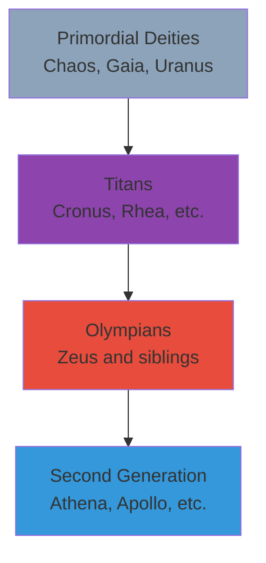

import Highlight from "@/react/Highlight/Highlight.jsx";

# Complete Guide to Greek Gods - The Olympians and Beyond
# கிரேக்க தெய்வங்கள் - ஒலிம்பஸ் மலையின் அதிபதிகள்

Ancient Greek mythology presents one of the most fascinating and influential pantheons in world history. The **Greek gods** were believed to reside on **Mount Olympus**, the highest mountain in Greece, ruling over mortals and nature with their divine powers, very human emotions, and complex personalities.

:::tip[Quick Overview - விரைவான கண்ணோட்டம்]
**The Twelve Olympians (Main Gods):**

1. ⚡ **Zeus** - King of Gods, God of Sky and Thunder
2. 👑 **Hera** - Queen of Gods, Goddess of Marriage
3. 🌊 **Poseidon** - God of the Sea
4. ⚔️ **Ares** - God of War
5. 🦉 **Athena** - Goddess of Wisdom and War Strategy
6. ☀️ **Apollo** - God of Sun, Music, and Prophecy
7. 🏹 **Artemis** - Goddess of the Hunt and Moon
8. 🔥 **Hephaestus** - God of Fire and Blacksmiths
9. 💕 **Aphrodite** - Goddess of Love and Beauty
10. 📨 **Hermes** - Messenger God, God of Trade
11. 🌾 **Demeter** - Goddess of Agriculture and Harvest
12. 🍷 **Dionysus** - God of Wine and Festivity

**Plus:** Hades (Underworld), Titans (Elder Gods), Primordial Deities (First Gods)
:::

---

## <Highlight color='#800031' highlight='fg' fontWeight='bold'> THE GREEK PANTHEON - HIERARCHY OF GODS </Highlight>

### <Highlight color='#004080' highlight='fg' fontWeight='bold'> The Divine Hierarchy </Highlight>

Greek mythology has a complex family tree of deities organized in generations:

**The Four Generations:**

**1. Primordial Deities (Πρωτόγονοι - Protogenoi):**
- **Chaos** (Χάος) - The Void, first to exist
- **Gaia** (Γαῖα) - Mother Earth
- **Uranus** (Οὐρανός) - Father Sky
- **Nyx** (Νύξ) - Night
- **Erebus** (Ἔρεβος) - Darkness
- **Tartarus** (Τάρταρος) - The Abyss
- **Eros** (Ἔρως) - Primordial Love

**2. Titans (Τιτᾶνες - Titanes):**
- Children of Gaia and Uranus
- Ruled before Olympians
- **Cronus** (Κρόνος) - Titan King, God of Time
- **Rhea** (Ῥέα) - Titan Queen
- **Oceanus, Hyperion, Iapetus, Themis**, and others

**3. Olympians (Ὀλύμπιοι - Olympioi):**
- Children of Titans (mainly Cronus and Rhea)
- Overthrew Titans in Titanomachy (War of Titans)
- Rule from Mount Olympus

**4. Second Generation Olympians:**
- Children of the original Olympians
- Athena, Apollo, Artemis, Hermes, etc.

---

## <Highlight color='#800031' highlight='fg' fontWeight='bold'> THE TWELVE OLYMPIANS - MAIN DEITIES </Highlight>

### <Highlight color='#004080' highlight='fg' fontWeight='bold'> 1. ZEUS (Ζεύς) - King of the Gods ⚡ </Highlight>

**Domains:**
- Sky, Thunder, Lightning
- Justice, Law, Order
- Hospitality, Oaths
- King of all gods and mortals

**Symbols:**
- ⚡ **Thunderbolt** (his weapon)
- 🦅 **Eagle** (sacred animal)
- 👑 **Scepter and Crown**
- ⚡ **Lightning bolt**

**Roman Equivalent:** Jupiter

**Family:**
- **Parents:** Titans Cronus and Rhea
- **Siblings:** Hestia, Demeter, Hera, Hades, Poseidon
- **Wife:** Hera (also his sister)
- **Children:** Athena, Apollo, Artemis, Hermes, Dionysus, Ares, Hephaestus, Persephone, and many demigods including Hercules, Perseus

**Key Myths:**

**Birth & Survival:**
- Cronus swallowed his children fearing prophecy (one would overthrow him)
- Rhea saved baby Zeus, hiding him in Crete
- Gave Cronus a stone wrapped in cloth instead
- Zeus grew up and forced Cronus to regurgitate siblings

**Titanomachy (War with Titans):**
- Led Olympians against Titans
- 10-year war for cosmic supremacy
- Won with help of Cyclopes (gave him thunderbolts) and Hecatoncheires
- Imprisoned Titans in Tartarus

**Personality:**
- Powerful, authoritative, decisive
- Just ruler but also wrathful
- Notorious for numerous love affairs
- Shape-shifter (became swan, bull, golden rain, etc. to seduce)

**Famous Stories:**
- Turning Lycaon into wolf for serving human flesh
- Prometheus bound for stealing fire
- Flood sent to destroy humanity (Deucalion survived)
- Io turned into cow to hide affair from Hera

---

### <Highlight color='#004080' highlight='fg' fontWeight='bold'> 2. HERA (Ἥρα) - Queen of the Gods 👑 </Highlight>

**Domains:**
- Marriage, Women, Childbirth
- Family, Motherhood
- Queen of Heaven

**Symbols:**
- 🦚 **Peacock** (sacred bird)
- 🐄 **Cow** (associated animal)
- 👑 **Crown/Diadem**
- 🍎 **Pomegranate** (symbol of fertility)

**Roman Equivalent:** Juno

**Family:**
- **Husband:** Zeus (also brother)
- **Children:** Ares, Hebe, Eileithyia, Hephaestus (some say born from Hera alone)

**Personality:**
- Dignified, majestic, proud
- Jealous and vengeful (especially toward Zeus's lovers)
- Protective of married women
- Wrathful toward Zeus's illegitimate children

**Famous Stories:**

**Vengeance on Zeus's Lovers:**
- **Io:** Turned into cow, sent gadfly to torment
- **Semele:** Tricked her to ask Zeus to reveal true form (killed by lightning)
- **Leto:** Prevented her from giving birth on solid ground
- **Hercules:** Persecuted him throughout life despite being stepson

**The Golden Apple:**
- Paris judged beauty contest (Hera, Athena, Aphrodite)
- Each goddess offered bribe
- Paris chose Aphrodite (who promised Helen)
- Hera's anger contributed to Trojan War

**Argus:**
- Hundred-eyed giant watchman
- Killed by Hermes
- Hera placed his eyes on peacock's tail

---

### <Highlight color='#004080' highlight='fg' fontWeight='bold'> 3. POSEIDON (Ποσειδῶν) - God of the Sea 🌊 </Highlight>

**Domains:**
- Sea, Oceans, Water
- Earthquakes ("Earth-Shaker")
- Horses, Bulls
- Storms, Navigation

**Symbols:**
- 🔱 **Trident** (three-pronged spear)
- 🐴 **Horse** (created horses)
- 🐬 **Dolphin**
- 🐂 **Bull**

**Roman Equivalent:** Neptune

**Family:**
- **Parents:** Cronus and Rhea
- **Wife:** Amphitrite (sea goddess)
- **Children:** Triton, Polyphemus (Cyclops), Theseus, many others
- **Brothers:** Zeus, Hades

**Personality:**
- Moody, temperamental (like the sea)
- Vengeful when disrespected
- Competitive with other gods
- Protective of sailors (when honored)

**Famous Stories:**

**Contest with Athena for Athens:**
- Both wanted to be patron of city
- Poseidon struck rock, created salt-water spring
- Athena planted olive tree
- Athenians chose Athena (olive more useful)
- Poseidon cursed Athens with water shortage

**Creation of Horses:**
- Created horse as gift for Demeter
- Took so long perfecting it, he fell out of love with her

**Odysseus's Enemy:**
- Odysseus blinded his son Polyphemus (Cyclops)
- Poseidon made Odysseus's journey home torturous (10 years)

**Palace Under the Sea:**
- Golden palace in ocean depths
- Rides chariot pulled by hippocampi (horse-fish creatures)

---

### <Highlight color='#004080' highlight='fg' fontWeight='bold'> 4. ATHENA (Ἀθηνᾶ) - Goddess of Wisdom 🦉 </Highlight>

**Domains:**
- Wisdom, Intelligence, Strategy
- War (defensive, strategic warfare)
- Crafts, Weaving
- Justice, Civilization

**Symbols:**
- 🦉 **Owl** (symbol of wisdom)
- 🌿 **Olive tree**
- 🛡️ **Aegis** (shield with Medusa's head)
- ⚔️ **Spear and Helmet**

**Roman Equivalent:** Minerva

**Family:**
- **Father:** Zeus (born from his head!)
- **Mother:** Metis (titaness of wisdom, swallowed by Zeus)
- **Virgin goddess** (never married or had children)

**Unique Birth:**
- Zeus swallowed pregnant Metis (feared powerful child)
- Terrible headache ensued
- Hephaestus split Zeus's head with axe
- Athena emerged fully grown, in armor, shouting war cry

**Personality:**
- Wise, rational, strategic
- Brave, fierce in battle
- Fair, just, merciful
- Virgin goddess (Athena Parthenos)
- Patron of heroes

**Famous Stories:**

**Arachne:**
- Mortal weaver boasted better than Athena
- Weaving contest held
- Arachne's tapestry mocked gods' scandals (technically perfect)
- Athena destroyed it, turned Arachne into spider
- Spiders weave forever as punishment

**Medusa:**
- Medusa desecrated Athena's temple (raped by Poseidon there)
- Athena punished Medusa (turned hair to snakes, gaze to stone)
- Later helped Perseus kill Medusa
- Placed Medusa's head on her shield (Aegis)

**Patron of Heroes:**
- Helped Perseus kill Medusa
- Guided Odysseus home (odyssey)
- Supported Heracles (Hercules) in labors
- Aided Bellerophon against Chimera

---

### <Highlight color='#004080' highlight='fg' fontWeight='bold'> 5. APOLLO (Ἀπόλλων) - God of Sun and Arts ☀️ </Highlight>

**Domains:**
- Sun, Light
- Music, Poetry, Arts
- Prophecy, Oracles
- Healing, Medicine
- Archery, Plague
- Youth, Beauty

**Symbols:**
- 🎵 **Lyre** (musical instrument)
- 🏹 **Silver bow and arrows**
- ☀️ **Sun chariot**
- 🐍 **Python** (serpent he slew)
- 🌿 **Laurel wreath**
- 🦢 **Swan**

**Roman Equivalent:** Apollo (same name)

**Family:**
- **Parents:** Zeus and Leto (titaness)
- **Twin Sister:** Artemis
- **Children:** Asclepius (god of medicine), Orpheus (legendary musician)

**Personality:**
- Beautiful, youthful, radiant
- Talented artist, perfect musician
- Sometimes arrogant
- Passionate but tragic in love
- Rational, civilized, lawful

**Famous Stories:**

**Birth:**
- Hera jealously prevented Leto from giving birth on land
- Leto found floating island of Delos
- Gave birth to Artemis first, who helped deliver Apollo

**Slaying Python:**
- Giant serpent Python guarded Delphi
- Apollo killed it (only 4 days old!)
- Established Oracle of Delphi on that spot
- Pythia (priestess) channeled his prophecies

**Tragic Loves:**

**Daphne:**
- Apollo mocked Eros (Cupid)
- Eros shot Apollo with gold arrow (love) and Daphne with lead arrow (repulsion)
- Apollo pursued, Daphne fled
- She begged father (river god) for help
- Transformed into laurel tree
- Apollo made laurel his sacred plant

**Hyacinthus:**
- Beautiful youth, beloved by Apollo
- Playing discus together
- Discus struck Hyacinth's head (some say redirected by jealous Zephyrus)
- Died in Apollo's arms
- Apollo created hyacinth flower from his blood

**The Oracle of Delphi:**
- Most important oracle in Greek world
- "Know thyself" inscribed at entrance
- Pythia inhaled vapors, gave cryptic prophecies
- Kings consulted before wars

---

### <Highlight color='#004080' highlight='fg' fontWeight='bold'> 6. ARTEMIS (Ἄρτεμις) - Goddess of the Hunt 🏹 </Highlight>

**Domains:**
- Hunt, Wildlife, Animals
- Moon, Night
- Virginity, Maidens
- Childbirth (protector of women)
- Wilderness

**Symbols:**
- 🏹 **Bow and arrows**
- 🌙 **Crescent moon**
- 🦌 **Deer**
- 🐻 **Bear**
- 🌲 **Cypress tree**

**Roman Equivalent:** Diana

**Family:**
- **Parents:** Zeus and Leto
- **Twin Brother:** Apollo
- **Virgin goddess** (never married)

**Personality:**
- Independent, fierce, strong
- Protective of young girls and women
- Vengeful when disrespected
- Compassionate to animals
- Values chastity highly

**Famous Stories:**

**Actaeon:**
- Hunter stumbled upon Artemis bathing naked
- She turned him into stag
- His own hunting dogs tore him apart

**Orion:**
- Giant hunter, possible love interest
- Various versions of death:
  - Artemis killed him (boasted to kill all animals, or tried to rape her)
  - Apollo tricked her into shooting him
  - Scorpion sent by Gaia killed him
- Placed among stars as constellation

**Niobe:**
- Queen boasted she had more children than Leto (14 vs 2)
- Apollo and Artemis killed all 14 children with arrows
- Niobe turned to stone, eternally weeping

**Callisto:**
- Nymph follower of Artemis, vowed virginity
- Zeus raped her (disguised as Artemis)
- Became pregnant, expelled from Artemis's group
- Turned into bear (by Hera or Artemis)
- Son Arcas almost killed her
- Zeus placed both in sky (Ursa Major and Minor constellations)

---

### <Highlight color='#004080' highlight='fg' fontWeight='bold'> 7. ARES (Ἄρης) - God of War ⚔️ </Highlight>

**Domains:**
- War (bloodlust, violence, brutality)
- Courage, Valor
- Civil Order (through fear)

**Symbols:**
- ⚔️ **Sword and Spear**
- 🛡️ **Shield**
- 🐕 **War dogs**
- 🦅 **Vulture**
- 🔥 **Burning torch**

**Roman Equivalent:** Mars (more respected in Rome)

**Family:**
- **Parents:** Zeus and Hera
- **Lover:** Aphrodite (goddess of love)
- **Children:** Phobos (Fear), Deimos (Terror), Harmonia, Amazons (warrior women)

**Personality:**
- Aggressive, brutal, bloodthirsty
- Impulsive, short-tempered
- Cowardly (despite being war god)
- Least liked among Olympians
- Physical strength but not strategic

**Contrast with Athena:**
- **Ares:** Chaotic warfare, bloodlust, violence
- **Athena:** Strategic warfare, wisdom, defense

**Famous Stories:**

**Affair with Aphrodite:**
- Aphrodite married to Hephaestus
- Had affair with Ares
- Hephaestus forged invisible net
- Caught them in bed, exposed to all gods
- Humiliation, but continued affair

**Trojan War:**
- Supported Trojans (mother Hera supported Greeks)
- Wounded by Diomedes (with Athena's help)
- Ran crying to Zeus
- Zeus called him most hateful of gods

**Captured by Giants:**
- Two giants (Otus and Ephialtes) imprisoned Ares in bronze jar
- Held for 13 months
- Rescued by Hermes
- Embarrassing for a war god!

---

### <Highlight color='#004080' highlight='fg' fontWeight='bold'> 8. APHRODITE (Ἀφροδίτη) - Goddess of Love 💕 </Highlight>

**Domains:**
- Love, Beauty, Desire
- Sexuality, Pleasure
- Procreation

**Symbols:**
- 🐚 **Seashell** (born from sea foam)
- 🕊️ **Dove**
- 🦢 **Swan**
- 🌹 **Rose**
- 🍎 **Apple**
- 💕 **Mirror**

**Roman Equivalent:** Venus

**Family:**
- **Birth:** Born from sea foam (from Uranus's castrated genitals) OR daughter of Zeus and Dione
- **Husband:** Hephaestus (arranged by Zeus)
- **Lovers:** Ares, Adonis, Anchises
- **Children:** Eros (Cupid), Aeneas (with Anchises), Harmonia, Phobos, Deimos

**Personality:**
- Irresistibly beautiful
- Vain, proud of beauty
- Mischievous, playful
- Jealous of rivals in beauty
- Powerful influence over gods and mortals

**Famous Stories:**

**Birth:**
- Cronus castrated father Uranus, threw genitals into sea
- From sea foam arose Aphrodite
- Floated to shore on seashell
- "Aphros" = foam in Greek

**Judgment of Paris:**
- Golden apple inscribed "To the Fairest"
- Hera, Athena, Aphrodite claimed it
- Paris (Trojan prince) chosen to judge
- **Hera** offered power
- **Athena** offered wisdom/victory
- **Aphrodite** offered most beautiful woman (Helen)
- Paris chose Aphrodite
- Led to Trojan War (Helen was already married to Menelaus)

**Adonis:**
- Incredibly handsome mortal
- Aphrodite fell in love
- Killed by wild boar (some say sent by jealous Ares)
- Aphrodite's tears + Adonis's blood = anemone flowers
- Zeus allowed him to spend part of year with Aphrodite, part in underworld

**Pygmalion:**
- Sculptor who couldn't find perfect woman
- Carved ivory statue of ideal woman
- Fell in love with statue
- Prayed to Aphrodite
- She brought statue to life (Galatea)

---

### <Highlight color='#004080' highlight='fg' fontWeight='bold'> 9. HEPHAESTUS (Ἥφαιστος) - God of Fire and Forge 🔥 </Highlight>

**Domains:**
- Fire, Metalworking, Blacksmithing
- Craftsmanship, Sculpture
- Volcanoes
- Technology, Invention

**Symbols:**
- 🔨 **Hammer and Anvil**
- 🔥 **Fire**
- 🛠️ **Blacksmith's tools**
- 🦵 **Leg braces** (was lame)

**Roman Equivalent:** Vulcan

**Family:**
- **Mother:** Hera (born from her alone, or with Zeus)
- **Wife:** Aphrodite (unfaithful)
- **Children:** Various, including automatons (robots!)

**Unique Traits:**
- **Only "ugly" Olympian** (lame, deformed)
- **Kindest, most peaceful god**
- **Most skilled craftsman**

**Famous Stories:**

**Birth and Rejection:**
- Born lame/deformed
- Hera threw him from Olympus (ashamed)
- Fell for 9 days, landed in ocean
- Raised by sea nymphs Thetis and Eurynome
- Learned metalworking in undersea grotto

**Revenge on Hera:**
- Crafted beautiful golden throne, sent to Hera
- She sat down, became trapped by invisible chains
- No god could free her
- Dionysus got Hephaestus drunk, brought back to Olympus
- Hephaestus freed Hera, accepted back among gods

**Marriage to Aphrodite:**
- Zeus arranged marriage (compensation for earlier rejection)
- Aphrodite unfaithful (affair with Ares)
- Hephaestus crafted invisible net, caught them
- Exposed lovers to mockery of gods

**Amazing Creations:**
- ⚡ **Zeus's thunderbolts**
- 🛡️ **Achilles's armor** (indestructible)
- 🏹 **Arrows of Apollo and Artemis**
- 👑 **Pandora** (first woman, as punishment for mankind)
- 🤖 **Automatons** (mechanical servants made of gold)
- 🏛️ **Palaces on Mount Olympus**
- 🛡️ **Aegis** (Athena's shield)

**Workshop:**
- Under volcanoes (especially Mt. Etna in Sicily)
- Assisted by Cyclopes
- Explained volcanic eruptions (his forge at work)

---

### <Highlight color='#004080' highlight='fg' fontWeight='bold'> 10. HERMES (Ἑρμῆς) - Messenger God 📨 </Highlight>

**Domains:**
- Messengers, Communication
- Trade, Commerce, Merchants
- Thieves, Trickery, Cunning
- Travel, Roads
- Herds, Shepherds
- Guide of souls to underworld

**Symbols:**
- 🪽 **Winged sandals** (Talaria)
- 🪄 **Caduceus** (staff with two snakes)
- 🎩 **Winged helmet** (Petasos)
- 🐏 **Ram**
- 🐢 **Tortoise** (made first lyre)

**Roman Equivalent:** Mercury

**Family:**
- **Parents:** Zeus and Maia (Pleiad nymph)
- **Children:** Pan (god of wild, half-goat), Hermaphroditus
- **Son:** Autolycus (master thief)

**Personality:**
- Clever, witty, cunning
- Playful, mischievous
- Quick-thinking, eloquent
- Inventive, resourceful
- Friendly, helpful

**Famous Stories:**

**Newborn Thief:**
- **Born at dawn, by noon had:**
  - Escaped cradle
  - Found tortoise, invented lyre (musical instrument)
  - Stole Apollo's cattle (only hours old!)
  - Covered tracks by making cattle walk backwards
  - Sacrificed two cattle to Olympians (first sacrifice)

**Apollo's Anger:**
- Apollo discovered theft
- Dragged infant Hermes to Zeus
- Hermes played innocent
- Then played lyre he invented
- Apollo enchanted by music
- Trade: Hermes gave lyre, Apollo gave cattle + caduceus staff
- Made god of herds

**Psychopomp (Soul Guide):**
- Only god who could freely travel to underworld
- Guided dead souls to Hades
- Helped heroes on underworld quests

**Helper of Heroes:**
- Gave Perseus winged sandals and sword to kill Medusa
- Warned Odysseus about Circe, gave him protective herb
- Rescued Ares from giants
- Killed hundred-eyed Argus (who guarded Io)

**Inventions:**
- Lyre (from tortoise shell)
- Pan pipes
- Alphabet (in some traditions)
- Numbers
- Astronomy

---

### <Highlight color='#004080' highlight='fg' fontWeight='bold'> 11. DEMETER (Δημήτηρ) - Goddess of Harvest 🌾 </Highlight>

**Domains:**
- Agriculture, Grain, Harvest
- Fertility of Earth
- Sacred Law
- Seasons (through daughter)

**Symbols:**
- 🌾 **Wheat/Grain**
- 🌽 **Cornucopia** (horn of plenty)
- 🐖 **Pig**
- 🕊️ **Dove**
- 🔥 **Torch** (searching for Persephone)

**Roman Equivalent:** Ceres (where "cereal" comes from)

**Family:**
- **Parents:** Cronus and Rhea
- **Siblings:** Zeus, Hera, Poseidon, Hades, Hestia
- **Daughter:** Persephone (with Zeus)

**Personality:**
- Nurturing, maternal
- Generous (provides food)
- Grief-stricken (loss of daughter)
- Powerful when angered
- Protective of daughter

**Famous Myth - Persephone's Abduction:**

**The Abduction:**
- Persephone picking flowers
- Hades (god of underworld) abducted her
- Took her to underworld as bride
- Zeus had given permission (didn't tell Demeter)

**Demeter's Grief:**
- Searched world for daughter (9 days, 9 nights)
- Learned truth from Helios (sun god who sees all)
- Devastated, refused godly duties
- Neglected earth

**Consequences:**
- Earth became barren
- Nothing grew, perpetual winter
- Humans starved
- No sacrifices for gods

**Zeus's Intervention:**
- Sent Hermes to retrieve Persephone
- Hades agreed BUT
- Persephone had eaten pomegranate seeds in underworld
- Rule: Anyone who eats in underworld must return

**The Compromise:**
- Persephone ate 4 (or 6) pomegranate seeds
- Must spend 4 (or 6) months in underworld each year
- Rest of year with mother

**Origin of Seasons:**
- **Spring/Summer:** Persephone with Demeter, earth blooms (6-8 months)
- **Fall/Winter:** Persephone in underworld, Demeter grieves, earth barren (4-6 months)

**Eleusinian Mysteries:**
- Secret religious rites in Eleusis
- Based on Demeter and Persephone myth
- Promised better afterlife to initiates
- Most important mystery cult in ancient Greece

---

### <Highlight color='#004080' highlight='fg' fontWeight='bold'> 12. DIONYSUS (Διόνυσος) - God of Wine 🍷 </Highlight>

**Domains:**
- Wine, Winemaking
- Festivity, Ecstasy, Madness
- Theater, Drama
- Fertility, Vegetation

**Symbols:**
- 🍇 **Grapes and Wine**
- 🎭 **Theater masks** (comedy/tragedy)
- 🌿 **Thyrsus** (staff with pine cone)
- 🐆 **Leopard/Panther**
- 🍃 **Ivy wreath**

**Roman Equivalent:** Bacchus

**Family:**
- **Parents:** Zeus and Semele (mortal Theban princess)
- **Wife:** Ariadne (Cretan princess)

**Unique Status:**
- Only Olympian with mortal parent
- Born twice
- Last god to join Olympus
- Sometimes replaces Hestia in Twelve Olympians list

**Famous Stories:**

**Birth (Born Twice):**
- Zeus disguised as mortal, affair with Semele
- Hera (jealous) disguised as old woman
- Convinced Semele to ask Zeus to reveal true form
- Zeus reluctantly agreed
- His divine lightning killed mortal Semele
- Zeus rescued unborn Dionysus, sewed into his thigh
- Months later, Dionysus born from Zeus's thigh

**Driven Mad by Hera:**
- Hera cursed him with madness
- Wandered world (Asia, India, Egypt)
- Taught viticulture (growing grapes)
- Gathered followers (Maenads - ecstatic women)

**Arrival in Greece:**
- Returned to Greece with wild cult
- Many rejected him
- Punished those who refused to worship him

**King Pentheus:**
- King of Thebes refused to honor Dionysus
- Dionysus drove Theban women mad
- Led by Pentheus's mother Agave
- Tore Pentheus apart (thinking he was lion)
- Mother realized she held son's head
- Tragic lesson: Don't disrespect gods

**Pirates:**
- Pirates kidnapped Dionysus (thought he was wealthy prince)
- Tried to sell into slavery
- Dionysus revealed godhood:
  - Vines grew around mast
  - Transformed into lion
  - Pirates went mad, jumped into sea
  - Became dolphins
- Only helmsman (who recognized god) spared

**Ariadne:**
- Found her abandoned by Theseus on Naxos island
- Married her, made her immortal
- Placed her crown among stars (Corona Borealis)

**Theater:**
- Ancient Greek theater festivals honored Dionysus
- Tragedy and comedy originated in his worship
- Theater = sacred ritual space

---

## <Highlight color='#800031' highlight='fg' fontWeight='bold'> OTHER MAJOR GODS </Highlight>

### <Highlight color='#004080' highlight='fg' fontWeight='bold'> HADES (ᾍδης) - God of the Underworld 💀 </Highlight>

**Domain:** Underworld, Dead, Wealth (precious metals underground)

**Why Not Olympian?** 
- Lived in underworld, not Mount Olympus
- One of three most powerful gods (with Zeus, Poseidon)

**Symbols:**
- 🐕 **Cerberus** (three-headed dog)
- 👑 **Helm of Darkness** (invisibility)
- 🔱 **Scepter**
- 💀 **Skull**

**Roman Equivalent:** Pluto

**Family:**
- **Parents:** Cronus and Rhea
- **Wife:** Persephone (abducted)
- **Brothers:** Zeus, Poseidon

**Personality:**
- Stern, grim, unyielding
- Just, fair (not evil!)
- Rarely left underworld
- Most feared god (name avoided)
- Called "The Rich One" (euphemism)

**Underworld Regions:**
- **Elysium/Elysian Fields:** Paradise for heroes and virtuous
- **Asphodel Meadows:** Ordinary souls, neutral afterlife
- **Tartarus:** Punishment for wicked, prison for Titans
- **Fields of Punishment:** Torment for sinners

**Famous Souls in Tartarus:**
- **Sisyphus:** Rolls boulder uphill, it rolls down, repeats eternally
- **Tantalus:** Stands in water/fruit, but can't reach (eternal hunger/thirst)
- **Ixion:** Bound to fiery wheel spinning forever

---

### <Highlight color='#004080' highlight='fg' fontWeight='bold'> HESTIA (Ἑστία) - Goddess of Hearth 🔥 </Highlight>

**Domain:** Hearth, Home, Family, Domesticity

**Symbols:**
- 🔥 **Sacred fire**
- 🏛️ **Hearth**

**Roman Equivalent:** Vesta

**Family:**
- **Parents:** Cronus and Rhea
- **Virgin goddess** (rejected Apollo and Poseidon)

**Status:**
- Original Olympian, gave seat to Dionysus
- Most peaceful, humble goddess
- No drama, no myths (very unusual!)

**Importance:**
- Every meal began with offering to Hestia
- Public hearths in every city (sacred fires never extinguished)
- Vestal Virgins in Rome tended her sacred fire

---

## <Highlight color='#800031' highlight='fg' fontWeight='bold'> COMPARISON WITH OTHER MYTHOLOGIES </Highlight>

### <Highlight color='#004080' highlight='fg' fontWeight='bold'> Greek vs Roman Gods </Highlight>

| Greek Name | Roman Name | Domain |
|------------|------------|--------|
| Zeus | Jupiter | Sky, Thunder, King |
| Hera | Juno | Marriage, Queen |
| Poseidon | Neptune | Sea |
| Hades | Pluto | Underworld |
| Athena | Minerva | Wisdom, War |
| Apollo | Apollo | Sun, Arts |
| Artemis | Diana | Hunt, Moon |
| Ares | Mars | War |
| Aphrodite | Venus | Love, Beauty |
| Hephaestus | Vulcan | Fire, Forge |
| Hermes | Mercury | Messenger |
| Demeter | Ceres | Harvest |
| Dionysus | Bacchus | Wine |
| Hestia | Vesta | Hearth |

**Key Differences:**
- Roman gods more military, serious
- Greek gods more artistic, philosophical
- Mars (Roman) more respected than Ares (Greek)
- Romans absorbed Greek mythology but renamed gods

---

### <Highlight color='#004080' highlight='fg' fontWeight='bold'> Parallels with Hindu Mythology </Highlight>

| Greek God | Hindu God | Similar Domain |
|-----------|-----------|----------------|
| Zeus | Indra | King of gods, Thunder |
| Poseidon | Varuna | God of waters, Oceans |
| Hades | Yama | God of death, Underworld |
| Apollo | Surya | Sun god |
| Artemis | Chandra | Moon deity |
| Athena | Saraswati | Wisdom, Knowledge |
| Ares | Kartikeya/Murugan | War god |
| Aphrodite | Rati | Love, Beauty |
| Hephaestus | Vishwakarma | Divine craftsman |
| Hermes | Narada | Messenger, Traveler |

---

## <Highlight color='#800031' highlight='fg' fontWeight='bold'> GREEK MYTHOLOGY IN MODERN CULTURE </Highlight>

### <Highlight color='#004080' highlight='fg' fontWeight='bold'> Lasting Influence </Highlight>

**Language & Expressions:**
- "Achilles' heel" - vulnerability
- "Pandora's box" - source of troubles
- "Herculean task" - extremely difficult job
- "Narcissism" - from Narcissus myth
- "Odyssey" - long journey
- "Titanic" - huge, powerful
- "Aphrodisiac" - from Aphrodite

**Astronomy:**
- Planets named after Roman versions of Greek gods
- Constellations: Orion, Hercules, Andromeda, etc.
- Moons of planets: Zeus's lovers (Io, Europa, Ganymede)

**Psychology:**
- **Oedipus Complex** - Freud (from Oedipus myth)
- **Electra Complex**
- **Narcissistic Personality Disorder**

**Modern Media:**
- Movies: Clash of the Titans, Troy, 300, Wonder Woman
- Books: Percy Jackson series, Circe, Song of Achilles
- Video Games: God of War, Assassin's Creed Odyssey, Hades
- Comics: Wonder Woman (Amazons), Thor vs Hercules

**Brand Names:**
- Nike (goddess of victory)
- Amazon (warrior women)
- Apollo (space program)
- Pandora (jewelry, music)
- Trojan (condoms - ironic!)
- Olympus (cameras)
- Hermes (luxury brand)

---

## <Highlight color='#800031' highlight='fg' fontWeight='bold'> KEY TAKEAWAYS </Highlight>

### <Highlight color='#004080' highlight='fg' fontWeight='bold'> Understanding Greek Gods </Highlight>

**1. Very Human Gods:**
- Unlike many religions, Greek gods have human flaws
- Jealousy, anger, lust, pride
- Made mistakes, could be tricked
- Immortal but not omnipotent

**2. Family Drama:**
- Olympians were one big dysfunctional family
- Lots of infighting, affairs, revenge
- Children overthrowing parents (Cronus vs Uranus, Zeus vs Cronus)

**3. Explanatory Myths:**
- Explained natural phenomena (seasons, weather, earthquakes)
- Explained human conditions (love, war, death)
- Taught moral lessons

**4. No Single Scripture:**
- Unlike Bible or Quran, no single authoritative text
- Stories from Homer (Iliad, Odyssey), Hesiod (Theogony), plays, poems
- Many variations of same myths

**5. Religion & Culture:**
- Not just stories - actual religion of ancient Greeks
- Temples, sacrifices, festivals
- Oracle consultations for major decisions
- Athletic games (Olympics) honored Zeus

**6. Polytheism:**
- Many gods for many purposes
- Each controlled different aspect
- Pray to specific god for specific need

---

## <Highlight color='#800031' highlight='fg' fontWeight='bold'> CONCLUSION </Highlight>

Greek mythology remains one of the most influential cultural legacies of Western civilization. These gods and their stories have shaped literature, art, philosophy, psychology, and language for over 2,500 years.

**Why Greek Myths Endure:**

✅ **Universal Themes:** Love, jealousy, ambition, revenge, heroism   
✅ **Complex Characters:** Gods with strengths and weaknesses   
✅ **Great Stories:** Adventure, tragedy, comedy, romance   
✅ **Philosophical Depth:** Questions about fate, justice, mortality   
✅ **Cultural Foundation:** Basis of Western literature and art   

**Modern Relevance:**

The Greek gods represent timeless aspects of human nature and experience:
- **Zeus:** Authority, power, leadership
- **Athena:** Wisdom, strategy, intelligence
- **Aphrodite:** Love, beauty, desire
- **Ares:** Aggression, conflict
- **Apollo:** Civilization, arts, order
- **Dionysus:** Ecstasy, freedom, chaos

Whether viewed as ancient religion, mythology, literature, or psychology, the Greek gods continue to captivate, inspire, and teach us about ourselves and our world.

---

**Further Reading:**
- Homer's Iliad and Odyssey
- Hesiod's Theogony and Works and Days
- Ovid's Metamorphoses
- Edith Hamilton's Mythology
- Stephen Fry's Mythos, Heroes, Troy

**Visit Greece:**
- Parthenon (Athens) - Temple of Athena
- Delphi - Oracle of Apollo
- Olympia - Site of ancient Olympics
- Mount Olympus - Home of the gods

---

**ευχαριστώ (Efharistó) - Thank you!** 🏛️

May the gods smile upon you! ⚡🦉🔱
