import Highlight from "@/react/Highlight/Highlight.jsx";

The Hindu calendar is a lunisolar system that beautifully weaves together the movements of the Sun and Moon to create a framework for religious observances, festivals, and auspicious timings. At its heart lies the concept of **tithi**—the lunar day—which governs when millions of Hindus observe fasts, celebrate festivals, and perform rituals.

## <Highlight color='#800031' highlight='fg' fontWeight='bold'> What is Tithi? Understanding the Lunar Day </Highlight>

### <Highlight color='#004080' highlight='fg' fontWeight='bold'> Tithi: Not a Solar Day </Highlight>

**Tithi (திதி in Tamil)** is fundamentally different from a solar day. While a solar day is the time Earth takes to complete one rotation (24 hours), a tithi is based on the **angular relationship between the Sun and Moon**.

**Definition:**
> A tithi is the time required for the longitudinal angle between the Sun and Moon to increase by 12 degrees.

**Key Characteristics:**

- **Duration**: Variable, ranging from 19 to 26 hours (average ~23 hours 37 minutes)
- **Not fixed**: Unlike solar days, tithis can be shorter or longer
- **Moon-based**: Depends on the Moon's position relative to the Sun
- **360° cycle**: 30 tithis complete one lunar month (30 × 12° = 360°)

:::note[Why Tithi Duration Varies]
The Moon's orbit around Earth is elliptical, not circular. When the Moon is closer to Earth (perigee), it moves faster, making tithis shorter. When farther (apogee), it moves slower, making tithis longer.
:::

### <Highlight color='#004080' highlight='fg' fontWeight='bold'> Visual Understanding: Sun-Moon Angle </Highlight>

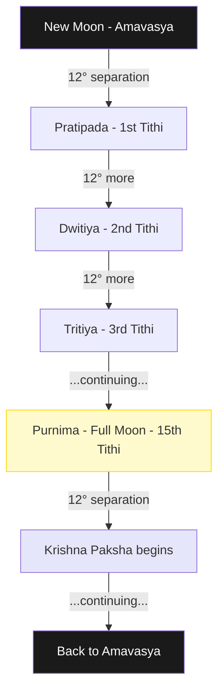

## <Highlight color='#800031' highlight='fg' fontWeight='bold'> The Two Pakshas: Moon's Waxing and Waning </Highlight>

Each lunar month is divided into two phases (pakshas), each containing 15 tithis:

### <Highlight color='#004080' highlight='fg' fontWeight='bold'> 1. Shukla Paksha (வளர்பிறை - Waxing Moon) </Highlight>

**Sanskrit:** शुक्ल पक्ष (Shukla Paksha)  
**Tamil:** வளர்பிறை (Valarpirai)  
**Meaning:** Bright fortnight, waxing phase  
**Duration:** From New Moon (Amavasya) to Full Moon (Purnima)

**Etymology:**
- **शुक्ल (Shukla)** = White, bright, shining, luminous
- **पक्ष (Paksha)** = Side, wing, half of anything (here: fortnight in lunar calendar)

**Characteristics:**
- Moon's visible portion **increases** daily
- Considered **auspicious** for new beginnings
- Most major festivals fall in this period
- Spiritually associated with growth and prosperity

### <Highlight color='#004080' highlight='fg' fontWeight='bold'> 2. Krishna Paksha (தேய்பிறை - Waning Moon) </Highlight>

**Sanskrit:** कृष्ण पक्ष (Krishna Paksha)  
**Tamil:** தேய்பிறை (Theypirai)  
**Meaning:** Dark fortnight, waning phase  
**Duration:** From Full Moon (Purnima) to New Moon (Amavasya)

**Etymology:**
- **कृष्ण (Krishna)** = Black, dark, deep blue (referring to the darkening moon)
- **पक्ष (Paksha)** = Side, wing, half of anything (here: fortnight in lunar calendar)

**Characteristics:**
- Moon's visible portion **decreases** daily
- Considered suitable for introspection, ancestor worship
- Important for certain spiritual practices
- Associated with letting go and dissolution

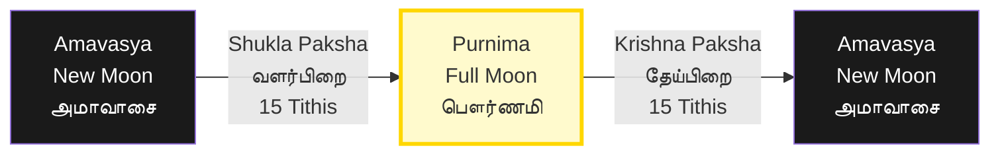

## <Highlight color='#800031' highlight='fg' fontWeight='bold'> The 15 Tithis: Complete List with Tamil Names </Highlight>

Each paksha has 15 tithis. Here's the complete list with Sanskrit, Tamil, and English meanings:

### <Highlight color='#004080' highlight='fg' fontWeight='bold'> Tithis 1-15: Same Names in Both Pakshas </Highlight>

| # | Sanskrit Name | Tamil Name | Meaning | Moon Phase |
|---|---------------|------------|---------|------------|
| **1** | प्रतिपदा (Pratipada/Prathama) | பிரதமை (Pirathamai) | First | Crescent begins |
| **2** | द्वितीया (Dwitiya) | துவிதியை (Thuvidhiyai) | Second | Thin crescent |
| **3** | तृतीया (Tritiya) | திருதியை (Thiruthiyai) | Third | Thicker crescent |
| **4** | चतुर्थी (Chaturthi) | சதுர்த்தி (Sathurththi) | Fourth | Quarter begins |
| **5** | पंचमी (Panchami) | பஞ்சமி (Panjami) | Fifth | Past quarter |
| **6** | षष्ठी (Shashthi) | சஷ்டி (Sashti) | Sixth | Growing gibbous |
| **7** | सप्तमी (Saptami) | சப்தமி (Sapthami) | Seventh | More gibbous |
| **8** | अष्टमी (Ashtami) | அஷ்டமி (Ashtami) | Eighth | Nearly full/half |
| **9** | नवमी (Navami) | நவமி (Navami) | Ninth | Almost full |
| **10** | दशमी (Dashami) | தசமி (Thasami) | Tenth | Very close to full |
| **11** | एकादशी (Ekadashi) | ஏகாதசி (Ekathasi) | Eleventh | Nearly full |
| **12** | द्वादशी (Dwadashi) | துவாதசி (Thuvaathasi) | Twelfth | Almost complete |
| **13** | त्रयोदशी (Trayodashi) | திரயோதசி (Thirayothasi) | Thirteenth | Nearly full |
| **14** | चतुर्दशी (Chaturdashi) | சதுர்த்தசி (Sathurththasi) | Fourteenth | Almost complete |
| **15** | पूर्णिमा (Purnima) or अमावस्या (Amavasya) | பௌர்ணமி (Pournami) or அமாவாசை (Amavasai) | Full Moon or New Moon | Complete |

:::tip[Important Note on the 15th Tithi]
- In **Shukla Paksha** (வளர்பிறை), the 15th tithi is **Purnima (பௌர்ணமி)** - Full Moon
- In **Krishna Paksha** (தேய்பிறை), the 15th tithi is **Amavasya (அமாவாசை)** - New Moon
:::

### <Highlight color='#004080' highlight='fg' fontWeight='bold'> Special Tithis and Their Significance </Highlight>

#### **Ekadashi (ஏகாதசி) - 11th Tithi**

The most important tithi for fasting and spiritual practices:
- Occurs twice a month (Shukla & Krishna Paksha)
- 24 Ekadashis in a year (+ 2 extra in leap years)
- Dedicated to Lord Vishnu
- Strict fasting observed by devotees

**Famous Ekadashis:**
- **Vaikunta Ekadashi** (வைகுண்ட ஏகாதசி) - Margashirsha Shukla Ekadashi
- **Rama Ekadashi** - Kartik Krishna Ekadashi

#### **Chaturthi (சதுர்த்தி) - 4th Tithi**

Sacred to Lord Ganesha:
- **Sankashti Chaturthi / Sankatahara Chaturthi (சங்கடஹர சதுர்த்தி)** - Krishna Paksha Chaturthi (monthly)
  - **संकष्ट (Sankashti)** = Difficulty, trouble, calamity
  - **संकटहर (Sankatahara)** = Remover of obstacles/difficulties (संकट = obstacle + हर = remover)
  - Observed to remove obstacles and seek Ganesha's blessings
- **Vinayaka Chaturthi** (விநாயக சதுர்த்தி) - Bhadrapada Shukla Chaturthi (annual festival)
  - **भाद्रपद (Bhadrapada)** = The sixth month in Hindu calendar, auspicious for Lord Ganesha
  - भद्र (Bhadra) = blessed, auspicious, prosperous + पद (Pada) = foot/step

#### **Ashtami (அஷ்டமி) - 8th Tithi**

Sacred to Goddess Durga:
- **Durga Ashtami** during Navaratri
- **Krishna Jayanti** (கிருஷ்ண ஜெயந்தி) - Bhadrapada Krishna Ashtami

#### **Navami (நவமி) - 9th Tithi**

- **Rama Navami** (ராம நவமி) - Chaitra Shukla Navami (சித்திரை வளர்பிறை நவமி)
- **Maha Navami** during Navaratri

#### **Shashthi (சஷ்டி) - 6th Tithi**

Sacred to Lord Murugan (Kartikeya):
- **Skanda Shashthi** (ஸ்கந்த சஷ்டி) - Monthly observance on every Shashthi
- **Maha Skanda Shashthi** (மஹா ஸ்கந்த சஷ்டி) - The grand annual festival
  - **Date Formula:** Shashthi (6th tithi) of Shukla Paksha (வளர்பிறை) in Aippasi month (ஐப்பசி மாதம்)
  - **Calculation:** 6th day of the waxing moon in Tamil month of Aippasi (October-November)
  - Corresponds to Kartik month in North India
  - Devotees fast for 6 days leading up to this day
  - Celebrates Lord Murugan's victory over demon Soorapadman

## <Highlight color='#800031' highlight='fg' fontWeight='bold'> Pradosham: The Sacred Twilight Period </Highlight>

### <Highlight color='#004080' highlight='fg' fontWeight='bold'> What is Pradosham? </Highlight>

**Pradosham (பிரதோஷம்)** is one of the most auspicious times for worshipping Lord Shiva. It occurs twice every lunar month on the **Trayodashi (13th tithi)** of both pakshas.

**Etymology:**
- **Pra** (प्र) = Before
- **Dosha** (दोष) = Darkness/Evening
- **Pradosha** = The period just before darkness sets in (twilight)

### <Highlight color='#004080' highlight='fg' fontWeight='bold'> Pradosha Kaalam (பிரதோஷ காலம்) - Timing </Highlight>

**Pradosha Kaalam** is the specific time window for worship:

**Duration:** 1.5 hours centered around sunset
- **Start:** 1 hour and 30 minutes before sunset
- **Peak:** Sunset time
- **End:** 1 hour after sunset

**Formula:**
```
Sunset Time = S
Pradosha Start = S - 1.5 hours
Pradosha Peak = S
Pradosha End = S + 1 hour
```

**Example:** If sunset is at 6:00 PM
- Pradosha Kaalam: 4:30 PM to 7:00 PM
- Most auspicious: 5:30 PM to 6:30 PM

:::tip[Liturgical Timing]
The exact timing varies by location and season. Check local panchang (almanac) for precise Pradosha Kaalam in your area.
:::

### <Highlight color='#004080' highlight='fg' fontWeight='bold'> Types of Pradosham </Highlight>

There are **two types** of Pradosham each month:

#### **1. Shukla Paksha Pradosham (வளர்பிறை பிரதோஷம்)**

**When:** Trayodashi (13th tithi) during Shukla Paksha (waxing moon)  
**Tamil:** வளர்பிறை திரயோதசி பிரதோஷம்  
**Moon Phase:** Waxing, nearly full  
**Significance:** Growing moon symbolizes prosperity and growth

#### **2. Krishna Paksha Pradosham (தேய்பிறை பிரதோஷம்)**

**When:** Trayodashi (13th tithi) during Krishna Paksha (waning moon)  
**Tamil:** தேய்பிறை திரயோதசி பிரதோஷம்  
**Moon Phase:** Waning, crescent  
**Significance:** Waning moon symbolizes removal of obstacles

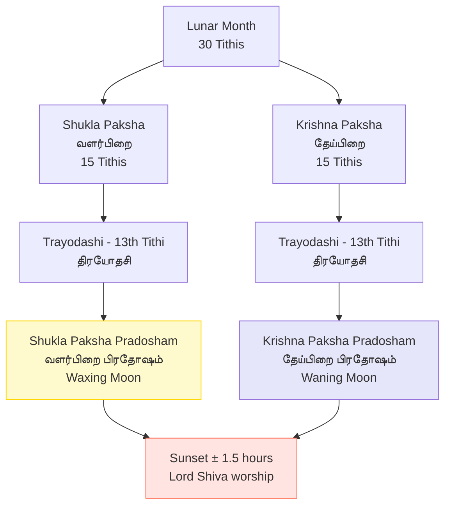

### <Highlight color='#004080' highlight='fg' fontWeight='bold'> Special Pradoshams </Highlight>

Certain Pradoshams have additional significance based on the weekday:

| Day | Name | Tamil | Special Significance |
|-----|------|-------|---------------------|
| **Saturday** | शनि प्रदोष (Shani Pradosh) | சனி பிரதோஷம் | Most powerful; removes Saturn's malefic effects |
| **Monday** | सोम प्रदोष (Soma Pradosh) | சோம பிரதோஷம் | Sacred to Shiva; grants wishes |
| **Tuesday** | मंगल प्रदोष (Mangala Pradosh) | செவ்வாய் பிரதோஷம் | Removes Mars afflictions |
| **Friday** | शुक्र प्रदोष (Shukra Pradosh) | வெள்ளி பிரதோஷம் | Grants prosperity and marital bliss |

**Maha Pradosham:** When Pradosham coincides with Saturday, it's called **Maha Pradosham (மஹா பிரதோஷம்)** and is considered exceptionally auspicious.

## <Highlight color='#800031' highlight='fg' fontWeight='bold'> Maha Shivaratri: The Great Night of Shiva </Highlight>

### <Highlight color='#004080' highlight='fg' fontWeight='bold'> When is Shivaratri? </Highlight>

**Maha Shivaratri (மஹா சிவராத்திரி)** is the most sacred night dedicated to Lord Shiva.

**Date Formula:**
- **Paksha:** Krishna Paksha (தேய்பிறை - waning moon)
- **Tithi:** Chaturdashi (சதுர்த்தசி - 14th lunar day)
- **Month:** Magha or Phalguna (மாசி - Masi in Tamil)
- **Timing:** The 14th night of the dark fortnight

**Why this specific time?**

On this night, the Moon is a thin crescent (nearly new moon), symbolizing:
- Maximum darkness before renewal
- Union of Shiva and Shakti
- Convergence of spiritual energy
- The night when Shiva performed the Tandava (cosmic dance)

### <Highlight color='#004080' highlight='fg' fontWeight='bold'> Understanding the Month </Highlight>

#### **Hindu Calendar Months:**

The month varies slightly based on regional calendars:

**North Indian Calendar (Purnimanta System):**
- Phalguna Krishna Chaturdashi (फाल्गुन कृष्ण चतुर्दशी)
- Usually falls in February-March

**South Indian Calendar (Amavasyanta System):**
- Magha Krishna Chaturdashi (माघ कृष्ण चतुर्दशी)
- Same astronomical date, different naming convention

**Tamil Month:**
- **Masi (மாசி)** month
- Corresponds to mid-February to mid-March

:::note[Calendar Systems]
Both systems refer to the **same astronomical event** but use different naming conventions for months. The actual date of Shivaratri is identical across India.
:::

### <Highlight color='#004080' highlight='fg' fontWeight='bold'> Shivaratri Observance </Highlight>

**Key Practices:**
1. **Fasting:** Complete fast or fruits/milk only
2. **Night Vigil:** Staying awake the entire night
3. **Four Prahara Puja:** Worship at four intervals during the night
4. **Bilva Leaves:** Offering to Shiva Linga
5. **Om Namah Shivaya:** Continuous chanting

**What is Prahara (प्रहर)?**

**Prahara** is an ancient Vedic unit of time dividing the day and night into 8 equal parts (4 for day, 4 for night).
- **Duration:** Each prahara = 3 hours
- **Night Division:** The night (sunset to sunrise, ~12 hours) is divided into 4 praharas of 3 hours each
- **Shivaratri Special:** Worship is performed during each of the 4 night praharas

**Timeline:**
```
Sunset → 1st Prahara → 2nd Prahara → 3rd Prahara → 4th Prahara → Sunrise
(6 PM)   (6-9 PM)      (9 PM-12 AM)  (12-3 AM)     (3-6 AM)     (6 AM)
```

**Each Prahara Offering:**
- 1st Prahara: Milk
- 2nd Prahara: Curd/Yogurt
- 3rd Prahara: Ghee
- 4th Prahara: Honey

### <Highlight color='#004080' highlight='fg' fontWeight='bold'> Monthly Shivaratri vs Maha Shivaratri </Highlight>

| Aspect | Monthly Shivaratri | Maha Shivaratri |
|--------|-------------------|-----------------|
| **Frequency** | Every month | Once a year |
| **Tithi** | Krishna Chaturdashi | Krishna Chaturdashi |
| **Month** | Every month | Magha/Phalguna (Masi) only |
| **Tamil** | மாத சிவராத்திரி | மஹா சிவராத்திரி |
| **Observance** | Optional fasting | Grand celebration |
| **Significance** | Regular worship | Most sacred Shiva festival |

## <Highlight color='#800031' highlight='fg' fontWeight='bold'> Tamil Months vs Hindu Months: The Correlation </Highlight>

### <Highlight color='#004080' highlight='fg' fontWeight='bold'> Two Calendar Systems </Highlight>

The Hindu calendar has regional variations. Here's how Tamil months align with North Indian Hindu months:

<div class="table-luxury table-default-grid">

  | Tamil Month | Tamil Name | North Indian Month (Purnimanta) | North Indian Month (Amavasyanta) | Gregorian Months |
  |-------------|------------|--------------------------------|----------------------------------|------------------|
  | 1 | சித்திரை (Chithirai) | चैत्र (Chaitra) | चैत्र (Chaitra) | Apr-May |
  | 2 | வைகாசி (Vaikasi) | वैशाख (Vaishakha) | वैशाख (Vaishakha) | May-Jun |
  | 3 | ஆனி (Aani) | ज्येष्ठ (Jyeshtha) | ज्येष्ठ (Jyeshtha) | Jun-Jul |
  | 4 | ஆடி (Aadi) | आषाढ (Ashadha) | आषाढ (Ashadha) | Jul-Aug |
  | 5 | ஆவணி (Aavani) | श्रावण (Shravana) | श्रावण (Shravana) | Aug-Sep |
  | 6 | புரட்டாசி (Purattasi) | भाद्रपद (Bhadrapada) | भाद्रपद (Bhadrapada) | Sep-Oct |
  | 7 | ஐப்பசி (Aippasi) | आश्विन (Ashwin) | आश्विन (Ashwin) | Oct-Nov |
  | 8 | கார்த்திகை (Karthigai) | कार्तिक (Kartik) | कार्तिक (Kartik) | Nov-Dec |
  | 9 | மார்கழி (Margazhi) | मार्गशीर्ष (Margashirsha) | मार्गशीर्ष (Margashirsha) | Dec-Jan |
  | 10 | தை (Thai) | पौष (Pausha) | पौष (Pausha) | Jan-Feb |
  | 11 | மாசி (Masi) | माघ (Magha) | फाल्गुन (Phalguna) | Feb-Mar |
  | 12 | பங்குனி (Panguni) | फाल्गुन (Phalguna) | चैत्र (Chaitra) | Mar-Apr |

</div>

:::note[Purnimanta vs Amavasyanta]
- **Purnimanta:** Month starts the day after Full Moon (used in North India)
- **Amavasyanta:** Month starts the day after New Moon (used in South India, including Tamil Nadu)

This creates a ~15 day shift in month naming, though the actual festivals occur on the same astronomical dates.
:::

### <Highlight color='#004080' highlight='fg' fontWeight='bold'> Tamil Month Duration and Zodiac Signs </Highlight>

**Month Length:**
- Tamil lunar months typically have **29, 30, or 31 days**
- **Special case:** Aavani (ஆவணி) sometimes has **32 days**
- Duration varies based on lunar cycle and solar transit alignment

**Tamil Months and Their Zodiac Signs (Pournami Correspondence):**

Each Tamil month is associated with a specific zodiac sign (Rashi). The **Pournami (Full Moon)** of that month occurs when the Moon is in that particular zodiac sign.

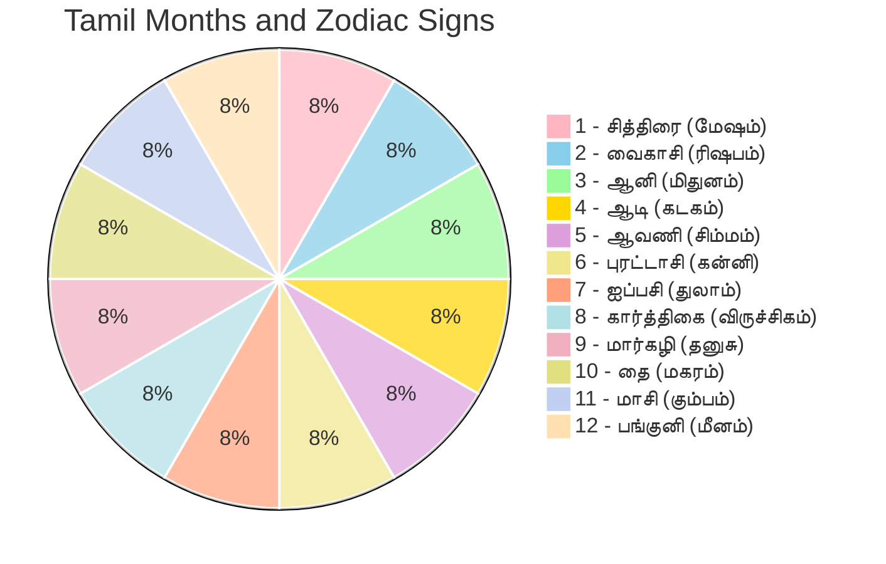

| Tamil Month | Tamil Name | Zodiac Sign (Rashi) | Rashi Tamil Name | Pournami Star | Malayalam Month |
|-------------|------------|---------------------|------------------|---------------|----------------|
| 1 | சித்திரை (Chithirai) | ♈ Aries | மேஷம் (Mesham) | Chitra (சித்திரை) | Medam (മേടം) |
| 2 | வைகாசி (Vaikasi) | ♉ Taurus | ரிஷபம் (Rishabam) | Vishakha (விசாகம்) | Edavam (ഇടവം) |
| 3 | ஆனி (Aani) | ♊ Gemini | மிதுனம் (Mithunam) | Jyeshtha (கேட்டை) | Mithunam (മിഥുനം) |
| 4 | ஆடி (Aadi) | ♋ Cancer | கடகம் (Kadagam) | Pushya (பூசம்) | Karkidakam (കർക്കിടകം) |
| 5 | ஆவணி (Aavani) | ♌ Leo | சிம்மம் (Simmam) | Magha/Purva Phalguni | **Chingam (ചിങ്ഗം)** ⭐ |
| 6 | புரட்டாசி (Purattasi) | ♍ Virgo | கன்னி (Kanni) | Uttara Phalguni (உத்திரம்) | Kanni (കന്നി) |
| 7 | ஐப்பசி (Aippasi) | ♎ Libra | துலாம் (Thulam) | Chitra/Swati | Thulam (തുലാം) |
| 8 | கார்த்திகை (Karthigai) | ♏ Scorpio | விருச்சிகம் (Viruchikam) | Krittika (கார்த்திகை) | Vrischikam (വൃശ്ചികം) |
| 9 | மார்கழி (Margazhi) | ♐ Sagittarius | தனுசு (Dhanusu) | Mula/Purva Ashadha | Dhanu (ധനു) |
| 10 | தை (Thai) | ♑ Capricorn | மகரம் (Magaram) | Uttara Ashadha (உத்திராடம்) | Makaram (മകരം) |
| 11 | மாசி (Masi) | ♒ Aquarius | கும்பம் (Kumbam) | Shravana/Dhanishtha | Kumbham (കുംഭം) |
| 12 | பங்குனி (Panguni) | ♓ Pisces | மீனம் (Meenam) | Meenam (മീനം) |

:::note[Malayalam New Year]
**Chingam 1 (ചിങ്ഗം ഒന്ന്)** marks the beginning of the Malayalam calendar year. This corresponds to Tamil Aavani 1 (ஆவணி 1) and typically falls in mid-August. The Malayalam year follows the same solar (Saura Mana) system as the Tamil calendar.
:::

**Understanding the Connection:**

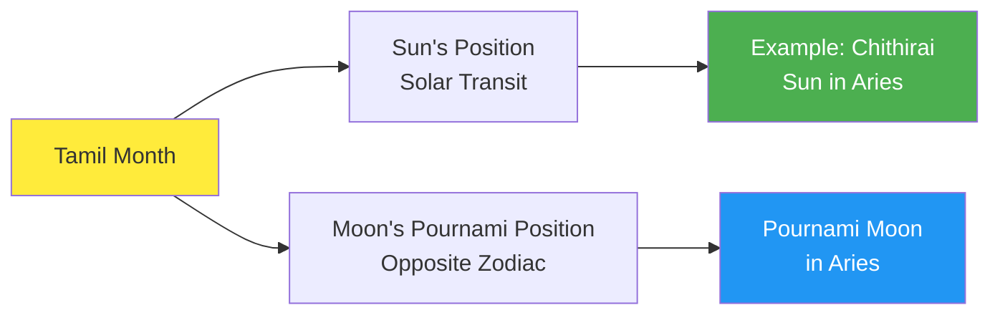

**Special Note on Aavani (ஆவணி):**
- Aavani is the only Tamil month that can have **32 days**
- This occurs due to specific astronomical alignments
- Happens when there are two Pournami (Full Moons) or specific tithi patterns within the month
- Not every year—depends on lunar-solar synchronization

**Why Month Lengths Vary:**
- A lunar month (one complete Moon cycle) = ~29.5 days
- Solar transit through a zodiac sign = ~30-31 days
- Tamil calendar balances both lunar and solar cycles
- This creates the variation: 29, 30, 31, or occasionally 32 days

## <Highlight color='#800031' highlight='fg' fontWeight='bold'> Major Festival Calculations: How and When </Highlight>

### <Highlight color='#004080' highlight='fg' fontWeight='bold'> 1. Diwali (தீபாவளி - Deepavali) </Highlight>

**Diwali** is the festival of lights celebrating Lord Rama's return to Ayodhya.

**Date Formula:**
- **Paksha:** Krishna Paksha (தேய்பிறை)
- **Tithi:** Amavasya (அமாவாசை - New Moon)
- **Month:** Kartik (கார்த்திகை - Karthigai in Tamil)
- **Timing:** The darkest night of Kartik month

**Tamil Name:** தீபாவளி (Deepavali) or தீபத் திருநாள் (Deepa Thirunaal)

**Why Amavasya?**
- Symbolizes victory of light over darkness
- New Moon = darkest night, lamps dispel darkness
- New beginning (start of financial year in some regions)

**Regional Significance:**
- **North India:** Celebrates Lord Rama's return to Ayodhya after 14 years of exile
- **South India (Tamil Nadu, Karnataka, Andhra Pradesh):** Celebrates **Lord Krishna's defeat of the demon Narakasura**
  - Also called **Naraka Chaturdashi** (நரக சதுர்த்தசி)
  - Celebrated one day before Amavasya in the South

**Timing Relation to Navaratri:**
- Diwali falls approximately **20 days after Navaratri ends**
- **Count:** Navaratri ends on Navami (Ashwin Shukla 9th day), then ~20 days later = Kartik Krishna Amavasya (Diwali)
- **Calculation:** Ashwin Shukla 9 (Navaratri end) → Ashwin Purnima (6 days) → Ashwin Krishna Paksha (15 days) → Kartik Krishna Amavasya = approximately 21 days
- Note: Vijayadashami/Dussehra (the day after Navaratri) is also about 20 days before Diwali

**Diwali Panchang (5-Day Celebration):**

| Day | Tithi | Festival | Tamil Name |
|-----|-------|----------|------------|
| **Day 1** | Krishna Trayodashi | Dhanteras | தன்தேரஸ் |
| **Day 2** | Krishna Chaturdashi | Naraka Chaturdashi | நரக சதுர்த்தசி |
| **Day 3** | Amavasya | **Diwali (Lakshmi Puja)** | **தீபாவளி** |
| **Day 4** | Shukla Pratipada | Govardhan Puja | கோவர்த்தன பூஜை |
| **Day 5** | Shukla Dwitiya | Bhai Dooj | பாய் தூஜ் |

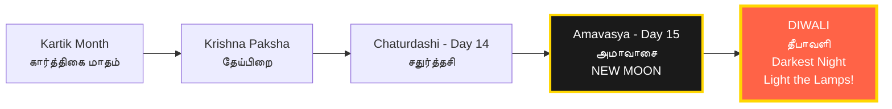

### <Highlight color='#004080' highlight='fg' fontWeight='bold'> 2. Navaratri (நவராத்திரி - Nine Nights) </Highlight>

**Navaratri** celebrates the divine feminine (Shakti/Durga) over nine nights and ten days.

**There are FOUR Navaratris in a year**, but two are widely celebrated:

#### **Sharad Navaratri (शरद नवरात्रि) - Most Famous**

**Date Formula:**
- **Paksha:** Shukla Paksha (வளர்பிறை)
- **Tithis:** Pratipada to Navami (1st to 9th)
- **Month:** Ashwin (ஐப்பசி - Aippasi in Tamil)
- **Season:** Autumn (September-October)

**Tamil Name:** நவராத்திரி (Navaratri) or தசரா (Dasara)

**Culmination:** 10th day - **Vijayadashami (விஜயதசமி)** on Dashami (10th tithi)

#### **Vasanta Navaratri (वसंत नवरात्रि) - Spring Navaratri**

**Date Formula:**
- **Paksha:** Shukla Paksha
- **Tithis:** Pratipada to Navami
- **Month:** Chaitra (சித்திரை - Chithirai in Tamil)
- **Season:** Spring (March-April)

**Culmination:** **Rama Navami (ராம நவமி)** on the 9th day

#### **The Nine Days of Navaratri:**

| Day | Tithi | Goddess Form | Tamil Name | Color |
|-----|-------|--------------|------------|-------|
| **1** | Pratipada (பிரதமை) | Shailaputri | சைலபுத்திரி | Yellow |
| **2** | Dwitiya (துவிதியை) | Brahmacharini | பிரம்மசாரிணி | Green |
| **3** | Tritiya (திருதியை) | Chandraghanta | சந்திரகண்டா | Grey |
| **4** | Chaturthi (சதுர்த்தி) | Kushmanda | கூஷ்மாண்டா | Orange |
| **5** | Panchami (பஞ்சமி) | Skandamata | ஸ்கந்தமாதா | White |
| **6** | Shashthi (சஷ்டி) | Katyayani | காத்யாயனி | Red |
| **7** | Saptami (சப்தமி) | Kalaratri | காளராத்திரி | Royal Blue |
| **8** | Ashtami (அஷ்டமி) | Mahagauri | மஹாகௌரி | Pink |
| **9** | Navami (நவமி) | Siddhidatri | சித்திதாத்திரி | Purple |
| **10** | Dashami (தசமி) | **Vijayadashami** | **விஜயதசமி** | All Colors |

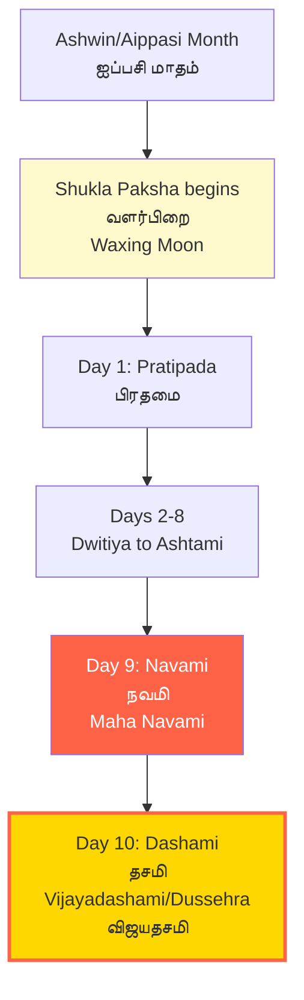

### <Highlight color='#004080' highlight='fg' fontWeight='bold'> 3. Pongal (பொங்கல்) - Solar Festival </Highlight>

**Pongal** is unique—it's a **solar festival**, not based on tithi!

**Date Formula:**
- **Based on:** Solar calendar (Surya Siddhanta)
- **Event:** Sun's transition into Capricorn (Uttarayana)
- **Tamil Month:** Thai (தை)
- **Fixed Date:** January 14-15 every year (Gregorian)
- **Tamil:** தைப்பொங்கல் (Thai Pongal)

**Why Solar?**

Pongal celebrates the **harvest** and the **Sun's northward journey** (Uttarayana), which is based on solar movement, not lunar phases.

**Four Days of Pongal:**

| Day | Name | Tamil | Significance |
|-----|------|-------|--------------|
| **Day 1** | Bhogi Pongal | போகி பொங்கல் | Discarding old items; Lord Indra |
| **Day 2** | **Surya Pongal (Thai Pongal)** | **தைப்பொங்கல்** | Main day; Sun God worship |
| **Day 3** | Mattu Pongal | மாட்டுப் பொங்கல் | Cattle worship |
| **Day 4** | Kaanum Pongal | காணும் பொங்கல் | Family get-togethers |

:::note[Solar vs Lunar]
Unlike other Hindu festivals that follow the lunar calendar (tithi-based), **Pongal follows the solar calendar**. This is why it falls on the same Gregorian date (Jan 14-15) every year, similar to solar festivals like Makar Sankranti, Vishu, and Baisakhi.
:::

### <Highlight color='#004080' highlight='fg' fontWeight='bold'> 4. Karthigai Deepam (கார்த்திகை தீபம்) </Highlight>

**Karthigai Deepam** is the ancient Tamil festival of lights, older than Diwali in Tamil tradition.

**Date Formula:**
- **Nakshatra:** Krittika (கார்த்திகை நட்சத்திரம்)
- **Tithi:** Purnima (பௌர்ணமி - Full Moon) preferred
- **Month:** Karthigai (கார்த்திகை - Nov-Dec)
- **Calculation:** When Krittika nakshatra coincides with Full Moon in Karthigai month

**Tamil Name:** கார்த்திகை தீபம் (Karthigai Deepam) or கார்த்திகை விளக்கு (Karthigai Vilakku)

**Why Krittika Nakshatra?**

Unlike most festivals that use **tithi**, Karthigai Deepam uniquely uses **nakshatra** (star constellation):
- **Krittika** is the nakshatra (star cluster known as Pleiades)
- Lord Murugan was raised by the six Krittika maidens
- When Krittika aligns with Full Moon in Karthigai month = festival day

**Special Feature:**

On this day, a **huge beacon (Mahadeepam)** is lit atop **Tiruvannamalai hill** in Tamil Nadu, visible for miles. This represents Lord Shiva as a column of fire (Annamalai).

**Observance:**
- Lighting rows of oil lamps at home
- Lighting lamps in temples
- Special prayers to Lord Murugan and Shiva

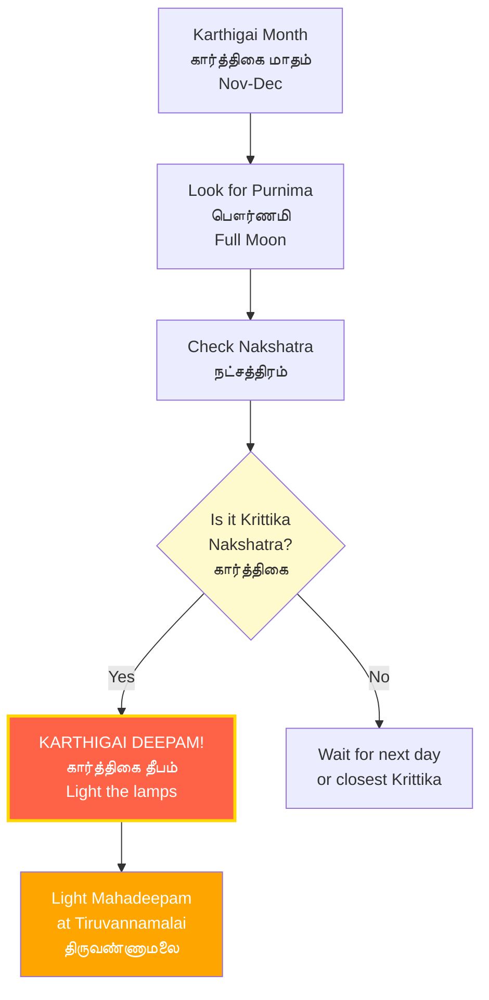

## <Highlight color='#800031' highlight='fg' fontWeight='bold'> Other Important Tithi-Based Observances </Highlight>

### <Highlight color='#004080' highlight='fg' fontWeight='bold'> Major Festivals by Tithi </Highlight>

| Festival | Tamil Name | Tithi | Paksha | Month | Significance |
|----------|------------|-------|--------|-------|--------------|
| **Ugadi/Gudi Padwa** | உகாதி | Pratipada | Shukla | Chaitra (சித்திரை) | Hindu New Year |
| **Rama Navami** | ராம நவமி | Navami | Shukla | Chaitra (சித்திரை) | Lord Rama's birth |
| **Hanuman Jayanti** | அனுமன் ஜெயந்தி | Purnima (North) / Amavasya (South) | - | Chaitra (North) / Margashirsha (South) | Hanuman's birth - See regional variations below |
| **Akshaya Tritiya** | அக்ஷய திருதியை | Tritiya | Shukla | Vaishakha (வைகாசி) | Most auspicious for new beginnings |
| **Vat Purnima** | வட பௌர்ணமி | Purnima | - | Jyeshtha (ஆனி) | Women's fast for husband's longevity |
| **Guru Purnima** | குரு பௌர்ணமி | Purnima | - | Ashadha (ஆடி) | Honoring spiritual teachers |
| **Aadi Pooram** | ஆடி பூரம் | Pooram (Purva Phalguni) Nakshatra | - | Aadi (ஆடி) | Goddess Andal's birth, sacred to Amman temples |
| **Raksha Bandhan** | ராக்கி | Purnima | - | Shravana (ஆவணி) | Brother-sister bond |
| **Krishna Jayanti (Janmashtami)** | கிருஷ்ண ஜெயந்தி / ஜன்மாஷ்டமி | Ashtami | Krishna | Shravana/Bhadrapada (ஆவணி/புரட்டாசி) | Lord Krishna's birth - See calculation details below |
| **Ganesh Chaturthi** | விநாயக சதுர்த்தி | Chaturthi | Shukla | Bhadrapada (புரட்டாசி) | Lord Ganesha's birth |
| **Skanda Shashthi** | ஸ்கந்த சஷ்டி | Shashthi | Shukla | Kartik (கார்த்திகை) | Lord Murugan's victory |
| **Arudra Darshan** | ஆருத்ரா தரிசனம் | Ardra Nakshatra (திருவாதிரை) + Purnima | - | Margazhi (மார்கழி) | Lord Shiva's cosmic dance, Margazhi month Ardra star |
| **Vaikunta Ekadashi** | வைகுண்ட ஏகாதசி | Ekadashi | Shukla | Margashirsha (மார்கழி) | Heaven's gates open |
| **Makaravilakku / Makar Jyothi** | மகர ஜோதி | Solar (Makaram 1) | - | Margazhi 30 / Thai 1 (மார்கழி 30 / தை 1) | Sacred light at Sabarimala, Malayalam Makaram 1 (Jan 14-15) |
| **Makar Sankranti** | மகர சங்கராந்தி | Solar | - | Pausha (தை) | Sun enters Capricorn |
| **Ayya Vaikunda Avataram** | அய்யா வைகுண்ட அவதாரம் | Masi 20 (மாசி 20) | - | Masi (மாசி) | Vaikundar’s sea incarnation festival |
| **Mandaikadu Festival** | மண்டைக்காடு திருவிழா | Last Tuesday of Masi | - | Masi (மாசி) | Masi Kodai festival, 10th day on final Tuesday of Masi month |
| **Holi** | ஹோலி | Purnima | - | Phalguna (பங்குனி) | Festival of colors, burning of Holika |
| **Vishu** | விஷு | Solar | - | Medam (சித்திரை) | Kerala/Tamil New Year, Sun enters Aries (April 14-15) |
| **Onam** | ஓணம் | Thiruvonam Nakshatra | - | Chingam (ஆவணி) | Kerala harvest festival, King Mahabali's return |
| **Mahalaya Amavasya** | மஹாளய அமாவாசை | Amavasya | - | Ashwin (புரட்டாசி) | End of Pitru Paksha, ancestor worship |
| **Aadi Perukku** | ஆடிப் பெருக்கு | 18th day | - | Aadi (ஆடி) | Tamil water festival (Aadi 18th = July-August) |

### <Highlight color='#004080' highlight='fg' fontWeight='bold'> Hanuman Jayanti: Regional Variations </Highlight>

**Hanuman Jayanti (அனுமன் ஜெயந்தி)** celebrates the birth of Lord Hanuman, but the date varies significantly by region:

#### **North India (Most Common)**
- **Date:** Chaitra Purnima (சித்திரை பௌர்ணமி)
- **Calculation:** Full Moon day in Chaitra month (March-April)
- **States:** Most of North India, Maharashtra, Gujarat

#### **South India - Tamil Nadu, Kerala, Karnataka**
- **Date:** Margashirsha Amavasya (மார்கழி அமாவாசை)
- **Calculation:** New Moon day in Margashirsha/Margazhi month (December-January)
- **Tradition:** Celebrated during the Tamil month of Margazhi

#### **Andhra Pradesh & Telangana - 41-Day Festival**
- **Start Date:** Chaitra Purnima (சித்திரை பௌர்ணமி)
- **Duration:** 41 continuous days of celebration
- **Culmination:** Ends on the 10th day of Krishna Paksha in Vaishakha
- **Unique Feature:** The longest Hanuman Jayanti celebration in India

:::note[Why Different Dates?]
The regional variations reflect different traditions and local beliefs about Hanuman's birth. While astronomy and scripture provide guidance, regional customs have evolved independently over centuries.
:::

### <Highlight color='#004080' highlight='fg' fontWeight='bold'> Krishna Jayanti (Janmashtami): Tithi vs Nakshatra </Highlight>

**Krishna Jayanti (கிருஷ்ண ஜெயந்தி)**, also known as **Janmashtami (ஜன்மாஷ்டமி)** or **Gokulashtami (கோகுலாஷ்டமி)**, celebrates Lord Krishna's birth.

**Standard Date Formula:**
- **Tithi:** Ashtami (அஷ்டமி - 8th lunar day)
- **Paksha:** Krishna Paksha (தேய்பிறை - dark fortnight)
- **Month:** Shravana or Bhadrapada (ஆவணி or புரட்டாசி in Tamil)
- **Special:** Corresponds to Tamil months Aadi or Aavani (August-September)

**The Tithi vs Nakshatra Debate:**

Different traditions prioritize different astronomical factors:

#### **Ashtami Tithi Priority (Most Common)**
- **Focus:** 8th day (Ashtami) of Krishna Paksha in Shravana/Bhadrapada
- **Timing:** Celebrated at midnight when Ashtami tithi is present
- **Followed by:** Most of North India, ISKCON temples worldwide
- **Logic:** Krishna was born on Ashtami, so this tithi is most important

#### **Rohini Nakshatra Priority (Traditional)**
- **Focus:** When Rohini Nakshatra (ரோகிணி நட்சத்திரம்) coincides with Ashtami
- **Timing:** Some years, Rohini nakshatra may overlap with Ashtami differently
- **Followed by:** Traditional South Indian calculations, some regional temples
- **Logic:** Krishna was born under Rohini star, so nakshatra alignment is crucial

**What is Rohini Nakshatra?**
- **Rohini (रोहिणी)** is the 4th of 27 nakshatras (lunar constellations)
- Known as the "red one" or "growing one"
- Considered highly auspicious for birth
- Associated with beauty, fertility, and prosperity

**When Both Don't Align:**

In rare years, Ashtami tithi and Rohini nakshatra may not perfectly overlap:
- **Scenario 1:** Ashtami exists but Rohini is on a different day → Some follow Ashtami, some follow Rohini
- **Scenario 2:** Rohini spans two days → Choose the day when both Ashtami and Rohini overlap maximally
- **Panchang Decision:** Local almanacs specify which date to follow based on regional tradition

:::tip[Which to Follow?]
Check your local temple or panchang. Most modern celebrations follow **Ashtami tithi at midnight**, but traditional families may consider **Rohini nakshatra** alignment. Both are valid according to different scriptural interpretations.
:::

### <Highlight color='#004080' highlight='fg' fontWeight='bold'> Solar Festival Details </Highlight>

#### **Vishu (விஷு) - Kerala & Tamil New Year**
- **Type:** Solar festival
- **Date:** April 14-15 (fixed Gregorian date)
- **Calculation:** Sun's transition into Mesha Rashi (Aries)
- **Significance:** Astronomical New Year for Kerala, agricultural importance
- **Tamil Connection:** Corresponds to Tamil month Chithirai beginning

#### **Holi (ஹோலி) - Festival of Colors**
- **Type:** Lunar festival
- **Date:** Phalguna Purnima (பங்குனி பௌர்ணமி)
- **Calculation:** Full Moon of Phalguna/Panguni month (February-March)
- **Celebration:** Bonfire on Purnima night (Holika Dahan), colors next day
- **Timing:** Day after Purnima is main Holi celebration day

#### **Onam (ஓணம்) - Kerala Harvest Festival**
- **Type:** Nakshatra-based festival
- **Date:** Thiruvonam (திருவோணம்) nakshatra in Chingam month
- **Calculation:** When Shravana nakshatra (called Thiruvonam in Malayalam/Tamil) falls in Malayalam month Chingam (ஆவணி - August-September)
- **Duration:** 10-day festival, main day is Thiruvonam day
- **Significance:** Celebrates return of King Mahabali

#### **Aadi Perukku (ஆடிப் பெருக்கு)**
- **Type:** Date-based (not tithi)
- **Date:** 18th day of Tamil month Aadi (ஆடி மாதம் 18)
- **Gregorian:** Typically falls in late July or early August
- **Significance:** Water/river festival, monsoon celebration
- **Calculation:** Simply count to 18th day of Aadi month (solar calendar)
- **Ritual:** Worship of water bodies, rivers, and rain

#### **Mahalaya Amavasya (மஹாளய அமாவாசை)**
- **Type:** Lunar - Amavasya
- **Date:** Ashwin/Purattasi Krishna Amavasya (புரட்டாசி அமாவாசை)
- **Significance:** Marks the end of Pitru Paksha (16 days for ancestor worship)
- **Timing:** Precedes Navaratri by one day
- **Ritual:** Tarpana (water offering) to ancestors, Shradh ceremonies
- **Importance:** Most significant Amavasya for honoring departed souls

### <Highlight color='#004080' highlight='fg' fontWeight='bold'> Amavasya (New Moon) Observances </Highlight>

**Monthly Amavasyas** are important for:
- **Pitru Tarpan (பித்ரு தர்ப்பணம்):** Ancestor worship
- **Mahalaya Amavasya:** Special Pitru Paksha ending (for Shradh rituals)
- **Soma Amavasya (Monday New Moon):** Especially sacred

### <Highlight color='#004080' highlight='fg' fontWeight='bold'> Purnima (Full Moon) Observances </Highlight>

**Every Purnima** is considered auspicious for:
- Satyanarayan Puja (சத்யநாராயண பூஜை)
- Fasting and meditation
- Temple visits

**Special Purnimas:**
- **Guru Purnima** (ஆடி பௌர்ணமி in Tamil Nadu)
- **Sharad Purnima** (Kojagari Purnima)
- **Kartik Purnima** (Dev Deepavali)

## <Highlight color='#800031' highlight='fg' fontWeight='bold'> How to Find Tithis: Using a Panchang </Highlight>

### <Highlight color='#004080' highlight='fg' fontWeight='bold'> What is a Panchang? </Highlight>

**Panchang (பஞ்சாங்கம் in Tamil)** literally means "five limbs" - a Hindu almanac that provides:

**The Five Elements (Panchangam):**
1. **Tithi (திதி):** Lunar day
2. **Vara (வாரம்):** Weekday
3. **Nakshatra (நட்சத்திரம்):** Constellation
4. **Yoga (யோகம்):** Astronomical combination
5. **Karana (கரணம்):** Half-tithi

### <Highlight color='#004080' highlight='fg' fontWeight='bold'> 1. Tithi (திதி) - Lunar Day </Highlight>

We've covered tithi extensively above. It's the angular relationship between Sun and Moon (12° increments).

### <Highlight color='#004080' highlight='fg' fontWeight='bold'> 2. Vara (வாரம்) - Weekday </Highlight>

**Vara (வாரம்)** refers to the day of the week, each ruled by a celestial body (planet).

**The Seven Days:**

<div class="table-luxury table-default-grid">

  | Day | Sanskrit | Tamil | Ruling Planet | Deity | Element |
  |-----|----------|-------|---------------|-------|---------|
  | **Sunday** | रविवार (Ravivara) | ஞாயிறு (Gnayiru) | सूर्य (Surya - Sun) | Surya | Fire |
  | **Monday** | सोमवार (Somavara) | திங்கள் (Thingal) | चन्द्र (Chandra - Moon) | Chandra/Shiva | Water |
  | **Tuesday** | मंगलवार (Mangalavara) | செவ்வாய் (Sevvai) | मंगल (Mangala - Mars) | Hanuman/Murugan | Fire |
  | **Wednesday** | बुधवार (Budhavara) | புதன் (Puthan) | बुध (Budha - Mercury) | Vishnu | Earth |
  | **Thursday** | गुरुवार (Guruvara) | வியாழன் (Viyazhan) | बृहस्पति (Brihaspati - Jupiter) | Brihaspati/Dakshinamurthy | Ether |
  | **Friday** | शुक्रवार (Shukravara) | வெள்ளி (Velli) | शुक्र (Shukra - Venus) | Lakshmi | Water |
  | **Saturday** | शनिवार (Shanivara) | சனி (Sani) | शनि (Shani - Saturn) | Shani/Hanuman | Air |

</div>

**Significance:**
- Certain rituals and festivals gain special significance based on the vara
- Example: Shani Pradosham (Saturday Pradosham) is most powerful
- Fasting days often align with specific varas (e.g., Monday fasts for Shiva)

### <Highlight color='#004080' highlight='fg' fontWeight='bold'> 3. Nakshatra (நட்சத்திரம்) - Lunar Constellation </Highlight>

**Nakshatra (நட்சத்திரம்)** are the 27 (or 28) lunar mansions or constellations through which the Moon travels during its monthly cycle.

**Key Concepts:**
- The zodiac (360°) is divided into 27 equal parts of 13°20' each
- Moon spends approximately one day in each nakshatra
- Each nakshatra has its own deity, characteristics, and auspiciousness

**The 27 Nakshatras:**

<div class="table-luxury table-default-grid">

  | # | Sanskrit Name | Tamil Name | Deity | Symbol |
  |---|---------------|------------|-------|--------|
  | 1 | अश्विनी (Ashwini) | அஸ்வினி | Ashwini Kumaras | Horse's head |
  | 2 | भरणी (Bharani) | பரணி | Yama | Yoni (vulva) |
  | 3 | कृत्तिका (Krittika) | கார்த்திகை | Agni | Razor/flame |
  | 4 | रोहिणी (Rohini) | ரோகிணி | Brahma/Prajapati | Chariot/cart |
  | 5 | मृगशीर्ष (Mrigashira) | மிருகசீரிடம் | Soma (Moon) | Deer's head |
  | 6 | आर्द्रा (Ardra) | திருவாதிரை | Rudra (Shiva) | Teardrop/diamond |
  | 7 | पुनर्वसु (Punarvasu) | புனர்பூசம் | Aditi | Bow/quiver |
  | 8 | पुष्य (Pushya) | பூசம் | Brihaspati | Cow's udder/lotus |
  | 9 | आश्लेषा (Ashlesha) | ஆயில்யம் | Nagas (serpents) | Coiled serpent |
  | 10 | मघा (Magha) | மகம் | Pitrs (ancestors) | Royal throne |
  | 11 | पूर्वा फाल्गुनी (Purva Phalguni) | பூரம் | Bhaga (prosperity) | Front legs of bed |
  | 12 | उत्तरा फाल्गुनी (Uttara Phalguni) | உத்திரம் | Aryaman | Back legs of bed |
  | 13 | हस्त (Hasta) | அஸ்தம் | Savitar (Sun) | Hand/fist |
  | 14 | चित्रा (Chitra) | சித்திரை | Tvashtar (architect) | Bright jewel/pearl |
  | 15 | स्वाति (Swati) | சுவாதி | Vayu (Wind) | Coral/shoot |
  | 16 | विशाखा (Vishakha) | விசாகம் | Indra-Agni | Archway/triumphal gate |
  | 17 | अनुराधा (Anuradha) | அனுஷம் | Mitra | Lotus/archway |
  | 18 | ज्येष्ठा (Jyeshtha) | கேட்டை | Indra | Earring/umbrella |
  | 19 | मूल (Mula) | மூலம் | Nirriti/Kali | Bunch of roots |
  | 20 | पूर्वाषाढ़ा (Purva Ashadha) | பூராடம் | Apas (Waters) | Elephant's tusk |
  | 21 | उत्तराषाढ़ा (Uttara Ashadha) | உத்திராடம் | Vishvadevas | Elephant's tusk |
  | 22 | श्रवण (Shravana) | திருவோணம் | Vishnu | Three footprints/ear |
  | 23 | धनिष्ठा (Dhanishtha) | அவிட்டம் | Vasus | Drum/flute |
  | 24 | शतभिषा (Shatabhisha) | சதயம் | Varuna | Empty circle/100 healers |
  | 25 | पूर्वा भाद्रपद (Purva Bhadrapada) | பூரட்டாதி | Aja Ekapada | Swords/two front legs of bed |
  | 26 | उत्तरा भाद्रपद (Uttara Bhadrapada) | உத்திரட்டாதி | Ahir Budhnya | Back legs of bed/serpent |
  | 27 | रेवती (Revati) | ரேவதி | Pushan | Fish/drum |

</div>

**Special Nakshatras:**
- **Rohini (ரோகிணி):** Most auspicious, associated with Krishna's birth
- **Krittika (கார்த்திகை):** Sacred to Murugan, Karthigai Deepam festival
- **Ardra/Thiruvathira (திருவாதிரை):** Sacred to Shiva, major Kerala festival
- **Shravana/Thiruvonam (திருவோணம்):** Onam festival day
- **Pushya (பூசம்):** Extremely auspicious for all activities
- **Ashlesha (ஆயில்யம்):** Associated with serpents, Naga worship

**Usage:**
- Birth star (Janma Nakshatra) is crucial for astrology
- Festival timing (Karthigai Deepam on Krittika, Onam on Thiruvonam)
- Muhurta selection for auspicious activities
- Marriage compatibility (matching birth stars)

### <Highlight color='#004080' highlight='fg' fontWeight='bold'> Agni Nakshatra (அக்கினி நட்சத்திரம்) - The Fire Star Period </Highlight>

**Agni Nakshatra (அக்கினி நட்சத்திரம்)**, also known as **Kathiri Veyil (கதிரி வெயில்)** in Tamil, is a specific hot period based on the Sun's transit through certain nakshatras.

**Definition:**
> Agni Nakshatra refers to the approximately **25-day period** when the Sun travels from the **3rd pada (quarter) of Bharani nakshatra** through the **entire Krittika nakshatra**.

**Calculation Method:**

**Solar Transit Basis:**
- Unlike lunar nakshatras (Moon's daily position), Agni Nakshatra is based on the **Sun's position**
- Each nakshatra = 13°20' of the zodiac
- Each nakshatra has 4 padas (quarters) of 3°20' each

**Start Point:**
- **Bharani 3rd Pada** (பரணி 3வது பாதம்)
  - Bharani spans: 13°20' to 26°40' of Aries (மேஷ ராசி)
  - 3rd pada starts at: 20°00' of Aries
  - When Sun reaches 20° Aries, Agni Nakshatra begins

**Transit Path:**
- Sun continues through Bharani 4th pada (பரணி 4வது பாதம்)
- Then enters Krittika nakshatra (கார்த்திகை நட்சத்திரம்)
- Traverses all 4 padas of Krittika
- Total coverage: ~25 days

**End Point:**
- Ends when Sun completes Krittika nakshatra (கார்த்திகை முழுவதும்)
- Krittika ends at: 10°00' of Taurus (ரிஷப ராசி)

**Visual Representation:**

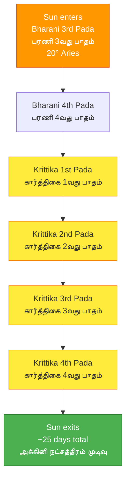

**Typical Dates (Gregorian Calendar):**
- Usually occurs in **May-June** (வைகாசி-ஆனி மாதங்கள்)
- Approximately **May 4-5 to May 28-29** each year
- Can vary by 1-2 days depending on precise solar transit
- Coincides with peak summer heat in Tamil Nadu

**Why Called "Agni" (Fire)?**

1. **Association with Krittika:**
   - Krittika nakshatra's ruling deity is **Agni (அக்னி)** - the Fire God
   - Symbol: Razor, flame (சுடர்)
   - Represents intense heat and fire energy

2. **Peak Summer Period:**
   - This period experiences the **hottest temperatures** of the year in South India
   - Sun is at high declination, creating intense heat
   - Called "கதிரி வெயில்" (Kathiri Veyil) = "Scorching Sun of Krittika"

3. **Bharani's Influence:**
   - Bharani (பரணி) is ruled by Yama (death deity)
   - Represents transformation through heat and intensity
   - Combined with Agni's fire = extreme heat period

**Characteristics of Agni Nakshatra Period:**

**Physical Effects:**
- 🔥 **Extreme heat and high temperatures** (40-45°C common)
- ☀️ Intense solar radiation
- 💧 Low humidity in most regions
- 🌡️ Peak summer conditions

**Agricultural Significance:**
- Important for **harvest drying** of summer crops
- Water scarcity concerns
- Traditional irrigation practices intensified
- Mango harvest period (மாம்பழ காலம்)

**Health Precautions:**
- ⚠️ Heat stroke risk increases
- 💦 Stay well hydrated
- 🏠 Avoid midday sun exposure
- 🥤 Consume cooling foods (நீர்மோர், நுங்கு - buttermilk, palm fruit)

**Traditional Practices:**

**What to Avoid:**
- ❌ Avoid starting major construction work (excessive heat affects materials)
- ❌ Minimize travel during peak noon hours (நண்பகல் பயணம் தவிர்க்கவும்)
- ❌ Avoid strenuous outdoor activities
- ❌ Not ideal for weddings due to heat (though not strictly prohibited)

**What to Do:**
- ✅ **Cooling rituals:** Temples offer cold water, buttermilk (நீர் மோர் தானம்)
- ✅ **Dietary changes:** Consume cooling foods like நுங்கு (palm fruit), நீர்மோர் (buttermilk), watermelon
- ✅ Plant care and irrigation (தண்ணீர் பாய்ச்சுதல்)
- ✅ **Agni puja:** Some perform special prayers to Agni to reduce heat's intensity
- ✅ Traditional drink: பதனீர் (Padhaneer - palm nectar), நன்னாரி (Nannari sherbet)

**Cultural References:**

**Tamil Proverbs:**
- "கதிரியில் குளிர்ச்சி இல்லை" (Kathiriyil kulirchi illai) - "No coolness during Krittika period"
- "அக்கினி நட்சத்திரம் கடும் வெயில்" (Agni nakshatra kadum veyil) - "Agni nakshatra brings severe heat"

**Traditional Knowledge:**
- Farmers time their harvest to complete before/during this period
- Mango season peaks during Agni Nakshatra (மாம்பழம் பருவம்)
- Water conservation becomes critical
- Temples organize water distribution (தண்ணீர் பந்தல்)

**Modern Relevance:**

**Climate Considerations:**
- Important for weather forecasting in Tamil Nadu
- Agricultural planning and irrigation scheduling
- Heat wave preparedness
- Water resource management

**Health Advisories:**
- Government issues heat warnings during this period
- Schools may have altered timings
- Outdoor work restrictions during peak hours
- Public health campaigns for hydration

**Calculation Example:**

**For 2026:**
1. Sun enters Bharani 3rd pada: ~May 4-5, 2026
2. Agni Nakshatra period: ~May 4-5 to May 28-29, 2026
3. Duration: Approximately 25 days
4. Peak heat expected in Tamil Nadu, Kerala, Karnataka

**How to Determine Agni Nakshatra:**
- Check Tamil Panchangam for Sun's nakshatra position
- When it shows "சூரியன் - பரணி 3வது பாதம்" (Sun in Bharani 3rd pada), Agni Nakshatra begins
- Continues until "சூரியன் - கிருத்திகை முடிவு" (Sun exits Krittika)
- Modern apps and panchangam websites mark this period

:::tip[Summer Preparation]
**Agni Nakshatra is a natural marker for peak summer preparation.** Stock up on:
- 💧 Water and cooling drinks (நீர்மோர், நன்னாரி, பதனீர்)
- 🥥 Tender coconut (இளநீர்)
- 🍉 Cooling fruits (watermelon, muskmelon)
- 🌴 Palm fruit (நுங்கு)
- ⚕️ Basic heat-related medications
:::

**Distinction from Other Periods:**
- **Agni Nakshatra:** Solar transit-based, ~25 days, May-June
- **Karthigai Deepam:** Lunar festival, Krittika + Purnima, November-December
- **Summer Solstice:** Astronomical event, June 21-22
- **Aani month:** Solar month, mid-June to mid-July

**Religious Significance:**
- Some devotees perform special **Agni homa** (fire rituals) during this period
- Temples dedicated to Agni may have special pujas
- **Krittika nakshatra worship** intensifies
- Connection to Lord Murugan (கார்த்திகேயன்), who is associated with Krittika

### <Highlight color='#004080' highlight='fg' fontWeight='bold'> 4. Yoga (யோகம்) - Astronomical Combination </Highlight>

**Yoga (யோகம்)** is a specific angular relationship between the Sun and Moon, calculated differently from Tithi.

**Definition:**
- Sum of the longitudes of Sun and Moon, divided into 27 equal parts
- Each yoga = 13°20' of combined Sun-Moon movement
- 27 yogas complete one full cycle (360°)

**The 27 Yogas:**

<div class="table-luxury table-default-grid">

  | # | Sanskrit Name | Tamil Name | Nature | Auspiciousness |
  |---|---------------|------------|--------|----------------|
  | 1 | विष्कम्भ (Vishkambha) | விஷ்கம்பம் | Mixed | Moderate |
  | 2 | प्रीति (Priti) | பிரீதி | Auspicious | Good for friendships |
  | 3 | आयुष्मान् (Ayushman) | ஆயுஷ்மான் | Very Auspicious | Longevity, health |
  | 4 | सौभाग्य (Saubhagya) | சௌபாக்யம் | Very Auspicious | Fortune, prosperity |
  | 5 | शोभन (Shobhana) | ஶோபனம் | Very Auspicious | Splendor, beauty |
  | 6 | अतिगण्ड (Atiganda) | அதிகண்டம் | Inauspicious | Obstacles |
  | 7 | सुकर्मा (Sukarma) | ஸுகர்மா | Auspicious | Good deeds |
  | 8 | धृति (Dhriti) | த்ருதி | Auspicious | Steadfastness |
  | 9 | शूल (Shula) | ஶூலம் | Inauspicious | Pain, piercing |
  | 10 | गण्ड (Ganda) | கண்டம் | Inauspicious | Obstacles |
  | 11 | वृद्धि (Vriddhi) | வ்ருத்தி | Auspicious | Growth, increase |
  | 12 | ध्रुव (Dhruva) | த்ருவம் | Very Auspicious | Fixed, permanent |
  | 13 | व्याघात (Vyaghata) | வ்யாகாதம் | Very Inauspicious | Calamity |
  | 14 | हर्षण (Harshana) | ஹர்ஷணம் | Auspicious | Joy, happiness |
  | 15 | वज्र (Vajra) | வஜ்ரம் | Inauspicious | Hard, adamant |
  | 16 | सिद्धि (Siddhi) | ஸித்தி | Very Auspicious | Success, accomplishment |
  | 17 | व्यतीपात (Vyatipata) | வ்யதீபாதம் | Very Inauspicious | Great calamity |
  | 18 | वरीयान् (Variyan) | வரீயான் | Auspicious | Excellent |
  | 19 | परिघ (Parigha) | பரிகம் | Inauspicious | Obstruction |
  | 20 | शिव (Shiva) | ஶிவம் | Very Auspicious | Auspicious, benevolent |
  | 21 | सिद्ध (Siddha) | ஸித்தம் | Very Auspicious | Accomplished |
  | 22 | साध्य (Sadhya) | ஸாத்யம் | Auspicious | Achievable |
  | 23 | शुभ (Shubha) | ஶுபம் | Very Auspicious | Fortunate |
  | 24 | शुक्ल (Shukla) | ஶுக்லம் | Auspicious | Bright, pure |
  | 25 | ब्रह्म (Brahma) | ப்ரஹ்மம் | Very Auspicious | Divine |
  | 26 | ऐन्द्र (Aindra) | ஐந்த்ரம் | Very Auspicious | Related to Indra |
  | 27 | वैधृति (Vaidhriti) | வைத்ருதி | Very Inauspicious | Opposed, hostile |

</div>

**Usage:**
- Important for muhurta (auspicious timing) selection
- Avoided yogas: Vyaghata, Vyatipata, Vaidhriti (very inauspicious)
- Preferred yogas: Siddhi, Ayushman, Saubhagya, Dhruva, Brahma

### <Highlight color='#004080' highlight='fg' fontWeight='bold'> 5. Karana (கரணம்) - Half-Tithi </Highlight>

**Karana (கரணம்)** is half of a tithi. Since a tithi is 12° of Sun-Moon separation, a karana is 6°.

**Key Facts:**
- There are **11 types** of karanas
- **60 karanas** in a lunar month (30 tithis × 2 = 60 karanas)
- 7 karanas are "movable" (चर - Chara) and repeat 8 times each = 56 karanas
- 4 karanas are "fixed" (स्थिर - Sthira) and occur once each = 4 karanas
- Total: 56 + 4 = 60 karanas per month

**The 7 Movable (Chara) Karanas (repeat 8 times):**

<div class="table-luxury table-default-grid">

  | # | Sanskrit Name | Tamil Name | Nature | Deity |
  |---|---------------|------------|--------|-------|
  | 1 | बव (Bava) | பவ | Auspicious | Indra |
  | 2 | बालव (Balava) | பாலவ | Auspicious | Brahma |
  | 3 | कौलव (Kaulava) | கௌலவ | Auspicious | Mitra |
  | 4 | तैतिल (Taitila) | தைதில | Auspicious | Agni |
  | 5 | गर (Gara) | கர | Mixed | Vishwakarma |
  | 6 | वणिज (Vanija) | வணிஜ | Auspicious | Lakshmana |
  | 7 | विष्टि/भद्रा (Vishti/Bhadra) | விஷ்டி/பத்ரா | Inauspicious | Yama |

</div>

**The 4 Fixed (Sthira) Karanas (occur once):**

<div class="table-luxury table-default-grid">

  | # | Sanskrit Name | Tamil Name | Occurrence | Nature |
  |---|---------------|------------|------------|--------|
  | 8 | शकुनि (Shakuni) | ஶகுனி | 2nd half of 14th tithi (Krishna Chaturdashi) | Inauspicious |
  | 9 | चतुष्पाद (Chatushpada) | சதுஷ்பாதம் | 1st half of 15th tithi (Amavasya) | Inauspicious |
  | 10 | नाग (Naga) | நாகம் | 2nd half of 15th tithi (Amavasya) | Inauspicious |
  | 11 | किंस्तुघ्न (Kinstughna) | கிம்ஸ்துக்னம் | 1st half of 1st tithi (Shukla Pratipada) | Inauspicious |

</div>

**Special Note on Vishti/Bhadra (விஷ்டி/பத்ரா):**
- Also called **Bhadra (பத்ரா)** - the inauspicious period
- Occurs 8 times in a lunar month (every 7.5 days approximately)
- Considered highly inauspicious for new beginnings
- Avoided for: Marriages, house warming, starting journeys, business launches
- In Tamil: **Vishti Kaalam (விஷ்டி காலம்)** = inauspicious time

**Usage:**
- Critical for muhurta calculations
- Avoiding Vishti karana for important events
- The 4 fixed karanas (Shakuni, Chatushpada, Naga, Kinstughna) are generally avoided

### <Highlight color='#004080' highlight='fg' fontWeight='bold'> Panchang Summary </Highlight>

For any given moment, all 5 elements work together:

**Example Panchang Entry:**
```
Date: January 15, 2026
Tithi: Krishna Dashami (10th waning lunar day)
Vara: Thursday (Guruvara - வியாழன்)
Nakshatra: Hasta (அஸ்தம்)
Yoga: Siddhi (ஸித்தி - Very Auspicious)
Karana: Bava (பவ - 1st half), Balava (பாலவ - 2nd half)
```

This combination determines the overall auspiciousness and suitability for various activities.

## <Highlight color='#800031' highlight='fg' fontWeight='bold'> Eclipses: The Shadow Planets Rahu and Ketu </Highlight>

### <Highlight color='#004080' highlight='fg' fontWeight='bold'> Understanding Eclipses in Hindu Astronomy </Highlight>

In Hindu astronomy and astrology, **eclipses (கிரகணம் - Grahanam in Tamil)** are caused by the shadow planets **Rahu (ராகு)** and **Ketu (கேது)**, which represent the ascending and descending lunar nodes.

### <Highlight color='#004080' highlight='fg' fontWeight='bold'> The Mythology of Rahu and Ketu </Highlight>

**The Samudra Manthan (Churning of the Ocean) Story:**

During the churning of the cosmic ocean, when **Amrita (अमृत - nectar of immortality)** emerged, Lord Vishnu distributed it to the Devas (gods). A demon named **Svarbhanu (स्वर्भानु)** disguised himself among the gods to drink the nectar.

**The Sun (Surya) and Moon (Chandra)** noticed the deception and alerted Vishnu, who immediately **severed Svarbhanu's head** with his **Sudarshana Chakra**.

However, since Svarbhanu had already consumed some nectar, he became immortal:
- **His head** became **Rahu (राहु - ராகு)** - the ascending lunar node
- **His body** became **Ketu (केतु - கேது)** - the descending lunar node

**The Eternal Revenge:**

Rahu and Ketu hold an eternal grudge against the Sun and Moon for exposing them. **Periodically, they "swallow" the Sun and Moon**, causing eclipses. However, since Rahu is only a head (no body), the Sun/Moon eventually escapes, ending the eclipse.

### <Highlight color='#004080' highlight='fg' fontWeight='bold'> Solar Eclipse (सूर्य ग्रहण - Surya Grahanam) </Highlight>

**What is a Solar Eclipse?**

A solar eclipse occurs when the **Moon passes between the Earth and Sun**, blocking the Sun's light.

**Hindu Astronomical Understanding:**
- **Caused by:** Rahu (ராகு) swallowing the Sun
- **Tithi:** Occurs only on **Amavasya (அமாவாசை - New Moon)**
- **Condition:** Sun, Moon, and Earth are aligned (syzygy)
- **Nodes:** The Moon must be near one of Rahu-Ketu's nodes

**Types of Solar Eclipses:**

| Type | Sanskrit | Tamil | Description |
|------|----------|-------|-------------|
| **Total** | पूर्ण सूर्य ग्रहण (Purna Surya Grahan) | முழு சூரிய கிரகணம் | Sun completely covered |
| **Partial** | आंशिक सूर्य ग्रहण (Ānśik Sūrya Grahaṇ) | பகுதி சூரிய கிரகணம் | Sun partially covered |
| **Annular** | वलयाकार सूर्य ग्रहण (Valayakar Surya Grahan) | வளைய சூரிய கிரகணம் | "Ring of fire" - Moon too far to cover fully |

**Spiritual Significance:**
- Considered highly inauspicious time (**Sutak काल - சூதக காலம்**)
- No eating, drinking, or religious ceremonies during eclipse
- Pregnant women advised to stay indoors
- Temples close during eclipse
- After eclipse: Ritual bath (स्नान), charity (दान), mantra chanting

**Sutak Period (சூதக காலம்):**
- **Start:** 12 hours before solar eclipse (some traditions: 9 hours)
- **During Eclipse:** Complete fast, no cooking
- **After Eclipse:** Bath, fresh cooking, donations

### <Highlight color='#004080' highlight='fg' fontWeight='bold'> Lunar Eclipse (चन्द्र ग्रहण - Chandra Grahanam) </Highlight>

**What is a Lunar Eclipse?**

A lunar eclipse occurs when the **Earth passes between the Sun and Moon**, casting Earth's shadow on the Moon.

**Hindu Astronomical Understanding:**
- **Caused by:** Rahu (ராகு) swallowing the Moon
- **Tithi:** Occurs only on **Purnima (பௌர்ணமி - Full Moon)**
- **Condition:** Sun, Earth, and Moon are aligned
- **Nodes:** The Moon must be near one of Rahu-Ketu's nodes

**Types of Lunar Eclipses:**

| Type | Sanskrit | Tamil | Description |
|------|----------|-------|-------------|
| **Total** | पूर्ण चन्द्र ग्रहण (Poorna Chandra Grahan) | முழு சந்திர கிரகணம் | Moon completely in Earth's shadow |
| **Partial** | आंशिक चन्द्र ग्रहण (Anshik Chandra Grahan) | பகுதி சந்திர கிரகணம் | Moon partially in shadow |
| **Penumbral** | उपच्छाया चन्द्र ग्रहण (Upachhaya Chandra Grahan) | நிழல் சந்திர கிரகணம் | Moon in Earth's penumbra (subtle) |

**Spiritual Significance:**
- Less severe than solar eclipse, but still inauspicious
- Fasting recommended during eclipse
- Chanting mantras, especially for Chandra (Moon)
- Ritual bath after eclipse
- Donations and charity

**Sutak Period (சூதக காலம்):**
- **Start:** 9 hours before lunar eclipse (some traditions: 3 hours)
- **During Eclipse:** Fasting preferred, minimal activities
- **After Eclipse:** Bath, prayers

### <Highlight color='#004080' highlight='fg' fontWeight='bold'> Rahu and Ketu: The Shadow Planets </Highlight>

**Rahu (राहु - ராகு) - The North Node (Ascending)**

**Characteristics:**
- **Symbol:** Dragon's head (serpent's head)
- **Nature:** Malefic, shadowy, illusory
- **Element:** Air
- **Color:** Smoky, dark blue
- **Gemstone:** Hessonite garnet (गोमेद - கோமேதகம்)
- **Day:** Saturday (shares rulership with Saturn)
- **Deity:** Durga, Saraswati

**Astrological Effects:**
- Represents material desires, illusions, foreign influences
- Causes confusion, obsession, unexpected events
- Associated with: Technology, foreign travel, unconventional paths
- In mythology: The head that thinks and desires

**Rahu Kalam (ராகு காலம்) - Inauspicious Period:**

Each day has a 90-minute period ruled by Rahu, considered inauspicious for new beginnings:

| Day | Tamil Day | Rahu Kalam Time (approximate) |
|-----|-----------|-------------------------------|
| **Monday** | திங்கள் (Thingal) | 7:30 AM - 9:00 AM |
| **Tuesday** | செவ்வாய் (Sevvai) | 3:00 PM - 4:30 PM |
| **Wednesday** | புதன் (Puthan) | 12:00 PM - 1:30 PM |
| **Thursday** | வியாழன் (Viyazhan) | 1:30 PM - 3:00 PM |
| **Friday** | வெள்ளி (Velli) | 10:30 AM - 12:00 PM |
| **Saturday** | சனி (Sani) | 9:00 AM - 10:30 AM |
| **Sunday** | ஞாயிறு (Gnayiru) | 4:30 PM - 6:00 PM |

*Note: Times vary by location and sunrise/sunset. Consult local panchang.*

### <Highlight color='#004080' highlight='fg' fontWeight='bold'> Other Daily Inauspicious Periods </Highlight>

Like Rahu Kalam, there are other daily periods considered inauspicious or auspicious in Tamil astrology:

#### **Yama Gandam (எமகண்டம்) - Lord Yama's Period**

**Yama Gandam** is another inauspicious period, ruled by Saturn (Shani) and associated with Yama (God of Death).

| Day | Tamil Day | Yama Gandam Time (approximate) |
|-----|-----------|--------------------------------|
| **Monday** | திங்கள் | 10:30 AM - 12:00 PM |
| **Tuesday** | செவ்வாய் | 9:00 AM - 10:30 AM |
| **Wednesday** | புதன் | 7:30 AM - 9:00 AM |
| **Thursday** | வியாழன் | 9:00 AM - 10:30 AM |
| **Friday** | வெள்ளி | 1:30 PM - 3:00 PM |
| **Saturday** | சனி | 10:30 AM - 12:00 PM |
| **Sunday** | ஞாயிறு | 12:00 PM - 1:30 PM |

**Significance:**
- Avoided for new ventures, travel, important decisions
- Considered slightly less severe than Rahu Kalam
- Not auspicious for weddings, house warming, business openings

#### **Gulika Kalam (குளிகை காலம்) - Son of Saturn's Period**

**Gulika** (also called Mandi or मांडि) is the upagraha (sub-planet) and son of Saturn (Shani).

**Mythology - The Birth of Gulika:**

According to ancient texts, when all the nine planets (Navagrahas) assembled at one place, **Saturn (Shani)** became extremely powerful. From his intense energy and shadow, a dark entity was born - **Gulika** (also known as Mandi).

- **Father:** Saturn (Shani - சனி)
- **Nature:** Shadow planet, represents obstacles and delays
- **Symbolism:** The dark, restricting influence of Saturn
- **Appearance:** Dark, smoke-colored entity

**Gulika Kalam Timings:**

| Day | Tamil Day | Gulika Kalam Time (approximate) |
|-----|-----------|----------------------------------|
| **Monday** | திங்கள் | 1:30 PM - 3:00 PM |
| **Tuesday** | செவ்வாய் | 12:00 PM - 1:30 PM |
| **Wednesday** | புதன் | 10:30 AM - 12:00 PM |
| **Thursday** | வியாழன் | 7:30 AM - 9:00 AM |
| **Friday** | வெள்ளி | 9:00 AM - 10:30 AM |
| **Saturday** | சனி | 7:30 AM - 9:00 AM |
| **Sunday** | ஞாயிறு | 3:00 PM - 4:30 PM |

**Unique Characteristic:**

Unlike Rahu Kalam and Yama Gandam which are avoided for **starting** new activities, **Gulika Kalam has a special property**:

:::tip[Gulika Kalam's Continuity Effect]
**Whatever activities are done during Gulika Kalam will continue for a long time.**

This makes it:
- **GOOD for:** Long-term commitments like house warming (கிருஹ பிரவேசம்), buying property, starting long-term projects, daily worship routines you want to maintain
- **AVOID for:** Temporary activities, short-term tasks, or things you don't want to continue indefinitely
:::

**When to Use Gulika Kalam:**

**Recommended for:**
- ✅ House warming (you want to stay there long)
- ✅ Buying property (permanent investment)
- ✅ Establishing daily puja routines (want continuity)
- ✅ Starting medication for chronic conditions (needs continuation)
- ✅ Long-term business partnerships

**Avoid for:**
- ❌ Temporary travel
- ❌ Short-term projects
- ❌ One-time events
- ❌ Activities you may want to stop later

#### **Kari Naal (கரி நாள்) - Inauspicious Days Based on Solar Calendar**

**Kari Naal** (கரி = black/dark, நாள் = day) refers to specific inauspicious days in the Tamil solar calendar system.

**Important Clarification:**

:::note[Fixed Dates, Not Combinations]
Unlike what many believe, **Kari Naal is NOT calculated based on nakshatra, tithi, or weekday combinations**. Instead, Kari Naal days are **fixed dates** in each Tamil solar month, based on ancient astrological texts like **"Varushaadhi Nool" (வருஷாதி நூல்)**.
:::

**Definition:**
- Kari Naal is based on the **solar (Saura) calendar system** (சௌரமான கணக்கு)
- Calculated according to the Sun's transit through each zodiac sign (Rasi)
- These are **unchanging dates** that occur every year on the same Tamil calendar date
- Total of **33 Kari Naal days** in a Tamil year

**Why Called "Black Day"?**
- Represents periods of negative planetary influences during solar transits
- Named after the dark, malefic influences that dominate on these specific dates
- Codified in traditional Tamil astrological texts
- Considered highly unfavorable for new beginnings and auspicious activities

### **The 33 Fixed Kari Naal Dates (மாதவாரி கரி நாட்கள்)**

Based on **Varushaadhi Nool** and traditional Tamil Panchangam:

| Tamil Month | Tamil Name | Kari Naal Dates | Count |
|-------------|------------|-----------------|-------|
| **1. Chithirai** | சித்திரை | 6, 15 | 2 |
| **2. Vaikasi** | வைகாசி | 7, 16, 17 | 3 |
| **3. Aani** | ஆனி | 1, 6 | 2 |
| **4. Aadi** | ஆடி | 2, 10, 20 | 3 |
| **5. Aavani** | ஆவணி | 2, 9, 28 | 3 |
| **6. Purattasi** | புரட்டாசி | 16, 29 | 2 |
| **7. Aippasi** | ஐப்பசி | 6, 20 | 2 |
| **8. Karthigai** | கார்த்திகை | 1, 10, 17 | 3 |
| **9. Margazhi** | மார்கழி | 6, 9, 11 | 3 |
| **10. Thai** | தை | 1, 2, 3, 11, 17 | 5 |
| **11. Masi** | மாசி | 15, 16, 17 | 3 |
| **12. Panguni** | பங்குனி | 6, 15, 19 | 3 |
| **TOTAL** | | | **33 days** |

**Visual Distribution:**

```mermaid
gantt
    title Kari Naal Distribution Across Tamil Months
    dateFormat X
    axisFormat %s
    
    section Chithirai
    2 days: 0, 2
    section Vaikasi
    3 days: 0, 3
    section Aani
    2 days: 0, 2
    section Aadi
    3 days: 0, 3
    section Aavani
    3 days: 0, 3
    section Purattasi
    2 days: 0, 2
    section Aippasi
    2 days: 0, 2
    section Karthigai
    3 days: 0, 3
    section Margazhi
    3 days: 0, 3
    section Thai
    5 days: 0, 5
    section Masi
    3 days: 0, 3
    section Panguni
    3 days: 0, 3
```

**Notable Patterns:**
- **Thai month** has the most Kari Naal days (5 days: 1, 2, 3, 11, 17)
- Thai 1, 2, 3 are **consecutive Kari Naal days** (3 days in a row)
- Some months have only 2 Kari Naal days (Chithirai, Aani, Purattasi, Aippasi)
- Most months have 3 Kari Naal days

**What to AVOID on Kari Naal:**
- ❌ Weddings and engagements (திருமணம், நிச்சயதார்த்தம்)
- ❌ House warming ceremonies (கிருஹ பிரவேசம்)
- ❌ Starting new business or ventures (புதிய தொழில் தொடக்கம்)
- ❌ Buying vehicles or property (வாகனம், சொத்து வாங்குதல்)
- ❌ Important travel or journeys (முக்கிய பயணம்)
- ❌ Medical surgeries (if elective) (அறுவை சிகிச்சை)
- ❌ Signing important contracts (முக்கிய ஒப்பந்தங்கள்)
- ❌ Starting education or new courses (கல்வி தொடக்கம்)
- ❌ Purchasing gold or jewelry (நகை வாங்குதல்)
- ❌ Performing upanayanam (sacred thread ceremony) (உபநயனம்)
- ❌ Inaugurations and foundation ceremonies (திறப்பு விழா, அஸ்திவாரம்)

**What CAN and SHOULD Be Done on Kari Naal:**

**Highly Auspicious Activities:**
- ✅ **Paying off debts (கடன் அடைத்தல்)** - **MOST IMPORTANT**
  - Kari Naal is considered the **best day to clear long-standing debts**
  - **Traditional belief:** "கரி நாளில் கடன் அடைத்தால், மீண்டும் கடன் வாங்கும் சூழல் உருவாகாது"
  - Translation: *"If you pay off debts on Kari Naal, you will not fall into debt again"*
  - This is the primary positive use of Kari Naal

**Other Acceptable Activities:**
- ✅ Routine daily activities (வழக்கமான நாள்நடவடிக்கைகள்)
- ✅ Spiritual practices and prayers (ஆன்மீக பயிற்சிகள், பூஜை)
- ✅ Fasting and penance (உபவாசம், தவம்)
- ✅ Visiting temples (கோயில் தரிசனம்)
- ✅ Charitable activities and donations (தானம், தர்மம்)
- ✅ Meditation and yoga (தியானம், யோகா)
- ✅ Reading scriptures (வேத பாராயணம்)
- ✅ Clearing financial obligations (நிதிக் கடமைகளை நிறைவேற்றுதல்)

**How Kari Naal Works in Practice:**

**Example 1: Thai Month**
- Thai 1, 2, 3 are consecutive Kari Naal days
- Since Thai 1 (Thai Pongal - Jan 14/15) is a major festival, it will still be celebrated
- But avoid starting new ventures or marriages on these dates
- Good time to pay off year-end debts

**Example 2: Planning Ahead**
- Check Tamil Panchangam for your wedding/business opening date
- If it falls on: Chithirai 6, 15 or Vaikasi 7, 16, 17, etc. → Choose another date
- These 33 dates are consistent every year

**How to Identify Kari Naal:**
- Tamil Panchangams mark these 33 dates with **கரி** notation
- Daily calendars highlight Kari Naal in black or with a black dot
- Since dates are fixed, you can memorize or reference the table above
- Modern Tamil Panchangam apps will alert you

**Source and Authority:**
- Based on **Varushaadhi Nool (வருஷாதி நூல்)** - ancient Tamil astrological text
- Follows **Saura Mana (சௌர மான)** - solar calendar calculation
- Recognized in traditional Tamil astrology and Panchangam systems
- These 33 dates remain constant across years

:::tip[Debt Repayment Day]
**Special Significance:** If you have long-standing debts (loans, borrowed money, obligations), Kari Naal is considered the **most auspicious day to repay them**. The belief is that settling debts on Kari Naal breaks the cycle of indebtedness and prevents future financial troubles.

Examples of debts to clear on Kari Naal:
- Personal loans (தனிநபர் கடன்)
- Credit card dues (கடன் அட்டை நிலுவை)
- Money borrowed from friends/family (நண்பர்/உறவினர் கடன்)
- Business debts (வியாபார கடன்)
:::

:::warning[Important Distinction]
Do not confuse Kari Naal with other inauspicious periods:
- **Kari Naal:** Fixed 33 solar calendar dates (சௌர கணக்கு)
- **Marana Yoga:** Vara-Nakshatra combinations (மரண யோகம்)
- **Rahu Kalam:** Daily time periods (ராகு காலம்)
- **Chandrashtama:** Lunar 8th house transits (சந்திராஷ்டமம்)

Each follows different calculation methods and serves different purposes in Tamil astrology.
:::

#### **Nalla Neram (நல்ல நேரம்) - Good/Auspicious Time**

**Nalla Neram** represents the auspicious periods of the day when positive activities can be undertaken.

| Day | Tamil Day | Morning Nalla Neram | Evening Nalla Neram |
|-----|-----------|---------------------|---------------------|
| **Monday** | திங்கள் | 12:00 PM - 1:30 PM | 3:00 PM - 4:30 PM |
| **Tuesday** | செவ்வாய் | 10:30 AM - 12:00 PM | 1:30 PM - 3:00 PM |
| **Wednesday** | புதன் | 9:00 AM - 10:30 AM | 4:30 PM - 6:00 PM |
| **Thursday** | வியாழன் | 12:00 PM - 1:30 PM | 3:00 PM - 4:30 PM |
| **Friday** | வெள்ளி | 7:30 AM - 9:00 AM | 1:30 PM - 3:00 PM |
| **Saturday** | சனி | 1:30 PM - 3:00 PM | 4:30 PM - 6:00 PM |
| **Sunday** | ஞாயிறு | 10:30 AM - 12:00 PM | 1:30 PM - 3:00 PM |

**Significance:**
- Suitable for starting new work, travel, meetings
- Good for routine activities and daily tasks
- Periods when negative influences are minimal

#### **Gauri Nalla Neram (கவுரி நல்ல நேரம்) - Goddess Gauri's Auspicious Time**

**Gauri Nalla Neram** is especially auspicious for women's activities, pujas, and household matters.

| Day | Tamil Day | Gauri Nalla Neram Time (approximate) |
|-----|-----------|--------------------------------------|
| **Monday** | திங்கள் | 12:00 PM - 1:30 PM |
| **Tuesday** | செவ்வாய் | 9:00 AM - 10:30 AM |
| **Wednesday** | புதன் | 1:30 PM - 3:00 PM |
| **Thursday** | வியாழன் | 7:30 AM - 9:00 AM |
| **Friday** | வெள்ளி | 10:30 AM - 12:00 PM |
| **Saturday** | சனி | 3:00 PM - 4:30 PM |
| **Sunday** | ஞாயிறு | 9:00 AM - 10:30 AM |

**Significance:**
- Highly auspicious for women
- Ideal for: Goddess worship, women's ceremonies, buying jewelry
- Starting household activities, cooking special meals
- Particularly good for Lakshmi and Parvati worship

**Summary of Daily Periods:**

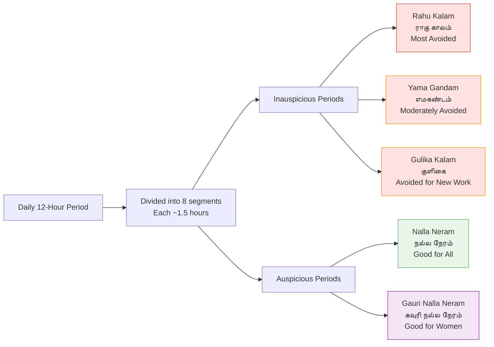

**Ketu (केतु - கேது) - The South Node (Descending)**

**Characteristics:**
- **Symbol:** Dragon's tail (serpent's tail)
- **Nature:** Malefic but spiritual
- **Element:** Fire
- **Color:** Smoky, grey
- **Gemstone:** Cat's eye (वैडूर्य - வைடூரியம்)
- **Day:** Tuesday (shares rulership with Mars)
- **Deity:** Ganesha, Matsya (Fish avatar of Vishnu)

**Astrological Effects:**
- Represents spirituality, detachment, moksha (liberation)
- Causes sudden losses, separation, spiritual awakening
- Associated with: Occult, mysticism, intuition, past life karma
- In mythology: The body that acts on instinct without thinking

**Ketu Kalam (கேது காலம்):**

Similar to Rahu Kalam, some traditions observe Ketu Kalam, though it's less commonly followed.

### <Highlight color='#004080' highlight='fg' fontWeight='bold'> Eclipse Rituals and Practices </Highlight>

**Before Eclipse:**
- Complete all cooking before Sutak begins
- Purify the house
- Place Tulsi (holy basil) or Kusha grass in food/water to prevent "contamination"
- Pregnant women: Stay indoors, avoid using sharp objects

**During Eclipse:**
- **Fasting:** Complete abstinence from food/water (or light fruits)
- **Mantra Chanting:** 
  - Solar Eclipse: Surya mantras (ॐ सूर्याय नमः - Om Suryaya Namaha)
  - Lunar Eclipse: Chandra mantras (ॐ चन्द्राय नमः - Om Chandraya Namaha)
  - Maha Mrityunjaya Mantra for protection
- **No Religious Activities:** No puja, no temple visits
- **Meditation:** Considered powerful time for spiritual practices
- **Avoid:** Eating, sleeping, drinking, traveling

**After Eclipse:**
- **Ritual Bath (स्नान):** Purification bath with water + sesame seeds
- **Discard Old Food:** Food prepared before eclipse is considered impure
- **Fresh Cooking:** Prepare fresh meals
- **Donations (दान):** Give to the needy (food, clothes, money)
- **Temple Visit:** After bath, visit temple for darshan
- **Mantra Completion:** Complete 108 repetitions of mantras

### <Highlight color='#004080' highlight='fg' fontWeight='bold'> Scientific vs Spiritual Understanding </Highlight>

**Modern Science:**
- Eclipses are predictable astronomical events
- Caused by the alignment of Sun, Moon, and Earth
- Safe to observe with proper eye protection (solar eclipse)
- No inherent danger to pregnant women or food

**Hindu Spiritual Tradition:**
- Eclipses mark periods of cosmic imbalance
- Time when negative energies are amplified
- Rahu-Ketu's influence creates spiritual opportunities
- Fasting and mantras purify the mind and body
- Rituals connect to ancient wisdom and cultural continuity

**Balanced Approach:**

Many modern Hindus balance both perspectives:
- Understanding the science while respecting tradition
- Using eclipse time for meditation and introspection
- Observing some rituals as cultural practice
- Maintaining personal spiritual practices without superstition

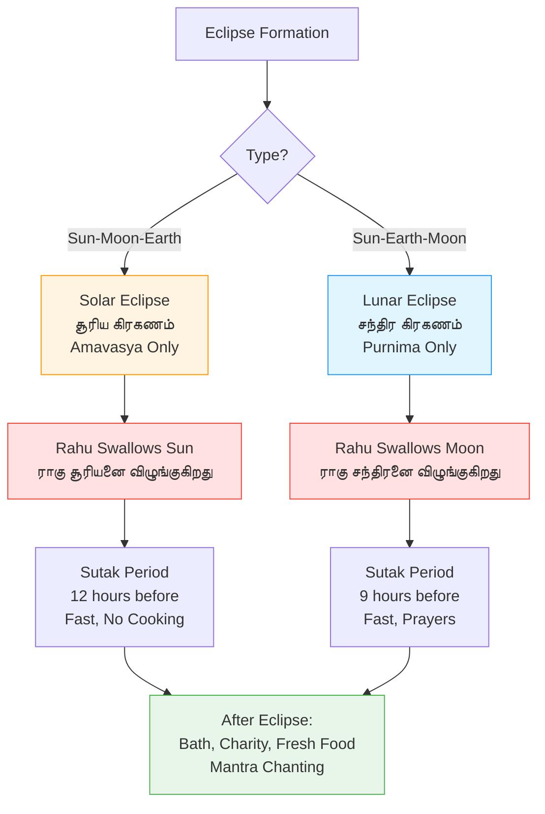

:::note[Eclipse Calendar]
Eclipses don't occur every Amavasya or Purnima - only when the Moon is near Rahu-Ketu's nodes. On average:
- **2-5 solar eclipses per year** (not all visible from every location)
- **2-3 lunar eclipses per year**
:::

## <Highlight color='#800031' highlight='fg' fontWeight='bold'> Special Tamil Calendar Concepts </Highlight>

### <Highlight color='#004080' highlight='fg' fontWeight='bold'> Special Yogas in Tamil Calendar </Highlight>

Tamil panchangams list certain special yogas formed by specific combinations of tithi, vara, and nakshatra. These are highly significant for determining auspiciousness:

#### **Siddha Yoga (சித்த யோகம்) - Perfection Yoga**

**Definition:** A highly auspicious combination formed when specific tithis, weekdays, and nakshatras align.

**Characteristics:**
- Considered one of the best yogas for all activities
- Success assured in new ventures
- Particularly good for: Marriages, business openings, buying property, starting education

**Formation:** Created by favorable combinations like:
- Sunday + Hasta, Uttara Phalguni, Uttara Ashadha, Uttara Bhadrapada nakshatras
- Monday + Rohini, Mrigashira, Punarvasu, Chitra, Shravana nakshatras
- And other specific combinations listed in panchangam

**Tamil Significance:** Called "சித்த யோகம்" - the yoga of accomplishment and perfection.

#### **Amrita Yoga (அமிர்த யோகம்) - Nectar Yoga**

**Definition:** An extremely auspicious yoga, named after the divine nectar of immortality.

**Characteristics:**
- Second only to Siddha Yoga in auspiciousness
- Brings blessings and prosperity
- Ideal for: Religious ceremonies, temple visits, charity, starting spiritual practices

**Formation:** Specific combinations of vara and nakshatra:
- Sunday + Pushya, Hasta, Abhijit nakshatras
- Monday + Ashwini, Shravana nakshatras
- Thursday + Anuradha, Revati nakshatras
- And other combinations

**Tamil Significance:** Called "அமிர்த யோகம்" - the yoga that bestows divine blessings like nectar.

#### **Marana Yoga (மரண யோகம்) - Death/Inauspicious Yoga**

**Definition:** An extremely inauspicious yoga to be strictly avoided for all new beginnings.

**Characteristics:**
- Most unfavorable combination
- Brings obstacles, failures, and misfortune
- Strictly avoided for: Weddings, housewarming, starting business, travel, medical procedures

**Formation:** Unfortunate combinations of vara and nakshatra:
- Sunday + Bharani nakshatra
- Monday + Magha nakshatra
- Tuesday + Purva Phalguni, Purva Ashadha, Purva Bhadrapada nakshatras
- Saturday + any nakshatra during certain tithis
- And other inauspicious combinations

**Tamil Significance:** Called "மரண யோகம்" - literally "death yoga", indicating extreme inauspiciousness.

**Comparison Table:**

| Yoga | Tamil Name | Auspiciousness | Best Used For | Avoid |
|------|------------|----------------|---------------|-------|
| **Siddha Yoga** | சித்த யோகம் | Extremely Auspicious | All new beginnings, marriages, business | - |
| **Amrita Yoga** | அமிர்த யோகம் | Highly Auspicious | Religious activities, spiritual practices | - |
| **Marana Yoga** | மரண யோகம் | Extremely Inauspicious | Nothing! | All important activities |

:::tip[Panchang Consultation]
These special yogas are automatically calculated in Tamil panchangams. Always check for Marana Yoga before planning important events!
:::

### <Highlight color='#004080' highlight='fg' fontWeight='bold'> Nakshatra-Based Day Classification </Highlight>

In Tamil astrology and Panchangam, days are classified based on which **Nakshatra (star constellation)** is prevailing. This classification is used to determine auspiciousness for various activities.

#### **Mel Nokku Naal (மேல் நோக்கு நாள்) - Upward Looking Day**

**Definition:** Days when one of the 9 specific "upward-looking" nakshatras is prevailing.

**The 9 Mel Nokku Nakshatras:**

| # | Sanskrit Name | Tamil Name | Deity |
|---|---------------|------------|-------|
| 4 | रोहिणी (Rohini) | ரோகிணி | Brahma/Prajapati |
| 6 | आर्द्रा (Ardra) | திருவாதிரை | Rudra (Shiva) |
| 8 | पुष्य (Pushya) | பூசம் | Brihaspati |
| 12 | उत्तरा फाल्गुनी (Uttara Phalguni) | உத்திரம் | Aryaman |
| 21 | उत्तराषाढा (Uttara Ashadha) | உத்திராடம் | Vishvadevas |
| 22 | श्रवण (Shravana) | திருவோணம் | Vishnu |
| 23 | धनिष्ठा (Dhanishtha) | அவிட்டம் | Vasus |
| 24 | शतभिषा (Shatabhisha) | சதயம் | Varuna |
| 26 | उत्तरा भाद्रपद (Uttara Bhadrapada) | உத்திரட்டாதி | Ahir Budhnya |

**Characteristics:**
- **Highly Auspicious for:** Growth-oriented activities, upward progression
- **Best for:**
  - Starting construction (especially multi-story buildings)
  - Planting trees and crops
  - Career advancement activities
  - Education and learning new skills
  - Buying property or vehicles
  - Beginning upward journeys (air travel)
- **Symbolism:** These nakshatras are believed to "look upward," bestowing growth and elevation

**How to Determine:** Check your daily Tamil Panchangam to see if today's nakshatra is one of the 9 listed above. If yes, it's Mel Nokku Naal.

#### **Keezh Nokku Naal (கீழ் நோக்கு நாள்) - Downward Looking Day**

**Definition:** Days when one of the 9 specific "downward-looking" nakshatras is prevailing.

**The 9 Keezh Nokku Nakshatras:**

| # | Sanskrit Name | Tamil Name | Deity |
|---|---------------|------------|-------|
| 2 | भरणी (Bharani) | பரணி | Yama |
| 3 | कृत्तिका (Krittika) | கார்த்திகை | Agni |
| 9 | आश्लेषा (Ashlesha) | ஆயில்யம் | Nagas (serpents) |
| 10 | मघा (Magha) | மகம் | Pitrs (ancestors) |
| 11 | पूर्वा फाल्गुनी (Purva Phalguni) | பூரம் | Bhaga |
| 19 | मूल (Mula) | மூலம் | Nirriti/Kali |
| 20 | पूर्वाषाढा (Purva Ashadha) | பூராடம் | Apas (Waters) |
| 25 | पूर्वा भाद्रपद (Purva Bhadrapada) | பூரட்டாதி | Aja Ekapada |
| 27 | रेवती (Revati) | ரேவதி | Pushan |

**Characteristics:**
- **Less auspicious for:** New beginnings and upward ventures
- **Suitable for:**
  - Digging wells and borewells
  - Underground construction (basements, foundations)
  - Mining activities
  - Planting root vegetables
  - Downward journeys
  - Demolition work
  - Ancestor worship and rituals
- **Avoid:**
  - Starting new businesses
  - Important purchases
  - Weddings and celebrations
  - Career-related activities
- **Symbolism:** These nakshatras "look downward," suitable for underground/earthly activities

#### **Sama Nokku Naal (சம நோக்கு நாள்) - Equal Looking Day**

**Definition:** Days when one of the 9 "neutral" or "equal-looking" nakshatras is prevailing.

**The 9 Sama Nokku Nakshatras:**

| # | Sanskrit Name | Tamil Name | Deity |
|---|---------------|------------|-------|
| 1 | अश्विनी (Ashwini) | அஸ்வினி | Ashwini Kumaras |
| 5 | मृगशीर्ष (Mrigashira) | மிருகசீரிடம் | Soma (Moon) |
| 7 | पुनर्वसु (Punarvasu) | புனர்பூசம் | Aditi |
| 13 | हस्त (Hasta) | அஸ்தம் | Savitar (Sun) |
| 14 | चित्रा (Chitra) | சித்திரை | Tvashtar |
| 15 | स्वाति (Swati) | சுவாதி | Vayu (Wind) |
| 16 | विशाखा (Vishakha) | விசாகம் | Indra-Agni |
| 17 | अनुराधा (Anuradha) | அனுஷம் | Mitra |
| 18 | ज्येष्ठा (Jyeshtha) | கேட்டை | Indra |

**Characteristics:**
- **Neutral nature:** Neither particularly good nor bad
- **Suitable for:**
  - Routine daily activities
  - Regular work and business
  - Maintenance activities
  - Balanced, moderate endeavors
  - Activities requiring stability
- **Symbolism:** These nakshatras "look equally" in all directions, providing balance

**Summary Table:**

| Category | Tamil Name | Nakshatras Count | Best For | Avoid |
|----------|------------|-----------------|----------|-------|
| **Upward** | மேல் நோக்கு | 9 nakshatras | Growth, construction upward, career | - |
| **Downward** | கீழ் நோக்கு | 9 nakshatras | Digging, underground work | New beginnings |
| **Equal** | சம நோக்கு | 9 nakshatras | Routine activities | - |

**Total:** 27 nakshatras (9 + 9 + 9 = 27)

:::tip[Daily Panchangam Check]
Your Tamil Panchangam will list today's prevailing nakshatra. Match it with the above lists to determine if it's Mel Nokku, Keezh Nokku, or Sama Nokku Naal.
:::

### <Highlight color='#004080' highlight='fg' fontWeight='bold'> Shulam (சூலம்) - Directional Inauspicious Pointer </Highlight>

**Shulam (சூலம்)** literally means "spear" or "pointed weapon" and indicates an inauspicious direction for each day.

**Definition:** Each day of the week has a specific direction that is considered unlucky for travel or starting journeys.

**Daily Shulam Directions:**

| Day | Tamil Day | Shulam Direction | Tamil Direction | Avoid |
|-----|-----------|------------------|-----------------|-------|
| **Sunday** | ஞாயிறு | West | மேற்கு (Merkku) | Travel/activities toward west |
| **Monday** | திங்கள் | East | கிழக்கு (Kizhakku) | Travel/activities toward east |
| **Tuesday** | செவ்வாய் | North | வடக்கு (Vadakku) | Travel/activities toward north |
| **Wednesday** | புதன் | North | வடக்கு (Vadakku) | Travel/activities toward north |
| **Thursday** | வியாழன் | South | தெற்கு (Therku) | Travel/activities toward south |
| **Friday** | வெள்ளி | South | தெற்கு (Therku) | Travel/activities toward south |
| **Saturday** | சனி | East | கிழக்கு (Kizhakku) | Travel/activities toward east |

**Usage:**
- **Travel:** Avoid traveling in the Shulam direction on that day
- **New Ventures:** Avoid starting businesses or construction in that direction
- **Flexibility:** If travel is essential, perform remedial prayers or start at an auspicious time

**Example:**
- On **Monday (திங்கள்)**, Shulam is **North (வடக்கு)**
- Avoid traveling north on Mondays if possible
- If unavoidable, start journey during an auspicious muhurta

### <Highlight color='#004080' highlight='fg' fontWeight='bold'> Chandrashtama (சந்திராஷ்டமம்) - Lunar Eighth </Highlight>

**Chandrashtama (சந்திராஷ்டமம்)** is an inauspicious period based on the Moon's position relative to your birth moon sign (Janma Rashi).

**Definition:** The period when the transiting Moon is in the 8th house (8th sign) from your birth Moon sign.

**Calculation:**
- Find your birth moon sign (Janma Rashi / ஜன்ம ராசி)
- Count 8 signs forward from your birth moon
- When the current Moon transits that sign = Chandrashtama

**Example:**
- If your birth moon is in **Aries (மேஷம் - Mesham)**
- Count 8 signs: Aries → Taurus → Gemini → Cancer → Leo → Virgo → Libra → **Scorpio**
- When Moon transits **Scorpio (விருச்சிகம் - Viruchikam)** = Your Chandrashtama

**Duration:**
- Occurs once every month
- Lasts approximately 2.25 days (the time Moon spends in one sign)

**Characteristics:**
- **Mental stress:** Anxiety, restlessness, emotional turmoil
- **Obstacles:** Difficulties in ongoing work
- **Health:** Minor ailments, fatigue
- **Avoid:** Starting new important work, major decisions, travel (if possible)

**Impact Varies:**
- **Mild** for routine days
- **Significant** when combined with other inauspicious factors

**The 12 Zodiac Signs (Rashi):**

| # | Sanskrit | Tamil | English |
|---|----------|-------|---------|
| 1 | मेष (Mesha) | மேஷம் (Mesham) | Aries |
| 2 | वृषभ (Vrishabha) | ரிஷபம் (Rishabam) | Taurus |
| 3 | मिथुन (Mithuna) | மிதுனம் (Mithunam) | Gemini |
| 4 | कर्क (Karka) | கடகம் (Kadagam) | Cancer |
| 5 | सिंह (Simha) | சிம்மம் (Simmam) | Leo |
| 6 | कन्या (Kanya) | கன்னி (Kanni) | Virgo |
| 7 | तुला (Tula) | துலாம் (Thulam) | Libra |
| 8 | वृश्चिक (Vrishchika) | விருச்சிகம் (Viruchikam) | Scorpio |
| 9 | धनु (Dhanu) | தனுசு (Dhanusu) | Sagittarius |
| 10 | मकर (Makara) | மகரம் (Magaram) | Capricorn |
| 11 | कुम्भ (Kumbha) | கும்பம் (Kumbam) | Aquarius |
| 12 | मीन (Meena) | மீனம் (Meenam) | Pisces |

**Chandrashtama Table (8th from each Rashi):**

| Your Birth Moon (Janma Rashi) | Chandrashtama Sign (8th house) |
|-------------------------------|--------------------------------|
| Aries (மேஷம்) | Scorpio (விருச்சிகம்) |
| Taurus (ரிஷபம்) | Sagittarius (தனுசு) |
| Gemini (மிதுனம்) | Capricorn (மகரம்) |
| Cancer (கடகம்) | Aquarius (கும்பம்) |
| Leo (சிம்மம்) | Pisces (மீனம்) |
| Virgo (கன்னி) | Aries (மேஷம்) |
| Libra (துலாம்) | Taurus (ரிஷபம்) |
| Scorpio (விருச்சிகம்) | Gemini (மிதுனம்) |
| Sagittarius (தனுசு) | Cancer (கடகம்) |
| Capricorn (மகரம்) | Leo (சிம்மம்) |
| Aquarius (கும்பம்) | Virgo (கன்னி) |
| Pisces (மீனம்) | Libra (துலாம்) |

**Remedies:**
- Chant Moon mantras (Om Chandraya Namaha - ॐ चन्द्राय नमः)
- Wear pearl or moonstone (if astrologically suitable)
- Avoid major decisions during this period
- Worship Lord Shiva
- Donate white items (rice, milk) on Mondays

:::note[Personal Calculation]
To find your Chandrashtama days, you need to know your birth moon sign (Janma Rashi). This is determined by your birth date, time, and location. Modern Tamil panchangam apps can calculate this for you.
:::

## <Highlight color='#800031' highlight='fg' fontWeight='bold'> How to Find Tithis: Using a Panchang </Highlight>

### <Highlight color='#004080' highlight='fg' fontWeight='bold'> What is a Panchang? </Highlight>

**Panchang (பஞ்சாங்கம் in Tamil)** literally means "five limbs" - a Hindu almanac that provides:

**The Five Elements (Panchangam):**
1. **Tithi (திதி):** Lunar day
2. **Vara (வாரம்):** Weekday
3. **Nakshatra (நட்சத்திரம்):** Constellation
4. **Yoga (யோகம்):** Astronomical combination
5. **Karana (கரணம்):** Half-tithi

### <Highlight color='#004080' highlight='fg' fontWeight='bold'> Modern Tools </Highlight>

**Traditional:**
- Printed almanacs (பஞ்சாங்கம் books)
- Temple calendars

**Digital:**
- Drik Panchang app/website
- ISKCON calendar
- Tamil Panchangam apps
- Google Calendar (Hindu holidays)

:::tip[Quick Festival Lookup]
Most smartphones now include Hindu festival dates in calendar apps. For precise timings (Pradosha Kaalam, Muhurta), consult a location-specific panchang as timings vary by latitude/longitude.
:::

## <Highlight color='#800031' highlight='fg' fontWeight='bold'> Summary: Festival Calculation Quick Reference </Highlight>

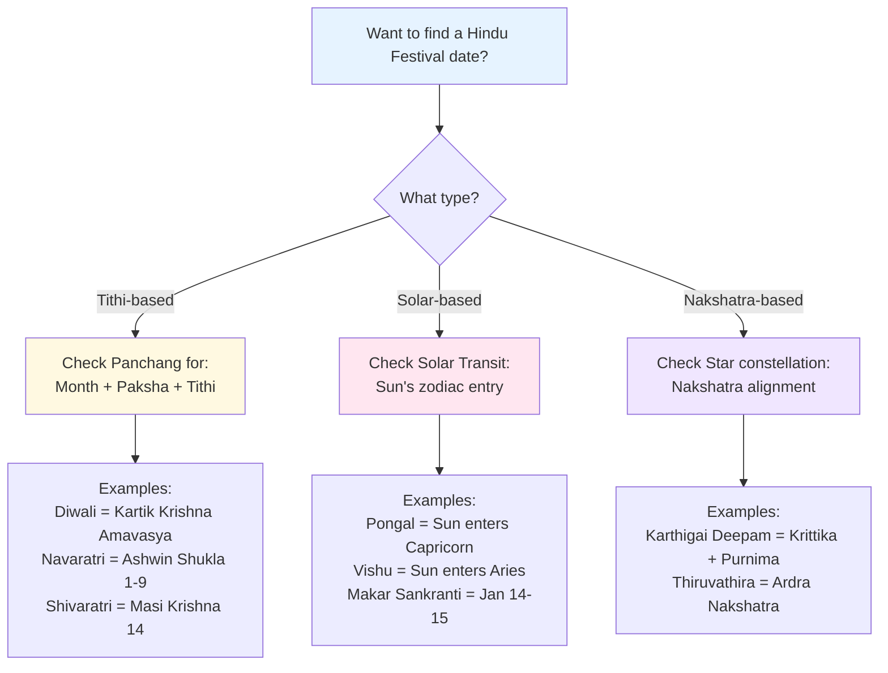

### <Highlight color='#004080' highlight='fg' fontWeight='bold'> Key Takeaways </Highlight>

| Festival | Type | Calculation Method | Fixed/Variable Gregorian Date |
|----------|------|-------------------|-------------------------------|
| **Diwali** | Tithi | Kartik Krishna Amavasya | Variable (Oct-Nov) |
| **Navaratri** | Tithi | Ashwin Shukla 1-9 | Variable (Sep-Oct) |
| **Shivaratri** | Tithi | Masi Krishna Chaturdashi | Variable (Feb-Mar) |
| **Pongal** | Solar | Sun → Capricorn | Fixed (Jan 14-15) |
| **Karthigai Deepam** | Nakshatra | Krittika + Purnima in Karthigai | Variable (Nov-Dec) |
| **Pradosham** | Tithi | Every Trayodashi (13th) | Twice monthly |

## <Highlight color='#800031' highlight='fg' fontWeight='bold'> The 60-Year Tamil Cycle (அறுபது ஆண்டுகள்) </Highlight>

The **60-year cycle**, also called **Samvatsara Chakra (संवत्सर चक्र)**, is a unique Hindu-Tamil calendar system where years are named instead of numbered.

### <Highlight color='#004080' highlight='fg' fontWeight='bold'> Origin and Significance </Highlight>

**Astronomical Basis:**
- Based on **Jupiter's (Guru/Brihaspati) orbital period**
- Jupiter takes approximately **12 years** to complete one orbit around the Sun
- 12 years × 5 cycles = **60-year cycle**
- The cycle completed by the conjunction of Jupiter and Saturn

**Why 60 Years?**
- **12 Rasis (zodiac signs)** × **5 elements** (Pancha Bhuta) = 60
- LCM of Jupiter's 12-year cycle and Saturn's 30-year cycle = 60
- Represents completion and cosmic renewal

### <Highlight color='#004080' highlight='fg' fontWeight='bold'> The 60 Year Names (அறுபது வருட பெயர்கள்) </Highlight>

Each year has a unique Sanskrit name with Tamil pronunciation. Here are all 60 years in order:

**Years 1-10:**

| # | Sanskrit Name | Tamil Name | Meaning |
|---|---------------|------------|---------|
| 1 | प्रभव (Prabhava) | பிரபவ (Pirabhava) | Beginning, genesis |
| 2 | विभव (Vibhava) | விபவ (Vibhava) | Grandeur, prosperity |
| 3 | शुक्ल (Shukla) | சுக்ல (Sukla) | Bright, pure |
| 4 | प्रमोद (Pramoda) | பிரமோத (Pramoda) | Delight, joy |
| 5 | प्रजापति (Prajapati) | பிரஜாபதி (Prajapati) | Lord of creatures |
| 6 | अंगीरस (Angiras) | அங்கீரச (Angeerasa) | Name of a sage |
| 7 | श्रीमुख (Shrimukha) | ஸ்ரீமுக (Srimukha) | Auspicious face |
| 8 | भाव (Bhava) | பவ (Bhava) | Existence |
| 9 | युवा (Yuva) | யுவ (Yuva) | Youth |
| 10 | धातु (Dhatu) | தாது (Dhatu) | Element, essence |

**Years 11-20:**

| # | Sanskrit Name | Tamil Name | Meaning |
|---|---------------|------------|---------|
| 11 | ईश्वर (Ishvara) | ஈஶ்வர (Eeshwara) | Lord, supreme being |
| 12 | बहुधान्य (Bahudhanya) | பஹுதான்ய (Bahudhanya) | Abundance of grains |
| 13 | प्रमाथि (Pramathi) | பிரமாதி (Pramathi) | Destroyer of pride |
| 14 | विक्रम (Vikrama) | விக்ரம (Vikrama) | Valor, prowess |
| 15 | वृष (Vrisha) | விருஷ (Vrisha) | Bull, Dharma |
| 16 | चित्रभानु (Chitrabhanu) | சித்திரபானு (Chitrabhanu) | Bright, variegated |
| 17 | स्वभानु (Svabhanu) | ஸ்வபானு (Swabhanu) | Self-luminous |
| 18 | तारण (Tarana) | தாரண (Tarana) | Savior |
| 19 | पार्थिव (Parthiva) | பார்த்திப (Parthiva) | Earthly, prince |
| 20 | व्यय (Vyaya) | வியய (Vyaya) | Loss, expenditure |

**Years 21-30:**

| # | Sanskrit Name | Tamil Name | Meaning |
|---|---------------|------------|---------|
| 21 | सर्वजित् (Sarvajit) | ஸர்வஜித்து (Sarvajittu) | Conqueror of all |
| 22 | सर्वधारि (Sarvadhari) | ஸர்வதாரி (Sarvadhari) | Supporter of all |
| 23 | विरोधि (Virodhi) | விரோதி (Virodhi) | Opponent |
| 24 | विकृति (Vikruti) | விகிருதி (Vikriti) | Transformation |
| 25 | खर (Khara) | கர (Khara) | Hard, rough |
| 26 | नन्दन (Nandana) | நந்தன (Nandana) | Delightful |
| 27 | विजय (Vijaya) | விஜய (Vijaya) | Victory |
| 28 | जय (Jaya) | ஜெய (Jaya) | Triumph |
| 29 | मन्मथ (Manmatha) | மன்மத (Manmatha) | Cupid, desire |
| 30 | दुर्मुख (Durmukha) | துர்முகி (Durmukhi) | Ugly-faced, inauspicious |

**Years 31-40:**

| # | Sanskrit Name | Tamil Name | Meaning |
|---|---------------|------------|---------|
| 31 | हेमलम्ब (Hemalamba) | ஹேமலம்ப (Hemalamba) | Golden-hued |
| 32 | विलम्ब (Vilamba) | விளம்ப (Vilamba) | Delay |
| 33 | विकारि (Vikari) | விகாரி (Vikari) | Deformed, changed |
| 34 | शार्वरि (Sharvari) | ஶார்வரி (Sharvari) | Night, darkness |
| 35 | प्लव (Plava) | பிலவ (Plava) | Boat, floater |
| 36 | शुभकृत् (Shubhakrut) | ஶுபகிருத்து (Shubhakrittu) | Doer of good |
| 37 | शोभन (Shobhana) | ஶோபகிருது (Shobhakrutu) | Splendid |
| 38 | क्रोधि (Krodhi) | குரோதி (Krodhi) | Angry |
| 39 | विश्वावसु (Vishvavasu) | விஶ்வாவசு (Vishvavasu) | Universal good |
| 40 | पराभव (Parabhava) | பராபவ (Parabhava) | Defeat |

**Years 41-50:**

| # | Sanskrit Name | Tamil Name | Meaning |
|---|---------------|------------|---------|
| 41 | प्लवंग (Plavanga) | பிலவங்க (Plavanga) | Jumper, monkey |
| 42 | कीलक (Kilaka) | கீலக (Keelaka) | Pin, bolt |
| 43 | सौम्य (Saumya) | ஸௌம்ய (Saumya) | Gentle, pleasant |
| 44 | साधारण (Sadharana) | ஸாதாரண (Sadharana) | Ordinary, common |
| 45 | विरोधकृत् (Virodhakrut) | விரோதிகிருது (Virodhikrutu) | Creator of opposition |
| 46 | परिधावि (Paridhavi) | பரிதாபி (Paridhabi) | Circumambulating |
| 47 | प्रमादि (Pramadi) | பிரமாதீச (Pramadeesha) | Careless, intoxicated |
| 48 | आनन्द (Ananda) | ஆனந்த (Ananda) | Bliss, joy |
| 49 | राक्षस (Rakshasa) | ராக்ஷஸ (Rakshasa) | Demon |
| 50 | अनल (Anala) | அநல (Anala) | Fire |

**Years 51-60:**

| # | Sanskrit Name | Tamil Name | Meaning |
|---|---------------|------------|---------|
| 51 | पिङ्गल (Pingala) | பிங்கள (Pingala) | Brown, tawny |
| 52 | कालयुक्ति (Kalayukti) | கலயுக்தி (Kalayukti) | Skilled in arts |
| 53 | सिद्धार्थ (Siddhartha) | ஸித்தார்த்தி (Siddharthi) | Accomplished goal |
| 54 | रौद्र (Raudra) | ரௌத்ரி (Raudri) | Fierce, terrible |
| 55 | दुर्मति (Durmati) | துர்மதி (Durmati) | Evil-minded |
| 56 | दुन्दुभि (Dundubhi) | துந்துபி (Dundubhi) | Drum |
| 57 | रुधिरोद्गारि (Rudhirodgari) | ருத்ரோத்காரி (Rudhrodgari) | Blood-shedder |
| 58 | रक्ताक्षि (Raktakshi) | ரக்தாக்ஷி (Raktakshi) | Red-eyed |
| 59 | क्रोधन (Krodhana) | குரோதன (Krodhana) | Wrathful |
| 60 | क्षय (Kshaya) | க்ஷய (Kshaya) | Destruction, end |

### <Highlight color='#004080' highlight='fg' fontWeight='bold'> Current Year and Cycle </Highlight>

**How to Find Current Tamil Year:**
- Tamil panchangams list the current year name
- The cycle repeats every 60 years
- **2024 CE** = **Krodhi (குரோதி)** - Year #38
- **2025 CE** = **Vishvavasu (விஶ்வாவசு)** - Year #39
- After Kshaya (#60), the cycle restarts with Prabhava (#1)

**Last Complete Cycle:**
- Previous cycle: 1987-2046 (current cycle)
- Next cycle: 2047-2106

### <Highlight color='#004080' highlight='fg' fontWeight='bold'> Cultural Significance </Highlight>

**60th Birthday Celebration (Shashtiabdapoorthi / அறுபதாம் கல்யாணம்):**
- Completing 60 years means you've lived through one complete cosmic cycle
- Called **"Shastiabdapoorthi" (षष्ट्यब्दपूर्ति)** in Sanskrit
- Tamil: **"Sashtiyabdapurthi"** or **60th birthday (அறுபது வயது)**
- Celebrated as a second wedding ceremony
- Highly auspicious - signifies rebirth and renewal
- Family gathers to honor the elder

**Astrological Importance:**
- Each year has its own characteristics and predictions
- Astrologers use year names in horoscope calculations
- Certain years considered more auspicious than others

**Religious Usage:**
- Year name mentioned in temple rituals and sankalpa (vows)
- Used in determining festival dates and muhurtas
- Part of the Panchanga (five limbs of time)

:::tip[Know Your Birth Year]
Find your Hindu birth year name from Tamil panchangam or online calculators. It adds a beautiful dimension to understanding your astrological chart!
:::

**Visual: 60-Year Cycle Structure**

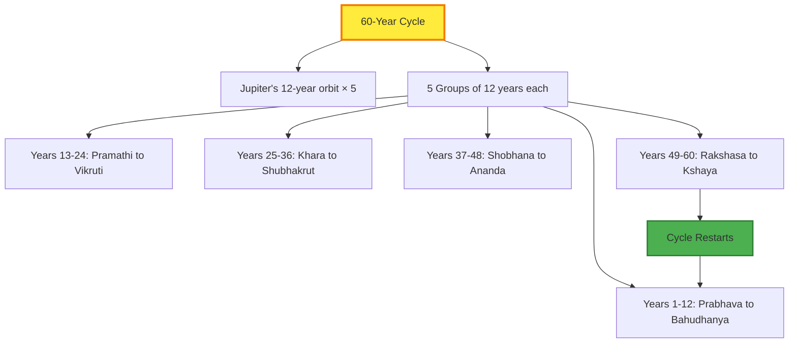

## <Highlight color='#800031' highlight='fg' fontWeight='bold'> Conclusion: Living by the Lunar Rhythm </Highlight>

The Hindu lunar calendar, with its intricate system of **tithis, pakshas, nakshatras, and the 60-year cycle**, offers a sophisticated framework for spiritual observance. Understanding these concepts helps us appreciate:

✅ **Why** festivals fall on "different dates" each year (they don't—they follow lunar consistency)  
✅ **How** ancient astronomers created precise timekeeping without modern technology  
✅ **When** to observe specific rituals and fasts  
✅ **The connection** between celestial movements and spiritual practices

From the waxing moon of **Shukla Paksha (வளர்பிறை)** to the waning moon of **Krishna Paksha (தேய்பிறை)**, from the sacred twilight of **Pradosham (பிரதோஷம்)** to the darkest night of **Shivaratri (சிவராத்திரி)**, the lunar calendar weaves a tapestry of time that has guided spiritual practice for millennia.

Whether you're observing **Ekadashi fasts (ஏகாதசி விரதம்)**, celebrating **Diwali lights (தீபாவளி)**, dancing during **Navaratri (நவராத்திரி)**, lighting lamps for **Karthigai Deepam (கார்த்திகை தீபம்)**, or harvesting during **Pongal (பொங்கல்)**, you're participating in a timeless rhythm that connects the cosmos, culture, and consciousness.

:::tip[Final Wisdom]
**"Time is not linear in the Hindu tradition—it is cyclical, eternal, and deeply connected to the dance of the Sun and Moon across the heavens."**

May this understanding of tithi and the lunar calendar deepen your connection to these beautiful traditions! 🌙✨
:::

---

**References:**
- Traditional Tamil Panchangam
- Surya Siddhanta (Ancient Indian astronomy text)
- Vedanga Jyotisha
- Regional Hindu calendars (North & South India)
- Drik Panchang and other astronomical calculators
