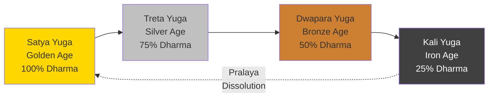
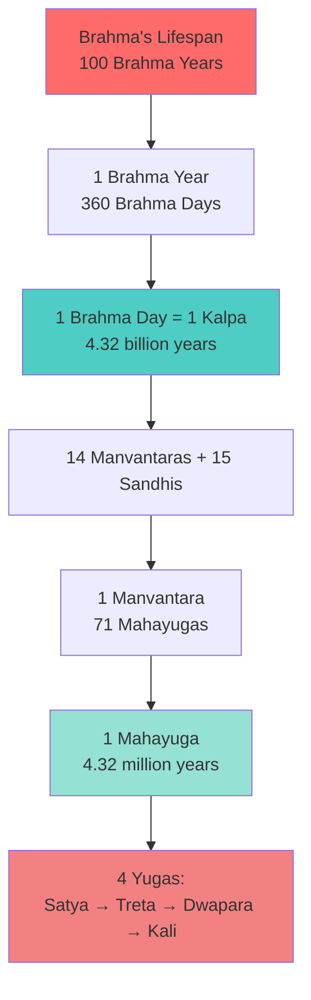
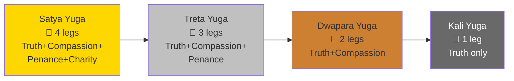

import Highlight from "@/react/Highlight/Highlight.jsx";

# Complete Guide to Hindu Yugas - The Cosmic Time Cycles
# இந்து யுகங்கள் - பிரபஞ்ச கால சுழற்சிகள்

In Hindu cosmology, time is not linear but **cyclical** - moving through vast cosmic ages called **Yugas (युग/யுகம்)**. Understanding these yugas reveals the profound Vedic philosophy of time, dharma (righteousness), and the evolution of human consciousness.

:::tip[Quick Overview - விரைவான கண்ணோட்டம்]
**The Four Yugas in Order:**

1. 🌟 **Satya Yuga (சத்ய யுகம்)** - The Golden Age (Age of Truth)
2. 🔶 **Treta Yuga (திரேதா யுகம்)** - The Silver Age (Age of Three)
3. 🔸 **Dwapara Yuga (துவாபர யுகம்)** - The Bronze Age (Age of Two)
4. ⚫ **Kali Yuga (கலி யுகம்)** - The Iron Age (Age of Discord) **← WE ARE HERE**

**Total Duration of One Cycle:** 4,320,000 human years = 1 Mahayuga (महायुग/மஹாயுகம்)
:::

---

## <Highlight color='#800031' highlight='fg' fontWeight='bold'> WHAT ARE YUGAS? - யுகம் என்றால் என்ன? </Highlight>

### <Highlight color='#004080' highlight='fg' fontWeight='bold'> The Concept of Cosmic Time </Highlight>

**Yuga (युग/யுகம்)** literally means "age," "epoch," or "era" in Sanskrit. In Hindu philosophy, time operates on multiple scales:

**Human Time:**
- Day, Month, Year, Lifetime

**Cosmic Time:**
- **Yuga** (युग) - Cosmic age (hundreds of thousands of years)
- **Mahayuga** (महायुग) - Great age (4 yugas combined = 4.32 million years)
- **Manvantara** (मन्वन्तर) - Age of Manu (71 Mahayugas)
- **Kalpa** (कल्प) - Day of Brahma (1,000 Mahayugas = 4.32 billion years)
- **Brahma's Life** - 100 Brahma years (311 trillion human years)

**The Vedic Concept:**

Unlike linear time (past → present → future), Hindu cosmology views time as **cyclical** - like seasons repeating endlessly. Each cycle (Mahayuga) contains four yugas that progressively decline in dharma (righteousness), human virtue, and lifespan.

**The Decline Pattern:**



---

## <Highlight color='#800031' highlight='fg' fontWeight='bold'> THE FOUR YUGAS IN DETAIL - நான்கு யுகங்கள் </Highlight>

### <Highlight color='#004080' highlight='fg' fontWeight='bold'> 1. SATYA YUGA (सत्य युग/சத்ய யுகம்) - The Golden Age </Highlight>

**Names:**
- **Satya Yuga** (सत्य युग) = Age of Truth
- **Krita Yuga** (कृत युग) = Perfect Age / Age of Deeds
- **Golden Age** (in Western parallels)

**Duration:**
- **1,728,000 human years** (4 × 432,000)
- **Ratio:** 4 units (out of 10)

**Characteristics:**

**Dharma (Righteousness):**
- ✅ 100% dharma prevails
- Represented by the **bull of dharma standing on all four legs**
- No adharma (unrighteousness) exists
- Truth, compassion, penance, and charity are fully present

**Human Qualities:**
- **Lifespan:** 100,000 years
- **Height:** 21 feet (6.4 meters)
- **Health:** No disease, no suffering
- **Mental State:** Pure, peaceful, truthful
- **Knowledge:** Direct perception of truth
- **Food:** Primarily fruits and natural foods
- **Social Structure:** No caste system, complete equality
- **Work:** Minimal effort needed for sustenance

**Spiritual State:**
- Direct communion with God
- No need for temples or rituals
- Meditation comes naturally
- Everyone is self-realized
- No karma accumulation

**Examples from Mythology:**
- Beginning of creation after Brahma creates
- Time of the seven great rishis (Saptarshis)
- Age when gods walked among humans

**Why "Golden"?**
- Like pure gold - unmixed, untainted, perfect
- Highest quality of human consciousness
- Golden era of peace and prosperity

---

### <Highlight color='#004080' highlight='fg' fontWeight='bold'> 2. TRETA YUGA (त्रेता युग/திரேதா யுகம்) - The Silver Age </Highlight>

**Names:**
- **Treta Yuga** (त्रेता युग) = Age of Three
- **Silver Age**

**Duration:**
- **1,296,000 human years** (3 × 432,000)
- **Ratio:** 3 units (out of 10)

**Characteristics:**

**Dharma (Righteousness):**
- ✅ 75% dharma prevails
- Represented by the **bull of dharma standing on three legs**
- 25% adharma (unrighteousness) enters
- Slight decline from perfection

**Human Qualities:**
- **Lifespan:** 10,000 years
- **Height:** 14 feet (4.3 meters)
- **Health:** Occasional diseases appear
- **Mental State:** Mostly righteous, some desires arise
- **Knowledge:** Need for study and learning begins
- **Food:** Agriculture begins, cooked food introduced
- **Social Structure:** Varna system emerges naturally
- **Work:** Effort required for prosperity

**Spiritual State:**
- Yajnas (sacrifices/rituals) become necessary
- Vedas are divided for understanding
- Meditation requires more effort
- Temples and rituals begin
- Karma and rebirth cycle becomes prominent

**Major Events in Treta Yuga:**
- **Lord Rama's incarnation** (Ramayana era)
- **Vamana, Parashurama avatars** of Vishnu
- Great kings like Harishchandra (known for truth)
- Sage Vishwamitra's transformation from king to rishi

**Why "Treta"?**
- "Treta" = Three in Sanskrit
- Three parts dharma, one part adharma
- Three methods of attaining moksha emphasized: Jnana (knowledge), Karma (action), Tapas (penance)

**Key Difference from Satya Yuga:**
- Yajnas (fire sacrifices) become the primary means of worship
- Righteousness requires conscious effort
- Social duties and roles become defined
- Nature of truth shifts from absolute to relative

---

### <Highlight color='#004080' highlight='fg' fontWeight='bold'> 3. DWAPARA YUGA (द्वापर युग/துவாபர யுகம்) - The Bronze Age </Highlight>

**Names:**
- **Dwapara Yuga** (द्वापर युग) = Age of Two
- **Bronze Age**

**Duration:**
- **864,000 human years** (2 × 432,000)
- **Ratio:** 2 units (out of 10)

**Characteristics:**

**Dharma (Righteousness):**
- ✅ 50% dharma prevails
- Represented by the **bull of dharma standing on two legs**
- 50% adharma (unrighteousness) present
- Equal balance between good and evil

**Human Qualities:**
- **Lifespan:** 1,000 years
- **Height:** 7 feet (2.1 meters)
- **Health:** Many diseases appear
- **Mental State:** Desires and attachment increase
- **Knowledge:** Vedas divided into four parts (Rig, Yajur, Sama, Atharva)
- **Food:** Variety of foods, meat-eating becomes common
- **Social Structure:** Caste system rigidifies
- **Work:** Hard work necessary for survival

**Spiritual State:**
- Worship through temples and idols begins
- Bhakti (devotion) path emerges
- Yoga and meditation require discipline
- Karmic debt accumulates faster
- Spiritual knowledge requires teachers (gurus)

**Major Events in Dwapara Yuga:**
- **Lord Krishna's incarnation** (Mahabharata era)
- **Kurukshetra War** between Pandavas and Kauravas
- **Bhagavad Gita** teachings revealed
- Great dynasties: Pandavas, Kauravas, Yadavas
- Sage Vyasa compiles Vedas and writes Mahabharata

**Why "Dwapara"?**
- "Dwapara" = Two in Sanskrit (from "Dvi" = two)
- Two parts dharma, two parts adharma (equal)
- Duality becomes prominent (good vs evil, right vs wrong)
- Two paths become clear: dharma or adharma

**Key Difference from Treta Yuga:**
- Krishna's message: Bhakti (devotion) as path to liberation
- Vedic knowledge becomes specialized
- Political power struggles intensify
- Dharma requires constant vigilance

**End of Dwapara Yuga:**
- Lord Krishna leaves Earth (3102 BCE according to tradition)
- This marks the beginning of Kali Yuga
- Yadava clan destroys itself
- Great sages withdraw from active worldly life

---

### <Highlight color='#004080' highlight='fg' fontWeight='bold'> 4. KALI YUGA (कलि युग/கலி யுகம்) - The Iron Age (CURRENT) </Highlight>

**Names:**
- **Kali Yuga** (कलि युग) = Age of Discord/Quarrel
- **Iron Age**
- **Age of Darkness**

**Duration:**
- **432,000 human years** (1 × 432,000)
- **Ratio:** 1 unit (out of 10)
- **Started:** 3102 BCE (February 17/18, 3102 BCE at midnight)
- **Elapsed:** ~5,125 years (as of 2026 CE)
- **Remaining:** ~426,875 years

**Characteristics:**

**Dharma (Righteousness):**
- ⚠️ Only 25% dharma remains
- Represented by the **bull of dharma standing on one leg** (truth)
- 75% adharma (unrighteousness) prevails
- Lowest point in the cosmic cycle

**Human Qualities:**
- **Lifespan:** 100-120 years (and decreasing)
- **Height:** 5-6 feet (1.5-1.8 meters)
- **Health:** Numerous diseases, physical and mental ailments
- **Mental State:** Dominated by desires, anger, greed, ego
- **Knowledge:** Spiritual knowledge rare, material knowledge dominant
- **Food:** All types of food, processed and artificial
- **Social Structure:** Caste by birth (corrupted), materialism, inequality
- **Work:** Intense struggle for survival

**Spiritual State:**
- Worship requires great effort and discipline
- Direct divine experiences extremely rare
- Bhakti (devotion) and Nama Japa (chanting) most effective
- Gurus and spiritual guides hard to find
- Material pursuits dominate over spiritual

**Predicted Characteristics of Kali Yuga:**

According to **Bhagavata Purana** and other texts:

**Social Decay:**
- ❌ Rulers will become unreasonable, levying heavy taxes
- ❌ People will flee to mountains and forests to escape oppression
- ❌ Wealth alone will determine nobility and status
- ❌ Power will determine dharma
- ❌ Beauty will depend on external appearance only
- ❌ Marriage will be based on mutual agreement only (no sacred ceremony)

**Moral Decline:**
- ❌ Hypocrisy will be considered as virtue
- ❌ Filling the stomach will be the only goal
- ❌ Boldness and arrogance will substitute for scholarship
- ❌ Lack of piety will be considered as integrity
- ❌ Simple bathing will be purification
- ❌ Verbal cleverness will be knowledge

**Religious Degradation:**
- ❌ External symbols will replace inner spirituality
- ❌ Mutual consent will replace sacred rites
- ❌ Donning religious robes will be spiritual advancement
- ❌ False arguments will be considered philosophy

**Family & Relationships:**
- ❌ Women will be objects of sensual pleasure only
- ❌ Children will be burdened with support of parents from early age
- ❌ Family ties will be restricted to marriage bonds
- ❌ Respect will exist only between equals in wealth

**Economic & Political:**
- ❌ Business will be built on deceit
- ❌ Expertise in sex will be the measure of masculinity/femininity
- ❌ Poverty will be reason for condemnation
- ❌ The Earth will be valued only for mineral treasures

**Positive Aspects of Kali Yuga:**

Despite being the darkest age, Kali Yuga has unique **advantages**:

✅ **Easy Path to Liberation:**
- In Satya Yuga: Required intense meditation for ages
- In Treta Yuga: Required elaborate yajnas (sacrifices)
- In Dwapara Yuga: Required temple worship and rituals
- **In Kali Yuga:** Simple devotion and chanting God's name is enough!

✅ **Shorter Lifespan = Less Suffering:**
- Less time to accumulate heavy karma
- Quicker cycle of births to burn karma

✅ **Grace of Saints:**
- Great saints incarnate in Kali Yuga to guide people
- Examples: Adi Shankaracharya, Ramanuja, Madhva, Ramakrishna, Ramana Maharshi

✅ **Small Good Deeds = Great Merit:**
- In Satya Yuga, a great deed had small merit (everyone was good)
- In Kali Yuga, even a small good deed has immense merit (rare to be good)

**Major Events in Kali Yuga (So Far):**

<div class="table-luxury-grid">

| Period | Events |
|--------|--------|
| **3102 BCE** | Kali Yuga begins with Krishna's departure |
| **~3000 BCE** | Mahabharata war consequences, Parikshit's rule |
| **~1500 BCE** | Vedic civilization spreads across India |
| **~500 BCE** | Buddha, Mahavira, and rise of Buddhism/Jainism |
| **~200 BCE - 200 CE** | Compilation of major Puranas |
| **~800 CE** | Adi Shankaracharya's Advaita Vedanta revival |
| **~1000-1500 CE** | Bhakti movement spreads across India |
| **~1800-1900 CE** | Hindu renaissance: Ramakrishna, Vivekananda |
| **Modern Era** | Technology, globalization, spiritual seeking continues |

</div>

**Current Position:**
- We are approximately **5,125 years into Kali Yuga**
- Still in the **early stages** (only ~1.2% complete)
- Many prophecies about later stages yet to manifest

**When Will Kali Yuga End?**
- After **432,000 years** total (426,875 years remaining)
- Followed by brief **Pralaya** (dissolution/transition period)
- Then **Satya Yuga** begins again

**What Happens at the End?**
- Lord Kalki (10th avatar of Vishnu) will appear
- Will destroy evil and restore dharma
- Riding a white horse, wielding a blazing sword
- Signals transition to next Satya Yuga

---

## <Highlight color='#800031' highlight='fg' fontWeight='bold'> COMPARISON OF ALL FOUR YUGAS </Highlight>

### <Highlight color='#004080' highlight='fg' fontWeight='bold'> Quick Comparison Table </Highlight>

<div class="table-luxury-grid">

| Aspect | Satya Yuga | Treta Yuga | Dwapara Yuga | Kali Yuga |
|--------|------------|------------|--------------|-----------|
| **Duration** | 1,728,000 years | 1,296,000 years | 864,000 years | 432,000 years |
| **Ratio** | 4:3:2:1 | 4:3:2:1 | 4:3:2:1 | 4:3:2:1 |
| **Dharma %** | 100% | 75% | 50% | 25% |
| **Bull Legs** | 4 legs | 3 legs | 2 legs | 1 leg |
| **Human Lifespan** | 100,000 years | 10,000 years | 1,000 years | 100-120 years |
| **Human Height** | 21 feet | 14 feet | 7 feet | 5-6 feet |
| **Primary Color** | White/Gold | Red/Silver | Yellow/Bronze | Black/Iron |
| **Spiritual Path** | Meditation | Yajna (Sacrifice) | Worship/Bhakti | Nama Japa (Chanting) |
| **Knowledge Source** | Direct Perception | One Veda | Four Vedas | Scattered Knowledge |
| **Social Order** | Natural Equality | Natural Varna | Rigid Caste | Corrupted Caste |
| **Main Quality** | Truth (Satya) | Sacrifice (Yajna) | Duality | Discord (Kali) |
| **Human Nature** | Selfless | Dutiful | Mixed | Selfish |
| **Avatar/Era** | Creation Era | Rama | Krishna | Kalki (at end) |

</div>

---

## <Highlight color='#800031' highlight='fg' fontWeight='bold'> THE COSMIC TIMELINE </Highlight>

### <Highlight color='#004080' highlight='fg' fontWeight='bold'> Mathematical Breakdown </Highlight>

**One Mahayuga (Chaturyuga) = 4,320,000 years**

```
Satya Yuga:   1,728,000 years (40% of cycle)
Treta Yuga:   1,296,000 years (30% of cycle)
Dwapara Yuga:   864,000 years (20% of cycle)
Kali Yuga:      432,000 years (10% of cycle)
─────────────────────────────────────────────
Total:        4,320,000 years (1 Mahayuga)
```

**The 4:3:2:1 Ratio:**

Notice the perfect mathematical ratio:
- Satya : Treta : Dwapara : Kali = 4 : 3 : 2 : 1

This reflects the progressive decline in dharma, lifespan, and human qualities.

**Sandhya and Sandhyansa (Twilight Periods):**

Each yuga has transitional periods:

- **Sandhya** (सन्ध्या) = Dawn/Beginning twilight
- **Sandhyansa** (सन्ध्यांश) = Dusk/Ending twilight

<div class="table-luxury-grid">

| Yuga | Sandhya | Main Period | Sandhyansa | Total |
|------|---------|-------------|------------|-------|
| **Satya** | 144,000 | 1,440,000 | 144,000 | 1,728,000 |
| **Treta** | 108,000 | 1,080,000 | 108,000 | 1,296,000 |
| **Dwapara** | 72,000 | 720,000 | 72,000 | 864,000 |
| **Kali** | 36,000 | 360,000 | 36,000 | 432,000 |

</div>

**During twilight periods:**
- Characteristics of both yugas overlap
- Gradual transition rather than abrupt change
- Great changes and upheavals occur

---

### <Highlight color='#004080' highlight='fg' fontWeight='bold'> Larger Time Cycles </Highlight>

**71 Mahayugas = 1 Manvantara (मन्वन्तर)**
- Duration: 306,720,000 years
- Ruled by one Manu (progenitor of humanity)
- Currently in **7th Manvantara** (Vaivasvata Manu)

**14 Manvantaras + 15 Sandhis = 1 Kalpa (कल्प)**
- Duration: 4,320,000,000 years (4.32 billion years)
- Equals **one day of Brahma**
- Followed by one night of Brahma (equal duration = Pralaya/dissolution)

**One Day-Night of Brahma:**
- Day: 4.32 billion years (creation and sustenance)
- Night: 4.32 billion years (dissolution and rest)
- Total: 8.64 billion years

**Brahma's Lifespan:**
- **100 Brahma years** (each year = 360 Brahma days)
- Total: **311,040,000,000,000 years** (311 trillion human years)
- After which complete dissolution (Maha Pralaya) occurs
- Then new Brahma is born and creation begins anew

**Current Position in Cosmic Time:**
- **7th Manvantara** (Vaivasvata Manu)
- **28th Mahayuga** of this Manvantara
- **4th Yuga (Kali Yuga)** of this Mahayuga
- **51st year** of current Brahma (middle-aged!)



---

## <Highlight color='#800031' highlight='fg' fontWeight='bold'> YUGA SYMBOLISM & DEEPER MEANINGS </Highlight>

### <Highlight color='#004080' highlight='fg' fontWeight='bold'> The Dharma Bull (धर्म वृषभ/தர்ம காளை) </Highlight>

Each yuga is symbolized by a **bull with decreasing number of legs**:

**Four Legs of Dharma:**
1. **Satya (सत्य/சத்யம்)** = Truth, Truthfulness
2. **Daya (दया/தயை)** = Compassion, Mercy
3. **Tapas (तपस्/தபஸ்)** = Penance, Austerity
4. **Dana (दान/தானம்)** = Charity, Generosity

**Progressive Loss:**
- **Satya Yuga:** All 4 legs intact (100% dharma)
- **Treta Yuga:** Loses Dana (charity becomes mixed with expectation)
- **Dwapara Yuga:** Loses Tapas (penance replaced by ritualism)
- **Kali Yuga:** Loses Daya (compassion rare), only Satya (truth) remains - barely



---

### <Highlight color='#004080' highlight='fg' fontWeight='bold'> Color Symbolism </Highlight>

Each yuga is associated with a specific color:

**Satya Yuga - White (शुक्ल/வெள்ளை):**
- Purity, clarity, perfection
- Like pristine snow or pure light
- Represents untainted consciousness

**Treta Yuga - Red (रक्त/சிவப்பு):**
- Sacrifice, fire rituals, energy
- Like sacred fire of yajnas
- Represents active pursuit of dharma

**Dwapara Yuga - Yellow (पीत/மஞ்சள்):**
- Knowledge, duality, balance
- Like gold (valuable but needs refining)
- Represents mixed consciousness

**Kali Yuga - Black (कृष्ण/கருப்பு):**
- Darkness, ignorance, materialism
- Like iron (strong but heavy, prone to rust)
- Represents covered consciousness

---

### <Highlight color='#004080' highlight='fg' fontWeight='bold'> Avatar Cycle </Highlight>

**Vishnu's Avatars Across Yugas:**

Different yugas see different incarnations:

**Satya Yuga Avatars:**
1. Matsya (मत्स्य/மத்ஸ்ய) - The Fish
2. Kurma (कूर्म/கூர்ம) - The Tortoise
3. Varaha (वराह/வராஹ) - The Boar
4. Narasimha (नरसिंह/நரஸிம்ஹ) - Man-Lion

**Treta Yuga Avatars:**
5. Vamana (वामन/வாமன) - The Dwarf
6. Parashurama (परशुराम/பரசுராம) - Rama with Axe
7. **Rama (राम/ராம)** - The Perfect King ⭐

**Dwapara Yuga Avatars:**
8. **Krishna (कृष्ण/கிருஷ்ண)** - The Divine Cowherd ⭐
9. Buddha (बुद्ध/புத்த) - The Enlightened One

**Kali Yuga Avatar:**
10. **Kalki (कल्कि/கல்கி)** - The Destroyer of Evil (YET TO COME)

**Note:** Buddha's placement varies in different traditions. Some place him in Dwapara, others in Kali Yuga.

---

## <Highlight color='#800031' highlight='fg' fontWeight='bold'> SCIENTIFIC & ASTRONOMICAL CONNECTIONS </Highlight>

### <Highlight color='#004080' highlight='fg' fontWeight='bold'> Yuga Cycles & Astronomy </Highlight>

Some scholars have proposed connections between yuga cycles and astronomical phenomena:

**Precession of Equinoxes:**
- Earth's axis completes one full rotation every ~25,920 years
- Some interpret Dwapara (12,000 divine years) + Kali (12,000 divine years) = 24,000 divine years
- If 1 divine year = 360 human years, then 24,000 × 360 = ~8.64 million years (disputed interpretation)

**Alternative Theory by Sri Yukteswar:**

In his book "The Holy Science," Sri Yukteswar proposed:
- Yugas are not literal thousands of years but represent **ascending and descending cycles of consciousness**
- One complete cycle = 24,000 years (matching precession)
- Currently in **ascending Dwapara Yuga** (since 1700 CE)
- More aligned with observed human progress

**Traditional vs Alternative Views:**

<div class="table-luxury-grid">

| Aspect | Traditional View | Sri Yukteswar's View |
|--------|------------------|---------------------|
| **Kali Yuga Duration** | 432,000 years | 1,200 years per cycle |
| **Current Position** | Early Kali Yuga (~5,000 years in) | Ascending Dwapara Yuga |
| **Human Progress** | Declining | Ascending |
| **Basis** | Puranic texts | Astronomical precession |

</div>

**Why the Difference Matters:**
- Traditional view: We're in dark age, will worsen for 426,000+ years
- Alternative view: We're improving, entering age of energy (electricity, etc.)

---

### <Highlight color='#004080' highlight='fg' fontWeight='bold'> Geological Time Parallels </Highlight>

Interestingly, Hindu cosmic time scales are closer to modern scientific understanding than other ancient cosmologies:

**One Day of Brahma = 4.32 billion years**
- Age of Earth: ~4.54 billion years (remarkably close!)
- Ancient Hindus conceived of billions of years while other cultures thought in thousands

**Half-life of Brahma (50 years) = ~155 trillion years**
- Age of Universe: ~13.8 billion years
- Shows conception of time scales far beyond human imagination

---

## <Highlight color='#800031' highlight='fg' fontWeight='bold'> LIVING IN KALI YUGA - PRACTICAL GUIDANCE </Highlight>

### <Highlight color='#004080' highlight='fg' fontWeight='bold'> How to Survive and Thrive </Highlight>

**Understanding Our Age:**

Living in Kali Yuga can seem depressing, but it's essential to understand:

✅ **We Chose This:**
- From a karmic perspective, we incarnated in this age to work through specific karmas
- Kali Yuga provides unique opportunities for rapid spiritual growth

✅ **Small Efforts, Big Results:**
- In Satya Yuga: 100 units of effort = 1 unit of merit
- In Kali Yuga: 1 unit of effort = 100 units of merit
- God's grace is more accessible when dharma is rare

---

### <Highlight color='#004080' highlight='fg' fontWeight='bold'> Recommended Spiritual Practices </Highlight>

**For Kali Yuga, scriptures recommend:**

**1. Nama Japa (नाम जप/நாம ஜபம்) - Chanting Divine Names**

Most effective practice for this age:

- **Om Namah Shivaya** (ॐ नमः शिवाय)
- **Hare Krishna Maha Mantra** (हरे कृष्ण महामन्त्र)
- **Om Namo Narayanaya** (ॐ नमो नारायणाय)
- **Any divine name with devotion**

**Why Nama Japa Works:**
- Requires no elaborate rituals
- Can be done anywhere, anytime
- Purifies mind in chaotic environment
- Protects from negative influences

**2. Bhakti (भक्ति/பக்தி) - Devotion**

Simple devotion surpasses complex rituals:
- Singing bhajans (devotional songs)
- Reading sacred texts
- Serving devotees
- Seeing God in all

**3. Satsang (सत्संग/ஸத்ஸங்க) - Company of Truth**

Essential in dark age:
- Association with spiritual seekers
- Attending spiritual discourses
- Avoiding negative company
- Reading works of saints

**4. Seva (सेवा/ஸேவா) - Selfless Service**

Counteract Kali's selfishness:
- Feeding the hungry
- Helping the suffering
- Environmental care
- Animal welfare

---

### <Highlight color='#004080' highlight='fg' fontWeight='bold'> Protecting Yourself in Kali Yuga </Highlight>

**Mental Protection:**
- ✅ Daily meditation (even 10 minutes)
- ✅ Discriminate information sources
- ✅ Limit negative news consumption
- ✅ Practice gratitude
- ✅ Maintain spiritual reading habit

**Moral Protection:**
- ✅ Stick to basic values: truthfulness, non-violence, non-stealing
- ✅ Don't compromise ethics for success
- ✅ Choose dharma even when difficult
- ✅ Forgive rather than hold grudges

**Social Protection:**
- ✅ Choose friends wisely
- ✅ Avoid toxic relationships
- ✅ Build community of like-minded people
- ✅ Respect elders and traditions

**Physical Protection:**
- ✅ Healthy sattvic diet
- ✅ Regular exercise (yoga recommended)
- ✅ Adequate sleep
- ✅ Connection with nature

---

### <Highlight color='#004080' highlight='fg' fontWeight='bold'> Signs of Spiritual Progress in Kali Yuga </Highlight>

**How to know you're on the right path:**

✅ **Increasing Inner Peace:**
- Less disturbed by external chaos
- Contentment in simple things
- Reduced anxiety about future

✅ **Growing Compassion:**
- Seeing suffering of others moves you
- Natural desire to help
- Reduced judgment of others

✅ **Detachment:**
- Less attachment to possessions
- Can enjoy without clinging
- Equanimity in gain and loss

✅ **Truthfulness:**
- Speaking truth becomes natural
- No need to impress others
- Comfort with silence

✅ **Divine Connection:**
- Sensing presence of the divine
- Synchronicities increase
- Prayers being answered
- Feeling guided

---

## <Highlight color='#800031' highlight='fg' fontWeight='bold'> KALKI AVATAR - THE FUTURE </Highlight>

### <Highlight color='#004080' highlight='fg' fontWeight='bold'> The Final Avatar of Vishnu </Highlight>

**Who is Kalki?**

**Kalki (कल्कि/கல்கி)** is the prophesied 10th and final avatar of Lord Vishnu in this Mahayuga cycle, destined to appear at the **end of Kali Yuga**.

**Predicted Characteristics:**

According to **Kalki Purana** and **Bhagavata Purana**:

**Birth:**
- Born in **Shambhala** village (शम्भल/ஶம்பல)
- To a Brahmin family
- Father: Vishnuyasha (विष्णुयश)
- Mother: Sumati (सुमति)

**Appearance:**
- Riding a white horse named **Devadatta** (देवदत्त)
- Wielding a blazing sword called **Ratnamaru** (रत्नमरु)
- Radiant like the sun
- Accompanied by divine armies

**Mission:**
- Destroy evil rulers and corrupt people
- Eliminate adharma completely
- Restore dharma and righteousness
- Usher in new Satya Yuga

**When Will Kalki Appear?**

Traditional timeline: **~426,875 years from now** (end of 432,000-year Kali Yuga)

**Signs Preceding Kalki's Arrival:**

According to scriptures, extreme conditions will prevail:

⚠️ **Moral Collapse:**
- Truth will be completely absent
- Might will be right
- No respect for elderly or learned
- Marriage will be mere physical union

⚠️ **Social Breakdown:**
- Rulers will loot citizens
- People will eat only to survive
- Cities will be filled with thieves
- Property will determine dignity

⚠️ **Religious Decline:**
- Temples desecrated or abandoned
- Sacred texts disrespected
- Spiritual knowledge lost
- External show will replace real devotion

⚠️ **Environmental Degradation:**
- Rivers dried up
- Trees destroyed
- No rain or excessive rain
- Food scarce

**The Transformation:**

After Kalki:
1. Destroys evil forces in great cosmic battle
2. Earth undergoes purification
3. Remaining righteous people survive
4. These survivors become seed for next Satya Yuga
5. Gradual restoration of dharma, lifespan, consciousness

**Transition Period (Pralaya):**
- Brief dissolution period between yugas
- Cleansing of karmas
- Reset of cosmic order

**New Satya Yuga Begins:**
- Cycle repeats with perfection
- Fresh beginning of 4,320,000-year Mahayuga

---

## <Highlight color='#800031' highlight='fg' fontWeight='bold'> PHILOSOPHICAL INTERPRETATIONS </Highlight>

### <Highlight color='#004080' highlight='fg' fontWeight='bold'> Internal vs External Yugas </Highlight>

**Literal Interpretation:**
- Yugas as actual historical time periods
- We're in calendar-based Kali Yuga
- Must wait for Kalki avatar

**Metaphorical Interpretation:**
- Yugas represent **states of consciousness**
- Individual experiences their own yuga cycle
- Can attain Satya Yuga consciousness even in Kali Yuga times

**Both Views Have Merit:**

**External Reality (Collective):**
- Society operates in Kali Yuga patterns
- Environmental and social degradation real
- Collective consciousness at low point

**Internal Reality (Individual):**
- Personal consciousness can transcend time period
- Saints in Kali Yuga live in Satya consciousness
- Your mind creates your yuga

**Practical Application:**

```
Kali Consciousness → Satya Consciousness
────────────────────────────────────────
Lies → Truth (Satya)
Cruelty → Compassion (Daya)
Indulgence → Austerity (Tapas)
Greed → Generosity (Dana)
```

---

### <Highlight color='#004080' highlight='fg' fontWeight='bold'> Yuga Wisdom Across Traditions </Highlight>

**Similar Concepts in Other Cultures:**

**Greek Mythology:**
- Golden Age → Silver Age → Bronze Age → Iron Age
- Remarkably similar to Hindu yugas!

**Hesiod's Works and Days (8th century BCE):**
- Describes same decline pattern
- Iron Age = current, degraded state

**Norse Mythology:**
- Ragnarök = End of world cycle
- Followed by rebirth and renewal

**Zoroastrianism:**
- Four 3,000-year ages
- Current age is final battle of good vs evil

**Mayan Calendar:**
- Long Count cycles of ~5,125 years
- Current age ending/transforming

**Modern Parallels:**
- Oswald Spengler: "Decline of the West"
- Cyclical theories of civilization
- Kali Yuga explains modern moral crisis

---

## <Highlight color='#800031' highlight='fg' fontWeight='bold'> FREQUENTLY ASKED QUESTIONS </Highlight>

### <Highlight color='#004080' highlight='fg' fontWeight='bold'> Common Questions About Yugas </Highlight>

**Q1: How do we know we're in Kali Yuga?**

**A:** Multiple factors:
- Traditional calculation from Krishna's departure (3102 BCE)
- Astronomical markers (planetary positions recorded)
- Matching of predicted characteristics with current world
- Continuous tradition maintaining the count

**Q2: Can we escape Kali Yuga effects?**

**A:** Two levels:
- **Collectively:** No, we're all living through this age
- **Individually:** Yes, through spiritual practice you can transcend it
- Saints demonstrate Satya consciousness even in Kali times

**Q3: Why is Kali Yuga the shortest?**

**A:** Divine mercy:
- Suffering is most intense, so kept shortest
- Allows faster completion of karmic cycles
- Easier liberation despite lower dharma
- 4:3:2:1 ratio maintains cosmic balance

**Q4: Are yuga durations exact?**

**A:** Depends on interpretation:
- **Traditional:** Yes, to the year
- **Alternative:** Symbolic, representing consciousness cycles
- **Astronomical:** May align with precession and other cycles

**Q5: What happens during Pralaya (dissolution)?**

**A:** Gradual dissolution:
- Not instant destruction
- Transitional period between yugas
- Souls take rest, reset, prepare for next cycle
- Nature rejuvenates

**Q6: Can Kalki come earlier?**

**A:** According to tradition:
- Avatars appear when needed, not by schedule
- If conditions worsen rapidly, divine intervention possible
- But traditional texts give specific timeline

**Q7: How to calculate divine years to human years?**

**A:** One divine year = 360 human years
- Example: 12,000 divine years = 12,000 × 360 = 4,320,000 human years
- This creates the Mahayuga duration

**Q8: Why do predictions seem exaggerated?**

**A:** Perspective matters:
- Some predictions are for **end** of Kali Yuga (426,000 years from now)
- We're still in **beginning** phase
- Degradation is gradual, not instant

**Q9: Is technology part of Kali Yuga?**

**A:** Complex question:
- **Traditional view:** Material advancement ≠ spiritual advancement
- **Alternative view:** Energy age shows ascending Dwapara
- **Balanced view:** Technology neutral - depends on use

**Q10: Can we have Satya Yuga again without waiting?**

**A:** Personal vs collective:
- **Personal Satya Yuga:** Absolutely! Through spiritual practice
- **Collective Satya Yuga:** Only after current cycle completes
- Focus on what you can control: your own consciousness

---

## <Highlight color='#800031' highlight='fg' fontWeight='bold'> CONCLUSION - EMBRACING THE YUGA CYCLE </Highlight>

### <Highlight color='#004080' highlight='fg' fontWeight='bold'> The Gift of Kali Yuga </Highlight>

Understanding the yuga cycles reveals profound truths:

**1. Time is Cyclical, Not Linear:**
- History repeats in grand cosmic patterns
- No permanent decline or progress
- Everything moves in waves

**2. Decline is Natural and Purposeful:**
- Kali Yuga is not punishment but part of cosmic rhythm
- Like winter precedes spring
- Darkness makes light more precious

**3. We Have Unique Opportunities:**
- **Easier liberation:** Simple practices work
- **Greater merit:** Small good deeds magnified
- **Divine grace:** More accessible when dharma is rare
- **Rapid growth:** Intense challenges accelerate evolution

**4. Individual Transcendence is Possible:**
- Don't wait for Satya Yuga externally
- Create Satya consciousness internally
- Be the change despite collective darkness

**5. Purpose of Birth in Kali Yuga:**
- Work through intense karmas quickly
- Practice compassion in harsh environment
- Develop strength through challenges
- Prepare for higher yugas

---

### <Highlight color='#004080' highlight='fg' fontWeight='bold'> Final Wisdom </Highlight>

**From Bhagavad Gita (Chapter 4, Verse 7-8):**

**Devanagari:**
```
यदा यदा हि धर्मस्य ग्लानिर्भवति भारत।
अभ्युत्थानमधर्मस्य तदात्मानं सृजाम्यहम्॥७॥

परित्राणाय साधूनां विनाशाय च दुष्कृताम्।
धर्मसंस्थापनार्थाय सम्भवामि युगे युगे॥८॥
```

**Romanization (IAST):**
```
yadā yadā hi dharmasya glānir bhavati bhārata |
abhyutthānam adharmasya tadātmānaṃ sṛjāmy aham ||7||

paritrāṇāya sādhūnāṃ vināśāya ca duṣkṛtām |
dharma-saṃsthāpanārthāya sambhavāmi yuge yuge ||8||
```

**Word-by-Word Meaning:**

**Verse 7:**
- **yadā yadā** (यदा यदा) = whenever, whenever
- **hi** (हि) = indeed, certainly
- **dharmasya** (धर्मस्य) = of dharma/righteousness
- **glāniḥ** (ग्लानिः) = decline, decay, weakness
- **bhavati** (भवति) = happens, occurs, becomes
- **bhārata** (भारत) = O descendant of Bharata (addressing Arjuna)
- **abhyutthānam** (अभ्युत्थानम्) = rise, predominance, ascendancy
- **adharmasya** (अधर्मस्य) = of adharma/unrighteousness
- **tadā** (तदा) = then, at that time
- **ātmānam** (आत्मानम्) = Myself, My own Self
- **sṛjāmi** (सृजामि) = I create, I manifest, I project
- **aham** (अहम्) = I

**Verse 8:**
- **paritrāṇāya** (परित्राणाय) = for the protection, for the deliverance
- **sādhūnām** (साधूनाम्) = of the good/virtuous people, of the saints
- **vināśāya** (विनाशाय) = for the destruction, for the annihilation
- **ca** (च) = and
- **duṣkṛtām** (दुष्कृताम्) = of the evildoers, of the wicked
- **dharma** (धर्म) = righteousness, cosmic order
- **saṃsthāpana** (संस्थापन) = establishment, re-establishment
- **arthāya** (अर्थाय) = for the sake of, for the purpose of
- **sambhavāmi** (सम्भवामि) = I appear, I manifest, I am born
- **yuge yuge** (युगे युगे) = in age after age, in every yuga, from yuga to yuga

**Complete Translation:**
"Whenever and wherever there is a decline of dharma (righteousness) and a rise of adharma (unrighteousness), O descendant of Bharata, at that time I manifest Myself. For the protection of the virtuous, for the destruction of the wicked, and for the establishment of dharma, I appear in every age (yuga after yuga)."

**The Message:**
- Divine intervention happens in every yuga
- Dharma is always protected
- Good ultimately prevails
- You are never alone in upholding truth

---

### <Highlight color='#004080' highlight='fg' fontWeight='bold'> Practical Takeaway </Highlight>

Living consciously in Kali Yuga means:

✅ **Accept:** We're in the age of discord - don't be shocked by darkness

✅ **Detach:** Don't get pulled into collective negativity

✅ **Practice:** Simple, sincere spiritual practice daily

✅ **Serve:** Help others navigate this difficult time

✅ **Hope:** Remember Kalki will come, Satya Yuga will return

✅ **Transform:** Be an island of light in the darkness

**Remember:** The yuga cycle teaches us that:
- **Nothing is permanent** - neither good times nor bad
- **Everything has purpose** - even Kali Yuga serves cosmic plan
- **Change is constant** - but consciousness can remain steady
- **Hope is eternal** - dawn always follows darkest night

---

**Om Shanti Shanti Shanti** 🙏 <br></br>
**ॐ शान्तिः शान्तिः शान्तिः** <br></br>
**ஓம் ஶாந்திஃ ஶாந்திஃ ஶாந்திஃ** <br></br>

May peace prevail in all yugas, in all worlds, in all beings.
