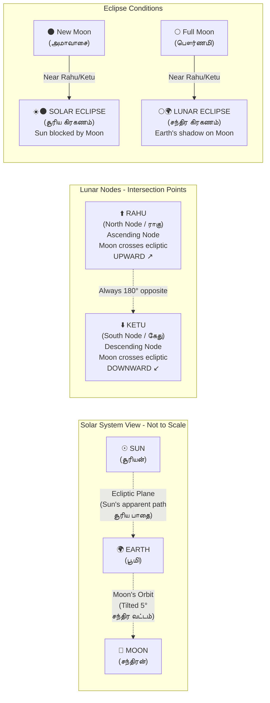
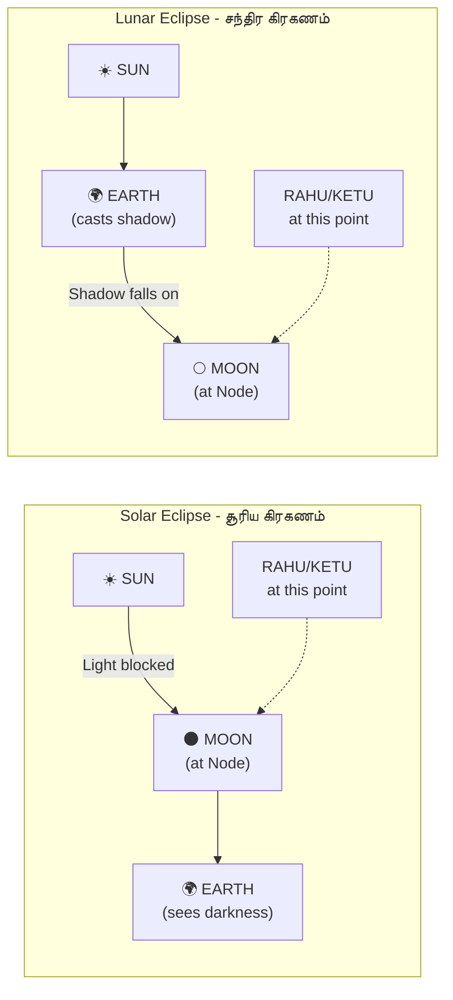

import Highlight from "@/react/Highlight/Highlight.jsx";

# Jathagam Guide - Part 2: 12 Rashis & 9 Planets
# ஜாதகம் வழிகாட்டி - பாகம் 2: 12 ராசிகள் & 9 கிரகங்கள்

Welcome to **Part 2** of the comprehensive **Jathagam (ஜாதகம்)** guide. In this part, we dive deep into the **12 Rashis (Zodiac Signs)** and **9 Navagrahas (Planets)** - the fundamental building blocks of Vedic Astrology.

:::note[Series Progress - தொடர் முன்னேற்றம்]
✅ **Part 1:** 27 Nakshatras with Animals, Yoni, Trees, Birds - COMPLETED   
📖 **Part 2 (This Article):** 12 Rashis (Zodiac Signs) & 9 Planets (Navagrahas)   
📝 **Part 3:** Dasha Systems - Vimshottari Dasha timing by age   
📝 **Part 4:** Doshas - Chevvai Dosham, 7½ Sani, Kaal Sarpa, remedies   
📝 **Part 5:** Yogas - Beneficial planetary combinations   
📝 **Part 6:** How to read and create a Jathagam
:::

:::tip[What You'll Learn - நீங்கள் கற்றுக்கொள்வது]
In this comprehensive guide, you'll master:

✅ All 12 Rashis with Tamil/Sanskrit names, symbols, and characteristics   
✅ Elemental nature (Fire, Earth, Air, Water) of each Rasi   
✅ 9 Navagrahas (planets) and their significations   
✅ Planetary friendships, enmities, and neutralities   
✅ Exaltation, debilitation, and Moolatrikona positions   
✅ How planets influence different life areas   
✅ Introduction to 12 Bhavas (Houses) system   
:::

---

## <Highlight color='#800031' highlight='fg' fontWeight='bold'> The 12 Rashis - 12 ராசிகள் </Highlight>

### <Highlight color='#004080' highlight='fg' fontWeight='bold'> What is a Rasi? </Highlight>

**Rasi (ராசி)** or **Rashi (राशि)** means "heap" or "collection" in Sanskrit - referring to a group of stars forming a constellation.

**In Vedic Astrology:**
- The zodiac (360°) is divided into **12 equal parts** of 30° each
- Each part is called a **Rasi** (Zodiac Sign)
- Your **Janma Rasi (ஜன்ம ராசி)** = Birth sign = Where Moon was at your birth
- Your **Lagna (லக்னம்)** = Ascendant = Rising sign on eastern horizon

**Why Moon Sign (Rasi) is Important:**
- In **Western astrology**: Sun sign is primary
- In **Vedic/Tamil astrology**: **Moon sign (Rasi)** is primary
- Moon changes signs every 2.5 days (Sun takes 1 month)
- Moon represents mind, emotions, and mental tendencies
- All Dasha calculations and most predictions are based on Moon's Rasi

---

### <Highlight color='#004080' highlight='fg' fontWeight='bold'> Quick Reference: 12 Rashis Overview </Highlight>

| # | Rasi Name | Tamil தமிழ் | Sanskrit संस्कृत | Zodiac Sign | Symbol குறியீடு | Element பூதம் | Quality குணம் | Ruling Planet அதிபதி கிரகம் |
|---|-----------|---------------|-------------------|-------------|------------------|---------------|--------------|------------------------|
| **1** | **Mesha** | மேஷம் | मेष | Aries | Ram ஆட்டுக்கடா | Fire அக்னி | Movable சர | Mars செவ்வாய் |
| **2** | **Vrishabha** | ரிஷபம் | वृषभ | Taurus | Bull காளை | Earth பூமி | Fixed ஸ்திர | Venus சுக்கிரன் |
| **3** | **Mithuna** | மிதுனம் | मिथुन | Gemini | Twins இரட்டையர் | Air வாயு | Dual துவித்வ | Mercury புதன் |
| **4** | **Karka** | கடகம் | कर्क | Cancer | Crab நண்டு | Water ஜலம் | Movable சர | Moon சந்திரன் |
| **5** | **Simha** | சிம்மம் | सिंह | Leo | Lion சிங்கம் | Fire அக்னி | Fixed ஸ்திர | Sun சூரியன் |
| **6** | **Kanya** | கன்னி | कन्या | Virgo | Virgin/Maiden கன்னிப்பெண் | Earth பூமி | Dual துவித்வ | Mercury புதன் |
| **7** | **Tula** | துலாம் | तुला | Libra | Balance/Scale தராசு | Air வாயு | Movable சர | Venus சுக்கிரன் |
| **8** | **Vrishchika** | விருச்சிகம் | वृश्चिक | Scorpio | Scorpion தேள் | Water ஜலம் | Fixed ஸ்திர | Mars செவ்வாய் |
| **9** | **Dhanus** | தனுசு | धनुष | Sagittarius | Bow/Archer வில் | Fire அக்னி | Dual துவித்வ | Jupiter குரு |
| **10** | **Makara** | மகரம் | मकर | Capricorn | Crocodile/Goat மகரம் | Earth பூமி | Movable சர | Saturn சனி |
| **11** | **Kumbha** | கும்பம் | कुंभ | Aquarius | Water Pot குடம் | Air வாயு | Fixed ஸ்திர | Saturn சனி |
| **12** | **Meena** | மீனம் | मीन | Pisces | Fish மீன் | Water ஜலம் | Dual துவித்வ | Jupiter குரு |

---

## <Highlight color='#800031' highlight='fg' fontWeight='bold'> Rasi Classifications - ராசி வகைப்பாடுகள் </Highlight>

### <Highlight color='#004080' highlight='fg' fontWeight='bold'> 1. By Element (Pancha Bhuta) - பஞ்ச பூதம் </Highlight>

The 12 Rashis are grouped into **4 elements** (Tatvas):

| Element | Tamil தமிழ் | Rashis | Characteristics |
|---------|---------------|--------|-----------------|
| **Fire (Agni)** अग्नि | அக்னி | Mesha, Simha, Dhanus மேஷம், சிம்மம், தனுசு | Active, passionate, energetic, leadership qualities, impulsive, ambitious |
| **Earth (Prithvi)** पृथ्वी | பூமி | Vrishabha, Kanya, Makara ரிஷபம், கன்னி, மகரம் | Practical, stable, materialistic, grounded, patient, reliable |
| **Air (Vayu)** वायु | வாயு | Mithuna, Tula, Kumbha மிதுனம், துலாம், கும்பம் | Intellectual, communicative, social, flexible, analytical |
| **Water (Jala)** जल | ஜலம் | Karka, Vrishchika, Meena கடகம், விருச்சிகம், மீனம் | Emotional, intuitive, sensitive, compassionate, imaginative |

**Compatibility by Element:**
- Fire + Fire = Too much heat, conflicts
- Fire + Air = Excellent - Air fans fire
- Fire + Water = Steam - can work with effort
- Fire + Earth = Difficult - earth smothers fire
- Earth + Earth = Stable but boring
- Earth + Water = Fertile combination
- Air + Air = Good intellectual connection
- Air + Water = Moderate compatibility
- Water + Water = Very emotional, can be overwhelming

---

### <Highlight color='#004080' highlight='fg' fontWeight='bold'> 2. By Quality (Guna) - குணம் </Highlight>

The 12 Rashis are divided into **3 qualities**:

| Quality | Tamil தமிழ் | Sanskrit | Rashis | Characteristics |
|---------|---------------|----------|--------|-----------------|
| **Movable (Cardinal)** चर | சர ராசி | Chara | Mesha, Karka, Tula, Makara மேஷம், கடகம், துலாம், மகரம் | Action-oriented, initiators, start projects, changeable, pioneering |
| **Fixed (Stable)** स्थिर | ஸ்திர ராசி | Sthira | Vrishabha, Simha, Vrishchika, Kumbha ரிஷபம், சிம்மம், விருச்சிகம், கும்பம் | Steady, persistent, stubborn, resistant to change, reliable, determined |
| **Dual (Mutable)** द्विस्वभाव | துவித்வ ராசி | Dvisvabhava | Mithuna, Kanya, Dhanus, Meena மிதுனம், கன்னி, தனுசு, மீனம் | Flexible, adaptable, dual nature, versatile, can see both sides |

**Quality Compatibility:**
- Movable + Fixed = Moderate - One initiates, other maintains
- Movable + Dual = Good - Both adapt
- Fixed + Fixed = Difficult - Both stubborn
- Fixed + Dual = Good - Balance of stability and flexibility
- Dual + Dual = Excellent - Both flexible

---

### <Highlight color='#004080' highlight='fg' fontWeight='bold'> 3. By Gender - பாலினம் </Highlight>

| Gender | Tamil | Rashis |
|--------|-------|--------|
| **Male (Masculine)** पुरुष | ஆண் ராசி | Mesha, Mithuna, Simha, Tula, Dhanus, Kumbha மேஷம், மிதுனம், சிம்மம், துலாம், தனுசு, கும்பம் |
| **Female (Feminine)** स्त्री | பெண் ராசி | Vrishabha, Karka, Kanya, Vrishchika, Makara, Meena ரிஷபம், கடகம், கன்னி, விருச்சிகம், மகரம், மீனம் |

**Note:** All Fire and Air signs are masculine (active, outgoing). All Earth and Water signs are feminine (receptive, introspective).

---

## <Highlight color='#800031' highlight='fg' fontWeight='bold'> Detailed Rasi Characteristics - விரிவான ராசி குணங்கள் </Highlight>

### <Highlight color='#004080' highlight='fg' fontWeight='bold'> 1. Mesha Rasi (Aries) - மேஷ ராசி </Highlight>

**மேஷம் - The Ram (ஆட்டுக்கடா)**

| Attribute | Details |
|-----------|---------|
| **Symbol** | Ram (ஆட்டுக்கடா) |
| **Element** | Fire (அக்னி) |
| **Quality** | Movable/Cardinal (சர) |
| **Ruling Planet** | Mars (செவ்வாய்) |
| **Exalted Planet** | Sun (சூரியன்) at 10° |
| **Debilitated Planet** | Saturn (சனி) at 20° |
| **Nakshatras** | Ashwini (all 4), Bharani (all 4), Krittika (pada 1) |
| **Body Parts** | Head, brain, face (தலை, மூளை, முகம்) |
| **Direction** | East (கிழக்கு) |
| **Nature** | Aggressive, pioneering, courageous |

**Personality Traits:**
- Natural leaders and pioneers
- Energetic, enthusiastic, and impulsive
- Quick to anger but also quick to forgive
- Competitive and ambitious
- Direct and honest in communication
- Impatient with delays
- Love challenges and new beginnings

**Career Inclinations:**
Military, police, sports, engineering, surgery, entrepreneurship

**Health Concerns:**
Headaches, accidents, fevers, eye problems

**Compatible Rashis:**
Leo (சிம்மம்), Sagittarius (தனுசு), Gemini (மிதுனம்), Aquarius (கும்பம்)

---

### <Highlight color='#004080' highlight='fg' fontWeight='bold'> 2. Vrishabha Rasi (Taurus) - ரிஷப ராசி </Highlight>

**ரிஷபம் - The Bull (காளை)**

| Attribute | Details |
|-----------|---------|
| **Symbol** | Bull (காளை) |
| **Element** | Earth (பூமி) |
| **Quality** | Fixed (ஸ்திர) |
| **Ruling Planet** | Venus (சுக்கிரன்) |
| **Exalted Planet** | Moon (சந்திரன்) at 3° |
| **Debilitated Planet** | None (Mars partially weak) |
| **Nakshatras** | Krittika (pada 2-4), Rohini (all 4), Mrigashira (pada 1-2) |
| **Body Parts** | Face, neck, throat, vocal cords (முகம், கழுத்து) |
| **Direction** | South (தெற்கு) |
| **Nature** | Stable, sensual, materialistic |

**Personality Traits:**
- Steady, reliable, and patient
- Love comfort, luxury, and beauty
- Possessive about relationships and belongings
- Stubborn and resistant to change
- Practical and grounded approach
- Good with finances and material resources
- Artistic and appreciate fine arts

**Career Inclinations:**
Banking, finance, agriculture, music, arts, jewelry, beauty industry

**Health Concerns:**
Throat infections, thyroid issues, neck pain, weight gain

**Compatible Rashis:**
Virgo (கன்னி), Capricorn (மகரம்), Cancer (கடகம்), Pisces (மீனம்)

---

### <Highlight color='#004080' highlight='fg' fontWeight='bold'> 3. Mithuna Rasi (Gemini) - மிதுன ராசி </Highlight>

**மிதுனம் - The Twins (இரட்டையர்)**

| Attribute | Details |
|-----------|---------|
| **Symbol** | Twins (இரட்டையர்) |
| **Element** | Air (வாயு) |
| **Quality** | Dual/Mutable (துவித்வ) |
| **Ruling Planet** | Mercury (புதன்) |
| **Exalted Planet** | None (Rahu does well) |
| **Debilitated Planet** | None |
| **Nakshatras** | Mrigashira (pada 3-4), Ardra (all 4), Punarvasu (pada 1-3) |
| **Body Parts** | Arms, shoulders, lungs (கைகள், தோள்கள், நுரையீரல்) |
| **Direction** | West (மேற்கு) |
| **Nature** | Intellectual, communicative, versatile |

**Personality Traits:**
- Excellent communicators and writers
- Curious, adaptable, and versatile
- Quick-witted and intelligent
- Dual nature - can see both sides
- Restless and need mental stimulation
- Social butterflies, love networking
- Can be superficial or inconsistent

**Career Inclinations:**
Journalism, writing, teaching, sales, marketing, media, communications

**Health Concerns:**
Respiratory issues, anxiety, nervous disorders, shoulder/arm problems

**Compatible Rashis:**
Libra (துலாம்), Aquarius (கும்பம்), Aries (மேஷம்), Leo (சிம்மம்)

---

### <Highlight color='#004080' highlight='fg' fontWeight='bold'> 4. Karka Rasi (Cancer) - கடக ராசி </Highlight>

**கடகம் - The Crab (நண்டு)**

| Attribute | Details |
|-----------|---------|
| **Symbol** | Crab (நண்டு) |
| **Element** | Water (ஜலம்) |
| **Quality** | Movable/Cardinal (சர) |
| **Ruling Planet** | Moon (சந்திரன்) |
| **Exalted Planet** | Jupiter (குரு) at 5° |
| **Debilitated Planet** | Mars (செவ்வாய்) at 28° |
| **Nakshatras** | Punarvasu (pada 4), Pushya (all 4), Ashlesha (all 4) |
| **Body Parts** | Chest, breasts, stomach (மார்பு, வயிறு) |
| **Direction** | North (வடக்கு) |
| **Nature** | Emotional, nurturing, protective |

**Personality Traits:**
- Highly emotional and sensitive
- Nurturing and caring like a mother
- Strong attachment to home and family
- Moody and changeable (like the Moon)
- Intuitive and psychic abilities
- Protective shell (like crab)
- Good memory, especially for emotions

**Career Inclinations:**
Hospitality, cooking, nursing, childcare, real estate, psychology

**Health Concerns:**
Digestive issues, emotional disorders, breast-related issues, water retention

**Compatible Rashis:**
Scorpio (விருச்சிகம்), Pisces (மீனம்), Taurus (ரிஷபம்), Virgo (கன்னி)

---

### <Highlight color='#004080' highlight='fg' fontWeight='bold'> 5. Simha Rasi (Leo) - சிம்ம ராசி </Highlight>

**சிம்மம் - The Lion (சிங்கம்)**

| Attribute | Details |
|-----------|---------|
| **Symbol** | Lion (சிங்கம்) |
| **Element** | Fire (அக்னி) |
| **Quality** | Fixed (ஸ்திர) |
| **Ruling Planet** | Sun (சூரியன்) |
| **Exalted Planet** | None (Pluto in modern astrology) |
| **Debilitated Planet** | None |
| **Nakshatras** | Magha (all 4), Purva Phalguni (all 4), Uttara Phalguni (pada 1) |
| **Body Parts** | Heart, upper back, spine (இதயம், முதுகு) |
| **Direction** | East (கிழக்கு) |
| **Nature** | Regal, dignified, authoritative |

**Personality Traits:**
- Natural leaders with commanding presence
- Proud, dignified, and self-confident
- Generous and warm-hearted
- Love attention and recognition
- Creative and dramatic
- Loyal but demanding respect
- Can be arrogant or dominating

**Career Inclinations:**
Politics, management, entertainment, government positions, luxury brands

**Health Concerns:**
Heart problems, back pain, blood pressure, fever

**Compatible Rashis:**
Aries (மேஷம்), Sagittarius (தனுசு), Gemini (மிதுனம்), Libra (துலாம்)

---

### <Highlight color='#004080' highlight='fg' fontWeight='bold'> 6. Kanya Rasi (Virgo) - கன்னி ராசி </Highlight>

**கன்னி - The Virgin/Maiden (கன்னிப்பெண்)**

| Attribute | Details |
|-----------|---------|
| **Symbol** | Virgin/Maiden (கன்னிப்பெண்) |
| **Element** | Earth (பூமி) |
| **Quality** | Dual/Mutable (துவித்வ) |
| **Ruling Planet** | Mercury (புதன்) |
| **Exalted Planet** | Mercury (புதன்) at 15° |
| **Debilitated Planet** | Venus (சுக்கிரன்) at 27° |
| **Nakshatras** | Uttara Phalguni (pada 2-4), Hasta (all 4), Chitra (pada 1-2) |
| **Body Parts** | Intestines, digestive system (குடல்) |
| **Direction** | South (தெற்கு) |
| **Nature** | Analytical, perfectionist, service-oriented |

**Personality Traits:**
- Detail-oriented and analytical
- Perfectionist tendencies
- Practical and methodical approach
- Service-oriented and helpful
- Critical of self and others
- Health-conscious and hygiene-focused
- Modest and humble

**Career Inclinations:**
Healthcare, analysis, accounting, editing, research, nutrition, administration

**Health Concerns:**
Digestive disorders, intestinal issues, anxiety, nervous tension

**Compatible Rashis:**
Taurus (ரிஷபம்), Capricorn (மகரம்), Cancer (கடகம்), Scorpio (விருச்சிகம்)

---

### <Highlight color='#004080' highlight='fg' fontWeight='bold'> 7. Tula Rasi (Libra) - துலாம் ராசி </Highlight>

**துலாம் - The Balance/Scales (தராசு)**

| Attribute | Details |
|-----------|---------|
| **Symbol** | Balance/Scales (தராசு) |
| **Element** | Air (வாயு) |
| **Quality** | Movable/Cardinal (சர) |
| **Ruling Planet** | Venus (சுக்கிரன்) |
| **Exalted Planet** | Saturn (சனி) at 20° |
| **Debilitated Planet** | Sun (சூரியன்) at 10° |
| **Nakshatras** | Chitra (pada 3-4), Swati (all 4), Vishakha (pada 1-3) |
| **Body Parts** | Kidneys, lower back, skin (சிறுநீரகம்) |
| **Direction** | West (மேற்கு) |
| **Nature** | Balanced, diplomatic, harmonious |

**Personality Traits:**
- Diplomatic and fair-minded
- Love harmony and balance
- Social, charming, and graceful
- Artistic and appreciate beauty
- Indecisive (weighing both sides)
- Partnership-oriented
- Avoid confrontation

**Career Inclinations:**
Law, diplomacy, arts, design, counseling, public relations, fashion

**Health Concerns:**
Kidney problems, lower back pain, skin issues, diabetes

**Compatible Rashis:**
Gemini (மிதுனம்), Aquarius (கும்பம்), Leo (சிம்மம்), Sagittarius (தனுசு)

---

### <Highlight color='#004080' highlight='fg' fontWeight='bold'> 8. Vrishchika Rasi (Scorpio) - விருச்சிக ராசி </Highlight>

**விருச்சிகம் - The Scorpion (தேள்)**

| Attribute | Details |
|-----------|---------|
| **Symbol** | Scorpion (தேள்) |
| **Element** | Water (ஜலம்) |
| **Quality** | Fixed (ஸ்திர) |
| **Ruling Planet** | Mars (செவ்வாய்) |
| **Exalted Planet** | None (Ketu does well) |
| **Debilitated Planet** | Moon (சந்திரன்) at 3° |
| **Nakshatras** | Vishakha (pada 4), Anuradha (all 4), Jyeshtha (all 4) |
| **Body Parts** | Reproductive organs, excretory system (இனப்பெருக்க உறுப்புகள்) |
| **Direction** | North (வடக்கு) |
| **Nature** | Intense, mysterious, transformative |

**Personality Traits:**
- Intense and passionate
- Mysterious and secretive
- Strong willpower and determination
- Transformative nature (death and rebirth)
- Excellent investigators and researchers
- Loyal but vengeful if betrayed
- Psychic and intuitive abilities

**Career Inclinations:**
Research, investigation, surgery, psychology, occult sciences, detective work

**Health Concerns:**
Reproductive issues, piles, urinary problems, hidden diseases

**Compatible Rashis:**
Cancer (கடகம்), Pisces (மீனம்), Virgo (கன்னி), Capricorn (மகரம்)

---

### <Highlight color='#004080' highlight='fg' fontWeight='bold'> 9. Dhanus Rasi (Sagittarius) - தனுசு ராசி </Highlight>

**தனுசு - The Archer/Bow (வில்)**

| Attribute | Details |
|-----------|---------|
| **Symbol** | Bow and Arrow (வில் மற்றும் அம்பு) |
| **Element** | Fire (அக்னி) |
| **Quality** | Dual/Mutable (துவித்வ) |
| **Ruling Planet** | Jupiter (குரு) |
| **Exalted Planet** | None (Ketu exalted here) |
| **Debilitated Planet** | None (Mercury weak) |
| **Nakshatras** | Moola (all 4), Purva Ashadha (all 4), Uttara Ashadha (pada 1) |
| **Body Parts** | Thighs, hips, liver (தொடைகள், இடுப்பு, கல்லீரல்) |
| **Direction** | East (கிழக்கு) |
| **Nature** | Philosophical, adventurous, optimistic |

**Personality Traits:**
- Optimistic and positive outlook
- Love freedom and adventure
- Philosophical and truth-seeking
- Honest and straightforward (sometimes blunt)
- Love travel and exploration
- Generous and jovial
- Can be restless or tactless

**Career Inclinations:**
Teaching, philosophy, religion, law, travel industry, higher education, publishing

**Health Concerns:**
Liver problems, hip/thigh injuries, sciatica, obesity

**Compatible Rashis:**
Aries (மேஷம்), Leo (சிம்மம்), Libra (துலாம்), Aquarius (கும்பம்)

---

### <Highlight color='#004080' highlight='fg' fontWeight='bold'> 10. Makara Rasi (Capricorn) - மகர ராசி </Highlight>

**மகரம் - The Crocodile/Sea-Goat (மகரம்)**

| Attribute | Details |
|-----------|---------|
| **Symbol** | Crocodile/Sea-Goat (மகரம்/கடல் ஆடு) |
| **Element** | Earth (பூமி) |
| **Quality** | Movable/Cardinal (சர) |
| **Ruling Planet** | Saturn (சனி) |
| **Exalted Planet** | Mars (செவ்வாய்) at 28° |
| **Debilitated Planet** | Jupiter (குரு) at 5° |
| **Nakshatras** | Uttara Ashadha (pada 2-4), Shravana (all 4), Dhanishtha (pada 1-2) |
| **Body Parts** | Knees, joints, bones (முழங்கால், மூட்டுகள், எலும்புகள்) |
| **Direction** | South (தெற்கு) |
| **Nature** | Ambitious, disciplined, practical |

**Personality Traits:**
- Ambitious and career-oriented
- Disciplined and hard-working
- Patient and persistent
- Conservative and traditional
- Responsible and dutiful
- Can be pessimistic or cold
- Respect for authority and hierarchy

**Career Inclinations:**
Management, government, construction, mining, traditional businesses, politics

**Health Concerns:**
Joint problems, arthritis, bone issues, depression, skin dryness

**Compatible Rashis:**
Taurus (ரிஷபம்), Virgo (கன்னி), Scorpio (விருச்சிகம்), Pisces (மீனம்)

---

### <Highlight color='#004080' highlight='fg' fontWeight='bold'> 11. Kumbha Rasi (Aquarius) - கும்ப ராசி </Highlight>

**கும்பம் - The Water Bearer/Pot (குடம்)**

| Attribute | Details |
|-----------|---------|
| **Symbol** | Water Pot (நீர் குடம்) |
| **Element** | Air (வாயு) |
| **Quality** | Fixed (ஸ்திர) |
| **Ruling Planet** | Saturn (சனி) |
| **Exalted Planet** | None (Rahu does well) |
| **Debilitated Planet** | None |
| **Nakshatras** | Dhanishtha (pada 3-4), Shatabhisha (all 4), Purva Bhadrapada (pada 1-3) |
| **Body Parts** | Ankles, calves, circulatory system (கணுக்கால், கால் பின்பகுதி) |
| **Direction** | West (மேற்கு) |
| **Nature** | Humanitarian, innovative, unconventional |

**Personality Traits:**
- Humanitarian and socially conscious
- Innovative and progressive thinkers
- Independent and unconventional
- Intellectual and scientific bent
- Friendly but emotionally detached
- Value freedom and individuality
- Can be unpredictable or rebellious

**Career Inclinations:**
Technology, social work, astrology, science, aviation, NGOs, research

**Health Concerns:**
Circulatory problems, ankle injuries, varicose veins, nervous system issues

**Compatible Rashis:**
Gemini (மிதுனம்), Libra (துலாம்), Aries (மேஷம்), Sagittarius (தனுசு)

---

### <Highlight color='#004080' highlight='fg' fontWeight='bold'> 12. Meena Rasi (Pisces) - மீன ராசி </Highlight>

**மீனம் - The Fish (மீன்)**

| Attribute | Details |
|-----------|---------|
| **Symbol** | Two Fish (இரண்டு மீன்கள்) |
| **Element** | Water (ஜலம்) |
| **Quality** | Dual/Mutable (துவித்வ) |
| **Ruling Planet** | Jupiter (குரு) |
| **Exalted Planet** | Venus (சுக்கிரன்) at 27° |
| **Debilitated Planet** | Mercury (புதன்) at 15° |
| **Nakshatras** | Purva Bhadrapada (pada 4), Uttara Bhadrapada (all 4), Revati (all 4) |
| **Body Parts** | Feet, lymphatic system (பாதங்கள்) |
| **Direction** | North (வடக்கு) |
| **Nature** | Spiritual, compassionate, imaginative |

**Personality Traits:**
- Highly spiritual and intuitive
- Compassionate and empathetic
- Artistic and creative imagination
- Dreamy and otherworldly
- Emotional and sensitive
- Self-sacrificing nature
- Can be escapist or unclear boundaries

**Career Inclinations:**
Spirituality, healing, arts, music, film, charity work, counseling

**Health Concerns:**
Foot problems, addiction issues, immune system weakness, lymphatic issues

**Compatible Rashis:**
Cancer (கடகம்), Scorpio (விருச்சிகம்), Taurus (ரிஷபம்), Capricorn (மகரம்)

---

## <Highlight color='#800031' highlight='fg' fontWeight='bold'> The 9 Navagrahas - 9 கிரகங்கள் </Highlight>

### <Highlight color='#004080' highlight='fg' fontWeight='bold'> What are Navagrahas? </Highlight>

**Navagraha (நவக்கிரகம்)** = Nava (9) + Graha (Planet/Celestial body)

In Vedic Astrology, there are **9 primary planets** (Grahas):
- **7 physical planets**: Sun, Moon, Mars, Mercury, Jupiter, Venus, Saturn
- **2 shadow planets**: Rahu (North Node), Ketu (South Node)

**Important Notes:**
- **Sun and Moon** are called "planets" in astrology (though astronomically they're not)
- **Uranus, Neptune, Pluto** are NOT used in traditional Vedic astrology
- **Rahu and Ketu** are mathematical points (lunar nodes), not physical bodies
- Each planet rules **certain areas of life** (Karaka)

---

### <Highlight color='#004080' highlight='fg' fontWeight='bold'> Quick Reference: 9 Navagrahas Overview </Highlight>

| # | Planet | Tamil தமிழ் | Sanskrit संस्कृत | Day நாள் | Gender பாலினம் | Element பூதம் | Metal உலோகம் | Gemstone ரத்தினம் | Color நிறம் |
|---|--------|---------------|-------------------|-----------|------------------|---------------|-------------|------------------|------------|
| **1** | **Sun** | சூரியன் | सूर्य (Surya) | Sunday ஞாயிறு | Male ஆண் | Fire அக்னி | Copper/Gold தாமிரம்/தங்கம் | Ruby மாணிக்கம் | Red சிவப்பு |
| **2** | **Moon** | சந்திரன் | चन्द्र (Chandra) | Monday திங்கள் | Female பெண் | Water ஜலம் | Silver வெள்ளி | Pearl முத்து | White வெள்ளை |
| **3** | **Mars** | செவ்வாய் | मङ्गल (Mangal) | Tuesday செவ்வாய் | Male ஆண் | Fire அக்னி | Copper தாமிரம் | Red Coral பவளம் | Red சிவப்பு |
| **4** | **Mercury** | புதன் | बुध (Budha) | Wednesday புதன் | Neutral நடுநிலை | Earth பூமி | Bronze வெண்கலம் | Emerald மரகதம் | Green பச்சை |
| **5** | **Jupiter** | குரு/வியாழன் | गुरु/बृहस्पति (Guru) | Thursday வியாழன் | Male ஆண் | Ether ஆகாயம் | Gold தங்கம் | Yellow Sapphire புஷ்பராகம் | Yellow மஞ்சள் |
| **6** | **Venus** | சுக்கிரன் | शुक्र (Shukra) | Friday வெள்ளி | Female பெண் | Water ஜலம் | Silver வெள்ளி | Diamond வைரம் | White வெள்ளை |
| **7** | **Saturn** | சனி | शनि (Shani) | Saturday சனி | Neutral நடுநிலை | Air வாயு | Iron இரும்பு | Blue Sapphire நீலம் | Blue/Black நீலம்/கருப்பு |
| **8** | **Rahu** | ராகு | राहु (Rahu) | - | Female பெண் | Air வாயு | Lead ஈயம் | Hessonite கோமேதகம் | Smoky புகை நிறம் |
| **9** | **Ketu** | கேது | केतु (Ketu) | - | Neutral நடுநிலை | Fire அக்னி | Lead ஈயம் | Cat's Eye வைடூரியம் | Grey சாம்பல் |

---

## <Highlight color='#800031' highlight='fg' fontWeight='bold'> Understanding Rahu & Ketu - Lunar Nodes Explained (ராகு & கேது) </Highlight>

### <Highlight color='#004080' highlight='fg' fontWeight='bold'> What Are Rahu and Ketu? The Shadow Planets </Highlight>

**Rahu (ராகு/राहु)** and **Ketu (கேது/केतु)** are **NOT physical planets**. They are:

- **Mathematical points** in space
- **Lunar Nodes** - intersection points where Moon's orbit crosses the ecliptic (Sun's apparent path)
- Called **Shadow Planets** or **Chhaya Grahas (छाया ग्रह)**
- **Always exactly 180° apart** (opposite each other)
- Move **retrograde** (backwards) through the zodiac

**Key Fact:**
- **Rahu** = **North Lunar Node** (उत्तर पात/வட பாகு)
- **Ketu** = **South Lunar Node** (दक्षिण पात/தென் பாகு)
- They are the **head** and **tail** of the celestial serpent (see mythology below)

---

### <Highlight color='#004080' highlight='fg' fontWeight='bold'> The Astronomy of Lunar Nodes - How Eclipses Happen </Highlight>

**Understanding Orbital Mechanics:**

**Detailed Explanation:**

**1. Moon's Tilted Orbit:**
- Moon orbits Earth at a **5° tilt** to the ecliptic (Sun's path)
- Most months, Moon passes above or below the Sun/Earth's shadow
- **Only when Moon is near the nodes** can eclipses occur

**2. The Nodes:**
- **Rahu (North Node):** Point where Moon crosses ecliptic going **NORTH** (upward) ⬆️
- **Ketu (South Node):** Point where Moon crosses ecliptic going **SOUTH** (downward) ⬇️

**3. Eclipse Mechanics:**
- **Solar Eclipse:** New Moon + Sun near Rahu or Ketu = Moon blocks Sun
- **Lunar Eclipse:** Full Moon + Moon opposite Sun near nodes = Earth's shadow on Moon
- **Eclipses happen ~2 times per year** when Sun aligns with the nodes

**4. Retrograde Motion:**
- Nodes move **backwards** through the zodiac
- Complete one cycle through 12 signs in **~18.6 years**
- Currently (2026), Rahu in Pisces, Ketu in Virgo (approximately)

---

### <Highlight color='#004080' highlight='fg' fontWeight='bold'> Mythological Story: The Serpent's Head and Tail </Highlight>

**The Samudra Manthan (Churning of the Ocean) Legend:**

**The Story:**
1. **Devas (Gods) and Asuras (Demons)** churned the cosmic ocean for **Amrita (अमृत)** - nectar of immortality
2. When Amrita appeared, a demon named **Svarbhanu (स्वर्भानु)** disguised himself as a Deva
3. He sat between **Surya (Sun)** and **Chandra (Moon)** to drink the nectar
4. **Sun and Moon recognized him** and alerted Lord Vishnu
5. **Vishnu cut Svarbhanu in half** with his Sudarshana Chakra
6. But Svarbhanu had already drunk the nectar, so he became **immortal**
7. His **head** became **Rahu** (still hungry, angry, vengeful)
8. His **tail** became **Ketu** (the body without head, spiritual, detached)

**Eternal Enmity:**
- **Rahu and Ketu eternally chase Sun and Moon** (who exposed them)
- When they "catch" Sun/Moon → **Eclipses happen**
- **Rahu "swallows" Sun/Moon** during eclipse
- But being just a head, Sun/Moon emerge from his severed neck

**Symbolism:**
- **Rahu** = The hungry head → Desires, obsessions, material cravings, illusions
- **Ketu** = The detached body → Spirituality, moksha, past life karma, renunciation

---

### <Highlight color='#004080' highlight='fg' fontWeight='bold'> Visual Representation: Eclipse Geometry </Highlight>

**Why Eclipses Don't Happen Every Month:**
- New Moon happens **every 29.5 days**
- Full Moon happens **every 29.5 days**
- **BUT** Moon is only near Rahu/Ketu nodes **~2 times per year**
- Hence, eclipses are **rare events**

---

### <Highlight color='#004080' highlight='fg' fontWeight='bold'> Astrological Significance of Rahu & Ketu </Highlight>

**Rahu (ராகு) - The Dragon's Head:**

**Characteristics:**
- **Obsession, ambition, desires**
- Illusions, confusion, deception
- Foreign influences, foreign travel
- Technology, innovation, modernity
- Sudden gains or losses
- **Materialistic, worldly**
- Addictions, obsessions, fears

**Positive Effects:**
- Success in foreign lands
- Fame, power, political success
- Technological skills
- Out-of-the-box thinking
- Sudden wealth

**Negative Effects:**
- Mental confusion, anxiety
- Addictions, obsessions
- Illegal activities, scandals
- Fear, phobias
- Unexpected problems

**Exaltation:** Gemini/Taurus (various opinions)
**Debilitation:** Sagittarius/Scorpio (various opinions)
**Friendly:** Mercury, Saturn, Venus
**Enemies:** Sun, Moon, Mars

---

**Ketu (கேது) - The Dragon's Tail:**

**Characteristics:**
- **Spirituality, detachment, moksha**
- Past life karma, liberation
- Mysticism, occult knowledge
- Isolation, renunciation
- Sharp intelligence, intuition
- **Spiritual, otherworldly**
- Sudden events, unpredictability

**Positive Effects:**
- Spiritual enlightenment
- Moksha, liberation
- Psychic abilities, intuition
- Deep research abilities
- Healing powers
- Discrimination, discernment

**Negative Effects:**
- Confusion, lack of direction
- Accidents, sudden losses
- Isolation, loneliness
- Health issues (mysterious)
- Detachment from family
- Incomplete projects

**Exaltation:** Sagittarius/Scorpio (various opinions)
**Debilitation:** Gemini/Taurus (various opinions)
**Friendly:** Mercury, Saturn, Venus
**Enemies:** Sun, Moon, Mars

---

### <Highlight color='#004080' highlight='fg' fontWeight='bold'> Rahu-Ketu Transit Cycle </Highlight>

**Duration:**
- Rahu and Ketu spend **~18 months** in each sign
- Complete zodiac cycle: **~18.6 years**
- Always move **retrograde** (backwards)

**Current Transit (2024-2025 approximate):**
- **Rahu in Pisces (மீனம்)** - increased spirituality, foreign connections
- **Ketu in Virgo (கன்னி)** - focus on health, service, detachment from perfectionism

**Important Periods:**

| Period | Name | Duration | Significance |
|--------|------|----------|--------------|
| **Rahu Kalam** | ராகு காலம் | 90 min daily | Inauspicious time ruled by Rahu |
| **Ketu Kalam** | கேது காலம் | (less used) | Inauspicious time ruled by Ketu |
| **Eclipse** | கிரகணம் | 2-4 times/year | Very inauspicious, no auspicious work |
| **Rahu Dasha** | ராகு தசை | 18 years | Major life period ruled by Rahu |
| **Ketu Dasha** | கேது தசை | 7 years | Major life period ruled by Ketu |

---

### <Highlight color='#004080' highlight='fg' fontWeight='bold'> Rahu Kalam - Daily Timings (ராகு காலம்) </Highlight>

**Rahu Kalam** is a **90-minute inauspicious period** each day ruled by Rahu:

| Day | Tamil நாள் | Rahu Kalam Time (Approximate) | Avoid Activities |
|-----|-------------|--------------------------|------------------|
| **Monday** | திங்கள் | 7:30 AM - 9:00 AM | New ventures, travel |
| **Tuesday** | செவ்வாய் | 3:00 PM - 4:30 PM | Auspicious ceremonies |
| **Wednesday** | புதன் | 12:00 PM - 1:30 PM | Marriages, investments |
| **Thursday** | வியாழன் | 1:30 PM - 3:00 PM | Starting education |
| **Friday** | வெள்ளி | 10:30 AM - 12:00 PM | Court cases, agreements |
| **Saturday** | சனி | 9:00 AM - 10:30 AM | Purchases, journeys |
| **Sunday** | ஞாயிறு | 4:30 PM - 6:00 PM | Medical treatment |

**Note:** Times vary by location and season. Use Panchangam for exact timings.

---

### <Highlight color='#004080' highlight='fg' fontWeight='bold'> Remedies for Rahu and Ketu </Highlight>

**For Negative Rahu Effects:**
- Chant **"Om Rahave Namaha" (ॐ राहवे नमः)** 108 times
- Wear **Hessonite (Gomed/கோமேதகம்)** gemstone
- Donate black items on Saturdays
- Worship **Goddess Durga**
- Feed crows, help the needy
- Avoid alcohol and non-vegetarian food during Rahu Kalam

**For Negative Ketu Effects:**
- Chant **"Om Ketave Namaha" (ॐ केतवे नमः)** 108 times
- Wear **Cat's Eye (Vaidurya/வைடூரியம்)** gemstone
- Donate multicolored blankets
- Worship **Lord Ganesha**
- Practice meditation, spiritual studies
- Keep a dog, donate to animal shelters

**During Eclipses (கிரகண காலம்):**
- **No eating or drinking** during eclipse
- Take bath after eclipse ends
- Chant mantras, prayers
- Pregnant women should stay indoors
- Don't start any new work

---

### <Highlight color='#004080' highlight='fg' fontWeight='bold'> Kaal Sarpa Dosha - Rahu-Ketu Connection </Highlight>

When **all 7 planets are hemmed between Rahu and Ketu**, it creates **Kaal Sarpa Yoga (காலசர்ப்ப தோஷம்)**.

**Effects:**
- Life struggles, obstacles
- Delayed success
- Relationship issues
- Health problems
- Fear, nightmares

**Remedy:**
- Perform **Kaal Sarpa Dosha Puja**
- Worship at **Rahu-Ketu temples** (Thirunageswaram, etc.)
- Chant **Rahu-Ketu mantras**

*(Detailed explanation in Part 4B: Doshas article)*

---

### <Highlight color='#004080' highlight='fg' fontWeight='bold'> Planetary Ownership of Rashis - ராசி அதிபத்தியம் </Highlight>

Each planet **owns (rules)** certain Rashis:

| Planet கிரகம் | Owned Rashis சொந்த ராசிகள் | Notes |
|-----------------|--------------------------|-------|
| **Sun (சூரியன்)** | Leo (சிம்மம்) | Only 1 sign |
| **Moon (சந்திரன்)** | Cancer (கடகம்) | Only 1 sign |
| **Mars (செவ்வாய்)** | Aries (மேஷம்), Scorpio (விருச்சிகம்) | 2 signs |
| **Mercury (புதன்)** | Gemini (மிதுனம்), Virgo (கன்னி) | 2 signs |
| **Jupiter (குரு)** | Sagittarius (தனுசு), Pisces (மீனம்) | 2 signs |
| **Venus (சுக்கிரன்)** | Taurus (ரிஷபம்), Libra (துலாம்) | 2 signs |
| **Saturn (சனி)** | Capricorn (மகரம்), Aquarius (கும்பம்) | 2 signs |
| **Rahu (ராகு)** | Co-ruler of Aquarius (கும்பம்) | Modern attribution |
| **Ketu (கேது)** | Co-ruler of Scorpio (விருச்சிகம்) | Modern attribution |

**Concept of "Own House" (சொந்த வீடு):**
When a planet is in its own sign, it's comfortable and strong. Like being in your own home.

**Example:**
- Mars in Aries = Very strong (own house)
- Venus in Taurus = Very comfortable and strong
- Sun in Leo = Maximum power and authority

---

## <Highlight color='#800031' highlight='fg' fontWeight='bold'> Summary - Part 2A </Highlight>

### <Highlight color='#004080' highlight='fg' fontWeight='bold'> What We Covered </Highlight>

✅ **12 Rashis Complete:**
- All zodiac signs with Tamil/Sanskrit names
- Elements (Fire, Earth, Air, Water)
- Qualities (Movable, Fixed, Dual)
- Gender classification
- Detailed characteristics of each Rasi
- Body parts, directions, compatible signs

✅ **Introduction to 9 Navagrahas:**
- Quick reference table
- Days of week association
- Metals, gemstones, colors
- Rasi ownership by planets

---

### <Highlight color='#004080' highlight='fg' fontWeight='bold'> Coming in Part 2B (Continuation) </Highlight>

In the second half of Part 2, we'll cover:

📖 **Detailed Navagraha Characteristics:**
- Each planet's significations (Karaka)
- Personality when strong in chart
- Areas of life governed

📖 **Planetary States:**
- Exaltation (உச்சம்) - Strongest position
- Debilitation (நீசம்) - Weakest position
- Moolatrikona (மூலத்திரிகோணம்) - Own throne
- Friend/Enemy/Neutral positions

📖 **Planetary Relationships:**
- Natural friendships
- Natural enmities
- Neutral planets
- Temporary friendships

📖 **12 Bhavas (Houses):**
- What each house represents
- Kendras, Trikonas, Dusthanas
- House significations

📖 **Introduction to Doshas:**
- Chevvai Dosham preview
- 7½ Sani overview

---

:::tip[Continue Reading! - தொடர்ந்து படியுங்கள்!]
This is Part 2A - First half completed!

**Next:** Part 2B will complete the planets section with detailed characteristics, planetary relationships, and house system.

**Full Series:**
- ✅ Part 1: 27 Nakshatras - COMPLETED
- 📖 Part 2A: 12 Rashis & Navagraha Intro - COMPLETED
- 📝 Part 2B: Navagraha Details & Houses - NEXT
- 📝 Part 3: Dasha Systems
- 📝 Part 4: Doshas
- 📝 Part 5: Yogas
- 📝 Part 6: How to Read Jathagam
:::

