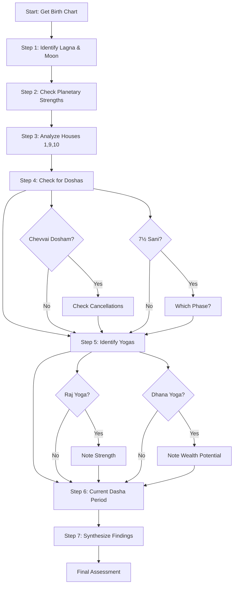
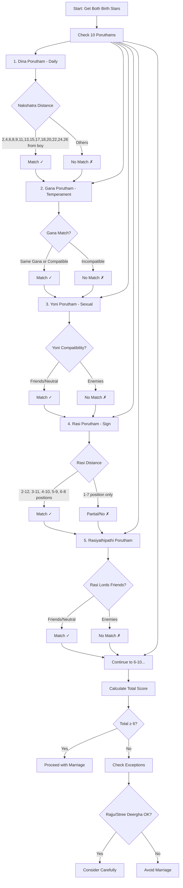

import Highlight from "@/react/Highlight/Highlight.jsx";

# Jathagam Guide - Part 6A: How to Read Jathagam
# ஜாதகம் வழிகாட்டி - பாகம் 6A: ஜாதகம் படிப்பது எப்படி

Welcome to **Part 6A** - where everything comes together! This is the **practical guide** that teaches you to actually **read and analyze** a Jathagam chart, plus complete **marriage compatibility (பொருத்தம்)** analysis.

:::note[Series Progress - தொடர் முன்னேற்றம்]
✅ **Part 1:** 27 Nakshatras - COMPLETED <br></br>
✅ **Part 2A:** 12 Rashis - COMPLETED <br></br>
✅ **Part 2B:** 9 Navagrahas & 12 Houses - COMPLETED <br></br>
✅ **Part 3:** Vimshottari Dasha System - COMPLETED <br></br>
✅ **Part 4A:** Chevvai Dosham & 7½ Sani - COMPLETED <br></br>
✅ **Part 4B:** Kaal Sarpa & Other Doshas - COMPLETED <br></br>
✅ **Part 5:** Yogas - COMPLETED <br></br>
📖 **Part 6A (This Article):** Chart Reading + Marriage Compatibility <br></br>
📝 **Part 6B:** Career, Timing, Muhurtham + Consulting Guide
:::

:::tip[What You'll Master - நீங்கள் கற்பவை]
This comprehensive guide teaches:

**Chart Reading:**
✅ Understanding the Jathagam chart layout <br></br>
✅ Step-by-step analysis method <br></br>
✅ Identifying strengths and weaknesses <br></br>
✅ Recognizing doshas and yogas <br></br>
✅ Sample chart analysis walkthrough

**Marriage Compatibility (பொருத்தம்):**
✅ Complete 10 Porutham system <br></br>
✅ Scoring and interpretation <br></br>
✅ When to proceed despite low score <br></br>
✅ Exceptions and cancellations <br></br>
✅ Modern vs traditional approach

**With Mermaid diagrams to visualize the process!**
:::

---

## <Highlight color='#800031' highlight='fg' fontWeight='bold'> Understanding the Jathagam Chart - ஜாதக அட்டவணை </Highlight>

### <Highlight color='#004080' highlight='fg' fontWeight='bold'> Tamil/South Indian Chart Format </Highlight>

**Two Main Chart Formats:**

1. **South Indian Chart (Tamil/Kerala style)** - Diamond/Square shape, **houses are fixed**
2. **North Indian Chart** - Square with houses that rotate

**We'll focus on South Indian style** (most common in Tamil Nadu, Kerala, Karnataka, Andhra).

**South Indian Chart Layout:**

```
┌─────────────┬─────────────┬─────────────┬─────────────┐
│             │             │             │             │
│    12       │      1      │      2      │      3      │
│   வியாயம்  │    லக்னம்  │    தனம்    │  சகோதரம் │
│             │             │             │             │
├─────────────┼─────────────┼─────────────┼─────────────┤
│             │             │             │             │
│    11       │                           │      4      │
│   லாபம்    │      RASI CHART           │    சுகம்     │
│             │     ராசி அட்டவணை      │             │
├─────────────┤                           ├─────────────┤
│             │                           │             │
│    10       │                           │      5      │
│கர்மஸ்தானம்│                           │  புத்திரம்    │
│             │                           │             │
├─────────────┼─────────────┼─────────────┼─────────────┤
│             │             │             │             │
│     9       │      8      │      7      │      6      │
│ பாக்கியம்   │   ஆயுள்    │ கலத்திரம்   │    ரிபு      │
│             │             │             │             │
└─────────────┴─────────────┴─────────────┴─────────────┘
```

**Key Points:**

✅ **Houses are FIXED positions** (don't rotate)
- House 1 (Lagna) is always top-center
- Houses proceed counter-clockwise
- Each box represents one house

✅ **Planets and signs rotate** based on birth time
- Lagna (Ascendant) sign goes in box #1
- Other signs follow in order
- Planets are placed in their respective sign boxes

---

### <Highlight color='#004080' highlight='fg' fontWeight='bold'> Sample Jathagam Chart Example </Highlight>

**Birth Details (Example):**
- **Date:** January 15, 1995
- **Time:** 10:30 AM
- **Place:** Chennai, Tamil Nadu
- **Lagna:** Pisces (மீனம்)
- **Moon:** Rohini Nakshatra in Taurus

**Rasi Chart:**

```
┌─────────────┬─────────────┬─────────────┬─────────────┐
│  Aquarius   │   PISCES    │    Aries    │   Taurus    │
│             │   (LAGNA)   │             │   Moon      │
│   Saturn    │   Jupiter   │             │   Venus     │
│             │   Mercury   │             │             │
├─────────────┼─────────────┼─────────────┼─────────────┤
│ Capricorn   │                           │   Gemini    │
│             │                           │             │
│             │                           │             │
│             │                           │             │
├─────────────┤                           ├─────────────┤
│ Sagittarius│                           │   Cancer    │
│             │                           │             │
│   Ketu      │                           │   Sun       │
│             │                           │             │
├─────────────┼─────────────┼─────────────┼─────────────┤
│  Scorpio    │    Libra    │    Virgo    │     Leo     │
│             │             │             │             │
│   Mars      │             │             │   Rahu      │
│             │             │             │             │
└─────────────┴─────────────┴─────────────┴─────────────┘

Houses: 1=Pisces, 2=Aries, 3=Taurus, 4=Gemini, 5=Cancer, 6=Leo,
        7=Virgo, 8=Libra, 9=Scorpio, 10=Sagittarius, 11=Capricorn, 12=Aquarius
```

**Planetary Positions:**
- Lagna: Pisces (1st house)
- Jupiter, Mercury: 1st house (Pisces)
- Moon, Venus: 3rd house (Taurus)
- Sun: 5th house (Cancer)
- Rahu: 6th house (Leo)
- Mars: 9th house (Scorpio)
- Ketu: 10th house (Sagittarius)
- Saturn: 12th house (Aquarius)

---

## <Highlight color='#800031' highlight='fg' fontWeight='bold'> Step-by-Step Chart Reading - படிப்படியாக பகுப்பாய்வு </Highlight>

### <Highlight color='#004080' highlight='fg' fontWeight='bold'> Complete Analysis Flowchart </Highlight>



---

### <Highlight color='#004080' highlight='fg' fontWeight='bold'> STEP 1: Identify Lagna and Moon </Highlight>

**Why Start Here?**
- **Lagna (Ascendant):** Your **body, personality, overall life path**
- **Moon (Chandra):** Your **mind, emotions, mental state**

**What to Note:**

**A. Lagna Analysis:**

<div class="table-luxury-grid">

| Aspect | What to Check | Significance |
|--------|--------------|--------------|
| **Lagna Sign** | Which Rasi in 1st house? | Basic personality traits |
| **Lagna Lord** | Which planet rules Lagna? | Primary life direction |
| **Lagna Lord Position** | Which house is Lagna lord in? | Where energy flows |
| **Planets in Lagna** | Any planets in 1st house? | Direct personality influence |
| **Aspects on Lagna** | Which planets aspect 1st? | External influences |

</div>

**Example from Sample Chart:**
- Lagna: **Pisces (மீனம்)** → Spiritual, dreamy, compassionate nature
- Lagna Lord: **Jupiter** (rules Pisces)
- Jupiter Position: **1st house itself** (in Pisces, own sign) → **VERY STRONG!**
- **Result:** Person has strong Jupiterian qualities - wisdom, ethics, teaching ability

**B. Moon Analysis:**

<div class="table-luxury-grid">

| Aspect | What to Check | Significance |
|--------|--------------|--------------|
| **Moon Sign (Rasi)** | Which Rasi has Moon? | Emotional nature |
| **Nakshatra** | Which Nakshatra? | Detailed personality, Dasha start |
| **Moon Strength** | Waxing/Waning? House? | Mental strength |
| **Planets with Moon** | Conjunction? | Emotional influences |

</div>

**Example from Sample Chart:**
- Moon Sign: **Taurus (ரிஷபம்)** → Stable emotions, materialistic, patient
- Nakshatra: **Rohini (ரோகிணி)** → Beautiful, artistic, sensual
- Moon in: **3rd house** → Courageous mind, communication skills
- With Venus: **Moon-Venus combo** → Artistic talents, pleasant nature

---

### <Highlight color='#004080' highlight='fg' fontWeight='bold'> STEP 2: Check Planetary Strengths </Highlight>

**Quick Strength Assessment:**

**A. Exaltation/Debilitation Check:**

<div class="table-luxury-grid">

| Planet | In Sample Chart | Sign | Status | Effect |
|--------|----------------|------|--------|--------|
| Sun | 5th house | Cancer | **Neutral** | Children, creativity average |
| Moon | 3rd house | Taurus | **Exalted!** | Strong mind, stable emotions |
| Mars | 9th house | Scorpio | **Own Sign** | Strong fortune, courage |
| Mercury | 1st house | Pisces | **Debilitated** | Weak communication, confused thinking |
| Jupiter | 1st house | Pisces | **Own Sign** | Very strong wisdom, ethics |
| Venus | 3rd house | Taurus | **Own Sign** | Strong comforts, arts |
| Saturn | 12th house | Aquarius | **Own Sign** | Strong spirituality, expenses |

</div>

**Analysis:**
- **3 planets in own signs** (Jupiter, Venus, Mars, Saturn) → Strong chart!
- **1 exalted** (Moon) → Blessed mental state
- **1 debilitated** (Mercury) → Needs remedy for communication

**B. Kendra/Trikona Placement:**

Planets in **Kendras (1,4,7,10)** or **Trikonas (1,5,9)** are strengthened.

**Sample Chart:**
- 1st (Kendra + Trikona): Jupiter, Mercury → Jupiter very powerful
- 5th (Trikona): Sun → Good for children
- 9th (Trikona): Mars → Excellent fortune

**Result:** Many planets in good houses → Blessed chart!

---

### <Highlight color='#004080' highlight='fg' fontWeight='bold'> STEP 3: Analyze Key Houses </Highlight>

**Priority Houses to Check:**

**House 1 (Lagna - Self):**
- Already analyzed above
- Jupiter in own sign → Strong personality

**House 9 (Fortune - பாக்கியம்):**
- Sign: Scorpio
- Planet: Mars (in own sign)
- 9th lord: Mars (strong)
- **Analysis:** Excellent fortune! Mars in own sign in trikona = prosperity, father's blessings

**House 10 (Career - கர்மம்):**
- Sign: Sagittarius
- Planet: Ketu
- 10th lord: Jupiter (in 1st house)
- **Analysis:** Mixed - Ketu in 10th can cause career confusion, but Jupiter as 10th lord in 1st is excellent (Dharma Karmadhipati Yoga!)

**House 7 (Marriage - கலத்திரம்):**
- Sign: Virgo
- No planets
- 7th lord: Mercury (debilitated in 1st)
- **Analysis:** Weak 7th lord = marriage delays or issues with spouse communication

**House 2 (Wealth - தனம்):**
- Sign: Aries
- No planets
- 2nd lord: Mars (in 9th, own sign)
- **Analysis:** Good wealth! 2nd lord strong in fortune house

**House 11 (Gains - லாபம்):**
- Sign: Capricorn
- No planets
- 11th lord: Saturn (in 12th, own sign)
- **Analysis:** Saturn (11th lord) in 12th = expenses, but in own sign = balanced, foreign gains

---

### <Highlight color='#004080' highlight='fg' fontWeight='bold'> STEP 4: Check for Doshas </Highlight>

**Dosha Checklist:**

**A. Chevvai Dosham Check:**
- Mars position from **Lagna:** 9th house ❌ (not in 1,2,4,7,8,12)
- Mars position from **Moon:** Mars in Scorpio, Moon in Taurus = Mars in 7th from Moon ✅
- **Result:** **Partial Chevvai Dosham** (from Moon only)
- **Remedy needed:** Yes, but mild (marrying someone with same dosha cancels it)

**B. Kaal Sarpa Check:**
- Draw Rahu-Ketu axis: Rahu in Leo (6th), Ketu in Sagittarius (10th)
- All planets between? Let's check:
  - Sun, Moon, Mars, Mercury, Jupiter, Venus, Saturn
  - Sun in Cancer (5th) ✅
  - Moon in Taurus (3rd) ✅
  - Mars in Scorpio (9th) ✅
  - Mercury in Pisces (1st) ✅
  - Jupiter in Pisces (1st) ✅
  - Venus in Taurus (3rd) ✅
  - Saturn in Aquarius (12th) ✅
- **All planets between Rahu (6th) and Ketu (10th) going counter-clockwise!**
- **Result:** **Partial Kaal Sarpa Dosha** (Mahapadma type - Rahu in 6th)

**C. 7½ Sani Check:**
- Moon in Taurus
- Saturn currently where? (Need current date transit - not birth chart)
- This is a **transit dosha**, check separately

**D. Pitru Dosha Check:**
- Sun with Rahu/Ketu? No
- Sun in 5th (Cancer) - own house, no affliction
- **No Pitru Dosha**

---

### <Highlight color='#004080' highlight='fg' fontWeight='bold'> STEP 5: Identify Yogas </Highlight>

**Yoga Checklist:**

**A. Raj Yoga Check:**

**Kendra-Trikona Combinations:**
- Lagna lord (Jupiter) in 1st house (Kendra + Trikona) ✅
- 9th lord (Mars) in 9th house (Trikona) ✅
- 5th lord (Moon) in 3rd house ❌
- 10th lord (Jupiter - same as Lagna lord) ✅

**Finding:** Jupiter is **both** 1st and 10th lord = **Dharma Karmadhipati Yoga!**

**Additional:** Jupiter in own sign in Lagna = **Hamsa Yoga** (Panch Mahapurusha)!

**B. Dhana Yoga Check:**
- 2nd lord: Mars
- 11th lord: Saturn
- Position: Mars in 9th, Saturn in 12th
- Not together, but 2nd lord in 9th = **Dhana Yoga** (wealth through fortune)

**C. Gajakesari Yoga Check:**
- Moon in Taurus (3rd house)
- Jupiter from Moon? Jupiter in Pisces, Moon in Taurus = 11th from Moon
- **No Gajakesari** (Jupiter not in Kendra from Moon)

**D. Other Yogas:**
- **Moon-Venus** conjunction in 3rd = Artistic talents, pleasant speech
- **Mars in own sign in 9th** = Fortune through courage, father's blessings
- **Venus in own sign** in 3rd = Communication through arts

---

### <Highlight color='#004080' highlight='fg' fontWeight='bold'> STEP 6: Current Dasha Period </Highlight>

**Birth Nakshatra:** Rohini (Moon Dasha)

**Dasha Sequence from Birth:**
1. **Moon Dasha balance:** ~8 years remaining (born in Moon Dasha)
2. **Mars Dasha:** Age 8-15 (7 years)
3. **Rahu Dasha:** Age 15-33 (18 years)
4. **Jupiter Dasha:** Age 33-49 (16 years)
5. **Saturn Dasha:** Age 49-68 (19 years)

**Current Age (2026):** 31 years old

**Current Dasha:** **Rahu Mahadasha** (in progress, year 16 of 18)

**Analysis:**
- Rahu in 6th house (enemies, diseases, debts)
- **Challenging period** - obstacles, health issues, enemies
- But Rahu in **Mahapadma Kaal Sarpa** type
- **Upcoming:** Jupiter Dasha at age 33 (2 years away) → **GOLDEN PERIOD!**
  - Jupiter is Lagna lord, own sign, Hamsa Yoga
  - Best 16 years of life ahead!

---

### <Highlight color='#004080' highlight='fg' fontWeight='bold'> STEP 7: Synthesize Findings </Highlight>

**Overall Chart Assessment:**

**Strengths (பலம்):**
- ✅ **Hamsa Yoga** - Great personality, wisdom, ethics
- ✅ **Dharma Karmadhipati Yoga** - Career + fortune combined
- ✅ **Moon exalted** - Strong mind, emotional stability
- ✅ **Mars in 9th in own sign** - Excellent fortune
- ✅ **Multiple planets in own signs** - Strong chart
- ✅ **Upcoming Jupiter Dasha** - Best years ahead

**Weaknesses (குறைகள்):**
- ❌ **Mercury debilitated** - Communication issues, indecisive
- ❌ **Partial Chevvai Dosham** - Marriage needs matching
- ❌ **Partial Kaal Sarpa** - Some obstacles, but manageable
- ❌ **Ketu in 10th** - Career confusion, frequent job changes
- ❌ **Current Rahu Dasha** - Challenging period until age 33

**Life Prediction:**
- **Personality:** Wise, ethical, spiritual, artistic, but confused communication
- **Career:** Teaching, spiritual work, counseling (Jupiter + Pisces influence), but job changes due to Ketu in 10th
- **Wealth:** Good through fortune (Mars in 9th), steady accumulation
- **Marriage:** Delays due to weak 7th lord and Chevvai Dosham, but will happen. Match with person having same dosha
- **Health:** Generally good, Moon strong. Watch Rahu in 6th - stomach issues possible
- **Best Period:** Age 33-49 (Jupiter Dasha) - peak success, wealth, recognition
- **Current Phase:** Struggling (Rahu), but breakthrough coming at 33!

**Remedies:**
- Mercury: Emerald/green clothes, Budha mantra, Wednesday fasting
- Rahu: Hessonite, Rahu remedies for 2 more years
- Chevvai: Match with partner having same dosha, or Kuja Shanti before marriage

---

## <Highlight color='#800031' highlight='fg' fontWeight='bold'> MARRIAGE COMPATIBILITY - திருமண பொருத்தம் </Highlight>

### <Highlight color='#004080' highlight='fg' fontWeight='bold'> Understanding Porutham System </Highlight>

**Porutham (பொருத்தம்)** = **Compatibility** in Tamil

**Why Marriage Matching is Important:**
- Marriage is **lifelong partnership**
- Compatibility ensures:
  - Harmony between husband-wife
  - Children's well-being
  - Family prosperity
  - Mutual respect and love
  - Longevity of both partners

**10 Poruthams System:**
Tamil astrology uses **10 different compatibility tests** based on the couple's birth Nakshatras (stars).

**Scoring:**
- Total possible: **10 Poruthams**
- Minimum acceptable: **6 Poruthams** (some say 5)
- Ideal: **8+ Poruthams**
- Perfect match (all 10): Rare!

---

### <Highlight color='#004080' highlight='fg' fontWeight='bold'> Why Should Male Have More Bhavas (Poruthams) Than Female? </Highlight>

In traditional Tamil/Vedic astrology, there's an important principle:

**"மணமகனுக்கு பாவம் அதிகம் இருக்க வேண்டும்"**
_"Manamaganukkku Baavam Adhigam Irukka Vendum"_
**"The groom should have more Bhavas (positive factors) than the bride"**

**Traditional Explanation:**

**1. Husband as Karaka (Significator):**
- In Vedic astrology, **husband is the Karaka (primary significator)** for wife's well-being
- Wife's chart derives **strength from husband's chart**
- A strong husband's chart provides:
  - Financial security → 2nd & 11th house strength
  - Family protection → 4th house strength
  - Children's welfare → 5th house strength
  - Long married life → 7th house strength

**2. Wife's Chart Reflects Husband:**
- **7th house in wife's chart** = Husband's overall strength
- If husband has:
  - More Bhavas → More positive factors → Stronger support for wife
  - Weaker chart → Wife may face struggles even with good Porutham

**3. Stree Deergha Porutham (Wife's Longevity):**
- This Porutham specifically checks:
  - **Boy's Nakshatra to Girl's Nakshatra distance**
  - Should be **13 or more positions** for wife's long life
  - If boy's Nakshatra is "stronger" (more advanced), it **protects** the girl

**4. Karmic Protection Theory:**
- Traditional belief: **Male's stronger karma** provides "umbrella protection" for family
- If male has more positive Bhavas:
  - Family faces fewer obstacles
  - Children have better upbringing
  - Wife enjoys better health and prosperity

---

**Modern Interpretation:**

**1. Balanced Strength, Not Dominance:**
- It's not about male "superiority"
- It's about **balanced strength** in the partnership
- Male having more Bhavas means:
  - He brings more **stability** to the union
  - Can **support** wife during her challenges
  - Acts as **protective force** during difficult times

**2. Practical Life Factors:**
- Traditionally, males were primary earners
- More Bhavas indicated:
  - Better career prospects (10th house)
  - Wealth generation ability (2nd, 11th house)
  - Leadership qualities (1st, 10th house)
- This ensured **family's financial stability**

**3. Complementary Strengths:**
- It doesn't mean female's chart should be weak
- **Both should have individual strength**
- But male having "more" Bhavas creates:
  - **Yang energy** (active, protective)
  - Balances **Yin energy** (receptive, nurturing) of female
  - Creates **harmonious equilibrium**

---

**What Does "More Bhavas" Mean Practically?**

**In Porutham Context:**
- If girl's Porutham score = 7/10
- Boy's Porutham score should be = 7/10 or higher (ideally 8/10)
- **NOT lower** than girl's score

**In Chart Strength:**
- Boy should have:
  - **Stronger Lagna** (ascendant)
  - **Better placed Jupiter** (wisdom, prosperity)
  - **Strong 7th house** (marriage house)
  - **Good 9th house** (fortune, dharma)
  - **Beneficial yogas** (Raj Yoga, Dhana Yoga)

**Example:**
- **Girl:** Rohini Nakshatra, moderate chart strength
- **Boy Option 1:** Weak Nakshatra, poor planetary positions → **Not recommended** (even if Porutham matches)
- **Boy Option 2:** Strong Nakshatra, good Jupiter, beneficial yogas → **Recommended** ✓

---

**What If Female Has Stronger Chart?**

**Modern Considerations:**

**1. Career-Oriented Women:**
- If woman is highly educated, career-focused
- Her strong chart indicates:
  - Independent earning capacity
  - Leadership abilities
  - Self-sufficiency
- This is **NOT negative**!

**2. Partnership Model:**
- In modern times, marriage is **equal partnership**
- Both should have **individual strength**
- What matters is:
  - **Mutual respect**
  - **Complementary skills**
  - **Supportive partnership**

**3. Adjusted Interpretation:**
- If female has stronger career indicators (10th, 11th house)
- Male should have:
  - **Emotional strength** (Moon well-placed)
  - **Supportive nature** (Venus, 7th house strong)
  - **Flexible mindset** (Mercury well-placed)
- This creates **modern balanced marriage**

**4. Check for Specific Factors:**
- Even if female chart is stronger overall:
  - Ensure **Rajju Porutham matches** (no death risk)
  - Ensure **Stree Deergha Porutham matches** (longevity)
  - Boy should NOT have **severe malefic doshas** (Kaal Sarpa, severe Chevvai)
  - Boy's **7th house** should be strong (good husband qualities)

---

**Traditional Concerns to Address:**

**1. "Stree Balam" (Wife's Overpowering Strength):**
- Traditional fear: **Too strong female chart** may "overpower" husband
- Believed to cause:
  - Husband's career struggles
  - Health issues for husband
  - Family disharmony

**Reality Check:**
- This is **outdated patriarchal thinking**
- A successful, strong woman does **NOT** harm her husband
- Modern astrology focuses on **complementary strengths**

**2. Remedies for "Strong Female Chart":**
- If traditional family is concerned:
  - Perform **joint pujas** for harmony
  - Wear **matching gemstones** (his: Ruby/Jupiter stone, hers: Pearl/Venus stone)
  - Ensure both charts have **good 7th house** (mutual respect)
  - Check **Upapada Lagna** (relationship karma) compatibility

---

**Final Recommendation:**

**Traditional Guideline:**
- Boy should have **equal or more** positive Bhavas/Poruthams than girl
- Ensures traditional "protection" dynamic

**Modern Approach:**
- **Both should have individually strong charts**
- Focus on **complementary strengths**, not competition
- Ensure **critical Poruthams match** (Rajju, Stree Deergha, Vedha)
- Check for **mutual respect indicators** in both charts:
  - Both have good **7th house**
  - Both have well-placed **Venus** (love, harmony)
  - **No severe doshas** in either chart

**Best Practice:**
1. Calculate **Porutham score** (aim for 6+/10)
2. Check **individual chart strength** of both
3. If girl has stronger chart:
   - Ensure boy has **no malefic doshas**
   - Boy should have **good 7th house** (supportive husband)
   - Both should have **spiritual compatibility** (9th house)
4. Consult experienced astrologer for nuanced reading

**Remember:**
- Astrology is **guidance**, not absolute
- **Mutual love, respect, and understanding** matter more than chart calculations
- Many successful marriages exist despite "unfavorable" astrological combinations
- Use astrology as **one factor**, not the only decision-maker

---

### <Highlight color='#004080' highlight='fg' fontWeight='bold'> Porutham Analysis Flowchart </Highlight>



---

### <Highlight color='#004080' highlight='fg' fontWeight='bold'> THE 10 PORUTHAMS IN DETAIL </Highlight>

#### **1. Dina Porutham (தின பொருத்தம்) - Daily/Health Compatibility**

**What it Checks:** Basic health, well-being, and day-to-day harmony

**How to Calculate:**
1. Count nakshatras from **boy's star to girl's star** (including boy's)
2. Divide by 9
3. Check remainder

**Matching Remainders:** 2, 4, 6, 8, or 0

**Non-Matching:** 1, 3, 5, 7

**Example:**
- Boy: Rohini (4th Nakshatra)
- Girl: Anuradha (17th Nakshatra)
- Distance: 17 - 4 + 1 = 14
- 14 ÷ 9 = Remainder **5**
- Result: **No Match ✗**

**Alternative Simple Method:**
Distance from boy to girl should be: 2, 4, 6, 8, 9, 11, 13, 15, 17, 18, 20, 22, 24, or 26

**Importance:** **Medium** - Affects daily health and routine harmony

---

#### **2. Gana Porutham (கண பொருத்தம்) - Temperament Compatibility**

**What it Checks:** Nature, behavior, temperament match

**Three Ganas (from Part 1: Nakshatras):**

<div class="table-luxury-grid">

| Gana | Nature | Nakshatras |
|------|--------|-----------|
| **Deva (தேவ)** | Divine, gentle, spiritual | Ashwini, Mrigashira, Punarvasu, Pushya, Hasta, Swati, Anuradha, Shravana, Revati |
| **Manushya (மனுஷ்ய)** | Human, balanced, social | Bharani, Rohini, Ardra, Purva Phalguni, Uttara Phalguni, Purva Ashadha, Uttara Ashadha, Purva Bhadrapada, Uttara Bhadrapada |
| **Rakshasa (ராக்ஷஸ)** | Demonic, aggressive, materialistic | Krittika, Ashlesha, Magha, Chitra, Vishakha, Jyeshtha, Moola, Dhanishtha, Shatabhisha |

</div>

**Compatibility Rules:**

<div class="table-luxury-grid">

| Boy's Gana | Girl's Gana | Result | Points |
|------------|-------------|--------|--------|
| Deva | Deva | Excellent | 6/6 |
| Deva | Manushya | Good | 6/6 |
| Deva | Rakshasa | **Bad** | 0/6 |
| Manushya | Deva | Good | 6/6 |
| Manushya | Manushya | Excellent | 6/6 |
| Manushya | Rakshasa | Average | 5/6 |
| Rakshasa | Deva | **Very Bad** | 0/6 |
| Rakshasa | Manushya | Good | 6/6 |
| Rakshasa | Rakshasa | Excellent | 6/6 |

</div>

**Key Rule:** **Rakshasa boy + Deva girl = VERY BAD** (aggressive man + gentle woman = abuse risk)

**Importance:** **High** - Affects temperament harmony

---

#### **3. Yoni Porutham (யோனி பொருத்தம்) - Sexual/Biological Compatibility**

**What it Checks:** Physical attraction, sexual compatibility, biological harmony

**14 Yonis (Animal Pairs) - from Part 1:**

<div class="table-luxury-grid">

| Yoni Animal | Nakshatras | Natural Relationship |
|-------------|-----------|---------------------|
| Horse (குதிரை) | Ashwini, Shatabhisha | Friends with Horse, enemies with Buffalo |
| Elephant (யானை) | Bharani, Revati | Enemies with Lion |
| Sheep (ஆடு) | Krittika, Pushya | Friends with Sheep, enemies with Monkey |
| Serpent (பாம்பு) | Rohini, Mrigashira | Enemies with Mongoose |
| Dog (நாய்) | Ardra, Moola | Friends with Dog, enemies with Deer |
| Cat (பூனை) | Punarvasu, Ashlesha | Enemies with Rat |
| Rat (எலி) | Magha, Purva Phalguni | Enemies with Cat |
| Cow (பசு) | Uttara Phalguni, Uttara Bhadrapada | Friends with Cow, enemies with Tiger |
| Buffalo (எருமை) | Hasta, Swati | Enemies with Horse |
| Tiger (புலி) | Chitra, Vishakha | Enemies with Cow |
| Deer (மான்) | Anuradha, Jyeshtha | Enemies with Dog |
| Monkey (குரங்கு) | Shravana, Purva Ashadha | Enemies with Sheep |
| Mongoose (கீரி) | Uttara Ashadha, Dhanishtha | Enemies with Serpent |
| Lion (சிங்கம்) | Purva Bhadrapada | Enemies with Elephant |

</div>

**Compatibility:**
- **Same Yoni:** Excellent (4/4 points)
- **Friendly Yoni:** Good (3/4 points)
- **Neutral Yoni:** Average (2/4 points)
- **Enemy Yoni:** Bad (0/4 points)

**Example:**
- Boy: Rohini (Serpent)
- Girl: Ardra (Dog)
- Relationship: Neutral
- Points: 2/4 → **Partial Match**

**Importance:** **High** - Affects physical and intimate compatibility

---

#### **4. Rasi Porutham (ராசி பொருத்தம்) - Zodiac Sign Compatibility**

**What it Checks:** Overall harmony based on Moon signs

**How to Calculate:**
Count the distance from **boy's Rasi to girl's Rasi**

**Matching Patterns:**

<div class="table-luxury-grid">

| Boy to Girl Distance | Combination | Result | Points |
|---------------------|-------------|--------|--------|
| 2-12 | 2nd-12th | Good | 7/7 |
| 3-11 | 3rd-11th | Good | 7/7 |
| 4-10 | 4th-10th | Good | 7/7 |
| 5-9 | 5th-9th | Good | 7/7 |
| 6-8 | 6th-8th | Average | 4/7 |
| 1-7 | Same or 7th | Bad | 0/7 |

</div>

**Special Cases:**
- **Same Rasi (1-1):** Bad generally, unless both in different Nakshatras and different padas
- **7th house (1-7):** Stree Deergha (explained later) - risky for wife's longevity

**Example:**
- Boy: Taurus (2nd Rasi)
- Girl: Scorpio (8th Rasi)
- Distance: 8 - 2 = 6th from boy, boy is 8th from girl (6-8 combination)
- Result: **Average Match** (4/7 points)

**Importance:** **Very High** - Fundamental compatibility

---

#### **5. Rasiyathipathi Porutham (ராசியதிபதி பொருத்தம்) - Rasi Lord Compatibility**

**What it Checks:** Relationship between lords of boy's and girl's Moon signs

**How to Calculate:**
1. Find boy's Rasi lord
2. Find girl's Rasi lord
3. Check their natural relationship (Friends/Neutral/Enemies)

**Planetary Relationships (from Part 2B):**

<div class="table-luxury-grid">

| Result | Points |
|--------|--------|
| Both lords are **same planet** | 5/5 |
| Both lords are **natural friends** | 5/5 |
| Both lords are **neutral** | 3/5 |
| Both lords are **enemies** | 0/5 |

</div>

**Example:**
- Boy: Taurus (Rasi lord = Venus)
- Girl: Libra (Rasi lord = Venus)
- Same lord → **Excellent Match** (5/5)

**Importance:** **Medium-High**

---

#### **6. Rajju Porutham (ரஜ்ஜு பொருத்தம்) - Longevity Compatibility**

**What it Checks:** Couple's longevity and death timing compatibility

**Most Important Porutham!** Failure here is considered very serious.

**5 Rajju Types:**

<div class="table-luxury-grid">

| Rajju Type | Body Part | Nakshatras | Represents |
|-----------|-----------|-----------|------------|
| **Paada (பாத)** | Feet | Ashwini, Ashlesha, Magha, Jyeshtha, Moola, Revati | Foundation |
| **Kati (கடி)** | Waist | Bharani, Pushya, Purva Phalguni, Anuradha, Purva Ashadha, Uttara Bhadrapada | Support |
| **Nabhi (நாபி)** | Navel | Krittika, Punarvasu, Uttara Phalguni, Vishakha, Uttara Ashadha, Purva Bhadrapada | Life force |
| **Kanta (கண்ட)** | Neck/Throat | Rohini, Ardra, Hasta, Swati, Shravana, Shatabhisha | Connection |
| **Siro (சிரோ)** | Head | Mrigashira, Chitra, Dhanishtha | Intellect |

</div>

**Compatibility Rule:**
- **Boy and Girl should have DIFFERENT Rajju types**
- **Same Rajju = Death/Separation risk** (very serious!)

**Exceptions:**
- If Rasi is same but Nakshatra different → May be okay
- If strong Rajju Dosha, perform **Rajju Dosha Nivaran Puja**

**Example:**
- Boy: Rohini (Kanta Rajju)
- Girl: Hasta (Kanta Rajju)
- **Same Rajju** → **FAILURE** ✗ → **Major concern!**

**Importance:** **MAXIMUM** - Most critical porutham!

---

#### **7. Vedha Porutham (வேத பொருத்தம்) - Affliction Check**

**What it Checks:** Whether stars mutually afflict each other

**Vedha Pairs (Nakshatras that afflict each other):**

<div class="table-luxury-grid">

| Star 1 | Vedha Star 2 |
|--------|--------------|
| Ashwini | Jyeshtha |
| Bharani | Anuradha |
| Krittika | Vishakha |
| Rohini | Swati |
| Ardra | Shravana |
| Punarvasu | Uttara Ashadha |
| Pushya | Purva Ashadha |
| Ashlesha | Moola |
| Magha | Revati |
| Purva Phalguni | Uttara Bhadrapada |
| Uttara Phalguni | Purva Bhadrapada |
| Hasta | Shatabhisha |
| Chitra | Dhanishtha |
| Mrigashira | (No vedha) |

</div>

**Rule:**
- If boy's and girl's stars are **Vedha pair** → No Match
- Otherwise → Match

**Example:**
- Boy: Rohini
- Girl: Swati
- These are **Vedha pair** → **No Match** ✗

**Importance:** **High** - Prevents mutual affliction

---

#### **8. Vashya Porutham (வஷ்ய பொருத்தம்) - Attraction/Control Compatibility**

**What it Checks:** Natural attraction and who controls whom in relationship

**Vashya Groups:**

<div class="table-luxury-grid">

| Vashya Type | Rasis |
|------------|-------|
| **Manava (Human)** | Gemini, Virgo, Libra, first half of Sagittarius, Aquarius |
| **Chatushpada (Quadruped)** | Aries, Taurus, second half of Sagittarius, first half of Capricorn |
| **Jalachara (Water)** | Cancer, Pisces, second half of Capricorn |
| **Keeta (Insect)** | Scorpio |
| **Vanachara (Wild)** | Leo |

</div>

**Compatibility:**
- Same Vashya type → Good
- Compatible types → Good
- Incompatible → Bad

**Importance:** **Medium** - Affects attraction and control dynamics

---

#### **9. Mahendra Porutham (மஹேந்திர பொருத்தம்) - Progeny & Prosperity**

**What it Checks:** Children's well-being, family prosperity

**How to Calculate:**
Girl's Nakshatra should be **4th, 7th, 10th, 13th, 16th, 19th, 22nd, or 25th** from boy's Nakshatra

**If yes:** Match ✓ (Children will be healthy, prosperous)  
**If no:** No Match ✗

**Importance:** **High** - For children and prosperity

---

#### **10. Stree Deergha Porutham (ஸ்த்ரீ தீர்க்க பொருத்தம்) - Woman's Longevity**

**What it Checks:** Wife's longevity and health

**How to Calculate:**
Girl's Nakshatra should be **more than 13 Nakshatras away** from boy's Nakshatra

**If yes:** Match ✓ (Wife will have long life)  
**If no:** No Match ✗ (Risk to wife's health/longevity)

**This is CRITICAL!** Failure here is very serious.

**Exception:**
If other poruthams are very strong and Rajju is different, may proceed with remedies.

**Importance:** **MAXIMUM** - Wife's longevity at stake!

---

### <Highlight color='#004080' highlight='fg' fontWeight='bold'> Porutham Scoring Example </Highlight>

**Sample Match:**
- **Boy:** Rohini Nakshatra (Taurus Rasi)
- **Girl:** Uttara Phalguni Nakshatra (Leo Rasi)

**Let's Calculate:**

<div class="table-luxury-grid">

| Porutham | Boy | Girl | Analysis | Match? | Points |
|----------|-----|------|----------|--------|--------|
| 1. Dina | Rohini (4) | U.Phalguni (12) | Distance: 9 → 9÷9=0 | ✓ | 1 |
| 2. Gana | Manushya | Manushya | Same | ✓ | 1 |
| 3. Yoni | Serpent | Cow | Neutral | ~ | 0.5 |
| 4. Rasi | Taurus (2) | Leo (5) | 4th position | ✓ | 1 |
| 5. Rasiyathipathi | Venus | Sun | Neutral | ~ | 0.5 |
| 6. **Rajju** | **Kanta** | **Kati** | **Different** | **✓** | **1** |
| 7. Vedha | Rohini | U.Phalguni | Not vedha pair | ✓ | 1 |
| 8. Vashya | Chatushpada | Vanachara | Different | ✗ | 0 |
| 9. Mahendra | 4→12 | 9 positions | Not 4,7,10,13... | ✗ | 0 |
| 10. **Stree Deergha** | 4→12 | **9 positions** | **Less than 13** | **✗** | **0** |

</div>

**Total Score: 6/10** → **Borderline acceptable**

**Critical Analysis:**
- **Rajju: Different** ✓ → Good (no death risk)
- **Stree Deergha: Failed** ✗ → Concern for wife's longevity
- **Overall:** 6/10 is minimum acceptable, but Stree Deergha failure is serious

**Recommendation:**
- Can proceed but with **caution**
- Perform **remedies** for Stree Deergha
- Ensure wife has strong chart (check separately)
- Consider consulting expert astrologer

---

### <Highlight color='#004080' highlight='fg' fontWeight='bold'> When to Proceed Despite Low Porutham </Highlight>

**Exceptions and Overrides:**

**1. Same Nakshatra Match (நட்சத்திர ஒற்றுமை):**
- If both have **same Nakshatra** but different padas → Many poruthams auto-match
- Generally considered very good

**2. Kuja Dosha Cancellation:**
- If **both** have Chevvai Dosham → Cancels the dosha
- Can overlook 1-2 missing poruthams

**3. Strong Individual Charts:**
- If both charts have **strong yogas** (Raj Yoga, Dhana Yoga)
- Success despite low porutham possible

**4. Lagna-Based Compatibility:**
- Some astrologers also check **Lagna (Ascendant) compatibility**
- If Lagnas are compatible → Can override nakshatra porutham

**5. Love Marriage (காதல் திருமணம்):**
- If couple is already in love and committed
- Minimum 5/10 poruthams acceptable
- But **Rajju and Stree Deergha must match!**

**6. Age Factor:**
- If marrying **after age 28** (Mars maturity)
- Some doshas reduce in strength

**7. Remedies Performed:**
- If elaborate **Porutham Dosha Nivaran Pujas** done
- Can proceed with 5-6/10 score

---

### <Highlight color='#004080' highlight='fg' fontWeight='bold'> Modern vs Traditional Approach </Highlight>

**Traditional (பாரம்பரியம்):**
- Strict adherence to all 10 poruthams
- Minimum 8/10 required
- Rajju and Stree Deergha are non-negotiable
- Family elders decide
- Arranged marriage based on horoscope first

**Modern (நவீனம்):**
- Minimum 5-6/10 acceptable
- Love marriages may proceed with lower score
- Emphasis on **individual chart strength**
- Rajju still important, but can be remedied
- Personal compatibility interviews also conducted
- Horoscope is one factor, not the only factor

**Balanced Approach (சமநிலை):**
- Use porutham as a **guideline**, not absolute rule
- **Must-haves:** Rajju different, Stree Deergha pass, minimum 5/10
- **Nice-to-haves:** 7-8/10 poruthams
- Consider **individual charts** (yogas, doshas)
- Meet the person, assess **actual compatibility**
- If genuinely in love and committed, can proceed with remedies
- Consult **expert astrologer** for final verdict

---

## <Highlight color='#800031' highlight='fg' fontWeight='bold'> Summary - Part 6A </Highlight>

### <Highlight color='#004080' highlight='fg' fontWeight='bold'> What We Covered </Highlight>

✅ **Chart Reading Process:**
- Understanding South Indian chart format
- 7-step systematic analysis method
- Sample chart walkthrough with interpretations
- Identifying strengths, weaknesses, doshas, yogas
- Current Dasha assessment
- Life predictions and remedies

✅ **Marriage Compatibility (10 Poruthams):**
- Complete porutham system explained
- Each of 10 poruthams in detail with examples
- Scoring and minimum requirements
- Critical poruthams: Rajju & Stree Deergha
- When to proceed despite low score
- Modern vs traditional approaches
- Exceptions and remedies

---

### <Highlight color='#004080' highlight='fg' fontWeight='bold'> Key Takeaways </Highlight>

🔑 **Chart Reading:** Follow systematic 7-step process for accurate analysis

🔑 **Lagna & Moon:** Foundation of any chart reading

🔑 **Strength Matters:** Exalted/own sign planets give best results

🔑 **Doshas & Yogas:** Check both - they coexist in most charts

🔑 **Dasha Timing:** Yoga gives results only in its planet's Dasha

🔑 **Marriage Porutham:** Minimum 6/10, but Rajju & Stree Deergha are critical

🔑 **Same Rajju:** Very serious - avoid or perform strong remedies

🔑 **Both with Chevvai Dosham:** Cancels the dosha - can proceed

🔑 **Love Marriage:** Can proceed with 5/10 if committed, but remedy doshas

🔑 **Consult Expert:** For important decisions, always seek qualified astrologer

---

:::tip[Coming Next! - அடுத்து வருவது!]
**Part 6B: Career, Timing, Muhurtham & Practical Guidance**

**Full Coverage of:**
- ✅ **Career Prediction** - Which field suits your chart?
- ✅ **Timing Life Events** - When to expect major milestones
- ✅ **Muhurtham Basics** - Choosing auspicious times
- ✅ **Transit Analysis** - Current planetary effects
- ✅ **How to Consult Astrologer** - What to ask, what to expect
- ✅ **DIY vs Professional** - When you can self-analyze vs when to seek expert
- ✅ **Remedies Guide** - Comprehensive remedy selection
- ✅ **Final Wisdom** - Ethics, limitations, and balanced approach

**The final practical guide to complete your Jathagam mastery!**
:::


**நன்றி! (Thank you!) May you find perfect compatibility!**

**உங்கள் ஜாதகம் அனைத்து நன்மைகளையும் தரட்டும்!**
