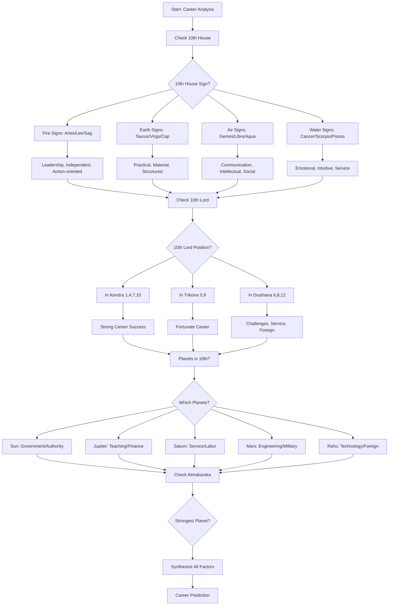
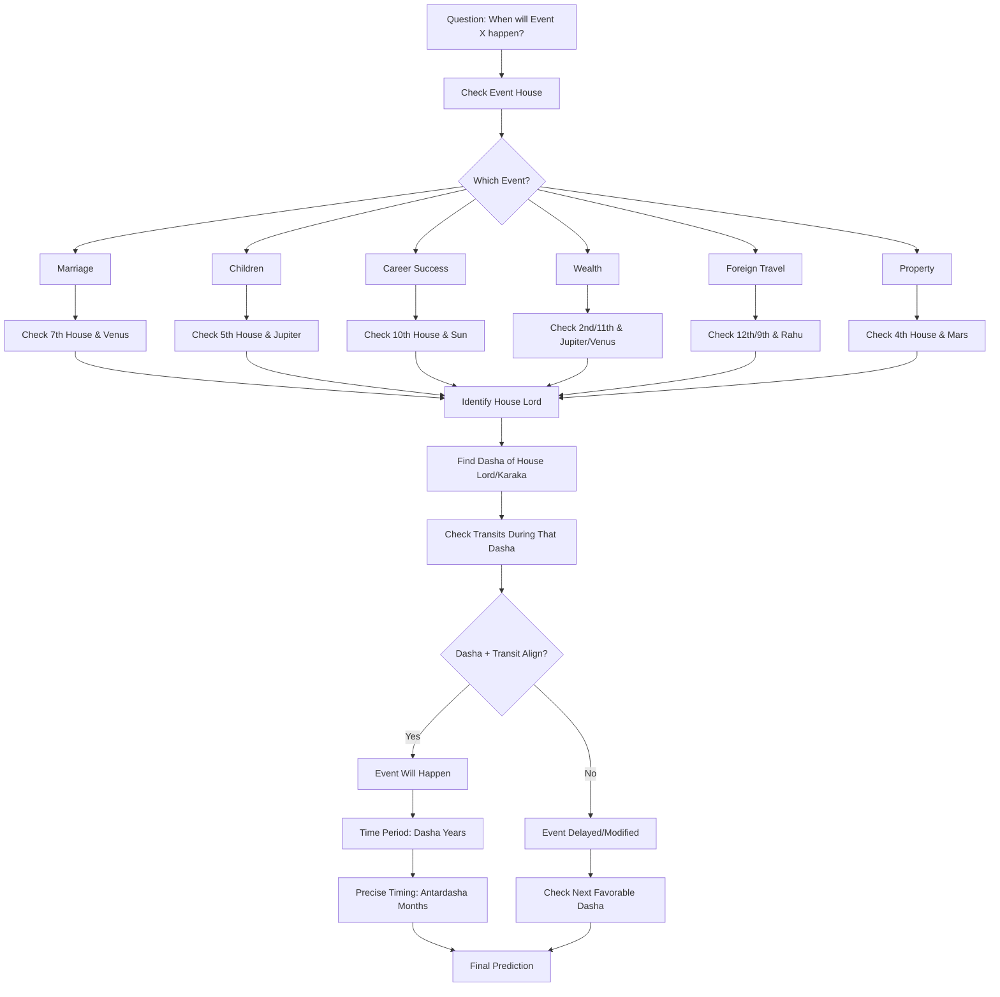
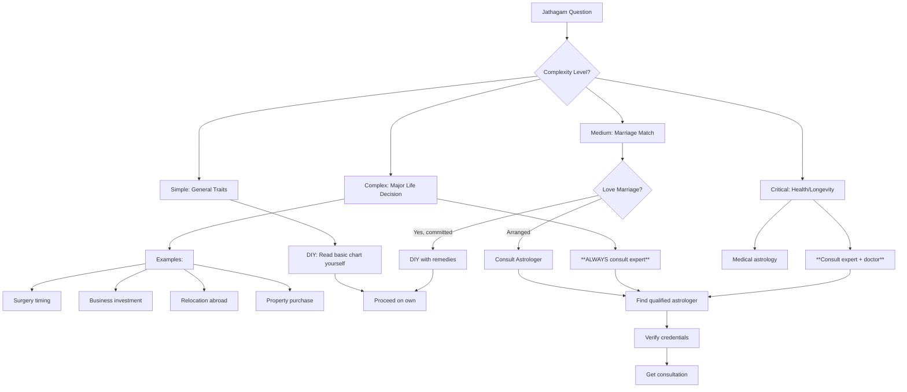
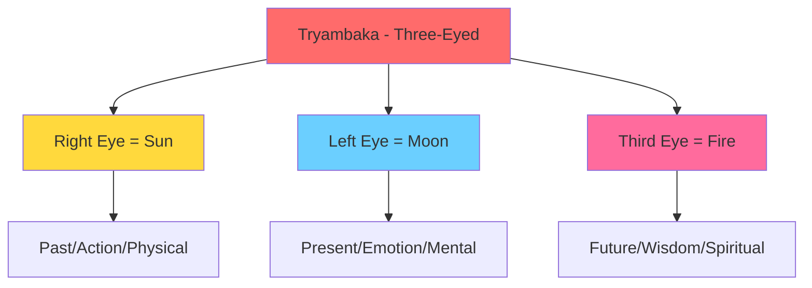

import Highlight from "@/react/Highlight/Highlight.jsx";
import Tabs, { TabItem } from "@/react/Tabs/Tabs.jsx";

# Jathagam Guide - Part 6B: Practical Astrology Guide
# ஜாதகம் வழிகாட்டி - பாகம் 6B: நடைமுறை வழிகாட்டி

Welcome to **Part 6B** - the **final and most practical** section! This guide covers career prediction, timing life events, Muhurtham selection, and wisdom for using astrology effectively in modern life.

:::note[Series Progress - FINAL PART! - தொடர் முடிவு!]
✅ **Part 1:** 27 Nakshatras - COMPLETED <br></br>
✅ **Part 2A:** 12 Rashis - COMPLETED <br></br>
✅ **Part 2B:** 9 Navagrahas & 12 Houses - COMPLETED <br></br>
✅ **Part 3:** Vimshottari Dasha System - COMPLETED <br></br>
✅ **Part 4A:** Chevvai Dosham & 7½ Sani - COMPLETED <br></br>
✅ **Part 4B:** Kaal Sarpa & Other Doshas - COMPLETED <br></br>
✅ **Part 5:** Yogas - COMPLETED <br></br>
✅ **Part 6A:** Chart Reading + Marriage Compatibility - COMPLETED <br></br>
📖 **Part 6B (This Article - FINAL):** Career, Timing, Muhurtham, Practical Wisdom <br></br>
🎁 **Part 7 (BONUS):** Divisional Charts Guide - Optional Advanced Learning
:::

:::tip[Series Completion! - தொடர் நிறைவு!]
**Congratulations!** After this part, you'll have:

✅ Complete understanding of **Vedic Astrology fundamentals** <br></br>
✅ Ability to **read basic Jathagam charts** <br></br>
✅ Knowledge of **doshas, yogas, compatibility** <br></br>
✅ Career and life event **prediction skills** <br></br>
✅ **Practical wisdom** for real-world application <br></br>
✅ **When to consult experts** vs DIY analysis

**You'll be an informed Jathagam reader!**
:::

---

## <Highlight color='#800031' highlight='fg' fontWeight='bold'> CAREER PREDICTION - தொழில் கணிப்பு </Highlight>

### <Highlight color='#004080' highlight='fg' fontWeight='bold'> Career Analysis Framework </Highlight>

**Key Houses for Career:**

<div class="table-luxury-grid">

| House | Signification | Career Aspect |
|-------|--------------|---------------|
| **10th** | Karma, profession, status | Primary career house - MOST IMPORTANT |
| **6th** | Service, daily work, competition | Job/service, work environment |
| **2nd** | Wealth, speech, family business | Income, family profession |
| **11th** | Gains, ambitions, networks | Income from career, professional goals |
| **1st** | Self, personality, capabilities | Personal abilities, overall direction |
| **9th** | Fortune, higher learning | Luck in career, higher education impact |

</div>

**Key Planets for Career:**

<div class="table-luxury-grid">

| Planet | Career Significations |
|--------|----------------------|
| **Sun (சூரியன்)** | Government, authority, administration, politics, leadership |
| **Moon (சந்திரன்)** | Public dealings, hospitality, food, travel, nursing, psychology |
| **Mars (செவ்வாய்)** | Engineering, military, police, surgery, real estate, sports |
| **Mercury (புதன்)** | Business, commerce, writing, teaching, accounting, IT |
| **Jupiter (குரு)** | Teaching, law, finance, counseling, religious work, philosophy |
| **Venus (சுக்கிரன்)** | Arts, entertainment, fashion, luxury goods, relationships, hospitality |
| **Saturn (சனி)** | Labor, mining, oil, iron, agriculture, service, judiciary (slow results) |
| **Rahu (ராகு)** | Technology, research, foreign, politics, unconventional fields |
| **Ketu (கேது)** | Spirituality, occult, research, computers, detached work |

</div>

---

### <Highlight color='#004080' highlight='fg' fontWeight='bold'> Career Prediction Method </Highlight>

**Step-by-Step Career Analysis:**



---

### <Highlight color='#004080' highlight='fg' fontWeight='bold'> Career by 10th House Sign </Highlight>

<div class="table-luxury-grid">

| 10th House Sign | Suitable Careers |
|----------------|------------------|
| **Aries (மேஷம்)** | Military, police, sports, surgery, independent business, leadership roles |
| **Taurus (ரிஷபம்)** | Banking, finance, luxury goods, agriculture, music, art dealing |
| **Gemini (மிதுனம்)** | Communication, media, writing, teaching, sales, IT, journalism |
| **Cancer (கடகம்)** | Hospitality, food industry, nursing, psychology, real estate, public work |
| **Leo (சிம்மம்)** | Politics, government, administration, entertainment, jewelry, authority positions |
| **Virgo (கன்னி)** | Healthcare, analysis, editing, accounting, service industry, details-oriented work |
| **Libra (துலாம்)** | Law, diplomacy, fashion, interior design, HR, partnerships, counseling |
| **Scorpio (விருச்சிகம்)** | Research, investigation, occult, surgery, psychology, insurance, mining |
| **Sagittarius (தனுசு)** | Teaching, philosophy, law, international business, travel, publishing |
| **Capricorn (மகரம்)** | Government, politics, construction, mining, organizational management |
| **Aquarius (கும்பம்)** | Technology, science, social work, astrology, unconventional fields, networks |
| **Pisces (மீனம்)** | Spirituality, hospitals, charity, arts, photography, film, healing |

</div>

---

### <Highlight color='#004080' highlight='fg' fontWeight='bold'> Career Timing - When Success Comes </Highlight>

**Best Career Dashas:**

**1. 10th Lord Dasha:**
- **Peak career period**
- Promotions, recognition, success
- Best time for job changes

**2. Sun Dasha (if well-placed):**
- Authority, government positions
- 6 years of leadership opportunities

**3. Jupiter Dasha:**
- Teaching, advisory roles
- Expansion in career
- Ethical success

**4. Saturn Dasha:**
- Hard work pays off
- Slow but steady rise
- Service-oriented success

**5. Lagna Lord Dasha:**
- Self-actualization in career
- Personal brand building

**Ages for Career Milestones:**

<div class="table-luxury-grid">

| Age | Career Phase | What to Expect |
|-----|--------------|----------------|
| **18-25** | Education, Training | Foundation building, internships |
| **25-28** | Entry Level | First job, learning phase |
| **28-35** | Growth Phase | Promotions, skill development, job changes |
| **35-42** | Peak Phase | Senior positions, leadership, maximum earnings |
| **42-50** | Consolidation | Authority, mentoring, business ownership |
| **50-60** | Mastery | Expert status, consulting, advisory roles |
| **60+** | Transition | Retirement, legacy, spiritual pursuits |

</div>

---

### <Highlight color='#004080' highlight='fg' fontWeight='bold'> Career Combinations (Yogas) </Highlight>

**Strong Career Yogas:**

**1. 10th Lord + Lagna Lord:**
- Self + Career aligned
- Best for entrepreneurs

**2. 10th Lord + 9th Lord (Dharma Karmadhipati):**
- Fortune + Career
- Government honors, fame

**3. Sun in 10th in Leo:**
- **Ruchaka Yoga**
- Authority, leadership

**4. Saturn in 10th in Capricorn/Aquarius:**
- **Sasa Yoga**
- Hard work pays off, discipline

**5. Jupiter in 10th:**
- Ethical career
- Teaching, counseling

**6. Multiple Planets in 10th:**
- Strong career focus
- Workaholics, but successful

**7. 10th Lord Exalted:**
- Peak career success
- Recognition, awards

---

### <Highlight color='#004080' highlight='fg' fontWeight='bold'> Career Challenges </Highlight>

**Indicators of Career Struggles:**

❌ **Ketu in 10th:**
- Frequent job changes
- Dissatisfaction with career
- Spiritual/unconventional work better

❌ **Rahu in 10th:**
- Unconventional career path
- Foreign companies/work
- Success through struggle

❌ **Saturn in 10th (if weak):**
- Delays, obstacles
- Hard work, slow success
- But longevity in career

❌ **10th Lord in 6th/8th/12th:**
- Service jobs (6th)
- Sudden changes, research (8th)
- Foreign, expenses (12th)

❌ **10th Lord Debilitated:**
- Initial struggles
- Needs Neecha Bhanga for success

**Remedies:**
- Strengthen 10th lord through gemstone/mantras
- Worship career deity (Sun, Jupiter, Saturn based on chart)
- Align career with natural talents (check Atmakaraka)

---

## <Highlight color='#800031' highlight='fg' fontWeight='bold'> TIMING LIFE EVENTS - வாழ்க்கை நிகழ்வுகள் கால அட்டவணை </Highlight>

### <Highlight color='#004080' highlight='fg' fontWeight='bold'> Event Timing Framework </Highlight>

**Timing Uses Three Factors:**

1. **Dasha-Bhukti** (Major-Minor periods from Part 3)
2. **Transits (Gochara)** - Current planetary positions
3. **Progressions** - Chart evolution over time

**Basic Principle:**
Event happens when **Dasha + Transit** both support it.

---

### <Highlight color='#004080' highlight='fg' fontWeight='bold'> Marriage Timing </Highlight>

**When Marriage Happens:**

**From Dasha:**
- **Venus Dasha/Antardasha** (Kalatra Karaka)
- **Jupiter Dasha** (especially for women - husband karaka)
- **7th Lord Dasha**
- **Moon Dasha** (emotions, partnerships)
- **Lagna Lord Dasha** (self-actualization through marriage)

**From Transit:**
- **Jupiter transiting 1st, 5th, 7th, or 11th** from Moon/Lagna
- **Venus transiting 1st or 7th**
- **Avoiding:** 8th house transits, Saturn on Venus

**Typical Ages for Marriage:**

<div class="table-luxury-grid">

| Scenario | Age Range | Why |
|----------|-----------|-----|
| **Early Marriage** | 18-23 | Venus Dasha early, strong 7th house |
| **Average Marriage** | 24-28 | Normal timing, most common |
| **Delayed Marriage** | 29-35 | Saturn influence, Chevvai Dosham, 7th lord weak |
| **Very Late Marriage** | 35+ | Strong career focus, spiritual charts, doshas |

</div>

**Delays Indicated By:**
- Saturn aspecting 7th or Venus
- Chevvai Dosham (see Part 4A)
- 7th lord in 6th/8th/12th
- Rahu-Ketu axis on 1-7
- Running Saturn/Ketu Dasha during marriage years

---

### <Highlight color='#004080' highlight='fg' fontWeight='bold'> Children Timing </Highlight>

**When Children Are Born:**

**From Dasha:**
- **Jupiter Dasha** (Putra Karaka - children significator)
- **5th Lord Dasha**
- **Moon Dasha** (motherhood)

**From Transit:**
- **Jupiter transiting 5th, 9th, or 1st** from Moon
- **Avoiding:** Saturn on 5th house or 5th lord

**Typical Ages for First Child:**

<div class="table-luxury-grid">

| Scenario | Age | Dasha Indication |
|----------|-----|------------------|
| **Early Parenthood** | 20-25 | Jupiter Dasha, strong 5th house |
| **Average** | 25-32 | Normal timing |
| **Delayed** | 32-38 | Saturn influence, Jupiter delayed |
| **IVF/Medical Help** | Any age | 5th lord in 6th/8th, weak Jupiter |

</div>

**No Children Indicated By:**
- 5th lord severely afflicted
- Ketu in 5th house
- Saturn-Mars in 5th
- Jupiter debilitated without cancellation
- Never running Jupiter or 5th lord Dasha

---

### <Highlight color='#004080' highlight='fg' fontWeight='bold'> Wealth Accumulation Timing </Highlight>

**Peak Wealth Periods:**

**Dasha:**
- **Venus Dasha** (20 years of prosperity)
- **Jupiter Dasha** (Dhana Karaka)
- **2nd/11th Lord Dasha**
- **Dhana Yoga planets' Dasha**

**Transit:**
- **Jupiter in 2nd, 11th** from Moon
- **Venus in 2nd, 9th, 11th**

**Wealth Milestones:**

<div class="table-luxury-grid">

| Age | Wealth Phase | What Happens |
|-----|--------------|--------------|
| **25-35** | Foundation | Savings start, first investments |
| **35-50** | Accumulation | Peak earning, wealth builds |
| **50-65** | Consolidation | Assets mature, passive income |
| **65+** | Distribution | Inheritance planning, charity |

</div>

---

### <Highlight color='#004080' highlight='fg' fontWeight='bold'> Life Event Timing Flowchart </Highlight>



---

## <Highlight color='#800031' highlight='fg' fontWeight='bold'> MUHURTHAM - முகூர்த்தம் (Auspicious Timing) </Highlight>

### <Highlight color='#004080' highlight='fg' fontWeight='bold'> What is Muhurtham? </Highlight>

**Muhurtham (मुहूर्त/முகூர்த்தம்)** = **Auspicious time** for starting important activities

**Principle:**
"Good beginnings ensure good results." Starting important work at astrologically favorable time increases success probability.

**When Muhurtham is Used:**

<div class="table-luxury-grid">

| Activity | Why Muhurtham Needed |
|----------|---------------------|
| **Marriage** | Ensure lifelong harmony, prosperity |
| **Housewarming (Griha Pravesh)** | Peace and prosperity in new home |
| **Business Opening** | Success and growth |
| **Starting Education** | Academic excellence |
| **Vehicle Purchase** | Safety and auspiciousness |
| **Surgery/Medical** | Successful recovery |
| **Journey** | Safe travel |
| **Name Ceremony (Namakarana)** | Child's fortune |

</div>

---

### <Highlight color='#004080' highlight='fg' fontWeight='bold'> Muhurtham Selection Basics </Highlight>

**Factors to Check:**

**1. Tithi (Lunar Day - திதி):**
- 15 tithis in waxing (Shukla Paksha - வளர்பிறை)
- 15 tithis in waning (Krishna Paksha - தேய்பிறை)

**Auspicious Tithis:**
- **Dvitiya (2):** Good for starting new things
- **Tritiya (3):** Success in ventures
- **Panchami (5):** Education, learning
- **Saptami (7):** Travel, movement
- **Dashami (10):** Victory, completion
- **Ekadashi (11):** Spiritual activities
- **Trayodashi (13):** Aggressive actions (battles)

**Avoid:**
- **Amavasya (New Moon):** Except for ancestral work
- **Chaturdashi (14):** Except for Shiva worship
- **Ashtami (8):** Generally inauspicious

---

**2. Nakshatra (Star - நட்சத்திரம்):**

**Good Nakshatras for Most Activities:**
- Ashwini (அசுவினி), Rohini (ரோகிணி), Mrigashira (மிருகசீரிடம்), Punarvasu (பூனர்பூசம்), Pushya (பூசம்), Hasta (அஸ்தம்), Chitra (சித்திரை), Swati (சுவாதி), Anuradha (அனுஷம்), Shravana (திருவோணம்), Uttara Phalguni (உத்திரம்), Uttara Ashadha (உத்திராடம்), Uttara Bhadrapada (உத்திரட்டாதி), Revati (ரேவதி)

**Avoid:**
- Bharani (பரணி), Ardra (திருவாதிரை), Ashlesha (ஆயில்யம்), Magha (மகம்), Moola (மூலம்), Jyeshtha (கேட்டை) (generally challenging)

**Best Muhurtham Stars (Most Auspicious):**
1. **Pushya (பூசம்)** - #1 for all activities
2. **Rohini (ரோகிணி)** - Material success
3. **Revati (ரேவதி)** - Completion, journeys
4. **Uttara Phalguni/Ashadha/Bhadrapada (உத்திரம்)** - All "Uttara" stars good

---

**3. Weekday (Day of Week - வாரம்):**

<div class="table-luxury-grid">

| Day | Ruler | Good For | Avoid For |
|-----|-------|----------|-----------|
| **Sunday** | Sun | Government work, authority | Marriage, partnerships |
| **Monday** | Moon | Domestic work, water-related | Property purchase |
| **Tuesday** | Mars | Surgery, war, property | Marriage, travel start |
| **Wednesday** | Mercury | Education, business, communication | All good |
| **Thursday** | Jupiter | Marriage, education, finance | Loans, debts |
| **Friday** | Venus | **Marriage, arts, luxury** - BEST | Surgery |
| **Saturday** | Saturn | Foundation laying, long-term | Marriage, joyful events |

</div>

---

**4. Yoga (Daily Yoga - யோகம்):**

யோகம் என்பது பஞ்சாங்கத்தின் மூன்றாவது அங்கம். **சூரியன் மற்றும் சந்திரனின் கூட்டு நிலையில்** கணிக்கப்படுகிறது.

**யோகம் கணிக்கும் முறை (Calculation):**

> **சூரியன் பாகை + சந்திரன் பாகை = யோக பாகை**
> யோக பாகையை **13°20' (800 நிமிடங்கள்)** ஆல் வகுக்க வரும் ஈவே யோக வரிசை எண்.

- 360° ÷ 27 = **13°20'** (ஒவ்வொரு யோகமும் 13°20' கொண்டது)
- உதாரணம்: சூரியன் 215° + சந்திரன் 160° = 375° → 375° ÷ 13.33° = **28.1** → 28 - 27 = **1வது யோகம் (விஷ்கம்பம்)**

**27 யோகங்கள் - முழு பட்டியல்:**

<div class="table-luxury-grid">

| எண் | யோகம் | தன்மை | அதிபதி | சிறப்பு பலன் |
|-----|-------|--------|--------|-------------|
| 1 | விஷ்கம்பம் | கஷ்டம் ❌ | சனி | தடைகள், சவால்கள் |
| 2 | ப்ரீத்தி | சுபம் ✅ | விஷ்ணு | அன்பு, மகிழ்ச்சி, நட்பு |
| 3 | ஆயுஷ்மான் | சுபம் ✅ | சந்திரன் | ஆரோக்கியம், நீண்ட ஆயுள் |
| 4 | சௌபாக்யம் | சுபம் ✅ | சூரியன் | செல்வம், அதிர்ஷ்டம் |
| 5 | சோபனம் | நடுத்தரம் 〰️ | இந்திரன் | அழகு, கவர்ச்சி |
| 6 | அதிகண்டம் | கஷ்டம் ❌ | சந்திரன் | கழுத்துக்கு கஷ்டம் |
| 7 | சுகர்மா | சுபம் ✅ | குரு | நல்ல கர்மா, நீதி |
| 8 | தீர்திதி | நடுத்தரம் 〰️ | யமன் | நிலையானது |
| 9 | சூலம் | கஷ்டம் ❌ | செவ்வாய் | முள் போன்ற கஷ்டம் |
| 10 | கண்டம் | கஷ்டம் ❌ | சனி | தடைகள் |
| 11 | வ்ருத்தி | சுபம் ✅ | புதன் | வளர்ச்சி, முன்னேற்றம் |
| 12 | த்ருவம் | சுபம் ✅ | அக்னி | நிலையான நன்மை |
| 13 | வ்யாகாதம் | கஷ்டம் ❌ | சூரியன் | தடை, போட்டி |
| 14 | அர்ஷணம் | சுபம் ✅ | சந்திரன் | ஞானம், தெய்வீகம் |
| 15 | ப்ரஹ்மம் | சுபம் ✅ | சந்திரன் | படைப்பு சக்தி |
| 16 | இந்திரம் | சுபம் ✅ | சூரியன் | அரச யோகம், வெற்றி |
| 17 | வைத்ருதி | கஷ்டம் ❌ | சனி | மிகவும் தவிர்க்கவும் |
| 18 | விஷ்கம்பம் | கஷ்டம் ❌ | — | — |
| 19 | முகலம் | நடுத்தரம் 〰️ | அக்னி | சாதாரணம் |
| 20 | சித்தம் | சுபம் ✅ | சந்திரன் | சாதனை, வெற்றி |
| 21 | சாத்யம் | சுபம் ✅ | சூரியன் | இலக்கு அடைவு |
| 22 | சுபம் | சுபம் ✅ | குரு | அனைத்து நன்மைகளும் |
| 23 | சுக்லம் | சுபம் ✅ | சுக்கிரன் | தூய்மை, செல்வம் |
| 24 | ப்ரம்மம் | சுபம் ✅ | புதன் | வேத ஞானம் |
| 25 | இந்திரம் | சுபம் ✅ | சந்திரன் | இந்திர அருள் |
| 26 | வைத்ருதி | கஷ்டம் ❌ | — | தவிர்க்கவும் |
| 27 | விஷ்கம்பம் | கஷ்டம் ❌ | — | தவிர்க்கவும் |

</div>

**சோபனம் vs ப்ரீத்தி யோகம் ஒப்பீடு:**

<div class="table-luxury-grid">

| விஷயம் | சோபனம் (5வது) | ப்ரீத்தி (2வது) |
|--------|--------------|----------------|
| அதிபதி | இந்திரன் | விஷ்ணு |
| தன்மை | நடுத்தரம் 〰️ | சுபம் ✅ |
| பலன் | அழகு, கவர்ச்சி | அன்பு, மகிழ்ச்சி |
| Muhurtham | கவனமாக பயன்படுத்தலாம் | சிறந்தது |

</div>

**மிகவும் சுபமான யோகங்கள் (Best for Muhurtham):**
- ✅ ப்ரீத்தி, ஆயுஷ்மான், சௌபாக்யம், சுகர்மா, வ்ருத்தி, சித்தம், சாத்யம், சுபம், சுக்லம்

**கட்டாயம் தவிர்க்க வேண்டிய யோகங்கள்:**
- ❌ வ்யாபாதம், வைத்ருதி — இவை மிகவும் அசுப யோகங்கள்

---

**தமிழ் பஞ்சாங்கத்தில் காணும் சிறப்பு யோகங்கள்: அமிர்த யோகம், சித்த யோகம், மரண யோகம்**

தமிழ் நாட்டு பஞ்சாங்கங்களில் (குறிப்பாக வக்ய பஞ்சாங்கம்) 27 யோகங்களோடு மேலும் மூன்று சிறப்பு யோக வகைகள் குறிக்கப்படுகின்றன. இவை **வாரம் + நட்சத்திரம்** சேர்க்கையிலிருந்து கணிக்கப்படும் — சூரியன்/சந்திரன் கணிப்பிலிருந்து அல்ல.

**அமிர்த யோகம் (Amirtha Yogam) 🌟:**

> வாரத்திற்கு உரிய நட்சத்திரத்துடன் அன்றைய நட்சத்திரம் சேரும்போது **அமிர்த யோகம்** உருவாகும்.

<div class="table-luxury-grid">

| வாரம் | அமிர்த யோக நட்சத்திரங்கள் |
|------|--------------------------|
| ஞாயிறு | கார்த்திகை, உத்திரம், உத்திராடம் |
| திங்கள் | ரோகிணி, திருவாதிரை, அஸ்தம் |
| செவ்வாய் | மிருகசீரிடம், சித்திரை, தனிஷ்டை |
| புதன் | அசுவினி, பூரம், உத்திரட்டாதி |
| வியாழன் | புனர்பூசம், விசாகம், பூரட்டாதி |
| வெள்ளி | பரணி, பூசம், பூராடம் |
| சனி | திருவோணம், ஆயில்யம், மகம் |

</div>

**பலன்:** அமிர்த யோகத்தில் செய்யும் காரியங்கள் **நிலையான வெற்றி** தரும். திருமணம், தொழில் தொடங்குதல், கிரக பிரவேசம் போன்றவற்றுக்கு மிகவும் சிறந்தது. ✅

---

**சித்த யோகம் (Siddha Yogam) ✨:**

> வாரத்திற்கு சாதகமான நட்சத்திரங்கள் வேறுபட்டு வரும் சேர்க்கை **சித்த யோகம்** ஆகும்.

<div class="table-luxury-grid">

| வாரம் | சித்த யோக நட்சத்திரங்கள் |
|------|-------------------------|
| ஞாயிறு | அஸ்தம், மிருகசீரிடம், அனுஷம் |
| திங்கள் | மிருகசீரிடம், ஆயில்யம், புனர்பூசம் |
| செவ்வாய் | அஸ்வினி, கார்த்திகை, அனுஷம் |
| புதன் | ரோகிணி, அனுஷம், ரேவதி |
| வியாழன் | அஸ்வினி, புஷ்யம், ரேவதி |
| வெள்ளி | அஸ்வினி, அஸ்தம், ரேவதி |
| சனி | ரோகிணி, சுவாதி, ரேவதி |

</div>

**பலன்:** சித்த யோகத்தில் தொடங்கும் காரியங்கள் **சீக்கிரம் நிறைவேறும்**. அமிர்த யோகத்திற்கு அடுத்தபடியாக சிறந்தது. ✅

---

**மரண யோகம் (Marana Yogam) ☠️:**

> வாரத்திற்கு எதிர்மறையான நட்சத்திர சேர்க்கை **மரண யோகம்** உருவாக்கும்.

<div class="table-luxury-grid">

| வாரம் | மரண யோக நட்சத்திரங்கள் |
|------|------------------------|
| ஞாயிறு | ஆயில்யம், ஜ்யேஷ்டா, ரேவதி |
| திங்கள் | மகம், பரணி, பூரட்டாதி |
| செவ்வாய் | கேட்டை, பூரம், பூரட்டாதி |
| புதன் | மூலம், கேட்டை, மகம் |
| வியாழன் | பரணி, மூலம், பூரம் |
| வெள்ளி | கேட்டை, ஆயில்யம், மகம் |
| சனி | பரணி, பூரம், விசாகம் |

</div>

**பலன்:** மரண யோகத்தில் **எந்த சுப காரியமும் தொடங்கக் கூடாது**. இந்த யோகத்தில் தொடங்கும் காரியங்கள் தோல்வியில் முடியும் அல்லது தடைகள் உண்டாகும். ❌

---

**ஒரே நாளில் இரண்டு யோகங்கள் சேர்ந்து வருவது:**

தமிழ் பஞ்சாங்கத்தில் அடிக்கடி **"அமிர்த சித்த யோகம்"** என்று குறிப்பிடப்படும் — இது ஒரே நாளில் இரண்டு யோகங்கள் சேரும்போது வரும்.

**எப்படி சேர்ந்து வரும்?**

யோகங்கள் **நட்சத்திரம் மாறும் நேரத்தை** பொருத்தே மாறும். ஒரு நாளில்:
- காலை: ஒரு நட்சத்திரம் → ஒரு யோகம்
- மாலை: நட்சத்திரம் மாறினால் → வேறு யோகம்

இதனால் ஒரே நாளில் இரண்டு வெவ்வேறு யோகங்கள் கணிக்கப்படும்.

<div class="table-luxury-grid">

| சேர்க்கை | தன்மை | பலன் |
|---------|--------|------|
| அமிர்த + சித்த யோகம் | மிகவும் சுபம் ✅✅ | அன்று தொடங்கும் காரியங்கள் மிகவும் சிறக்கும் |
| சித்த + மரண யோகம் | கலப்பு ⚠️ | சித்த யோக நேரத்தில் மட்டும் காரியம் செய்யவும் |
| அமிர்த + மரண யோகம் | கலப்பு ⚠️ | அமிர்த யோக நேரம் மட்டும் தேர்ந்தெடுக்கவும் |
| மரண + மரண யோகம் | மிகவும் அசுபம் ❌❌ | எந்த சுப காரியமும் வேண்டாம் |

</div>

**முக்கியக் குறிப்பு:**
> இரண்டு யோகங்கள் சேரும்போது **எந்த யோகம் அதிக நேரம் நீடிக்கிறதோ** அதுவே அன்றைய பலனை தீர்மானிக்கும். பஞ்சாங்கத்தில் ஒவ்வொரு யோகமும் எத்தனை மணி வரை என்று குறிப்பிட்டிருக்கும் — அதை பார்த்து காரியம் செய்யும் நேரத்தை தேர்ந்தெடுக்கவும்.

---

**5. Karana (Half-Tithi - கரணம்):**

கரணம் என்பது **திதியின் பாதி**. ஒவ்வொரு திதியும் 2 கரணங்களாக பிரிக்கப்படும். சந்திரன் **6° நகரும் நேரம்** = 1 கரணம்.

**கரணம் கணிக்கும் முறை (Calculation):**

> **சந்திரன் பாகை − சூரியன் பாகை = கரண பாகை**
> கரண பாகையை **6°** ஆல் வகுக்க கரண வரிசை எண் கிடைக்கும்.

மொத்தம் **11 கரணங்கள்** உள்ளன — 2 வகைகளாக பிரிக்கப்படும்:

**வகை 1: சர கரணங்கள் (7 எண்ணிக்கை - மாறி மாறி வரும்):**

<div class="table-luxury-grid">

| எண் | கரணம் | அதிபதி | தன்மை | சிறந்தது |
|-----|-------|--------|--------|---------|
| 1 | பவம் | அக்னி | சுபம் ✅ | திருமணம், பூஜை, பயணம் |
| 2 | பாலவம் | பிரம்மா | சுபம் ✅ | தொழில் தொடங்குதல் |
| 3 | கௌலவம் | பார்வதி | சுபம் ✅ | குடும்ப விஷயங்கள் |
| 4 | தைதிலம் | இந்திரன் | சுபம் ✅ | அரசு காரியங்கள் |
| 5 | கரஜம் | பிருஹஸ்பதி | சுபம் ✅ | கல்வி, ஞானம் |
| 6 | வணிஜம் | குபேரன் | சுபம் ✅ | வியாபாரம், வாணிகம் |
| 7 | விஷ்டி (பத்திரை) | யமன் | கஷ்டம் ❌ | எந்த நல்ல காரியமும் வேண்டாம் |

</div>

**வகை 2: நிலை கரணங்கள் (4 எண்ணிக்கை - குறிப்பிட்ட திதியில் மட்டும்):**

<div class="table-luxury-grid">

| கரணம் | திதி | அதிபதி | தன்மை |
|-------|------|--------|--------|
| சகுனி | கிருஷ்ண பக்ஷம் 14 - 2ம் பாதி | காளி | கஷ்டம் ⚠️ |
| சதுஷ்பாதம் | அமாவாசை - 1ம் பாதி | சிவன் | நடுத்தரம் |
| நாகவம் | அமாவாசை - 2ம் பாதி | சர்ப்பம் | கஷ்டம் ⚠️ |
| கிம்ஸ்துக்னம் | சுக்ல பக்ஷம் 1 - 1ம் பாதி | ருத்ரன் | நடுத்தரம் |

</div>

**சகுனி vs பவம் கரணம் ஒப்பீடு:**

<div class="table-luxury-grid">

| விஷயம் | சகுனி | பவம் |
|--------|-------|------|
| வகை | நிலை கரணம் | சர கரணம் |
| அதிபதி | காளி | அக்னி |
| தன்மை | கஷ்டம் ⚠️ | சுபம் ✅ |
| சிறந்தது | போட்டி, தர்க்கம் | திருமணம், பூஜை |
| Muhurtham | தவிர்க்கவும் | சிறந்தது |

</div>

**Muhurtham-க்கு சிறந்த கரணங்கள்:**
- ✅ பவம், பாலவம், கௌலவம், தைதிலம், கரஜம், வணிஜம்

**கட்டாயம் தவிர்க்க வேண்டியவை:**
- ❌ விஷ்டி (பத்திரை) — யாரும் இந்த கரணத்தில் நல்ல காரியம் தொடங்க வேண்டாம்
- ⚠️ சகுனி — திருமணம் போன்ற சுப காரியங்களுக்கு தவிர்க்கவும்

---

### <Highlight color='#004080' highlight='fg' fontWeight='bold'> Marriage Muhurtham Selection </Highlight>

**Most Important Factors for Marriage:**

✅ **Month:**
- **Best:** Magha, Phalguna, Vaishakha (Jan-May in most years)
- **Avoid:** Ashada, Shravana, Bhadrapada (monsoon - Jul-Sep)

✅ **Tithi:**
- **Best:** 2, 3, 5, 7, 10, 11, 13 of waxing moon
- **Avoid:** 4, 6, 8, 9, 14, Amavasya, Purnima

✅ **Nakshatra:**
- **Best:** Rohini (ரோகிணி), Mrigashira (மிருகசீரிடம்), Uttara Phalguni (உத்திரம்), Hasta (அஸ்தம்), Swati (சுவாதி), Anuradha (அனுஷம்), Uttara Ashadha (உத்திராடம்), Uttara Bhadrapada (உத்திரட்டாதி), Revati (ரேவதி)
- **Avoid:** Bharani (பரணி), Ardra (திருவாதிரை), Ashlesha (ஆயில்யம்), Magha (மகம்), Moola (மூலம்), Jyeshtha (கேட்டை)

✅ **Weekday:**
- **Best:** Wednesday, Thursday, Friday
- **Okay:** Sunday, Monday
- **Avoid:** Tuesday, Saturday

✅ **Lagna (Muhurtham Lagna):**
- Fixed signs (Taurus, Leo, Scorpio, Aquarius) for stable marriage
- Benefics (Jupiter, Venus, Mercury) in Kendras
- 7th house strong and unafflicted

**Special Considerations:**
- Bride's and Groom's **current Dasha** should be favorable
- Avoid marriage during **Rahu Kalam** time
- Check **Chandrashtama** (Moon in 8th from boy's or girl's Moon Rasi) - avoid

---

### <Highlight color='#004080' highlight='fg' fontWeight='bold'> Daily Muhurtham - Rahu Kalam & Yama Gandam </Highlight>

**Every day has inauspicious periods to avoid:**

**Rahu Kalam (ராகு காலம்):**
- 90-minute period ruled by Rahu
- **Avoid starting** any auspicious activity

**Daily Rahu Kalam Timing:**

<div class="table-luxury-grid">

| Day | Rahu Kalam Timing (Approx.) |
|-----|---------------------------|
| **Monday** | 7:30-9:00 AM |
| **Tuesday** | 3:00-4:30 PM |
| **Wednesday** | 12:00-1:30 PM |
| **Thursday** | 1:30-3:00 PM |
| **Friday** | 10:30-12:00 PM |
| **Saturday** | 9:00-10:30 AM |
| **Sunday** | 4:30-6:00 PM |

</div>

**Yama Gandam (எமகண்டம்):**
- Another inauspicious period
- Avoid starting new work

**Gulikai Kalam:**
- Saturn's period
- Avoid for auspicious work

**Note:** These timings vary by location and season. Check local Panchangam (almanac).

---

## <Highlight color='#800031' highlight='fg' fontWeight='bold'> TRANSIT ANALYSIS - கோச்சார பலன்கள் </Highlight>

### <Highlight color='#004080' highlight='fg' fontWeight='bold'> Understanding Transits (Gochara) </Highlight>

**Transit (गोचर/கோச்சார)** = Current position of planets in the sky affecting your birth chart

**Why Transits Matter:**
- Birth chart = **Potential**
- Dasha = **Activation period**
- Transit = **Triggering mechanism**

**Formula:** Birth Chart + Dasha + Transit = **Actual Event**

---

### <Highlight color='#004080' highlight='fg' fontWeight='bold'> Major Transit Effects </Highlight>

**Jupiter Transit (குரு பெயர்ச்சி):**
- Duration: **1 year** per sign
- **Most auspicious** transit

**Good When Jupiter Transits:**
- **2nd house from Moon:** Wealth increase
- **5th house:** Children, education
- **7th house:** Marriage (for unmarried)
- **9th house:** Fortune, father's blessings
- **11th house:** Gains, income

**Bad When Jupiter Transits:**
- **6th house:** Debts, enemies (but ultimately victory)
- **8th house:** Obstacles, sudden events
- **12th house:** Expenses, losses

---

**Saturn Transit (சனி பெயர்ச்சி):**
- Duration: **2.5 years** per sign
- **Most feared** transit

**7½ Sani (covered in Part 4A):**
- Saturn transiting 12th, 1st, 2nd from Moon
- 7.5 years of challenges

**Good When Saturn Transits:**
- **3rd, 6th, 11th from Moon:** Upachaya houses - growth through effort

**Bad:**
- **1st, 4th, 5th, 7th, 8th, 10th, 12th from Moon:** Challenges in those life areas

---

**Rahu-Ketu Transit:**
- Duration: **18 months** per sign
- Moves **retrograde** (backward)
- Brings sudden changes

**Effect depends on:**
- Which houses they transit
- Aspects they make
- If triggering Kaal Sarpa Dosha

---

### <Highlight color='#004080' highlight='fg' fontWeight='bold'> Current Transit Status (2026) </Highlight>

**As of January 2026:**

<div class="table-luxury-grid">

| Planet | Current Sign | Since | Next Change | Effect Duration |
|--------|-------------|-------|-------------|----------------|
| **Jupiter** | Taurus | May 2024 | May 2025 | ~1 year |
| **Saturn** | Pisces | Mar 2025 | Mar 2028 | 2.5 years |
| **Rahu** | Pisces | Oct 2023 | May 2025 | 18 months |
| **Ketu** | Virgo | Oct 2023 | May 2025 | 18 months |

</div>

*Note: Check current ephemeris for exact positions as dates shift*

**Impact on Your Chart:**
- Count from your **Moon sign** to see which house these planets are transiting
- Check if they're triggering your doshas or yogas

---

## <Highlight color='#800031' highlight='fg' fontWeight='bold'> கிரக பெயர்ச்சி - GRAHA PEYARCHI (Planetary Transitions) </Highlight>

### <Highlight color='#004080' highlight='fg' fontWeight='bold'> பெயர்ச்சி என்றால் என்ன? </Highlight>

**பெயர்ச்சி** = ஒரு கிரகம் ஒரு ராசியிலிருந்து அடுத்த ராசிக்கு நகர்வது.

> வானில் உள்ள அனைத்து கிரகங்களும் **இடைவிடாமல் நகர்ந்து கொண்டே இருக்கும்** — ஆனால் ஒவ்வொரு கிரகமும் **வெவ்வேறு வேகத்தில்** நகரும். எனவே ஒவ்வொரு கிரகமும் **வெவ்வேறு காலத்தில்** ஒரு ராசியை கடக்கும்.

---

### <Highlight color='#004080' highlight='fg' fontWeight='bold'> எந்த திசையில் கிரகங்கள் நகரும்? </Highlight>

**அனைத்து கிரகங்களும் ஒரே திசையில் நகரும்:**

> **மேஷம் → ரிஷபம் → மிதுனம் → கடகம் → சிம்மம் → கன்னி → துலாம் → விருச்சிகம் → தனுசு → மகரம் → கும்பம் → மீனம் → மேஷம்...**

இது **கடிகார திசையில் (Clockwise)** நகரும் — வானில் பார்க்கும்போது **கிழக்கிலிருந்து மேற்கு** நோக்கி நகர்வதாக தெரியும்.

```
மேஷம் ➡️ ரிஷபம் ➡️ மிதுனம் ➡️ கடகம் ➡️ சிம்மம் ➡️ கன்னி
  ⬆️                                                    ⬇️
மீனம்                                                 துலாம்
  ⬆️                                                    ⬇️
கும்பம் ⬅️ மகரம் ⬅️ தனுசு ⬅️ விருச்சிகம் ⬅️ துலாம்
```

**எல்லா கிரகங்களும் இந்த வரிசையில் நகருமா?**

ஆம் — **சாதாரண நேரத்தில்** எல்லா கிரகங்களும் இந்த வரிசையிலேயே நகரும். ஆனால் சில நேரங்களில் **வக்கிரம் (Retrograde)** என்று அழைக்கப்படும் **பின்னோக்கி நகர்வும்** நடக்கும் — அது தனி விஷயம்.

---

### <Highlight color='#004080' highlight='fg' fontWeight='bold'> ஒவ்வொரு கிரகமும் ஒரு ராசியில் எத்தனை நாள் தங்கும்? </Highlight>

<div class="table-luxury-grid">

| கிரகம் | ஒரு ராசியில் தங்கும் காலம் | 12 ராசி முழுக்க சுற்ற | சிறப்பு குறிப்பு |
|--------|--------------------------|----------------------|----------------|
| **சந்திரன் (Moon)** | ~2.25 நாட்கள் | ~27.3 நாட்கள் | மிக வேகமான கிரகம் |
| **சூரியன் (Sun)** | ~30 நாட்கள் (1 மாதம்) | ~365 நாட்கள் (1 வருடம்) | ஒவ்வொரு மாதமும் மாறும் |
| **புதன் (Mercury)** | ~14-30 நாட்கள் | ~88 நாட்கள் | சூரியனுக்கு அருகில் சுற்றும் |
| **சுக்கிரன் (Venus)** | ~23 நாட்கள் – 2 மாதம் | ~225 நாட்கள் | வக்கிரத்தால் மாறும் |
| **செவ்வாய் (Mars)** | ~45 நாட்கள் – 7 மாதம் | ~687 நாட்கள் (~2 வருடம்) | வக்கிரத்தால் நீண்டு தங்கும் |
| **குரு (Jupiter)** | **~1 வருடம்** | **~12 வருடங்கள்** | ஆண்டுதோறும் பெயர்ச்சி |
| **சனி (Saturn)** | **~2.5 வருடங்கள்** | **~29.5 வருடங்கள்** | மிக முக்கியமான பெயர்ச்சி |
| **ராகு (Rahu)** | **~18 மாதங்கள்** | **~18 வருடங்கள்** | எப்போதும் வக்கிரமாக நகரும் |
| **கேது (Ketu)** | **~18 மாதங்கள்** | **~18 வருடங்கள்** | ராகுவிற்கு எதிர் ராசியில் இருக்கும் |

</div>

**முக்கிய உண்மை:**
> ஒவ்வொரு கிரகமும் **வெவ்வேறு வேகத்தில்** நகர்வதால், ஒவ்வொரு நாளும் ஜாதகம் வேறுவேறாக இருக்கும். இதனால்தான் ஒரே நாளில் பிறந்தவர்களுக்கும் கூட **பிறந்த நேரத்தை** வைத்து வேறுபட்ட ஜாதகம் வரும்.

---

### <Highlight color='#004080' highlight='fg' fontWeight='bold'> குரு பெயர்ச்சி (Jupiter Transit) - விரிவான விளக்கம் </Highlight>

குரு சூரியனை சுற்றி வர **11.86 வருடங்கள்** எடுக்கும். 12 ராசிகளை கடக்க வேண்டியதால், ஒவ்வொரு ராசியிலும் **சுமார் 1 வருடம்** தங்கும்.

**குரு பெயர்ச்சி 2024–2030 அட்டவணை:**

<div class="table-luxury-grid">

| குரு ராசி | தொடக்கம் | முடிவு | சிறப்பு |
|----------|---------|-------|---------|
| ரிஷபம் | மே 2024 | மே 2025 | — |
| மிதுனம் | மே 2025 | மே 2026 | தற்போது இங்கே |
| கடகம் | மே 2026 | மே 2027 | உச்சம் 🌟 |
| சிம்மம் | மே 2027 | மே 2028 | — |
| கன்னி | மே 2028 | மே 2029 | — |
| துலாம் | மே 2029 | மே 2030 | — |

</div>

**குரு எந்த வீட்டில் — என்ன பலன்:**

<div class="table-luxury-grid">

| குரு எந்த வீட்டில் (சந்திர ராசியிலிருந்து) | பலன் |
|------------------------------------------|------|
| 1வது | உடல் ஆரோக்கியம், புதிய தொடக்கம் |
| 2வது | செல்வம், குடும்ப வளம் ✅ |
| 3வது | சகோதரர், பயணம், தைரியம் |
| 4வது | வீடு, தாய், ஆன்மிகம் |
| 5வது | குழந்தை பாக்யம், கல்வி ✅ |
| 6வது | நோய், எதிரிகள் ⚠️ |
| 7வது | திருமணம், கூட்டாளி ✅ |
| 8வது | தடைகள், மாற்றம் ⚠️ |
| 9வது | அதிர்ஷ்டம், தந்தை, தர்மம் 🌟 |
| 10வது | தொழில் உயர்வு, பதவி ✅ |
| 11வது | லாபம், இலக்கு நிறைவேறுதல் 🌟 |
| 12வது | செலவு, வெளிநாடு, ஆன்மிகம் |

</div>

**எண்ணும் உதாரணம்:**
> நீங்கள் **மேஷ ராசி**. குரு **மிதுனம்** (2025–26) இல் உள்ளது.
> மேஷம்=1, ரிஷபம்=2, மிதுனம்=**3வது வீடு**
> பலன்: பயணம், சகோதர விஷயம், தைரியம் வரும்.

---

### <Highlight color='#004080' highlight='fg' fontWeight='bold'> சனி பெயர்ச்சி (Saturn Transit) - விரிவான விளக்கம் </Highlight>

சனி சூரியனை சுற்றி வர **29.5 வருடங்கள்** எடுக்கும். ஒவ்வொரு ராசியிலும் **சுமார் 2.5 வருடங்கள்** தங்கும்.

**சனி பெயர்ச்சி 2020–2032 அட்டவணை:**

<div class="table-luxury-grid">

| சனி ராசி | தொடக்கம் | முடிவு | சிறப்பு |
|---------|---------|-------|---------|
| மகரம் | ஜன 2020 | ஏப் 2022 | சனி ஆட்சி |
| கும்பம் | ஏப் 2022 | மார் 2025 | சனி ஆட்சி |
| மீனம் | மார் 2025 | மார் 2028 | தற்போது இங்கே |
| மேஷம் | மார் 2028 | ஏப் 2030 | சனி நீசம் ⚠️ |
| ரிஷபம் | ஏப் 2030 | மே 2032 | — |

</div>

**சனி வீட்டு பலன் — ஏழரை சனி விளக்கம்:**

சனி உங்கள் சந்திர ராசிக்கு **12, 1, 2வது** வீட்டில் வரும்போது **ஏழரை சனி** நடக்கும்:

<div class="table-luxury-grid">

| சனி நிலை | பெயர் | காலம் | பலன் |
|---------|------|-------|------|
| 12வது வீடு | ஏழரை சனி தொடக்கம் | 2.5 வருடம் | செலவு, இழப்பு |
| 1வது வீடு | மிகவும் கடினம் | 2.5 வருடம் | உடல், மனம், தொழில் சவால் |
| 2வது வீடு | ஏழரை சனி முடிவு | 2.5 வருடம் | குடும்பம், பண விஷயம் கஷ்டம் |
| 3வது வீடு | — | — | தைரியம், முயற்சி வெற்றி ✅ |
| 6வது வீடு | — | — | எதிரிகளை வெல்வீர்கள் ✅ |
| 11வது வீடு | — | — | லாபம், வருமானம் ✅ |

</div>

---

### <Highlight color='#004080' highlight='fg' fontWeight='bold'> ராகு-கேது பெயர்ச்சி </Highlight>

ராகு-கேது **எப்போதும் பின்னோக்கி (Retrograde)** நகரும் — மற்ற கிரகங்களுக்கு **எதிர் திசையில்**:

```
மற்ற கிரகங்கள்:  மேஷம் ➡️ ரிஷபம் ➡️ மிதுனம்
ராகு-கேது:       மிதுனம் ➡️ ரிஷபம் ➡️ மேஷம்
```

ராகு-கேது எப்போதும் **எதிரெதிர் ராசிகளில்** இருக்கும் (180° இடைவெளி). ஒவ்வொரு ராசியிலும் ~18 மாதம் தங்கும்.

**தற்போதைய நிலை (2025–2026):**

<div class="table-luxury-grid">

| கிரகம் | ராசி | காலம் |
|--------|------|-------|
| ராகு | கும்பம் | மே 2025 – நவ 2026 |
| கேது | சிம்மம் | மே 2025 – நவ 2026 |

</div>

---

### <Highlight color='#004080' highlight='fg' fontWeight='bold'> சூரிய சங்கராந்தி (Monthly Sun Transit) </Highlight>

சூரியன் ஒவ்வொரு மாதமும் ஒரு ராசிக்கு நகரும் — இதுவே **சங்கராந்தி**:

<div class="table-luxury-grid">

| சூரிய ராசி | தமிழ் மாதம் | தேதி (தோராயம்) |
|-----------|-----------|--------------|
| மேஷம் | சித்திரை | ஏப் 14 |
| ரிஷபம் | வைகாசி | மே 14 |
| மிதுனம் | ஆனி | ஜூன் 15 |
| கடகம் | ஆடி | ஜூலை 16 |
| சிம்மம் | ஆவணி | ஆக 17 |
| கன்னி | புரட்டாசி | செப் 17 |
| துலாம் | ஐப்பசி | அக் 17 |
| விருச்சிகம் | கார்த்திகை | நவ 16 |
| தனுசு | மார்கழி | டிச 16 |
| மகரம் | தை | ஜன 14 🌟 |
| கும்பம் | மாசி | பிப் 13 |
| மீனம் | பங்குனி | மார் 14 |

</div>

---

### <Highlight color='#004080' highlight='fg' fontWeight='bold'> வக்கிரம் (Retrograde) என்றால் என்ன? </Highlight>

> கிரகங்கள் உண்மையில் பின்னோக்கி நகர்வதில்லை. பூமியும் அந்த கிரகமும் **வேவ்வேறு வேகத்தில்** சூரியனை சுற்றும்போது, **பூமியிலிருந்து பார்க்கும்போது** அந்த கிரகம் பின்னோக்கி நகர்வது போல் தெரியும் — இது ஒரு **கண்ணோட்ட மாயை (Optical Illusion)**.

<div class="table-luxury-grid">

| கிரகம் | வக்கிர காலம் | ஒரு வருடத்தில் எத்தனை முறை |
|--------|-----------|--------------------------|
| புதன் | ~21 நாட்கள் | 3–4 முறை |
| சுக்கிரன் | ~42 நாட்கள் | ~18 மாதத்திற்கு ஒரு முறை |
| செவ்வாய் | ~72 நாட்கள் | ~2 வருடத்திற்கு ஒரு முறை |
| குரு | ~120 நாட்கள் | வருடம் ஒரு முறை |
| சனி | ~140 நாட்கள் | வருடம் ஒரு முறை |
| ராகு-கேது | எப்போதும் வக்கிரம் | — |
| சூரியன், சந்திரன் | வக்கிரம் இல்லை | — |

</div>

**வக்கிர காலத்தில்:**

<div class="table-luxury-grid">

| செய்யலாம் ✅ | செய்யக்கூடாது ❌ |
|------------|--------------|
| பழைய விஷயங்களை மீட்டெடுத்தல் | புதிய தொழில் தொடங்குதல் |
| மறுஆய்வு, மீண்டும் திட்டமிடல் | புதிய ஒப்பந்தம் கையெழுத்திடல் |
| பழைய நட்பை புதுப்பித்தல் | முக்கியமான வாகனம் / வீடு வாங்குதல் |

</div>

---

### <Highlight color='#004080' highlight='fg' fontWeight='bold'> பெயர்ச்சி பலன் கணிக்க — சுருக்க வழிகாட்டி </Highlight>

```
படி 1: உங்கள் சந்திர ராசி = ?
படி 2: கிரகம் தற்போது எந்த ராசியில் = ?
படி 3: உங்கள் ராசியிலிருந்து எண்ணுங்கள் (1 முதல் 12 வரை)
படி 4: அந்த வீட்டு பலனை பாருங்கள்
படி 5: நட்சத்திர அதிபதி நட்பு/பகை கிரகமா பாருங்கள்
படி 6: உங்கள் தசா/புக்தி கிரகமும் சேர்த்து ஆராயுங்கள்
```

**எண்ணும் உதாரணம் — குரு மிதுனத்தில்:**

<div class="table-luxury-grid">

| உங்கள் ராசி | குரு மிதுனத்தில் = எத்தனாவது வீடு | பலன் |
|-----------|--------------------------------|------|
| மேஷம் | 3வது | பயணம், சகோதரர் |
| ரிஷபம் | 2வது | செல்வம் ✅ |
| மிதுனம் | 1வது | புதிய தொடக்கம் |
| கடகம் | 12வது | செலவு, ஆன்மிகம் |
| சிம்மம் | 11வது | லாபம் 🌟 |
| கன்னி | 10வது | தொழில் உயர்வு ✅ |
| துலாம் | 9வது | அதிர்ஷ்டம் 🌟 |
| விருச்சிகம் | 8வது | மாற்றம் ⚠️ |
| தனுசு | 7வது | திருமணம் ✅ |
| மகரம் | 6வது | எதிரிகளை வெல்வீர்கள் |
| கும்பம் | 5வது | குழந்தை, கல்வி ✅ |
| மீனம் | 4வது | வீடு, தாய் |

</div>

**நட்சத்திர அளவில் கணிப்பு:**

குரு மிதுனத்தில் ~12 மாதம் தங்கும்போது 3 நட்சத்திரங்களை கடக்கும்:

<div class="table-luxury-grid">

| நட்சத்திரம் | பகுதி | அதிபதி |
|-----------|------|--------|
| மிருகசீரிடம் 3,4 பாதம் | முதல் 4 மாதம் | செவ்வாய் |
| திருவாதிரை | நடு 4 மாதம் | ராகு |
| புனர்பூசம் 1,2,3 பாதம் | கடைசி 4 மாதம் | குரு |

</div>

உங்கள் பிறந்த நட்சத்திர அதிபதியும் குரு கடக்கும் நட்சத்திர அதிபதியும் நட்பு கிரகங்களாக இருந்தால் — **மிகவும் சிறந்த பலன்** கிடைக்கும்.

---

## <Highlight color='#800031' highlight='fg' fontWeight='bold'> CONSULTING AN ASTROLOGER - ஜோதிடர் ஆலோசனை </Highlight>

### <Highlight color='#004080' highlight='fg' fontWeight='bold'> When to Consult a Professional </Highlight>

**DIY vs Professional Decision Matrix:**



---

### <Highlight color='#004080' highlight='fg' fontWeight='bold'> Finding a Qualified Astrologer </Highlight>

**Credentials to Look For:**

✅ **Traditional Training:**
- Gurukula or family lineage
- Studied under recognized teacher
- Years of practice (minimum 10+ years)

✅ **Certifications:**
- Jyotisha Acharya, Jyotisha Kovid
- From reputed institutions (Bharatiya Vidya Bhavan, etc.)

✅ **Specialization:**
- Some specialize in marriage matching
- Some in medical astrology
- Some in Muhurtham
- Choose based on your need

✅ **Reputation:**
- Word-of-mouth recommendations
- Temple-affiliated astrologers (often genuine)
- Family astrologer (traditional)

❌ **Red Flags:**
- Promises 100% accuracy
- Guarantees specific outcomes
- Demands large fees upfront
- Instills fear to sell expensive remedies
- No verifiable background

---

### <Highlight color='#004080' highlight='fg' fontWeight='bold'> What to Bring to Consultation </Highlight>

**Essential Information:**

1. **Exact Birth Details:**
   - Date: DD/MM/YYYY
   - Time: HH:MM (as accurate as possible - ±5 minutes makes difference!)
   - Place: City, State (latitude/longitude if known)

2. **Birth Certificate / Hospital Records:**
   - Most accurate time source
   - Better than memory

3. **Questions Prepared:**
   - Write down specific questions
   - Prioritize (usually 30-60 min consultation)

4. **Family Details (if relevant):**
   - For marriage: partner's birth details
   - For children: their birth details

5. **Current Issues:**
   - Brief on what you're facing
   - Any ongoing Dashas you know

---

### <Highlight color='#004080' highlight='fg' fontWeight='bold'> Questions to Ask Astrologer </Highlight>

**Good Questions:**

✅ "What are my strengths and weaknesses based on my chart?"  
✅ "Which career field suits me best?"  
✅ "When is a favorable time for marriage?"  
✅ "Do I have [specific dosha]? If yes, what remedies?"  
✅ "What is my current Dasha, and what should I expect?"  
✅ "Is this a good time to start a business?"  
✅ "Which gemstone would benefit me, if any?"  
✅ "What remedies should I do for [specific problem]?"

❌ **Avoid Vague Questions:**
- "Will I be successful?" (Define success!)
- "When will I get rich?" (Unrealistic expectation)
- "Will I be happy?" (Too broad)

❌ **Don't Ask:**
- Exact prediction of death (unethical astrologers won't tell)
- Lottery numbers (astrology doesn't work that way)
- Someone else's chart without their permission

---

### <Highlight color='#004080' highlight='fg' fontWeight='bold'> Understanding Astrologer's Predictions </Highlight>

**Interpretation Framework:**

**When astrologer says:** "You'll have Raj Yoga"  
**Means:** Potential for power/success, but needs activation through right Dasha and effort

**When astrologer says:** "Marriage will be delayed"  
**Means:** May happen after age 28-30, not necessarily doom

**When astrologer says:** "You have Chevvai Dosham"  
**Means:** Check cancellations first, then remedies, not "no marriage ever"

**When astrologer says:** "This is not a good time"  
**Means:** Wait for better Dasha/transit, exercise caution, but not absolute prohibition

**Remember:**
- Astrology shows **tendencies**, not fixed fate
- Free will and effort can modify results
- Remedies can reduce negative effects
- Positive attitude matters

---

## <Highlight color='#800031' highlight='fg' fontWeight='bold'> REMEDIES GUIDE - பரிகார வழிகாட்டி </Highlight>

### <Highlight color='#004080' highlight='fg' fontWeight='bold'> Remedy Selection Framework </Highlight>

**Types of Remedies:**

**1. Gemstones (ரத்தினக் கற்கள்):**
- **Effectiveness:** High (if suitable)
- **Risk:** High (can backfire if wrong)
- **Cost:** ₹5,000 - ₹5,00,000+
- **When:** Consult astrologer first

**2. Mantras (மந்திரங்கள்):**
- **Effectiveness:** High (with consistent practice)
- **Risk:** None
- **Cost:** Free
- **When:** Daily practice, anyone can do

**3. Temple Worship (கோயில் வழிபாடு):**
- **Effectiveness:** Medium-High
- **Risk:** None
- **Cost:** ₹100 - ₹25,000 (puja costs)
- **When:** Specific days, during problematic Dasha

**4. Fasting/Vratas (விரதம்):**
- **Effectiveness:** Medium
- **Risk:** None (if healthy)
- **Cost:** Free
- **When:** Weekly, specific tithis

**5. Charity (தானம்):**
- **Effectiveness:** Medium-High
- **Risk:** None
- **Cost:** Affordable (₹100+)
- **When:** Regularly, specific days

**6. Yantras (யந்திரங்கள்):**
- **Effectiveness:** Medium
- **Risk:** Low
- **Cost:** ₹500 - ₹5,000
- **When:** After energization by priest

---

### <Highlight color='#004080' highlight='fg' fontWeight='bold'> Remedy Selection by Problem </Highlight>

<div class="table-luxury-grid">

| Problem | Primary Remedy | Supporting Remedies |
|---------|---------------|---------------------|
| **Marriage Delay** | Venus/Jupiter worship, Thursday fasting | White/Yellow clothes, Perumal temple, Marriage-specific pujas |
| **Chevvai Dosham** | Kuja Shanti Puja, Vaitheeswaran Koil visit | Red Coral (if suitable), Hanuman worship, Tuesday fasting |
| **7½ Sani** | Thirunallar visit, Saturn mantras | Saturday fasting, Blue Sapphire (caution!), Feed crows, Oil donation |
| **Kaal Sarpa** | Trimbakeshwar puja, Subramanya worship | Rahu-Ketu mantras, Nag Panchami rituals, Snake temple visits |
| **Career Obstacles** | 10th lord worship, Sun Gayatri | Sunday water offering to Sun, Red/Orange clothes, Authority deity worship |
| **No Children** | Jupiter worship, Santana Gopala puja | Yellow Sapphire (if suitable), Thursday yellow rice, Perumal temples |
| **Financial Problems** | Lakshmi puja, Jupiter-Venus worship | Green/Yellow clothes, Friday temple visit, 108 coconut offering |
| **Health Issues** | Mahamrityunjaya mantra, Shiva worship | Rudraksha, Monday milk abhishekam, Ayurvedic consultation |
| **Mental Stress** | Moon worship, meditation | Pearl (if suitable), Monday fasting, White clothes, Milk to poor |
| **Enemy Troubles** | Hanuman worship, Mars pacification | Red Coral, Tuesday Hanuman Chalisa, Feed dogs |

</div>

---

### <Highlight color='#004080' highlight='fg' fontWeight='bold'> Universal Remedies (Everyone Can Do) </Highlight>

**Daily Practices:**

✅ **1. Gayatri Mantra (108 times):**
```
ॐ भूर्भुवः स्वः तत्सवितुर्वरेण्यं
भर्गो देवस्य धीमहि धियो यो नः प्रचोदयात्॥

Om Bhur Bhuvah Swaha, Tat Savitur Varenyam
Bhargo Devasya Dheemahi, Dhiyo Yo Nah Prachodayat
```
- **Benefits:** Overall protection, wisdom, removes all doshas gradually

---

### <Highlight color='#004080' highlight='fg' fontWeight='bold'> Mahamrityunjaya Mantra - The Death-Conquering Mantra </Highlight>
### <Highlight color='#004080' highlight='fg' fontWeight='bold'> மஹாம்ருத்யுஞ்ஜய மந்திரம் - மரணத்தை வெல்லும் மந்திரம் </Highlight>

The **Mahamrityunjaya Mantra (महामृत्युञ्जय मन्त्र)** is one of the **most powerful mantras** in Vedic tradition. It's known as the **"Death-Conquering Mantra"** or **"Moksha Mantra"** and is chanted for health, longevity, protection, and liberation.

---

#### **The Complete Mahamrityunjaya Mantra - மந்திரம்**


<Tabs client:load>
<TabItem label="Devanagari">
```
ॐ त्र्यम्बकं यजामहे सुगन्धिं पुष्टिवर्धनम्।
उर्वारुकमिव बन्धनान् मृत्योर्मुक्षीय मामृतात्॥
```
</TabItem>
<TabItem label="Tamil">
```
ஓம் த்ர்யம்பகம் யஜாமஹே ஸுகந்திம் புஷ்டிவர்தனம்।
உர்வாருகமிவ பந்தனான் ம்ருத்யோர்முக்ஷீய மாம்ருதாத்॥
```
</TabItem>
<TabItem label="Romanized (IAST)">
```
Om Tryambakaṁ Yajāmahe Sugandhiṁ Puṣṭivardhanam।
Urvārukamiva Bandhanān Mṛtyormukṣīya Māmṛtāt॥
```
</TabItem>
</Tabs>

---

#### **Word-by-Word Meaning - சொல் பொருள்**

Let's break down every word to understand the deep meaning:

<div class="table-luxury-grid">

| Sanskrit Word | Tamil Transliteration | Meaning | Detailed Explanation |
|---------------|----------------------|---------|---------------------|
| **Om (ॐ)** | ஓம் | The primordial sound | Cosmic vibration, represents Brahman, the ultimate reality |
| **Tryambakam (त्र्यम्बकम्)** | த்ர்யம்பகம் | The three-eyed one | Lord Shiva with three eyes (Sun, Moon, Fire / Past, Present, Future / Physical, Mental, Spiritual vision) |
| **Yajāmahe (यजामहे)** | யஜாமஹே | We worship, we honor | We offer our devotion and reverence |
| **Sugandhim (सुगन्धिम्)** | ஸுகந்திம் | Sweet-smelling, fragrant | Spiritually pure, auspicious, whose grace spreads like fragrance |
| **Puṣṭi (पुष्टि)** | புஷ்டி | Nourishment, strength | Physical, mental, and spiritual sustenance |
| **Vardhanam (वर्धनम्)** | வர்தனம் | Increaser, enhancer | Who increases our well-being and prosperity |
| **Urvārukam (उर्वारुकम्)** | உர்வாருகம் | Cucumber, gourd | Ripe fruit that naturally detaches from the vine |
| **Iva (इव)** | இவ | Like, as | Comparison particle |
| **Bandhanān (बन्धनान्)** | பந்தனான் | From bondage, from ties | From attachments, from the binding force |
| **Mṛtyoḥ (मृत्योः)** | ம்ருத்யோஃ | From death | From the cycle of death and rebirth (Samsara) |
| **Mukṣīya (मुक्षीय)** | முக்ஷீய | Liberate, release, free | May we be released, may we be saved |
| **Mā (मा)** | மா | Not, never | Negation particle |
| **Amṛtāt (अमृतात्)** | அம்ருதாத் | From immortality, from nectar | From eternal life, from liberation (Moksha) |

</div>

---

#### **Complete Translation - முழு பொருள்**

**Literal Translation:**

"OM. We worship the Three-Eyed One (Lord Shiva), who is fragrant and who nourishes all beings. May He liberate us from death for the sake of immortality, just as the ripe cucumber is effortlessly released from its bondage to the vine."

**Deeper Meaning:**

"We worship Lord Shiva, the three-eyed one who sees past, present, and future. He is the fragrance of purity and the nourisher of all life. Just as a ripe fruit naturally falls from its stem when ready, may we be released from the cycle of death and rebirth, not from immortality itself. Grant us spiritual liberation (Moksha) while we live in this mortal world."

**Tamil Translation (தமிழ் பொருள்):**

"ஓம். மூன்று கண்களை உடைய சிவபெருமானை நாங்கள் வழிபடுகிறோம். அவர் நறுமணம் வீசுபவர், எல்லா உயிர்களுக்கும் போஷணை அளிப்பவர். பழுத்த வெள்ளரிக் காய் கொடியிலிருந்து தானாக விடுபடுவது போல், மரணத்திலிருந்து எங்களை விடுவித்து, அழியாத நிலையை (மோக்ஷத்தை) எங்களுக்கு அருள வேண்டும்."

---

#### **The Beautiful Metaphor - அழகான உவமை**

**The Cucumber/Gourd Comparison:**

This is one of the most profound metaphors in Vedic literature:

🍈 **Unripe Fruit:** Firmly attached to vine (symbolizes soul bound by ego, desires, karma)

🍈 **Ripening Process:** Gradual spiritual growth through sadhana (practice)

🍈 **Ripe Fruit:** Ready for liberation, mature spiritually

🍈 **Natural Detachment:** Falls from vine effortlessly when ripe (Moksha happens naturally when soul is ready)

**The Prayer's Dual Request:**

1. **"Mṛtyoḥ Mukṣīya"** = Liberate us FROM death
2. **"Mā Amṛtāt"** = NOT from immortality

This means: "Free us from the fear and cycle of death, but don't separate us from eternal truth/immortality/liberation."

---

#### **Origin & Significance - தோற்றம் & முக்கியத்துவம்**

**Source:**
- From **Rig Veda** (7.59.12)
- Also in **Krishna Yajur Veda** (Taittiriya Samhita 1.8.6)
- Part of **Rudram** (Sri Rudram Chamakam)

**Who Can Chant:**
- **Everyone** - No restrictions
- All ages, genders, backgrounds
- One of the few Vedic mantras with universal access

**Three Eyes of Shiva (Tryambaka):**



---

#### **When to Chant Mahamrityunjaya Mantra - எப்போது ஜெபிப்பது**

**Daily Practice:**
- **Best Time:** Brahma Muhurta (4-6 AM)
- **Frequency:** 108 times (one mala)
- **Direction:** Face East or North
- **Mala:** Rudraksha beads (most powerful)

**Special Occasions:**

✅ **For Health Issues:**
- During illness or surgery
- Chronic health problems
- Before/after medical procedures
- For family members' health

✅ **For Protection:**
- During difficult planetary periods (Sani, Rahu, Ketu dashas)
- During Ashtama Shani (7½ Sani)
- When traveling (especially dangerous journeys)
- During epidemics/pandemics
- For protection from accidents

✅ **For Spiritual Progress:**
- During meditation practice
- Seeking liberation (Moksha)
- Overcoming fear of death
- Spiritual purification

✅ **For Ancestors (Pitru Dosha):**
- On Amavasya (new moon)
- During Pitru Paksha (fortnight for ancestors)
- For departed souls' liberation
- When Pitru Dosha is in chart

✅ **For Life Events:**
- Before important decisions
- During pregnancy (for safe delivery)
- For longevity of loved ones
- Facing legal/career challenges

---

#### **How to Chant Properly - எப்படி ஜெபிப்பது**

**Preparation:**

1. **Clean Environment:**
   - Take bath
   - Wear clean clothes (white, red, or saffron preferred)
   - Clean puja space

2. **Create Sacred Space:**
   - Light lamp (ghee or sesame oil)
   - Light incense
   - Place Shiva image or Rudraksha
   - Offer flowers, especially bilva leaves

3. **Mental Preparation:**
   - Calm the mind
   - Set intention (Sankalpa) - "Why am I chanting?"
   - Invoke Lord Shiva's presence

**Chanting Method:**

**Option 1: 108 Times (Recommended Daily)**
- Use Rudraksha mala (108 beads)
- Sit in comfortable meditative posture
- Focus on meaning or Shiva's form
- Don't cross the head bead (Sumeru)
- Duration: 15-20 minutes

**Option 2: 1,008 Times (Weekly/Monthly)**
- For serious issues
- Takes 2-3 hours
- Better with group chanting
- Very powerful

**Option 3: 108,000 Times (Purashcharana)**
- Complete spiritual practice over months
- For major life transformations
- Under guru guidance
- Ultimate healing and liberation

**Correct Pronunciation Tips:**

- **Tryambakam:** Try-um-ba-kam (NOT Try-am-ba-kam)
- **Yajāmahe:** Ya-jaa-ma-he (long 'aa' sound)
- **Sugandhim:** Su-gan-dhim (nasal 'n')
- **Urvārukam:** Oor-vaa-ru-kam
- **Bandhanān:** Ban-dha-naan (nasal 'n')
- **Mṛtyormukṣīya:** Mrit-yor-mook-shee-ya
- **Māmṛtāt:** Maa-mri-taat

**Rhythm & Melody:**
- Chant slowly and clearly (not rushed)
- Maintain steady rhythm
- Can be chanted to traditional Vedic melody (available online)
- Or simple repetition with devotion

---

#### **Benefits of Mahamrityunjaya Mantra - பயன்கள்**

**Physical Benefits:**

✅ **Health & Healing:**
- Cures diseases, especially chronic ones
- Speeds recovery from surgery/accidents
- Strengthens immune system
- Protects from epidemics
- Increases longevity

✅ **Protection:**
- Protection from untimely death
- Safety during travel
- Protection from accidents
- Guards against negative energies
- Shield from evil eye

**Mental & Emotional Benefits:**

✅ **Peace of Mind:**
- Removes fear of death
- Reduces anxiety and stress
- Brings mental clarity
- Emotional healing
- Overcomes depression

✅ **Relationships:**
- Harmony in family
- Protection for loved ones
- Ancestral blessings
- Removes curses

**Spiritual Benefits:**

✅ **Liberation:**
- Progress toward Moksha
- Removes karmic obstacles
- Purifies past life karma
- Spiritual awakening
- Connection with Shiva consciousness

✅ **Astrological Remedies:**
- Reduces malefic effects of planets
- Especially powerful for Saturn, Rahu, Ketu
- Removes Pitru Dosha
- Helps during difficult dashas
- Mitigates death-inflicting yogas (Marak yogas)

**Universal Benefits:**

✅ **For Everyone:**
- Blessings for the entire family
- Prosperity and abundance
- Removal of obstacles
- Divine grace
- Complete protection

---

#### **Scientific & Spiritual Perspective - அறிவியல் & ஆன்மீக பார்வை**

**Sound Vibration Science:**

Modern research shows:
- Sanskrit mantras create specific brain wave patterns
- "Om" resonates at 432 Hz (universal frequency)
- Repetitive chanting induces meditative states
- Reduces cortisol (stress hormone)
- Increases alpha brain waves (relaxation)

**Spiritual Energy:**

- Each syllable carries specific vibrational frequency
- Activates chakras (energy centers)
- Particularly powerful for Vishuddha (throat) and Ajna (third eye) chakras
- Creates protective energy field (Kavach)
- Connects individual consciousness to cosmic consciousness

---

#### **Stories & Testimonials - கதைகள் & சான்றுகள்**

**Rishi Markandeya's Story:**

The most famous story associated with this mantra:

**Background:**
- Sage Mrikandu and wife Marudvati were childless
- They prayed to Lord Shiva
- Shiva gave them a choice:
  - 100 foolish sons who live long, OR
  - One brilliant son who lives only 16 years
- They chose one brilliant son = Markandeya

**The Crisis:**
- At age 16, Yama (God of Death) came for Markandeya
- Markandeya was chanting this mantra and hugging Shiva Linga
- Yama threw his noose around the boy AND the Shiva Linga

**Lord Shiva's Intervention:**
- Shiva emerged from the Linga
- Kicked Yama (hence Yama's temple at Thirukkadaiyur has footprint)
- Blessed Markandeya with immortality
- Made him a Chiranjeevi (immortal being)

**Lesson:**
This mantra, when chanted with devotion, can even conquer death itself.

---

#### **Mahamrityunjaya Mantra for Different Doshas - தோஷங்களுக்கான பயன்பாடு**

<div class="table-luxury-grid">

| Dosha/Problem | How to Use | Additional Practice |
|---------------|------------|---------------------|
| **Pitru Dosha** | 108 times daily on Amavasya | With Shiva abhishekam, for ancestors' liberation |
| **Kaal Sarpa Dosha** | 108 times daily for 40 days | With Naga pratishta, during Rahu Kaal |
| **Ashtama Shani (7½ Sani)** | 108 times daily throughout period | Especially on Saturdays, with oil lamp |
| **Rahu-Ketu Dasha** | 1,008 times on eclipse days | During Grahan Kaal (eclipse time) |
| **Serious Illness** | 108 times 3 times daily | By patient or family members |
| **Accident-Prone Periods** | 108 times before travel | Daily during malefic transits |
| **Fear of Death** | Daily 108 times | With meditation on immortality |
| **Untimely Death Yogas** | Purashcharana (108,000 times) | Under expert astrologer guidance |

</div>

---

#### **Mahamrityunjaya Yantra - மஹாம்ருத்யுஞ்ஜய யந்திரம்**

**Using the Sacred Geometry:**

The Mahamrityunjaya Yantra is a mystical diagram that enhances the mantra's power:

```
    ह्रीं
ज्रीं ॐ त्र्यम्बकं ज्रीं
    ह्रीं
```

**How to Use:**
1. Draw or print the yantra
2. Energize it by chanting mantra 108 times
3. Keep in puja room or wear as pendant
4. Place under pillow for healing during sleep
5. Meditate on yantra while chanting

---

#### **Combining with Other Practices - மற்ற சாதனைகளுடன் இணைத்தல்**

**With Rudra Abhishekam:**
- Most powerful combination
- Chant while performing abhishekam
- Increases effectiveness manifold

**With Rudrakshas:**
- Wear 5-mukhi Rudraksha
- Or 14-mukhi (specific for this mantra)
- Energized with the mantra

**With Fasting:**
- Monday fasting
- Pradosham fasting (13th day)
- Increases spiritual benefit

**With Service (Seva):**
- Help the sick, dying, or grieving
- Chant for their benefit
- Mantra power multiplies when used selflessly

---

#### **Common Mistakes to Avoid - தவிர்க்க வேண்டிய தவறுகள்**

❌ **Wrong Pronunciation:**
- Learn proper Sanskrit pronunciation
- Listen to audio recordings
- Practice with a guru if possible

❌ **Lack of Devotion:**
- Don't chant mechanically
- Feel the meaning
- Maintain reverence

❌ **Irregular Practice:**
- Consistency is key
- Better 27 times daily than 1,000 times once
- Commit to 40 days minimum

❌ **Doubt:**
- Chant with faith
- Trust in the mantra's power
- Patience - results take time

❌ **Using for Harm:**
- Never use for negative purposes
- Only for healing and protection
- Misuse reduces your own life force

---

### <Highlight color='#004080' highlight='fg' fontWeight='bold'> Conclusion on Mahamrityunjaya Mantra </Highlight>

The Mahamrityunjaya Mantra is truly a **universal remedy** - it works for:

✅ ALL doshas (Chevvai, Sani, Kaal Sarpa, Pitru, etc.)  
✅ ALL health problems  
✅ ALL fears and anxieties  
✅ ALL spiritual seekers  
✅ ALL life situations  

**This is the ONE mantra everyone should know and chant regularly.**

Even if you do nothing else from this entire Jathagam series, **chanting Mahamrityunjaya Mantra 108 times daily** will bring immense benefits to your life - physical, mental, and spiritual.

**Start Today:** Just 15 minutes of daily practice can transform your life!

---

✅ **3. Gratitude Practice:**
- Thank God/Universe for 5 things daily
- Reduces negative karma

✅ **4. Help Others:**
- Service (Seva) is the best remedy
- Feed the hungry, help the needy

✅ **5. Meditation:**
- 10-20 minutes daily
- Calms mind, reduces planetary afflictions

---

## <Highlight color='#800031' highlight='fg' fontWeight='bold'> PRACTICAL WISDOM - நடைமுறை ஞானம் </Highlight>

### <Highlight color='#004080' highlight='fg' fontWeight='bold'> Ethics of Astrology </Highlight>

**What Astrology CAN Do:**

✅ Show general life patterns and tendencies  
✅ Identify strengths to leverage  
✅ Warn about challenges to prepare for  
✅ Suggest favorable times for actions  
✅ Provide remedies for difficulties  
✅ Offer psychological insights  
✅ Guide career and relationship decisions

**What Astrology CANNOT Do:**

❌ Predict exact events with 100% certainty  
❌ Override free will and effort  
❌ Guarantee specific outcomes  
❌ Replace medical/legal/financial advice  
❌ Predict exact death date (and shouldn't)  
❌ Make decisions for you  
❌ Change destiny without your action

---

### <Highlight color='#004080' highlight='fg' fontWeight='bold'> Balanced Approach to Astrology </Highlight>

**Healthy Use:**

✅ **Use as a guide**, not absolute truth  
✅ **Combine** with rational thinking  
✅ **Take responsibility** for your actions  
✅ **Do remedies**, but also practical work  
✅ **Consult** for major decisions  
✅ **Learn** to understand your own chart  
✅ **Respect** free will - yours and others'

**Unhealthy Use:**

❌ **Blaming** everything on planets  
❌ **Avoiding** responsibility using astrology  
❌ **Obsessing** over every small prediction  
❌ **Fearing** life due to doshas  
❌ **Shopping** for favorable predictions (multiple astrologers)  
❌ **Forcing** decisions on others based on astrology  
❌ **Neglecting** practical solutions

---

### <Highlight color='#004080' highlight='fg' fontWeight='bold'> Modern Science vs Astrology </Highlight>

**Understanding the Debate:**

**Scientific View:**
- Astrology lacks empirical proof
- Planetary positions don't physically affect humans
- Confirmation bias explains perceived accuracy

**Astrological View:**
- Ancient science based on observation
- Subtle energy influences (not physical)
- Millions of practitioners over thousands of years

**Balanced Perspective:**
- Astrology is **symbolic language**, not physics
- Works through **psychological archetypes**
- **Correlation** doesn't mean causation
- Can be **helpful tool** even if mechanism unknown
- Like psychology - not "hard science" but useful
- **Personal experience** matters more than debates

**Our Recommendation:**
- **Use astrology** as one input among many
- **Don't reject** it entirely due to scientific debates
- **Don't accept** it blindly either
- **Test it** in your own life
- **Keep an open but critical** mind

---

### <Highlight color='#004080' highlight='fg' fontWeight='bold'> Free Will vs Destiny </Highlight>

**The Ultimate Question:**

**Astrological Philosophy:**
Birth chart = Your **karmic blueprint**  
Dashas = **Timing** of karma fruition  
Free will = Your **response** to karmic situations

**Formula:**
**Destiny = Birth Chart (40%) + Free Will (40%) + Grace (20%)**

**Examples:**

**Scenario 1: Chart shows "Education obstacles"**
- **Fatalistic approach:** "My chart is bad, I won't succeed" → Failure
- **Empowered approach:** "I need to work extra hard" → Success through effort

**Scenario 2: "Weak 7th house for marriage"**
- **Fatalistic:** "I'll never marry" → Self-fulfilling prophecy
- **Empowered:** "I'll develop myself, do remedies, be patient" → Marriage happens

**Key Insight:**
Astrology shows the **river's current**, but you can **steer the boat**!

---

## <Highlight color='#800031' highlight='fg' fontWeight='bold'> SERIES CONCLUSION - தொடர் முடிவுரை </Highlight>

### <Highlight color='#004080' highlight='fg' fontWeight='bold'> Complete Series Summary </Highlight>

**Journey Completed! 🎉**

Over 6 parts, you've learned:

**Part 1:** 27 Nakshatras - Foundation of Vedic astrology, personality traits  
**Part 2A:** 12 Rashis - Zodiac signs and characteristics  
**Part 2B:** 9 Navagrahas & 12 Houses - Planets and life areas  
**Part 3:** Vimshottari Dasha - Timing mechanism (when things happen)  
**Part 4A:** Chevvai Dosham & 7½ Sani - Major afflictions and remedies  
**Part 4B:** Kaal Sarpa & Other Doshas - Additional afflictions  
**Part 5:** Yogas - Beneficial combinations for success  
**Part 6A:** Chart Reading & Marriage Compatibility - Practical analysis  
**Part 6B (This):** Career, Timing, Muhurtham, Wisdom - Final practical guide  
**Part 7 (BONUS):** [Divisional Charts](jathagam-vedic-astrology-part7-divisional-charts) - Advanced Varga analysis (D7, D10, D12, D20, D60)

**Total Knowledge Gained:**
- ✅ 27 Nakshatras mastery
- ✅ 12 Rashis understanding
- ✅ 9 Planets detailed profiles
- ✅ 12 Houses significations
- ✅ Dasha system expertise
- ✅ 6+ major doshas with remedies
- ✅ 15+ beneficial yogas
- ✅ 10 Porutham system
- ✅ Chart reading methodology
- ✅ Career and event timing
- ✅ Muhurtham basics
- ✅ Practical wisdom

---

### <Highlight color='#004080' highlight='fg' fontWeight='bold'> Your Next Steps </Highlight>

**To Become Proficient:**

**1. Practice Reading Charts:**
- Start with your own chart
- Read family members' charts
- Compare predictions with reality

**2. Study Real Examples:**
- Famous people's charts
- Historical events
- Personal experiences

**3. Keep Learning:**
- Read classical texts (Brihat Parashara Hora Shastra, Jataka Parijata)
- Follow reputed astrologers
- Join study groups

**4. Maintain Ethics:**
- Never instill fear
- Give hope with challenges
- Respect privacy
- Know your limits

**5. Balance Astrology with Life:**
- Don't obsess
- Use as tool, not crutch
- Take responsibility
- Live actively, not fatalistically

---

### <Highlight color='#004080' highlight='fg' fontWeight='bold'> Final Wisdom </Highlight>

**From Ancient Texts:**

> "The stars incline, they do not compel."  
> — Classical Astrology Maxim

> "Yogas give results when combined with human effort."  
> — Brihat Parashara Hora Shastra

> "A wise person transcends their birth chart through knowledge and devotion."  
> — Bhagavad Gita interpretation

**Modern Synthesis:**

Jathagam is a **map**, not the territory.  
It shows **probabilities**, not certainties.  
Use it for **guidance**, not limitation.  
Combine it with **effort**, not fatalism.  
Respect it as **tradition**, but live in the present.

---

### <Highlight color='#004080' highlight='fg' fontWeight='bold'> Parting Message </Highlight>

**Dear Reader,**

You've completed a comprehensive journey through Tamil/Kerala Vedic Astrology. This knowledge, accumulated over thousands of years by countless sages, is now yours.

**Use it wisely:**
- To understand yourself better
- To make informed decisions
- To help others with compassion
- To respect cosmic rhythms
- To grow spiritually

**Remember:**
- You are more than your chart
- Free will is your greatest power
- Karma can be transformed
- Grace is always available
- Effort always pays off

**Whether you believe astrology is:**
- Ancient science
- Psychological tool
- Cultural tradition
- Symbolic wisdom

**It has value** when used with:
- Intelligence
- Compassion
- Humility
- Responsibility

---

## <Highlight color='#800031' highlight='fg' fontWeight='bold'> Resources & References </Highlight>

### <Highlight color='#004080' highlight='fg' fontWeight='bold'> Recommended Tools </Highlight>

**Software for Chart Generation:**
- Jagannatha Hora (Free, comprehensive)
- Parashara's Light
- Astrosage.com (online)
- AstroVed.com (online)

**Panchangam (Almanac):**
- Daily Panchangam apps
- Traditional printed Panchangam
- Online: Drikpanchang.com

**Learning Resources:**
- Books: "Light on Life" by Hart de Fouw
- YouTube: Authentic Vedic astrology channels
- Courses: Reputed astrology institutes

---

### <Highlight color='#004080' highlight='fg' fontWeight='bold'> Quick Reference Table </Highlight>

<div class="table-luxury-grid">

| Topic | Key Information | Where to Learn More |
|-------|----------------|-------------------|
| **Nakshatras** | 27 stars, personality, Dasha start | Part 1 |
| **Rashis** | 12 signs, temperament | Part 2A |
| **Planets** | 9 Navagrahas, effects, remedies | Part 2B |
| **Houses** | 12 Bhavas, life areas | Part 2B |
| **Dasha** | 120-year cycle, timing | Part 3 |
| **Chevvai Dosham** | Mars in 1,2,4,7,8,12 | Part 4A |
| **7½ Sani** | Saturn transit dosha | Part 4A |
| **Kaal Sarpa** | 12 types, Rahu-Ketu | Part 4B |
| **Raj Yoga** | Power combinations | Part 5 |
| **Porutham** | 10 compatibility tests | Part 6A |
| **Divisional Charts** | D7, D9, D10, D12, D20 | Part 7 (BONUS) |
| **Career** | 10th house, planets | Part 6B |
| **Muhurtham** | Auspicious timing | Part 6B |
| **Yogam (யோகம்)** | Sun + Moon ÷ 13°20'; 27 yogas; avoid Vyatipata, Vaidhriti | Part 6B |
| **Karanam (கரணம்)** | Half-tithi; 11 karanas; avoid Vishti (Bhadra), Shakunee | Part 6B |
| **Ayanamsa (அயனாம்சம்)** | ~24°07' (Lahiri 2026); Sayana − Ayanamsa = Nirayana | Part 6B |

</div>

---

---

## <Highlight color='#800031' highlight='fg' fontWeight='bold'> அயனாம்சம் - AYANAMSA (Precession Correction) </Highlight>

### <Highlight color='#004080' highlight='fg' fontWeight='bold'> அயனாம்சம் என்றால் என்ன? </Highlight>

**அயனாம்சம் (Ayanamsa)** என்பது வேத ஜோதிடத்தின் மிக முக்கியமான அடிப்படை கருத்து.

> **அயனம்** = சூரியனின் பயணம் (Movement of Sun along the ecliptic)
> **அம்சம்** = பாகை / கோணப் பகுதி (Degree / Angular portion)
> **அயனாம்சம்** = சூரியனின் நகர்வினால் ஏற்படும் **கோண வித்தியாசம்**

---

### <Highlight color='#004080' highlight='fg' fontWeight='bold'> ஏன் அயனாம்சம் தேவை? </Highlight>

வானில் நட்சத்திரங்களின் நிலை மெல்ல மெல்ல நகர்ந்து கொண்டே இருக்கும் — இதற்கு **"அயனச்சலனம் (Precession of Equinoxes)"** என்று பெயர்.

**இரண்டு வேறு கணிப்பு முறைகள்:**

<div class="table-luxury-grid">

| விஷயம் | சாயன முறை (Sayana) | நிராயன முறை (Nirayana) |
|--------|-------------------|----------------------|
| பயன்பாடு | மேற்கத்திய ஜோதிடம் | வேத / இந்திய ஜோதிடம் |
| அடிப்படை | வசந்த விஷுவம் (Vernal Equinox) | நிலையான நட்சத்திரங்கள் |
| ராசி நிலை | நகரும் (Tropical) | நிலையான (Sidereal) |
| வித்தியாசம் | — | சுமார் 23°-24° வித்தியாசம் |

</div>

**எளிய விளக்கம்:**
- மேற்கத்திய ஜோதிடம் கூறும்: "நீ மேஷ ராசி"
- வேத ஜோதிடம் கூறும்: "நீ உண்மையில் மீன ராசி" (அயனாம்சம் கழித்தால்)
- இந்த வித்தியாசமே **அயனாம்சம்**

---

### <Highlight color='#004080' highlight='fg' fontWeight='bold'> அயனாம்சம் கணிக்கும் முறை </Highlight>

**படிகள்:**

```
சாயன கிரக நிலை − அயனாம்சம் = நிராயன கிரக நிலை
```

**தற்போதைய அயனாம்சம் (2026):**
> சுமார் **24° 07'** (லாஹிரி முறைப்படி)

**வளர்ச்சி விகிதம்:**
> ஒவ்வொரு வருடமும் சுமார் **50.3 விநாடிகள்** அதிகரிக்கும்

---

### <Highlight color='#004080' highlight='fg' fontWeight='bold'> பிரபலமான அயனாம்ச முறைகள் </Highlight>

<div class="table-luxury-grid">

| முறை | கண்டுபிடித்தவர் | பயன்பாடு | சிறப்பு |
|------|---------------|---------|---------|
| **லாஹிரி (Lahiri)** | N.C. Lahiri | இந்திய அரசு அங்கீகாரம் | அதிகம் பயன்படுத்தப்படுவது ✅ |
| **ராமன் (Raman)** | B.V. Raman | தென்னிந்தியா | பாரம்பரிய ஜோதிடர்கள் |
| **கிருஷ்ணமூர்த்தி (KP)** | K.S. Krishnamurti | KP ஜோதிட முறை | துல்லியமான கணிப்பு |
| **யுக (Yukteshwar)** | Sri Yukteshwar | யோக மரபு | வேறு கோட்பாடு |

</div>

**லாஹிரி முறை** — இந்திய அரசு (Govt of India) அங்கீகரித்த முறை; பெரும்பாலான கணினி ஜோதிட மென்பொருட்கள் இதையே பயன்படுத்துகின்றன.

---

### <Highlight color='#004080' highlight='fg' fontWeight='bold'> அயனாம்சத்தின் வரலாற்று முக்கியத்துவம் </Highlight>

| காலம் | அயனாம்சம் (தோராயம்) |
|-------|-------------------|
| கி.மு. 285 (Spica = 0°) | 0° |
| கி.பி. 500 | ~10° |
| கி.பி. 1000 | ~14° |
| கி.பி. 1900 | ~22° |
| கி.பி. 2000 | ~23° 51' |
| கி.பி. 2026 | ~24° 07' |

> ஒரு முழு சுழற்சி (360°) = சுமார் **25,772 வருடங்கள்** — இதையே **"பிரபஞ்ச வருடம்"** என்பார்கள்.

---

### <Highlight color='#004080' highlight='fg' fontWeight='bold'> ஜாதகத்தில் அயனாம்சத்தின் பங்கு </Highlight>

**ஜாதகம் கணிக்கும்போது:**

```
1. பிறந்த நேரத்தின் கிரக நிலைகளை கண்டுபிடி (சாயன நிலை)
2. அந்த ஆண்டின் அயனாம்சத்தை கழி
3. கிடைப்பதே நிராயன (வேத) கிரக நிலை
4. இந்த நிலைகளை வைத்து ராசி, நட்சத்திரம், லக்னம் கண்டுபிடி
```

**எடுத்துக்காட்டு:**
- சூரியன் சாயன நிலை: மேஷம் 10°
- அயனாம்சம் (2026): 24°07'
- சூரியன் நிராயன நிலை: மேஷம் 10° − 24°07' = **மீனம் 15°53'**

> இதனால்தான் மேற்கத்திய ஜோதிடத்தில் "மேஷம்" என்று சொல்வது, வேத ஜோதிடத்தில் "மீனம்" ஆகிவிடுகிறது!

---

### <Highlight color='#004080' highlight='fg' fontWeight='bold'> அயனாம்சம் - சுருக்கம் </Highlight>

<div class="table-luxury-grid">

| கேள்வி | விடை |
|--------|------|
| அயனாம்சம் என்ன? | மேற்கத்திய & வேத ஜோதிட ராசி நிலைகளுக்கிடையேயான கோண வித்தியாசம் |
| இப்போது எத்தனை பாகை? | ~24°07' (2026, லாஹிரி முறை) |
| வருடம் எவ்வளவு அதிகரிக்கும்? | ~50.3 விநாடிகள் |
| சிறந்த முறை எது? | லாஹிரி (இந்திய அரசு அங்கீகாரம்) |
| ஏன் முக்கியம்? | இல்லாமல் ஜாதகம் தவறாக கணிக்கப்படும் |

</div>

---

---

## <Highlight color='#800031' highlight='fg' fontWeight='bold'> விஷ சூன்ய ராசிகள் - VISHA SHONYA RASI </Highlight>

### <Highlight color='#004080' highlight='fg' fontWeight='bold'> விஷ சூன்ய ராசி என்றால் என்ன? </Highlight>

**விஷம்** = நஞ்சு (Poison) | **சூன்யம்** = வெறுமை (Void/Empty) | **ராசி** = நட்சத்திர ராசி

> ஒருவரின் **பிறந்த திதியை** பொருத்து, சில ராசிகள் அவருக்கு **"விஷ சூன்ய ராசி"** ஆகும். இந்த ராசிகளில் சந்திரன் வரும்போது அல்லது இந்த ராசி தொடர்பான காரியங்கள் செய்யும்போது **சவால்கள்** உண்டாகலாம்.

---

### <Highlight color='#004080' highlight='fg' fontWeight='bold'> திதி வாரியாக விஷ சூன்ய ராசிகள் </Highlight>

<div class="table-luxury-grid">

| திதி | விஷ சூன்ய ராசிகள் | திதி | விஷ சூன்ய ராசிகள் |
|-----|-----------------|-----|-----------------|
| பிரதமை (1) | மேஷம், துலாம் | நவமி (9) | கடகம், மகரம் |
| துவிதியை (2) | ரிஷபம், விருச்சிகம் | தசமி (10) | சிம்மம், கும்பம் |
| திருதியை (3) | மிதுனம், தனுசு | ஏகாதசி (11) | **தனுசு, மீனம்** |
| சதுர்த்தி (4) | கடகம், மகரம் | துவாதசி (12) | மேஷம், துலாம் |
| பஞ்சமி (5) | சிம்மம், கும்பம் | திரயோதசி (13) | ரிஷபம், விருச்சிகம் |
| ஷஷ்டி (6) | கன்னி, மீனம் | சதுர்தசி (14) | மிதுனம், தனுசு |
| சப்தமி (7) | துலாம், மேஷம் | பௌர்ணமி / அமாவாசை (15) | கடகம், மகரம் |
| அஷ்டமி (8) | விருச்சிகம், ரிஷபம் | | |

</div>

---

### <Highlight color='#004080' highlight='fg' fontWeight='bold'> உதாரணம் விளக்கம் </Highlight>

**"பிறந்த திதி: ஏகாதசி — விஷ சூன்ய ராசிகள்: தனுசு & மீனம்"**

இதன் பொருள்:

**ஏகாதசி திதியில் பிறந்தவருக்கு:**
- **தனுசு ராசி** மற்றும் **மீன ராசி** — இவை விஷ சூன்ய ராசிகளாகும்

**எந்த சமயத்தில் கவனிக்க வேண்டும்?**

<div class="table-luxury-grid">

| சூழல் | கவலைப்படு வேண்டியது | என்ன செய்யலாம் |
|------|-------------------|--------------|
| சந்திரன் தனுசு / மீனத்தில் வரும்போது | அந்த நாட்களில் முக்கிய காரியங்கள் தவிர்க்கவும் | பூஜை, ஜப, தோத்திரம் |
| முகூர்த்தத்தில் லக்னம் தனுசு / மீனம் | அந்த லக்னத்தை தவிர்க்கவும் | வேறு லக்னம் தேர்வு செய்க |
| திருமண ராசி ஒப்பீட்டில் | கவனமாக ஆராயவும் | ஜோதிடர் ஆலோசனை |
| புதிய தொழில் / கிரகப்பிரவேசம் | சந்திரன் இந்த ராசியில் வரா நேரம் தேர்வு | — |

</div>

**முக்கியக் குறிப்பு:**
> விஷ சூன்ய ராசி என்பது **தடை அல்ல** — கவனம் தேவை என்று அர்த்தம். குரு பார்வை, சுப கிரக நிலை மூலம் இதன் தீவிரம் குறையும். **வாழ்க்கை முழுவதும்** தனுசு/மீனத்தை தவிர்க்க வேண்டாம் — குறிப்பிட்ட முக்கிய காரியங்களில் மட்டும் கவனம் தேவை.

---

## <Highlight color='#800031' highlight='fg' fontWeight='bold'> குரு ஆட்சி & உச்சம் - GRAHA UCHCHA & ATCHI </Highlight>

### <Highlight color='#004080' highlight='fg' fontWeight='bold'> ஆட்சி, உச்சம், நீசம் என்றால் என்ன? </Highlight>

ஒவ்வொரு கிரகமும் வெவ்வேறு ராசிகளில் வேறுபட்ட வலிமையுடன் இருக்கும்:

<div class="table-luxury-grid">

| நிலை | விளக்கம் | பலன் |
|------|---------|------|
| **ஆட்சி (Own Sign / Swa)** | கிரகம் தன் சொந்த ராசியில் இருக்கும் | நல்ல வலிமை, இயல்பான பலன் ✅ |
| **உச்சம் (Exaltation / Uchcha)** | கிரகம் மிகவும் வலிமையாக இருக்கும் ராசி | அதிக சக்தி, சிறந்த பலன் 🌟 |
| **நீசம் (Debilitation / Neecha)** | கிரகம் மிகவும் பலவீனமாக இருக்கும் ராசி | குறைந்த சக்தி, சவால்கள் ⚠️ |
| **மூலத்திரிகோணம் (Moolatrikona)** | ஆட்சி ராசியில் சிறப்பு பகுதி | ஆட்சியை விட சற்று அதிக பலன் ✅✅ |

</div>

---

### <Highlight color='#004080' highlight='fg' fontWeight='bold'> குரு (Jupiter) - ஆட்சி & உச்சம் </Highlight>

**குரு எங்கே தங்கும்?**

குரு ஒவ்வொரு ராசியிலும் சுமார் **1 வருடம்** தங்கும். 12 ராசிகளை சுற்றி வர **12 வருடங்கள்** ஆகும்.

<div class="table-luxury-grid">

| நிலை | ராசி | விளக்கம் |
|------|------|---------|
| **ஆட்சி** | தனுசு (Sagittarius) | குரு தன் சொந்த ராசி |
| **ஆட்சி** | மீனம் (Pisces) | குரு தன் சொந்த ராசி |
| **உச்சம்** | கடகம் (Cancer) | குரு மிகவும் வலிமையாக இருக்கும் (5° = உச்ச பாகை) |
| **மூலத்திரிகோணம்** | தனுசு 0°–10° | குரு-வின் சிறப்பு இடம் |
| **நீசம்** | மகரம் (Capricorn) | குரு பலவீனம் |

</div>

**குரு கடகத்தில் (உச்சம்) என்ன பலன்?**
- குழந்தைகள் பாக்யம் சிறக்கும்
- கல்வி, ஞானம் உயரும்
- குடும்பத்தில் சமாதானம்
- தொழிலில் நல்ல வாய்ப்புகள்

**குரு மகரத்தில் (நீசம்) என்ன பலன்?**
- கல்வியில் தடைகள்
- குரு காரக விஷயங்களில் (குழந்தை, திருமணம், ஆசிரியர்) சவால்கள்
- நீச பங்க யோகம் ஏற்பட்டால் பலன் மாறும்

---

### <Highlight color='#004080' highlight='fg' fontWeight='bold'> எல்லா கிரகங்களுக்கும் உச்ச ராசி அட்டவணை </Highlight>

<div class="table-luxury-grid">

| கிரகம் | ஆட்சி ராசி | உச்ச ராசி | உச்ச பாகை | நீச ராசி | மூலத்திரிகோணம் |
|--------|-----------|---------|----------|---------|--------------|
| **சூரியன் (Sun)** | சிம்மம் | மேஷம் | 10° | துலாம் | சிம்மம் 0°-20° |
| **சந்திரன் (Moon)** | கடகம் | ரிஷபம் | 3° | விருச்சிகம் | ரிஷபம் 4°-30° |
| **செவ்வாய் (Mars)** | மேஷம், விருச்சிகம் | மகரம் | 28° | கடகம் | மேஷம் 0°-12° |
| **புதன் (Mercury)** | மிதுனம், கன்னி | கன்னி | 15° | மீனம் | கன்னி 16°-20° |
| **குரு (Jupiter)** | தனுசு, மீனம் | கடகம் | 5° | மகரம் | தனுசு 0°-10° |
| **சுக்கிரன் (Venus)** | ரிஷபம், துலாம் | மீனம் | 27° | கன்னி | துலாம் 0°-15° |
| **சனி (Saturn)** | மகரம், கும்பம் | துலாம் | 20° | மேஷம் | கும்பம் 0°-20° |
| **ராகு (Rahu)** | மிதுனம், கன்னி* | ரிஷபம் / மிதுனம்* | — | விருச்சிகம்* | — |
| **கேது (Ketu)** | தனுசு, மீனம்* | விருச்சிகம் / தனுசு* | — | ரிஷபம்* | — |

</div>

*ராகு/கேது உச்ச-நீசம் குறித்து பல்வேறு ஜோதிட மரபுகளில் வேறுபாடு உள்ளது — லாஹிரி மற்றும் பரம்பரா முறைகளில் சற்று வித்தியாசம் இருக்கும்.

**உச்ச கிரகம் = சக்திவாய்ந்தது — ஆனால் எப்போதும் நல்லதா?**

> உச்ச கிரகம் சக்தி மிகுந்தது. ஆனால் அந்த கிரகம் **நன்மை தரும் கிரகமா (சுப) அல்லது தீமை தரும் கிரகமா (அசுப)** என்று பொருத்தி பார்க்க வேண்டும். உதாரணமாக, 6வது வீட்டு அதிபதி உச்சத்தில் இருந்தால் **சத்ரு சக்தி அதிகரிக்கும்**!

---

## <Highlight color='#800031' highlight='fg' fontWeight='bold'> சிறப்பு ஜோதிட கருத்துக்கள் </Highlight>

### <Highlight color='#004080' highlight='fg' fontWeight='bold'> யோகி கிரகம் & அவயோகி கிரகம் </Highlight>

**யோகி கிரகம் (Yogi Planet) 🌟:**

> லக்னத்தின் நட்சத்திர அதிபதியும், சூரிய நட்சத்திர அதிபதியும் சேர்ந்த கணிப்பில் **யோகி நட்சத்திரம்** கண்டுபிடிக்கப்படும். அந்த நட்சத்திரத்தின் அதிபதியே **யோகி கிரகம்**.

- யோகி கிரக தசை/புக்தியில் **அதிர்ஷ்டம், வெற்றி** வரும்
- யோகி கிரகம் வலிமையாக இருந்தால் வாழ்க்கை சிறக்கும்
- யோகி கிரகத்தை பலப்படுத்தும் **ரத்தினக்கல், மந்திரம்** கைகொடுக்கும்

**அவயோகி நட்சத்திரம் & கிரகம் (Avayogi):**

> யோகி கிரகத்திற்கு **எதிர் திசையில்** (6வது நட்சத்திரம்) உள்ளதே **அவயோகி நட்சத்திரம்**; அதன் அதிபதி **அவயோகி கிரகம்**.

- அவயோகி கிரக தசையில் **தடைகள், கஷ்டங்கள்** வரலாம்
- இந்த கிரகத்தை மட்டுமே குற்றம் சொல்லக்கூடாது — ஜாதக பலத்தை வைத்தே முடிவு செய்யவும்

**எளிய ஒப்பீடு:**

<div class="table-luxury-grid">

| விஷயம் | யோகி கிரகம் | அவயோகி கிரகம் |
|--------|-----------|--------------|
| பொருள் | நல்ல காலம் தரும் கிரகம் | கஷ்டம் தரும் கிரகம் |
| தசை பலன் | வெற்றி, அதிர்ஷ்டம் | தடைகள், மாற்றம் |
| சேர்க்கை | உச்சம் / சுப நிலையில் இருந்தால் மேலும் நல்லது | நீசம் / பாதிக்கப்பட்டால் மேலும் கஷ்டம் |
| தீர்வு | கிரக ரத்தினம், மந்திரம் | இந்த கிரக ரத்தினம் தவிர்க்கவும் |

</div>

---

### <Highlight color='#004080' highlight='fg' fontWeight='bold'> ஆத்மகாரகன் & காரகாம்சம் </Highlight>

**ஆத்மகாரகன் (Atmakaraka):**

> ஜாதகத்தில் **அதிக பாகை (highest degree)** கொண்ட கிரகமே **ஆத்மகாரகன்**. இது ஆன்மாவின் பிரதிநிதி கிரகம்.

- ராகு/கேது தவிர்த்து 7 கிரகங்களில் கணிக்கப்படும்
- இந்த கிரகம் **வாழ்க்கையின் முக்கிய பாடங்களை** காட்டும்
- ஆத்மகாரகன் வலிமையாக இருந்தால் ஆன்ம வளர்ச்சி சிறக்கும்

**காரகாம்சம் (Karakamsa):**

> ஆத்மகாரகன் நவாம்ச ஜாதகத்தில் (D9) எந்த ராசியில் இருக்கிறானோ — அந்த ராசியே **காரகாம்சம்**.

- காரகாம்ச லக்னம் = **வாழ்க்கையின் உயர் இலக்கை** காட்டும்
- இதிலிருந்து தொழில், ஆன்மிக நோக்கம் அறியலாம்
- **ஜைமினி ஜோதிட முறையில்** இது மிக முக்கியம்

---

### <Highlight color='#004080' highlight='fg' fontWeight='bold'> அமாத்யகாரகன் (Amatya Karaka) </Highlight>

> ஜாதகத்தில் **இரண்டாவது அதிக பாகை** கொண்ட கிரகமே **அமாத்யகாரகன்**. இது **தொழில் & புத்தி/மனம்** காரகன்.

- **புத்தி / மனம்** — எப்படி சிந்திப்போம், எந்த தொழில் சிறக்கும் என்பதை காட்டும்
- ஆத்மகாரகனுக்கு **உதவியாளன்** (Minister / Advisor) போல் செயல்படும்
- அமாத்யகாரகன் + ஆத்மகாரகன் சேர்ந்து **வாழ்க்கை பாதையை** தீர்மானிக்கும்

<div class="table-luxury-grid">

| காரகன் | பாகை வரிசை | பிரதிநிதிக்கும் விஷயம் |
|--------|-----------|----------------------|
| ஆத்மகாரகன் | 1வது (அதிக பாகை) | ஆன்மா, வாழ்க்கை நோக்கம் |
| அமாத்யகாரகன் | 2வது | தொழில், புத்தி, மனம் |
| பிரிதாரகாரகன் | 3வது | உடன்பிறப்புகள் |
| மாத்ருகாரகன் | 4வது | தாய், வீடு |
| புத்திரகாரகன் | 5வது | குழந்தை |
| ஞாதிகாரகன் | 6வது | உறவினர், நோய் |
| தாரகாரகன் | 7வது | கணவன்/மனைவி |

</div>

---

### <Highlight color='#004080' highlight='fg' fontWeight='bold'> தட்சிணாயனம் & உத்தராயணம் </Highlight>

சூரியன் ஒரு வருடத்தில் இரண்டு திசைகளில் பயணிக்கும் — இதை வைத்தே **ஆயன காலங்கள்** பிரிக்கப்படும்.

**உத்தராயணம் (Uttarayana) ☀️:**

> சூரியன் **தெற்கிலிருந்து வடக்கு நோக்கி** பயணிக்கும் காலம்

- தொடக்கம்: **மகர சங்கராந்தி** (ஜனவரி 14/15)
- முடிவு: கடக சங்கராந்தி (ஜூலை 16/17)
- காலம்: சுமார் **6 மாதங்கள்**
- சிறப்பு: **தேவர்களின் பகல் நேரம்** என்று கூறுவார்கள்
- இக்காலத்தில் மரணம் அடைவது **முக்தி தரும்** என்று நம்பிக்கை (பீஷ்மர் உத்தராயண வரை காத்திருந்தார்!)
- சுப காரியங்களுக்கு சிறந்தது ✅

**தட்சிணாயனம் (Dakshinayana) 🌙:**

> சூரியன் **வடக்கிலிருந்து தெற்கு நோக்கி** பயணிக்கும் காலம்

- தொடக்கம்: **கடக சங்கராந்தி** (ஜூலை 16/17)
- முடிவு: மகர சங்கராந்தி (ஜனவரி 14/15)
- காலம்: சுமார் **6 மாதங்கள்**
- சிறப்பு: **பித்ரு (முன்னோர்) காலம்** என்று கூறுவார்கள்
- ஆடி மாதம், புரட்டாசி — முன்னோர் வழிபாட்டிற்கு சிறந்தது
- சில சுப காரியங்கள் (திருமணம்) தட்சிணாயனத்தில் தவிர்க்கப்படும்

<div class="table-luxury-grid">

| விஷயம் | உத்தராயணம் | தட்சிணாயனம் |
|--------|-----------|------------|
| சூரியன் திசை | தெற்கு → வடக்கு | வடக்கு → தெற்கு |
| தொடக்க திதி | மகர சங்கராந்தி | கடக சங்கராந்தி |
| காலம் | ஜன 14 – ஜூலை 16 | ஜூலை 17 – ஜன 13 |
| சிறப்பு | தேவர் காலம் ☀️ | பித்ரு காலம் 🌙 |
| சுப காரியம் | சிறந்தது ✅ | கவனம் தேவை ⚠️ |
| முன்னோர் வழிபாடு | சாதாரணம் | சிறந்தது ✅ |

</div>

---

### <Highlight color='#004080' highlight='fg' fontWeight='bold'> கணிப்பு முறைகள் - Astronomical Calculation Systems </Highlight>

வேத ஜோதிடத்தில் கிரக நிலைகளை கணிக்க **பல்வேறு முறைகள்** பயன்படுத்தப்படுகின்றன. இவற்றை புரிந்துகொள்வது நவீன ஜோதிட மென்பொருட்களை பயன்படுத்த உதவும்.

---

**திரிக்கணிதம் (Drik Ganitha / Drik Siddhanta):**

> **நவீன வானியல் கணிதத்தை** அடிப்படையாகக் கொண்டு கிரக நிலைகளை கணிக்கும் முறை.

- **Drik** = கண் (நேரடி கண்காணிப்பு)
- **Ganitha** = கணிதம்
- நவீன தொலைநோக்கி மற்றும் விஞ்ஞான கணக்கீடுகளுடன் **ஒத்துப் போகும்**
- Jagannatha Hora, Parashara's Light போன்ற மென்பொருட்கள் இதை பயன்படுத்துகின்றன
- **தென்னிந்தியா, தில்லி, மும்பை** போன்ற பெரு நகரங்களில் நவீன ஜோதிடர்கள் இதை விரும்புகின்றனர்

---

**JPL நிலவரம் - JPL DE430 Ephemeris:**

> **NASA-வின் Jet Propulsion Laboratory (JPL)** வெளியிட்ட மிக துல்லியமான கிரக நிலை தரவுத்தொகுப்பு.

- **DE430** = Development Ephemeris version 430
- 1550 CE முதல் 2650 CE வரையிலான கிரக நிலைகளை மிக துல்லியமாக கொடுக்கும்
- நவீன ஜோதிட மென்பொருட்கள் இந்த தரவை பயன்படுத்தி **100% துல்லியமான** கிரக நிலை கணிக்கின்றன
- திரிக்கணிதம் + JPL = **நவீன ஜோதிடத்தின் தரநிலை**

---

**RAMC லக்னம் (Right Ascension of Midheaven - RAMC):**

> **RAMC** = வானின் மையப் புள்ளியின் கோண அளவு (Right Ascension of Midheaven). இதை வைத்து **லக்னம் (Ascendant)** துல்லியமாக கணிக்கப்படும்.

- பிறந்த இடம், நேரம், அட்சரேகை (Latitude), தீர்க்கரேகை (Longitude) ஆகியவற்றை கொண்டு RAMC கணிக்கப்படும்
- RAMC → **லக்னம் (Ascendant)** → **ஜாதக வீடுகள்** தீர்மானிக்கப்படும்
- 1 நிமிட நேர வித்தியாசம் = **15 விநாடி லக்ன வித்தியாசம்** — எனவே பிறப்பு நேரம் மிக முக்கியம்!

---

**வக்ய பஞ்சாங்கம் / சூர்ய சித்தாந்தம் (Vakya Panchangam / Surya Siddhanta):**

> **பண்டைய தமிழ் / வேத கணிப்பு முறை** — நவீன கணினிக்கு முன்பு பயன்படுத்தப்பட்ட பாரம்பரிய முறை.

**வக்ய பஞ்சாங்கம்:**
- "வக்யம்" = சுலோகம் / வார்த்தை
- கிரக நிலைகளை **மனப்பாடமாக கற்ற சுலோகங்களில்** சேமித்து கணிக்கும் முறை
- **தமிழ் பஞ்சாங்கம்** (கோவை, சென்னை பஞ்சாங்கங்கள்) இந்த முறையை பின்பற்றுகின்றன
- சற்று **approximate** — ஆனால் நூற்றாண்டுகளாக நம்பகமான முறை

**சூர்ய சித்தாந்தம்:**
- 4000+ வருட பழமையான வேத வானியல் நூல்
- **Geocentric model** (பூமி மையம்) பயன்படுத்துகிறது
- சூரியன், சந்திரன், கிரகங்கள் பூமியை சுற்றுவதாக கணிக்கும்
- நவீன Heliocentric (சூரியன் மையம்) விஞ்ஞானத்திலிருந்து வித்தியாசப்படும்
- ஆனால் **ஜோதிட பயன்பாட்டிற்கு** பல நூற்றாண்டுகளாக சரியாக வேலை செய்துள்ளது

<div class="table-luxury-grid">

| முறை | வகை | துல்லியம் | பயன்படுத்துவோர் |
|------|-----|---------|--------------|
| வக்ய பஞ்சாங்கம் | பாரம்பரிய | நடுத்தரம் | தமிழ் பாரம்பரிய ஜோதிடர்கள் |
| சூர்ய சித்தாந்தம் | பண்டைய வேத | நடுத்தரம் | வட இந்திய பாரம்பரியம் |
| திரிக்கணிதம் | நவீன விஞ்ஞான | அதிக ✅ | நவீன ஜோதிட மென்பொருட்கள் |
| JPL DE430 | NASA தரவு | மிக அதிக 🌟 | Advanced software |

</div>

**எது சரி?**
> ஜோதிட சாரம் — **கிரக நிலை எங்கே இருக்கிறது** என்பதை அறிவதே முக்கியம். நவீன மென்பொருட்கள் JPL + திரிக்கணிதம் பயன்படுத்துவதால் **அதிக துல்லியம்** கிடைக்கிறது. பாரம்பரிய பஞ்சாங்கங்கள் கலாச்சார மதிப்பு மிகுந்தவை — இரண்டையும் மதிக்கலாம்.

---

## <Highlight color='#800031' highlight='fg' fontWeight='bold'> Glossary - சொற்களஞ்சியம் </Highlight>

**Essential Terms:**

- **Lagna (லக்னம்):** Ascendant, 1st house
- **Rasi (ராசி):** Moon sign, zodiac sign
- **Nakshatra (நட்சத்திரம்):** Birth star (27 total)
- **Dasha (தசா):** Planetary period
- **Bhukti/Antardasha (புக்தி):** Sub-period within Dasha
- **Dosha (தோஷம்):** Affliction, negative combination
- **Yoga (யோகம்):** Beneficial combination
- **Kendra (கேந்திரம்):** Angular houses (1,4,7,10)
- **Trikona (திரிகோணம்):** Trinal houses (1,5,9)
- **Karaka (காரகன்):** Significator planet
- **Porutham (பொருத்தம்):** Compatibility
- **Muhurtham (முகூர்த்தம்):** Auspicious time
- **Gochara (கோச்சாரம்):** Transit
- **Panchangam (பஞ்சாங்கம்):** Almanac
- **Yoga (யோகம்):** Daily auspiciousness index — Sun + Moon degrees ÷ 13°20'; 27 yogas total
- **Karana (கரணம்):** Half-tithi — Moon − Sun degrees ÷ 6°; 11 karanas total
- **Ayanamsa (அயனாம்சம்):** Angular difference between Tropical (Western) and Sidereal (Vedic) zodiac; currently ~24°07' (Lahiri, 2026)
- **Sayana (சாயன):** Tropical zodiac used in Western astrology
- **Nirayana (நிராயன):** Sidereal zodiac used in Vedic astrology
- **Amirtha Yogam (அமிர்த யோகம்):** Vara + Nakshatra special combination — most auspicious for muhurtham
- **Siddha Yogam (சித்த யோகம்):** Second-best vara-nakshatra combination — good for muhurtham
- **Marana Yogam (மரண யோகம்):** Inauspicious vara-nakshatra combination — avoid for auspicious events
- **Visha Shonya Rasi (விஷ சூன்ய ராசி):** Zodiac signs that are unfavourable based on birth tithi; requires caution during important events
- **Uchcha (உச்சம்):** Exaltation — planet at its strongest position
- **Neecha (நீசம்):** Debilitation — planet at its weakest position
- **Atchi / Swa (ஆட்சி):** Own sign — planet in its own zodiac
- **Moolatrikona (மூலத்திரிகோணம்):** Special zone within own sign — stronger than own sign
- **Yogi Planet (யோகி கிரகம்):** Auspicious planet derived from Lagna & Sun nakshatra — favourable dasha brings success
- **Avayogi (அவயோகி கிரகம்):** Planet opposite to Yogi — challenging dasha
- **Atmakaraka (ஆத்மகாரகன்):** Planet with highest degree in chart — represents the soul's purpose
- **Karakamsa (காரகாம்சம்):** Sign where Atmakaraka sits in Navamsa (D9) — reveals life's higher calling
- **Amatyakaraka (அமாத்யகாரகன்):** Planet with 2nd highest degree — represents intellect, career & mind
- **Uttarayana (உத்தராயணம்):** Sun's northward journey (Jan 14–Jul 16) — auspicious period
- **Dakshinayana (தட்சிணாயனம்):** Sun's southward journey (Jul 17–Jan 13) — ancestor worship period
- **Drik Ganitha (திரிக்கணிதம்):** Modern astronomical calculation method — matches telescopic observation
- **JPL DE430:** NASA's highly accurate planetary position database used in modern astrology software
- **RAMC:** Right Ascension of Midheaven — used to calculate precise Lagna (Ascendant)
- **Vakya Panchangam (வக்ய பஞ்சாங்கம்):** Traditional Tamil almanac system using memorised verse-formulae
- **Surya Siddhanta (சூர்ய சித்தாந்தம்):** Ancient Vedic geocentric astronomical treatise (4000+ years old)

---

**நன்றி! வணக்கம்! Thank You!**

**Congratulations on completing this comprehensive Jathagam series!**

May the planets bless you with:
- **Wisdom** (Jupiter)
- **Prosperity** (Venus)
- **Health** (Sun)
- **Peace** (Moon)
- **Success** (Mercury)
- **Courage** (Mars)
- **Discipline** (Saturn)
- **Transformation** (Rahu-Ketu)

**ஓம் சாந்தி சாந்தி சாந்திஹி!** <br></br>
**Om Shanti Shanti Shantihi!** <br></br>

**அனைத்து நலன்களும் பெற்று வாழ்க!** <br></br> 
**May you prosper in all ways!**
