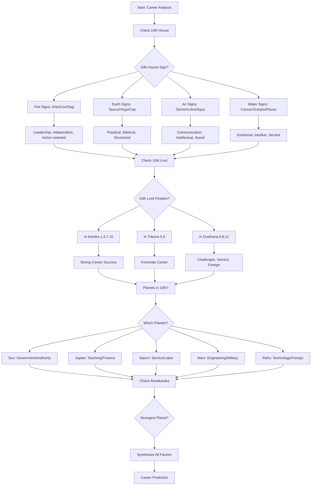
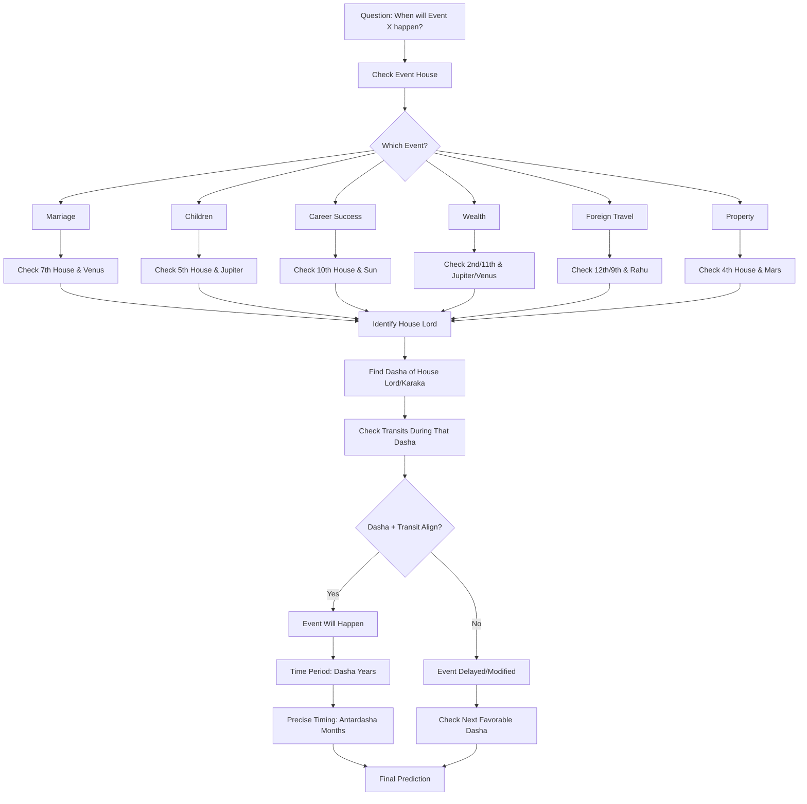
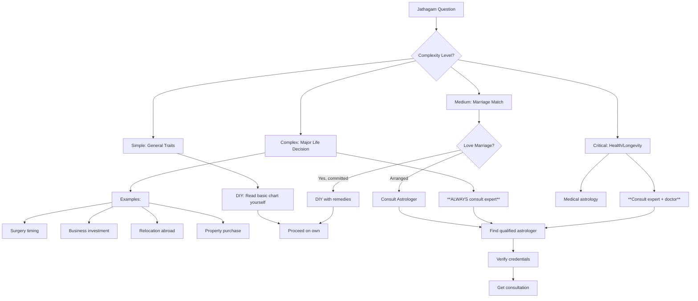
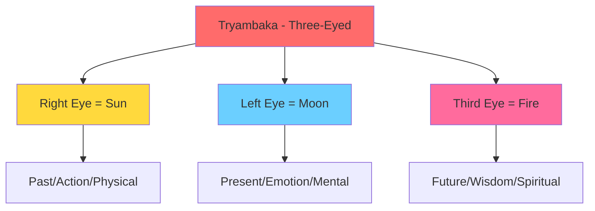

import Highlight from "@/react/Highlight/Highlight.jsx";
import Tabs, { TabItem } from "@/react/Tabs/Tabs.jsx";

# Jathagam Guide - Part 6B: Practical Astrology Guide
# ஜாதகம் வழிகாட்டி - பாகம் 6B: நடைமுறை வழிகாட்டி

Welcome to **Part 6B** - the **final and most practical** section! This guide covers career prediction, timing life events, Muhurtham selection, and wisdom for using astrology effectively in modern life.

:::note[Series Progress - FINAL PART! - தொடர் முடிவு!]
✅ **Part 1:** 27 Nakshatras - COMPLETED <br></br>
✅ **Part 2A:** 12 Rashis - COMPLETED <br></br>
✅ **Part 2B:** 9 Navagrahas & 12 Houses - COMPLETED <br></br>
✅ **Part 3:** Vimshottari Dasha System - COMPLETED <br></br>
✅ **Part 4A:** Chevvai Dosham & 7½ Sani - COMPLETED <br></br>
✅ **Part 4B:** Kaal Sarpa & Other Doshas - COMPLETED <br></br>
✅ **Part 5:** Yogas - COMPLETED <br></br>
✅ **Part 6A:** Chart Reading + Marriage Compatibility - COMPLETED <br></br>
📖 **Part 6B (This Article - FINAL):** Career, Timing, Muhurtham, Practical Wisdom
:::

:::tip[Series Completion! - தொடர் நிறைவு!]
**Congratulations!** After this part, you'll have:

✅ Complete understanding of **Vedic Astrology fundamentals** <br></br>
✅ Ability to **read basic Jathagam charts** <br></br>
✅ Knowledge of **doshas, yogas, compatibility** <br></br>
✅ Career and life event **prediction skills** <br></br>
✅ **Practical wisdom** for real-world application <br></br>
✅ **When to consult experts** vs DIY analysis

**You'll be an informed Jathagam reader!**
:::

---

## <Highlight color='#800031' highlight='fg' fontWeight='bold'> CAREER PREDICTION - தொழில் கணிப்பு </Highlight>

### <Highlight color='#004080' highlight='fg' fontWeight='bold'> Career Analysis Framework </Highlight>

**Key Houses for Career:**

<div class="table-luxury-grid">

| House | Signification | Career Aspect |
|-------|--------------|---------------|
| **10th** | Karma, profession, status | Primary career house - MOST IMPORTANT |
| **6th** | Service, daily work, competition | Job/service, work environment |
| **2nd** | Wealth, speech, family business | Income, family profession |
| **11th** | Gains, ambitions, networks | Income from career, professional goals |
| **1st** | Self, personality, capabilities | Personal abilities, overall direction |
| **9th** | Fortune, higher learning | Luck in career, higher education impact |

</div>

**Key Planets for Career:**

<div class="table-luxury-grid">

| Planet | Career Significations |
|--------|----------------------|
| **Sun (சூரியன்)** | Government, authority, administration, politics, leadership |
| **Moon (சந்திரன்)** | Public dealings, hospitality, food, travel, nursing, psychology |
| **Mars (செவ்வாய்)** | Engineering, military, police, surgery, real estate, sports |
| **Mercury (புதன்)** | Business, commerce, writing, teaching, accounting, IT |
| **Jupiter (குரு)** | Teaching, law, finance, counseling, religious work, philosophy |
| **Venus (சுக்கிரன்)** | Arts, entertainment, fashion, luxury goods, relationships, hospitality |
| **Saturn (சனி)** | Labor, mining, oil, iron, agriculture, service, judiciary (slow results) |
| **Rahu (ராகு)** | Technology, research, foreign, politics, unconventional fields |
| **Ketu (கேது)** | Spirituality, occult, research, computers, detached work |

</div>

---

### <Highlight color='#004080' highlight='fg' fontWeight='bold'> Career Prediction Method </Highlight>

**Step-by-Step Career Analysis:**



---

### <Highlight color='#004080' highlight='fg' fontWeight='bold'> Career by 10th House Sign </Highlight>

<div class="table-luxury-grid">

| 10th House Sign | Suitable Careers |
|----------------|------------------|
| **Aries (மேஷம்)** | Military, police, sports, surgery, independent business, leadership roles |
| **Taurus (ரிஷபம்)** | Banking, finance, luxury goods, agriculture, music, art dealing |
| **Gemini (மிதுனம்)** | Communication, media, writing, teaching, sales, IT, journalism |
| **Cancer (கடகம்)** | Hospitality, food industry, nursing, psychology, real estate, public work |
| **Leo (சிம்மம்)** | Politics, government, administration, entertainment, jewelry, authority positions |
| **Virgo (கன்னி)** | Healthcare, analysis, editing, accounting, service industry, details-oriented work |
| **Libra (துலாம்)** | Law, diplomacy, fashion, interior design, HR, partnerships, counseling |
| **Scorpio (விருச்சிகம்)** | Research, investigation, occult, surgery, psychology, insurance, mining |
| **Sagittarius (தனுசு)** | Teaching, philosophy, law, international business, travel, publishing |
| **Capricorn (மகரம்)** | Government, politics, construction, mining, organizational management |
| **Aquarius (கும்பம்)** | Technology, science, social work, astrology, unconventional fields, networks |
| **Pisces (மீனம்)** | Spirituality, hospitals, charity, arts, photography, film, healing |

</div>

---

### <Highlight color='#004080' highlight='fg' fontWeight='bold'> Career Timing - When Success Comes </Highlight>

**Best Career Dashas:**

**1. 10th Lord Dasha:**
- **Peak career period**
- Promotions, recognition, success
- Best time for job changes

**2. Sun Dasha (if well-placed):**
- Authority, government positions
- 6 years of leadership opportunities

**3. Jupiter Dasha:**
- Teaching, advisory roles
- Expansion in career
- Ethical success

**4. Saturn Dasha:**
- Hard work pays off
- Slow but steady rise
- Service-oriented success

**5. Lagna Lord Dasha:**
- Self-actualization in career
- Personal brand building

**Ages for Career Milestones:**

<div class="table-luxury-grid">

| Age | Career Phase | What to Expect |
|-----|--------------|----------------|
| **18-25** | Education, Training | Foundation building, internships |
| **25-28** | Entry Level | First job, learning phase |
| **28-35** | Growth Phase | Promotions, skill development, job changes |
| **35-42** | Peak Phase | Senior positions, leadership, maximum earnings |
| **42-50** | Consolidation | Authority, mentoring, business ownership |
| **50-60** | Mastery | Expert status, consulting, advisory roles |
| **60+** | Transition | Retirement, legacy, spiritual pursuits |

</div>

---

### <Highlight color='#004080' highlight='fg' fontWeight='bold'> Career Combinations (Yogas) </Highlight>

**Strong Career Yogas:**

**1. 10th Lord + Lagna Lord:**
- Self + Career aligned
- Best for entrepreneurs

**2. 10th Lord + 9th Lord (Dharma Karmadhipati):**
- Fortune + Career
- Government honors, fame

**3. Sun in 10th in Leo:**
- **Ruchaka Yoga**
- Authority, leadership

**4. Saturn in 10th in Capricorn/Aquarius:**
- **Sasa Yoga**
- Hard work pays off, discipline

**5. Jupiter in 10th:**
- Ethical career
- Teaching, counseling

**6. Multiple Planets in 10th:**
- Strong career focus
- Workaholics, but successful

**7. 10th Lord Exalted:**
- Peak career success
- Recognition, awards

---

### <Highlight color='#004080' highlight='fg' fontWeight='bold'> Career Challenges </Highlight>

**Indicators of Career Struggles:**

❌ **Ketu in 10th:**
- Frequent job changes
- Dissatisfaction with career
- Spiritual/unconventional work better

❌ **Rahu in 10th:**
- Unconventional career path
- Foreign companies/work
- Success through struggle

❌ **Saturn in 10th (if weak):**
- Delays, obstacles
- Hard work, slow success
- But longevity in career

❌ **10th Lord in 6th/8th/12th:**
- Service jobs (6th)
- Sudden changes, research (8th)
- Foreign, expenses (12th)

❌ **10th Lord Debilitated:**
- Initial struggles
- Needs Neecha Bhanga for success

**Remedies:**
- Strengthen 10th lord through gemstone/mantras
- Worship career deity (Sun, Jupiter, Saturn based on chart)
- Align career with natural talents (check Atmakaraka)

---

## <Highlight color='#800031' highlight='fg' fontWeight='bold'> TIMING LIFE EVENTS - வாழ்க்கை நிகழ்வுகள் கால அட்டவணை </Highlight>

### <Highlight color='#004080' highlight='fg' fontWeight='bold'> Event Timing Framework </Highlight>

**Timing Uses Three Factors:**

1. **Dasha-Bhukti** (Major-Minor periods from Part 3)
2. **Transits (Gochara)** - Current planetary positions
3. **Progressions** - Chart evolution over time

**Basic Principle:**
Event happens when **Dasha + Transit** both support it.

---

### <Highlight color='#004080' highlight='fg' fontWeight='bold'> Marriage Timing </Highlight>

**When Marriage Happens:**

**From Dasha:**
- **Venus Dasha/Antardasha** (Kalatra Karaka)
- **Jupiter Dasha** (especially for women - husband karaka)
- **7th Lord Dasha**
- **Moon Dasha** (emotions, partnerships)
- **Lagna Lord Dasha** (self-actualization through marriage)

**From Transit:**
- **Jupiter transiting 1st, 5th, 7th, or 11th** from Moon/Lagna
- **Venus transiting 1st or 7th**
- **Avoiding:** 8th house transits, Saturn on Venus

**Typical Ages for Marriage:**

<div class="table-luxury-grid">

| Scenario | Age Range | Why |
|----------|-----------|-----|
| **Early Marriage** | 18-23 | Venus Dasha early, strong 7th house |
| **Average Marriage** | 24-28 | Normal timing, most common |
| **Delayed Marriage** | 29-35 | Saturn influence, Chevvai Dosham, 7th lord weak |
| **Very Late Marriage** | 35+ | Strong career focus, spiritual charts, doshas |

</div>

**Delays Indicated By:**
- Saturn aspecting 7th or Venus
- Chevvai Dosham (see Part 4A)
- 7th lord in 6th/8th/12th
- Rahu-Ketu axis on 1-7
- Running Saturn/Ketu Dasha during marriage years

---

### <Highlight color='#004080' highlight='fg' fontWeight='bold'> Children Timing </Highlight>

**When Children Are Born:**

**From Dasha:**
- **Jupiter Dasha** (Putra Karaka - children significator)
- **5th Lord Dasha**
- **Moon Dasha** (motherhood)

**From Transit:**
- **Jupiter transiting 5th, 9th, or 1st** from Moon
- **Avoiding:** Saturn on 5th house or 5th lord

**Typical Ages for First Child:**

<div class="table-luxury-grid">

| Scenario | Age | Dasha Indication |
|----------|-----|------------------|
| **Early Parenthood** | 20-25 | Jupiter Dasha, strong 5th house |
| **Average** | 25-32 | Normal timing |
| **Delayed** | 32-38 | Saturn influence, Jupiter delayed |
| **IVF/Medical Help** | Any age | 5th lord in 6th/8th, weak Jupiter |

</div>

**No Children Indicated By:**
- 5th lord severely afflicted
- Ketu in 5th house
- Saturn-Mars in 5th
- Jupiter debilitated without cancellation
- Never running Jupiter or 5th lord Dasha

---

### <Highlight color='#004080' highlight='fg' fontWeight='bold'> Wealth Accumulation Timing </Highlight>

**Peak Wealth Periods:**

**Dasha:**
- **Venus Dasha** (20 years of prosperity)
- **Jupiter Dasha** (Dhana Karaka)
- **2nd/11th Lord Dasha**
- **Dhana Yoga planets' Dasha**

**Transit:**
- **Jupiter in 2nd, 11th** from Moon
- **Venus in 2nd, 9th, 11th**

**Wealth Milestones:**

<div class="table-luxury-grid">

| Age | Wealth Phase | What Happens |
|-----|--------------|--------------|
| **25-35** | Foundation | Savings start, first investments |
| **35-50** | Accumulation | Peak earning, wealth builds |
| **50-65** | Consolidation | Assets mature, passive income |
| **65+** | Distribution | Inheritance planning, charity |

</div>

---

### <Highlight color='#004080' highlight='fg' fontWeight='bold'> Life Event Timing Flowchart </Highlight>



---

## <Highlight color='#800031' highlight='fg' fontWeight='bold'> MUHURTHAM - முகூர்த்தம் (Auspicious Timing) </Highlight>

### <Highlight color='#004080' highlight='fg' fontWeight='bold'> What is Muhurtham? </Highlight>

**Muhurtham (मुहूर्त/முகூர்த்தம்)** = **Auspicious time** for starting important activities

**Principle:**
"Good beginnings ensure good results." Starting important work at astrologically favorable time increases success probability.

**When Muhurtham is Used:**

<div class="table-luxury-grid">

| Activity | Why Muhurtham Needed |
|----------|---------------------|
| **Marriage** | Ensure lifelong harmony, prosperity |
| **Housewarming (Griha Pravesh)** | Peace and prosperity in new home |
| **Business Opening** | Success and growth |
| **Starting Education** | Academic excellence |
| **Vehicle Purchase** | Safety and auspiciousness |
| **Surgery/Medical** | Successful recovery |
| **Journey** | Safe travel |
| **Name Ceremony (Namakarana)** | Child's fortune |

</div>

---

### <Highlight color='#004080' highlight='fg' fontWeight='bold'> Muhurtham Selection Basics </Highlight>

**Factors to Check:**

**1. Tithi (Lunar Day - திதி):**
- 15 tithis in waxing (Shukla Paksha - வளர்பிறை)
- 15 tithis in waning (Krishna Paksha - தேய்பிறை)

**Auspicious Tithis:**
- **Dvitiya (2):** Good for starting new things
- **Tritiya (3):** Success in ventures
- **Panchami (5):** Education, learning
- **Saptami (7):** Travel, movement
- **Dashami (10):** Victory, completion
- **Ekadashi (11):** Spiritual activities
- **Trayodashi (13):** Aggressive actions (battles)

**Avoid:**
- **Amavasya (New Moon):** Except for ancestral work
- **Chaturdashi (14):** Except for Shiva worship
- **Ashtami (8):** Generally inauspicious

---

**2. Nakshatra (Star - நட்சத்திரம்):**

**Good Nakshatras for Most Activities:**
- Ashwini, Rohini, Mrigashira, Punarvasu, Pushya, Hasta, Chitra, Swati, Anuradha, Shravana, Uttara Phalguni, Uttara Ashadha, Uttara Bhadrapada, Revati

**Avoid:**
- Bharani, Ardra, Ashlesha, Magha, Moola, Jyeshtha (generally challenging)

**Best Muhurtham Stars (Most Auspicious):**
1. **Pushya (பூசம்)** - #1 for all activities
2. **Rohini (ரோகிணி)** - Material success
3. **Revati (ரேவதி)** - Completion, journeys
4. **Uttara Phalguni/Ashadha/Bhadrapada (உத்திரம்)** - All "Uttara" stars good

---

**3. Weekday (Day of Week - வாரம்):**

<div class="table-luxury-grid">

| Day | Ruler | Good For | Avoid For |
|-----|-------|----------|-----------|
| **Sunday** | Sun | Government work, authority | Marriage, partnerships |
| **Monday** | Moon | Domestic work, water-related | Property purchase |
| **Tuesday** | Mars | Surgery, war, property | Marriage, travel start |
| **Wednesday** | Mercury | Education, business, communication | All good |
| **Thursday** | Jupiter | Marriage, education, finance | Loans, debts |
| **Friday** | Venus | **Marriage, arts, luxury** - BEST | Surgery |
| **Saturday** | Saturn | Foundation laying, long-term | Marriage, joyful events |

</div>

---

**4. Yoga (Daily Yoga - யோகம்):**

27 yogas cycle daily. 

**Auspicious Yogas:**
- Siddha, Siddhi, Sadhya, Shubha, Shukla, Brahma, Vishkumbha, Preeti, Ayushman, Saubhagya

**Avoid:**
- Vyatipata, Vaidhriti (most inauspicious)

---

**5. Karana (Half-Tithi - கரணம்):**

11 karanas cycle.

**Auspicious:**
- Bava, Balava, Kaulava, Taitila

**Avoid:**
- Vishti (Bhadra) - very inauspicious for starting anything

---

### <Highlight color='#004080' highlight='fg' fontWeight='bold'> Marriage Muhurtham Selection </Highlight>

**Most Important Factors for Marriage:**

✅ **Month:**
- **Best:** Magha, Phalguna, Vaishakha (Jan-May in most years)
- **Avoid:** Ashada, Shravana, Bhadrapada (monsoon - Jul-Sep)

✅ **Tithi:**
- **Best:** 2, 3, 5, 7, 10, 11, 13 of waxing moon
- **Avoid:** 4, 6, 8, 9, 14, Amavasya, Purnima

✅ **Nakshatra:**
- **Best:** Rohini, Mrigashira, Uttara Phalguni, Hasta, Swati, Anuradha, Uttara Ashadha, Uttara Bhadrapada, Revati
- **Avoid:** Bharani, Ardra, Ashlesha, Magha, Moola, Jyeshtha

✅ **Weekday:**
- **Best:** Wednesday, Thursday, Friday
- **Okay:** Sunday, Monday
- **Avoid:** Tuesday, Saturday

✅ **Lagna (Muhurtham Lagna):**
- Fixed signs (Taurus, Leo, Scorpio, Aquarius) for stable marriage
- Benefics (Jupiter, Venus, Mercury) in Kendras
- 7th house strong and unafflicted

**Special Considerations:**
- Bride's and Groom's **current Dasha** should be favorable
- Avoid marriage during **Rahu Kalam** time
- Check **Chandrashtama** (Moon in 8th from boy's or girl's Moon Rasi) - avoid

---

### <Highlight color='#004080' highlight='fg' fontWeight='bold'> Daily Muhurtham - Rahu Kalam & Yama Gandam </Highlight>

**Every day has inauspicious periods to avoid:**

**Rahu Kalam (ராகு காலம்):**
- 90-minute period ruled by Rahu
- **Avoid starting** any auspicious activity

**Daily Rahu Kalam Timing:**

<div class="table-luxury-grid">

| Day | Rahu Kalam Timing (Approx.) |
|-----|---------------------------|
| **Monday** | 7:30-9:00 AM |
| **Tuesday** | 3:00-4:30 PM |
| **Wednesday** | 12:00-1:30 PM |
| **Thursday** | 1:30-3:00 PM |
| **Friday** | 10:30-12:00 PM |
| **Saturday** | 9:00-10:30 AM |
| **Sunday** | 4:30-6:00 PM |

</div>

**Yama Gandam (எமகண்டம்):**
- Another inauspicious period
- Avoid starting new work

**Gulikai Kalam:**
- Saturn's period
- Avoid for auspicious work

**Note:** These timings vary by location and season. Check local Panchangam (almanac).

---

## <Highlight color='#800031' highlight='fg' fontWeight='bold'> TRANSIT ANALYSIS - கோச்சார பலன்கள் </Highlight>

### <Highlight color='#004080' highlight='fg' fontWeight='bold'> Understanding Transits (Gochara) </Highlight>

**Transit (गोचर/கோச்சார)** = Current position of planets in the sky affecting your birth chart

**Why Transits Matter:**
- Birth chart = **Potential**
- Dasha = **Activation period**
- Transit = **Triggering mechanism**

**Formula:** Birth Chart + Dasha + Transit = **Actual Event**

---

### <Highlight color='#004080' highlight='fg' fontWeight='bold'> Major Transit Effects </Highlight>

**Jupiter Transit (குரு பெயர்ச்சி):**
- Duration: **1 year** per sign
- **Most auspicious** transit

**Good When Jupiter Transits:**
- **2nd house from Moon:** Wealth increase
- **5th house:** Children, education
- **7th house:** Marriage (for unmarried)
- **9th house:** Fortune, father's blessings
- **11th house:** Gains, income

**Bad When Jupiter Transits:**
- **6th house:** Debts, enemies (but ultimately victory)
- **8th house:** Obstacles, sudden events
- **12th house:** Expenses, losses

---

**Saturn Transit (சனி பெயர்ச்சி):**
- Duration: **2.5 years** per sign
- **Most feared** transit

**7½ Sani (covered in Part 4A):**
- Saturn transiting 12th, 1st, 2nd from Moon
- 7.5 years of challenges

**Good When Saturn Transits:**
- **3rd, 6th, 11th from Moon:** Upachaya houses - growth through effort

**Bad:**
- **1st, 4th, 5th, 7th, 8th, 10th, 12th from Moon:** Challenges in those life areas

---

**Rahu-Ketu Transit:**
- Duration: **18 months** per sign
- Moves **retrograde** (backward)
- Brings sudden changes

**Effect depends on:**
- Which houses they transit
- Aspects they make
- If triggering Kaal Sarpa Dosha

---

### <Highlight color='#004080' highlight='fg' fontWeight='bold'> Current Transit Status (2026) </Highlight>

**As of January 2026:**

<div class="table-luxury-grid">

| Planet | Current Sign | Since | Next Change | Effect Duration |
|--------|-------------|-------|-------------|----------------|
| **Jupiter** | Taurus | May 2024 | May 2025 | ~1 year |
| **Saturn** | Pisces | Mar 2025 | Mar 2028 | 2.5 years |
| **Rahu** | Pisces | Oct 2023 | May 2025 | 18 months |
| **Ketu** | Virgo | Oct 2023 | May 2025 | 18 months |

</div>

*Note: Check current ephemeris for exact positions as dates shift*

**Impact on Your Chart:**
- Count from your **Moon sign** to see which house these planets are transiting
- Check if they're triggering your doshas or yogas

---

## <Highlight color='#800031' highlight='fg' fontWeight='bold'> CONSULTING AN ASTROLOGER - ஜோதிடர் ஆலோசனை </Highlight>

### <Highlight color='#004080' highlight='fg' fontWeight='bold'> When to Consult a Professional </Highlight>

**DIY vs Professional Decision Matrix:**



---

### <Highlight color='#004080' highlight='fg' fontWeight='bold'> Finding a Qualified Astrologer </Highlight>

**Credentials to Look For:**

✅ **Traditional Training:**
- Gurukula or family lineage
- Studied under recognized teacher
- Years of practice (minimum 10+ years)

✅ **Certifications:**
- Jyotisha Acharya, Jyotisha Kovid
- From reputed institutions (Bharatiya Vidya Bhavan, etc.)

✅ **Specialization:**
- Some specialize in marriage matching
- Some in medical astrology
- Some in Muhurtham
- Choose based on your need

✅ **Reputation:**
- Word-of-mouth recommendations
- Temple-affiliated astrologers (often genuine)
- Family astrologer (traditional)

❌ **Red Flags:**
- Promises 100% accuracy
- Guarantees specific outcomes
- Demands large fees upfront
- Instills fear to sell expensive remedies
- No verifiable background

---

### <Highlight color='#004080' highlight='fg' fontWeight='bold'> What to Bring to Consultation </Highlight>

**Essential Information:**

1. **Exact Birth Details:**
   - Date: DD/MM/YYYY
   - Time: HH:MM (as accurate as possible - ±5 minutes makes difference!)
   - Place: City, State (latitude/longitude if known)

2. **Birth Certificate / Hospital Records:**
   - Most accurate time source
   - Better than memory

3. **Questions Prepared:**
   - Write down specific questions
   - Prioritize (usually 30-60 min consultation)

4. **Family Details (if relevant):**
   - For marriage: partner's birth details
   - For children: their birth details

5. **Current Issues:**
   - Brief on what you're facing
   - Any ongoing Dashas you know

---

### <Highlight color='#004080' highlight='fg' fontWeight='bold'> Questions to Ask Astrologer </Highlight>

**Good Questions:**

✅ "What are my strengths and weaknesses based on my chart?"  
✅ "Which career field suits me best?"  
✅ "When is a favorable time for marriage?"  
✅ "Do I have [specific dosha]? If yes, what remedies?"  
✅ "What is my current Dasha, and what should I expect?"  
✅ "Is this a good time to start a business?"  
✅ "Which gemstone would benefit me, if any?"  
✅ "What remedies should I do for [specific problem]?"

❌ **Avoid Vague Questions:**
- "Will I be successful?" (Define success!)
- "When will I get rich?" (Unrealistic expectation)
- "Will I be happy?" (Too broad)

❌ **Don't Ask:**
- Exact prediction of death (unethical astrologers won't tell)
- Lottery numbers (astrology doesn't work that way)
- Someone else's chart without their permission

---

### <Highlight color='#004080' highlight='fg' fontWeight='bold'> Understanding Astrologer's Predictions </Highlight>

**Interpretation Framework:**

**When astrologer says:** "You'll have Raj Yoga"  
**Means:** Potential for power/success, but needs activation through right Dasha and effort

**When astrologer says:** "Marriage will be delayed"  
**Means:** May happen after age 28-30, not necessarily doom

**When astrologer says:** "You have Chevvai Dosham"  
**Means:** Check cancellations first, then remedies, not "no marriage ever"

**When astrologer says:** "This is not a good time"  
**Means:** Wait for better Dasha/transit, exercise caution, but not absolute prohibition

**Remember:**
- Astrology shows **tendencies**, not fixed fate
- Free will and effort can modify results
- Remedies can reduce negative effects
- Positive attitude matters

---

## <Highlight color='#800031' highlight='fg' fontWeight='bold'> REMEDIES GUIDE - பரிகார வழிகாட்டி </Highlight>

### <Highlight color='#004080' highlight='fg' fontWeight='bold'> Remedy Selection Framework </Highlight>

**Types of Remedies:**

**1. Gemstones (ரத்தினக் கற்கள்):**
- **Effectiveness:** High (if suitable)
- **Risk:** High (can backfire if wrong)
- **Cost:** ₹5,000 - ₹5,00,000+
- **When:** Consult astrologer first

**2. Mantras (மந்திரங்கள்):**
- **Effectiveness:** High (with consistent practice)
- **Risk:** None
- **Cost:** Free
- **When:** Daily practice, anyone can do

**3. Temple Worship (கோயில் வழிபாடு):**
- **Effectiveness:** Medium-High
- **Risk:** None
- **Cost:** ₹100 - ₹25,000 (puja costs)
- **When:** Specific days, during problematic Dasha

**4. Fasting/Vratas (விரதம்):**
- **Effectiveness:** Medium
- **Risk:** None (if healthy)
- **Cost:** Free
- **When:** Weekly, specific tithis

**5. Charity (தானம்):**
- **Effectiveness:** Medium-High
- **Risk:** None
- **Cost:** Affordable (₹100+)
- **When:** Regularly, specific days

**6. Yantras (யந்திரங்கள்):**
- **Effectiveness:** Medium
- **Risk:** Low
- **Cost:** ₹500 - ₹5,000
- **When:** After energization by priest

---

### <Highlight color='#004080' highlight='fg' fontWeight='bold'> Remedy Selection by Problem </Highlight>

<div class="table-luxury-grid">

| Problem | Primary Remedy | Supporting Remedies |
|---------|---------------|---------------------|
| **Marriage Delay** | Venus/Jupiter worship, Thursday fasting | White/Yellow clothes, Perumal temple, Marriage-specific pujas |
| **Chevvai Dosham** | Kuja Shanti Puja, Vaitheeswaran Koil visit | Red Coral (if suitable), Hanuman worship, Tuesday fasting |
| **7½ Sani** | Thirunallar visit, Saturn mantras | Saturday fasting, Blue Sapphire (caution!), Feed crows, Oil donation |
| **Kaal Sarpa** | Trimbakeshwar puja, Subramanya worship | Rahu-Ketu mantras, Nag Panchami rituals, Snake temple visits |
| **Career Obstacles** | 10th lord worship, Sun Gayatri | Sunday water offering to Sun, Red/Orange clothes, Authority deity worship |
| **No Children** | Jupiter worship, Santana Gopala puja | Yellow Sapphire (if suitable), Thursday yellow rice, Perumal temples |
| **Financial Problems** | Lakshmi puja, Jupiter-Venus worship | Green/Yellow clothes, Friday temple visit, 108 coconut offering |
| **Health Issues** | Mahamrityunjaya mantra, Shiva worship | Rudraksha, Monday milk abhishekam, Ayurvedic consultation |
| **Mental Stress** | Moon worship, meditation | Pearl (if suitable), Monday fasting, White clothes, Milk to poor |
| **Enemy Troubles** | Hanuman worship, Mars pacification | Red Coral, Tuesday Hanuman Chalisa, Feed dogs |

</div>

---

### <Highlight color='#004080' highlight='fg' fontWeight='bold'> Universal Remedies (Everyone Can Do) </Highlight>

**Daily Practices:**

✅ **1. Gayatri Mantra (108 times):**
```
ॐ भूर्भुवः स्वः तत्सवितुर्वरेण्यं
भर्गो देवस्य धीमहि धियो यो नः प्रचोदयात्॥

Om Bhur Bhuvah Swaha, Tat Savitur Varenyam
Bhargo Devasya Dheemahi, Dhiyo Yo Nah Prachodayat
```
- **Benefits:** Overall protection, wisdom, removes all doshas gradually

---

### <Highlight color='#004080' highlight='fg' fontWeight='bold'> Mahamrityunjaya Mantra - The Death-Conquering Mantra </Highlight>
### <Highlight color='#004080' highlight='fg' fontWeight='bold'> மஹாம்ருத்யுஞ்ஜய மந்திரம் - மரணத்தை வெல்லும் மந்திரம் </Highlight>

The **Mahamrityunjaya Mantra (महामृत्युञ्जय मन्त्र)** is one of the **most powerful mantras** in Vedic tradition. It's known as the **"Death-Conquering Mantra"** or **"Moksha Mantra"** and is chanted for health, longevity, protection, and liberation.

---

#### **The Complete Mahamrityunjaya Mantra - மந்திரம்**


<Tabs>
<TabItem label="Devanagari">
```
ॐ त्र्यम्बकं यजामहे सुगन्धिं पुष्टिवर्धनम्।
उर्वारुकमिव बन्धनान् मृत्योर्मुक्षीय मामृतात्॥
```
</TabItem>
<TabItem label="Tamil">
```
ஓம் த்ர்யம்பகம் யஜாமஹே ஸுகந்திம் புஷ்டிவர்தனம்।
உர்வாருகமிவ பந்தனான் ம்ருத்யோர்முக்ஷீய மாம்ருதாத்॥
```
</TabItem>
<TabItem label="Romanized (IAST)">
```
Om Tryambakaṁ Yajāmahe Sugandhiṁ Puṣṭivardhanam।
Urvārukamiva Bandhanān Mṛtyormukṣīya Māmṛtāt॥
```
</TabItem>
</Tabs>

---

#### **Word-by-Word Meaning - சொல் பொருள்**

Let's break down every word to understand the deep meaning:

<div class="table-luxury-grid">

| Sanskrit Word | Tamil Transliteration | Meaning | Detailed Explanation |
|---------------|----------------------|---------|---------------------|
| **Om (ॐ)** | ஓம் | The primordial sound | Cosmic vibration, represents Brahman, the ultimate reality |
| **Tryambakam (त्र्यम्बकम्)** | த்ர்யம்பகம் | The three-eyed one | Lord Shiva with three eyes (Sun, Moon, Fire / Past, Present, Future / Physical, Mental, Spiritual vision) |
| **Yajāmahe (यजामहे)** | யஜாமஹே | We worship, we honor | We offer our devotion and reverence |
| **Sugandhim (सुगन्धिम्)** | ஸுகந்திம் | Sweet-smelling, fragrant | Spiritually pure, auspicious, whose grace spreads like fragrance |
| **Puṣṭi (पुष्टि)** | புஷ்டி | Nourishment, strength | Physical, mental, and spiritual sustenance |
| **Vardhanam (वर्धनम्)** | வர்தனம் | Increaser, enhancer | Who increases our well-being and prosperity |
| **Urvārukam (उर्वारुकम्)** | உர்வாருகம் | Cucumber, gourd | Ripe fruit that naturally detaches from the vine |
| **Iva (इव)** | இவ | Like, as | Comparison particle |
| **Bandhanān (बन्धनान्)** | பந்தனான் | From bondage, from ties | From attachments, from the binding force |
| **Mṛtyoḥ (मृत्योः)** | ம்ருத்யோஃ | From death | From the cycle of death and rebirth (Samsara) |
| **Mukṣīya (मुक्षीय)** | முக்ஷீய | Liberate, release, free | May we be released, may we be saved |
| **Mā (मा)** | மா | Not, never | Negation particle |
| **Amṛtāt (अमृतात्)** | அம்ருதாத் | From immortality, from nectar | From eternal life, from liberation (Moksha) |

</div>

---

#### **Complete Translation - முழு பொருள்**

**Literal Translation:**

"OM. We worship the Three-Eyed One (Lord Shiva), who is fragrant and who nourishes all beings. May He liberate us from death for the sake of immortality, just as the ripe cucumber is effortlessly released from its bondage to the vine."

**Deeper Meaning:**

"We worship Lord Shiva, the three-eyed one who sees past, present, and future. He is the fragrance of purity and the nourisher of all life. Just as a ripe fruit naturally falls from its stem when ready, may we be released from the cycle of death and rebirth, not from immortality itself. Grant us spiritual liberation (Moksha) while we live in this mortal world."

**Tamil Translation (தமிழ் பொருள்):**

"ஓம். மூன்று கண்களை உடைய சிவபெருமானை நாங்கள் வழிபடுகிறோம். அவர் நறுமணம் வீசுபவர், எல்லா உயிர்களுக்கும் போஷணை அளிப்பவர். பழுத்த வெள்ளரிக் காய் கொடியிலிருந்து தானாக விடுபடுவது போல், மரணத்திலிருந்து எங்களை விடுவித்து, அழியாத நிலையை (மோக்ஷத்தை) எங்களுக்கு அருள வேண்டும்."

---

#### **The Beautiful Metaphor - அழகான உவமை**

**The Cucumber/Gourd Comparison:**

This is one of the most profound metaphors in Vedic literature:

🍈 **Unripe Fruit:** Firmly attached to vine (symbolizes soul bound by ego, desires, karma)

🍈 **Ripening Process:** Gradual spiritual growth through sadhana (practice)

🍈 **Ripe Fruit:** Ready for liberation, mature spiritually

🍈 **Natural Detachment:** Falls from vine effortlessly when ripe (Moksha happens naturally when soul is ready)

**The Prayer's Dual Request:**

1. **"Mṛtyoḥ Mukṣīya"** = Liberate us FROM death
2. **"Mā Amṛtāt"** = NOT from immortality

This means: "Free us from the fear and cycle of death, but don't separate us from eternal truth/immortality/liberation."

---

#### **Origin & Significance - தோற்றம் & முக்கியத்துவம்**

**Source:**
- From **Rig Veda** (7.59.12)
- Also in **Krishna Yajur Veda** (Taittiriya Samhita 1.8.6)
- Part of **Rudram** (Sri Rudram Chamakam)

**Who Can Chant:**
- **Everyone** - No restrictions
- All ages, genders, backgrounds
- One of the few Vedic mantras with universal access

**Three Eyes of Shiva (Tryambaka):**



---

#### **When to Chant Mahamrityunjaya Mantra - எப்போது ஜெபிப்பது**

**Daily Practice:**
- **Best Time:** Brahma Muhurta (4-6 AM)
- **Frequency:** 108 times (one mala)
- **Direction:** Face East or North
- **Mala:** Rudraksha beads (most powerful)

**Special Occasions:**

✅ **For Health Issues:**
- During illness or surgery
- Chronic health problems
- Before/after medical procedures
- For family members' health

✅ **For Protection:**
- During difficult planetary periods (Sani, Rahu, Ketu dashas)
- During Ashtama Shani (7½ Sani)
- When traveling (especially dangerous journeys)
- During epidemics/pandemics
- For protection from accidents

✅ **For Spiritual Progress:**
- During meditation practice
- Seeking liberation (Moksha)
- Overcoming fear of death
- Spiritual purification

✅ **For Ancestors (Pitru Dosha):**
- On Amavasya (new moon)
- During Pitru Paksha (fortnight for ancestors)
- For departed souls' liberation
- When Pitru Dosha is in chart

✅ **For Life Events:**
- Before important decisions
- During pregnancy (for safe delivery)
- For longevity of loved ones
- Facing legal/career challenges

---

#### **How to Chant Properly - எப்படி ஜெபிப்பது**

**Preparation:**

1. **Clean Environment:**
   - Take bath
   - Wear clean clothes (white, red, or saffron preferred)
   - Clean puja space

2. **Create Sacred Space:**
   - Light lamp (ghee or sesame oil)
   - Light incense
   - Place Shiva image or Rudraksha
   - Offer flowers, especially bilva leaves

3. **Mental Preparation:**
   - Calm the mind
   - Set intention (Sankalpa) - "Why am I chanting?"
   - Invoke Lord Shiva's presence

**Chanting Method:**

**Option 1: 108 Times (Recommended Daily)**
- Use Rudraksha mala (108 beads)
- Sit in comfortable meditative posture
- Focus on meaning or Shiva's form
- Don't cross the head bead (Sumeru)
- Duration: 15-20 minutes

**Option 2: 1,008 Times (Weekly/Monthly)**
- For serious issues
- Takes 2-3 hours
- Better with group chanting
- Very powerful

**Option 3: 108,000 Times (Purashcharana)**
- Complete spiritual practice over months
- For major life transformations
- Under guru guidance
- Ultimate healing and liberation

**Correct Pronunciation Tips:**

- **Tryambakam:** Try-um-ba-kam (NOT Try-am-ba-kam)
- **Yajāmahe:** Ya-jaa-ma-he (long 'aa' sound)
- **Sugandhim:** Su-gan-dhim (nasal 'n')
- **Urvārukam:** Oor-vaa-ru-kam
- **Bandhanān:** Ban-dha-naan (nasal 'n')
- **Mṛtyormukṣīya:** Mrit-yor-mook-shee-ya
- **Māmṛtāt:** Maa-mri-taat

**Rhythm & Melody:**
- Chant slowly and clearly (not rushed)
- Maintain steady rhythm
- Can be chanted to traditional Vedic melody (available online)
- Or simple repetition with devotion

---

#### **Benefits of Mahamrityunjaya Mantra - பயன்கள்**

**Physical Benefits:**

✅ **Health & Healing:**
- Cures diseases, especially chronic ones
- Speeds recovery from surgery/accidents
- Strengthens immune system
- Protects from epidemics
- Increases longevity

✅ **Protection:**
- Protection from untimely death
- Safety during travel
- Protection from accidents
- Guards against negative energies
- Shield from evil eye

**Mental & Emotional Benefits:**

✅ **Peace of Mind:**
- Removes fear of death
- Reduces anxiety and stress
- Brings mental clarity
- Emotional healing
- Overcomes depression

✅ **Relationships:**
- Harmony in family
- Protection for loved ones
- Ancestral blessings
- Removes curses

**Spiritual Benefits:**

✅ **Liberation:**
- Progress toward Moksha
- Removes karmic obstacles
- Purifies past life karma
- Spiritual awakening
- Connection with Shiva consciousness

✅ **Astrological Remedies:**
- Reduces malefic effects of planets
- Especially powerful for Saturn, Rahu, Ketu
- Removes Pitru Dosha
- Helps during difficult dashas
- Mitigates death-inflicting yogas (Marak yogas)

**Universal Benefits:**

✅ **For Everyone:**
- Blessings for the entire family
- Prosperity and abundance
- Removal of obstacles
- Divine grace
- Complete protection

---

#### **Scientific & Spiritual Perspective - அறிவியல் & ஆன்மீக பார்வை**

**Sound Vibration Science:**

Modern research shows:
- Sanskrit mantras create specific brain wave patterns
- "Om" resonates at 432 Hz (universal frequency)
- Repetitive chanting induces meditative states
- Reduces cortisol (stress hormone)
- Increases alpha brain waves (relaxation)

**Spiritual Energy:**

- Each syllable carries specific vibrational frequency
- Activates chakras (energy centers)
- Particularly powerful for Vishuddha (throat) and Ajna (third eye) chakras
- Creates protective energy field (Kavach)
- Connects individual consciousness to cosmic consciousness

---

#### **Stories & Testimonials - கதைகள் & சான்றுகள்**

**Rishi Markandeya's Story:**

The most famous story associated with this mantra:

**Background:**
- Sage Mrikandu and wife Marudvati were childless
- They prayed to Lord Shiva
- Shiva gave them a choice:
  - 100 foolish sons who live long, OR
  - One brilliant son who lives only 16 years
- They chose one brilliant son = Markandeya

**The Crisis:**
- At age 16, Yama (God of Death) came for Markandeya
- Markandeya was chanting this mantra and hugging Shiva Linga
- Yama threw his noose around the boy AND the Shiva Linga

**Lord Shiva's Intervention:**
- Shiva emerged from the Linga
- Kicked Yama (hence Yama's temple at Thirukkadaiyur has footprint)
- Blessed Markandeya with immortality
- Made him a Chiranjeevi (immortal being)

**Lesson:**
This mantra, when chanted with devotion, can even conquer death itself.

---

#### **Mahamrityunjaya Mantra for Different Doshas - தோஷங்களுக்கான பயன்பாடு**

<div class="table-luxury-grid">

| Dosha/Problem | How to Use | Additional Practice |
|---------------|------------|---------------------|
| **Pitru Dosha** | 108 times daily on Amavasya | With Shiva abhishekam, for ancestors' liberation |
| **Kaal Sarpa Dosha** | 108 times daily for 40 days | With Naga pratishta, during Rahu Kaal |
| **Ashtama Shani (7½ Sani)** | 108 times daily throughout period | Especially on Saturdays, with oil lamp |
| **Rahu-Ketu Dasha** | 1,008 times on eclipse days | During Grahan Kaal (eclipse time) |
| **Serious Illness** | 108 times 3 times daily | By patient or family members |
| **Accident-Prone Periods** | 108 times before travel | Daily during malefic transits |
| **Fear of Death** | Daily 108 times | With meditation on immortality |
| **Untimely Death Yogas** | Purashcharana (108,000 times) | Under expert astrologer guidance |

</div>

---

#### **Mahamrityunjaya Yantra - மஹாம்ருத்யுஞ்ஜய யந்திரம்**

**Using the Sacred Geometry:**

The Mahamrityunjaya Yantra is a mystical diagram that enhances the mantra's power:

```
    ह्रीं
ज्रीं ॐ त्र्यम्बकं ज्रीं
    ह्रीं
```

**How to Use:**
1. Draw or print the yantra
2. Energize it by chanting mantra 108 times
3. Keep in puja room or wear as pendant
4. Place under pillow for healing during sleep
5. Meditate on yantra while chanting

---

#### **Combining with Other Practices - மற்ற சாதனைகளுடன் இணைத்தல்**

**With Rudra Abhishekam:**
- Most powerful combination
- Chant while performing abhishekam
- Increases effectiveness manifold

**With Rudrakshas:**
- Wear 5-mukhi Rudraksha
- Or 14-mukhi (specific for this mantra)
- Energized with the mantra

**With Fasting:**
- Monday fasting
- Pradosham fasting (13th day)
- Increases spiritual benefit

**With Service (Seva):**
- Help the sick, dying, or grieving
- Chant for their benefit
- Mantra power multiplies when used selflessly

---

#### **Common Mistakes to Avoid - தவிர்க்க வேண்டிய தவறுகள்**

❌ **Wrong Pronunciation:**
- Learn proper Sanskrit pronunciation
- Listen to audio recordings
- Practice with a guru if possible

❌ **Lack of Devotion:**
- Don't chant mechanically
- Feel the meaning
- Maintain reverence

❌ **Irregular Practice:**
- Consistency is key
- Better 27 times daily than 1,000 times once
- Commit to 40 days minimum

❌ **Doubt:**
- Chant with faith
- Trust in the mantra's power
- Patience - results take time

❌ **Using for Harm:**
- Never use for negative purposes
- Only for healing and protection
- Misuse reduces your own life force

---

### <Highlight color='#004080' highlight='fg' fontWeight='bold'> Conclusion on Mahamrityunjaya Mantra </Highlight>

The Mahamrityunjaya Mantra is truly a **universal remedy** - it works for:

✅ ALL doshas (Chevvai, Sani, Kaal Sarpa, Pitru, etc.)  
✅ ALL health problems  
✅ ALL fears and anxieties  
✅ ALL spiritual seekers  
✅ ALL life situations  

**This is the ONE mantra everyone should know and chant regularly.**

Even if you do nothing else from this entire Jathagam series, **chanting Mahamrityunjaya Mantra 108 times daily** will bring immense benefits to your life - physical, mental, and spiritual.

**Start Today:** Just 15 minutes of daily practice can transform your life!

---

✅ **3. Gratitude Practice:**
- Thank God/Universe for 5 things daily
- Reduces negative karma

✅ **4. Help Others:**
- Service (Seva) is the best remedy
- Feed the hungry, help the needy

✅ **5. Meditation:**
- 10-20 minutes daily
- Calms mind, reduces planetary afflictions

---

## <Highlight color='#800031' highlight='fg' fontWeight='bold'> PRACTICAL WISDOM - நடைமுறை ஞானம் </Highlight>

### <Highlight color='#004080' highlight='fg' fontWeight='bold'> Ethics of Astrology </Highlight>

**What Astrology CAN Do:**

✅ Show general life patterns and tendencies  
✅ Identify strengths to leverage  
✅ Warn about challenges to prepare for  
✅ Suggest favorable times for actions  
✅ Provide remedies for difficulties  
✅ Offer psychological insights  
✅ Guide career and relationship decisions

**What Astrology CANNOT Do:**

❌ Predict exact events with 100% certainty  
❌ Override free will and effort  
❌ Guarantee specific outcomes  
❌ Replace medical/legal/financial advice  
❌ Predict exact death date (and shouldn't)  
❌ Make decisions for you  
❌ Change destiny without your action

---

### <Highlight color='#004080' highlight='fg' fontWeight='bold'> Balanced Approach to Astrology </Highlight>

**Healthy Use:**

✅ **Use as a guide**, not absolute truth  
✅ **Combine** with rational thinking  
✅ **Take responsibility** for your actions  
✅ **Do remedies**, but also practical work  
✅ **Consult** for major decisions  
✅ **Learn** to understand your own chart  
✅ **Respect** free will - yours and others'

**Unhealthy Use:**

❌ **Blaming** everything on planets  
❌ **Avoiding** responsibility using astrology  
❌ **Obsessing** over every small prediction  
❌ **Fearing** life due to doshas  
❌ **Shopping** for favorable predictions (multiple astrologers)  
❌ **Forcing** decisions on others based on astrology  
❌ **Neglecting** practical solutions

---

### <Highlight color='#004080' highlight='fg' fontWeight='bold'> Modern Science vs Astrology </Highlight>

**Understanding the Debate:**

**Scientific View:**
- Astrology lacks empirical proof
- Planetary positions don't physically affect humans
- Confirmation bias explains perceived accuracy

**Astrological View:**
- Ancient science based on observation
- Subtle energy influences (not physical)
- Millions of practitioners over thousands of years

**Balanced Perspective:**
- Astrology is **symbolic language**, not physics
- Works through **psychological archetypes**
- **Correlation** doesn't mean causation
- Can be **helpful tool** even if mechanism unknown
- Like psychology - not "hard science" but useful
- **Personal experience** matters more than debates

**Our Recommendation:**
- **Use astrology** as one input among many
- **Don't reject** it entirely due to scientific debates
- **Don't accept** it blindly either
- **Test it** in your own life
- **Keep an open but critical** mind

---

### <Highlight color='#004080' highlight='fg' fontWeight='bold'> Free Will vs Destiny </Highlight>

**The Ultimate Question:**

**Astrological Philosophy:**
Birth chart = Your **karmic blueprint**  
Dashas = **Timing** of karma fruition  
Free will = Your **response** to karmic situations

**Formula:**
**Destiny = Birth Chart (40%) + Free Will (40%) + Grace (20%)**

**Examples:**

**Scenario 1: Chart shows "Education obstacles"**
- **Fatalistic approach:** "My chart is bad, I won't succeed" → Failure
- **Empowered approach:** "I need to work extra hard" → Success through effort

**Scenario 2: "Weak 7th house for marriage"**
- **Fatalistic:** "I'll never marry" → Self-fulfilling prophecy
- **Empowered:** "I'll develop myself, do remedies, be patient" → Marriage happens

**Key Insight:**
Astrology shows the **river's current**, but you can **steer the boat**!

---

## <Highlight color='#800031' highlight='fg' fontWeight='bold'> SERIES CONCLUSION - தொடர் முடிவுரை </Highlight>

### <Highlight color='#004080' highlight='fg' fontWeight='bold'> Complete Series Summary </Highlight>

**Journey Completed! 🎉**

Over 6 parts, you've learned:

**Part 1:** 27 Nakshatras - Foundation of Vedic astrology, personality traits  
**Part 2A:** 12 Rashis - Zodiac signs and characteristics  
**Part 2B:** 9 Navagrahas & 12 Houses - Planets and life areas  
**Part 3:** Vimshottari Dasha - Timing mechanism (when things happen)  
**Part 4A:** Chevvai Dosham & 7½ Sani - Major afflictions and remedies  
**Part 4B:** Kaal Sarpa & Other Doshas - Additional afflictions  
**Part 5:** Yogas - Beneficial combinations for success  
**Part 6A:** Chart Reading & Marriage Compatibility - Practical analysis  
**Part 6B (This):** Career, Timing, Muhurtham, Wisdom - Final practical guide

**Total Knowledge Gained:**
- ✅ 27 Nakshatras mastery
- ✅ 12 Rashis understanding
- ✅ 9 Planets detailed profiles
- ✅ 12 Houses significations
- ✅ Dasha system expertise
- ✅ 6+ major doshas with remedies
- ✅ 15+ beneficial yogas
- ✅ 10 Porutham system
- ✅ Chart reading methodology
- ✅ Career and event timing
- ✅ Muhurtham basics
- ✅ Practical wisdom

---

### <Highlight color='#004080' highlight='fg' fontWeight='bold'> Your Next Steps </Highlight>

**To Become Proficient:**

**1. Practice Reading Charts:**
- Start with your own chart
- Read family members' charts
- Compare predictions with reality

**2. Study Real Examples:**
- Famous people's charts
- Historical events
- Personal experiences

**3. Keep Learning:**
- Read classical texts (Brihat Parashara Hora Shastra, Jataka Parijata)
- Follow reputed astrologers
- Join study groups

**4. Maintain Ethics:**
- Never instill fear
- Give hope with challenges
- Respect privacy
- Know your limits

**5. Balance Astrology with Life:**
- Don't obsess
- Use as tool, not crutch
- Take responsibility
- Live actively, not fatalistically

---

### <Highlight color='#004080' highlight='fg' fontWeight='bold'> Final Wisdom </Highlight>

**From Ancient Texts:**

> "The stars incline, they do not compel."  
> — Classical Astrology Maxim

> "Yogas give results when combined with human effort."  
> — Brihat Parashara Hora Shastra

> "A wise person transcends their birth chart through knowledge and devotion."  
> — Bhagavad Gita interpretation

**Modern Synthesis:**

Jathagam is a **map**, not the territory.  
It shows **probabilities**, not certainties.  
Use it for **guidance**, not limitation.  
Combine it with **effort**, not fatalism.  
Respect it as **tradition**, but live in the present.

---

### <Highlight color='#004080' highlight='fg' fontWeight='bold'> Parting Message </Highlight>

**Dear Reader,**

You've completed a comprehensive journey through Tamil/Kerala Vedic Astrology. This knowledge, accumulated over thousands of years by countless sages, is now yours.

**Use it wisely:**
- To understand yourself better
- To make informed decisions
- To help others with compassion
- To respect cosmic rhythms
- To grow spiritually

**Remember:**
- You are more than your chart
- Free will is your greatest power
- Karma can be transformed
- Grace is always available
- Effort always pays off

**Whether you believe astrology is:**
- Ancient science
- Psychological tool
- Cultural tradition
- Symbolic wisdom

**It has value** when used with:
- Intelligence
- Compassion
- Humility
- Responsibility

---

## <Highlight color='#800031' highlight='fg' fontWeight='bold'> Resources & References </Highlight>

### <Highlight color='#004080' highlight='fg' fontWeight='bold'> Recommended Tools </Highlight>

**Software for Chart Generation:**
- Jagannatha Hora (Free, comprehensive)
- Parashara's Light
- Astrosage.com (online)
- AstroVed.com (online)

**Panchangam (Almanac):**
- Daily Panchangam apps
- Traditional printed Panchangam
- Online: Drikpanchang.com

**Learning Resources:**
- Books: "Light on Life" by Hart de Fouw
- YouTube: Authentic Vedic astrology channels
- Courses: Reputed astrology institutes

---

### <Highlight color='#004080' highlight='fg' fontWeight='bold'> Quick Reference Table </Highlight>

<div class="table-luxury-grid">

| Topic | Key Information | Where to Learn More |
|-------|----------------|-------------------|
| **Nakshatras** | 27 stars, personality, Dasha start | Part 1 |
| **Rashis** | 12 signs, temperament | Part 2A |
| **Planets** | 9 Navagrahas, effects, remedies | Part 2B |
| **Houses** | 12 Bhavas, life areas | Part 2B |
| **Dasha** | 120-year cycle, timing | Part 3 |
| **Chevvai Dosham** | Mars in 1,2,4,7,8,12 | Part 4A |
| **7½ Sani** | Saturn transit dosha | Part 4A |
| **Kaal Sarpa** | 12 types, Rahu-Ketu | Part 4B |
| **Raj Yoga** | Power combinations | Part 5 |
| **Porutham** | 10 compatibility tests | Part 6A |
| **Career** | 10th house, planets | Part 6B |
| **Muhurtham** | Auspicious timing | Part 6B |

</div>

---

## <Highlight color='#800031' highlight='fg' fontWeight='bold'> Glossary - சொற்களஞ்சியம் </Highlight>

**Essential Terms:**

- **Lagna (லக்னம்):** Ascendant, 1st house
- **Rasi (ராசி):** Moon sign, zodiac sign
- **Nakshatra (நட்சத்திரம்):** Birth star (27 total)
- **Dasha (தசா):** Planetary period
- **Bhukti/Antardasha (புக்தி):** Sub-period within Dasha
- **Dosha (தோஷம்):** Affliction, negative combination
- **Yoga (யோகம்):** Beneficial combination
- **Kendra (கேந்திரம்):** Angular houses (1,4,7,10)
- **Trikona (திரிகோணம்):** Trinal houses (1,5,9)
- **Karaka (காரகன்):** Significator planet
- **Porutham (பொருத்தம்):** Compatibility
- **Muhurtham (முகூர்த்தம்):** Auspicious time
- **Gochara (கோச்சாரம்):** Transit
- **Panchangam (பஞ்சாங்கம்):** Almanac

---

**நன்றி! வணக்கம்! Thank You!**

**Congratulations on completing this comprehensive Jathagam series!**

May the planets bless you with:
- **Wisdom** (Jupiter)
- **Prosperity** (Venus)
- **Health** (Sun)
- **Peace** (Moon)
- **Success** (Mercury)
- **Courage** (Mars)
- **Discipline** (Saturn)
- **Transformation** (Rahu-Ketu)

**ஓம் சாந்தி சாந்தி சாந்திஹி!** <br></br>
**Om Shanti Shanti Shantihi!** <br></br>

**அனைத்து நலன்களும் பெற்று வாழ்க!** <br></br> 
**May you prosper in all ways!**
