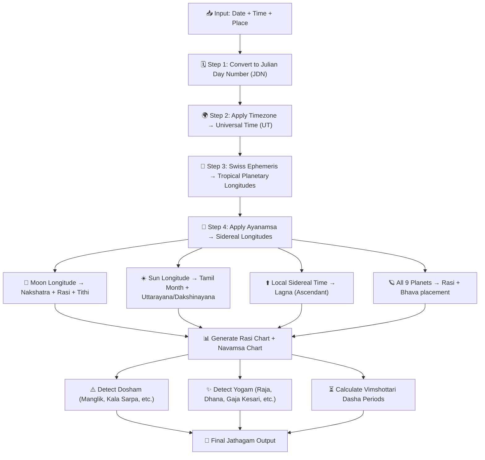
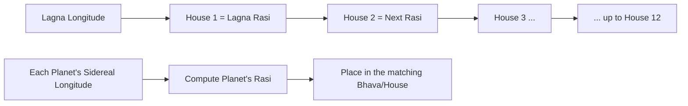
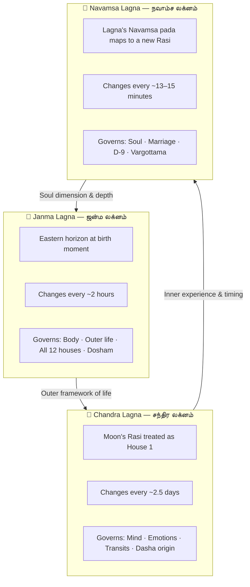

```mermaid
flowchart TD
    subgraph INPUT["📥 Input"]
        I1[Date of Birth]
        I2["Time of Birth → convert to UTC"]
        I3["Place of Birth → lat / lon"]
    end

    subgraph ENGINE["🔭 Astronomy Engine Layer"]
        E1["Swiss Ephemeris (server) OR astronomy-engine (browser)"]
        E2["EclipticLongitude() → Tropical longitudes: Sun + Moon + 5 planets"]
        E3["SiderealTime() → GAST → Local Sidereal Time → Lagna"]
        E4["PairLongitude(Moon, Sun) → Moon–Sun angle"]
        E5["MoonPhase() → Pournami / Amavasai"]
        E6["Meeus formula → Rahu (Mean Node) + Ketu opposite"]
    end

    subgraph AYAM["📐 Ayanamsa Correction"]
        A1["Subtract Lahiri Ayanamsa (≈24.13° in 2026)"]
        A2["ALL tropical longitudes → sidereal longitudes"]
    end

    subgraph DERIVED["🌟 Derived Values"]
        D1["Moon ÷ 13.333 → Nakshatra + Pada"]
        D2["Moon ÷ 30 → Janma Rasi = Chandra Lagna House 1"]
        D3["Moon–Sun angle ÷ 12 → Tithi (1–30)"]
        D4["Sun ÷ 30 → Tamil Month"]
        D5["LST + obliquity + latitude → Janma Lagna Rasi"]
        D6["Janma Lagna Navamsa pada → Navamsa Lagna Rasi"]
        D7["Each planet's Rasi → Bhava from Janma & Chandra Lagna"]
    end

    subgraph CHARTS["📊 Charts Generated"]
        C1["Rasi Chart D-1 — houses from Janma Lagna"]
        C2["Chandra Chart — houses from Moon Rasi"]
        C3["Navamsa Chart D-9 — houses from Navamsa Lagna"]
    end

    subgraph ANALYSIS["⚠️✨ Analysis"]
        AN1["Dosham: Manglik / KalaSarpa / Naga..."]
        AN2["Yogam: GajaKesari (from Moon) / Raja / Dhana..."]
        AN3["Vimshottari Dasha — from Moon Nakshatra"]
        AN4["Gocharam transits — counted from Chandra Lagna"]
    end

    INPUT --> ENGINE --> AYAM --> DERIVED --> CHARTS --> ANALYSIS --> OUT["📄 Complete Jathagam"]
```

import Highlight from "@/react/Highlight/Highlight.jsx";
import Tabs, { TabItem } from "@/react/Tabs/Tabs.jsx";

# Jathagam Guide - Part 0: What is Jathagam & How Machines Calculate It
# ஜாதகம் வழிகாட்டி - பாகம் 0: ஜாதகம் என்றால் என்ன? கணினி எப்படி கணக்கிடுகிறது?

Welcome to the **foundation article** of this entire series! Before learning what each planet means or how to read a chart, we must first understand — **what is Jathagam?** And in today's world, **how does software actually compute one?**

:::note[Series Navigation - தொடர் வழிகாட்டி]
📖 **Part 0 (This Article):** What is Jathagam & Modern Calculation — START HERE <br></br>
✅ **Part 1:** 27 Nakshatras <br></br>
✅ **Part 2A:** 12 Rashis <br></br>
✅ **Part 2B:** 9 Navagrahas & 12 Houses <br></br>
✅ **Part 3:** Vimshottari Dasha System <br></br>
✅ **Part 4A:** Chevvai Dosham & 7½ Sani <br></br>
✅ **Part 4B:** Kaal Sarpa & Other Doshas <br></br>
✅ **Part 5:** Yogas <br></br>
✅ **Part 6A:** Chart Reading + Marriage Compatibility <br></br>
✅ **Part 6B:** Career, Timing, Muhurtham, Practical Wisdom
:::

:::tip[What You Will Learn - இந்த கட்டுரையில்]
✅ What Jathagam is — spiritually and astronomically <br></br>
✅ Why birth time and place matter so much <br></br>
✅ How Julian Day Numbers work <br></br>
✅ How machines calculate Sun, Moon, planetary positions <br></br>
✅ What Ayanamsa is and why it is critical <br></br>
✅ How Nakshatra, Rasi, Tithi, Lagna are derived from raw numbers <br></br>
✅ How Dosham and Yogam are detected algorithmically <br></br>
✅ **Why the Moon's Rasi is called Chandra Lagna** <br></br>
✅ **What Navamsa Lagna is and how it differs from Janma Lagna** <br></br>
✅ **Why many calculations count "from the Moon"** <br></br>
✅ **Swiss Ephemeris vs astronomy-engine** — which JS library to use and how
:::

---

## <Highlight color='#800031' highlight='fg' fontWeight='bold'> WHAT IS JATHAGAM? — ஜாதகம் என்றால் என்ன? </Highlight>

### <Highlight color='#004080' highlight='fg' fontWeight='bold'> The Simple Definition </Highlight>

**Jathagam** (ஜாதகம்) — also called **Janma Kundali**, **Birth Chart**, or **Horoscope** — is a **sky map frozen at the exact moment of your birth**.

It records:
- Exactly **where each planet was** in the sky when you were born
- Which **zodiac sign was rising** on the eastern horizon (Lagna)
- How the **27 Nakshatras and 12 Rashis** were positioned relative to the Moon and Sun

This snapshot is then used to understand a person's **personality, strengths, challenges, timing of life events**, and **karma from past lives**.

:::info[ஜாதகத்தின் முகவுரை சுலோகம்]
The very first verse written on every traditional Jathagam says:

> **jananī janmasaukhyānāṃ vardhanī kulasaṃpadām** <br></br>
> **padavīṃ pūrvapuṇyānāṃ likhyate janmapatrikā**

*"This birth chart — mother of this life's joys, nurturer of the family's wealth, testament to past-life merits — is now being written."*

Every Jathagam is considered a sacred document, not merely an astrological tool.
:::

---

### <Highlight color='#004080' highlight='fg' fontWeight='bold'> Why Exactly Three Things Are Needed </Highlight>

To generate a Jathagam, **three inputs are mandatory**:

<div class="table-luxury-grid">

| Input | Why It Matters |
|-------|---------------|
| **Date of Birth** | Determines the positions of slow planets like Saturn, Jupiter, Rahu/Ketu — which move over months and years |
| **Time of Birth** | Determines the Lagna (Ascendant) — which changes every ~2 hours. A 15-minute error can shift the Lagna to a different Rasi entirely |
| **Place of Birth** | Determines the local sidereal time — essential for computing the exact Lagna at that location |

</div>

:::caution[நேரம் மிகவும் முக்கியம்!]
The **Lagna (Ascendant)** completes one full zodiac rotation every 24 hours — meaning it moves through all 12 Rashis in a day, spending roughly **2 hours in each sign**. An error of even 10–15 minutes in birth time can change the Lagna completely — making Dosham and Dasha calculations inaccurate.

Always use the **exact hospital clock time** when available.
:::

---

### <Highlight color='#004080' highlight='fg' fontWeight='bold'> Jathagam vs Western Horoscope — Key Difference </Highlight>

<div class="table-luxury-grid">

| Feature | Tamil Jathagam (Vedic) | Western Horoscope |
|---------|----------------------|-------------------|
| **Zodiac System** | Sidereal (star-based) | Tropical (Sun season-based) |
| **Ayanamsa** | Applied (Lahiri / KP / Raman) | Not applied |
| **Sun Sign Difference** | ~23 days earlier than Western | Fixed to seasons |
| **Primary Luminaries** | Moon sign (Janma Rasi) is primary | Sun sign is primary |
| **Chart Divisions** | 16 Divisional charts (Varga) | Mainly 1 chart |
| **Dasha System** | Vimshottari & others — time-lord periods | Not used |
| **Nakshatra** | 27 Nakshatras — central to prediction | Not used |

</div>

This is why a person who is a "Scorpio" in Western astrology may be a "Libra" in Tamil Jathagam. Neither is wrong — they use **different coordinate systems**.

---

## <Highlight color='#800031' highlight='fg' fontWeight='bold'> THE CALCULATION ENGINE — கணினி எப்படி கணக்கிடுகிறது? </Highlight>

### <Highlight color='#004080' highlight='fg' fontWeight='bold'> The Big Picture — What the Algorithm Does </Highlight>

When you enter your birth details into a Jathagam app, here is the complete computation pipeline:



Let us now walk through each step in detail.

---

### <Highlight color='#004080' highlight='fg' fontWeight='bold'> Step 1 — Julian Day Number (JDN) </Highlight>

The first thing any astrology engine does is convert your **calendar date and time into a Julian Day Number (JDN)** — a single continuous count of days since January 1, 4713 BCE (noon).

**Why Julian Day?** Because calendar systems change — Gregorian, Julian, proleptic — but the JDN is universal. All planetary position databases (including NASA's JPL DE430 and Swiss Ephemeris) index their data using JDN.

**Formula (simplified for Gregorian dates):**

```
JDN = 367×Y − INT(7×(Y + INT((M+9)/12))/4)
      + INT(275×M/9) + D + 1721013.5 + (UT/24)
```

Where Y = Year, M = Month, D = Day, UT = Universal Time in decimal hours.

**Example:**

> Birth: 15 August 1990, 10:30 AM IST, Chennai <br></br>
> IST = UT + 5:30 → UT = 10:30 − 5:30 = **05:00 UT** <br></br>
> JDN ≈ **2448118.708**

This single number now precisely identifies the moment of birth in astronomical time.

---

### <Highlight color='#004080' highlight='fg' fontWeight='bold'> Step 2 — Timezone to Universal Time (UT) </Highlight>

Every birth time must be converted to **Universal Time (UT / UTC)** before astronomical calculations.

<div class="table-luxury-grid">

| Country / Region | Offset from UT |
|-----------------|---------------|
| India (IST) | UT + 5:30 |
| Sri Lanka | UT + 5:30 |
| UK (GMT) | UT ± 0:00 |
| USA Eastern (EST) | UT − 5:00 |
| Singapore / Malaysia | UT + 8:00 |

</div>

:::caution[Historical Timezone Changes]
Before 1947, India used multiple local mean times — Madras Mean Time (UT + 5:21), Bombay Mean Time (UT + 4:51), and others. Good Jathagam software automatically handles these historical offsets for pre-independence birth dates.
:::

---

### <Highlight color='#004080' highlight='fg' fontWeight='bold'> Step 3 — Planetary Longitudes via Swiss Ephemeris </Highlight>

Once the JDN is known, the engine feeds it into a **planetary position library**.

**📌 The industry standard is Swiss Ephemeris (SE)** — an open-source, high-precision astronomy library originally developed by Astrodienst AG (Switzerland), based on NASA's JPL DE431 planetary dataset.

Swiss Ephemeris computes, for any JDN:
- The **ecliptic longitude** of each planet (0° to 360°)
- The **speed** (degrees/day) of each planet
- Whether the planet is in **retrograde** (moving backwards relative to Earth)

These longitudes are initially in the **Tropical zodiac** — measured from the **Vernal Equinox point (0° Aries)**, which is a seasonal reference tied to the Sun's position on the spring equinox.

<div class="table-luxury-grid">

| Planet | Symbol | Approx. Speed | Full Zodiac Tour |
|--------|--------|--------------|-----------------|
| Sun (சூரியன்) | ☀️ | ~1°/day | ~365 days |
| Moon (சந்திரன்) | 🌙 | ~13.2°/day | ~27.3 days |
| Mars (செவ்வாய்) | ♂ | ~0.5°/day | ~2 years |
| Mercury (புதன்) | ☿ | ~1.4°/day | ~1 year |
| Jupiter (குரு) | ♃ | ~0.083°/day | ~12 years |
| Venus (சுக்கிரன்) | ♀ | ~1.2°/day | ~1 year |
| Saturn (சனி) | ♄ | ~0.034°/day | ~29.5 years |
| Rahu (ராகு) | ☊ | ~0.053°/day retrograde | ~18.6 years |
| Ketu (கேது) | ☋ | Always 180° opposite Rahu | ~18.6 years |

</div>

**Rahu and Ketu** are not physical planets — they are the **lunar nodes**: the two points where the Moon's orbit crosses the Sun's ecliptic. Rahu is the north node (ascending), Ketu is the south node (descending). They are always exactly 180° apart and always retrograde.

**Gulika (குளிகை)** — a sub-planet of Saturn — is a **calculated point** (not an observed body) derived from Saturn's position and the weekday. It is traditionally used in Tamil astrology for Dosham assessment.

---

### <Highlight color='#004080' highlight='fg' fontWeight='bold'> Step 4 — Applying Ayanamsa (CRITICAL STEP) </Highlight>

:::danger[இது மிகவும் முக்கியம் — Without This, Everything Is Wrong!]
Western astronomy gives **Tropical longitudes** — measured from the seasonal equinox point.

Tamil Jathagam uses the **Sidereal zodiac** — measured from a fixed star background.

Over ~26,000 years, the Earth's axis slowly wobbles (called **Precession of the Equinoxes**). This means the tropical equinox point drifts westward against the stars by about **50.3 arc-seconds per year**. This accumulated drift since the ancient Vedic era is called the **Ayanamsa**.

**Formula:**
```
Sidereal Longitude = Tropical Longitude − Ayanamsa
```

As of 2026, Ayanamsa ≈ **24.13°** (Lahiri / Chitrapaksha)

Without applying Ayanamsa:
❌ Rasi will be shifted by ~24° — wrong sign entirely <br></br>
❌ Nakshatra will be wrong <br></br>
❌ Lagna will be wrong <br></br>
❌ Marriage compatibility will fail <br></br>
❌ Dosham detection will be inaccurate
:::

**Main Ayanamsa Systems:**

<div class="table-luxury-grid">

| Ayanamsa | Also Known As | Used By | Value (~2026) |
|----------|-------------|---------|--------------|
| **Lahiri** | Chitrapaksha | Most Indian astrologers, Govt. of India | ~24.13° |
| **KP (Krishnamurti)** | KP Ayanamsa | KP system practitioners | ~23.87° |
| **Raman** | B.V. Raman | Raman school | ~22.36° |
| **Yukteshwar** | Sri Yukteshwar | Paramahansa Yogananda tradition | ~22.28° |

</div>

Most Tamil Jathagam apps default to **Lahiri Ayanamsa**, which is the official standard recognised by the Government of India's Rashtriya Panchang.

---

## <Highlight color='#800031' highlight='fg' fontWeight='bold'> DERIVING JATHAGAM VALUES — கணக்கீட்டு விவரங்கள் </Highlight>

### <Highlight color='#004080' highlight='fg' fontWeight='bold'> Nakshatra — Moon's Star Position </Highlight>

The **27 Nakshatras** divide the full 360° zodiac into 27 equal segments:

```
Each Nakshatra = 360° ÷ 27 = 13°20′ = 13.3333°
```

**Algorithm:**

```
Nakshatra Index = Sidereal Moon Longitude ÷ 13.3333°
(Use the integer part + 1 for the Nakshatra number)
```

**Worked Example:**

> Sidereal Moon Longitude = **128.45°** <br></br>
> 128.45 ÷ 13.3333 = **9.63** <br></br>
> Integer part = 9 → 9 + 1 = **10th Nakshatra** <br></br>
> → **Magha (மகம்)** ⭐

<div class="table-luxury-grid">

| Nakshatra # | Name (Tamil) | Range (Sidereal) |
|-------------|-------------|-----------------|
| 1 | Ashwini (அஸ்வினி) | 0°00′ – 13°20′ |
| 2 | Bharani (பரணி) | 13°20′ – 26°40′ |
| 3 | Krittika (கார்த்திகை) | 26°40′ – 40°00′ |
| 4 | Rohini (ரோகிணி) | 40°00′ – 53°20′ |
| 5 | Mrigashira (மிருகசீரிஷம்) | 53°20′ – 66°40′ |
| 6 | Ardra (திருவாதிரை) | 66°40′ – 80°00′ |
| 7 | Punarvasu (புனர்பூசம்) | 80°00′ – 93°20′ |
| 8 | Pushya (பூசம்) | 93°20′ – 106°40′ |
| 9 | Ashlesha (ஆயில்யம்) | 106°40′ – 120°00′ |
| **10** | **Magha (மகம்)** | **120°00′ – 133°20′** |
| 11 | Purva Phalguni (பூரம்) | 133°20′ – 146°40′ |
| 12 | Uttara Phalguni (உத்திரம்) | 146°40′ – 160°00′ |
| ... | ... | ... |
| 27 | Revati (ரேவதி) | 346°40′ – 360°00′ |

</div>

Each Nakshatra is further divided into **4 Padas (quarters)** of 3°20′ each — giving 108 Padas total, which corresponds to the **108 beads of a Japa Mala**.

---

### <Highlight color='#004080' highlight='fg' fontWeight='bold'> Rasi — Moon Sign (Janma Rasi) </Highlight>

The **12 Rashis** divide 360° into 12 equal segments of 30° each:

```
Rasi Index = Sidereal Moon Longitude ÷ 30°
(Use integer part + 1 for Rasi number)
```

**Worked Example:**

> Sidereal Moon Longitude = **128.45°** <br></br>
> 128.45 ÷ 30 = **4.28** <br></br>
> Integer part = 4 → 4 + 1 = **5th Rasi** <br></br>
> → **Simha / Simham (சிம்மம்)** 🦁

<div class="table-luxury-grid">

| Rasi # | Tamil Name | Sanskrit | Symbol | Range |
|--------|-----------|----------|--------|-------|
| 1 | மேஷம் | Mesha | ♈ Ram | 0° – 30° |
| 2 | ரிஷபம் | Vrishabha | ♉ Bull | 30° – 60° |
| 3 | மிதுனம் | Mithuna | ♊ Twins | 60° – 90° |
| 4 | கடகம் | Kataka | ♋ Crab | 90° – 120° |
| **5** | **சிம்மம்** | **Simha** | ♌ Lion | **120° – 150°** |
| 6 | கன்னி | Kanya | ♍ Maiden | 150° – 180° |
| 7 | துலாம் | Tula | ♎ Scales | 180° – 210° |
| 8 | விருச்சிகம் | Vrischika | ♏ Scorpion | 210° – 240° |
| 9 | தனுசு | Dhanus | ♐ Archer | 240° – 270° |
| 10 | மகரம் | Makara | ♑ Goat | 270° – 300° |
| 11 | கும்பம் | Kumbha | ♒ Pot | 300° – 330° |
| 12 | மீனம் | Meena | ♓ Fish | 330° – 360° |

</div>

:::tip[Janma Rasi vs Sun Sign]
In Tamil Jathagam, the **Moon sign (Janma Rasi)** is the primary identity sign — not the Sun sign. This is why Tamil people say "நான் கடக ராசி" (I am Kataka Rasi) based on their Moon's position, not the Sun's.
:::

---

### <Highlight color='#004080' highlight='fg' fontWeight='bold'> Tithi — Lunar Day </Highlight>

A **Tithi** is a lunar day, calculated not from the clock but from the **angle between the Moon and the Sun**:

```
Moon–Sun Angle = Sidereal Moon Longitude − Sidereal Sun Longitude
(If negative, add 360°)

Tithi Number = (Moon–Sun Angle) ÷ 12°
(Integer part + 1 gives the Tithi)
```

**Example:**

> Moon = 128.45°, Sun = 118.20° <br></br>
> Angle = 128.45 − 118.20 = **10.25°** <br></br>
> 10.25 ÷ 12 = 0.854 → Integer 0 + 1 = **1st Tithi → Prathama (பிரதமை)**

There are **30 Tithis** in a lunar month — 15 in the **Shukla Paksha** (waxing Moon) and 15 in the **Krishna Paksha** (waning Moon).

---

### <Highlight color='#004080' highlight='fg' fontWeight='bold'> Tamil Month — From Sun Longitude </Highlight>

The **Tamil Solar Calendar** month is determined by the Sun's sidereal longitude:

```
Tamil Month Index = Sidereal Sun Longitude ÷ 30°
(Integer part + 1 = month number)
```

<div class="table-luxury-grid">

| Month # | Tamil Month | Sun Range (Sidereal) | Approx. English Dates |
|---------|------------|---------------------|----------------------|
| 1 | சித்திரை (Chithirai) | 0° – 30° | Apr 14 – May 14 |
| 2 | வைகாசி (Vaikasi) | 30° – 60° | May 15 – Jun 14 |
| 3 | ஆனி (Aani) | 60° – 90° | Jun 15 – Jul 16 |
| 4 | ஆடி (Aadi) | 90° – 120° | Jul 17 – Aug 16 |
| 5 | ஆவணி (Avani) | 120° – 150° | Aug 17 – Sep 16 |
| 6 | புரட்டாசி (Purattasi) | 150° – 180° | Sep 17 – Oct 17 |
| 7 | ஐப்பசி (Aippasi) | 180° – 210° | Oct 18 – Nov 16 |
| 8 | கார்த்திகை (Karthigai) | 210° – 240° | Nov 17 – Dec 15 |
| 9 | மார்கழி (Margazhi) | 240° – 270° | Dec 16 – Jan 13 |
| 10 | தை (Thai) | 270° – 300° | Jan 14 – Feb 12 |
| 11 | மாசி (Masi) | 300° – 330° | Feb 13 – Mar 14 |
| 12 | பங்குனி (Panguni) | 330° – 360° | Mar 15 – Apr 13 |

</div>

**Uttarayana / Dakshinayana:**
- When Sun crosses 270° (enters Thai) → **Uttarayana begins** (January 14, Thai Pongal) — Sun's northward journey, auspicious
- When Sun crosses 90° (enters Aadi) → **Dakshinayana begins** — Sun's southward journey

---

### <Highlight color='#004080' highlight='fg' fontWeight='bold'> Lagna — The Ascendant </Highlight>

The **Lagna (Ascendant)** is the zodiac sign rising on the **eastern horizon** at the moment of birth. It changes every ~2 hours and is highly location-specific.

**Algorithm:**

```
1. Compute Greenwich Sidereal Time (GST) from JDN
2. Add birth place's longitude offset → Local Sidereal Time (LST)
3. Convert LST to the ecliptic degree rising on the horizon
   (using the birth place's geographic latitude for obliquity correction)
4. Apply Ayanamsa → Sidereal Lagna longitude
5. Lagna Rasi = Sidereal Lagna longitude ÷ 30° (integer + 1)
```

This is why **place of birth is mandatory** — the same moment of birth in Chennai vs New York will produce completely different Lagnas.

---

### <Highlight color='#004080' highlight='fg' fontWeight='bold'> Bhava Placement — Assigning Planets to Houses </Highlight>

Once all **9 planet longitudes** (sidereal) and the **Lagna longitude** are known:



In the **Equal House system** (used in most Tamil Jathagam):
- House 1 = Lagna Rasi and the 30° segment containing the Lagna degree
- Houses 2–12 = the 11 successive Rashis

Each planet falls into whichever 30° Rasi segment contains its longitude, and that determines its house.

---

## <Highlight color='#800031' highlight='fg' fontWeight='bold'> CHARTS GENERATED — எந்த வரைபடங்கள் உருவாகும்? </Highlight>

### <Highlight color='#004080' highlight='fg' fontWeight='bold'> Rasi Chart (ராசி சக்கரம்) </Highlight>

The **Rasi Chart** (D-1 chart) is the **primary birth chart** — it shows:
- All 9 planets placed in their Rasi (zodiac sign)
- The Lagna (Ascendant) marked
- Their house positions (Bhava) from the Lagna

This is the chart most people see first and the one used for all basic readings.

**Tamil Chart Format** (South Indian style): A fixed grid of 12 boxes. Rasis are fixed in position — Mesha always top-middle-left, going clockwise. The Lagna and planets are written inside the appropriate boxes.

---

### <Highlight color='#004080' highlight='fg' fontWeight='bold'> Navamsa Chart (நவாம்சம் / D-9) </Highlight>

The **Navamsa Chart** is the second most important chart — used for:
- **Marriage compatibility** (primary use)
- **Strength of planets** — a planet weak in Rasi but strong in Navamsa still performs well
- **After age 35**, Navamsa gains more weight than the Rasi chart

**How it is calculated:**

Each Rasi (30°) is divided into **9 Navamsa segments** of 3°20′ each. A planet's Navamsa position is determined by which 3°20′ segment it falls in within its Rasi, mapped to a new Rasi sequence.

```
Navamsa Index = (Sidereal Planet Longitude mod 30°) ÷ 3.3333°
→ Integer gives the Navamsa pada (0–8)
→ Mapped to 12 Rashis in a fixed cycle
```

---

## <Highlight color='#800031' highlight='fg' fontWeight='bold'> DOSHAM DETECTION — தோஷம் கண்டறிதல் </Highlight>

### <Highlight color='#004080' highlight='fg' fontWeight='bold'> How Software Detects Dosham </Highlight>

Once planetary house positions are known, Dosham detection is straightforward rule-based logic:

**1. Manglik Dosham (செவ்வாய் தோஷம்)**

```
IF Mars (Chevvai) is in House 1, 2, 4, 7, 8, or 12
  → Manglik Dosham detected

(Some systems also check Navamsa chart for confirmation)
```

<div class="table-luxury-grid">

| House | Traditional View | Effect |
|-------|----------------|--------|
| 1st | Self / Body | Aggressive personality in marriage |
| 2nd | Family / Speech | Discord in family life |
| 4th | Home / Happiness | Domestic unhappiness |
| 7th | Spouse (direct) | Most critical — spouse's health & longevity |
| 8th | Longevity of spouse | Separation or loss |
| 12th | Bed pleasures / Sleep | Marital dissatisfaction |

</div>

**Exceptions in software:** Many apps apply traditional exceptions — if Mars is in Aries, Scorpio, Capricorn, or Cancer (its own / exalted signs); or if Jupiter aspects the 7th house — the Dosham may be partially cancelled. These are programmed as conditional rules.

---

**2. Kala Sarpa Dosham (காலசர்ப்ப தோஷம்)**

```
IF all 7 planets (Sun, Moon, Mars, Mercury, Jupiter, Venus, Saturn)
   are within the 180° arc from Rahu to Ketu (in Rahu's forward direction)
   AND no planet is in the remaining 180° arc
→ Kala Sarpa Dosham
```


**12 types** of Kala Sarpa are named based on which houses Rahu and Ketu occupy (Ananta, Kulika, Vasuki, etc.).

---

**3. Naga Dosham (நாக தோஷம்)**

```
IF Rahu or Ketu is in House 1, 2, 5, 7, or 9
→ Naga Dosham considered
```

---

**4. Rahu–Ketu Dosham**

```
IF Rahu or Ketu conjoins the Moon, Sun, or Lagna lord
→ Various shadow planet afflictions detected
```

---

## <Highlight color='#800031' highlight='fg' fontWeight='bold'> YOGAM DETECTION — யோகம் கண்டறிதல் </Highlight>

### <Highlight color='#004080' highlight='fg' fontWeight='bold'> How Software Detects Yogam </Highlight>

Yogams are **auspicious planetary combinations** — also detected as rule-based algorithms after house placement is complete.

**1. Gaja Kesari Yogam (கஜகேசரி யோகம்)**

```
IF Jupiter is in House 1, 4, 7, or 10 from the Moon
  (i.e., in Kendra from Moon)
→ Gaja Kesari Yogam
```

This is one of the most common and celebrated Yogams — grants intelligence, fame, and prosperity.

---

**2. Raja Yogam (ராஜ யோகம்)**

```
IF the lord of a Kendra house (1, 4, 7, 10)
   conjoins or mutually aspects the lord of a Trikona house (1, 5, 9)
→ Raja Yogam formed
```

The 1st house lord counts as both Kendra and Trikona, making it especially powerful.

---

**3. Dhana Yogam (தன யோகம்)**

```
IF lords of Houses 1, 2, 5, 9, or 11
   are in mutual conjunction, aspect, or exchange
→ Dhana Yogam (wealth-generating combination)
```

---

**4. Pancha Mahapurusha Yogam (பஞ்ச மகாபுருஷ யோகம்)**

Five separate Yogams, one for each of the five non-luminary planets:

<div class="table-luxury-grid">

| Yogam | Planet | Condition |
|-------|--------|-----------|
| **Ruchaka** | Mars | In Aries/Scorpio/Capricorn in Kendra (1,4,7,10) |
| **Bhadra** | Mercury | In Gemini/Virgo in Kendra |
| **Hamsa** | Jupiter | In Cancer/Sagittarius/Pisces in Kendra |
| **Malavya** | Venus | In Taurus/Libra/Pisces in Kendra |
| **Shasha** | Saturn | In Capricorn/Aquarius/Libra in Kendra |

</div>

Each grants extraordinary qualities of that planet — Ruchaka gives military prowess, Hamsa gives wisdom, Malavya gives beauty and luxury, etc.

---

## <Highlight color='#800031' highlight='fg' fontWeight='bold'> THREE TYPES OF LAGNA — மூன்று வகை லக்னங்கள் </Highlight>

### <Highlight color='#004080' highlight='fg' fontWeight='bold'> What is Lagna? — லக்னம் என்றால் என்ன? </Highlight>

The word **Lagna** (லக்னம்) comes from the Sanskrit root *lag* — **to attach, to rise, to be fixed at a point**. In Jathagam, a Lagna is not just a point in the sky — it is a **reference anchor** from which all 12 houses are counted and all predictions flow.

There are three Lagnas that every good Jathagam reading considers:

<div class="table-luxury-grid">

| Lagna | Tamil | Based On | Changes Every | Primary Governs |
|-------|-------|---------|--------------|----------------|
| **Janma Lagna** | ஜன்ம லக்னம் | Eastern horizon at birth | ~2 hours | Body, outer life, house framework |
| **Chandra Lagna** | சந்திர லக்னம் | Moon's Rasi at birth | ~2.5 days | Mind, emotions, transits, Dasha timing |
| **Navamsa Lagna** | நவாம்ச லக்னம் | Lagna's Navamsa pada position | ~13–15 minutes | Soul's path, marriage, D-9 chart |

</div>

---

### <Highlight color='#004080' highlight='fg' fontWeight='bold'> Janma Lagna — The Horizon Lagna </Highlight>

This is the **primary Lagna** most people know — the zodiac sign rising on the eastern horizon at the exact birth moment, computed from Local Sidereal Time and birth latitude.

**It governs:** physical body and appearance, personality, the 12-house framework, house lordships — all Dosham and Yogam calculations begin here.

---

### <Highlight color='#004080' highlight='fg' fontWeight='bold'> Chandra Lagna — Why the Moon's Rasi Becomes a Lagna </Highlight>

The **Chandra Lagna (சந்திர லக்னம்)** treats the **Moon's natal Rasi as House 1** and re-counts all 12 houses from there. This gives a completely different house framework from the Janma Lagna chart.

**But why does the Moon get Lagna status at all?**

:::info[சந்திரன் ஏன் லக்னமாகிறது? — The Philosophy]
In Vedic thought the **Moon (Chandran) is the Manas** — the mind, the experiential self. It is the fastest-moving graha, completing a full zodiac tour in just 27.3 days, and it is the closest celestial body to Earth. This means the Moon is the **most personally responsive** planet — it reflects your emotional reality moment to moment.

The ancient Rishis drew a crucial distinction:

- **Janma Lagna** = the *body* and *outer circumstances* you were born into
- **Chandra Lagna** = the *inner world* — what you actually *feel*, *experience*, and *react to*

So Chandra Lagna is not a replacement for Janma Lagna — it is a **parallel experiential lens** on the same chart. A planet that harms House 6 from Janma Lagna may be simultaneously blessing House 9 from Chandra Lagna. A skilled astrologer weighs both.

Most importantly: **Vimshottari Dasha** — the primary timing system of Tamil Jathagam — is computed entirely from the **Moon's Nakshatra at birth**. The Moon's position determines which planetary period (Dasha) you are born into, and how long it runs. This is why the Moon is considered the single most important planet for prediction.
:::

**How to apply Chandra Lagna house counting:**

```
Chandra Lagna house of any planet =
  ((Planet's Rasi number − Moon's Rasi number + 12) mod 12) + 1
```

**Example:** Moon in Simha (Rasi 5), Jupiter in Vrischika (Rasi 8):
- Jupiter's Chandra Lagna house = ((8 − 5 + 12) mod 12) + 1 = **4th house from Moon**
- Since the 4th house is a Kendra → **Gaja Kesari Yogam** is formed!

**Key predictions that use Chandra Lagna:**

<div class="table-luxury-grid">

| Prediction | Why Chandra Lagna | Example |
|-----------|-----------------|---------|
| **Gaja Kesari Yogam** | Jupiter must be in Kendra (1,4,7,10) **from Moon** | Not from Janma Lagna |
| **Ezhara Sani (7½ Sani)** | Saturn transiting 12th, 1st, 2nd **from Moon Rasi** | The most feared Saturn transit |
| **Jupiter annual transit** | Jupiter's Rasi movement counted from Moon | E.g., "Jupiter in 5th from Moon → Putra Bhagya" |
| **Sunapha Yoga** | Planet in 2nd **from Moon** (excluding Sun) | Wealth, intelligence |
| **Anapha Yoga** | Planet in 12th **from Moon** (excluding Sun) | Dignity, renown |
| **Chandra Mangala Yoga** | Mars in 1st or 7th **from Moon** | Wealth from business |
| **Vimshottari Dasha** | Starts from Moon's Nakshatra at birth | Entire life timeline |

</div>

---

### <Highlight color='#004080' highlight='fg' fontWeight='bold'> Moon-to-Sun Position — Why the Angle Between Them Matters </Highlight>

Beyond the Moon's individual position, the **angular relationship between Moon and Sun** is the backbone of the entire Tamil lunar calendar and many astrological calculations:

```
Moon–Sun Angle = (Sidereal Moon Longitude − Sidereal Sun Longitude + 360) mod 360°
```

This single angle drives:

<div class="table-luxury-grid">

| Calculation | How Moon–Sun Angle Is Used |
|------------|--------------------------|
| **Tithi (lunar day)** | Each 12° of Moon–Sun angle = 1 Tithi (30 Tithis per lunar month) |
| **Paksha (fortnight)** | 0°–180° = Shukla Paksha (வளர் பிறை, waxing); 180°–360° = Krishna Paksha (தேய் பிறை, waning) |
| **Pournami (Full Moon)** | Moon–Sun angle = 180° exactly |
| **Amavasai (New Moon)** | Moon–Sun angle = 0° (or 360°) |
| **Chandrashtama** | Moon transiting 8th from natal Moon — considered inauspicious for new ventures |
| **Yoga (Panchangam)** | (Moon longitude + Sun longitude) ÷ 13.333° → 27 Yogas of the day |
| **Karana** | Each half-Tithi (6° of Moon–Sun angle) = 1 Karana; 11 types |

</div>

The five elements of the **Panchangam** (Tamil almanac) — Vara (weekday), Tithi, Nakshatra, Yoga, Karana — all derive from planetary longitudes, with the Moon–Sun angle providing three of the five directly.

---

### <Highlight color='#004080' highlight='fg' fontWeight='bold'> Navamsa Lagna — The Soul's Lagna </Highlight>

The **Navamsa Lagna (நவாம்ச லக்னம்)** is the Ascendant of the **D-9 (Navamsa) divisional chart** — the second most important chart in all of Vedic astrology.

**Why does the D-9 chart have its own Lagna?**

Each Rasi (30°) is divided into **9 Navamsa segments** of 3°20′ each. The Janma Lagna degree falls into one of these nine segments, which maps to a new Rasi — that becomes the Navamsa Lagna.

**Calculation logic:**

```
Step 1: Janma Lagna sidereal longitude (e.g., 47.5°)
Step 2: Which Rasi? → Vrishabha (30°–60°), so offset = 47.5° − 30° = 17.5° into Vrishabha
Step 3: Navamsa pada = floor(17.5° ÷ 3.3333°) = pada 5 (0-indexed)

Step 4: Starting Rasi for the Navamsa sequence — determined by the element of the Lagna Rasi:
  🔥 Fire  (Mesha, Simha, Dhanus)   → sequence starts from Mesha  (Rasi 1)
  🌍 Earth (Vrishabha, Kanya, Makara) → sequence starts from Makara (Rasi 10)
  💨 Air   (Mithuna, Tula, Kumbha)  → sequence starts from Tula   (Rasi 7)
  💧 Water (Kataka, Vrischika, Meena) → sequence starts from Kataka (Rasi 4)

Step 5: Count 'pada' steps from the starting Rasi → that is the Navamsa Lagna Rasi
```

**Example:** Lagna in Vrishabha (Earth sign), pada 5 → start from Makara (10), count 5 → Mithuna (Rasi 3) → **Navamsa Lagna = Mithuna**

The Navamsa Lagna changes approximately every **13–15 minutes** — making it the most time-sensitive point in the Jathagam. Even a 5-minute birth time error can shift the Navamsa Lagna entirely, changing the marriage compatibility analysis.

**What Navamsa Lagna governs:**

<div class="table-luxury-grid">

| Aspect | Navamsa Lagna Role |
|--------|-------------------|
| **Marriage** | The Navamsa chart is the primary tool for analysing marriage timing, partner's nature, and marital happiness |
| **Planetary strength** | A planet in its own or exalted Navamsa sign performs strongly even if weakened in the Rasi chart |
| **After age 35** | The Navamsa chart increasingly dominates life experience as the person matures |
| **Soul's dharma** | Reveals the deeper spiritual purpose behind the person's incarnation |
| **Vargottama planets** | Planet in same Rasi in both D-1 and D-9 → extremely powerful |

</div>

:::tip[வர்கோத்தம கிரகம் — Vargottama Planet]
When a planet occupies the **same Rasi in both the Rasi chart (D-1) and the Navamsa chart (D-9)**, it is called **Vargottama** (வர்கோத்தம — "best of its division"). Such a planet is extraordinarily powerful — it functions as if exalted even in an ordinary sign. Example: Saturn in Makara in both D-1 and D-9 is Vargottama and delivers its results with exceptional strength and reliability.
:::

---

### <Highlight color='#004080' highlight='fg' fontWeight='bold'> All Three Lagnas — The Complete Picture </Highlight>



A Jathagam that ignores Chandra Lagna misses the emotional truth. One that ignores Navamsa Lagna cannot properly assess marriage or planetary strength. Professional astrologers use all three simultaneously.

---

## <Highlight color='#800031' highlight='fg' fontWeight='bold'> THE SOFTWARE ENGINES — எந்த மென்பொருள் பயன்படுத்தப்படுகிறது? </Highlight>

### <Highlight color='#004080' highlight='fg' fontWeight='bold'> Swiss Ephemeris — The Professional Standard </Highlight>

**Swiss Ephemeris (SE)** is the undisputed gold standard for serious Jathagam software worldwide — developed by Astrodienst AG (Switzerland), built on NASA's JPL DE431/DE440 planetary data.

<div class="table-luxury-grid">

| Feature | Swiss Ephemeris |
|---------|----------------|
| **Accuracy** | ±1 arc-second (3600× more precise than 1°) |
| **Date range** | 2400 BCE to 3400 CE — covers all historical Jathagams |
| **Languages** | C library with bindings for Python (`pyswisseph`), Java, .NET, Node.js (`swisseph` npm) |
| **Ayanamsa** | All major systems built-in: Lahiri, KP, Raman, Yukteshwar, Fagan-Bradley |
| **Rahu/Ketu** | Built-in as `SE_MEAN_NODE` and `SE_TRUE_NODE` |
| **Gulika** | Computable via Saturn's arc method |
| **License** | AGPL (free for open-source) or commercial license |
| **Used by** | Astrosage, Astro-Vision, Jagannatha Hora, Shri Jyoti Star, Prokerala, virtually all professional apps |

</div>

**Using Swiss Ephemeris in Node.js:**

```javascript
// npm install swisseph
const swisseph = require('swisseph');

// Set path to ephemeris data files (downloaded separately)
swisseph.swe_set_ephe_path('/path/to/ephe');

// Set Ayanamsa — Lahiri (SIDM_LAHIRI = 1)
swisseph.swe_set_sid_mode(swisseph.SE_SIDM_LAHIRI, 0, 0);

// Birth: 15 Aug 1990, 05:00 UTC → Julian Day
const jd = swisseph.swe_julday(1990, 8, 15, 5.0, swisseph.SE_GREG_CAL);
// jd ≈ 2448118.708

// Get Moon's sidereal longitude directly
const moonResult = swisseph.swe_calc_ut(jd, swisseph.SE_MOON, swisseph.SEFLG_SIDEREAL);
// moonResult.longitude → sidereal Moon longitude in degrees (e.g., 128.45°)

// Get Rahu (Mean Node) — sidereal
const rahuResult = swisseph.swe_calc_ut(jd, swisseph.SE_MEAN_NODE, swisseph.SEFLG_SIDEREAL);
// Ketu = (rahuResult.longitude + 180) % 360

// Get Lagna (Ascendant) — needs lat/lon
// Chennai: lat=13.08, lon=80.27
const houses = swisseph.swe_houses(jd, 13.08, 80.27, 'P'); // 'P' = Placidus; 'E' = Equal
// houses.ascendant → tropical Lagna degree
// For sidereal: subtract Ayanamsa from houses.ascendant
```

:::caution[Swiss Ephemeris ஏன் browser-ல் இயங்காது?]
Swiss Ephemeris is a **C library** — it cannot run directly in a browser. For server-side Node.js use `swisseph` npm package. For browser use, you need either a WASM compilation (complex to set up) or an API call to a server-side endpoint. This is why `astronomy-engine` was created as a browser-native alternative.
:::

---

### <Highlight color='#004080' highlight='fg' fontWeight='bold'> astronomy-engine — The JavaScript-Native Alternative </Highlight>

[`astronomy-engine`](https://github.com/cosinekitty/astronomy) by Don Cross is an MIT-licensed library that runs natively **in any browser or Node.js with zero dependencies** — no data files, no native bindings, no server required.

:::info[astronomy-engine — Key Facts]
- **Accuracy:** ±1 arcminute — good enough for all standard Jathagam output
- **Bundle size:** ~116 KB minified — loads in any browser
- **Languages:** JavaScript, TypeScript, C, C#, Python, Kotlin — same algorithm across all
- **Underlying models:** VSOP87 (planets) + NOVAS C 3.1 (Naval Observatory standard)
- **No dependencies:** Ships as a single file — `npm install astronomy-engine`, import, done
- **Validated against:** NOVAS, JPL Horizons — rigorously tested
- **License:** MIT — free for all use including commercial
:::

**Install:**

```bash
npm install astronomy-engine
```

**Import:**

```typescript
import * as Astronomy from 'astronomy-engine';   // ESM / TypeScript
// or
const Astronomy = require('astronomy-engine');   // CommonJS
```

---

### <Highlight color='#004080' highlight='fg' fontWeight='bold'> astronomy-engine — Key API for Jathagam </Highlight>

**The AstroTime object — your time anchor:**

```typescript
// All calculations need an AstroTime built from a UTC Date
// ⚠️  JavaScript Date months are 0-indexed: August = 7
const birthDate = new Date(Date.UTC(1990, 7, 15, 5, 0, 0));  // 15 Aug 1990, 05:00 UTC
const t = Astronomy.MakeTime(birthDate);

// t.ut   → days since J2000 epoch (Universal Time)
// t.tt   → Terrestrial Time (continuous, used in formulas)
// t.date → the original JS Date
```

**Planetary tropical longitudes:**

```typescript
// EclipticLongitude returns TROPICAL longitude (0°–360°) for any body
const moonTrop = Astronomy.EclipticLongitude(Astronomy.Body.Moon,    t);
const sunTrop  = Astronomy.EclipticLongitude(Astronomy.Body.Sun,     t);
const marsTrop = Astronomy.EclipticLongitude(Astronomy.Body.Mars,    t);
const mercTrop = Astronomy.EclipticLongitude(Astronomy.Body.Mercury, t);
const jupTrop  = Astronomy.EclipticLongitude(Astronomy.Body.Jupiter, t);
const venTrop  = Astronomy.EclipticLongitude(Astronomy.Body.Venus,   t);
const satTrop  = Astronomy.EclipticLongitude(Astronomy.Body.Saturn,  t);

// ⚠️ These are TROPICAL — must subtract Ayanamsa to get sidereal
```

**Applying Ayanamsa (tropical → sidereal):**

```typescript
// Lahiri Ayanamsa — linear approximation (accurate to ±0.1°)
// Full polynomial formula is used in production apps
function lahiriAyanamsa(year: number): number {
  // Reference: 23.85° at J2000 (year 2000.0)
  // Precession rate: ~50.3 arc-seconds/year = 0.01397°/year
  return 23.85 + (year - 2000) * 0.01397;
}

function toSidereal(tropical: number, ayam: number): number {
  return ((tropical - ayam) + 360) % 360;  // always keep in 0°–360°
}

const ayam = lahiriAyanamsa(1990);           // ≈ 23.71°
const moonSidereal = toSidereal(moonTrop, ayam);
// e.g., 152.58° − 23.71° = 128.87° sidereal
```

**Tithi — using PairLongitude:**

```typescript
// PairLongitude is the built-in Moon–Sun angular separation
const moonSunAngle = Astronomy.PairLongitude(
  Astronomy.Body.Moon,
  Astronomy.Body.Sun,
  t
);  // Returns 0°–360°

const tithi     = Math.floor(moonSunAngle / 12) + 1;  // 1–30
const isShukla  = moonSunAngle < 180;   // waxing / வளர் பிறை
const isPournami = Math.abs(moonSunAngle - 180) < 6;  // Full Moon window
const isAmavasai = moonSunAngle < 6 || moonSunAngle > 354; // New Moon window
```

**Moon phase:**

```typescript
// MoonPhase returns 0°–360°
// 0° = New Moon (Amavasai), 180° = Full Moon (Pournami)
const phase = Astronomy.MoonPhase(t);

// Find next full moon after birth
const nextPournami = Astronomy.SearchMoonPhase(180, t, 30);
```

**Rahu and Ketu (Lunar Nodes):**

`astronomy-engine` does not provide Rahu/Ketu as named bodies. Use the standard astronomical formula:

```typescript
// J. Meeus formula for Moon's Mean Ascending Node (Rahu) — tropical
function rahuTropical(t: Astronomy.AstroTime): number {
  const T = t.tt / 36525.0;   // Julian centuries from J2000
  const omega = 125.04452
    - 1934.136261 * T
    +    0.0020708 * T * T
    + T * T * T / 450000.0;
  return ((omega % 360) + 360) % 360;
}

const rahuSidereal = toSidereal(rahuTropical(t), ayam);
const ketuSidereal = (rahuSidereal + 180) % 360;  // always 180° from Rahu
```

**Local Sidereal Time — for Lagna computation:**

```typescript
// SiderealTime returns Greenwich Apparent Sidereal Time (GAST) in hours (0–24)
const gast = Astronomy.SiderealTime(t);

// Local Sidereal Time (LST) for Chennai (longitude 80.27°E)
// East longitude adds time; West subtracts
const lstHours   = (gast + 80.27 / 15) % 24;
const lstDegrees = lstHours * 15;   // Convert to degrees (0°–360°)

// LST is the RAMC (Right Ascension of Midheaven) — the MC of the chart
// True Lagna requires converting this to ecliptic using the obliquity of the ecliptic
// For a rough approximation at equatorial latitudes:
//   Lagna tropical ≈ (LST + 90°) mod 360°
// Production apps use the full swe_houses() equivalent formula
```

**Sunrise — for Nalla Neram and Rahu Kalam:**

```typescript
const observer = new Astronomy.Observer(13.08, 80.27, 10);  // Chennai

const sunrise = Astronomy.SearchRiseSet(
  Astronomy.Body.Sun,
  observer,
  +1,        // +1 = rise, -1 = set
  t,
  1          // search within 1 day
);
// sunrise.date → the exact sunrise moment

// Rahu Kalam and Yamagandam are calculated as fixed fractions
// of the day duration from sunrise
```

---

### <Highlight color='#004080' highlight='fg' fontWeight='bold'> Complete Jathagam Engine — astronomy-engine in TypeScript </Highlight>

A minimal but functional Jathagam calculation engine using only `astronomy-engine`:

```typescript
import * as Astronomy from 'astronomy-engine';

// ── Constants ─────────────────────────────────────────────────
const NAKSHATRA_SPAN = 360 / 27;   // 13.3333°
const RASI_SPAN = 30;

const NAKSHATRA_NAMES = [
  "Ashwini","Bharani","Krittika","Rohini","Mrigashira","Ardra",
  "Punarvasu","Pushya","Ashlesha","Magha","Purva Phalguni",
  "Uttara Phalguni","Hasta","Chitra","Swati","Vishakha","Anuradha",
  "Jyeshtha","Moola","Purva Ashadha","Uttara Ashadha","Shravana",
  "Dhanishtha","Shatabhisha","Purva Bhadrapada","Uttara Bhadrapada","Revati"
];

const RASI_NAMES = [
  "Mesha","Vrishabha","Mithuna","Kataka","Simha","Kanya",
  "Tula","Vrischika","Dhanus","Makara","Kumbha","Meena"
];

const TAMIL_MONTHS = [
  "Chithirai","Vaikasi","Aani","Aadi","Avani","Purattasi",
  "Aippasi","Karthigai","Margazhi","Thai","Masi","Panguni"
];

// ── Helpers ───────────────────────────────────────────────────
const lahiriAyanamsa = (year: number) => 23.85 + (year - 2000) * 0.01397;
const toSidereal = (lon: number, ayam: number) => ((lon - ayam) + 360) % 360;
const getRasiNum = (lon: number) => Math.floor(lon / RASI_SPAN);  // 0-indexed

function getNakshatra(siderealMoon: number) {
  const idx  = Math.floor(siderealMoon / NAKSHATRA_SPAN);
  const rem  = siderealMoon % NAKSHATRA_SPAN;
  const pada = Math.floor(rem / (NAKSHATRA_SPAN / 4)) + 1;
  return { number: idx + 1, name: NAKSHATRA_NAMES[idx], pada };
}

// Rahu Mean Node (Meeus formula — tropical)
function rahuTropical(t: Astronomy.AstroTime): number {
  const T = t.tt / 36525;
  return ((125.04452 - 1934.136261*T + 0.0020708*T*T + T*T*T/450000) % 360 + 360) % 360;
}

// ── Main Engine ───────────────────────────────────────────────
function computeJathagam(config: {
  year: number; month: number; day: number;   // 1-indexed month
  hourUTC: number; minUTC: number;            // birth time in UTC
  latDeg: number; lonDeg: number;             // birth place
}) {
  const { year, month, day, hourUTC, minUTC, latDeg, lonDeg } = config;

  // 1. Create AstroTime (months are 0-indexed in JS Date)
  const t = Astronomy.MakeTime(new Date(Date.UTC(year, month - 1, day, hourUTC, minUTC)));

  // 2. Ayanamsa
  const ayam = lahiriAyanamsa(year + (month - 1) / 12);

  // 3. Tropical longitudes
  const raw = {
    sun:  Astronomy.EclipticLongitude(Astronomy.Body.Sun,     t),
    moon: Astronomy.EclipticLongitude(Astronomy.Body.Moon,    t),
    mars: Astronomy.EclipticLongitude(Astronomy.Body.Mars,    t),
    merc: Astronomy.EclipticLongitude(Astronomy.Body.Mercury, t),
    jup:  Astronomy.EclipticLongitude(Astronomy.Body.Jupiter, t),
    ven:  Astronomy.EclipticLongitude(Astronomy.Body.Venus,   t),
    sat:  Astronomy.EclipticLongitude(Astronomy.Body.Saturn,  t),
    rahu: rahuTropical(t),
  };

  // 4. Convert all to sidereal
  const sid = Object.fromEntries(
    Object.entries(raw).map(([k, v]) => [k, toSidereal(v, ayam)])
  ) as typeof raw;
  const ketu = (sid.rahu + 180) % 360;

  // 5. Derived values
  const nakshatra   = getNakshatra(sid.moon);
  const janmaRasi   = getRasiNum(sid.moon);   // 0-indexed → Chandra Lagna
  const tamilMonth  = getRasiNum(sid.sun);    // 0-indexed
  const moonSunAngle = Astronomy.PairLongitude(Astronomy.Body.Moon, Astronomy.Body.Sun, t);
  const tithi       = Math.floor(moonSunAngle / 12) + 1;
  const isShukla    = moonSunAngle < 180;

  // 6. Lagna — approximate (production needs full obliquity transform)
  const gast      = Astronomy.SiderealTime(t);
  const lstDeg    = ((gast + lonDeg / 15) % 24) * 15;
  const lagnaTrop = (lstDeg + 90) % 360;
  const lagnaRasi = getRasiNum(toSidereal(lagnaTrop, ayam));

  // 7. Chandra Lagna house of each planet
  const chandraHouse = (planetRasi: number) =>
    ((planetRasi - janmaRasi + 12) % 12) + 1;

  return {
    ayanamsa: +ayam.toFixed(4),
    planets: {
      sun:  { lon: +sid.sun.toFixed(2),  rasi: RASI_NAMES[getRasiNum(sid.sun)] },
      moon: { lon: +sid.moon.toFixed(2), rasi: RASI_NAMES[janmaRasi] },
      mars: { lon: +sid.mars.toFixed(2), rasi: RASI_NAMES[getRasiNum(sid.mars)] },
      merc: { lon: +sid.merc.toFixed(2), rasi: RASI_NAMES[getRasiNum(sid.merc)] },
      jup:  { lon: +sid.jup.toFixed(2),  rasi: RASI_NAMES[getRasiNum(sid.jup)],
              chandraHouse: chandraHouse(getRasiNum(sid.jup)) },
      ven:  { lon: +sid.ven.toFixed(2),  rasi: RASI_NAMES[getRasiNum(sid.ven)] },
      sat:  { lon: +sid.sat.toFixed(2),  rasi: RASI_NAMES[getRasiNum(sid.sat)] },
      rahu: { lon: +sid.rahu.toFixed(2), rasi: RASI_NAMES[getRasiNum(sid.rahu)] },
      ketu: { lon: +ketu.toFixed(2),     rasi: RASI_NAMES[getRasiNum(ketu)] },
    },
    nakshatra,                              // { number, name, pada }
    janmaRasi: RASI_NAMES[janmaRasi],       // Moon's Rasi
    chandraLagna: RASI_NAMES[janmaRasi],    // same — Moon's Rasi is Chandra Lagna
    lagnaRasi: RASI_NAMES[lagnaRasi],       // Janma Lagna (approximate)
    tithi,                                  // 1–30
    paksha: isShukla ? "Shukla (வளர்பிறை)" : "Krishna (தேய்பிறை)",
    tamilMonth: TAMIL_MONTHS[tamilMonth],
    moonSunAngle: +moonSunAngle.toFixed(2),
  };
}

// ── Example: 15 Aug 1990, 10:30 AM IST, Chennai ──────────────
// Convert IST (UTC+5:30) → UTC: 10:30 − 5:30 = 05:00 UTC
const chart = computeJathagam({
  year: 1990, month: 8, day: 15,
  hourUTC: 5, minUTC: 0,
  latDeg: 13.08, lonDeg: 80.27
});

console.log(chart);
// Output includes: nakshatra (Magha, pada 3), janmaRasi (Simha),
// chandraLagna (Simha), tithi (1 = Prathama), tamilMonth (Avani),
// Jupiter's chandraHouse (for Gaja Kesari check), etc.
```

---

### <Highlight color='#004080' highlight='fg' fontWeight='bold'> Swiss Ephemeris vs astronomy-engine — Which to Use? </Highlight>

<div class="table-luxury-grid">

| Criteria | Swiss Ephemeris (`swisseph`) | astronomy-engine |
|---------|---------------------------|-----------------|
| **Accuracy** | ±1 arc-second | ±1 arcminute |
| **Difference in practice** | ~0.0003° | ~0.017° — negligible for Jathagam |
| **Browser support** | ❌ Needs server or WASM | ✅ Native — any browser |
| **Node.js** | ✅ `npm install swisseph` (needs build tools) | ✅ `npm install astronomy-engine` (pure JS) |
| **Bundle / data size** | Multi-MB ephemeris data files | ~116 KB total |
| **Ayanamsa built-in** | ✅ All systems (Lahiri, KP, Raman...) | ❌ Must compute manually |
| **Rahu/Ketu built-in** | ✅ `SE_MEAN_NODE` | ❌ Must use Meeus formula |
| **Lagna (Ascendant)** | ✅ `swe_houses()` — full obliquity | ❌ Needs manual obliquity math |
| **License** | AGPL / commercial | MIT |
| **Best for** | Production Jathagam apps, maximum precision | Browser apps, prototyping, learning |

</div>

:::tip[Developer Recommendation — டெவலப்பர் பரிந்துரை]
**Starting a new project or learning?** → `astronomy-engine`. Install in 30 seconds, runs in the browser, MIT license, excellent TypeScript types, identical API across JS/Python/C#.

**Building a production Jathagam service** where precision Dasha boundaries, marriage matching, and Navamsa Lagna must be exact? → `swisseph` on the server side. The extra setup cost is worth it for professional-grade accuracy.

**Hybrid approach** (best of both worlds): Use `astronomy-engine` in the browser for instant, interactive chart display, and call a `swisseph`-powered API endpoint for the detailed analysis (Dasha dates, Navamsa chart, compatibility matching).
:::

---

### <Highlight color='#004080' highlight='fg' fontWeight='bold'> Key astronomy-engine Functions at a Glance </Highlight>

<div class="table-luxury-grid">

| Function | Returns | Jathagam Use |
|---------|---------|-------------|
| `Astronomy.MakeTime(date)` | `AstroTime` | Time anchor for all calculations |
| `Astronomy.EclipticLongitude(body, t)` | Tropical longitude 0°–360° | Sun, Moon, 5 planets positions |
| `Astronomy.PairLongitude(Moon, Sun, t)` | Moon–Sun angle 0°–360° | Tithi, Paksha, Pournami/Amavasai |
| `Astronomy.MoonPhase(t)` | Phase angle 0°–360° | 0°=Amavasai, 180°=Pournami |
| `Astronomy.SiderealTime(t)` | GAST in sidereal hours | Local Sidereal Time → Lagna |
| `Astronomy.SearchRiseSet(body, obs, ±1, t, days)` | Rise/set `AstroTime` | Sunrise for Rahu Kalam, Nalla Neram |
| `Astronomy.SearchMoonPhase(deg, t, days)` | Next occurrence `AstroTime` | Next Pournami or Amavasai date |
| `Astronomy.Seasons(year)` | Equinox/solstice times | Uttarayana (Jan 14), Dakshinayana |
| `Astronomy.SearchLunarEclipse(t)` | Eclipse data | Chandra Grahanam prediction |

</div>

---

### <Highlight color='#004080' highlight='fg' fontWeight='bold'> Updated Full Calculation Pipeline </Highlight>



---

## <Highlight color='#800031' highlight='fg' fontWeight='bold'> QUICK REFERENCE — விரைவு குறிப்பு </Highlight>

### <Highlight color='#004080' highlight='fg' fontWeight='bold'> Formulas at a Glance </Highlight>

<div class="table-luxury-grid">

| What to Find | Formula | Example |
|-------------|---------|---------|
| **Nakshatra** | Moon lon ÷ 13.3333° → floor + 1 | 128.87 ÷ 13.333 = 9.66 → **10 = Magha** |
| **Nakshatra Pada** | (Moon lon mod 13.333°) ÷ 3.333° → floor + 1 | Gives pada 1–4 within nakshatra |
| **Rasi / Janma Rasi** | Moon lon ÷ 30° → floor + 1 | 128.87 ÷ 30 = 4.29 → **5 = Simha** |
| **Chandra Lagna** | Same as Janma Rasi — treat that Rasi as House 1 | Moon in Simha → House 1 = Simha |
| **Chandra Lagna house** | ((Planet Rasi − Moon Rasi + 12) mod 12) + 1 | House of any planet counted from Moon |
| **Tithi** | PairLongitude(Moon,Sun) ÷ 12 → floor + 1 | 10.25 ÷ 12 → **Tithi 1 = Prathama** |
| **Paksha** | PairLongitude < 180° = Shukla; ≥ 180° = Krishna | Waxing / Waning fortnight |
| **Pournami** | PairLongitude ≈ 180° | Full Moon — பௌர்ணமி |
| **Amavasai** | PairLongitude ≈ 0° or 360° | New Moon — அமாவாசை |
| **Tamil Month** | Sidereal Sun lon ÷ 30° → floor + 1 | 94.49 ÷ 30 = 3.14 → **4 = Aadi** |
| **Sidereal Longitude** | Tropical − Ayanamsa (mod 360) | 152.58° − 23.71° = **128.87°** |
| **Rahu Longitude** | 125.04452 − 1934.136261 × T (Meeus) | T = Julian centuries from J2000 |
| **Ketu Longitude** | (Rahu + 180°) mod 360° | Always opposite Rahu |
| **Navamsa Pada** | (Planet lon mod 30°) ÷ 3.333° → floor (0–8) | Maps to starting Rasi by element |
| **Navamsa Lagna Rasi** | Fire→from Mesha, Earth→from Makara, Air→from Tula, Water→from Kataka | Count Navamsa pada steps from start |

</div>

---

:::tip[Next Steps — அடுத்து என்ன படிக்கலாம்?]
Now that you understand **what Jathagam is, how it is computed, why the Moon is Chandra Lagna, what Navamsa Lagna means, and which JS libraries to use**, you are ready to explore what each element **means** in real life:

➡️ **Part 1:** The 27 Nakshatras — your star's character and qualities <br></br>
➡️ **Part 2A:** The 12 Rashis — your Moon sign's personality <br></br>
➡️ **Part 2B:** The 9 Navagrahas and 12 Houses — who influences what in your life <br></br>
➡️ **Part 3:** The Vimshottari Dasha System — how timing of events is predicted
:::

---

**நன்றி! வணக்கம்!**

May this understanding of the ancient science — now computed with modern precision — bring you clarity and wisdom. The stars do not compel; they incline. The final choice is always yours.

**ஓம் சாந்தி சாந்தி சாந்திஹி!** <br></br>
**Om Shanti Shanti Shantihi!**
