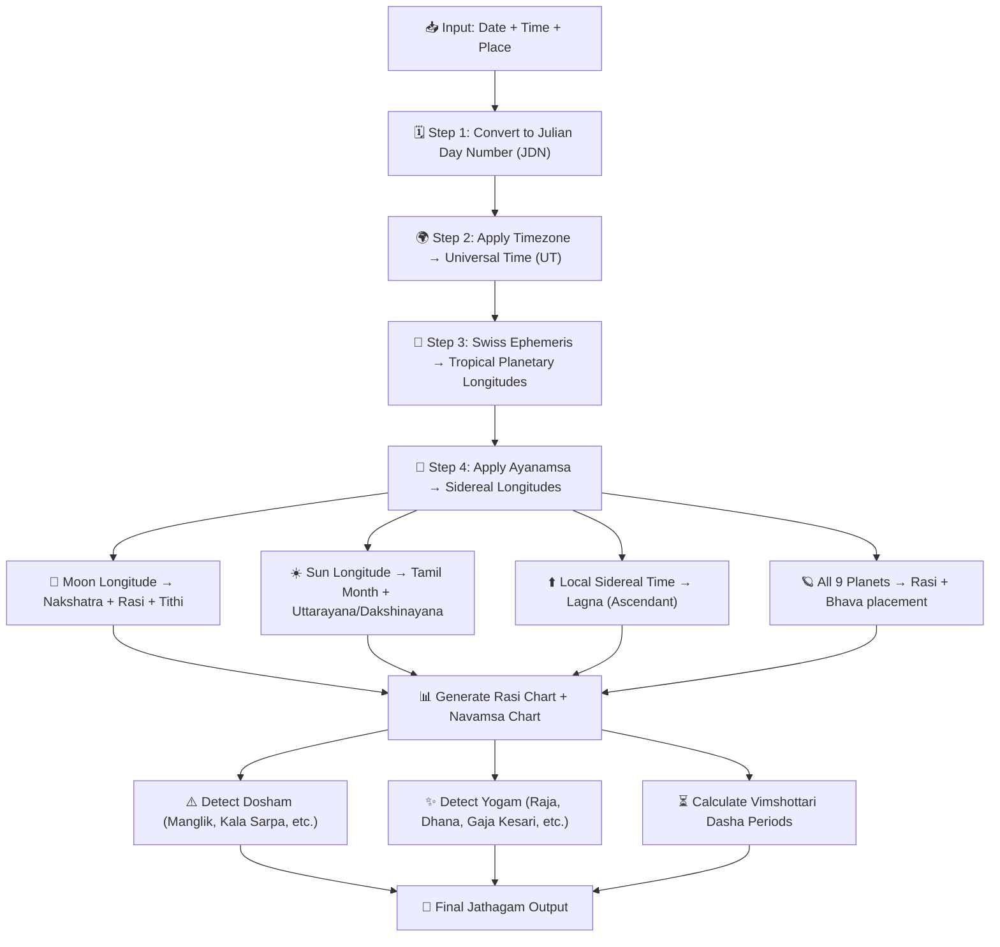
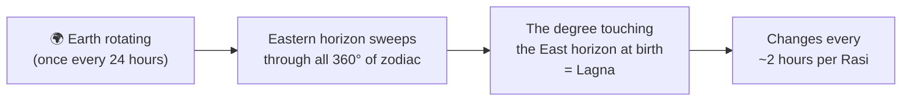
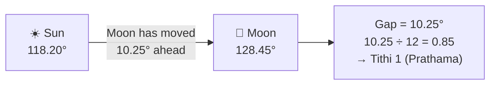
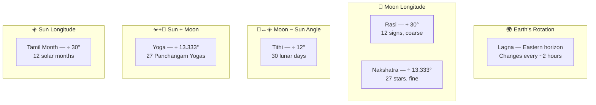
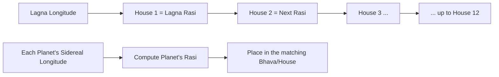
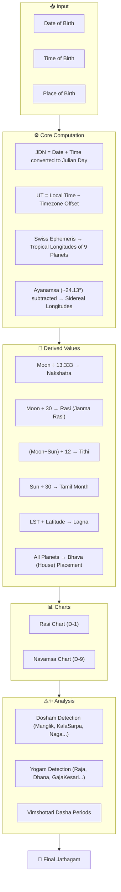

import Highlight from "@/react/Highlight/Highlight.jsx";
import Tabs, { TabItem } from "@/react/Tabs/Tabs.jsx";

# Jathagam Guide - Part 0: What is Jathagam & How Machines Calculate It
# ஜாதகம் வழிகாட்டி - பாகம் 0: ஜாதகம் என்றால் என்ன? கணினி எப்படி கணக்கிடுகிறது?

Welcome to the **foundation article** of this entire series! Before learning what each planet means or how to read a chart, we must first understand — **what is Jathagam?** And in today's world, **how does software actually compute one?**

:::note[Series Navigation - தொடர் வழிகாட்டி]
📖 **Part 0 (This Article):** What is Jathagam & Modern Calculation — START HERE <br></br>
✅ **Part 1:** 27 Nakshatras <br></br>
✅ **Part 2A:** 12 Rashis <br></br>
✅ **Part 2B:** 9 Navagrahas & 12 Houses <br></br>
✅ **Part 3:** Vimshottari Dasha System <br></br>
✅ **Part 4A:** Chevvai Dosham & 7½ Sani <br></br>
✅ **Part 4B:** Kaal Sarpa & Other Doshas <br></br>
✅ **Part 5:** Yogas <br></br>
✅ **Part 6A:** Chart Reading + Marriage Compatibility <br></br>
✅ **Part 6B:** Career, Timing, Muhurtham, Practical Wisdom
:::

:::tip[What You Will Learn - இந்த கட்டுரையில்]
✅ What Jathagam is — spiritually and astronomically <br></br>
✅ Why birth time and place matter so much <br></br>
✅ How Julian Day Numbers work <br></br>
✅ How machines calculate Sun, Moon, planetary positions <br></br>
✅ What Ayanamsa is and why it is critical <br></br>
✅ **What each value comes from** — Lagna, Rasi, Nakshatra, Tithi, Yoga at a glance <br></br>
✅ How Nakshatra, Rasi, Tithi, Lagna are derived from raw numbers <br></br>
✅ How Dosham and Yogam are detected algorithmically <br></br>
✅ Which software engines power today's Jathagam apps
:::

---

## <Highlight color='#800031' highlight='fg' fontWeight='bold'> WHAT IS JATHAGAM? — ஜாதகம் என்றால் என்ன? </Highlight>

### <Highlight color='#004080' highlight='fg' fontWeight='bold'> The Simple Definition </Highlight>

**Jathagam** (ஜாதகம்) — also called **Janma Kundali**, **Birth Chart**, or **Horoscope** — is a **sky map frozen at the exact moment of your birth**.

It records:
- Exactly **where each planet was** in the sky when you were born
- Which **zodiac sign was rising** on the eastern horizon (Lagna)
- How the **27 Nakshatras and 12 Rashis** were positioned relative to the Moon and Sun

This snapshot is then used to understand a person's **personality, strengths, challenges, timing of life events**, and **karma from past lives**.

:::info[ஜாதகத்தின் முகவுரை சுலோகம்]
The very first verse written on every traditional Jathagam says:

> **jananī janmasaukhyānāṃ vardhanī kulasaṃpadām** <br></br>
> **padavīṃ pūrvapuṇyānāṃ likhyate janmapatrikā**

*"This birth chart — mother of this life's joys, nurturer of the family's wealth, testament to past-life merits — is now being written."*

Every Jathagam is considered a sacred document, not merely an astrological tool.
:::

---

### <Highlight color='#004080' highlight='fg' fontWeight='bold'> Why Exactly Three Things Are Needed </Highlight>

To generate a Jathagam, **three inputs are mandatory**:

<div class="table-luxury-grid">

| Input | Why It Matters |
|-------|---------------|
| **Date of Birth** | Determines the positions of slow planets like Saturn, Jupiter, Rahu/Ketu — which move over months and years |
| **Time of Birth** | Determines the Lagna (Ascendant) — which changes every ~2 hours. A 15-minute error can shift the Lagna to a different Rasi entirely |
| **Place of Birth** | Determines the local sidereal time — essential for computing the exact Lagna at that location |

</div>

:::caution[நேரம் மிகவும் முக்கியம்!]
The **Lagna (Ascendant)** completes one full zodiac rotation every 24 hours — meaning it moves through all 12 Rashis in a day, spending roughly **2 hours in each sign**. An error of even 10–15 minutes in birth time can change the Lagna completely — making Dosham and Dasha calculations inaccurate.

Always use the **exact hospital clock time** when available.
:::

---

### <Highlight color='#004080' highlight='fg' fontWeight='bold'> Jathagam vs Western Horoscope — Key Difference </Highlight>

<div class="table-luxury-grid">

| Feature | Tamil Jathagam (Vedic) | Western Horoscope |
|---------|----------------------|-------------------|
| **Zodiac System** | Sidereal (star-based) | Tropical (Sun season-based) |
| **Ayanamsa** | Applied (Lahiri / KP / Raman) | Not applied |
| **Sun Sign Difference** | ~23 days earlier than Western | Fixed to seasons |
| **Primary Luminaries** | Moon sign (Janma Rasi) is primary | Sun sign is primary |
| **Chart Divisions** | 16 Divisional charts (Varga) | Mainly 1 chart |
| **Dasha System** | Vimshottari & others — time-lord periods | Not used |
| **Nakshatra** | 27 Nakshatras — central to prediction | Not used |

</div>

This is why a person who is a "Scorpio" in Western astrology may be a "Libra" in Tamil Jathagam. Neither is wrong — they use **different coordinate systems**.

---

## <Highlight color='#800031' highlight='fg' fontWeight='bold'> THE CALCULATION ENGINE — கணினி எப்படி கணக்கிடுகிறது? </Highlight>

### <Highlight color='#004080' highlight='fg' fontWeight='bold'> The Big Picture — What the Algorithm Does </Highlight>

When you enter your birth details into a Jathagam app, here is the complete computation pipeline:



Let us now walk through each step in detail.

---

### <Highlight color='#004080' highlight='fg' fontWeight='bold'> Step 1 — Julian Day Number (JDN) </Highlight>

The first thing any astrology engine does is convert your **calendar date and time into a Julian Day Number (JDN)** — a single continuous count of days since January 1, 4713 BCE (noon).

**Why Julian Day?** Because calendar systems change — Gregorian, Julian, proleptic — but the JDN is universal. All planetary position databases (including NASA's JPL DE430 and Swiss Ephemeris) index their data using JDN.

**Formula (simplified for Gregorian dates):**

```
JDN = 367×Y − INT(7×(Y + INT((M+9)/12))/4)
      + INT(275×M/9) + D + 1721013.5 + (UT/24)
```

Where Y = Year, M = Month, D = Day, UT = Universal Time in decimal hours.

**Example:**

> Birth: 15 August 1990, 10:30 AM IST, Chennai <br></br>
> IST = UT + 5:30 → UT = 10:30 − 5:30 = **05:00 UT** <br></br>
> JDN ≈ **2448118.708**

This single number now precisely identifies the moment of birth in astronomical time.

---

### <Highlight color='#004080' highlight='fg' fontWeight='bold'> Step 2 — Timezone to Universal Time (UT) </Highlight>

Every birth time must be converted to **Universal Time (UT / UTC)** before astronomical calculations.

<div class="table-luxury-grid">

| Country / Region | Offset from UT |
|-----------------|---------------|
| India (IST) | UT + 5:30 |
| Sri Lanka | UT + 5:30 |
| UK (GMT) | UT ± 0:00 |
| USA Eastern (EST) | UT − 5:00 |
| Singapore / Malaysia | UT + 8:00 |

</div>

:::caution[Historical Timezone Changes]
Before 1947, India used multiple local mean times — Madras Mean Time (UT + 5:21), Bombay Mean Time (UT + 4:51), and others. Good Jathagam software automatically handles these historical offsets for pre-independence birth dates.
:::

---

### <Highlight color='#004080' highlight='fg' fontWeight='bold'> Step 3 — Planetary Longitudes via Swiss Ephemeris </Highlight>

Once the JDN is known, the engine feeds it into a **planetary position library**.

**📌 The industry standard is Swiss Ephemeris (SE)** — an open-source, high-precision astronomy library originally developed by Astrodienst AG (Switzerland), based on NASA's JPL DE431 planetary dataset.

Swiss Ephemeris computes, for any JDN:
- The **ecliptic longitude** of each planet (0° to 360°)
- The **speed** (degrees/day) of each planet
- Whether the planet is in **retrograde** (moving backwards relative to Earth)

These longitudes are initially in the **Tropical zodiac** — measured from the **Vernal Equinox point (0° Aries)**, which is a seasonal reference tied to the Sun's position on the spring equinox.

<div class="table-luxury-grid">

| Planet | Symbol | Approx. Speed | Full Zodiac Tour |
|--------|--------|--------------|-----------------|
| Sun (சூரியன்) | ☀️ | ~1°/day | ~365 days |
| Moon (சந்திரன்) | 🌙 | ~13.2°/day | ~27.3 days |
| Mars (செவ்வாய்) | ♂ | ~0.5°/day | ~2 years |
| Mercury (புதன்) | ☿ | ~1.4°/day | ~1 year |
| Jupiter (குரு) | ♃ | ~0.083°/day | ~12 years |
| Venus (சுக்கிரன்) | ♀ | ~1.2°/day | ~1 year |
| Saturn (சனி) | ♄ | ~0.034°/day | ~29.5 years |
| Rahu (ராகு) | ☊ | ~0.053°/day retrograde | ~18.6 years |
| Ketu (கேது) | ☋ | Always 180° opposite Rahu | ~18.6 years |

</div>

**Rahu and Ketu** are not physical planets — they are the **lunar nodes**: the two points where the Moon's orbit crosses the Sun's ecliptic. Rahu is the north node (ascending), Ketu is the south node (descending). They are always exactly 180° apart and always retrograde.

**Gulika (குளிகை)** — a sub-planet of Saturn — is a **calculated point** (not an observed body) derived from Saturn's position and the weekday. It is traditionally used in Tamil astrology for Dosham assessment.

---

### <Highlight color='#004080' highlight='fg' fontWeight='bold'> Step 4 — Applying Ayanamsa (CRITICAL STEP) </Highlight>

:::danger[இது மிகவும் முக்கியம் — Without This, Everything Is Wrong!]
Western astronomy gives **Tropical longitudes** — measured from the seasonal equinox point.

Tamil Jathagam uses the **Sidereal zodiac** — measured from a fixed star background.

Over ~26,000 years, the Earth's axis slowly wobbles (called **Precession of the Equinoxes**). This means the tropical equinox point drifts westward against the stars by about **50.3 arc-seconds per year**. This accumulated drift since the ancient Vedic era is called the **Ayanamsa**.

**Formula:**
```
Sidereal Longitude = Tropical Longitude − Ayanamsa
```

As of 2026, Ayanamsa ≈ **24.13°** (Lahiri / Chitrapaksha)

Without applying Ayanamsa:
❌ Rasi will be shifted by ~24° — wrong sign entirely <br></br>
❌ Nakshatra will be wrong <br></br>
❌ Lagna will be wrong <br></br>
❌ Marriage compatibility will fail <br></br>
❌ Dosham detection will be inaccurate
:::

**Main Ayanamsa Systems:**

<div class="table-luxury-grid">

| Ayanamsa | Also Known As | Used By | Value (~2026) |
|----------|-------------|---------|--------------|
| **Lahiri** | Chitrapaksha | Most Indian astrologers, Govt. of India | ~24.13° |
| **KP (Krishnamurti)** | KP Ayanamsa | KP system practitioners | ~23.87° |
| **Raman** | B.V. Raman | Raman school | ~22.36° |
| **Yukteshwar** | Sri Yukteshwar | Paramahansa Yogananda tradition | ~22.28° |

</div>

Most Tamil Jathagam apps default to **Lahiri Ayanamsa**, which is the official standard recognised by the Government of India's Rashtriya Panchang.

---

## <Highlight color='#800031' highlight='fg' fontWeight='bold'> WHAT EACH VALUE IS BASED ON — எது எதிலிருந்து கணக்கிடப்படுகிறது? </Highlight>

### <Highlight color='#004080' highlight='fg' fontWeight='bold'> The One-Page Mental Model — Before the Numbers </Highlight>

Before diving into the formulas, pause here. This is the most important conceptual clarity you need. **Four of the five core Jathagam values each come from a completely different source** — and mixing them up is the most common source of confusion.

:::info[இதை புரிந்துகொண்டால் மற்றதெல்லாம் எளிது — Understand This First]
Every Jathagam value answers a different question:

- **Where is the eastern horizon pointing?** → Lagna
- **Where is the Moon?** → Rasi and Nakshatra
- **How far has the Moon moved away from the Sun?** → Tithi
- **Where is the Sun + Moon combined?** → Yoga (Panchangam)
:::

---

### <Highlight color='#004080' highlight='fg' fontWeight='bold'> 1. Lagna — Earth's Rotation (Not a Planet) </Highlight>

```
Lagna = The zodiac sign crossing the eastern horizon at your birth moment
```

Lagna is **not based on any planet**. It is based purely on **Earth rotating on its own axis**.

Imagine standing at your birth location and looking due East. The zodiac wheel is tilted across the sky. The exact degree of the zodiac that is intersecting the eastern horizon at that moment — that is your Lagna.



**Key properties of Lagna:**
- Requires **exact birth time + exact birth location** — both are mandatory
- Shifts every ~2 hours (all 12 Rashis cycle in 24 hours)
- Two twins born 2 hours apart in the same hospital can have different Lagnas
- It defines the **1st house** — all other 11 houses radiate from it
- This is why a 15-minute birth time error can completely change the chart

---

### <Highlight color='#004080' highlight='fg' fontWeight='bold'> 2. Rasi — Moon's Position in the Zodiac </Highlight>

```
Rasi = Which 30° segment of the zodiac the Moon occupies
```

The zodiac (360°) is divided into **12 Rashis of 30° each**. Find the Moon. See which 30° block it sits in. That is the Rasi.

```
Moon longitude = 128.45°
128.45° ÷ 30° = 4.28
Floor(4.28) = 4 → 5th Rasi → Simha (சிம்மம்) 🦁
```

**Why the Moon?** Because in Tamil Jathagam the Moon represents the **mind and emotional identity** — so the Moon's zodiac position becomes your "sign". This is why a Tamil person says "நான் கடக ராசி" (I am Kataka Rasi) — they are naming their Moon's Rasi, not the Sun's sign as in Western astrology.

---

### <Highlight color='#004080' highlight='fg' fontWeight='bold'> 3. Nakshatra — Moon's Position, but More Precise </Highlight>

```
Nakshatra = Which 13°20′ segment of the zodiac the Moon occupies
```

Nakshatra uses the **same Moon longitude as Rasi** — but cuts the zodiac into **27 smaller pieces** instead of 12.

```
Each Nakshatra = 360° ÷ 27 = 13°20′ = 13.333°

Moon longitude = 128.45°
128.45° ÷ 13.333° = 9.63
Floor(9.63) = 9 → 10th Nakshatra → Magha (மகம்) ⭐
```

**Rasi vs Nakshatra — the key difference:**

<div class="table-luxury-grid">

| | Rasi | Nakshatra |
|--|------|-----------|
| **Divides** | 360° into 12 | 360° into 27 |
| **Each segment** | 30° | 13°20′ |
| **Based on** | Moon longitude | Moon longitude |
| **Granularity** | Coarser | Finer (~2.25× more precise) |
| **Each Rasi contains** | 2¼ Nakshatras | — |
| **Used for** | Moon sign identity, chart houses | Dasha periods, personality fine-tuning, compatibility |

</div>

Think of it this way: **Rasi is the city, Nakshatra is the neighbourhood.** Both describe where the Moon is — but Nakshatra is more precise. Every Rasi contains exactly 2¼ Nakshatras (= 30° ÷ 13.333°).

---

### <Highlight color='#004080' highlight='fg' fontWeight='bold'> 4. Tithi — The Angle Between Moon and Sun </Highlight>

```
Tithi = How far the Moon has moved ahead of the Sun
      = (Moon longitude − Sun longitude + 360°) mod 360°
      ÷ 12° gives the Tithi number
```

Tithi is **not the Moon alone** and **not the Sun alone** — it is the **gap between them**.



<div class="table-luxury-grid">

| Moon–Sun Angle | Tithi | Paksha | Meaning |
|---------------|-------|--------|---------|
| 0° | 30 / New start | — | **Amavasai** — New Moon |
| 0°–12° | 1 (Prathama) | Shukla (வளர்பிறை) | First day after New Moon |
| 12°–24° | 2 (Dvitiya) | Shukla | Second day |
| … | … | … | … |
| 168°–180° | 15 (Pournami) | Shukla | **Pournami** — Full Moon |
| 180°–192° | 1 (Prathama) | Krishna (தேய்பிறை) | First day after Full Moon |
| … | … | … | … |
| 348°–360° | 15 (Amavasai) | Krishna | **Amavasai** — New Moon again |

</div>

**Why this matters:** The entire Tamil calendar — festival dates, auspicious days, Ekadashi fasting days, Karthigai Deepam — is built on Tithis. The Moon must reach a specific angle from the Sun for each of these.

---

### <Highlight color='#004080' highlight='fg' fontWeight='bold'> 5. Yoga — Sun + Moon Combined </Highlight>

```
Yoga = (Sun longitude + Moon longitude) ÷ 13.333°
→ 27 Yogas, same span as Nakshatras
```

Unlike Rasi, Nakshatra, and Tithi — Yoga uses **both** Sun and Moon longitudes **added together**. Each of the 27 Yogas has a character — some auspicious (Siddha, Amrita), some inauspicious (Vyatipata, Vaidhriti). This is the 4th element of the daily **Panchangam (பஞ்சாங்கம்)**.

---

### <Highlight color='#004080' highlight='fg' fontWeight='bold'> The Complete "What Comes From Where" — At a Glance </Highlight>

<div class="table-luxury-grid">

| Jathagam Value | Tamil | Source | What Changes It | Precision |
|---------------|-------|--------|----------------|----------|
| **Lagna** | லக்னம் | Eastern horizon (Earth's rotation) | Time + Location | Every ~2 hours |
| **Rasi** | ராசி | Moon's longitude ÷ 30° | Moon's movement | Every ~2.5 days |
| **Nakshatra** | நட்சத்திரம் | Moon's longitude ÷ 13.333° | Moon's movement | Every ~13.3 hours |
| **Tithi** | திதி | (Moon − Sun) ÷ 12° | Moon–Sun gap | Every ~19–26 hours |
| **Yoga** | யோகம் | (Moon + Sun) ÷ 13.333° | Both together | Every ~19–24 hours |
| **Tamil Month** | தமிழ் மாதம் | Sun's longitude ÷ 30° | Sun's movement | Every ~30 days |

</div>



:::tip[One-Line Summaries to Remember]
🌅 **Lagna** = *Where is the East horizon pointing?* (Earth rotates) <br></br>
🌙 **Rasi** = *Which 30° chunk has the Moon?* (coarse) <br></br>
⭐ **Nakshatra** = *Which 13°20′ chunk has the Moon?* (fine) <br></br>
🌗 **Tithi** = *How far is the Moon ahead of the Sun?* (gap) <br></br>
✨ **Yoga** = *Where do Sun + Moon point together?* (combined) <br></br>
☀️ **Tamil Month** = *Which 30° chunk has the Sun?* (solar)
:::

---

## <Highlight color='#800031' highlight='fg' fontWeight='bold'> DERIVING JATHAGAM VALUES — கணக்கீட்டு விவரங்கள் </Highlight>

### <Highlight color='#004080' highlight='fg' fontWeight='bold'> Nakshatra — Moon's Star Position </Highlight>

The **27 Nakshatras** divide the full 360° zodiac into 27 equal segments:

```
Each Nakshatra = 360° ÷ 27 = 13°20′ = 13.3333°
```

**Algorithm:**

```
Nakshatra Index = Sidereal Moon Longitude ÷ 13.3333°
(Use the integer part + 1 for the Nakshatra number)
```

**Worked Example:**

> Sidereal Moon Longitude = **128.45°** <br></br>
> 128.45 ÷ 13.3333 = **9.63** <br></br>
> Integer part = 9 → 9 + 1 = **10th Nakshatra** <br></br>
> → **Magha (மகம்)** ⭐

<div class="table-luxury-grid">

| Nakshatra # | Name (Tamil) | Range (Sidereal) |
|-------------|-------------|-----------------|
| 1 | Ashwini (அஸ்வினி) | 0°00′ – 13°20′ |
| 2 | Bharani (பரணி) | 13°20′ – 26°40′ |
| 3 | Krittika (கார்த்திகை) | 26°40′ – 40°00′ |
| 4 | Rohini (ரோகிணி) | 40°00′ – 53°20′ |
| 5 | Mrigashira (மிருகசீரிஷம்) | 53°20′ – 66°40′ |
| 6 | Ardra (திருவாதிரை) | 66°40′ – 80°00′ |
| 7 | Punarvasu (புனர்பூசம்) | 80°00′ – 93°20′ |
| 8 | Pushya (பூசம்) | 93°20′ – 106°40′ |
| 9 | Ashlesha (ஆயில்யம்) | 106°40′ – 120°00′ |
| **10** | **Magha (மகம்)** | **120°00′ – 133°20′** |
| 11 | Purva Phalguni (பூரம்) | 133°20′ – 146°40′ |
| 12 | Uttara Phalguni (உத்திரம்) | 146°40′ – 160°00′ |
| ... | ... | ... |
| 27 | Revati (ரேவதி) | 346°40′ – 360°00′ |

</div>

Each Nakshatra is further divided into **4 Padas (quarters)** of 3°20′ each — giving 108 Padas total, which corresponds to the **108 beads of a Japa Mala**.

---

### <Highlight color='#004080' highlight='fg' fontWeight='bold'> Rasi — Moon Sign (Janma Rasi) </Highlight>

The **12 Rashis** divide 360° into 12 equal segments of 30° each:

```
Rasi Index = Sidereal Moon Longitude ÷ 30°
(Use integer part + 1 for Rasi number)
```

**Worked Example:**

> Sidereal Moon Longitude = **128.45°** <br></br>
> 128.45 ÷ 30 = **4.28** <br></br>
> Integer part = 4 → 4 + 1 = **5th Rasi** <br></br>
> → **Simha / Simham (சிம்மம்)** 🦁

<div class="table-luxury-grid">

| Rasi # | Tamil Name | Sanskrit | Symbol | Range |
|--------|-----------|----------|--------|-------|
| 1 | மேஷம் | Mesha | ♈ Ram | 0° – 30° |
| 2 | ரிஷபம் | Vrishabha | ♉ Bull | 30° – 60° |
| 3 | மிதுனம் | Mithuna | ♊ Twins | 60° – 90° |
| 4 | கடகம் | Kataka | ♋ Crab | 90° – 120° |
| **5** | **சிம்மம்** | **Simha** | ♌ Lion | **120° – 150°** |
| 6 | கன்னி | Kanya | ♍ Maiden | 150° – 180° |
| 7 | துலாம் | Tula | ♎ Scales | 180° – 210° |
| 8 | விருச்சிகம் | Vrischika | ♏ Scorpion | 210° – 240° |
| 9 | தனுசு | Dhanus | ♐ Archer | 240° – 270° |
| 10 | மகரம் | Makara | ♑ Goat | 270° – 300° |
| 11 | கும்பம் | Kumbha | ♒ Pot | 300° – 330° |
| 12 | மீனம் | Meena | ♓ Fish | 330° – 360° |

</div>

:::tip[Janma Rasi vs Sun Sign]
In Tamil Jathagam, the **Moon sign (Janma Rasi)** is the primary identity sign — not the Sun sign. This is why Tamil people say "நான் கடக ராசி" (I am Kataka Rasi) based on their Moon's position, not the Sun's.
:::

---

### <Highlight color='#004080' highlight='fg' fontWeight='bold'> Tithi — Lunar Day </Highlight>

A **Tithi** is a lunar day, calculated not from the clock but from the **angle between the Moon and the Sun**:

```
Moon–Sun Angle = Sidereal Moon Longitude − Sidereal Sun Longitude
(If negative, add 360°)

Tithi Number = (Moon–Sun Angle) ÷ 12°
(Integer part + 1 gives the Tithi)
```

**Example:**

> Moon = 128.45°, Sun = 118.20° <br></br>
> Angle = 128.45 − 118.20 = **10.25°** <br></br>
> 10.25 ÷ 12 = 0.854 → Integer 0 + 1 = **1st Tithi → Prathama (பிரதமை)**

There are **30 Tithis** in a lunar month — 15 in the **Shukla Paksha** (waxing Moon) and 15 in the **Krishna Paksha** (waning Moon).

---

### <Highlight color='#004080' highlight='fg' fontWeight='bold'> Tamil Month — From Sun Longitude </Highlight>

The **Tamil Solar Calendar** month is determined by the Sun's sidereal longitude:

```
Tamil Month Index = Sidereal Sun Longitude ÷ 30°
(Integer part + 1 = month number)
```

<div class="table-luxury-grid">

| Month # | Tamil Month | Sun Range (Sidereal) | Approx. English Dates |
|---------|------------|---------------------|----------------------|
| 1 | சித்திரை (Chithirai) | 0° – 30° | Apr 14 – May 14 |
| 2 | வைகாசி (Vaikasi) | 30° – 60° | May 15 – Jun 14 |
| 3 | ஆனி (Aani) | 60° – 90° | Jun 15 – Jul 16 |
| 4 | ஆடி (Aadi) | 90° – 120° | Jul 17 – Aug 16 |
| 5 | ஆவணி (Avani) | 120° – 150° | Aug 17 – Sep 16 |
| 6 | புரட்டாசி (Purattasi) | 150° – 180° | Sep 17 – Oct 17 |
| 7 | ஐப்பசி (Aippasi) | 180° – 210° | Oct 18 – Nov 16 |
| 8 | கார்த்திகை (Karthigai) | 210° – 240° | Nov 17 – Dec 15 |
| 9 | மார்கழி (Margazhi) | 240° – 270° | Dec 16 – Jan 13 |
| 10 | தை (Thai) | 270° – 300° | Jan 14 – Feb 12 |
| 11 | மாசி (Masi) | 300° – 330° | Feb 13 – Mar 14 |
| 12 | பங்குனி (Panguni) | 330° – 360° | Mar 15 – Apr 13 |

</div>

**Uttarayana / Dakshinayana:**
- When Sun crosses 270° (enters Thai) → **Uttarayana begins** (January 14, Thai Pongal) — Sun's northward journey, auspicious
- When Sun crosses 90° (enters Aadi) → **Dakshinayana begins** — Sun's southward journey

---

### <Highlight color='#004080' highlight='fg' fontWeight='bold'> Lagna — The Ascendant </Highlight>

The **Lagna (Ascendant)** is the zodiac sign rising on the **eastern horizon** at the moment of birth. It changes every ~2 hours and is highly location-specific.

**Algorithm:**

```
1. Compute Greenwich Sidereal Time (GST) from JDN
2. Add birth place's longitude offset → Local Sidereal Time (LST)
3. Convert LST to the ecliptic degree rising on the horizon
   (using the birth place's geographic latitude for obliquity correction)
4. Apply Ayanamsa → Sidereal Lagna longitude
5. Lagna Rasi = Sidereal Lagna longitude ÷ 30° (integer + 1)
```

This is why **place of birth is mandatory** — the same moment of birth in Chennai vs New York will produce completely different Lagnas.

---

### <Highlight color='#004080' highlight='fg' fontWeight='bold'> Bhava Placement — Assigning Planets to Houses </Highlight>

Once all **9 planet longitudes** (sidereal) and the **Lagna longitude** are known:



In the **Equal House system** (used in most Tamil Jathagam):
- House 1 = Lagna Rasi and the 30° segment containing the Lagna degree
- Houses 2–12 = the 11 successive Rashis

Each planet falls into whichever 30° Rasi segment contains its longitude, and that determines its house.

---

## <Highlight color='#800031' highlight='fg' fontWeight='bold'> CHARTS GENERATED — எந்த வரைபடங்கள் உருவாகும்? </Highlight>

### <Highlight color='#004080' highlight='fg' fontWeight='bold'> Rasi Chart (ராசி சக்கரம்) </Highlight>

The **Rasi Chart** (D-1 chart) is the **primary birth chart** — it shows:
- All 9 planets placed in their Rasi (zodiac sign)
- The Lagna (Ascendant) marked
- Their house positions (Bhava) from the Lagna

This is the chart most people see first and the one used for all basic readings.

**Tamil Chart Format** (South Indian style): A fixed grid of 12 boxes. Rasis are fixed in position — Mesha always top-middle-left, going clockwise. The Lagna and planets are written inside the appropriate boxes.

---

### <Highlight color='#004080' highlight='fg' fontWeight='bold'> Navamsa Chart (நவாம்சம் / D-9) </Highlight>

The **Navamsa Chart** is the second most important chart — used for:
- **Marriage compatibility** (primary use)
- **Strength of planets** — a planet weak in Rasi but strong in Navamsa still performs well
- **After age 35**, Navamsa gains more weight than the Rasi chart

**How it is calculated:**

Each Rasi (30°) is divided into **9 Navamsa segments** of 3°20′ each. A planet's Navamsa position is determined by which 3°20′ segment it falls in within its Rasi, mapped to a new Rasi sequence.

```
Navamsa Index = (Sidereal Planet Longitude mod 30°) ÷ 3.3333°
→ Integer gives the Navamsa pada (0–8)
→ Mapped to 12 Rashis in a fixed cycle
```

---

## <Highlight color='#800031' highlight='fg' fontWeight='bold'> DOSHAM DETECTION — தோஷம் கண்டறிதல் </Highlight>

### <Highlight color='#004080' highlight='fg' fontWeight='bold'> How Software Detects Dosham </Highlight>

Once planetary house positions are known, Dosham detection is straightforward rule-based logic:

**1. Manglik Dosham (செவ்வாய் தோஷம்)**

```
IF Mars (Chevvai) is in House 1, 2, 4, 7, 8, or 12
  → Manglik Dosham detected

(Some systems also check Navamsa chart for confirmation)
```

<div class="table-luxury-grid">

| House | Traditional View | Effect |
|-------|----------------|--------|
| 1st | Self / Body | Aggressive personality in marriage |
| 2nd | Family / Speech | Discord in family life |
| 4th | Home / Happiness | Domestic unhappiness |
| 7th | Spouse (direct) | Most critical — spouse's health & longevity |
| 8th | Longevity of spouse | Separation or loss |
| 12th | Bed pleasures / Sleep | Marital dissatisfaction |

</div>

**Exceptions in software:** Many apps apply traditional exceptions — if Mars is in Aries, Scorpio, Capricorn, or Cancer (its own / exalted signs); or if Jupiter aspects the 7th house — the Dosham may be partially cancelled. These are programmed as conditional rules.

---

**2. Kala Sarpa Dosham (காலசர்ப்ப தோஷம்)**

```
IF all 7 planets (Sun, Moon, Mars, Mercury, Jupiter, Venus, Saturn)
   are within the 180° arc from Rahu to Ketu (in Rahu's forward direction)
   AND no planet is in the remaining 180° arc
→ Kala Sarpa Dosham
```


**12 types** of Kala Sarpa are named based on which houses Rahu and Ketu occupy (Ananta, Kulika, Vasuki, etc.).

---

**3. Naga Dosham (நாக தோஷம்)**

```
IF Rahu or Ketu is in House 1, 2, 5, 7, or 9
→ Naga Dosham considered
```

---

**4. Rahu–Ketu Dosham**

```
IF Rahu or Ketu conjoins the Moon, Sun, or Lagna lord
→ Various shadow planet afflictions detected
```

---

## <Highlight color='#800031' highlight='fg' fontWeight='bold'> YOGAM DETECTION — யோகம் கண்டறிதல் </Highlight>

### <Highlight color='#004080' highlight='fg' fontWeight='bold'> How Software Detects Yogam </Highlight>

Yogams are **auspicious planetary combinations** — also detected as rule-based algorithms after house placement is complete.

**1. Gaja Kesari Yogam (கஜகேசரி யோகம்)**

```
IF Jupiter is in House 1, 4, 7, or 10 from the Moon
  (i.e., in Kendra from Moon)
→ Gaja Kesari Yogam
```

This is one of the most common and celebrated Yogams — grants intelligence, fame, and prosperity.

---

**2. Raja Yogam (ராஜ யோகம்)**

```
IF the lord of a Kendra house (1, 4, 7, 10)
   conjoins or mutually aspects the lord of a Trikona house (1, 5, 9)
→ Raja Yogam formed
```

The 1st house lord counts as both Kendra and Trikona, making it especially powerful.

---

**3. Dhana Yogam (தன யோகம்)**

```
IF lords of Houses 1, 2, 5, 9, or 11
   are in mutual conjunction, aspect, or exchange
→ Dhana Yogam (wealth-generating combination)
```

---

**4. Pancha Mahapurusha Yogam (பஞ்ச மகாபுருஷ யோகம்)**

Five separate Yogams, one for each of the five non-luminary planets:

<div class="table-luxury-grid">

| Yogam | Planet | Condition |
|-------|--------|-----------|
| **Ruchaka** | Mars | In Aries/Scorpio/Capricorn in Kendra (1,4,7,10) |
| **Bhadra** | Mercury | In Gemini/Virgo in Kendra |
| **Hamsa** | Jupiter | In Cancer/Sagittarius/Pisces in Kendra |
| **Malavya** | Venus | In Taurus/Libra/Pisces in Kendra |
| **Shasha** | Saturn | In Capricorn/Aquarius/Libra in Kendra |

</div>

Each grants extraordinary qualities of that planet — Ruchaka gives military prowess, Hamsa gives wisdom, Malavya gives beauty and luxury, etc.

---

## <Highlight color='#800031' highlight='fg' fontWeight='bold'> THE SOFTWARE ENGINES — எந்த மென்பொருள் பயன்படுத்தப்படுகிறது? </Highlight>

### <Highlight color='#004080' highlight='fg' fontWeight='bold'> What Powers Jathagam Apps Today </Highlight>

<div class="table-luxury-grid">

| Engine / Library          | Type                                | Used In                                                                        |
| ------------------------- | ----------------------------------- | ------------------------------------------------------------------------------ |
| **Swiss Ephemeris (SE)**  | Open-source C library               | AstroSage, Jagannatha Hora, most astrology apps                                |
| **JPL DE431 / DE440**     | NASA planetary dataset              | Backend data for Swiss Ephemeris                                               |
| **Moshier Ephemeris**     | Analytical approximation            | Lightweight apps, offline use                                                  |
| **VSOP87**                | Analytical planetary theory         | Some European astrology tools                                                  |
| **Astronomy Engine (JS)** | Lightweight astronomy library (MIT) | Client-side JS apps, sunrise/moon/planet positions, lightweight horoscope apps |

</div>

**Swiss Ephemeris** is the gold standard — accurate to within **1 arc-second** for dates between 2400 BCE and 3400 CE. It is used by virtually all professional Jathagam software worldwide.

**Popular Jathagam apps** (Tamil / South Indian focus) include:
- **Astro-Vision** (AstroVision Futurepoint)
- **Kundli Pro** / **Kundli Chakra**
- **Jagannatha Hora** (free, by P.V.R. Narasimha Rao)
- **Shri Jyoti Star**
- Various web services: Astrosage, Prokerala, Mpanchang

All of these use Swiss Ephemeris (or equivalent) + Lahiri Ayanamsa as their default engine.

---

### <Highlight color='#004080' highlight='fg' fontWeight='bold'> Full Calculation Summary </Highlight>



---

## <Highlight color='#800031' highlight='fg' fontWeight='bold'> QUICK REFERENCE — விரைவு குறிப்பு </Highlight>

### <Highlight color='#004080' highlight='fg' fontWeight='bold'> Formulas at a Glance </Highlight>

<div class="table-luxury-grid">

| What to Find | Formula | Example |
|-------------|---------|---------|
| **Nakshatra** | Moon longitude ÷ 13.3333° (integer + 1) | 128.45 ÷ 13.333 = 9.63 → **10 = Magha** |
| **Rasi (Moon Sign)** | Moon longitude ÷ 30° (integer + 1) | 128.45 ÷ 30 = 4.28 → **5 = Simha** |
| **Tithi** | (Moon − Sun) ÷ 12° (integer + 1) | 10.25 ÷ 12 = 0.85 → **1 = Prathama** |
| **Tamil Month** | Sun longitude ÷ 30° (integer + 1) | 118.20 ÷ 30 = 3.94 → **4 = Aadi** |
| **Sidereal Longitude** | Tropical Longitude − Ayanamsa | 152.58° − 24.13° = **128.45°** |
| **Nakshatra Pada** | (Moon longitude mod 13.333°) ÷ 3.333° | Gives pada 1–4 within nakshatra |
| **Navamsa Pada** | (Planet longitude mod 30°) ÷ 3.333° | Gives 0–8, mapped to Rasi sequence |

</div>

---

:::tip[Next Steps — அடுத்து என்ன படிக்கலாம்?]
Now that you understand **what Jathagam is and how it is computed**, you are ready to dive into what each element **means** in real life:

➡️ **Part 1:** The 27 Nakshatras — your star's character and qualities <br></br>
➡️ **Part 2A:** The 12 Rashis — your Moon sign's personality <br></br>
➡️ **Part 2B:** The 9 Navagrahas and 12 Houses — who influences what in your life <br></br>
➡️ **Part 3:** The Vimshottari Dasha System — how timing of events is predicted
:::

---

**நன்றி! வணக்கம்!**

May this understanding of the ancient science — now computed with modern precision — bring you clarity and wisdom. The stars do not compel; they incline. The final choice is always yours.

**ஓம் சாந்தி சாந்தி சாந்திஹி!** <br></br>
**Om Shanti Shanti Shantihi!**
