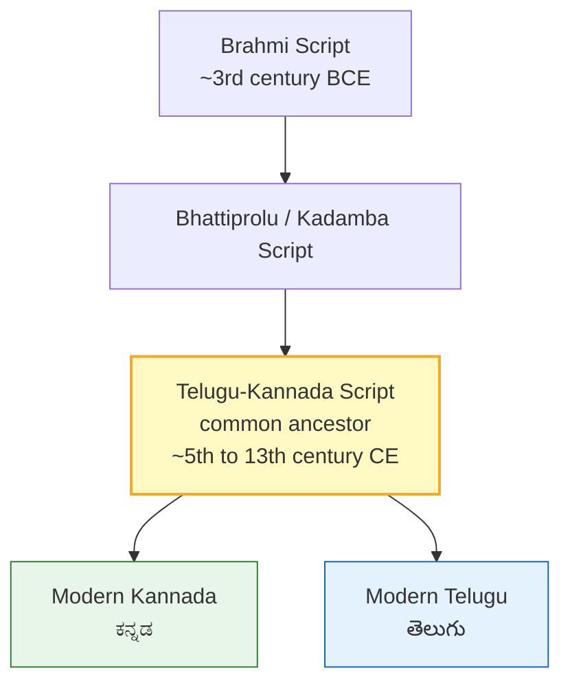
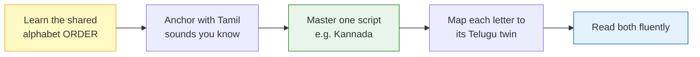

import Highlight from "@/react/Highlight/Highlight.jsx";

# Kannada & Telugu - ಕನ್ನಡ & తెలుగు
# The Twin Scripts of South India

If you already read **Kannada** (ಕನ್ನಡ), you are astonishingly close to reading **Telugu** (తెలుగు) — and vice versa. These two scripts are not just cousins; they are practically **twins** that were the *same script* for over a thousand years before splitting into two closely related forms.

:::tip[Why Learn Them Together - ಎರಡನ್ನೂ ಒಟ್ಟಿಗೆ ಏಕೆ ಕಲಿಯಬೇಕು]
**Kannada and Telugu share the same skeleton.** They have:

✅ **The exact same alphabet order** - same vowels, same varga system <br></br>
✅ **The same number of letters** - 16 vowels, 36 consonants <br></br>
✅ **A shared visual style** - round, curvy shapes with head-strokes <br></br>
✅ **The same aspiration pattern** - each sound family has 5 members <br></br>

**Learn one, and you get roughly 80% of the other for free!**
:::


## <Highlight color='#800031' highlight='fg' fontWeight='bold'> Why Are They So Similar? A Shared History </Highlight>

### <Highlight color='#004080' highlight='fg' fontWeight='bold'> One Script, Two Children </Highlight>

Both scripts descend from the ancient **Brahmi** script through the **Bhattiprolu / Kadamba** branch. For centuries, inscriptions across Karnataka and Andhra used a **single common script** that historians call the **"Telugu-Kannada script."** Only around the 13th–16th centuries CE did it gradually split into the two modern forms we know today.



:::note[The Key Insight]
Because they separated so **recently** (in script terms), Kannada and Telugu letters still map **one-to-one**. Every Kannada letter has a Telugu twin in the same position, with the same sound. The differences are mostly **cosmetic** — the "head-mark" style and a few curves.
:::


## <Highlight color='#800031' highlight='fg' fontWeight='bold'> Spotting the Visual Difference </Highlight>

### <Highlight color='#004080' highlight='fg' fontWeight='bold'> The Head-Mark (Talakattu vs Curve) </Highlight>

The quickest way to tell the two apart:

| Feature | Kannada (ಕನ್ನಡ) | Telugu (తెలుగు) |
|---------|-----------------|-----------------|
| **Head-mark** | Small **v-shaped / curved cap** | Distinctive **tick or "✓" head-mark (talakattu)** above letters |
| **Overall feel** | Rounded, flowing | Rounded, but "bubblier" with more circles |
| **Base shape** | Slightly more angular tops | More looped, circular tops |
| **Reading direction** | Left to right | Left to right |

**Memory Trick:**
- **Telugu letters often wear a little "tick hat" (☑)** on top — the *talakattu*.
- **Kannada letters** have a smaller, smoother cap.
- Otherwise, the bodies are remarkably alike!


## <Highlight color='#800031' highlight='fg' fontWeight='bold'> Vowels (ಸ್ವರಗಳು / అచ్చులు) </Highlight>

### <Highlight color='#004080' highlight='fg' fontWeight='bold'> The 16 Vowels Side by Side </Highlight>

Both scripts have the **same set of vowels in the same order**. The Tamil column and example word show you how to **pronounce** each one.

<div class="table-luxury-grid">

| # | Sound | Kannada | Telugu | Tamil | Tamil Word (pronunciation) |
|---|-------|---------|--------|-------|-----------------------------|
| 1 | a | **ಅ** | **అ** | அ | **அ**கம் (a-gam, "inside") |
| 2 | ā | **ಆ** | **ఆ** | ஆ | **ஆ**டு (ā-du, "goat") |
| 3 | i | **ಇ** | **ఇ** | இ | **இ**லை (i-lai, "leaf") |
| 4 | ī | **ಈ** | **ఈ** | ஈ | **ஈ**ரம் (ī-ram, "wet") |
| 5 | u | **ಉ** | **ఉ** | உ | **உ**ரல் (u-ral, "mortar") |
| 6 | ū | **ಊ** | **ఊ** | ஊ | **ஊ**ர் (ū-r, "town") |
| 7 | ṛ | **ಋ** | **ఋ** | (ரு) | ரு (ru, as in K**ru**shna) |
| 8 | e | **ಎ** | **ఎ** | எ | **எ**லி (e-li, "rat") |
| 9 | ē | **ಏ** | **ఏ** | ஏ | **ஏ**ணி (ē-ṇi, "ladder") |
| 10 | ai | **ಐ** | **ఐ** | ஐ | **ஐ**ந்து (ai-nthu, "five") |
| 11 | o | **ಒ** | **ఒ** | ஒ | **ஒ**ன்று (o-ndru, "one") |
| 12 | ō | **ಓ** | **ఓ** | ஓ | **ஓ**டு (ō-du, "run/tile") |
| 13 | au | **ಔ** | **ఔ** | ஔ | **ஔ**வையார் (au-vaiyār) |
| 14 | aṃ | **ಅಂ** | **అం** | அம் | **அம்**மா (am-mā, "mother") |
| 15 | aḥ | **ಅಃ** | **అః** | அஃ | **அஃ**து (aḥ-thu) |

</div>

:::tip[Notice]
The Kannada and Telugu shapes for the same vowel are clearly **related** — same basic body, different head-mark. Tamil has no aspirated or ṛ vowels, but its vowels cover the core sounds perfectly for pronunciation practice.
:::


## <Highlight color='#800031' highlight='fg' fontWeight='bold'> Consonants: The Varga System (ವರ್ಗ / వర్గము) </Highlight>

### <Highlight color='#004080' highlight='fg' fontWeight='bold'> How Both Scripts Organise Sounds </Highlight>

This is the heart of the similarity shown in the comparison chart. Both Kannada and Telugu arrange their **25 core consonants** into **5 groups (vargas)** of **5 letters** each. Every group follows the **identical pattern**:

```
1. Plain (unvoiced)        → like Tamil
2. Plain + breath (aspirated)
3. Voiced
4. Voiced + breath
5. Nasal                   → like Tamil
```

Tamil only has letters #1 and #5 of each group, so those are your **anchors** — the rest are the "in-between" sounds.


### <Highlight color='#004080' highlight='fg' fontWeight='bold'> Ka Varga - Throat Sounds (ಕ / క) </Highlight>

<div class="table-luxury-grid">

| Sound | Kannada | Telugu | Tamil | Tamil Word (pronunciation) |
|-------|---------|--------|-------|-----------------------------|
| ka | **ಕ** | **క** | க் | **க**ல் (kal, "stone") |
| kha | **ಖ** | **ఖ** | — | ka + hard breath (not in Tamil) |
| ga | **ಗ** | **గ** | — | soft **g** — **க**ங்கை (Gangai) |
| gha | **ಘ** | **ఘ** | — | ga + breath |
| ṅa | **ಙ** | **ఙ** | ங் | **ங**ன் (nga) — nasal, as in si**ng** |

</div>


### <Highlight color='#004080' highlight='fg' fontWeight='bold'> Cha Varga - Palate Sounds (ಚ / చ) </Highlight>

<div class="table-luxury-grid">

| Sound | Kannada | Telugu | Tamil | Tamil Word (pronunciation) |
|-------|---------|--------|-------|-----------------------------|
| cha | **ಚ** | **చ** | ச் | **ச**ட்டி (chatti, "pot") |
| chha | **ಛ** | **ఛ** | — | cha + breath |
| ja | **ಜ** | **జ** | ஜ் | **ஜ**னம் (janam, "people") |
| jha | **ಝ** | **ఝ** | — | ja + breath |
| ña | **ಞ** | **ఞ** | ஞ் | **ஞ**ானம் (gnyānam, "wisdom") |

</div>


### <Highlight color='#004080' highlight='fg' fontWeight='bold'> Ṭa Varga - Retroflex Sounds (ಟ / ట) </Highlight>

<div class="table-luxury-grid">

| Sound | Kannada | Telugu | Tamil | Tamil Word (pronunciation) |
|-------|---------|--------|-------|-----------------------------|
| ṭa | **ಟ** | **ట** | ட் | பா**ட்**டு (pāṭṭu, "song") |
| ṭha | **ಠ** | **ఠ** | — | ṭa + breath |
| ḍa | **ಡ** | **డ** | — | retroflex **d** — **ட**ம் (Dam) |
| ḍha | **ಢ** | **ఢ** | — | ḍa + breath |
| ṇa | **ಣ** | **ణ** | ண் | உ**ண்**மை (uṇmai, "truth") |

</div>


### <Highlight color='#004080' highlight='fg' fontWeight='bold'> Ta Varga - Dental Sounds (ತ / త) </Highlight>

<div class="table-luxury-grid">

| Sound | Kannada | Telugu | Tamil | Tamil Word (pronunciation) |
|-------|---------|--------|-------|-----------------------------|
| ta | **ತ** | **త** | த் | **த**வம் (thavam, "penance") |
| tha | **ಥ** | **థ** | — | ta + breath |
| da | **ದ** | **ద** | — | dental **d** — **த**யா (dayā) |
| dha | **ಧ** | **ధ** | — | da + breath |
| na | **ನ** | **న** | ந் | **ந**ல்ல (nalla, "good") |

</div>


### <Highlight color='#004080' highlight='fg' fontWeight='bold'> Pa Varga - Lip Sounds (ಪ / ప) </Highlight>

<div class="table-luxury-grid">

| Sound | Kannada | Telugu | Tamil | Tamil Word (pronunciation) |
|-------|---------|--------|-------|-----------------------------|
| pa | **ಪ** | **ప** | ப் | **ப**ல் (pal, "tooth") |
| pha | **ಫ** | **ఫ** | — | pa + breath (or **f**) |
| ba | **ಬ** | **బ** | — | **b** — **ப**லம் (balam, "strength") |
| bha | **ಭ** | **భ** | — | ba + breath |
| ma | **ಮ** | **మ** | ம் | **ம**லை (malai, "hill") |

</div>


### <Highlight color='#004080' highlight='fg' fontWeight='bold'> Additional Consonants (ಯ ರ ಲ ವ... / య ర ల వ...) </Highlight>

The semi-vowels, sibilants and special letters — again, **identical order** in both scripts.

<div class="table-luxury-grid">

| Sound | Kannada | Telugu | Tamil | Tamil Word (pronunciation) |
|-------|---------|--------|-------|-----------------------------|
| ya | **ಯ** | **య** | ய் | **ய**மன் (yaman) |
| ra | **ರ** | **ర** | ர் | **ர**வி (ravi, "sun") |
| la | **ಲ** | **ల** | ல் | **ல**தா (latā) |
| va | **ವ** | **వ** | வ் | **வ**சனம் (vasanam) |
| śa | **ಶ** | **శ** | — | soft **sh** — **ச**ாந்தி (shānthi) |
| ṣa | **ಷ** | **ష** | ஷ் | **ஷ**ண்முகன் ( shaṇmugan) |
| sa | **ಸ** | **స** | ஸ் | **ஸ**த்யம் (satyam, "truth") |
| ha | **ಹ** | **హ** | ஹ் | **ஹ**ரி (hari) |
| ḷa | **ಳ** | **ళ** | ள் | **ள**ம் (Lam) — retroflex l |
| ṟa | **ಱ** | **ఱ** | ற் | **ற**வி (Ravi) — hard trill r |
| kṣa | **ಕ್ಷ** | **క్ష** | க்ஷ் | **க்ஷ**த்ரியர் (kṣatriyar) |

</div>

:::note[Same Skeleton, Different Skin]
Compare any row above: the Kannada and Telugu letters are **structurally the same character** wearing slightly different clothing. This is exactly why the alphabet chart in the two scripts lines up perfectly, row for row.
:::


## <Highlight color='#800031' highlight='fg' fontWeight='bold'> Letters That Look Almost Identical </Highlight>

### <Highlight color='#004080' highlight='fg' fontWeight='bold'> Near-Twins </Highlight>

Some letters are so close that a beginner can barely tell which script they belong to:

<div class="table-luxury-grid">

| Sound | Kannada | Telugu | Similarity |
|-------|---------|--------|------------|
| va | ವ | వ | Nearly identical loop |
| da | ದ | ద | Same curl, different cap |
| ra | ರ | ర | Same open hook |
| na | ನ | న | Same body |
| ma | ಮ | మ | Very close |

</div>

**These "gateway" letters** are the easiest place to start when jumping from one script to the other.


### <Highlight color='#004080' highlight='fg' fontWeight='bold'> Letters to Watch Carefully </Highlight>

A few letters diverged more and need extra attention:

- **ka**: ಕ (Kannada) vs క (Telugu) — Telugu's version is more looped
- **e / ē vowels**: the head-marks differ noticeably
- **The talakattu (☑ head-mark)** on Telugu changes how the tops look even when the body matches


## <Highlight color='#800031' highlight='fg' fontWeight='bold'> Vowel Signs (Matras) Work the Same Way </Highlight>

### <Highlight color='#004080' highlight='fg' fontWeight='bold'> Same Concept, Twin Shapes </Highlight>

In both scripts, a bare consonant carries an inherent **"a"**, and you attach **matras** to change the vowel — exactly the same logic as Tamil and Kannada.

**Example with "ka":**

<div class="table-luxury-grid">

| Vowel | Kannada | Telugu | Tamil | Sound |
|-------|---------|--------|-------|-------|
| a | ಕ | క | க | ka |
| ā | ಕಾ | కా | கா | kā |
| i | ಕಿ | కి | கி | ki |
| ī | ಕೀ | కీ | கீ | kī |
| u | ಕು | కు | கு | ku |
| ū | ಕೂ | కూ | கூ | kū |
| e | ಕೆ | కె | கெ | ke |
| ē | ಕೇ | కే | கே | kē |
| ai | ಕೈ | కై | கை | kai |
| o | ಕೊ | కొ | கொ | ko |
| ō | ಕೋ | కో | கோ | kō |
| au | ಕೌ | కౌ | கௌ | kau |

</div>

Because the matra system is shared, once you can read **ಕ ಕಾ ಕಿ ಕೀ...** in Kannada, you can read **క కా కి కీ...** in Telugu almost immediately.


## <Highlight color='#800031' highlight='fg' fontWeight='bold'> Practice: Read These Words in Both Scripts </Highlight>

### <Highlight color='#004080' highlight='fg' fontWeight='bold'> Common Words Side by Side </Highlight>

<div class="table-luxury-grid">

| Meaning | Kannada | Telugu | Tamil (pronunciation) |
|---------|---------|--------|------------------------|
| Mother | ಅಮ್ಮ | అమ్మ | அம்மா (ammā) |
| Father | ಅಪ್ಪ | అప్ప / నాన్న | அப்பா (appā) |
| Water | ನೀರು | నీరు | நீர் (nīr) |
| House | ಮನೆ | మనె / ఇల్లు | மனை (manai) |
| Name | ಹೆಸರು | పేరు | பெயர் (peyar) |
| Come | ಬನ್ನಿ | రండి | வாங்க (vānga) |
| Good | ಒಳ್ಳೆಯ | మంచి | நல்ல (nalla) |
| Thank you | ಧನ್ಯವಾದ | ధన్యవాదాలు | நன்றி (nandri) |

</div>

:::tip[Try This Exercise]
Cover the Telugu column and try to "convert" each Kannada word into Telugu letter by letter using the tables above. Because the letters map one-to-one, you will get very close every time!
:::


## <Highlight color='#800031' highlight='fg' fontWeight='bold'> Memory Strategy </Highlight>

### <Highlight color='#004080' highlight='fg' fontWeight='bold'> How to Learn Both Together </Highlight>



**Practical tips:**

1. **Learn the varga order once** — it serves *both* scripts.
2. **Use Tamil as your pronunciation anchor** — letters #1 and #5 of every group already exist in Tamil.
3. **Study letters in twin pairs** (ಕ / క, ಮ / మ...) rather than one script at a time.
4. **Watch the head-mark** — the talakattu is your instant "this is Telugu" signal.
5. **Practise the near-twins first** (va, da, ra, na, ma) to build confidence fast.


### <Highlight color='#004080' highlight='fg' fontWeight='bold'> Common Mistakes to Avoid </Highlight>

❌ **Assuming the letters are 100% identical** — they are twins, not clones; check the head-marks. <br></br>
❌ **Ignoring aspiration** — kha ≠ ka, dha ≠ da in both scripts. <br></br>
❌ **Mixing up ಎ/ಏ (e/ē)** — short vs long matters in both. <br></br>
❌ **Forgetting the halant** — ಕ್ / క్ removes the inherent "a", just like Tamil's pulli (க்). <br></br>


## <Highlight color='#800031' highlight='fg' fontWeight='bold'> Quick Reference Chart </Highlight>

### <Highlight color='#004080' highlight='fg' fontWeight='bold'> The Full Varga Grid </Highlight>

```
              Kannada          Telugu
Ka varga:   ಕ ಖ ಗ ಘ ಙ      క ఖ గ ఘ ఙ
Cha varga:  ಚ ಛ ಜ ಝ ಞ      చ ఛ జ ఝ ఞ
Ṭa varga:   ಟ ಠ ಡ ಢ ಣ      ట ఠ డ ఢ ణ
Ta varga:   ತ ಥ ದ ಧ ನ      త థ ద ధ న
Pa varga:   ಪ ಫ ಬ ಭ ಮ      ప ఫ బ భ మ
Others:     ಯ ರ ಲ ವ         య ర ల వ
            ಶ ಷ ಸ ಹ ಳ ಱ     శ ష స హ ళ ఱ
```

**Vowels:**

```
Kannada: ಅ ಆ ಇ ಈ ಉ ಊ ಋ ಎ ಏ ಐ ಒ ಓ ಔ ಅಂ ಅಃ
Telugu:  అ ఆ ఇ ఈ ఉ ఊ ఋ ఎ ఏ ఐ ఒ ఓ ఔ అం అః
```


## <Highlight color='#800031' highlight='fg' fontWeight='bold'> Conclusion </Highlight>

### <Highlight color='#004080' highlight='fg' fontWeight='bold'> Two Scripts, One Journey </Highlight>

**What makes Kannada and Telugu twins:**

✅ **A shared ancestor** — the common Telugu-Kannada script <br></br>
✅ **Identical alphabet order** — same vowels, same 5 vargas <br></br>
✅ **One-to-one letter mapping** — every letter has a twin <br></br>
✅ **The same matra and halant system** <br></br>
✅ **Mostly cosmetic differences** — head-marks and a few curves <br></br>

**Remember:**
- If you know **Kannada**, Telugu is roughly **80% learned** already.
- Use **Tamil sounds** as your pronunciation backbone.
- Focus on the **head-mark (talakattu)** to tell them apart.
- Learn in **twin pairs** for the fastest results.

**ಶುಭಾಶಯಗಳು / శుభాకాంక్షలు — Good wishes on learning both beautiful scripts!**

**ಧನ್ಯವಾದ / ధన్యవాదాలు — Thank you!** 🙏
