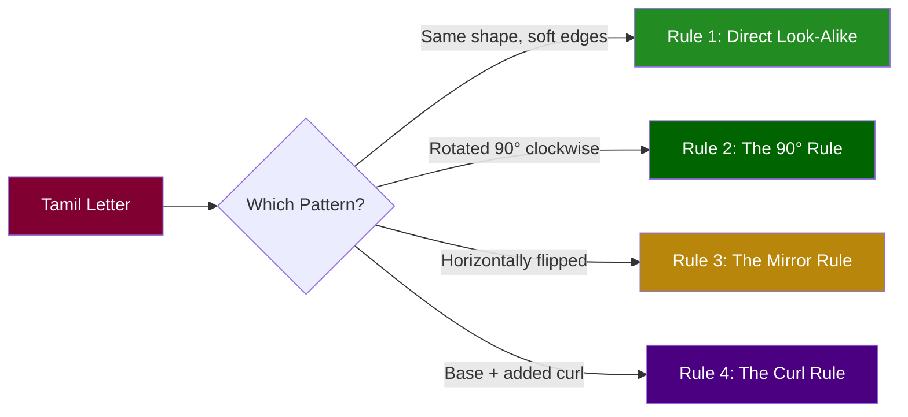
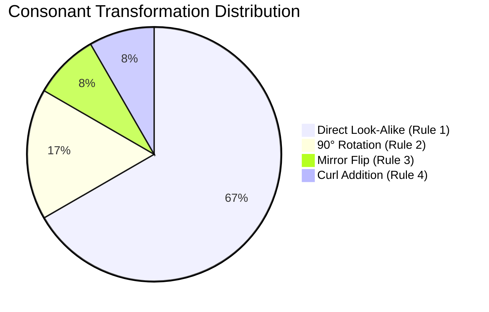
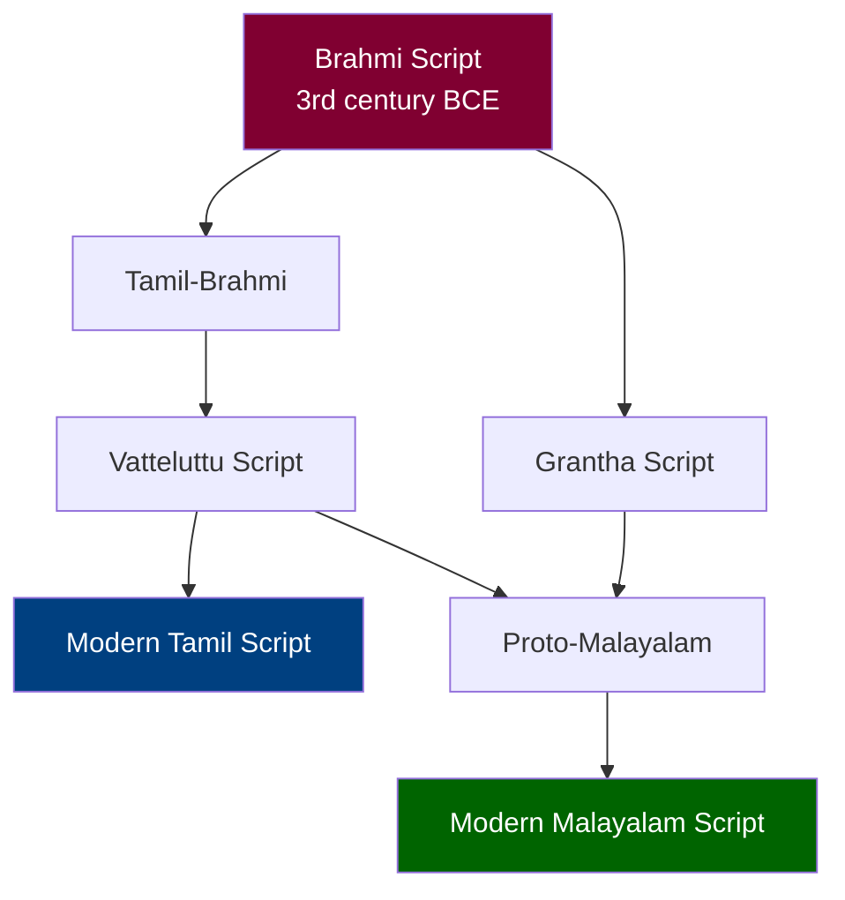

import Highlight from "@/react/Highlight/Highlight.jsx";

If you already read Tamil, you're sitting on a **massive shortcut** to learning Malayalam script. Both scripts evolved from the ancient Grantha script and share a deep structural DNA. Many Malayalam letters are simply Tamil letters with predictable visual transformations applied — a softened edge here, a 90° rotation there, a mirror flip, or an added curl.

This guide identifies those **visual transformation patterns** so you can systematically map Tamil letters to Malayalam letters instead of memorizing each one from scratch.

:::tip[Who Is This Guide For?]
- **Tamil readers** who want to learn Malayalam script quickly
- **Dravidian language enthusiasts** exploring script relationships
- **Linguistics students** studying script evolution
- Anyone who finds **pattern-based learning** more effective than rote memorization
:::

## <Highlight color='#800031' highlight='fg' fontWeight='bold'> The Core Idea: Visual Convergence Patterns </Highlight>

### <Highlight color='#004080' highlight='fg' fontWeight='bold'> Why Tamil and Malayalam Scripts Look Related </Highlight>

Tamil and Malayalam both descend from the **Vatteluttu** and **Grantha** scripts. Over centuries, Malayalam evolved its own rounded, cursive style while Tamil retained angular forms. But the **structural skeleton** of many letters remains shared.

By studying the changes systematically, we can identify **repeating visual transformation rules** that apply across multiple letters:

**The Four Transformation Rules:**

1. **Direct Look-Alike** — The Malayalam letter retains the core Tamil structure with softened edges
2. **The 90° Rotation** — The Tamil form is rotated 90° clockwise with sharpened angles
3. **The Mirror Rule** — The Malayalam letter is a horizontal reflection of the Tamil form
4. **The Stylization/Curl Rule** — The base shape matches but Malayalam adds a right-side curl or styling



:::note[Important]
These are **visual learning mnemonics**, not formal etymological derivations. The goal is practical: if you see a Tamil letter, you should be able to predict or recall the corresponding Malayalam letter through a visual pattern.
:::

---

## <Highlight color='#800031' highlight='fg' fontWeight='bold'> Part 1: Consonants — Tamil to Malayalam </Highlight>

### <Highlight color='#004080' highlight='fg' fontWeight='bold'> Rule 1: Direct Look-Alikes (Group 1) </Highlight>

These are the easiest to learn. The Malayalam letter **preserves the core structure** of the Tamil letter — loops, hooks, and overall shape are retained, with edges softened and rounded in the Malayalam style.

**This is the largest group**, covering the majority of shared consonants.

---

#### க → ക (ka)

| | Tamil | Malayalam |
|--|-------|-----------|
| **Letter** | **க** | **ക** |
| **Sound** | ka | ka |

**What to notice:**
- The Tamil க has a **circular loop on the left** with a stem
- Malayalam ക retains this exact structure
- Edges are **softened and rounded** in Malayalam
- One of the closest matches across both scripts

**Mnemonic:** The loop-and-stem shape is preserved almost identically. If you can read Tamil க, you can recognize Malayalam ക immediately.

---

#### ண → ണ (ṇa — retroflex nasal)

| | Tamil | Malayalam |
|--|-------|-----------|
| **Letter** | **ண** | **ണ** |
| **Sound** | ṇa | ṇa |

**What to notice:**
- Tamil ண has a distinctive **triple-loop structure**
- Malayalam ണ preserves this triple-loop form
- The overall pattern of three connected curves is maintained
- One of the most recognizable matches

**Mnemonic:** Count the loops — three in Tamil, three in Malayalam. The shape flows differently but the loop count stays.

---

#### ட → ട (ṭa — retroflex stop)

| | Tamil | Malayalam |
|--|-------|-----------|
| **Letter** | **ட** | **ട** |
| **Sound** | ṭa | ṭa |

**What to notice:**
- Tamil ட has an **open-box / angular form**
- Malayalam ട retains this open, boxy structure
- The angles soften slightly in Malayalam but the skeleton is unmistakable

**Mnemonic:** Think of an open box or bracket — both scripts use this distinctive angular shape.

---

#### ய → യ (ya)

| | Tamil | Malayalam |
|--|-------|-----------|
| **Letter** | **ய** | **യ** |
| **Sound** | ya | ya |

**What to notice:**
- Tamil ய has a **core loop shape with a vertical tail** descending below
- Malayalam യ retains the core shape and the vertical tail
- The overall silhouette is very similar

**Mnemonic:** Look for the dangling tail — both forms share this distinctive vertical drop.

---

#### ர → ര (ra)

| | Tamil | Malayalam |
|--|-------|-----------|
| **Letter** | **ர** | **ര** |
| **Sound** | ra | ra |

**What to notice:**
- Tamil ர is a **basic vertical line form** with a small hook
- Malayalam ര retains this simple vertical structure
- One of the simplest letters in both scripts

**Mnemonic:** The simplest letter — a near-straight line in both scripts. Hard to confuse.

---

#### வ → വ (va)

| | Tamil | Malayalam |
|--|-------|-----------|
| **Letter** | **வ** | **വ** |
| **Sound** | va | va |

**What to notice:**
- Tamil வ has a **simple loop form**
- Malayalam വ retains this loop
- Clean, minimal transformation

**Mnemonic:** A single clean loop — one of the most direct matches between the scripts.

---

#### ழ → ഴ (zha — unique Dravidian retroflex approximant)

| | Tamil | Malayalam |
|--|-------|-----------|
| **Letter** | **ழ** | **ഴ** |
| **Sound** | zha | zha |

**What to notice:**
- Tamil ழ has a **complex hook structure**
- Malayalam ഴ preserves this complex hook faithfully
- This letter represents a sound unique to Tamil and Malayalam (ழ/zha)
- The structural complexity is maintained because the sound itself is distinctive

**Mnemonic:** The most complex-looking letter in both scripts — and it represents a sound found in no other Indian language. The complexity is preserved because the uniqueness demands it.

---

#### ள → ള (ḷa — retroflex lateral)

| | Tamil | Malayalam |
|--|-------|-----------|
| **Letter** | **ள** | **ള** |
| **Sound** | ḷa | ḷa |

**What to notice:**
- Tamil ள has a **double-loop structure**
- Malayalam ള preserves this double-loop pattern
- Both loops are visible in the Malayalam form

**Mnemonic:** Two loops stacked — the double-loop pattern is the identifying signature in both scripts.

---

**Quick Reference — All Direct Look-Alikes:**

| Tamil | Malayalam | Sound | Key Visual Feature |
|-------|-----------|-------|--------------------|
| க | ക | ka | Loop + stem |
| ண | ണ | ṇa | Triple loop |
| ட | ട | ṭa | Open box |
| ய | യ | ya | Loop + vertical tail |
| ர | ര | ra | Simple vertical line |
| வ | വ | va | Simple loop |
| ழ | ഴ | zha | Complex hook |
| ள | ള | ḷa | Double loop |

:::tip[Learning Strategy]
Start with this group! These 8 consonants give you immediate recognition because the shapes are so close. Master these first and you'll already recognize a significant portion of Malayalam text.
:::

---

### <Highlight color='#004080' highlight='fg' fontWeight='bold'> Rule 2: The 90° Rotation (Group 2) </Highlight>

These letters follow a fascinating pattern: the Tamil form appears to be **rotated 90° clockwise** with angles sharpened to arrive at the Malayalam form.

---

#### த → ത (tha — dental stop)

| | Tamil | Malayalam |
|--|-------|-----------|
| **Letter** | **த** | **ത** |
| **Sound** | tha | tha |

**What to notice:**
- Tamil த has curves pointing in one direction
- Mentally **rotate த 90° clockwise**
- The resulting orientation matches Malayalam ത
- Angles become slightly sharper in the process

**Mnemonic:** Take Tamil த, turn it like a clock hand moving from 12 to 3. That's Malayalam ത.

**Visual:**
```
Tamil த  →  Rotate 90° clockwise  →  Malayalam ത
```

---

#### ந → ന (na — dental nasal)

| | Tamil | Malayalam |
|--|-------|-----------|
| **Letter** | **ந** | **ന** |
| **Sound** | na | na |

**What to notice:**
- Same 90° clockwise rotation pattern as த → ത
- Tamil ந shares structural similarities with த (both dental consonants)
- The rotation pattern applies consistently to this dental pair

**Mnemonic:** த and ந are a dental pair in Tamil. Both follow the same 90° rotation rule into Malayalam. Learn one, and the other follows the same logic.

**Visual:**
```
Tamil ந  →  Rotate 90° clockwise  →  Malayalam ന
```

---

**Quick Reference — 90° Rotation Group:**

| Tamil | Malayalam | Sound | Transformation |
|-------|-----------|-------|----------------|
| த | ത | tha | Rotate 90° clockwise, sharpen angles |
| ந | ന | na | Rotate 90° clockwise, sharpen angles |

:::note[Pattern Recognition]
Notice that both letters in this group are **dental consonants** (த-series in Tamil). This isn't coincidental — related sounds often undergo similar script evolution patterns.
:::

---

### <Highlight color='#004080' highlight='fg' fontWeight='bold'> Rule 3: The Mirror Rule (Group 3) </Highlight>

This is the most visually striking transformation: the Malayalam letter is a **horizontal reflection** (mirror image) of the Tamil letter.

---

#### ம → മ (ma)

| | Tamil | Malayalam |
|--|-------|-----------|
| **Letter** | **ம** | **മ** |
| **Sound** | ma | ma |

**What to notice:**
- Tamil ம opens/curves in one direction
- Malayalam മ is the **mirror image** — it faces the opposite direction
- Place them side by side and imagine a mirror between them
- The structural elements are identical, just flipped horizontally

**Mnemonic:** Put a mirror next to Tamil ம. The reflection is Malayalam മ.

**Visual:**
```
Tamil ம  ←|→  Malayalam മ
         mirror
```

---

**Quick Reference — Mirror Group:**

| Tamil | Malayalam | Sound | Transformation |
|-------|-----------|-------|----------------|
| ம | മ | ma | Horizontal reflection (mirror flip) |

:::tip[Easy Win]
Only one common consonant follows the mirror rule, making it easy to remember as a special case. Whenever you see a letter that looks like a flipped Tamil ம, it's Malayalam മ (ma).
:::

---

### <Highlight color='#004080' highlight='fg' fontWeight='bold'> Rule 4: The Stylization / Curl Rule (Group 4) </Highlight>

In this group, the **base shape of the Tamil letter is preserved**, but Malayalam adds a distinctive **curl, hook, or styling element** — typically on the right side of the letter.

---

#### ல → ല (la — dental lateral)

| | Tamil | Malayalam |
|--|-------|-----------|
| **Letter** | **ல** | **ല** |
| **Sound** | la | la |

**What to notice:**
- The base shape of Tamil ல is clearly present in Malayalam ല
- Malayalam adds a **right-side curl or styling** to the basic form
- Think of it as the Tamil letter with a decorative flourish added

**Mnemonic:** Tamil ல + a curl on the right = Malayalam ല. The base is the same; Malayalam just adds flair.

**Visual:**
```
Tamil ல  +  curl added  →  Malayalam ല
```

---

**Quick Reference — Curl/Stylization Group:**

| Tamil | Malayalam | Sound | Transformation |
|-------|-----------|-------|----------------|
| ல | ല | la | Base shape preserved + right-side curl added |

---

### <Highlight color='#004080' highlight='fg' fontWeight='bold'> Complete Consonant Map </Highlight>

Here's the full picture of all consonant transformations at a glance:

| Rule | Tamil | Malayalam | Sound | Pattern |
|------|-------|-----------|-------|---------|
| 1. Direct Look-Alike | க | ക | ka | Core structure, soft edges |
| 1. Direct Look-Alike | ண | ണ | ṇa | Triple-loop preserved |
| 1. Direct Look-Alike | ட | ട | ṭa | Open-box form |
| 1. Direct Look-Alike | ய | യ | ya | Loop + vertical tail |
| 1. Direct Look-Alike | ர | ര | ra | Vertical line form |
| 1. Direct Look-Alike | வ | വ | va | Simple loop |
| 1. Direct Look-Alike | ழ | ഴ | zha | Complex hook |
| 1. Direct Look-Alike | ள | ള | ḷa | Double-loop |
| 2. 90° Rotation | த | ത | tha | Rotate 90° clockwise |
| 2. 90° Rotation | ந | ന | na | Rotate 90° clockwise |
| 3. Mirror Flip | ம | മ | ma | Horizontal reflection |
| 4. Curl Addition | ல | ല | la | Base shape + curl |



:::important[Key Insight]
**8 out of 12 consonants (67%)** are direct look-alikes! This means if you know Tamil script, you can already recognize two-thirds of these Malayalam consonants with minimal effort. The remaining 4 follow predictable patterns.
:::

---

## <Highlight color='#800031' highlight='fg' fontWeight='bold'> Part 2: Vowels — Tamil to Malayalam </Highlight>

Malayalam vowels also share visual roots with Tamil, but the patterns are slightly different. The transformations fall into three groups based on how closely the shapes match.

### <Highlight color='#004080' highlight='fg' fontWeight='bold'> Group A: Loop-Structure Preservation (Direct Matches) </Highlight>

These vowels retain the **core loop structure** of their Tamil counterparts, with edges softened into Malayalam's characteristic rounded style.

---

#### உ → ഉ (u — short)

| | Tamil | Malayalam |
|--|-------|-----------|
| **Letter** | **உ** | **ഉ** |
| **Sound** | u (short) | u (short) |

**What to notice:**
- Tamil உ has a specific loop-based structure
- Malayalam ഉ retains this **core loop structure** with softened edges
- This is a **near-direct match** — one of the closest vowel correspondences

**Mnemonic:** The loop is the same. Just soften the edges mentally, and Tamil உ becomes Malayalam ഉ.

---

#### ഊ → ഊ (ū — long)

| | Tamil | Malayalam |
|--|-------|-----------|
| **Letter** | **ஊ** | **ഊ** |
| **Sound** | ū (long) | ū (long) |

**What to notice:**
- Tamil ஊ extends உ with length markers
- Malayalam ഊ follows the same logic — extending ഉ with softened loops
- The **length relationship** (short → long) is visually consistent in both scripts

**Mnemonic:** Short உ/ഉ grows into long ஊ/ഊ using the same expansion logic in both scripts.

---

**Quick Reference — Direct Match Vowels:**

| Tamil | Malayalam | Sound | Pattern |
|-------|-----------|-------|---------|
| உ | ഉ | u (short) | Core loop preserved, softened |
| ஊ | ഊ | ū (long) | Extended loop preserved, softened |

:::tip[Length Pairs]
In both Tamil and Malayalam, short and long vowel pairs share a visual relationship. Learn the short form and the long form follows logically.
:::

---

### <Highlight color='#004080' highlight='fg' fontWeight='bold'> Group B: The Curl / Stylization Rule </Highlight>

These vowels share a **core shape** between Tamil and Malayalam, but Malayalam adds a **distinctive curl or stylistic modification**. This is analogous to Rule 4 for consonants.

---

#### ஒ → ഒ (o — short)

| | Tamil | Malayalam |
|--|-------|-----------|
| **Letter** | **ஒ** | **ഒ** |
| **Sound** | o (short) | o (short) |

**What to notice:**
- The core form of Tamil ஒ is recognizable in Malayalam ഒ
- Malayalam adds a **stylistic curl** to the basic shape
- Think of it as Tamil's angular form getting a decorative Malayalam flourish

**Mnemonic:** Tamil ஒ + curl = Malayalam ഒ

---

#### ஓ → ഓ (ō — long)

| | Tamil | Malayalam |
|--|-------|-----------|
| **Letter** | **ஓ** | **ഓ** |
| **Sound** | ō (long) | ō (long) |

**What to notice:**
- Tamil ஓ extends ஒ with a length marker (the vertical tail)
- Malayalam ഓ reinterprets this length tail form
- Adds **right-side loop/styling** to indicate the long vowel
- The core shape of ஒ/ഒ is still visible underneath

**Mnemonic:** Long ஓ in Tamil adds a tail; long ഓ in Malayalam adds styling. Different decoration, same core idea: "this vowel is long."

---

**Quick Reference — Curl/Stylization Vowels:**

| Tamil | Malayalam | Sound | Pattern |
|-------|-----------|-------|---------|
| ஒ | ഒ | o (short) | Core form + curl added |
| ஓ | ഓ | ō (long) | Length marker reinterpreted with styling |

---

### <Highlight color='#004080' highlight='fg' fontWeight='bold'> Group C: Compound Formation </Highlight>

Some vowels are compound forms — built by combining elements. The combination logic is preserved across both scripts.

---

#### ஔ → ഔ (au)

| | Tamil | Malayalam |
|--|-------|-----------|
| **Letter** | **ஔ** | **ഔ** |
| **Sound** | au | au |

**What to notice:**
- Tamil ஔ is a compound form (ஒ + ள elements)
- Malayalam ഔ preserves the **shared loop-and-leg logic**
- The compound construction principle carries over from Tamil to Malayalam
- Both scripts build this vowel from recognizable sub-components

**Mnemonic:** ஔ/ഔ is a compound vowel in both scripts. The building blocks are familiar — loop + leg — just styled differently.

---

### <Highlight color='#004080' highlight='fg' fontWeight='bold'> Complete Vowel Map </Highlight>

| Group | Tamil | Malayalam | Sound | Transformation |
|-------|-------|-----------|-------|----------------|
| A: Direct Match | உ | ഉ | u | Loop preserved, softened edges |
| A: Direct Match | ஊ | ഊ | ū | Extended loop preserved |
| B: Curl/Stylization | ஒ | ഒ | o | Core form + stylistic curl |
| B: Curl/Stylization | ஓ | ഓ | ō | Length form + right-side styling |
| C: Compound | ஔ | ഔ | au | Compound loop-leg logic preserved |

:::note[What About Other Vowels?]
The vowels listed above are the ones with the **strongest visual correspondence** between Tamil and Malayalam. Other vowels like அ (a), ஆ (ā), இ (i), ஈ (ī), எ (e), ஏ (ē), ஐ (ai) have diverged more significantly and are better learned independently rather than through visual mapping.
:::

---

## <Highlight color='#800031' highlight='fg' fontWeight='bold'> The Full Remaining Malayalam Alphabet </Highlight>

### <Highlight color='#004080' highlight='fg' fontWeight='bold'> Letters Without Direct Tamil Correspondence </Highlight>

Malayalam has **more consonants than Tamil** due to heavy Sanskrit/Grantha influence. These additional letters don't have Tamil equivalents, so they must be learned fresh:

**Aspirated Consonants (from Sanskrit):**

| Malayalam | Sound | Notes |
|-----------|-------|-------|
| ഖ | kha | Aspirated form of ക |
| ഘ | gha | Voiced aspirated |
| ങ | ṅa | Velar nasal (Tamil ங equivalent exists but is rarely used standalone) |
| ഛ | cha | Aspirated form of ച |
| ഝ | jha | Voiced aspirated |
| ഞ | ña | Palatal nasal (Tamil ஞ equivalent) |
| ഠ | ṭha | Aspirated form of ട |
| ഢ | ḍha | Voiced aspirated |
| ഥ | thha | Aspirated form of ത |
| ധ | dha | Voiced aspirated |
| ഫ | pha | Aspirated form of പ |
| ഭ | bha | Voiced aspirated |

**Voiced Consonants (from Sanskrit):**

| Malayalam | Sound | Notes |
|-----------|-------|-------|
| ഗ | ga | Voiced form of ക |
| ജ | ja | Voiced form of ച |
| ഡ | ḍa | Voiced form of ട |
| ദ | da | Voiced form of ത |
| ബ | ba | Voiced form of പ |

**Other Consonants:**

| Malayalam | Sound | Notes |
|-----------|-------|-------|
| ച | cha | No direct Tamil visual match |
| പ | pa | No direct Tamil visual match |
| ശ | sha | Palatal sibilant |
| ഷ | ṣha | Retroflex sibilant |
| സ | sa | Dental sibilant |
| ഹ | ha | Glottal fricative |
| റ | ṟa | Alveolar trill (different from ര) |
| ൻ | chillu n | Pure consonant without vowel |

:::important[Key Difference]
Tamil has **18 consonants** while Malayalam has **36+ consonants**. The extra consonants come from Sanskrit influence and represent voiced and aspirated sounds that Tamil doesn't distinguish in its script. For these, there's no shortcut — they need dedicated learning.
:::

---

## <Highlight color='#800031' highlight='fg' fontWeight='bold'> Practical Learning Strategy </Highlight>

### <Highlight color='#004080' highlight='fg' fontWeight='bold'> The 4-Phase Approach </Highlight>

Based on the transformation patterns above, here's the most efficient learning sequence:

**Phase 1: Instant Recognition (Day 1-2)**

Start with the 8 direct look-alike consonants + 2 direct match vowels. You already know these shapes from Tamil:

```
க→ക  ண→ണ  ட→ട  ய→യ  ர→ര  வ→വ  ழ→ഴ  ள→ള
உ→ഉ  ஊ→ഊ
```

✅ **10 letters learned** with minimal effort.

**Phase 2: Pattern Application (Day 3-4)**

Learn the 4 rule-based consonants + 3 stylized vowels:

```
த→ത (90° rotation)    ந→ന (90° rotation)
ம→മ (mirror flip)     ல→ല (base + curl)
ஒ→ഒ (curl added)      ஓ→ഓ (styling)      ஔ→ഔ (compound)
```

✅ **17 letters total** — all leveraging Tamil knowledge.

**Phase 3: Malayalam-Unique Letters (Day 5-10)**

Now tackle the consonants that have no Tamil parallel:

```
ച  ഛ  ജ  ഝ  ഞ  — Palatal series
ഠ  ഢ  — Retroflex aspirates
ഥ  ധ  — Dental aspirates
പ  ഫ  ബ  ഭ  — Labial series
ശ  ഷ  സ  ഹ  — Sibilants & aspirate
ഗ  ഘ  ങ  — Velar additions
```

**Phase 4: Vowel Signs & Combinations (Day 10+)**

Learn how vowel signs (matras) attach to consonants in Malayalam, and practice reading words.

### <Highlight color='#004080' highlight='fg' fontWeight='bold'> Practice Exercises </Highlight>

**Exercise 1: Spot the Rule**

Look at each Malayalam letter and identify which transformation rule connects it to Tamil:

| Malayalam Letter | Tamil Equivalent | Your Answer: Which Rule? |
|------------------|------------------|--------------------------|
| ക | ? | |
| ത | ? | |
| മ | ? | |
| ല | ? | |
| ണ | ? | |
| ഴ | ? | |

*(Answers: ക=Rule 1, ത=Rule 2, മ=Rule 3, ല=Rule 4, ണ=Rule 1, ഴ=Rule 1)*

**Exercise 2: Predict the Malayalam Form**

Given the Tamil letter and the rule, predict what the Malayalam letter should look like:

1. Tamil வ (Rule 1: Direct Look-Alike) → ?
2. Tamil ந (Rule 2: 90° Rotation) → ?
3. Tamil ய (Rule 1: Direct Look-Alike) → ?

**Exercise 3: Read Simple Malayalam Words**

Using only the letters you've learned through Tamil mapping, try reading:

| Malayalam | Transliteration | Meaning |
|-----------|----------------|---------|
| കല | kala | art |
| വള | vaḷa | bangle |
| കര | kara | shore |
| മല | mala | mountain |
| വര | vara | line |

---

## <Highlight color='#800031' highlight='fg' fontWeight='bold'> Why This Works: The Linguistic Explanation </Highlight>

### <Highlight color='#004080' highlight='fg' fontWeight='bold'> Shared Script Ancestry </Highlight>

The visual similarities aren't coincidental. Here's the historical context:



**Key Historical Facts:**

1. **Common ancestor**: Both scripts trace back to Brahmi (3rd century BCE)
2. **Vatteluttu influence**: Both Tamil and early Malayalam used the Vatteluttu script
3. **Divergence period**: Malayalam script began diverging around the 8th-9th century CE
4. **Grantha influence**: Malayalam absorbed Grantha characters for Sanskrit sounds, adding aspirated and voiced consonants
5. **Modern forms**: Today's rounded Malayalam script crystallized by the 15th-16th century

**Why Direct Look-Alikes Exist:**

Letters representing sounds common to both languages (க/ക, ட/ട, ர/ര, etc.) had the least pressure to change. They remained recognizably similar because:
- The sound they represent is identical
- Both languages use them with equal frequency
- There was no need to differentiate them from other letters

**Why Some Letters Transformed:**

Letters that underwent rotation, mirroring, or stylistic changes did so because:
- Malayalam developed a more **cursive, rounded** writing style (influenced by writing on palm leaves with a stylus)
- **Palm leaf writing** favored curved strokes over angular ones (angular lines could split the leaf)
- Natural drift over centuries of independent evolution
- Influence from the Grantha script's rounder forms

### <Highlight color='#004080' highlight='fg' fontWeight='bold'> The Palm Leaf Effect </Highlight>

One of the most fascinating reasons for the visual differences:

**Tamil** was historically written on **palm leaves** too, but retained more angular forms. **Malayalam**, however, developed much more **rounded, curvy forms** specifically because:

- A pointed stylus on dried palm leaf works better with **curves** than straight lines
- Horizontal lines could **tear the leaf** along its grain
- This pushed Malayalam toward the distinctive rounded style we see today
- Tamil later moved to printing, preserving its angular shapes

:::note[This Is Why Malayalam Looks "Rounder"]
If you've ever noticed that Malayalam text looks more curved and flowing compared to Tamil's sharper angles, it's largely due to the **palm leaf writing tradition**. The writing medium literally shaped the script's evolution.
:::

---

## <Highlight color='#800031' highlight='fg' fontWeight='bold'> Quick Reference Card </Highlight>

Print or save this for daily practice:

### Consonants — Letters With Visual Match

| Rule | Tamil | Malayalam | Sound | Quick Description |
|------|-------|-----------|-------|-------------------|
| **1** | **க** | **ക** | ka | Same loop-stem |
| **1** | **ண** | **ണ** | ṇa | Same triple-loop |
| **1** | **ட** | **ട** | ṭa | Same open-box |
| **1** | **ய** | **യ** | ya | Same loop + tail |
| **1** | **ர** | **ര** | ra | Same vertical line |
| **1** | **வ** | **വ** | va | Same simple loop |
| **1** | **ழ** | **ഴ** | zha | Same complex hook |
| **1** | **ள** | **ള** | ḷa | Same double-loop |
| **2** | **த** | **ത** | tha | Rotate 90° clockwise |
| **2** | **ந** | **ന** | na | Rotate 90° clockwise |
| **3** | **ம** | **മ** | ma | Mirror flip |
| **4** | **ல** | **ല** | la | Base + curl |
| **4** | **ப** | **പ** | pa | Base open-box + curl |

### Vowels — Letters With Visual Match

| Group | Tamil | Malayalam | Sound | Quick Description |
|-------|-------|-----------|-------|-------------------|
| **A** | **உ** | **ഉ** | u | Loop preserved |
| **A** | **ஊ** | **ഊ** | ū | Extended loop preserved |
| **B** | **ஒ** | **ഒ** | o | Core + curl |
| **B** | **ஓ** | **ഓ** | ō | Length + styling |
| **C** | **ஔ** | **ഔ** | au | Compound logic preserved |

---

### Consonants — No Direct Visual Match (Learn Fresh)

These Tamil consonants have **no recognizable visual counterpart** in Malayalam (and vice versa). They must be learned independently.

**Tamil consonants whose Malayalam forms look completely different:**

| Tamil | Sound | Malayalam | Sound | Notes |
|-------|-------|-----------|-------|-------|
| க | ka | ഗ | ga | Voiced version — different letter entirely |
| ச | ca/sa | ജ | ja | Different shape family |
| ட | ṭa | ഡ | ḍa | Voiced form diverged visually |
| த | tha | ദ | da | Voiced form diverged visually |
| ப | pa | ബ | ba | Voiced form diverged visually |
| ஞ | ña | ഞ | ña | Visually similar but distinct in detail |
| ங | ṅa | ങ | ṅa | Rarely used; different shapes |

**Malayalam-only consonants (no Tamil equivalent at all):**

| Malayalam | Sound | Description |
|-----------|-------|-------------|
| ഖ | kha | Aspirated — no Tamil equivalent |
| ഘ | gha | Voiced aspirated — no Tamil equivalent |
| ഛ | cha | Aspirated — no Tamil equivalent |
| ഝ | jha | Voiced aspirated — no Tamil equivalent |
| ഠ | ṭha | Aspirated retroflex — no Tamil equivalent |
| ഢ | ḍha | Voiced aspirated retroflex — no Tamil equivalent |
| ഥ | thha | Aspirated dental — no Tamil equivalent |
| ധ | dha | Voiced aspirated dental — no Tamil equivalent |
| ഫ | pha | Aspirated labial — no Tamil equivalent |
| ഭ | bha | Voiced aspirated labial — no Tamil equivalent |
| ശ | sha | Palatal sibilant — no Tamil equivalent |
| ഷ | ṣha | Retroflex sibilant — no Tamil equivalent |
| സ | sa | Dental sibilant — no Tamil equivalent |
| ഹ | ha | Glottal — no Tamil equivalent |
| റ | ṟa | Alveolar trill (different from ര) |
| ൻ | n | Chillu n (pure consonant) |

**Tamil-only consonants (no Malayalam equivalent script form):**

| Tamil | Sound | Notes |
|-------|-------|-------|
| ற | ṟa | Alveolar — represented differently (റ in Malayalam) |
| ன | na | Word-final nasal — absorbed into ന in Malayalam |

### Vowels — No Direct Visual Match (Learn Fresh)

These vowels diverged significantly between Tamil and Malayalam and are best learned independently:

| Tamil | Sound | Malayalam | Sound | Notes |
|-------|-------|-----------|-------|-------|
| அ | a | അ | a | Similar concept, different style |
| ஆ | ā | ആ | ā | Diverged — different visual form |
| இ | i | ഇ | i | Different form entirely |
| ஈ | ī | ഈ | ī | Different form entirely |
| எ | e | എ | e | Different form entirely |
| ஏ | ē | ഏ | ē | Different form entirely |
| ஐ | ai | ഐ | ai | Different form entirely |

:::note[These Are For Reference — Not for Pattern Learning]
The tables above show letters that **cannot** be learned through visual Tamil-Malayalam mapping. Don't try to force a pattern where one doesn't exist. Learn these independently using standard alphabet charts, flashcards, or tracing practice.
:::

## <Highlight color='#800031' highlight='fg' fontWeight='bold'> Conclusion — Part 1 </Highlight>

Learning Malayalam script from Tamil isn't about memorizing 50+ new symbols from scratch. It's about recognizing that **many of those symbols are your old Tamil friends wearing slightly different outfits**.

**The numbers speak for themselves:**
- **13 consonants** can be learned through Tamil visual patterns (including ப → പ)
- **8 consonants** are near-identical (direct look-alikes)
- **5 consonants** follow predictable transformation rules (rotation, mirror, curl)
- **5 vowels** map clearly from Tamil to Malayalam
- **16+ consonants** and **7 vowels** must be learned fresh (no visual shortcut)

That's roughly **one-third of the Malayalam alphabet** that you can learn in days rather than weeks — simply by applying the four transformation rules:

1. **Same shape, softer edges** → Direct Look-Alike
2. **Rotated 90°** → The Rotation Rule
3. **Mirror image** → The Reflection Rule
4. **Base shape + curl** → The Stylization Rule

The remaining Malayalam letters (primarily Sanskrit-origin aspirated and voiced consonants) need fresh learning, but by that point, you'll already be reading simple Malayalam words and building confidence with the script.

:::tip[What's Coming in Part 2]
**Part 2: Writing Vowel + Consonant Combinations** covers how vowel signs (matras/chillus) attach to consonants in Malayalam to form syllables like:
- **ക + ആ → കാ** (kā)
- **ക + ഇ → കി** (ki)
- **ക + ഉ → കു** (ku)
- **ക + ഔ → കൗ** (kau)

If you can already recognize the base consonants from Part 1, combining them with vowel signs will let you read **any Malayalam syllable**. That's when real reading begins!
:::
