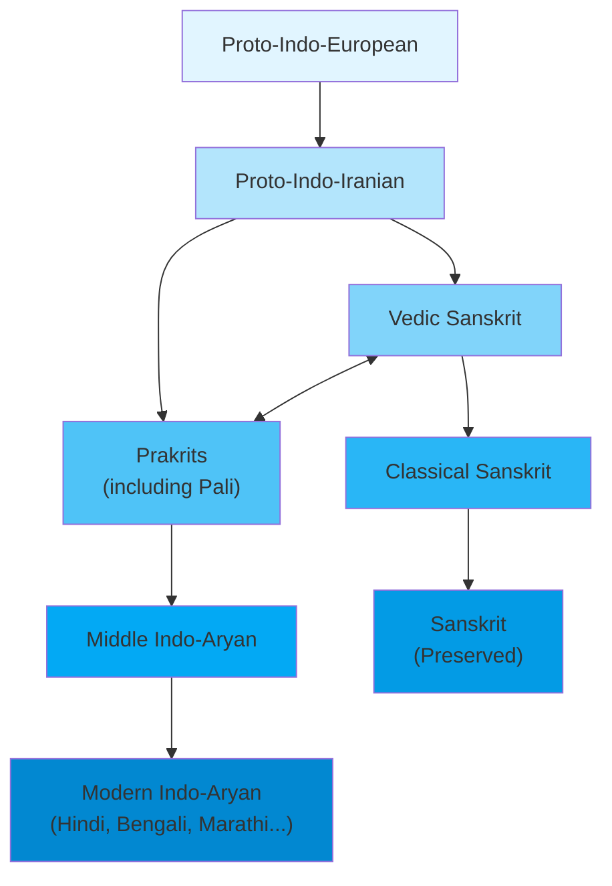

import Highlight from "@/react/Highlight/Highlight.jsx";

Welcome to **Part 3** of your Sanskrit mastery journey! After mastering grammar in Parts 1 & 2, it's time to perfect your **reading and writing skills** through the **Matra System (मात्राएँ)**, understand **pronunciation deeply**, and explore the beauty of **Sanskrit poetry meters**.

:::tip[Prerequisites - முன்நிபந்தனைகள்]
Before starting Part 3, ensure you've completed: <br></br>
✅ Part 1: All 8 cases, basic verbs, 200+ vocabulary <br></br>
✅ Part 2: 10 verb classes, passive/causative, compounds, 70+ advanced vocabulary <br></br>
✅ Familiarity with Devanagari consonants (from Part 1)

If you need review, revisit **Parts 1 & 2** first!
:::

## <Highlight color='#800031' highlight='fg' fontWeight='bold'> The Name "Sanskrit" - संस्कृतम् Etymology </Highlight>

### <Highlight color='#004080' highlight='fg' fontWeight='bold'> Why is it called संस्कृतम् (Samskritam)? </Highlight>

The word **संस्कृतम् (Samskritam/Sanskrit)** comes from the Sanskrit root कृ (kṛi - to make/do) with the prefix सम् (sam - well, perfectly, completely).

**Etymology Breakdown:**
- सम् (sam) = well, perfectly, together
- कृत (krita) = made, done, refined (past participle of कृ)
- संस्कृतम् (samskritam) = well-made, perfectly refined, polished

**Tamil Connection - தமிழ் தொடர்பு:**

In Tamil, this is written as **சமஸ்கிருதம் (Samaskritham)**. The root **சம்** (sam) relates to the Tamil word **சமைத்த** (samaitha - prepared, refined, perfected):

<div class="table-luxury-grid">

| Sanskrit | Tamil | Meaning | Concept |
|----------|-------|---------|---------|
| सम् (sam) | சம் | well, perfectly | Completeness, perfection |
| कृत (krita) | கிருத (செய்யப்பட்ட) | made, done | Past action |
| संस्कृतम् (samskritam) | சமஸ்கிருதம் (சமைத்த மொழி) | refined language | Perfectly prepared/polished language |

</div>

**Why "Refined"?**

Sanskrit is called "refined" or "perfected" because:

1. **Systematically Polished**: Panini's grammar rules (4th century BCE) refined the language into a perfect, logical system
2. **Literary Excellence**: Used for sophisticated literature, philosophy, and science
3. **Contrast with Prakrit**: Distinguished from प्राकृत (Praakrita - "natural, unrefined") languages spoken by common people
4. **Cultural Refinement**: Associated with educated, cultured speech

**Tamil Parallel:**
- செந்தமிழ் (Senthamizh) = செம்மையான தமிழ் (pure/refined Tamil)
- சமஸ்கிருதம் (Samaskritham) = "refined/polished language"

Both emphasize the **cultivated, perfected nature** of the classical language!

:::tip[Interesting Fact - சுவாரஸ்ய உண்மை]
The prefix सम् (sam) appears in many Sanskrit words:
- **समाज** (samaaja) = society (sam + aaja = coming together)
- **सम्पूर्ण** (sampoorna) = complete (sam + poorna = perfectly full)
- **संयोग** (samyoga) = union (sam + yoga = perfect joining)
- **संस्कार** (sanskaara) = refinement, purification

All carry the sense of "perfection, completeness, togetherness"!
:::

## <Highlight color='#800031' highlight='fg' fontWeight='bold'> Sanskrit's Ancient Relatives - प्राचीन भाषासम्बन्धाः </Highlight>

### <Highlight color='#004080' highlight='fg' fontWeight='bold'> Pali and Other Historic Languages </Highlight>

Sanskrit belongs to the **Indo-Aryan language family** and has fascinating relationships with now-extinct languages that once flourished in ancient India.

**Pali (पालि - Pāli):**

Pali is an ancient **Middle Indo-Aryan language** that coexisted with Sanskrit but served a different purpose. While Sanskrit was the language of Vedic rituals and Hindu texts, **Pali became the sacred language of Theravada Buddhism**. The Buddha's teachings (Tripitaka) were preserved in Pali, making it immensely important for Buddhist scripture.

**Relationship with Sanskrit:**

Pali is NOT derived from Sanskrit but rather both evolved from earlier Proto-Indo-Aryan. However, they share deep similarities:

<div class="table-luxury-grid">

| Concept | Sanskrit | Pali | Tamil | English |
|---------|----------|------|-------|---------|
| Righteousness | धर्म (dharma) | धम्म (dhamma) | தர்மம் | dharma/dhamma |
| Action/Deed | कर्म (karma) | कम्म (kamma) | கர்மா | karma/kamma |
| Suffering | दुःख (duḥkha) | दुक्ख (dukkha) | துக்கம் | suffering |
| Wisdom | ज्ञान (jñaana) | ञाण (ñāṇa) | ஞானம் | knowledge |
| Nirvana | निर्वाण (nirvaana) | निब्बान (nibbāna) | நிர்வாணம் | liberation |

</div>

**Key Differences:**
- **Sanskrit**: र, ज्ञ preserved → **Pali**: र → ळ/ड, ज्ञ → ञ (simplified)
- **Sanskrit**: Complex sandhi rules → **Pali**: Simpler phonology
- **Sanskrit**: 8 cases → **Pali**: Reduced case system

**Example Sentence Comparison:**

**Sanskrit:**
```
सब्बे सत्ता सुखिता होन्तु ।
sabbe sattā sukhitā hontu |
```

**Pali (same meaning):**
```
सब्बे सत्ता सुखिता होन्तु ।
sabbe sattā sukhitā hontu |
```

**Tamil**: அனைத்து உயிர்களும் மகிழ்ச்சியாக இருக்கட்டும்
**English**: May all beings be happy!

(Notice how similar they are! This particular phrase is identical in both.)

**Other Ancient Languages:**

1. **Prakrit (प्राकृत)**: "Natural" languages - vernacular forms including:
   - Maharashtri Prakrit (used in Jain texts)
   - Shauraseni Prakrit
   - Magadhi Prakrit

2. **Ardhamagadhi (अर्धमागधी)**: Used in Jain scriptures

3. **Gandhari**: Buddhist texts in northwest India (Kharosthi script)

All these languages are now **extinct** but contributed to the development of modern Indo-Aryan languages like Hindi, Marathi, Bengali, and influenced Dravidian languages including Tamil through centuries of interaction.

### <Highlight color='#004080' highlight='fg' fontWeight='bold'> Language Evolution - மொழி பரிணாமம் </Highlight>

**The Family Tree:**



> Sanskrit survived because it was **consciously preserved** through oral and written tradition, while Prakrits evolved into modern languages!

## <Highlight color='#800031' highlight='fg' fontWeight='bold'> The Matra System - मात्रा प्रणाली </Highlight>

### <Highlight color='#004080' highlight='fg' fontWeight='bold'> Understanding Matras - மாத்திரை புரிதல் </Highlight>

**What are Matras?**

Matras (मात्रा) are **vowel marks** added to consonants to change their pronunciation. Think of them like:
- **Tamil**: க் + அ = க, க் + ஆ = கா, க் + இ = கி
- **English**: Adding vowel sounds to consonants

In Devanagari, every consonant has an inherent **अ (a)** sound. Matras modify this to other vowel sounds.

**Why Learn Matras?**
- Essential for reading ANY Sanskrit text
- Understanding how words are spelled
- Proper pronunciation
- Writing Sanskrit correctly

:::note[Tamil-Sanskrit Script Comparison]
**Similarities:**
- Both use vowel marks (மாத்திரை/मात्रा)
- க் (k) + ா = கா | क् (k) + ा = का
- Similar logic, different symbols!

**Differences:**
- Tamil: 12 vowels, 18 consonants
- Sanskrit: 13 vowels, 33 consonants (+ conjuncts)
- Tamil: Linear vowel marks mostly
- Sanskrit: Vowel marks appear top, bottom, left, right of consonant
:::

### <Highlight color='#004080' highlight='fg' fontWeight='bold'> Complete Matra Chart - முழு மாத்திரை அட்டவணை </Highlight>

**Base Consonant**: क् (k) - We'll add each matra to this consonant

<div class="table-luxury-grid">

| Vowel | Independent | Matra Symbol | With क् | Pronunciation | Tamil Example |
|-------|-------------|--------------|---------|---------------|---------------|
| अ | अ | (inherent) | क | ka | க |
| आ | आ | ा | का | kaa | கா |
| इ | इ | ि | कि | ki | கி |
| ई | ई | ी | की | kee | கீ |
| उ | उ | ु | कु | ku | கு |
| ऊ | ऊ | ू | कू | koo | கூ |
| ऋ | ऋ | ृ | कृ | kri | க்ரி |
| ॠ | ॠ | ॄ | कॄ | kree | க்ரீ |
| ऌ | ऌ | ॢ | कॢ | klri | க்ல்ரி |
| ए | ए | े | के | ke | கே |
| ऐ | ऐ | ै | कै | kai | கை |
| ओ | ओ | ो | को | ko | கோ |
| औ | औ | ौ | कौ | kau | கௌ |

</div>

**Key Observations:**

1. **Above the line**: ि (i), ी (ee), े (e), ै (ai), ो (o), ौ (au)
2. **Below the line**: ु (u), ू (oo), ृ (ri), ॄ (ree), ॢ (lri)
3. **After consonant**: ा (aa)
4. **No mark**: inherent अ (a)

### <Highlight color='#004080' highlight='fg' fontWeight='bold'> Matra Practice with Common Consonants </Highlight>

**Let's practice with प् (p):**

<div class="table-luxury-grid">

| Matra | Symbol | Result | Pronunciation | Example Word | Meaning |
|-------|--------|--------|---------------|--------------|---------|
| अ | - | प | pa | पठ (paṭh) | to read |
| आ | ा | पा | paa | पाठ (paaṭh) | lesson |
| इ | ि | पि | pi | पिता (pitaa) | father |
| ी | ी | पी | pee | पीत (peeta) | yellow |
| उ | ु | पु | pu | पुत्र (putra) | son |
| ू | ू | पू | poo | पूर्ण (poorṇa) | complete |
| ऋ | ृ | पृ | pri | पृथ्वी (prithvee) | earth |
| े | े | पे | pe | पेय (peya) | drinkable |
| ै | ै | पै | pai | पैतृक (paitrika) | ancestral |
| ो | ो | पो | po | पोत (pota) | ship |
| ौ | ौ | पौ | pau | पौत्र (pautra) | grandson |

</div>

**Practice with त् (t):**

<div class="table-luxury-grid">

| With Matra | Pronunciation | Example | Meaning | Tamil |
|------------|---------------|---------|---------|-------|
| त | ta | तत् (tat) | that | அது |
| ता | taa | ताप (taapa) | heat | தாபம் |
| ति | ti | तिथि (tithi) | date | திதி |
| ती | tee | तीर्थ (teertha) | pilgrimage | தீர்த்தம் |
| तु | tu | तुम् (tum) | you | நீ |
| तू | too | तूर्य (toorya) | musical instrument | தூரியம் |
| तृ | tri | तृण (triṇa) | grass | புல் |
| ते | te | ते (te) | they | அவர்கள் |
| तै | tai | तैल (taila) | oil | தைலம் |
| तो | to | तोय (toya) | water | நீர் |
| तौ | tau | तौ (tau) | those two | அவ்விருவர் |

</div>

### <Highlight color='#004080' highlight='fg' fontWeight='bold'> Special Cases - விசேஷ நிகழ்வுகள் </Highlight>

**1. Halanta (हलन्त) - Consonants without vowels:**

When a consonant has NO vowel, add **halanta mark (्)** called **virāma**.

<div class="table-luxury-grid">

| Consonant | With Halanta | Pronunciation | Example |
|-----------|--------------|---------------|---------|
| क | क् | k (no vowel) | वाक् (vaak - speech) |
| त | त् | t (no vowel) | तत् (tat - that) |
| म | म् | m (no vowel) | रामम् (raamam - Rama, accusative) |
| न | न् | n (no vowel) | धनम् (dhanam - wealth) |

</div>

**2. Anusvara (अनुस्वार) - ं:**

Nasal sound, represented by dot above (ं). Pronunciation changes based on following consonant.

<div class="table-luxury-grid">

| Sanskrit | Anusvara Position | Pronunciation | Tamil Equivalent | English |
|----------|-------------------|---------------|------------------|---------|
| संस्कृतम् | सं | sam | ஸம் | Sanskrit |
| गङ्गा | गं (before ग) | gang | கங் | Ganga |
| सन्ति | (becomes न् before त) | santi | ஸந்தி | they are |
| शान्ति | शां | shaan | ஷாந் | peace |

</div>

**3. Visarga (विसर्ग) - ः:**

Aspiration sound, represented by two dots (:). Pronounced as light "h" breath.

<div class="table-luxury-grid">

| Sanskrit | With Visarga | Pronunciation | Tamil | Meaning |
|----------|--------------|---------------|-------|---------|
| रामः | ः | raama-ḥ | ராமஃ | Rama (nominative) |
| गुरुः | ः | guru-ḥ | குருஃ | teacher |
| फलः | ः | phala-ḥ | பலஃ | fruit |
| नमः | ः | nama-ḥ | நமஃ | salutation |

</div>

### <Highlight color='#004080' highlight='fg' fontWeight='bold'> Sanskrit Punctuation Marks - विराम चिह्नानि </Highlight>

Sanskrit uses unique punctuation marks different from English or Tamil:

**1. दण्ड (Daṇḍa) - । (Single Vertical Line)**

**Usage**: Marks the end of a **half-verse** or **pause** within a sentence.
- Similar to English comma (,) or semicolon (;)
- Called **एकदण्डः (ekadaṇḍaḥ)** - "single staff"
- Used to separate clauses or phrases

**Examples:**
```
सत्यं वद । धर्मं चर ।
satyaṁ vada | dharmaṁ cara |
(Speak truth. Practice righteousness.)

यतो धर्मः ततो जयः ।
yato dharmaḥ tato jayaḥ |
(Where there is dharma, there is victory.)
```

**2. पूर्णविराम (Pūrṇavirāma) - ।। (Double Vertical Line)**

**Usage**: Marks the **end of a verse, sentence, or complete thought**.
- Similar to English period (.) or full stop
- Called **द्विदण्डः (dvidaṇḍaḥ)** - "double staff"
- Indicates complete conclusion

**Examples:**
```
कर्मण्येवाधिकारस्ते मा फलेषु कदाचन ।
karmaṇyevādhikāraste mā phaleṣu kadācana |

मा कर्मफलहेतुर्भूः मा ते सङ्गोऽस्त्वकर्मणि ।।
mā karmaphalaheturbhūḥ mā te saṅgo'stvakarmaṇi ||
```

**Line-by-line romanization:**

कर्मण्येवाधिकारस्ते = karmaṇyevādhikāraste (in action only your right/claim is) <br></br>
मा फलेषु कदाचन = mā phaleṣu kadācana (never in fruits at any time) <br></br>
मा कर्मफलहेतुर्भूः = mā karmaphalaheturbhūḥ (let not the fruit of action be your motive) <br></br>
मा ते सङ्गोऽस्त्वकर्मणि = mā te saṅgo'stvakarmaṇi (nor let there be in you attachment to non-action)

**Word-by-word breakdown:**
- कर्मणि = in action
- एव = only/just
- अधिकार = right/claim
- अस्ते = you have
- मा = not/never
- फलेषु = in fruits
- कदाचन = ever/at any time
- कर्मफल = fruit of action
- हेतु = cause/motive
- भूः = be
- सङ्ग = attachment
- अस्तु = let it be/should be
- अकर्मणि = in inaction/non-action

> **Meaning:** You have a right to action only, but never to its fruits.
Do not be motivated by the fruits of action, nor be attached to inaction.
(Bhagavad Gita 2.47)

**Comparison with Other Scripts:**

<div class="table-luxury-grid">

| Script | Half-Stop | Full Stop | Example |
|--------|-----------|-----------|---------|
| **Sanskrit** | । (daṇḍa) | ।। (dvidaṇḍa) | वेदः । वेदान्तः ।। |
| **Tamil** | , (comma) | . (period) | வேதம், வேதாந்தம். |
| **English** | , or ; | . | Veda, Vedanta. |

</div>

**3. अवग्रह (Avagraha) - ऽ**

**Usage**: Indicates **elision** of अ (a) sound.
- Shows where a vowel was dropped in sandhi
- Rarely used in modern texts

**Example:**
```
तेऽपि (te + api) → ते + अपि (they also)
सोऽपि (saḥ + api) → सः + अपि (he also)
```

**Usage in Poetry:**

In Sanskrit verses (श्लोक - shloka), punctuation follows strict patterns:

```
[Line 1] ।
[Line 2] ।
[Line 3] ।
[Line 4] ।।
```

The **।।** always marks the completion of a verse!

**Modern Usage:**

In contemporary Sanskrit texts:
- Modern punctuation (. , ; !) is also used
- Traditional । and ।। still preferred in:
  - Religious texts
  - Poetry and verses
  - Classical literature
  - Formal Sanskrit writing

:::tip[Reading Tip - வாசிப்பு உதவிக்குறிப்பு]
**When you see । (daṇḍa):**
- Pause briefly (like comma)
- Take a breath
- Continue reading

**When you see ।। (dvidaṇḍa):**
- Full stop
- Complete thought finished
- New sentence or verse begins

**Practice:**
Read this aloud with proper pauses:
```
विद्या विनयेन शोभते । 
विनयः विद्यया शोभते ।।

vidyā vinayena śobhate |
vinayaḥ vidyayā śobhate ||
```

> (Knowledge shines with humility. Humility shines with knowledge.)

:::

## <Highlight color='#800031' highlight='fg' fontWeight='bold'> Pronunciation Mastery - उच्चारण निपुणता </Highlight>

### <Highlight color='#004080' highlight='fg' fontWeight='bold'> Vowel Pronunciation Guide </Highlight>

**Short vs Long Vowels:**

<div class="table-luxury-grid">

| Short Vowel | Duration | Long Vowel | Duration | Tamil Comparison |
|-------------|----------|------------|----------|------------------|
| अ (a) | 1 मात्रा | आ (aa) | 2 मात्रा | அ vs ஆ |
| इ (i) | 1 मात्रा | ई (ee) | 2 मात्रा | இ vs ஈ |
| उ (u) | 1 मात्रा | ऊ (oo) | 2 मात्रा | உ vs ஊ |
| ऋ (ri) | 1 मात्रा | ॠ (ree) | 2 मात्रा | ருʼ vs ரூ |

</div>

**Pronunciation Tips:**

1. **अ (a)**: Like "u" in "but" - neutral, short
2. **आ (aa)**: Like "a" in "father" - open, long
3. **इ (i)**: Like "i" in "pin" - short, closed
4. **ई (ee)**: Like "ee" in "see" - long, closed
5. **उ (u)**: Like "u" in "put" - short, rounded lips
6. **ऊ (oo)**: Like "oo" in "food" - long, rounded lips
7. **ऋ (ri)**: Like "ri" in "Krishna" - vocalic r
8. **ए (e)**: Like "a" in "gate" - medium length
9. **ऐ (ai)**: Like "ai" in "aisle" - diphthong
10. **ओ (o)**: Like "o" in "go" - medium length
11. **औ (au)**: Like "ow" in "cow" - diphthong

### <Highlight color='#004080' highlight='fg' fontWeight='bold'> Consonant Groups - व्यञ्जन वर्गाः </Highlight>

Sanskrit consonants are organized by **place of articulation** (where in mouth they're produced).

**The 5 Varga (Classes):**

<div class="table-luxury-grid">

| Varga | Place | Unaspirated | Aspirated | Unaspirated | Aspirated | Nasal | Tamil Example |
|-------|-------|-------------|-----------|-------------|-----------|-------|---------------|
| **कवर्ग** | Velar (throat) | क (ka) | ख (kha) | ग (ga) | घ (gha) | ङ (ṅa) | க, க், ங |
| **चवर्ग** | Palatal (palate) | च (cha) | छ (chha) | ज (ja) | झ (jha) | ञ (ña) | ச, ஞ |
| **टवर्ग** | Retroflex (roof) | ट (ṭa) | ठ (ṭha) | ड (ḍa) | ढ (ḍha) | ण (ṇa) | ட, ண |
| **तवर्ग** | Dental (teeth) | त (ta) | थ (tha) | द (da) | ध (dha) | न (na) | த, ந |
| **पवर्ग** | Labial (lips) | प (pa) | फ (pha) | ब (ba) | भ (bha) | म (ma) | ப, ம |

</div>

**Additional Consonants:**

<div class="table-luxury-grid">

| Category | Consonants | Pronunciation | Tamil |
|----------|------------|---------------|-------|
| **Semi-vowels** | य (ya), र (ra), ल (la), व (va) | य=y, र=r, ल=l, व=v/w | ய, ர, ல, வ |
| **Sibilants** | श (sha), ष (ṣha), स (sa) | श=palatal sh, ष=retroflex sh, स=dental s | ஶ, ஷ, ஸ |
| **Aspirate** | ह (ha) | h sound | ஹ |

</div>

### <Highlight color='#004080' highlight='fg' fontWeight='bold'> Aspiration - महाप्राण </Highlight>

**What is Aspiration?**

Aspirated consonants have a "breath of air" after the sound.

<div class="table-luxury-grid">

| Unaspirated | Aspirated | Difference | Example |
|-------------|-----------|------------|---------|
| क (ka) | ख (kha) | Add "h" breath | काल (kaal - time) vs खाल (khaal - skin) |
| च (cha) | छ (chha) | Add "h" breath | चल (chala - move) vs छल (chhala - deceit) |
| ट (ṭa) | ठ (ṭha) | Add "h" breath | टल (ṭala - delay) vs ठल (ṭhala - place) |
| त (ta) | थ (tha) | Add "h" breath | तन (tana - body) vs थन (thana - udder) |
| प (pa) | फ (pha) | Add "h" breath | पल (pala - moment) vs फल (phala - fruit) |

</div>

:::tip[Mastering Aspiration - மஹாபிராண தேர்ச்சி]
**Practice Method:**
1. Hold hand in front of mouth
2. Unaspirated: No air felt - क (ka)
3. Aspirated: Air burst felt - ख (kha)

**Common Mistakes:**
- ❌ Pronouncing ख (kha) as "ka" - loses meaning!
- ❌ Over-aspirating - sounds artificial
- ✅ Natural breath after consonant

Tamil doesn't have aspiration, so practice is essential!
:::

## <Highlight color='#800031' highlight='fg' fontWeight='bold'> Conjunct Consonants - संयुक्ताक्षर </Highlight>

### <Highlight color='#004080' highlight='fg' fontWeight='bold'> Understanding Conjuncts </Highlight>

When two or more consonants appear together without a vowel between them, they form **conjuncts (संयुक्ताक्षर)**.

**Formation**: Consonant₁ + ् (halanta) + Consonant₂

**Common Patterns:**

<div class="table-luxury-grid">

| Type | Formation | Example | Pronunciation | Word | Meaning |
|------|-----------|---------|---------------|------|---------|
| **Half Form** | क् + त = क्त | क्त | kta | शक्ति (shakti) | power |
| **Vertical Stack** | स् + त = स्त | स्त | sta | अस्ति (asti) | is |
| **Side by Side** | प् + र = प्र | प्र | pra | प्रकाश (prakaasha) | light |
| **Special Form** | ज् + ञ = ज्ञ | ज्ञ | jña | ज्ञान (jñaana) | knowledge |

</div>

**Most Common Conjuncts:**

<div class="table-luxury-grid">

| Conjunct | Components | Example Word | Meaning | Tamil |
|----------|------------|--------------|---------|-------|
| क्ष | क् + ष | क्षत्रिय (kṣhatriya) | warrior | க்ஷத்ரிய |
| त्र | त् + र | त्रि (tri) | three | த்ரி |
| न्न | न् + न | अन्न (anna) | food | அன்ன |
| स्थ | स् + थ | स्थान (sthaana) | place | ஸ்தான |
| श्र | श् + र | श्रवण (shravaṇa) | hearing | ஶ்ரவண |
| प्र | प् + र | प्रथम (prathama) | first | ப்ரதம |
| स्व | स् + व | स्वर (svara) | voice | ஸ்வர |
| द्य | द् + य | विद्या (vidyaa) | knowledge | வித்யா |
| त्य | त् + य | सत्य (satya) | truth | ஸத்ய |
| क्त | क् + त | युक्त (yukta) | united | யுக்த |

</div>

### <Highlight color='#004080' highlight='fg' fontWeight='bold'> Reading Practice - पठन अभ्यास </Highlight>

**Exercise 1: Read these words slowly**

<div class="table-luxury-grid">

| Sanskrit | Breakdown | Pronunciation | Tamil | English |
|----------|-----------|---------------|-------|---------|
| संस्कृतम् | सं-स्-कृ-तम् | samskritam | ஸம்ஸ்க்ருதம் | Sanskrit |
| विद्यालय | वि-द्-या-ल-य | vidyaalaya | வித்யாலய | school |
| शिक्षक | शि-क्-ष-क | shikṣhaka | ஶிக்ஷக | teacher |
| पुस्तकम् | पु-स्-त-कम् | pustakam | புஸ்தகம் | book |
| प्रकृति | प्र-कृ-ति | prakriti | ப்ரக்ருதி | nature |
| स्वतन्त्र | स्व-तन्-त्र | svatantra | ஸ்வதந்த்ர | independent |
| मन्त्र | मन्-त्र | mantra | மந்த்ர | sacred chant |
| शास्त्र | शा-स्-त्र | shaastra | ஶாஸ்த்ர | scripture |

</div>

**Exercise 2: Full Sentences**

```
1. सत्यं वद धर्मं चर ।
   satyaṁ vada dharmaṁ cara |
   sa-tyam va-da dha-rmam cha-ra
   Speak truth, practice righteousness.
   
2. विद्या विनयेन शोभते ।
   vidyā vinayena śobhate |
   vi-dyaa vi-na-ye-na sho-bha-te
   Knowledge shines with humility.
   
3. अहं संस्कृतं पठामि ।
   ahaṁ saṁskṛtaṁ paṭhāmi |
   a-ham sam-skri-tam pa-ṭhaa-mi
   I read Sanskrit.
```

## <Highlight color='#800031' highlight='fg' fontWeight='bold'> Advanced Sandhi Rules - उन्नत सन्धि नियमाः </Highlight>

### <Highlight color='#004080' highlight='fg' fontWeight='bold'> Consonant Sandhi - व्यञ्जन सन्धि </Highlight>

**Rule 1: Voicing (स्वर सामञ्जस्य)**

When voiceless consonant meets voiced sound, it becomes voiced.

<div class="table-luxury-grid">

| Before Sandhi | After Sandhi | Rule | Example |
|---------------|--------------|------|---------|
| तत् + अस्ति | तदस्ति (tad-asti) | त् → द् before vowel | That is |
| वाक् + ईशः | वागीशः (vaag-eeshaḥ) | क् → ग् before vowel | Lord of speech |
| षट् + गुणाः | षड्गुणाः (ṣhaḍ-guṇaaḥ) | ट् → ड् before ग | Six qualities |

</div>

**Rule 2: Aspiration Addition**

When unaspirated meets aspirated, first becomes aspirated.

<div class="table-luxury-grid">

| Combination | Result | Example |
|-------------|--------|---------|
| त् + ध | द्ध | तत् + धर्मः = तद्धर्मः |
| क् + ख | क्ख | तत् + खलु = तक्खलु |

</div>

**Rule 3: Retroflex Conversion (मूर्धन्यीकरण)**

न् becomes ण् after र्, ष्, ऋ.

<div class="table-luxury-grid">

| Before | After | Rule | Example |
|--------|-------|------|---------|
| राम + नः | रामणः | After र् | - |
| कृष् + न | कृष्ण (Krishna) | After ष् | Krishna |
| तृ + न | तृण (grass) | After ऋ | Grass |

</div>

### <Highlight color='#004080' highlight='fg' fontWeight='bold'> Visarga Sandhi - विसर्ग सन्धि </Highlight>

**Rule 1: Before क्, ख्, प्, फ् → remains ः**

<div class="table-luxury-grid">

| Before Sandhi | After Sandhi | Remains Unchanged |
|---------------|--------------|-------------------|
| रामः + करोति | रामः करोति | ः stays before क |
| गुरुः + पठति | गुरुः पठति | ः stays before प |

</div>

**Rule 2: Before च्, छ् → श्**

```
नमः + चन्द्राय = नमश्चन्द्राय (namaś chandrāya)
```

**Rule 3: Before ट्, ठ् → ष्**

```
धनुः + टङ्कारः = धनुष्टङ्कारः (dhanuṣ ṭaṅkāraḥ)
```

**Rule 4: Before त्, थ् → स्**

```
नमः + ते = नमस्ते (namaste)
मनः + तापः = मनस्तापः (manastāpaḥ)
```

## <Highlight color='#800031' highlight='fg' fontWeight='bold'> Poetry Meters - छन्दः शास्त्रम् </Highlight>

### <Highlight color='#004080' highlight='fg' fontWeight='bold'> Introduction to Chandas </Highlight>

Sanskrit poetry follows strict **metrical patterns (छन्दः - chhandaḥ)**. Each meter has:
- Fixed number of syllables per line
- Pattern of long (गुरु - guru) and short (लघु - laghu) syllables

**Syllable Length:**

<div class="table-luxury-grid">

| Type | Symbol | Rule | Example |
|------|--------|------|---------|
| **लघु (Short)** | । (U) | Short vowel + single consonant | क, पि, सु |
| **गुरु (Long)** | S (–) | Long vowel OR short vowel + conjunct | का, पी, क्त |

</div>

### <Highlight color='#004080' highlight='fg' fontWeight='bold'> Anuṣṭubh Meter - अनुष्टुप् छन्दः </Highlight>

**Most common meter** in Sanskrit! Bhagavad Gita uses this extensively.

**Structure:**
- 4 lines (पाद - pada)
- 8 syllables per line
- Total: 32 syllables
- Specific pattern in 5th-7th syllables

**Example from Bhagavad Gita (2.47):**

```
कर्मण्येवाधिकारस्ते ।
मा फलेषु कदाचन ।
मा कर्मफलहेतुर्भूः ।
मा ते सङ्गोऽस्त्वकर्मणि ॥
```

**Syllable count:**
- Line 1: कर्-म-ण्ये-वा-धि-का-रस्-ते (8)
- Line 2: मा-फ-ले-षु-क-दा-च-न (8)
- Line 3: मा-कर्-म-फ-ल-हे-तुर्-भूः (8)
- Line 4: मा-ते-सङ्-गोऽ-स्त्व-कर्-म-णि (8)

### <Highlight color='#004080' highlight='fg' fontWeight='bold'> Śārdūlavikrīḍita - शार्दूलविक्रीडित </Highlight>

Longer, more complex meter used in classical poetry.

**Structure:**
- 4 lines
- 19 syllables per line
- Fixed pattern: सा-विध़ा-सू-लगा (12 specific + 7 flexible)

**Example:**

```
श्लोकार्धेन प्रवक्ष्यामि यदुक्तं ग्रन्थकोटिभिः ।
ब्रह्मा स्वयंभूः परमेश्वरः स त्रैलोक्यनाथः ॥

shlokārdhen pravakṣyāmi yaduktaṁ granthakoṭibhiḥ |
brahmā svayaṁbhūḥ parameśvaraḥ sa trailokyanāthaḥ ||
```
**Word-by-word:** <br></br>
shloka-ardhen = by half a verse, pravakṣyāmi = I will speak/describe <br></br>
yat = what, uktam = said, grantha-koṭibhiḥ = by millions of books <br></br>
brahmā = Brahma, svayambhūḥ = self-born, parameśvaraḥ = supreme lord <br></br>
sa = that, trailokya-nāthaḥ = lord of three worlds

> **Meaning:** I shall speak in half a verse what has been said in millions of books.
Brahma (the creator), self-born, the Supreme Lord—He is the Lord of the three worlds.

## <Highlight color='#800031' highlight='fg' fontWeight='bold'> Reading Classical Texts - Part 2 </Highlight>

### <Highlight color='#004080' highlight='fg' fontWeight='bold'> From Hitopadesha - हितोपदेशः </Highlight>

**Story 1: The Crow and the Serpent (काक-सर्प कथा)**

```
अस्ति कस्मिंश्चिद्वने महती शाल्मली ।
तत्र काकद्वन्द्वं निवसति स्म ॥
```

**Translation:**
- अस्ति (asti) = there is
- कस्मिंश्चित् (kasmiṁś chit) = in some
- वने (vane) = in forest
- महती (mahatī) = great/big
- शाल्मली (śālmalī) = silk-cotton tree
- तत्र (tatra) = there
- काकद्वन्द्वम् (kāka-dvandvam) = pair of crows
- निवसति स्म (nivasati sma) = used to live

**Tamil**: ஒரு காட்டில் பெரிய புரசமரம் இருந்தது. அங்கு காகக்கூட்டம் வாழ்ந்தது.
**English**: In a certain forest, there was a great silk-cotton tree. There a pair of crows used to live.

**Grammar Points:**
- कस्मिंश्चित् = कस्मिन् (locative) + चित् (indefinite particle)
- द्वन्द्वम् = compound (pair)
- निवसति स्म = imperfect continuous (used to live)

### <Highlight color='#004080' highlight='fg' fontWeight='bold'> From Panchatantra - पञ्चतन्त्रम् </Highlight>

**The Monkey and the Crocodile:**

```
मित्रभेदः प्रथमतन्त्रम् ।
अस्ति गङ्गातीरे महान् जम्बूवृक्षः ।
```

**Word-by-word:**
- मित्रभेदः (mitra-bhedaḥ) = breaking of friendship
- प्रथमतन्त्रम् (prathama-tantram) = first chapter
- अस्ति (asti) = there is
- गङ्गातीरे (gaṅgā-tīre) = on bank of Ganga
- महान् (mahān) = great
- जम्बूवृक्षः (jambū-vṛikṣaḥ) = jambu tree

**Tamil**: நட்பு பிரிவு - முதல் அத்தியாயம். கங்கைக் கரையில் பெரிய நாவல் மரம் இருந்தது.
**English**: Breaking of Friendship - First Chapter. On the bank of Ganga, there was a great jambu tree.

## <Highlight color='#800031' highlight='fg' fontWeight='bold'> Part 3 Summary & Practice </Highlight>

### <Highlight color='#004080' highlight='fg' fontWeight='bold'> What You've Mastered </Highlight>

**✅ Completed in Part 3:**

1. **Matra System**: Complete understanding of all 13 vowel marks
2. **Pronunciation**: Vowels, consonants, aspiration, placement
3. **Conjunct Consonants**: Reading and writing compound consonants
4. **Advanced Sandhi**: Consonant sandhi, visarga sandhi rules
5. **Anusvara & Visarga**: Special marks and their usage
6. **Poetry Meters**: Anuṣṭubh structure and analysis
7. **Classical Reading**: Hitopadesha and Panchatantra excerpts

**📊 Your Progress After Part 3:**
- Script Mastery: Complete Devanagari reading ✓
- Pronunciation: Professional-level understanding ✓
- Reading Speed: Can read simple texts ✓
- Poetry Analysis: Basic meter recognition ✓
- Total Skills: 340+ words, full grammar, reading ability

### <Highlight color='#004080' highlight='fg' fontWeight='bold'> Practice Exercises - Part 3 </Highlight>

**1. Matra Recognition:**

Identify the matra and pronounce:

<div class="table-luxury-grid">

| Word | Matra Analysis | Pronunciation |
|------|----------------|---------------|
| किम् | कि (ki) + म् | kim |
| गीता | गी (gee) + ता (taa) | geetaa |
| गुरु | गु (gu) + रु (ru) | guru |
| कृपा | कृ (kri) + पा (paa) | kripaa |
| नेत्र | ने (ne) + त्र (tra) | netra |

</div>

**2. Write in Devanagari:**

Try writing these in Devanagari script:

1. rama (राम)
2. sita (सीता)
3. krishna (कृष्ण)
4. dharma (धर्म)
5. karma (कर्म)

**3. Read Aloud Practice:**

```
1. नमः शिवाय ।
2. ॐ नमो नारायणाय ।
3. सत्यं शिवं सुन्दरम् ।
4. वसुधैव कुटुम्बकम् ।
5. योगः कर्मसु कौशलम् ।
```

**4. Meter Analysis:**

Count syllables in this line:
```
कर्मण्येवाधिकारस्ते
```
Answer: 8 syllables (Anuṣṭubh meter)

### <Highlight color='#004080' highlight='fg' fontWeight='bold'> Daily Practice Routine for Part 3 </Highlight>

**Week 1-2: Matra Mastery**
- Day 1-3: Practice आ, इ, ई, उ, ऊ matras (15 mins daily)
- Day 4-7: Practice ए, ऐ, ओ, औ matras (15 mins daily)
- Day 8-14: Practice ऋ, ॄ and all matras combined (20 mins daily)

**Week 3-4: Pronunciation & Conjuncts**
- Daily: Read 10 conjunct words aloud (10 mins)
- Daily: Record and listen to your pronunciation (10 mins)
- Daily: Practice aspiration with hand test (5 mins)

**Week 5-6: Reading Practice**
- Read one subhashita daily (15 mins)
- Analyze sandhi in sentences (10 mins)
- Practice writing in Devanagari (15 mins)

**Week 7-8: Poetry & Classical Texts**
- Memorize one Anuṣṭubh verse (15 mins daily)
- Read Panchatantra story (20 mins)
- Analyze meter patterns (10 mins)

---

**Congratulations! 🎉**

You've now completed the **Script Mastery** portion of your Sanskrit journey! You can:
- Read Devanagari fluently ✓
- Pronounce correctly ✓
- Understand poetry meters ✓
- Read classical texts ✓

**Coming in Part 4:**
- **Professional Reading Skills**: Complex texts from epics
- **Advanced Philosophical Vocabulary**: Vedanta, Yoga terminology
- **Verse Composition**: Write your own Sanskrit poetry
- **Translation Techniques**: Sanskrit ↔ English/Tamil
- **Regional Variations**: Vedic vs Classical Sanskrit
- **Research Resources**: How to continue your studies

Ready for professional mastery? Practice Part 3 thoroughly, then proceed to Part 4! 🙏

**Resources:**
- [Sanskrit Documents](https://sanskritdocuments.org/)
- [Devanagari Practice Sheets](https://learnsanskrit.org/tools/)
- [Audio Pronunciation](forvo.com/languages/sa)
