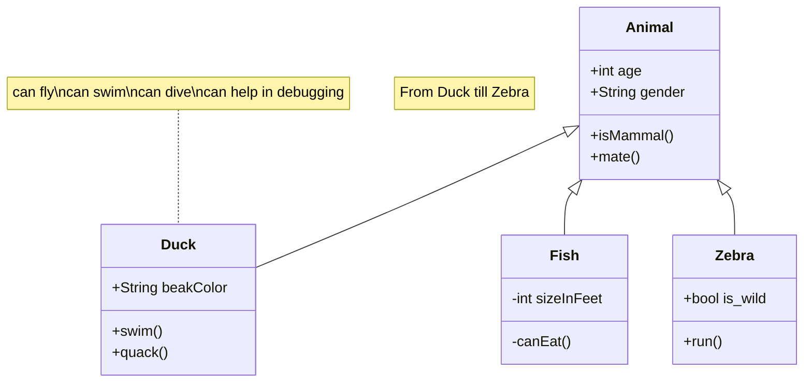

### Support Remixicon

```text
:i{class="ri-poker-hearts-fill"}
:i{class="ri-poker-clubs-fill"}
```

:i{class="ri-poker-hearts-fill"}
:i{class="ri-poker-clubs-fill"}

### Support Button

```text
:btn[Google]{href="https://www.google.com"}
```

:btn[Google]{href="https://www.google.com"}

```text
:::btn{href="#"}
:i{class="ri-share-box-line"} Open in new tab
:::
```

:::btn{href="#"}
:i{class="ri-share-box-line"} Open in new tab
:::

### Support Github Card

```text
::github{repo="actionanand/ollama-chat"}
```

::github{repo="actionanand/ollama-chat"}

### Support collapse

```bash
:::collapse
Hello World!
:::
```

:::collapse
Hello World!
:::

### Support admonitions

```markdown
:::tip[Customized Title]
hello world
:::

:::note
note
:::

:::caution
caution
:::

:::danger
danger
:::

:::warning
warning
:::

:::info
info
:::

:::tip[New Tips]
How is my new idea?
:::


:::::info[Parent]

Parent content

::::danger[Child]

Child content

:::tip[Deep Child]

Deep child content

:::

::::

:::::

```

:::tip[Customized Title]
hello world
:::

:::note
note

```js
console.log('hello world')
```

:::

:::caution
caution
:::

:::danger
danger
:::

:::warning
warning
:::

:::info
info
:::

:::tip[New Tips]
How is my new idea?
:::

:::::info[Parent]

Parent content

::::danger[Child]

Child content

:::tip[Deep Child]

Deep child content

:::

::::

:::::

### Support mermaid

Use:

+ start with **```mermaid**
+ end with **```**
+ set markdown frontmatter `mermaid: true`.

Mermaid Code:

```html title="mermaid.md"
classDiagram
note "From Duck till Zebra"
Animal <|-- Duck
note for Duck "can fly\ncan swim\ncan dive\ncan help in debugging"
Animal <|-- Fish
Animal <|-- Zebra
Animal : +int age
Animal : +String gender
Animal: +isMammal()
Animal: +mate()
class Duck{
+String beakColor
+swim()
+quack()
}
class Fish{
-int sizeInFeet
-canEat()
}
class Zebra{
+bool is_wild
+run()
}
```

Result:



### Support mathjax

+ set markdown frontmatter `mathjax: true`.

#### Block Mode

```yaml title="Mathjax.md"
---
mathjax: true
---
hello!
$$ \sum_{i=0}^N\int_{a}^{b}g(t,i)\text{d}t $$
hello!
```

hello!
$$ \sum_{i=0}^N\int_{a}^{b}g(t,i)\text{d}t $$
hello!

#### Inline Mode

```yaml title="Mathjax.md"
---
mathjax: true
---
hello! $ \sum_{i=0}^N\int_{a}^{b}g(t,i)\text{d}t $ hello!
```

hello! $ \sum_{i=0}^N\int_{a}^{b}g(t,i)\text{d}t $ hello!

### Integration with Expressive Code

For more usage, please refer to the official website [expressive-code](https://expressive-code.com/).

```js title="line-markers.js" del={2} ins={3-4} {6}
function demo() {
  console.log('this line is marked as deleted')
  // This line and the next one are marked as inserted
  console.log('this is the second inserted line')

  return 'this line uses the neutral default marker type'
}
```

### Code folding is supported by default

```js
var myArr = [1, 2]
console.log(myArr)

var myObj = {a: 1, b: 2}

for (let key of myArr) {
  console.log(key)
}

var it = myArr[Symbol.iterator]()
it.next() // {value: 1, done: false}

// VM704:12 Uncaught TypeError: myObj is not iterable
for (let key of myObj) {
  console.log(key)
}

```

### Testing New Admonitions

:::info[Custom Info Title]
This is a new info admonition with custom title and blue styling.
:::

:::warning[Custom Warning Title]
This is a warning admonition that should look like caution with orange styling.
:::

:::info
This is a standard info admonition without custom title.
:::

:::warning
This is a standard warning admonition without custom title.
:::
