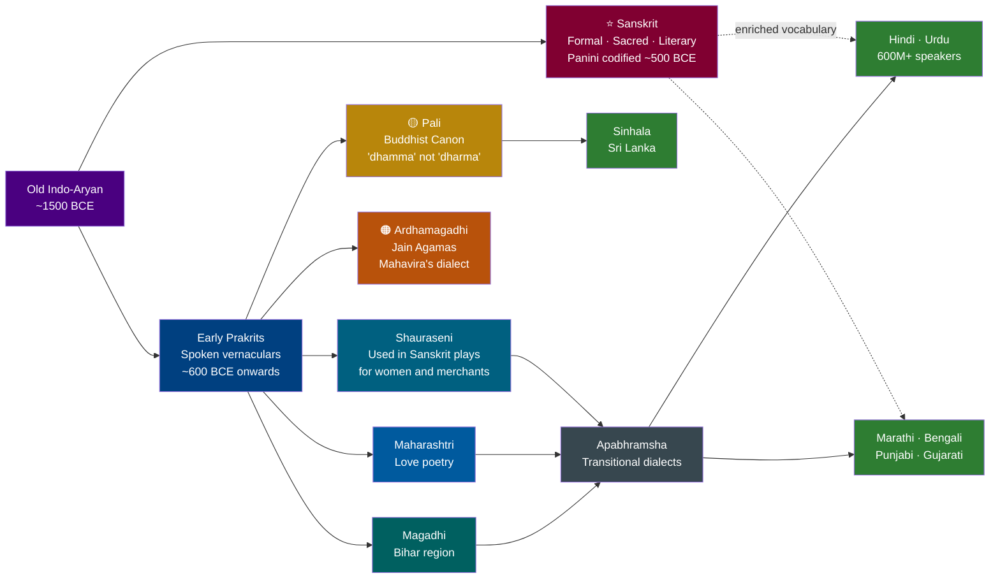
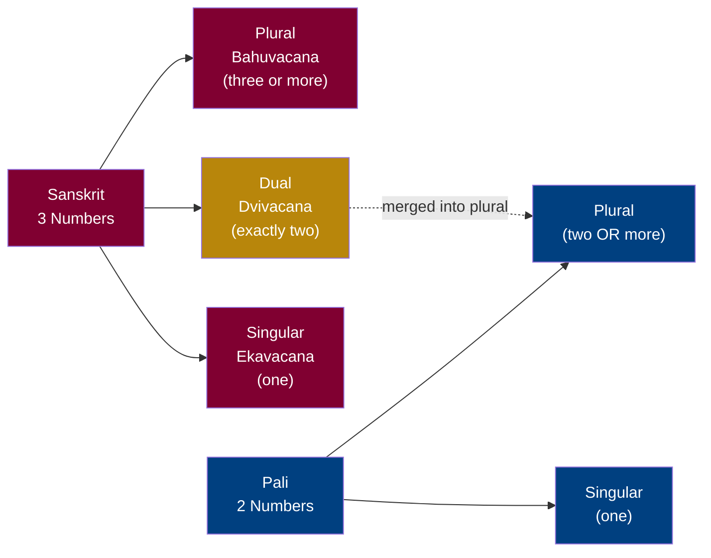
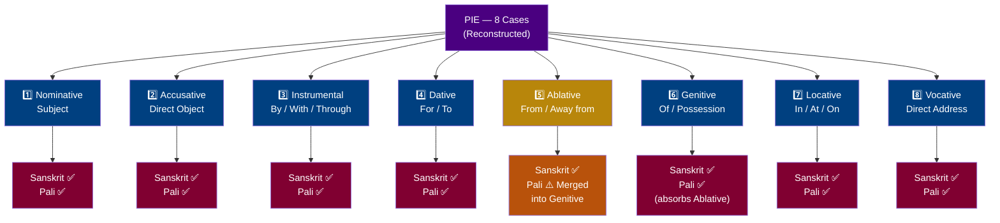
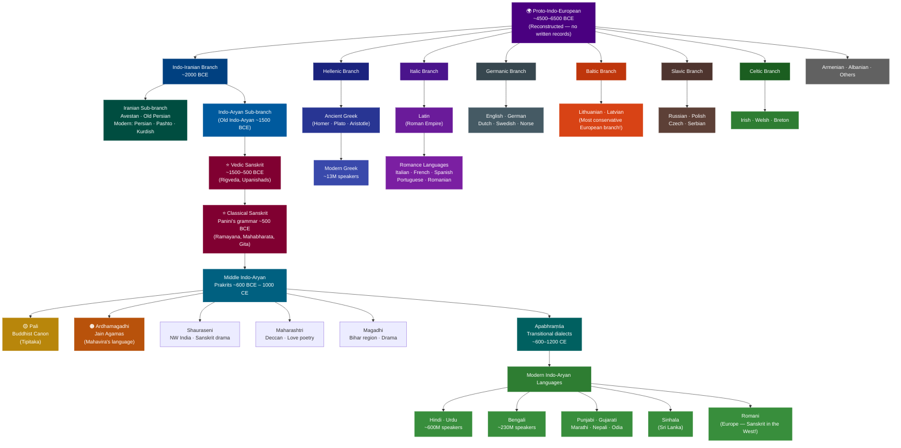

import Highlight from "@/react/Highlight/Highlight.jsx";

Have you ever noticed that **"Aham Gacchāmi"** means "I go" in Sanskrit — and almost the same phrase appears in Pali? Or that the Sanskrit word **"pitṛ"** (father) sounds strikingly like the Latin **"pater"** and the English **"father"**? These are not coincidences. They are fingerprints of one of humanity's greatest linguistic discoveries: that hundreds of languages across Asia and Europe all descend from a single ancient ancestor called **Proto-Indo-European (PIE)**.

This article takes you on a journey through Sanskrit's family tree — from its deepest roots in PIE, to its closest siblings Pali, Ardhamagadhi, and the Prakrits, all the way to its distant cousins Latin and Greek.

:::tip[Why Study Sanskrit's Linguistic Family?]
**For Language Learners:**
- Understanding shared roots makes learning Sanskrit, Hindi, Pali, or even Latin dramatically faster
- Recognizing cognates (related words) across languages builds vocabulary naturally

**For History Enthusiasts:**
- Language relationships reveal ancient human migrations and cultural exchange
- Shared grammar structures tell us how people thought thousands of years ago

**For Scholars:**
- Comparative linguistics is the foundation of modern historical language study
- Sanskrit is the best-preserved window into Proto-Indo-European

**Fun Fact**: The word **"Sanskrit"** itself (संस्कृत) means *"perfectly constructed"* or *"refined"* — and it truly is the most precisely documented ancient language in the world!
:::

## <Highlight color='#800031' highlight='fg' fontWeight='bold'> Part 1: The Ancient Root — Proto-Indo-European (PIE) </Highlight>

### <Highlight color='#004080' highlight='fg' fontWeight='bold'> What is Proto-Indo-European? </Highlight>

**Proto-Indo-European (PIE)** is the reconstructed common ancestor of a vast family of languages spoken from Ireland in the west to India and Sri Lanka in the east. No written records of PIE exist — it was spoken roughly **4,500 to 6,500 years ago**, long before writing. Linguists have *reconstructed* it by comparing hundreds of descendant languages and working backwards to find their shared patterns.

PIE is typically written with an asterisk (*) before words to show they are reconstructed, not directly attested. For example:

| PIE (Reconstructed) | Sanskrit | Latin | Greek | English | Meaning |
|---------------------|----------|-------|-------|---------|---------|
| *ph₂tḗr | पितृ (pitṛ) | pater | πατήρ (patēr) | father | father |
| *meh₂tēr | मातृ (mātṛ) | mater | μήτηρ (mētēr) | mother | mother |
| *bʰreh₂tēr | भ्रातृ (bhrātṛ) | frater | φράτηρ (phrātēr) | brother | brother |
| *néh₂us | नौ (nau) | navis | ναῦς (naus) | navigate | boat/ship |
| *ǵneh₃- | ज्ञा (jñā) | gnoscere | γιγνώσκω (gignōskō) | know | to know |
| *dʰéǵʰōm | भूमि (bhūmi) | humus | χθών (khthōn) | ground | earth |

### <Highlight color='#004080' highlight='fg' fontWeight='bold'> How Sanskrit Preserves PIE Most Faithfully </Highlight>

Among all surviving Indo-European languages, **Sanskrit is considered the most conservative** — meaning it changed the least from PIE. This is why Sanskrit has been invaluable to linguists for reconstructing PIE grammar. Here is why:

**1. Case System Preserved:** PIE had 8 grammatical cases. Sanskrit preserved all **8 cases (Vibhakti)** perfectly. Most modern languages lost most of them (English kept only 2-3 in pronouns).

**2. Three Numbers:** PIE had singular, dual, and plural. Sanskrit kept all three. Greek kept them. Latin partially kept dual. English lost dual entirely.

**3. Verb Richness:** Sanskrit's 10 tenses and moods closely mirror the PIE verbal system. Panini's grammar documented these with mathematical precision around 500 BCE.

**4. Sound System:** Sanskrit's phonetic system is extraordinarily close to PIE's reconstructed phonology — the vowels, consonants, and accent patterns all align.

:::note[The PIE Homeland - Where Did It All Begin?]
Scholars debate the original homeland of PIE speakers. The two leading theories are:

- **Steppe Hypothesis (Kurgan Theory):** PIE speakers originated in the Pontic-Caspian steppes (modern Ukraine/Russia) and spread outward around 3500-3000 BCE via horse-riding migrations
- **Anatolian Hypothesis:** PIE originated in ancient Anatolia (modern Turkey) and spread with the agricultural revolution around 7000-6000 BCE

Both theories agree that PIE speakers eventually reached the Indian subcontinent, where their language evolved into the **Vedic Sanskrit** we see in the Rigveda (c. 1500-1200 BCE).
:::

---

## <Highlight color='#800031' highlight='fg' fontWeight='bold'> Part 2: Closest Relatives — The Prakrits, Pali & Ardhamagadhi </Highlight>

### <Highlight color='#004080' highlight='fg' fontWeight='bold'> The Sanskrit–Prakrit Relationship </Highlight>

Before diving in, here is a quick visual of how Sanskrit, the Prakrits, and modern languages connect — and where Pali and Ardhamagadhi sit in that chain:

The word **Prakrit (प्राकृत)** literally means *"natural"* or *"derived from nature"* — in contrast to Sanskrit, which means *"refined/perfected."* The Prakrits were the **spoken vernacular languages** of ancient India that evolved naturally from the same Old Indo-Aryan roots as Sanskrit. They were the languages ordinary people actually spoke, while Sanskrit was the formal literary and ritual language used by scholars and priests.

Think of it this way: **Sanskrit was to Prakrits** roughly as **Classical Latin was to spoken Vulgar Latin** — one was the prestige written form, the others were the living, breathing everyday tongues that would eventually evolve into modern languages.

| Feature | Sanskrit | Prakrits | Analogy |
|---------|----------|----------|---------|
| Register | Formal, literary, sacred | Colloquial, everyday | Latin vs. Vulgar Latin |
| Grammar | Highly complex, 8 cases | Simplified, fewer cases | — |
| Consonant clusters | Preserved (e.g., *karma*) | Simplified (e.g., *kamma*) | — |
| Retroflex sounds | Prominent | Prominent | — |
| Modern descendants | Hindi, Bengali, Marathi... | Sinhala, Romani... | — |

### <Highlight color='#004080' highlight='fg' fontWeight='bold'> Pali — The Language of the Buddha </Highlight>

**Pali (पालि)** is the sacred language of **Theravāda Buddhism**, used to record the earliest Buddhist scriptures (the *Tipiṭaka* / *Pali Canon*). It is the closest Prakrit relative to Sanskrit and the one most studied alongside it.

**"Aham Gacchāmi" — Sanskrit vs. Pali:**

This is one of the most striking examples of how close these languages are:

| Element | Sanskrit | Pali | Meaning |
|---------|----------|------|---------|
| "I" | अहम् (aham) | अहं (ahaṃ) | I |
| "go" (1st person singular present) | गच्छामि (gacchāmi) | गच्छामि (gacchāmi) | I go |
| Full sentence | **अहं गच्छामि** | **अहं गच्छामि** | **I go** |

As you can see, the sentence is **virtually identical**! The verb root *gam-* (to go) and the first-person singular ending *-āmi* are shared directly from their Proto-Indo-Aryan ancestor. The difference is mostly in the final nasal sound: Sanskrit uses *aham* (with a clear *m*), while Pali uses *ahaṃ* (with an anusvāra, a nasalized vowel written as ṃ).

### <Highlight color='#004080' highlight='fg' fontWeight='bold'> The Three Numbers: Singular · Dual · Plural </Highlight>

One of Sanskrit's most remarkable features — inherited directly from PIE — is its **three grammatical numbers**. Most modern languages only distinguish singular ("one") from plural ("many"). Sanskrit goes further: it has a dedicated form for **exactly two** of anything, called the **dual (द्विवचन / Dvivacana)**.

This is not optional or poetic — in Sanskrit, if you are referring to precisely two objects, you *must* use the dual. Using plural for two things would be grammatically wrong.

**The Three Numbers in Sanskrit:**

| Number | Sanskrit Term | Meaning | When to Use |
|--------|--------------|---------|-------------|
| Singular | एकवचन (Ekavacana) | One | Exactly one person or thing |
| **Dual** | **द्विवचन (Dvivacana)** | **Two** | **Exactly two persons or things** |
| Plural | बहुवचन (Bahuvacana) | Many | Three or more |

**Dual in Action — Nouns, Pronouns, and Verbs all change:**

| Category | Singular | Dual | Plural | Meaning |
|----------|----------|------|--------|---------|
| **Pronoun — I/We** | अहम् *aham* | आवाम् *āvām* | वयम् *vayam* | I / We two / We (3+) |
| **Pronoun — You** | त्वम् *tvam* | युवाम् *yuvām* | यूयम् *yūyam* | You / You two / You all |
| **Noun — God** | देवः *devaḥ* | देवौ *devau* | देवाः *devāḥ* | One god / Two gods / Gods |
| **Noun — Student** | छात्रः *chātraḥ* | छात्रौ *chātrau* | छात्राः *chātrāḥ* | One student / Two / Many |
| **Verb — goes** | गच्छति *gacchati* | गच्छतः *gacchataḥ* | गच्छन्ति *gacchanti* | He goes / They two go / They go |
| **Verb — I go** | गच्छामि *gacchāmi* | गच्छावः *gacchāvaḥ* | गच्छामः *gacchāmaḥ* | I go / We two go / We go |

Notice that **nouns, pronouns, AND verbs** all carry the dual marker. This makes Sanskrit internally consistent — every part of the sentence signals "exactly two."

**A full example sentence:**

> **रामः वनं गच्छति** — *Rāmaḥ vanam gacchati* — **Rama goes to the forest.** (singular)
>
> **रामलक्ष्मणौ वनं गच्छतः** — *Rāmalakṣmaṇau vanam gacchataḥ* — **Rama and Lakshmana go to the forest.** (dual — the *-au* ending on the noun and *-taḥ* on the verb both mark exactly two)
>
> **रामादयः वनं गच्छन्ति** — *Rāmādayaḥ vanam gacchanti* — **Rama and the others go to the forest.** (plural — three or more)

:::tip[Why Dual Matters in Sanskrit Literature]
The dual is everywhere in Sanskrit epics because they are full of famous pairs:

- **रामलक्ष्मणौ** — Rāmalakṣmaṇau (Rama & Lakshmana)
- **कृष्णार्जुनौ** — Kṛṣṇārjunau (Krishna & Arjuna)
- **सीतारामौ** — Sītārāmau (Sita & Rama)

Every time you see that *-au* or *-e* ending on a pair of names, Sanskrit is telling you: *"Exactly these two, together."*
:::

---

### <Highlight color='#004080' highlight='fg' fontWeight='bold'> How Pali Simplified the Three Numbers → Two </Highlight>

Pali made the **radical simplification** of **eliminating the dual entirely**. This was one of the most significant grammatical changes from Sanskrit to the Prakrits. Where Sanskrit forces you to distinguish singular / two / many, Pali collapses this into just **singular and plural** — exactly like modern English.

**The effect on nouns — Sanskrit vs. Pali (masculine *deva* / god):**

| Case | Sanskrit Singular | Sanskrit Dual | Sanskrit Plural | Pali Singular | Pali Plural |
|------|------------------|--------------|-----------------|---------------|-------------|
| Nominative (Subject) | देवः *devaḥ* | देवौ *devau* | देवाः *devāḥ* | देवो *devo* | देवा *devā* |
| Accusative (Object) | देवम् *devam* | देवौ *devau* | देवान् *devān* | देवं *devaṃ* | देवे *deve* |
| Instrumental (By/With) | देवेन *devena* | देवाभ्याम् *devābhyām* | देवैः *devaiḥ* | देवेन *devena* | देवेहि *devehi* |
| Dative (For/To) | देवाय *devāya* | देवाभ्याम् *devābhyām* | देवेभ्यः *devebhyaḥ* | देवाय *devāya* | देवानं *devānaṃ* |

Notice that in Sanskrit, the **dual column** has its own unique forms for every case. In Pali, that entire column simply disappears — two gods and ten gods are both just **devā** (plural).

**The same simplification applies to verbs:**

| Person | Sanskrit Singular | Sanskrit Dual | Sanskrit Plural | Pali Singular | Pali Plural |
|--------|------------------|--------------|-----------------|---------------|-------------|
| 3rd — He/She/They go | गच्छति *gacchati* | गच्छतः *gacchataḥ* | गच्छन्ति *gacchanti* | गच्छति *gacchati* | गच्छन्ति *gacchanti* |
| 2nd — You go | गच्छसि *gacchasi* | गच्छथः *gacchathaḥ* | गच्छथ *gacchatha* | गच्छसि *gacchasi* | गच्छथ *gacchatha* |
| 1st — I/We go | गच्छामि *gacchāmi* | गच्छावः *gacchāvaḥ* | गच्छामः *gacchāmaḥ* | गच्छामि *gacchāmi* | गच्छाम *gacchāma* |

The Pali verb system is much cleaner to memorize — **6 forms** instead of Sanskrit's **9 forms** — but it loses precision. Pali cannot grammatically distinguish "we two go" from "we all go."

---

### <Highlight color='#004080' highlight='fg' fontWeight='bold'> Other Key Grammar Highlights: Sanskrit vs. Pali </Highlight>

**How Pali Differs from Sanskrit — Complete Comparison:**

| Feature | Sanskrit | Pali | What Changed |
|---------|----------|------|--------------|
| **Grammatical numbers** | 3 — Singular, **Dual**, Plural | 2 — Singular, Plural | Dual completely eliminated |
| **Noun cases** | 8 cases (Vibhakti) | 7 cases | Ablative merged into Genitive |
| **Verb classes (Gaṇas)** | 10 verb classes | Simplified to fewer | Irregularities smoothed out |
| **Consonant clusters** | Preserved: *karma, dharma, satya* | Geminated: *kamma, dhamma, sacca* | Second consonant doubled |
| **Intervocalic consonants** | Often preserved | Often weakened or dropped | *pāda* → *pāda* (same here), but *śreya* → *seyya* |
| **Sandhi rules** | Elaborate, strictly mandatory | Flexible, often optional | Greatly relaxed |
| **Aspirated consonants** | Fully preserved (bh, dh, gh, etc.) | Mostly preserved | Minor reductions |
| **Retroflex sounds** | Prominent (ṭ, ḍ, ṇ, ṣ) | Prominent | Largely preserved |
| **Gender system** | 3 genders — M, F, Neuter | 3 genders — M, F, Neuter | Preserved fully |
| **Pitch accent** | Preserved from PIE | Lost | Pali uses stress accent |
| **Passive voice** | Distinct passive paradigm | Simplified | Partially merged with active |
| **Optative mood** | Full system (Vidhi-liṅ) | Preserved as *Potential* | Retained but simplified |
| **Infinitives** | Multiple forms | One standard form (-tuṃ) | Unified |
| **Absolutives** | -tvā / -ya | -tvā / -tvāna / -ya | Actually *expanded* slightly in Pali! |

:::caution[The Gemination Rule in Pali — Detailed]
One of Pali's most recognizable features is **consonant gemination** — when Sanskrit has a consonant cluster (two consonants together), Pali often doubles the *second* consonant instead of keeping the cluster:

| Sanskrit | Pali | Meaning |
|----------|------|---------|
| **dharma** धर्म | **dhamma** धम्म | virtue / teaching |
| **karma** कर्म | **kamma** कम्म | action / deed |
| **satya** सत्य | **sacca** सच्च | truth |
| **mukta** मुक्त | **mutta** मुत्त | liberated |
| **ratna** रत्न | **ratana** रतन | jewel |
| **vidyā** विद्या | **vijjā** विज्जा | knowledge/wisdom |
| **yukta** युक्त | **yutta** युत्त | joined / appropriate |

This is why the Buddha's teachings are **"Dhamma"** in Pali, not **"Dharma"** as in Sanskrit — and why Pali texts feel softer and more flowing to the ear.
:::

**Eight Cases vs. Seven — What Pali Merged:**

Sanskrit's 8th case, the **Ablative (Pañcamī)** — expressing "from" or "away from" — had its own distinct endings. Pali merged it into the **Genitive (Chaṭṭhī)** case, so a single form now covers both "of" and "from":

| Case | Sanskrit | Sanskrit Meaning | Pali | Pali Merged Meaning |
|------|----------|-----------------|------|---------------------|
| Genitive (6th) | देवस्य *devasya* | of the god | देवस्स *devassa* | of the god |
| Ablative (5th) | देवात् *devāt* | from the god | देवस्स *devassa* | from the god *(same form!)* |

---

### <Highlight color='#004080' highlight='fg' fontWeight='bold'> The 8 Cases of Sanskrit — and How Pali Simplified Them </Highlight>

Sanskrit's **8-case system (Aṣṭa Vibhakti)** is one of its most celebrated features — each case marks a precise grammatical relationship between words, eliminating the need for most prepositions. Pali reduced this to **7 cases** by merging the Ablative into the Genitive. Let's look at every case in depth, with examples and the Pali equivalent:

**Complete 8-Case Reference — Sanskrit vs. Pali (masculine noun *deva* / god):**

| # | Case | Sanskrit Name | Sanskrit (*deva*) | Pali (*deva*) | English Meaning | Key Question |
|---|------|--------------|-------------------|---------------|-----------------|-------------|
| 1 | Nominative | प्रथमा *Prathamā* | देवः *devaḥ* | देवो *devo* | The god (subject) | **Who** is doing it? |
| 2 | Accusative | द्वितीया *Dvitīyā* | देवम् *devam* | देवं *devaṃ* | The god (object) | **Whom** / what? |
| 3 | Instrumental | तृतीया *Tṛtīyā* | देवेन *devena* | देवेन *devena* | By / with the god | **By whom** / with what? |
| 4 | Dative | चतुर्थी *Caturthī* | देवाय *devāya* | देवाय *devāya* | For / to the god | **For whom** / for what? |
| 5 | Ablative | पञ्चमी *Pañcamī* | देवात् *devāt* | देवस्मा *devasmā* *(or merged)* | From the god | **From where** / from whom? |
| 6 | Genitive | षष्ठी *Ṣaṣṭhī* | देवस्य *devasya* | देवस्स *devassa* | Of the god | **Whose**? Of what? |
| 7 | Locative | सप्तमी *Saptamī* | देवे *deve* | देवे *deve* *(or देवस्मिं)* | In / at the god | **Where**? In what? |
| 8 | Vocative | सम्बोधन *Sambodhana* | देव *deva* | देव *deva* | O god! | Direct address |

:::note[Case 5 — The Ablative: Sanskrit's Missing Case in Pali]
The **Ablative (Pañcamī)** is the one case Pali formally absorbed. In Sanskrit, Ablative and Genitive have distinct endings:

- Sanskrit Genitive: **देवस्य** *devasya* = "of the god"
- Sanskrit Ablative: **देवात्** *devāt* = "from the god"

In Pali, **devassa** (Genitive) now handles both meanings — "of the god" AND "from the god." Context tells you which is meant. This is the same merger that happened later in modern languages: English uses "of" for both ("a gift of gold" = possession, "born of fire" = origin/ablative sense).
:::

**Each case in a real Sanskrit sentence — same word, 8 different relationships:**

| Case | Sanskrit Example | Word-by-Word | English Meaning |
|------|-----------------|-------------|-----------------|
| Nominative | **देवः** गच्छति | *devaḥ* gacchati | **The god** goes |
| Accusative | रामः **देवम्** पश्यति | Rāmaḥ *devam* paśyati | Rama sees **the god** |
| Instrumental | **देवेन** सह गच्छति | *devena* saha gacchati | Goes **with the god** |
| Dative | **देवाय** फलम् ददाति | *devāya* phalam dadāti | Gives fruit **for/to the god** |
| Ablative | **देवात्** भयम् अस्ति | *devāt* bhayam asti | Fear exists **from the god** |
| Genitive | **देवस्य** मन्दिरम् | *devasya* mandiram | **The god's** temple |
| Locative | **देवे** भक्तिः अस्ति | *deve* bhaktiḥ asti | Devotion exists **in the god** |
| Vocative | हे **देव**! | he *deva*! | **O god!** |

**The same cases across Sanskrit, Pali, Greek, and Latin — all from the same PIE root:**

| Case | Sanskrit | Pali | Ancient Greek | Latin | Status |
|------|----------|------|--------------|-------|--------|
| Nominative | देवः *devaḥ* | देवो *devo* | θεός *theós* | *deus* | All 4 preserved ✅ |
| Accusative | देवम् *devam* | देवं *devaṃ* | θεόν *theón* | *deum* | All 4 preserved ✅ |
| Genitive | देवस्य *devasya* | देवस्स *devassa* | θεοῦ *theoû* | *dei* | All 4 preserved ✅ |
| Dative | देवाय *devāya* | देवाय *devāya* | θεῷ *theōi* | *deō* | All 4 preserved ✅ |
| Ablative | देवात् *devāt* | *(merged into Gen.)* | *(merged into Gen.)* | *deō* | Sanskrit only fully separate ⚠️ |
| Locative | देवे *deve* | देवे *deve* | *(merged into Dative)* | *(merged into Ablative)* | Sanskrit & Pali separate ✅ |
| Instrumental | देवेन *devena* | देवेन *devena* | *(merged into Dative)* | *(merged into Ablative)* | Sanskrit & Pali separate ✅ |
| Vocative | देव *deva* | देव *deva* | θεέ *theé* | *dee* | All 4 preserved ✅ |

**The key insight from this table:** Sanskrit and Pali together preserve **more cases separately** than Greek or Latin. Greek merged Instrumental, Locative, and Ablative into other cases. Latin merged Locative and Instrumental into Ablative. **Only Sanskrit kept all 8 truly distinct.** And Pali, being closest to Sanskrit, kept 7 — losing only the Ablative.

---

**How Pali Differs from Sanskrit — Key Simplifications (Summary):**

| Feature | Sanskrit Example | Pali Equivalent | Change |
|---------|-----------------|-----------------|--------|
| Consonant clusters | karma (कर्म) | kamma (कम्म) | Gemination (doubling) instead of cluster |
| Consonant clusters | dharma (धर्म) | dhamma (धम्म) | Same pattern |
| Intervocalic consonants | pāda (पाद - foot) | pāda (same) | Often preserved |
| Dual number | देवौ *devau* (two gods) | Lost in Pali | Pali dropped the dual entirely |
| Cases | 8 cases | 7 cases | Ablative merged into Genitive |
| Verb classes | 10 classes (gaṇas) | Simplified | Fewer distinctions |
| Sandhi rules | Elaborate mandatory rules | More flexible, optional | Greatly relaxed |

### <Highlight color='#004080' highlight='fg' fontWeight='bold'> Ardhamagadhi — The Language of Mahavira </Highlight>

**Ardhamagadhi (अर्धमागधी)** — literally "half-Magadhi" — is the sacred language of **Jain scriptures**, particularly the earliest Āgamas (canonical texts). It was associated with the dialect spoken in and around **Magadha** (modern-day Bihar), the region where both the Buddha and Mahavira (founder of Jainism) preached.

| Feature | Sanskrit | Pali | Ardhamagadhi |
|---------|----------|------|--------------|
| "I" | अहम् (aham) | अहं (ahaṃ) | अहम् / हं (aham / haṃ) |
| "dharma" | धर्म (dharma) | धम्म (dhamma) | धम्म / धर्म (dhamma / dharma) |
| "go" (1st sg.) | गच्छामि (gacchāmi) | गच्छामि (gacchāmi) | गच्छामि (gacchāmi) |
| Intervocalic -t- | — | Often retained | Often becomes -d- |
| Script | Devanagari | Various | Often written in Devanagari or Brahmi |

Ardhamagadhi occupies a fascinating middle ground — it preserves some Sanskrit features that Pali dropped, while also developing its own distinctive traits. Jain scholars meticulously preserved it as the language their tradition believed Mahavira himself used to teach.

### <Highlight color='#004080' highlight='fg' fontWeight='bold'> Other Major Prakrit Languages </Highlight>

Beyond Pali and Ardhamagadhi, several other Prakrits flourished in ancient India, each associated with different regions, literary traditions, or inscriptions:

| Prakrit Language | Region / Use | Notable Feature | Modern Descendant |
|-----------------|--------------|-----------------|-------------------|
| **Shauraseni** | Northwest India (Mathura region) | Used in Sanskrit drama for women and low-status characters | Hindi, Punjabi |
| **Maharashtri** | Deccan (Maharashtra) | Prestige literary Prakrit; used for love poetry (*śṛṅgāra*) | Marathi |
| **Magadhi** | Magadha (Bihar) | Used for even lower-status characters in dramas; replaced *r* with *l* | Maithili, Bhojpuri |
| **Apabhraṃśa** | Various (transitional) | Late Prakrits, bridge to modern Indo-Aryan languages | Hindi, Rajasthani, Gujarati |
| **Gandhari** | Northwest frontier (Gandhara) | Written in Kharosthi script; earliest Buddhist texts from the region | Some influence on Pashto region |

:::tip[A Living Example — Sanskrit Drama]
In classical Sanskrit plays (like those of Kālidāsa), **different characters speak different languages** based on their social status!

- **King and Brahmin scholars:** Speak Sanskrit
- **Women and merchants:** Speak Shauraseni Prakrit
- **Low-status characters:** Speak Magadhi Prakrit

This shows these languages coexisted for centuries, with Sanskrit as the prestige register and Prakrits as everyday speech — much like how formal English and local dialects coexist today!
:::

---

## <Highlight color='#800031' highlight='fg' fontWeight='bold'> Part 3: Modern Indo-Aryan Languages — Sanskrit's Living Grandchildren </Highlight>

### <Highlight color='#004080' highlight='fg' fontWeight='bold'> The Direct Descendants </Highlight>

The Prakrits and Apabhraṃśa dialects gradually evolved into what we now call the **Modern Indo-Aryan languages** — a family of over a billion speakers today. All of them carry Sanskrit's DNA.

| Modern Language | Speakers | Region | Sanskrit Connection Example |
|----------------|----------|--------|-----------------------------|
| **Hindi** | ~600 million | North India | *jal* (water) ← Sanskrit *jala* |
| **Bengali** | ~230 million | Bengal, Bangladesh | *mātṛ* (mother) ← Sanskrit *mātṛ* |
| **Punjabi** | ~130 million | Punjab | *pañj* (five) ← Sanskrit *pañca* |
| **Marathi** | ~90 million | Maharashtra | *āhe* (is/am) ← Sanskrit *asti* |
| **Gujarati** | ~60 million | Gujarat | *nām* (name) ← Sanskrit *nāma* |
| **Nepali** | ~17 million | Nepal | *mānsā* (meat) ← Sanskrit *māṃsa* |
| **Sinhala** | ~16 million | Sri Lanka | *dasa* (ten) ← Pali/Sanskrit *daśa* |
| **Odia** | ~35 million | Odisha | *dharma* ← Sanskrit *dharma* |
| **Assamese** | ~15 million | Assam | *āku* (I) ← Sanskrit *aham* |
| **Romani** | ~3.5 million | Europe (diaspora) | *pani* (water) ← Sanskrit *pāṇī* |

:::note[Romani — Sanskrit Spoken in Europe!]
**Romani**, the language of the Roma people (historically called "Gypsies") in Europe, is a **direct descendant of Sanskrit** via the Prakrits. Linguistic analysis shows the Roma migrated from Northwest India (around Punjab/Rajasthan) roughly 1,000-1,500 years ago.

Romani vocabulary is strikingly Sanskrit-derived:
- Romani *pani* = water (Sanskrit *pāṇī*)
- Romani *drom* = road (Sanskrit *druma* → path)
- Romani *dui* = two (Sanskrit *dvi*)
- Romani *trin* = three (Sanskrit *tri*)

This makes Romani the westernmost living Indo-Aryan language — Sanskrit spoken in the heart of Europe!
:::

---

## <Highlight color='#800031' highlight='fg' fontWeight='bold'> Part 4: Distant Relatives — Latin & Greek </Highlight>

### <Highlight color='#004080' highlight='fg' fontWeight='bold'> The Indo-European Connection </Highlight>

Latin and Greek are not descended from Sanskrit — they are **cousins**, sharing a common PIE ancestor. The family relationship was formally recognized in 1786 when Sir William Jones, a British judge in Calcutta, famously observed that Sanskrit bore a striking resemblance to Greek and Latin that "could not possibly have been produced by accident."

That observation launched the entire field of **comparative linguistics**.

| Word | PIE Root | Sanskrit | Greek | Latin | English |
|------|----------|----------|-------|-------|---------|
| father | *ph₂tḗr | पितृ *pitṛ* | πατήρ *patēr* | pater | father |
| mother | *meh₂tēr | मातृ *mātṛ* | μήτηρ *mētēr* | mater | mother |
| brother | *bʰreh₂tēr | भ्रातृ *bhrātṛ* | φράτηρ *phrātēr* | frater | brother |
| three | *tréyes | त्रि *tri* | τρεῖς *treis* | tres | three |
| eight | *oḱtṓ | अष्ट *aṣṭa* | ὀκτώ *oktō* | octo | eight |
| new | *néwos | नव *nava* | νέος *neos* | novus | new |
| night | *nókʷts | नक्त *nakta* | νύξ *nyx* | nox | night |
| heart | *ḱḗr | हृद् *hṛd* | καρδία *kardia* | cor/cordis | heart |
| to be | *h₁es- | अस्ति *asti* | ἐστί *esti* | est | is |
| to carry | *bʰer- | भरति *bharati* | φέρω *pherō* | ferre | bear/ferry |

### <Highlight color='#004080' highlight='fg' fontWeight='bold'> Greek — The Mediterranean Twin </Highlight>

**Ancient Greek** and Sanskrit share the deepest grammatical parallels of any two IE languages outside the Indo-Iranian branch. Scholars believe this is because both preserved PIE features with unusual fidelity — rather than because they share a more recent common ancestor beyond PIE itself.

---

#### Shared Feature 1: The Three Numbers (Singular · Dual · Plural)

Just like Sanskrit, **Ancient Greek preserved all three grammatical numbers** — including the dual. This is one of the clearest signs of their shared PIE heritage, and sets them both apart from Latin, which lost the dual early.

| Number | Sanskrit | Ancient Greek | Latin |
|--------|----------|--------------|-------|
| Singular | देवः *devaḥ* (one god) | θεός *theós* | deus |
| **Dual** | **देवौ *devau* (two gods)** | **θεώ *theṓ*** | ❌ *not present* |
| Plural | देवाः *devāḥ* (gods) | θεοί *theoí* | dei |

Greek even has a dual verb form, exactly paralleling Sanskrit:

| Person | Sanskrit Singular | Sanskrit Dual | Sanskrit Plural | Greek Singular | Greek Dual | Greek Plural |
|--------|------------------|--------------|-----------------|----------------|------------|--------------|
| 3rd — goes | *gacchati* | *gacchataḥ* | *gacchanti* | *pheréi* (carries) | *pheréton* | *phérousin* |
| 2nd — you go | *gacchasi* | *gacchathaḥ* | *gacchatha* | *phereis* | *pheréton* | *pherete* |
| 1st — I go | *gacchāmi* | *gacchāvaḥ* | *gacchāmaḥ* | *pherō* | *pheróton* | *pheromen* |

---

#### Shared Feature 2: The Augment — Marking the Past Tense

One of the most striking shared features between Sanskrit and Greek is the **augment** — a vowel prefix added to verb stems to form past tenses. This feature is found in **only** the Indo-Iranian and Greek branches among all Indo-European languages, making it a near-unique link between them.

- In **Sanskrit**, the augment is the vowel **अ- (a-)**, added before the verb root
- In **Ancient Greek**, the augment is the vowel **ε- (e-)**, added before the verb root

- Sanskrit: *gacchati* (he goes) → *agacchat* (he went) — augment *a-* added
- Greek: *pherō* (I carry) → *epheron* (I was carrying) — augment *e-* added

| Tense | Sanskrit | Sanskrit Meaning | Greek | Greek Meaning |
|-------|----------|-----------------|-------|---------------|
| Present | गच्छति *gacchati* | he goes | φέρει *phérei* | he carries |
| Past (augmented) | **अ**गच्छत् ***a**gacchat* | he went | **ἔ**φερε ***é**phere* | he was carrying |
| Present | वदति *vadati* | he speaks | λύει *lúei* | he releases |
| Past (augmented) | **अ**वदत् ***a**vadat* | he spoke | **ἔ**λυε ***é**lue* | he was releasing |

The **structural logic is identical**: present stem + augment prefix = past tense. Only the vowel differs (*a-* vs. *e-*), and both trace back to the same PIE mechanism.

---

#### Shared Feature 3: The Case System

Sanskrit preserved **8 cases** from PIE. Greek simplified to **5 cases**, merging some that Sanskrit kept separate — but the surviving cases are clearly the same system:

| Case | Sanskrit Name | Sanskrit (deva) | Greek Name | Greek (logos) | Function |
|------|--------------|-----------------|------------|---------------|----------|
| Nominative | प्रथमा *Prathamā* | देवः *devaḥ* | Ονομαστική | λόγος *lógos* | Subject of sentence |
| Accusative | द्वितीया *Dvitīyā* | देवम् *devam* | Αιτιατική | λόγον *lógon* | Direct object |
| Instrumental | तृतीया *Tṛtīyā* | देवेन *devena* | *(merged into Dative)* | — | By/with means of |
| Dative | चतुर्थी *Caturthī* | देवाय *devāya* | Δοτική | λόγῳ *lógōi* | To/for whom |
| Ablative | पञ्चमी *Pañcamī* | देवात् *devāt* | *(merged into Genitive)* | — | Away from |
| Genitive | षष्ठी *Ṣaṣṭhī* | देवस्य *devasya* | Γενική | λόγου *lógou* | Of/possession |
| Locative | सप्तमी *Saptamī* | देवे *deve* | *(merged into Dative)* | — | In/at/on |
| Vocative | सम्बोधन *Sambodhana* | देव *deva* | Κλητική | λόγε *lóge* | Direct address |

---

#### Shared Feature 4: The Optative Mood

Both Sanskrit and Greek have a fully developed **Optative mood** — used to express wishes, possibilities, and polite requests. Latin had this mood but merged it with the Subjunctive. English lost it entirely.

| Language | Optative Example | Meaning |
|----------|-----------------|---------|
| Sanskrit | **भवेत्** *bhavet* | "May it be / it could be" |
| Sanskrit | **गच्छेत्** *gacchet* | "He might go / may he go" |
| Greek | **εἴη** *eíē* | "May it be / it might be" |
| Greek | **φέροι** *phéroi* | "He might carry / may he carry" |
| Latin | *(merged into Subjunctive)* | — |
| English | *(lost)* | — |

The Sanskrit optative ending **-et / -āt** and the Greek optative ending **-oi / -ei** both descend from the same PIE optative suffix ***-ih₁-***, making this a textbook example of shared inheritance.

---

#### Shared Feature 5: The Pitch Accent

Both Sanskrit and Ancient Greek preserved the PIE **pitch accent** — a musical tonal system where different syllables in a word could be pronounced at different pitches (high or low), similar to how tones work in Chinese or Vietnamese. Latin abandoned this in favor of a fixed stress accent. English has stress accent only.

In Sanskrit, this pitch accent is preserved in the **Vedic texts** (with special diacritical markings) and in Greek it survived into the Classical period (the accent marks on Greek text — ά, ὰ, ᾶ — actually indicate pitch, not stress!).

---

#### Greek Tenses vs. Sanskrit Tenses — The Remarkable Match

This is where Sanskrit and Greek reveal their deepest connection. Both languages built their tense systems from the **same set of PIE tense stems**, and the parallels are unmistakable:

| Tense / Form | Sanskrit | Sanskrit Example | Greek | Greek Example | Shared PIE Origin |
|-------------|----------|-----------------|-------|---------------|-------------------|
| **Present** | लट् *Laṭ* | *gacchati* (he goes) | Present | *phérei* (he carries) | PIE present stem |
| **Imperfect** (past continuous) | लङ् *Laṅ* | *agacchat* (he was going) | Imperfect | *éphere* (he was carrying) | PIE augment + imperfect |
| **Perfect** (completed action, present relevance) | लिट् *Liṭ* | *jagāma* (he has gone) | Perfect | *léluka* (he has released) | PIE perfect with reduplication |
| **Aorist** (simple past, completed) | लुङ् *Luṅ* | *agamat* (he went) | Aorist | *éluse* (he released — once) | PIE aorist stem |
| **Future** | लृट् *Lṛṭ* | *gamiṣyati* (he will go) | Future | *phérsei* (he will carry) | PIE -s- future suffix |
| **Optative** | विधिलिङ् *Vidhiliṅ* | *gacchet* (he might go) | Optative | *phéroi* (he might carry) | PIE *-ih₁-* suffix |
| **Imperative** | लोट् *Loṭ* | *gaccha* (go!) | Imperative | *phére* (carry!) | PIE imperative |
| **Participle** | कृदन्त | *gacchan* (going) | Participle | *phérōn* (carrying) | PIE present participle |

:::note[The Perfect Tense with Reduplication — A Perfect Match]
Both Sanskrit and Greek form their **perfect tense** by **reduplicating** (doubling) the first syllable of the verb root. This is a PIE feature preserved in both languages with extraordinary fidelity.

**Sanskrit Perfect (Liṭ Lakāra):**
- Root: *gam* (go) → Perfect: **ja**-*gāma* (he has gone) — first consonant *g* reduplicated as *ja-*
- Root: *pac* (cook) → Perfect: **pa**-*pāca* (he has cooked) — *p* reduplicated as *pa-*
- Root: *kṛ* (do) → Perfect: **ca**-*kāra* (he has done) — *k* becomes *ca-* (with vowel change)

**Greek Perfect:**
- Root: *lú-* (release) → Perfect: **lé**-*luka* (he has released) — *l* reduplicated as *le-*
- Root: *pheúg-* (flee) → Perfect: **pé**-*pheuga* — *ph* reduplicated as *pe-*
- Root: *gráph-* (write) → Perfect: **gé**-*grapha* — *gr* reduplicated as *ge-*

The **same mechanism, the same logic, the same PIE origin** — just expressed in different languages separated by 5,000 miles!
:::

---

### <Highlight color='#004080' highlight='fg' fontWeight='bold'> Latin — The Imperial Cousin </Highlight>

**Latin** is slightly more distantly related to Sanskrit than Greek is — it made more changes from PIE. But its grammatical structure still echoes Sanskrit's in powerful ways, especially in its case system, verb endings, and some tense constructions.

---

#### Latin's Case System vs. Sanskrit

Latin reduced the PIE 8-case system to **6 cases** — losing the Locative (merged into Ablative) and simplifying others. But the 6 cases it kept are clearly the same system:

| Case | Sanskrit | Sanskrit (deva) | Latin | Latin (dominus / lord) | Function |
|------|----------|-----------------|-------|----------------------|----------|
| Nominative | देवः *devaḥ* | subject | *dominus* | lord (subject) | Subject |
| Accusative | देवम् *devam* | object | *dominum* | lord (object) | Object |
| Genitive | देवस्य *devasya* | of the god | *domini* | of the lord | Possession |
| Dative | देवाय *devāya* | for/to the god | *dominō* | to/for the lord | Recipient |
| Ablative | देवात् *devāt* | from the god | *dominō* | from/by/with the lord | Origin / Means |
| Vocative | देव *deva* | O god! | *domine* | O lord! | Address |
| Locative | देवे *deve* | in the god | *(merged into Ablative)* | — | Location |
| Instrumental | देवेन *devena* | by the god | *(merged into Ablative)* | — | Instrument |

Notice that Latin's **Ablative** is doing triple duty — it absorbs Sanskrit's Ablative, Locative, *and* Instrumental. This is exactly the kind of merger that happens as languages simplify over time.

---

#### Latin Tenses vs. Sanskrit — The Matches and Differences

| Tense | Sanskrit Equivalent | Latin | Example | Shared Feature |
|-------|--------------------|----|---------|----------------|
| **Present** | लट् *Laṭ* | Present | *amat* (he loves) | Same PIE present stem system |
| **Imperfect** | लङ् *Laṅ* | Imperfect | *amābat* (he was loving) | Past continuous — different formation but same concept |
| **Perfect** | लिट् *Liṭ* | Perfect | *amāvit* (he loved / has loved) | Latin merged Aorist + Perfect into one; Sanskrit kept them separate |
| **Pluperfect** | लुट् *Luṭ* (future perfect) | Pluperfect | *amāverat* (he had loved) | Both mark completed-before-another-event |
| **Future** | लृट् *Lṛṭ* | Future | *amābit* (he will love) | Both use suffixes for future; different suffixes |
| **Future Perfect** | लृट् *Lṛṭ* variant | Future Perfect | *amāverit* (he will have loved) | Sanskrit has this conceptually in conditional moods |
| **Subjunctive / Optative** | विधिलिङ् *Vidhiliṅ* | Subjunctive | *amet* (may he love) | Latin merged Optative into Subjunctive; Sanskrit kept separate |
| **Imperative** | लोट् *Loṭ* | Imperative | *amā!* (love!) | Preserved in both; structurally identical |

**Key difference:** Latin **merged the Aorist and Perfect** into a single tense (the Latin "Perfect"), while Sanskrit kept them as two distinct tenses with different meanings:

- Sanskrit **Aorist** (Luṅ): Simple completed past — "he went" (once, done)
- Sanskrit **Perfect** (Liṭ): Completed action with present relevance — "he has gone" (and is not here now)
- Latin **Perfect**: Does **both** duties — *it / iit* = "he went" OR "he has gone"

This merger is why Latin students sometimes find the perfect tense ambiguous — Sanskrit's system is actually more precise.

---

#### Latin Verb Endings vs. Sanskrit — The Mirror

The person-endings on Latin verbs match Sanskrit's with striking closeness. These endings go back directly to PIE:

| Person | Sanskrit Present | Sanskrit Ending | Latin Present | Latin Ending | PIE Origin |
|--------|-----------------|----------------|---------------|--------------|------------|
| 1st Singular (I) | गच्छामि *gacchāmi* | *-āmi* | *amō* | *-ō* | PIE *-oh₂* |
| 2nd Singular (You) | गच्छसि *gacchasi* | *-asi* | *amās* | *-ās* | PIE *-esi* |
| 3rd Singular (He) | गच्छति *gacchati* | *-ati* | *amat* | *-at* | PIE *-eti* |
| 1st Plural (We) | गच्छामः *gacchāmaḥ* | *-āmaḥ* | *amāmus* | *-āmus* | PIE *-omos* |
| 2nd Plural (You all) | गच्छथ *gacchatha* | *-atha* | *amātis* | *-ātis* | PIE *-etes* |
| 3rd Plural (They) | गच्छन्ति *gacchanti* | *-anti* | *amant* | *-ant* | PIE *-onti* |

Look at the **3rd person singular**: Sanskrit *-ati*, Latin *-at* — the final vowel just shortened. Look at the **3rd person plural**: Sanskrit *-anti*, Latin *-ant* — the same ending, minus the final *-i*. These are not coincidences. They are the same PIE endings, 6,000 years later, in two languages that never met.

:::note[The -*s* Suffix Future — Sanskrit and Latin Both Inherited It]
Both Sanskrit and Latin form their future tense using a **-s- / -sy-** suffix inherited from PIE:

- Sanskrit: *gam* (go) + *-iṣya-* → **gamiṣyati** (he will go) — the *-ṣya-* contains the PIE -s- future
- Latin: *ama-* (love) + *-bi-* → **amābit** (he will love) — different suffix, but the *-s-* future survives in Latin's *erō* (I will be) from *es-* + future suffix

A cleaner match: Latin *-b-* future vs. Sanskrit *-bha-* stem in some future forms — both trace back to the PIE root *bʰuH-* (to be / to become), showing the future was originally expressed as "is going to become/do."
:::

---

#### Grand Comparison — Sanskrit, Greek, Latin Grammar Side by Side

| Grammar Feature | Sanskrit | Ancient Greek | Latin | Winner (Most Conservative) |
|----------------|----------|--------------|-------|---------------------------|
| Noun cases | **8** | 5 | 6 | Sanskrit |
| Grammatical numbers | **3** (Sg · Du · Pl) | **3** (Sg · Du · Pl) | 2 (Sg · Pl) | Sanskrit = Greek |
| Verb persons | 3 (1st, 2nd, 3rd) | 3 | 3 | All equal |
| Number distinctions in verbs | **9 forms** (3 persons × 3 numbers) | **9 forms** | 6 forms | Sanskrit = Greek |
| Augment in past | ✅ *a-* | ✅ *e-* | ❌ | Sanskrit = Greek |
| Perfect with reduplication | ✅ | ✅ | ✅ (partially) | Sanskrit = Greek |
| Aorist tense (simple past) | ✅ Separate tense | ✅ Separate tense | ❌ Merged into Perfect | Sanskrit = Greek |
| Pitch accent | ✅ (Vedic) | ✅ | ❌ | Sanskrit = Greek |
| Optative mood | ✅ Full system | ✅ Full system | ❌ Merged into Subjunctive | Sanskrit = Greek |
| Passive voice | ✅ Distinct | ✅ Distinct | ✅ Distinct | All equal |
| Infinitives | ✅ | ✅ | ✅ | All equal |
| Participles | ✅ Rich system | ✅ Rich system | ✅ Good system | Sanskrit = Greek |
| Gendered nouns | 3 genders | 3 genders | 3 genders | All equal |
| Verb classes | 10 | Multiple | 4 conjugations | Sanskrit richest |

The pattern is unmistakable: **Sanskrit and Greek consistently preserve more PIE features** than Latin. Latin simplified aggressively — it lost the dual, the augment, the pitch accent, merged the aorist and optative, and reduced to 6 cases. Greek simplified less. Sanskrit simplified the least of all.

This is why the German linguist Franz Bopp said in 1816 — after comparing Sanskrit, Greek, Latin, Persian, and Germanic — that Sanskrit was the *key* that unlocked the whole family. Without Sanskrit's perfect preservation of the system, we might never have recognized how Latin and Greek related to each other.

---

#### Shared Feature 6: The Three Genders — Masculine, Feminine, Neuter

All three classical languages — Sanskrit, Greek, and Latin — preserved the PIE system of **three grammatical genders**. Every noun belongs to one of three genders, and adjectives, pronouns, and articles must agree with the noun's gender. This gender agreement is a hallmark of the whole IE family.

| Gender | Sanskrit Example | Greek Example | Latin Example | Meaning |
|--------|-----------------|--------------|---------------|---------|
| **Masculine** | देवः *devaḥ* | θεός *theós* | *deus* | god |
| **Feminine** | देवी *devī* | θεά *theá* | *dea* | goddess |
| **Neuter** | वनम् *vanam* | δένδρον *déndron* | *nemus* | forest / grove |

The adjective *good / beautiful* changes form to match the noun's gender in all three languages — this is **gender agreement**, a direct PIE inheritance:

| Language | Masc. "good man" | Fem. "good woman" | Neuter "good fruit" |
|----------|-----------------|------------------|---------------------|
| **Sanskrit** | सुन्दरः नरः *sundaraḥ naraḥ* | सुन्दरी नारी *sundarī nārī* | सुन्दरम् फलम् *sundaram phalam* |
| **Greek** | καλὸς ἄνθρωπος *kalós ánthrōpos* | καλὴ γυνή *kalḗ gynḗ* | καλὸν δένδρον *kalón déndron* |
| **Latin** | *bonus vir* | *bona femina* | *bonum pomum* |

:::tip[Gender Agreement — Why It Matters]
In Sanskrit, Greek, and Latin, **every word in a sentence that modifies a noun must match its gender**. This is why Sanskrit is said to be "self-consistent" — you can tell which adjective belongs to which noun purely by their matching endings, regardless of word order. English entirely lost this system — "the good man" and "the good woman" use the identical word "good," with no gender marker at all.
:::

---

#### Shared Feature 7: The Subjunctive and Optative Moods

Sanskrit distinguishes **two separate moods** for non-real or potential actions — the **Optative** (विधिलिङ् *Vidhiliṅ*, expressing wishes and possibilities) and the **Subjunctive** (लेट् *Leṭ*, rare in Classical Sanskrit but present in Vedic). Greek preserves both as well. Latin collapsed them into a single **Subjunctive** that does the work of both.

| Mood | Purpose | Sanskrit | Greek | Latin |
|------|---------|----------|-------|-------|
| **Optative** | Wish / possibility / polite request | ✅ Full system — *gacchet* "may he go" | ✅ Full system — *phéroi* "he might carry" | ❌ Merged into Subjunctive |
| **Subjunctive** | Hypothetical / purpose / indirect command | ✅ Vedic only (*gacchāt*) | ✅ Full system — *phérēi* | ✅ Full system — *amet* "may he love" |
| **Imperative** | Direct command | ✅ *gaccha!* "go!" | ✅ *phére!* "carry!" | ✅ *amā!* "love!" |

The Sanskrit Optative *-et / -āt* ending and Greek Optative *-oi / -ei* ending are both direct descendants of the PIE optative marker ***-ih₁-***. This is a **shared inheritance**, not borrowing.

---

#### Shared Feature 8: Verbal Roots and Ablaut (Vowel Alternation)

One of PIE's most fascinating features — preserved beautifully in Sanskrit, Greek, and partially in Latin — is **ablaut**: the systematic alternation of vowels within a word root to mark different grammatical forms. English still does this in strong verbs: *sing → sang → sung*, *drive → drove → driven*. In Sanskrit and Greek, this is a pervasive, systematic feature:

| Language | Root | Present | Perfect | Noun form | Ablaut pattern |
|----------|------|---------|---------|-----------|---------------|
| **Sanskrit** | *gam* (go) | गच्छति *gacchati* | जगाम *jagāma* | गमन *gamana* (going) | *a* → *ā* in perfect |
| **Sanskrit** | *vac* (speak) | वदति *vadati* | उवाच *uvāca* | वाच् *vāc* (speech/voice) | *a* → *ā* lengthening |
| **Greek** | *leg-* (speak) | λέγω *légō* | εἴλοχα *eílocha* | λόγος *lógos* (word) | *e* → *o* in noun |
| **Greek** | *pher-* (carry) | φέρω *phérō* | ἐνήνοχα | φορά *phorá* (carrying) | *e* → *o* in noun |
| **Latin** | *fac-* (do/make) | *facio* | *fēci* | — | *a* → *ē* in perfect |

The Sanskrit word **वाच्** (*vāc* — speech, voice) and the Greek word **λόγος** (*lógos* — word, reason) are both ablaut-derived nouns from their respective verb roots — and both gave rise to major philosophical and religious concepts (*Vāc* as the divine word in Vedic thought, *Logos* in Greek philosophy and Christianity).

---

#### Shared Feature 9: Passive Voice Formation

All three languages — Sanskrit, Greek, and Latin — inherited the PIE system of marking **passive voice** (where the subject receives the action rather than doing it). Each does it differently, but the concept and the mechanisms trace back to the same PIE source:

| Language | Active | Passive | Formation Method |
|----------|--------|---------|-----------------|
| **Sanskrit** | *pacati* — he cooks | *pacyate* — he is cooked | Suffix *-ya-* + middle/passive ending *-te* |
| **Greek** | *phérei* — he carries | *phéretai* — he is carried | Middle-passive ending *-tai* |
| **Latin** | *amat* — he loves | *amātur* — he is loved | Passive ending *-tur* |

Notice the **3rd person singular passive endings**: Sanskrit *-te*, Greek *-tai*, Latin *-tur* — all are variants of the same PIE middle-passive ending ***-toi / -tori***. This is another textbook case of shared PIE inheritance across all three classical languages.

:::note[The Middle Voice — Sanskrit and Greek's Shared Secret]
Beyond active and passive, both Sanskrit and Ancient Greek preserved a third voice: the **Middle Voice** (Sanskrit: *Ātmanepada* आत्मनेपद / Greek: μέση *mesē*). The middle voice is used when the subject acts for their own benefit or is reflexively involved in the action.

- Sanskrit: *pacati* (he cooks, for others) vs. **pacate** (he cooks for himself)
- Greek: *phérei* (he carries) vs. **phéretai** (he carries for himself / he is carried)

Latin lost the middle voice entirely and merged it into the passive. English has no middle voice at all. This three-voice system — Active, Middle, Passive — is one of the deepest shared features between Sanskrit and Greek, and goes straight back to PIE.
:::

---

#### Shared Feature 10: Noun Declension Patterns

Sanskrit, Greek, and Latin all organize their nouns into **declension classes** — groups of nouns that follow the same case-ending patterns, typically based on the noun's stem vowel. The major classes in all three languages are remarkably parallel:

| Declension Class | Sanskrit | Greek | Latin | Stem Type |
|-----------------|----------|-------|-------|-----------|
| **-a / -o stems** (most common masculine/neuter) | *deva-* (god) → देवः | *lógo-* → λόγος | *dominus* (2nd declension) | -a / -o vowel stem |
| **-ā stems** (most common feminine) | *devī / senā-* (army) → सेना | *chorā-* (land) → χώρα | *rosa* (1st declension) | long -ā feminine |
| **consonant stems** (varied) | *rājan-* (king) → राजन् | *daimōn-* → δαίμων | *rex / reg-* (king, 3rd declension) | consonant stem |
| **-i / -u stems** | *kavi-* (poet) → कवि; *sūnu-* (son) → सूनु | *poli-* → πόλις | *ignis* (fire), *fructus* (fruit) | -i / -u vowel stem |

The **-ā feminine declension** is especially striking: Sanskrit *senā* (army), Greek *χώρα* (land), Latin *rosa* (rose) — three different words, but they decline through their cases with virtually **identical ending patterns**, all inherited from PIE.

---

#### Striking Latin–Sanskrit Vocabulary Pairs

| Latin | Sanskrit | Meaning | Shared PIE Root |
|-------|----------|---------|-----------------|
| *agere* (to drive/do) | *aj-* (to drive) | to act/drive | *h₂eǵ-* |
| *stella* (star) | *tārā* (star) | star | *h₂stḗr* |
| *navis* (ship) | *nau* (boat) | ship/boat | *néh₂us* |
| *serpere* (to crawl) | *sarpati* (he creeps) | to creep/serpent | *serp-* |
| *videre* (to see) | *vid-* (to know/see) | to see/know | *weyd-* |
| *rēx* (king) | *rājan* (king) | king/ruler | *h₃rḗǵs* |
| *genus* (race/kind) | *janas* (people/kind) | kind/race/genus | *ǵénh₁os* |
| *canis* (dog) | *śvan* (dog) | dog | *ḱwṓ* |

:::note[Why "Raja" and "Rex" Are the Same Word]
The Sanskrit word **rājan** (राजन्) meaning *king* and the Latin word **rēx** meaning *king* both descend from the PIE root ***h₃rḗǵs* — meaning "to stretch out, to direct."

This same root gave us:
- Sanskrit: *rājan* → Pali: *rājā* → Hindi: *rāj* (rule/reign)
- Latin: *rēx* → French: *roi* → Spanish: *rey*
- Old Irish: *rí* (king)
- Old English: *rīce* (kingdom) → *rich* (originally meaning "powerful")

One PIE root. One concept of *leadership*. Across thousands of years and thousands of miles.
:::

---

## <Highlight color='#800031' highlight='fg' fontWeight='bold'> Part 5: The Full Family Tree at a Glance </Highlight>

### <Highlight color='#004080' highlight='fg' fontWeight='bold'> The Indo-European Family Tree — Visual Overview </Highlight>

The diagram below maps Sanskrit's exact position in the full Indo-European family — from the ancient PIE root all the way down to modern living languages:

> **How to read this tree:** The further down two languages branch from the same node, the more closely related they are. Sanskrit and Pali share a node just two steps from the top — they are extremely close. Sanskrit and Latin share a node only at the very root (PIE) — they are distant cousins.

### <Highlight color='#004080' highlight='fg' fontWeight='bold'> Indo-European Language Family — Sanskrit's Position </Highlight>

| Branch | Languages | Relationship to Sanskrit |
|--------|-----------|--------------------------|
| **Indo-Iranian → Indo-Aryan** | Sanskrit, Hindi, Bengali, Punjabi, Marathi, Gujarati, Nepali, Sinhala, Romani | **Direct family** — descended from the same Old Indo-Aryan ancestor |
| **Indo-Iranian → Iranian** | Avestan, Persian, Pashto, Kurdish | **Very close cousins** — Sanskrit and Avestan are mutually intelligible in some hymns! |
| **Hellenic** | Ancient Greek, Modern Greek | **Close cousins** — share augment, dual, pitch accent |
| **Italic** | Latin, Italian, French, Spanish, Portuguese, Romanian | **Cousins** — extensive vocabulary overlap |
| **Germanic** | English, German, Dutch, Swedish, Norse | **Distant cousins** — foundational vocabulary shared |
| **Slavic** | Russian, Polish, Czech, Serbian | **Distant cousins** — case system somewhat preserved |
| **Baltic** | Lithuanian, Latvian | **Surprisingly close cousins** — Lithuanian is considered the most conservative living IE language after Sanskrit! |
| **Celtic** | Irish, Welsh, Breton | **Distant cousins** — heavily transformed but related |
| **Armenian** | Armenian | **Moderately close cousin** |
| **Albanian** | Albanian | **Distant cousin** |

:::tip[Lithuanian — The "Sanskrit of Europe"]
Among all modern European languages, **Lithuanian** is considered the closest living cousin to Sanskrit in terms of conservatism. Lithuanian preserved:

- A **case system** of 7 cases (Sanskrit has 8)
- A **pitch accent** system (rare in European languages)
- Ancient root vocabulary matching Sanskrit closely

Compare:
- Lithuanian *sūnus* (son) — Sanskrit *sūnu* (सूनु)
- Lithuanian *dūmas* (smoke) — Sanskrit *dhūma* (धूम)
- Lithuanian *ratas* (wheel) — Sanskrit *ratha* (रथ - chariot)

This is why 19th-century German linguist August Schleicher reportedly said: *"If you want to hear how Indo-Europeans sounded, listen to a Lithuanian farmer."*
:::

---

## <Highlight color='#800031' highlight='fg' fontWeight='bold'> Summary — Sanskrit's Linguistic Family </Highlight>

### <Highlight color='#004080' highlight='fg' fontWeight='bold'> Quick Reference Chart </Highlight>

| Language / Group | Distance from Sanskrit | Key Link | Still Spoken? |
|-----------------|----------------------|----------|---------------|
| **Vedic Sanskrit** | Same language (earlier form) | Rigveda hymns | No (as spoken language) |
| **Pali** | Closest Prakrit sibling | "Ahaṃ gacchāmi" = identical | No (as spoken; used in Buddhism) |
| **Ardhamagadhi** | Very close Prakrit sibling | Jain Āgamas | No (as spoken; used in Jainism) |
| **Shauraseni, Maharashtri, Magadhi** | Close Prakrit siblings | Sanskrit drama, inscriptions | No |
| **Hindi, Bengali, Marathi, Gujarati** | Grandchildren via Prakrits | Core vocabulary, grammar | ✅ Yes |
| **Sinhala, Romani, Nepali** | Grandchildren via Prakrits | Shared roots | ✅ Yes |
| **Avestan (Old Iranian)** | Cousin (Indo-Iranian branch) | Near-identical hymn structures | No |
| **Ancient Greek** | Cousin (Hellenic branch) | Augment, dual, pitch accent | No (Modern Greek is descendant) |
| **Latin** | Cousin (Italic branch) | Vocabulary, noun cases | No (Lives through Romance languages) |
| **Lithuanian** | Distant cousin (Baltic branch) | Most conservative European cousin | ✅ Yes |
| **English** | Distant cousin (Germanic branch) | father/mother/brother cognates | ✅ Yes |

### <Highlight color='#004080' highlight='fg' fontWeight='bold'> The "Aham Gacchāmi" Family Across Languages </Highlight>

Let's close with the beautiful example you noticed — "I go" — traced across the whole Indo-European family:

| Language | "I go" | Branch |
|----------|--------|--------|
| Sanskrit | अहं गच्छामि (*Ahaṃ Gacchāmi*) | Indo-Aryan |
| Pali | अहं गच्छामि (*Ahaṃ Gacchāmi*) | Indo-Aryan (Prakrit) |
| Ardhamagadhi | अहं गच्छामि (*Ahaṃ Gacchāmi*) | Indo-Aryan (Prakrit) |
| Avestan | azəm (I) + *jasaiti* (goes) | Indo-Iranian |
| Ancient Greek | ἐγώ εἶμι (*Egō eimi*) | Hellenic |
| Latin | *ego eo* | Italic |
| Old English | *ic gā* | Germanic |
| Modern English | I go | Germanic |
| Lithuanian | *aš einu* | Baltic |

Notice: **aham / azəm / ego** — the word for "I" across all these languages traces back to the same PIE root ***eǵ(oH)*. Across 6,000 years and thousands of miles, human beings have been saying "I" with roughly the same sound.

That is the miracle of the Indo-European family — and Sanskrit sits at its most beautifully preserved heart.

---

:::tip[Next Steps in Your Sanskrit Journey]
Now that you understand where Sanskrit sits in the global language family, you are ready to:

1. **Study Sanskrit grammar** — knowing its PIE background makes the case system and verb system feel logical, not arbitrary
2. **Explore Pali** — if you are interested in Buddhist philosophy, Pali is remarkably easy for Sanskrit students
3. **Read Sanskrit inscriptions** — Ashokan edicts appear in both Sanskrit and Prakrits side by side
4. **Compare cognates** — look for Sanskrit roots in English, Latin, and Greek as you study
:::
