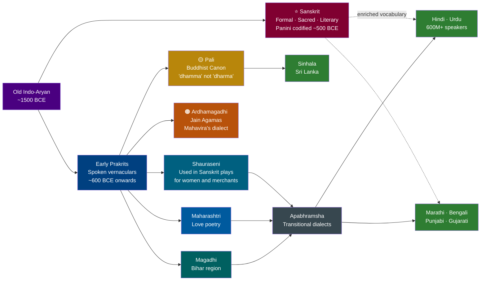
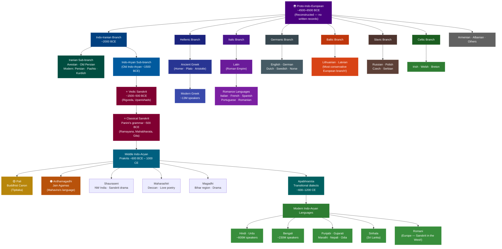

import Highlight from "@/react/Highlight/Highlight.jsx";

Have you ever noticed that **"Aham Gacchāmi"** means "I go" in Sanskrit — and almost the same phrase appears in Pali? Or that the Sanskrit word **"pitṛ"** (father) sounds strikingly like the Latin **"pater"** and the English **"father"**? These are not coincidences. They are fingerprints of one of humanity's greatest linguistic discoveries: that hundreds of languages across Asia and Europe all descend from a single ancient ancestor called **Proto-Indo-European (PIE)**.

This article takes you on a journey through Sanskrit's family tree — from its deepest roots in PIE, to its closest siblings Pali, Ardhamagadhi, and the Prakrits, all the way to its distant cousins Latin and Greek.

:::tip[Why Study Sanskrit's Linguistic Family?]
**For Language Learners:**
- Understanding shared roots makes learning Sanskrit, Hindi, Pali, or even Latin dramatically faster
- Recognizing cognates (related words) across languages builds vocabulary naturally

**For History Enthusiasts:**
- Language relationships reveal ancient human migrations and cultural exchange
- Shared grammar structures tell us how people thought thousands of years ago

**For Scholars:**
- Comparative linguistics is the foundation of modern historical language study
- Sanskrit is the best-preserved window into Proto-Indo-European

**Fun Fact**: The word **"Sanskrit"** itself (संस्कृत) means *"perfectly constructed"* or *"refined"* — and it truly is the most precisely documented ancient language in the world!
:::

## <Highlight color='#800031' highlight='fg' fontWeight='bold'> Part 1: The Ancient Root — Proto-Indo-European (PIE) </Highlight>

### <Highlight color='#004080' highlight='fg' fontWeight='bold'> What is Proto-Indo-European? </Highlight>

**Proto-Indo-European (PIE)** is the reconstructed common ancestor of a vast family of languages spoken from Ireland in the west to India and Sri Lanka in the east. No written records of PIE exist — it was spoken roughly **4,500 to 6,500 years ago**, long before writing. Linguists have *reconstructed* it by comparing hundreds of descendant languages and working backwards to find their shared patterns.

PIE is typically written with an asterisk (*) before words to show they are reconstructed, not directly attested. For example:

| PIE (Reconstructed) | Sanskrit | Latin | Greek | English | Meaning |
|---------------------|----------|-------|-------|---------|---------|
| *ph₂tḗr | पितृ (pitṛ) | pater | πατήρ (patēr) | father | father |
| *meh₂tēr | मातृ (mātṛ) | mater | μήτηρ (mētēr) | mother | mother |
| *bʰreh₂tēr | भ्रातृ (bhrātṛ) | frater | φράτηρ (phrātēr) | brother | brother |
| *néh₂us | नौ (nau) | navis | ναῦς (naus) | navigate | boat/ship |
| *ǵneh₃- | ज्ञा (jñā) | gnoscere | γιγνώσκω (gignōskō) | know | to know |
| *dʰéǵʰōm | भूमि (bhūmi) | humus | χθών (khthōn) | ground | earth |

### <Highlight color='#004080' highlight='fg' fontWeight='bold'> How Sanskrit Preserves PIE Most Faithfully </Highlight>

Among all surviving Indo-European languages, **Sanskrit is considered the most conservative** — meaning it changed the least from PIE. This is why Sanskrit has been invaluable to linguists for reconstructing PIE grammar. Here is why:

**1. Case System Preserved:** PIE had 8 grammatical cases. Sanskrit preserved all **8 cases (Vibhakti)** perfectly. Most modern languages lost most of them (English kept only 2-3 in pronouns).

**2. Three Numbers:** PIE had singular, dual, and plural. Sanskrit kept all three. Greek kept them. Latin partially kept dual. English lost dual entirely.

**3. Verb Richness:** Sanskrit's 10 tenses and moods closely mirror the PIE verbal system. Panini's grammar documented these with mathematical precision around 500 BCE.

**4. Sound System:** Sanskrit's phonetic system is extraordinarily close to PIE's reconstructed phonology — the vowels, consonants, and accent patterns all align.

:::note[The PIE Homeland - Where Did It All Begin?]
Scholars debate the original homeland of PIE speakers. The two leading theories are:

- **Steppe Hypothesis (Kurgan Theory):** PIE speakers originated in the Pontic-Caspian steppes (modern Ukraine/Russia) and spread outward around 3500-3000 BCE via horse-riding migrations
- **Anatolian Hypothesis:** PIE originated in ancient Anatolia (modern Turkey) and spread with the agricultural revolution around 7000-6000 BCE

Both theories agree that PIE speakers eventually reached the Indian subcontinent, where their language evolved into the **Vedic Sanskrit** we see in the Rigveda (c. 1500-1200 BCE).
:::

---

## <Highlight color='#800031' highlight='fg' fontWeight='bold'> Part 2: Closest Relatives — The Prakrits, Pali & Ardhamagadhi </Highlight>

### <Highlight color='#004080' highlight='fg' fontWeight='bold'> The Sanskrit–Prakrit Relationship </Highlight>

Before diving in, here is a quick visual of how Sanskrit, the Prakrits, and modern languages connect — and where Pali and Ardhamagadhi sit in that chain:

The word **Prakrit (प्राकृत)** literally means *"natural"* or *"derived from nature"* — in contrast to Sanskrit, which means *"refined/perfected."* The Prakrits were the **spoken vernacular languages** of ancient India that evolved naturally from the same Old Indo-Aryan roots as Sanskrit. They were the languages ordinary people actually spoke, while Sanskrit was the formal literary and ritual language used by scholars and priests.

Think of it this way: **Sanskrit was to Prakrits** roughly as **Classical Latin was to spoken Vulgar Latin** — one was the prestige written form, the others were the living, breathing everyday tongues that would eventually evolve into modern languages.

| Feature | Sanskrit | Prakrits | Analogy |
|---------|----------|----------|---------|
| Register | Formal, literary, sacred | Colloquial, everyday | Latin vs. Vulgar Latin |
| Grammar | Highly complex, 8 cases | Simplified, fewer cases | — |
| Consonant clusters | Preserved (e.g., *karma*) | Simplified (e.g., *kamma*) | — |
| Retroflex sounds | Prominent | Prominent | — |
| Modern descendants | Hindi, Bengali, Marathi... | Sinhala, Romani... | — |

### <Highlight color='#004080' highlight='fg' fontWeight='bold'> Pali — The Language of the Buddha </Highlight>

**Pali (पालि)** is the sacred language of **Theravāda Buddhism**, used to record the earliest Buddhist scriptures (the *Tipiṭaka* / *Pali Canon*). It is the closest Prakrit relative to Sanskrit and the one most studied alongside it.

**"Aham Gacchāmi" — Sanskrit vs. Pali:**

This is one of the most striking examples of how close these languages are:

| Element | Sanskrit | Pali | Meaning |
|---------|----------|------|---------|
| "I" | अहम् (aham) | अहं (ahaṃ) | I |
| "go" (1st person singular present) | गच्छामि (gacchāmi) | गच्छामि (gacchāmi) | I go |
| Full sentence | **अहं गच्छामि** | **अहं गच्छामि** | **I go** |

As you can see, the sentence is **virtually identical**! The verb root *gam-* (to go) and the first-person singular ending *-āmi* are shared directly from their Proto-Indo-Aryan ancestor. The difference is mostly in the final nasal sound: Sanskrit uses *aham* (with a clear *m*), while Pali uses *ahaṃ* (with an anusvāra, a nasalized vowel written as ṃ).

**How Pali Differs from Sanskrit — Key Simplifications:**

| Feature | Sanskrit Example | Pali Equivalent | Change |
|---------|-----------------|-----------------|--------|
| Consonant clusters | karma (कर्म) | kamma (कम्म) | Gemination (doubling) instead of cluster |
| Consonant clusters | dharma (धर्म) | dhamma (धम्म) | Same pattern |
| Intervocalic consonants | pāda (पाद - foot) | pāda (same) | Often preserved |
| Dual number | devaú (two gods) | Lost in Pali | Pali dropped the dual |
| Cases | 8 cases | 7 cases (ablative merged into genitive) | Simplified |
| Verb classes | 10 classes (gaṇas) | Simplified | Fewer distinctions |
| Sandhi rules | Elaborate mandatory rules | More flexible, optional | Relaxed |

:::caution[The Gemination Rule in Pali]
One of Pali's most recognizable features is **consonant gemination** — when Sanskrit has a consonant cluster, Pali often doubles the second consonant instead:

- Sanskrit: **dharma** → Pali: **dhamma**
- Sanskrit: **karma** → Pali: **kamma**
- Sanskrit: **satya** (truth) → Pali: **sacca**
- Sanskrit: **mukta** (liberated) → Pali: **mutta**

This is why the Buddha's teachings are "Dhamma" in Pali, not "Dharma" as in Sanskrit!
:::

### <Highlight color='#004080' highlight='fg' fontWeight='bold'> Ardhamagadhi — The Language of Mahavira </Highlight>

**Ardhamagadhi (अर्धमागधी)** — literally "half-Magadhi" — is the sacred language of **Jain scriptures**, particularly the earliest Āgamas (canonical texts). It was associated with the dialect spoken in and around **Magadha** (modern-day Bihar), the region where both the Buddha and Mahavira (founder of Jainism) preached.

| Feature | Sanskrit | Pali | Ardhamagadhi |
|---------|----------|------|--------------|
| "I" | अहम् (aham) | अहं (ahaṃ) | अहम् / हं (aham / haṃ) |
| "dharma" | धर्म (dharma) | धम्म (dhamma) | धम्म / धर्म (dhamma / dharma) |
| "go" (1st sg.) | गच्छामि (gacchāmi) | गच्छामि (gacchāmi) | गच्छामि (gacchāmi) |
| Intervocalic -t- | — | Often retained | Often becomes -d- |
| Script | Devanagari | Various | Often written in Devanagari or Brahmi |

Ardhamagadhi occupies a fascinating middle ground — it preserves some Sanskrit features that Pali dropped, while also developing its own distinctive traits. Jain scholars meticulously preserved it as the language their tradition believed Mahavira himself used to teach.

### <Highlight color='#004080' highlight='fg' fontWeight='bold'> Other Major Prakrit Languages </Highlight>

Beyond Pali and Ardhamagadhi, several other Prakrits flourished in ancient India, each associated with different regions, literary traditions, or inscriptions:

| Prakrit Language | Region / Use | Notable Feature | Modern Descendant |
|-----------------|--------------|-----------------|-------------------|
| **Shauraseni** | Northwest India (Mathura region) | Used in Sanskrit drama for women and low-status characters | Hindi, Punjabi |
| **Maharashtri** | Deccan (Maharashtra) | Prestige literary Prakrit; used for love poetry (*śṛṅgāra*) | Marathi |
| **Magadhi** | Magadha (Bihar) | Used for even lower-status characters in dramas; replaced *r* with *l* | Maithili, Bhojpuri |
| **Apabhraṃśa** | Various (transitional) | Late Prakrits, bridge to modern Indo-Aryan languages | Hindi, Rajasthani, Gujarati |
| **Gandhari** | Northwest frontier (Gandhara) | Written in Kharosthi script; earliest Buddhist texts from the region | Some influence on Pashto region |

:::tip[A Living Example — Sanskrit Drama]
In classical Sanskrit plays (like those of Kālidāsa), **different characters speak different languages** based on their social status!

- **King and Brahmin scholars:** Speak Sanskrit
- **Women and merchants:** Speak Shauraseni Prakrit
- **Low-status characters:** Speak Magadhi Prakrit

This shows these languages coexisted for centuries, with Sanskrit as the prestige register and Prakrits as everyday speech — much like how formal English and local dialects coexist today!
:::

---

## <Highlight color='#800031' highlight='fg' fontWeight='bold'> Part 3: Modern Indo-Aryan Languages — Sanskrit's Living Grandchildren </Highlight>

### <Highlight color='#004080' highlight='fg' fontWeight='bold'> The Direct Descendants </Highlight>

The Prakrits and Apabhraṃśa dialects gradually evolved into what we now call the **Modern Indo-Aryan languages** — a family of over a billion speakers today. All of them carry Sanskrit's DNA.

| Modern Language | Speakers | Region | Sanskrit Connection Example |
|----------------|----------|--------|-----------------------------|
| **Hindi** | ~600 million | North India | *jal* (water) ← Sanskrit *jala* |
| **Bengali** | ~230 million | Bengal, Bangladesh | *mātṛ* (mother) ← Sanskrit *mātṛ* |
| **Punjabi** | ~130 million | Punjab | *pañj* (five) ← Sanskrit *pañca* |
| **Marathi** | ~90 million | Maharashtra | *āhe* (is/am) ← Sanskrit *asti* |
| **Gujarati** | ~60 million | Gujarat | *nām* (name) ← Sanskrit *nāma* |
| **Nepali** | ~17 million | Nepal | *mānsā* (meat) ← Sanskrit *māṃsa* |
| **Sinhala** | ~16 million | Sri Lanka | *dasa* (ten) ← Pali/Sanskrit *daśa* |
| **Odia** | ~35 million | Odisha | *dharma* ← Sanskrit *dharma* |
| **Assamese** | ~15 million | Assam | *āku* (I) ← Sanskrit *aham* |
| **Romani** | ~3.5 million | Europe (diaspora) | *pani* (water) ← Sanskrit *pāṇī* |

:::note[Romani — Sanskrit Spoken in Europe!]
**Romani**, the language of the Roma people (historically called "Gypsies") in Europe, is a **direct descendant of Sanskrit** via the Prakrits. Linguistic analysis shows the Roma migrated from Northwest India (around Punjab/Rajasthan) roughly 1,000-1,500 years ago.

Romani vocabulary is strikingly Sanskrit-derived:
- Romani *pani* = water (Sanskrit *pāṇī*)
- Romani *drom* = road (Sanskrit *druma* → path)
- Romani *dui* = two (Sanskrit *dvi*)
- Romani *trin* = three (Sanskrit *tri*)

This makes Romani the westernmost living Indo-Aryan language — Sanskrit spoken in the heart of Europe!
:::

---

## <Highlight color='#800031' highlight='fg' fontWeight='bold'> Part 4: Distant Relatives — Latin & Greek </Highlight>

### <Highlight color='#004080' highlight='fg' fontWeight='bold'> The Indo-European Connection </Highlight>

Latin and Greek are not descended from Sanskrit — they are **cousins**, sharing a common PIE ancestor. The family relationship was formally recognized in 1786 when Sir William Jones, a British judge in Calcutta, famously observed that Sanskrit bore a striking resemblance to Greek and Latin that "could not possibly have been produced by accident."

That observation launched the entire field of **comparative linguistics**.

| Word | PIE Root | Sanskrit | Greek | Latin | English |
|------|----------|----------|-------|-------|---------|
| father | *ph₂tḗr | पितृ *pitṛ* | πατήρ *patēr* | pater | father |
| mother | *meh₂tēr | मातृ *mātṛ* | μήτηρ *mētēr* | mater | mother |
| brother | *bʰreh₂tēr | भ्रातृ *bhrātṛ* | φράτηρ *phrātēr* | frater | brother |
| three | *tréyes | त्रि *tri* | τρεῖς *treis* | tres | three |
| eight | *oḱtṓ | अष्ट *aṣṭa* | ὀκτώ *oktō* | octo | eight |
| new | *néwos | नव *nava* | νέος *neos* | novus | new |
| night | *nókʷts | नक्त *nakta* | νύξ *nyx* | nox | night |
| heart | *ḱḗr | हृद् *hṛd* | καρδία *kardia* | cor/cordis | heart |
| to be | *h₁es- | अस्ति *asti* | ἐστί *esti* | est | is |
| to carry | *bʰer- | भरति *bharati* | φέρω *pherō* | ferre | bear/ferry |

### <Highlight color='#004080' highlight='fg' fontWeight='bold'> Greek — The Mediterranean Twin </Highlight>

**Ancient Greek** and Sanskrit share remarkable grammatical parallels, suggesting they diverged from PIE more recently than other branches — or that they both preserved PIE features with unusual fidelity.

**Shared Grammatical Features:**

**1. The Augment:** Both Sanskrit and Ancient Greek mark past tenses by adding a vowel prefix (*a-* in Sanskrit, *e-* in Greek) called an **augment** — a feature unique to these two branches among IE languages!

- Sanskrit: *gacchati* (he goes) → *agacchat* (he went) — augment *a-* added
- Greek: *pherō* (I carry) → *epheron* (I was carrying) — augment *e-* added

**2. Dual Number:** Both preserved the PIE dual number for exactly two things (which Latin, for example, already lost).

**3. Verb Accent:** Both Sanskrit and Greek preserved the original PIE pitch accent system (where different syllables could have different tones/pitches), unlike Latin which shifted to a fixed stress accent.

| Grammar Feature | Sanskrit | Greek | Latin |
|----------------|----------|-------|-------|
| Dual number | ✅ Preserved | ✅ Preserved | ❌ Lost |
| Augment in past tense | ✅ Present | ✅ Present | ❌ Absent |
| Pitch accent | ✅ Preserved | ✅ Preserved | ❌ Shifted to stress |
| 8 noun cases | ✅ All 8 | 5 cases (merged some) | 6 cases |
| Optative mood | ✅ Full system | ✅ Full system | Partially merged |

### <Highlight color='#004080' highlight='fg' fontWeight='bold'> Latin — The Imperial Cousin </Highlight>

**Latin** is slightly more distantly related to Sanskrit than Greek is, showing more significant changes from PIE. However, the family resemblance is unmistakable — especially in vocabulary and core grammatical structure.

**Striking Latin–Sanskrit Pairs:**

| Latin | Sanskrit | Meaning | Shared PIE Root |
|-------|----------|---------|-----------------|
| *agere* (to drive/do) | *aj-* (to drive) | to act/drive | *h₂eǵ-* |
| *stella* (star) | *tārā* (star) | star | *h₂stḗr* |
| *navis* (ship) | *nau* (boat) | ship/boat | *néh₂us* |
| *serpere* (to crawl) | *sarpati* (he creeps) | to creep/serpent | *serp-* |
| *videre* (to see) | *vid-* (to know/see) | to see/know | *weyd-* |
| *rēx* (king) | *rājan* (king) | king/ruler | *h₃rḗǵs* |
| *genus* (race/kind) | *janas* (people/kind) | kind/race/genus | *ǵénh₁os* |
| *canis* (dog) | *śvan* (dog) | dog | *ḱwṓ* |

:::note[Why "Raja" and "Rex" Are the Same Word]
The Sanskrit word **rājan** (राजन्) meaning *king* and the Latin word **rēx** meaning *king* both descend from the PIE root ***h₃rḗǵs* — meaning "to stretch out, to direct."

This same root gave us:
- Sanskrit: *rājan* → Pali: *rājā* → Hindi: *rāj* (rule/reign)
- Latin: *rēx* → French: *roi* → Spanish: *rey*
- Old Irish: *rí* (king)
- Old English: *rīce* (kingdom) → *rich* (originally meaning "powerful")

One PIE root. One concept of *leadership*. Across thousands of years and thousands of miles.
:::

---

## <Highlight color='#800031' highlight='fg' fontWeight='bold'> Part 5: The Full Family Tree at a Glance </Highlight>

### <Highlight color='#004080' highlight='fg' fontWeight='bold'> The Indo-European Family Tree — Visual Overview </Highlight>

The diagram below maps Sanskrit's exact position in the full Indo-European family — from the ancient PIE root all the way down to modern living languages:

> **How to read this tree:** The further down two languages branch from the same node, the more closely related they are. Sanskrit and Pali share a node just two steps from the top — they are extremely close. Sanskrit and Latin share a node only at the very root (PIE) — they are distant cousins.

### <Highlight color='#004080' highlight='fg' fontWeight='bold'> Indo-European Language Family — Sanskrit's Position </Highlight>

| Branch | Languages | Relationship to Sanskrit |
|--------|-----------|--------------------------|
| **Indo-Iranian → Indo-Aryan** | Sanskrit, Hindi, Bengali, Punjabi, Marathi, Gujarati, Nepali, Sinhala, Romani | **Direct family** — descended from the same Old Indo-Aryan ancestor |
| **Indo-Iranian → Iranian** | Avestan, Persian, Pashto, Kurdish | **Very close cousins** — Sanskrit and Avestan are mutually intelligible in some hymns! |
| **Hellenic** | Ancient Greek, Modern Greek | **Close cousins** — share augment, dual, pitch accent |
| **Italic** | Latin, Italian, French, Spanish, Portuguese, Romanian | **Cousins** — extensive vocabulary overlap |
| **Germanic** | English, German, Dutch, Swedish, Norse | **Distant cousins** — foundational vocabulary shared |
| **Slavic** | Russian, Polish, Czech, Serbian | **Distant cousins** — case system somewhat preserved |
| **Baltic** | Lithuanian, Latvian | **Surprisingly close cousins** — Lithuanian is considered the most conservative living IE language after Sanskrit! |
| **Celtic** | Irish, Welsh, Breton | **Distant cousins** — heavily transformed but related |
| **Armenian** | Armenian | **Moderately close cousin** |
| **Albanian** | Albanian | **Distant cousin** |

:::tip[Lithuanian — The "Sanskrit of Europe"]
Among all modern European languages, **Lithuanian** is considered the closest living cousin to Sanskrit in terms of conservatism. Lithuanian preserved:

- A **case system** of 7 cases (Sanskrit has 8)
- A **pitch accent** system (rare in European languages)
- Ancient root vocabulary matching Sanskrit closely

Compare:
- Lithuanian *sūnus* (son) — Sanskrit *sūnu* (सूनु)
- Lithuanian *dūmas* (smoke) — Sanskrit *dhūma* (धूम)
- Lithuanian *ratas* (wheel) — Sanskrit *ratha* (रथ - chariot)

This is why 19th-century German linguist August Schleicher reportedly said: *"If you want to hear how Indo-Europeans sounded, listen to a Lithuanian farmer."*
:::

---

## <Highlight color='#800031' highlight='fg' fontWeight='bold'> Summary — Sanskrit's Linguistic Family </Highlight>

### <Highlight color='#004080' highlight='fg' fontWeight='bold'> Quick Reference Chart </Highlight>

| Language / Group | Distance from Sanskrit | Key Link | Still Spoken? |
|-----------------|----------------------|----------|---------------|
| **Vedic Sanskrit** | Same language (earlier form) | Rigveda hymns | No (as spoken language) |
| **Pali** | Closest Prakrit sibling | "Ahaṃ gacchāmi" = identical | No (as spoken; used in Buddhism) |
| **Ardhamagadhi** | Very close Prakrit sibling | Jain Āgamas | No (as spoken; used in Jainism) |
| **Shauraseni, Maharashtri, Magadhi** | Close Prakrit siblings | Sanskrit drama, inscriptions | No |
| **Hindi, Bengali, Marathi, Gujarati** | Grandchildren via Prakrits | Core vocabulary, grammar | ✅ Yes |
| **Sinhala, Romani, Nepali** | Grandchildren via Prakrits | Shared roots | ✅ Yes |
| **Avestan (Old Iranian)** | Cousin (Indo-Iranian branch) | Near-identical hymn structures | No |
| **Ancient Greek** | Cousin (Hellenic branch) | Augment, dual, pitch accent | No (Modern Greek is descendant) |
| **Latin** | Cousin (Italic branch) | Vocabulary, noun cases | No (Lives through Romance languages) |
| **Lithuanian** | Distant cousin (Baltic branch) | Most conservative European cousin | ✅ Yes |
| **English** | Distant cousin (Germanic branch) | father/mother/brother cognates | ✅ Yes |

### <Highlight color='#004080' highlight='fg' fontWeight='bold'> The "Aham Gacchāmi" Family Across Languages </Highlight>

Let's close with the beautiful example you noticed — "I go" — traced across the whole Indo-European family:

| Language | "I go" | Branch |
|----------|--------|--------|
| Sanskrit | अहं गच्छामि (*Ahaṃ Gacchāmi*) | Indo-Aryan |
| Pali | अहं गच्छामि (*Ahaṃ Gacchāmi*) | Indo-Aryan (Prakrit) |
| Ardhamagadhi | अहं गच्छामि (*Ahaṃ Gacchāmi*) | Indo-Aryan (Prakrit) |
| Avestan | azəm (I) + *jasaiti* (goes) | Indo-Iranian |
| Ancient Greek | ἐγώ εἶμι (*Egō eimi*) | Hellenic |
| Latin | *ego eo* | Italic |
| Old English | *ic gā* | Germanic |
| Modern English | I go | Germanic |
| Lithuanian | *aš einu* | Baltic |

Notice: **aham / azəm / ego** — the word for "I" across all these languages traces back to the same PIE root ***eǵ(oH)*. Across 6,000 years and thousands of miles, human beings have been saying "I" with roughly the same sound.

That is the miracle of the Indo-European family — and Sanskrit sits at its most beautifully preserved heart.

---

:::tip[Next Steps in Your Sanskrit Journey]
Now that you understand where Sanskrit sits in the global language family, you are ready to:

1. **Study Sanskrit grammar** — knowing its PIE background makes the case system and verb system feel logical, not arbitrary
2. **Explore Pali** — if you are interested in Buddhist philosophy, Pali is remarkably easy for Sanskrit students
3. **Read Sanskrit inscriptions** — Ashokan edicts appear in both Sanskrit and Prakrits side by side
4. **Compare cognates** — look for Sanskrit roots in English, Latin, and Greek as you study

**Recommended starting point:** [Master Sanskrit from Zero to Professional - Part 1](/learn-sanskrit-part1-guide)
:::
