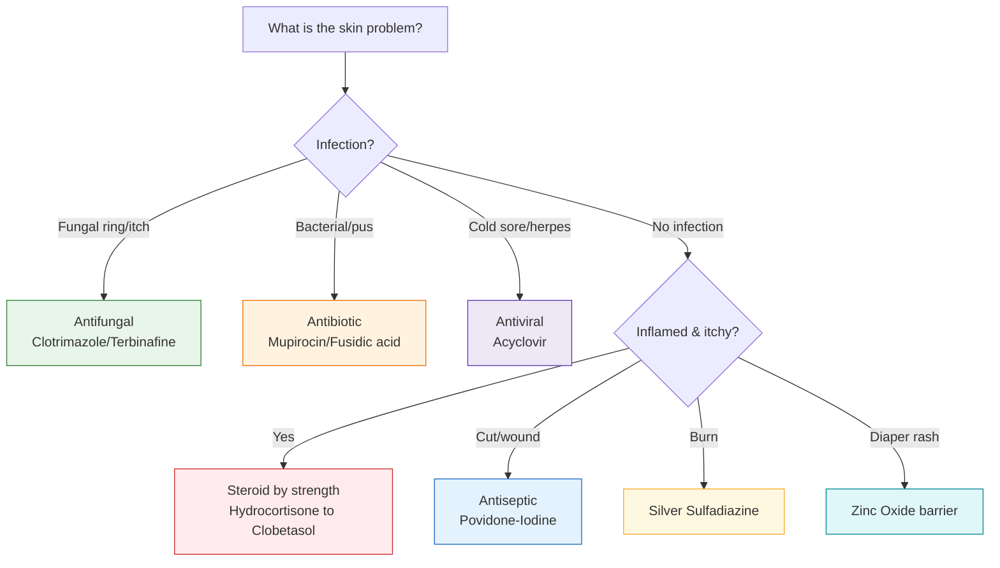

import Highlight from "@/react/Highlight/Highlight.jsx";

# Skin Creams & Ointments Decoded 🧴

The tube of cream in your drawer might be a **steroid**, an **antifungal**, an **antibiotic**, or a **numbing gel** — and using the wrong one can make your skin problem *worse*. This guide decodes the common skin creams sold in India, what each one actually treats, and which ones you should never use without a doctor.

:::note[📋 Important Medical Disclaimer]

This guide is for **educational purposes only**. It is NOT a substitute for professional medical advice.

- ✅ Many skin creams (steroids, antibiotics, antivirals) are **prescription-only**
- ✅ Always match the cream to the **correct diagnosis** — see a doctor if unsure
- ❌ Never use a **steroid cream** on an undiagnosed rash (it can worsen fungal infections)
- ❌ Never share creams or use expired tubes

**தமிழ் குறிப்பு:** இந்த தகவல் கல்வி நோக்கத்திற்காக மட்டுமே. ஸ்டீராய்டு கிரீம்களை மருத்துவர் ஆலோசனை இன்றி பயன்படுத்த வேண்டாம்.

:::

---

:::warning[The Golden Rule of Skin Creams]
**Never put a steroid cream on a rash you haven't identified.** Steroids (Clobetasol, Betamethasone, even Hydrocortisone) calm inflammation but **feed fungal and infected rashes**, making ringworm and infections spread. When in doubt, see a doctor.
:::

---

## <Highlight color='#9370DB' highlight='fg' fontWeight='bold'> 🟣 PAIN & ANTI-INFLAMMATORY GELS </Highlight>

**Diclofenac Gel**
- **Salt/Composition:** Diclofenac Diethylamine 1% / 1.16% gel
- **Used For:** Muscle pain, joint pain, arthritis, sprains, back pain
- **How It Works:** NSAID — reduces local pain and inflammation
- **Note:** Apply 3-4 times daily; wash hands after; avoid broken skin

---

**Capsaicin Cream**
- **Salt/Composition:** Capsaicin 0.025% / 0.075%
- **Used For:** Nerve pain, arthritis, muscle aches
- **How It Works:** Depletes pain-signal chemical (substance P)
- **Note:** Causes a warm/burning feel; wash hands well, avoid eyes

---

## <Highlight color='#E74C3C' highlight='fg' fontWeight='bold'> 🔴 STEROID CREAMS (Corticosteroids) — By Potency </Highlight>

Steroid creams reduce inflammation, redness and itching. They come in a **potency ladder** — the stronger they are, the more careful you must be.

| Potency | Cream | Used For |
|---------|-------|----------|
| **Mild** | **Hydrocortisone 1% / 2.5%** | Itching, insect bites, mild eczema, minor irritation |
| **Moderate-Potent** | **Betamethasone / Mometasone** | Dermatitis, eczema, skin allergies, psoriasis |
| **Super-Potent** | **Clobetasol Propionate 0.05%** | Severe dermatitis, thick psoriasis, intense inflammation |

**Hydrocortisone Cream (Mild)**
- **Salt/Composition:** Hydrocortisone 1% / 2.5%
- **Used For:** Itching, insect bites, minor irritation, mild eczema
- **Note:** Safest steroid; okay short-term; the only steroid sometimes OK on the face (briefly)

---

**Betamethasone Cream (Potent)**
- **Salt/Composition:** Betamethasone Valerate 0.1% / Dipropionate 0.05%
- **Used For:** Dermatitis, eczema, skin allergies, psoriasis
- **Note:** Potent — short-term, prescribed use; not for the face or long-term

---

**Mometasone Cream (Potent)**
- **Salt/Composition:** Mometasone Furoate 0.1%
- **Used For:** Eczema, psoriasis, allergic skin conditions
- **Note:** Once-daily potent steroid; use as prescribed

---

**Clobetasol Cream (Super-Potent)**
- **Salt/Composition:** Clobetasol Propionate 0.05%
- **Used For:** Severe dermatitis, thick psoriasis, intense inflammation
- **Note:** Strongest common steroid — short-term only; **never on the face/groin**; not without a doctor

:::danger[⚠️ Steroid Cream Misuse — A Major Problem in India]
**Do NOT use steroid creams (or steroid combination creams like triple-action "skin creams") for:**
- Ringworm/fungal rashes (they spread it — "steroid-modified tinea")
- Fairness/"glow" (causes thin skin, acne, permanent damage)
- Undiagnosed rashes on the face

Popular OTC **combination creams** (steroid + antibiotic + antifungal) are widely misused and banned/restricted for good reason. **Use steroids only for a doctor-confirmed condition.**
:::

---

## <Highlight color='#00A896' highlight='fg' fontWeight='bold'> 🟢 NON-STEROID ECZEMA CREAM </Highlight>

**Tacrolimus Ointment**
- **Salt/Composition:** Tacrolimus 0.03% / 0.1%
- **Used For:** Eczema (atopic dermatitis), especially on the **face** and folds
- **How It Works:** Calcineurin inhibitor — calms immune-driven inflammation **without** steroid side effects
- **Note:** Steroid-free; good for long-term/facial eczema; mild stinging at first

---

## <Highlight color='#16A085' highlight='fg' fontWeight='bold'> 🍄 ANTIFUNGAL CREAMS </Highlight>

**Clotrimazole Ointment**
- **Salt/Composition:** Clotrimazole 1%
- **Used For:** Athlete's foot, ringworm (tinea), candidiasis, itching from fungus
- **Note:** Apply 2-3 times daily for 2-4 weeks; continue after it clears to prevent relapse

---

**Ketoconazole Ointment / Shampoo**
- **Salt/Composition:** Ketoconazole 2%
- **Used For:** Seborrheic dermatitis, dandruff, fungal skin infections
- **Note:** Also as a shampoo for dandruff

---

**Terbinafine Cream**
- **Salt/Composition:** Terbinafine 1%
- **Used For:** Ringworm, athlete's foot, jock itch
- **How It Works:** Fungicidal (kills fungus) — often faster than older antifungals
- **Note:** Usually 1-2 weeks; effective for stubborn tinea

---

**Miconazole Cream**
- **Salt/Composition:** Miconazole 2%
- **Used For:** Fungal skin and nappy-area infections
- **Note:** Also used in combination diaper-rash creams

---

## <Highlight color='#F39C12' highlight='fg' fontWeight='bold'> 🟠 ANTIBACTERIAL CREAMS </Highlight>

**Mupirocin Ointment**
- **Salt/Composition:** Mupirocin 2%
- **Used For:** Bacterial skin infections — **impetigo**, infected cuts, folliculitis
- **Note:** Very effective; apply 2-3 times daily for up to 10 days

---

**Bacitracin + Neomycin Ointment**
- **Salt/Composition:** Bacitracin + Neomycin (± Polymyxin B)
- **Used For:** Wounds, cuts, and minor burns; preventing infection
- **Note:** Common first-aid antibiotic ointment; stop if irritation/allergy occurs

---

**Fusidic Acid Cream**
- **Salt/Composition:** Fusidic Acid 2%
- **Used For:** Impetigo, infected eczema, folliculitis, infected cuts
- **Note:** For external use; avoid eyes

---

**Framycetin Cream (Soframycin)**
- **Salt/Composition:** Framycetin Sulphate 1%
- **Used For:** Minor cuts, wounds, burns, infected skin
- **Note:** Popular Indian first-aid antibiotic cream

---

## <Highlight color='#8E44AD' highlight='fg' fontWeight='bold'> 🦠 ANTIVIRAL CREAM </Highlight>

**Acyclovir Ointment**
- **Salt/Composition:** Aciclovir 5%
- **Used For:** Cold sores (oral herpes), genital herpes
- **How It Works:** Antiviral — stops herpes virus from multiplying
- **Note:** Works best applied at the **first tingle**; apply 5 times daily

---

## <Highlight color='#2980B9' highlight='fg' fontWeight='bold'> 🩹 ANTISEPTICS FOR CUTS & WOUNDS </Highlight>

**Povidone-Iodine (Betadine) Ointment/Solution**
- **Salt/Composition:** Povidone-Iodine 5% / 10%
- **Used For:** Cleaning **cuts, wounds, grazes**, minor burns; preventing infection
- **How It Works:** Broad antiseptic — kills bacteria, fungi and viruses
- **Note:** The classic "iodine for a cut wound"; for external use; avoid large raw areas long-term

---

**Chlorhexidine Cream/Solution**
- **Salt/Composition:** Chlorhexidine Gluconate 0.5% / 1%
- **Used For:** Cleaning wounds, antiseptic skin prep
- **Note:** Gentle antiseptic; also in some wound powders

---

## <Highlight color='#E67E22' highlight='fg' fontWeight='bold'> 🔥 BURN CREAMS </Highlight>

**Silver Sulfadiazine Cream**
- **Salt/Composition:** Silver Sulfadiazine 1%
- **Used For:** **Burns** (fire/scald/thermal) — prevents and treats burn-wound infection
- **How It Works:** Antimicrobial — protects burnt skin while it heals
- **Note:** The standard burn cream; apply under a dressing as advised

---

**Framycetin / "Burnol"-type Creams**
- **Salt/Composition:** Framycetin or antiseptic burn formulas
- **Used For:** Minor burns and scalds (first aid)
- **Note:** For **minor** burns only — cool the burn with running water first; big/deep burns need a hospital

---

**Silver Nitrate**
- **Salt/Composition:** Silver Nitrate (0.5% solution / caustic applicator sticks)
- **Used For:** Historically as an **antimicrobial soak/dressing for burns**; today mainly to **cauterize** over-granulating (proud-flesh) wounds, minor bleeding wounds and warts
- **How It Works:** Silver ions kill microbes; in stick form it chemically **burns off** excess tissue
- **Note:** **Not the same as silver sulfadiazine cream** — silver nitrate stains skin/fabric black and is a caustic agent used by clinicians, not a routine burn cream. **Silver sulfadiazine remains the standard burn cream.**

:::danger[Burn First Aid]
For any burn: **cool it under running tap water for 15-20 minutes first.** Do **not** apply toothpaste, oil, or ghee. Large, deep, or blistering burns (especially on face/hands/genitals) need **urgent medical care.**
:::

---

## <Highlight color='#1ABC9C' highlight='fg' fontWeight='bold'> 💉 NUMBING (LOCAL ANAESTHETIC) CREAMS </Highlight>

**Lidocaine + Prilocaine Gel (EMLA)**
- **Salt/Composition:** Lidocaine 2.5% + Prilocaine 2.5%
- **Used For:** **Numbing** the skin before injections, blood tests, minor procedures, tattoos; local pain/itch relief
- **How It Works:** Local anaesthetic — temporarily blocks skin sensation
- **Note:** Apply ~30-60 min before a procedure under a cover; mainly a numbing gel (not a daily itch cream)

---

**Lignocaine (Lidocaine) Gel**
- **Salt/Composition:** Lignocaine 2%
- **Used For:** Painful mouth ulcers, minor procedures, catheter insertion
- **Note:** Fast, short-lasting numbing

---

## <Highlight color='#9B59B6' highlight='fg' fontWeight='bold'> 🪑 PILES (HAEMORRHOID) CREAMS </Highlight>

**Lignocaine-based Pile Creams (e.g., Anovate / Faktu-type)**
- **Salt/Composition:** Typically **Lignocaine** + a **mild steroid (Beclomethasone/Hydrocortisone)** ± **Phenylephrine** (shrinks vessels) ± soothing agents
- **Used For:** **Piles (haemorrhoids)** — pain, itching, swelling, bleeding; anal fissures
- **How It Works:** Numbs pain, reduces swelling and inflammation around the anus
- **Note:** Short-term use; apply after passing stool and at bedtime; see a doctor for persistent bleeding

---

## <Highlight color='#795548' highlight='fg' fontWeight='bold'> 🐛 SCABIES & LICE CREAMS </Highlight>

**Permethrin Cream**
- **Salt/Composition:** Permethrin 5% (cream) / 1% (lotion for lice)
- **Used For:** **Scabies** (mite infestation) and **head lice**
- **How It Works:** Kills mites and lice
- **Note:** For scabies, apply neck-down, leave overnight (8-12 hrs), wash off; **treat the whole family** and wash all bedding/clothes in hot water

---

**Permethrin/Benzyl Benzoate (alternative)**
- **Salt/Composition:** Benzyl Benzoate 25%
- **Used For:** Scabies (alternative when permethrin unsuitable)
- **Note:** Can sting on broken skin; follow doctor's instructions

---

## <Highlight color='#3498DB' highlight='fg' fontWeight='bold'> 👶 DIAPER RASH & ITCH-SOOTHING CREAMS </Highlight>

**Zinc Oxide + Vitamins Ointment**
- **Salt/Composition:** Zinc Oxide (± Vitamins A & D, light liquid paraffin)
- **Used For:** **Prevention and treatment of diaper (nappy) rash** in babies and adults
- **How It Works:** Forms a **protective barrier** against moisture; soothes and heals
- **Note:** Apply a thick layer at each nappy change; keep the area dry and airy

---

**Calamine Lotion**
- **Salt/Composition:** Calamine + Zinc Oxide
- **Used For:** Itching, prickly heat, sunburn, chickenpox, insect bites
- **How It Works:** Cooling, soothing, anti-itch barrier
- **Note:** Shake well; safe for most ages

---

:::tip[Diaper Rash Tips]
- Change nappies **frequently** and clean gently.
- Apply a **thick barrier** of zinc oxide cream at each change.
- Give **nappy-free air time** daily.
- If the rash is **bright red with spots/satellite lesions**, it may be a **fungal (candida) rash** needing an antifungal like clotrimazole/miconazole — see a doctor.
:::

---

## <Highlight color='#E84393' highlight='fg' fontWeight='bold'> 💥 ACNE CREAMS </Highlight>

**Benzoyl Peroxide Gel**
- **Salt/Composition:** Benzoyl Peroxide 2.5% / 5%
- **Used For:** Acne (pimples) — kills acne bacteria, unclogs pores
- **Note:** Can dry/bleach skin and fabric; start low

---

**Adapalene Gel**
- **Salt/Composition:** Adapalene 0.1%
- **Used For:** Acne, blackheads, whiteheads
- **How It Works:** Retinoid — normalises skin cell turnover
- **Note:** Apply at night; use sunscreen by day; avoid in pregnancy

---

**Clindamycin Gel**
- **Salt/Composition:** Clindamycin 1% (often with adapalene/BP or nicotinamide)
- **Used For:** Inflammatory acne
- **Note:** Topical antibiotic; usually combined to prevent resistance

---

## <Highlight color='#000080' highlight='fg' fontWeight='bold'> Quick Reference — Which Cream for What? </Highlight>

| Problem | Cream to Look For | Type |
|---------|-------------------|------|
| Muscle / joint pain | Diclofenac gel | NSAID |
| Itching / insect bite | Hydrocortisone, Calamine | Mild steroid / soothing |
| Eczema, dermatitis | Betamethasone / Mometasone; Tacrolimus (face) | Steroid / non-steroid |
| Severe psoriasis | Clobetasol | Super-potent steroid |
| Ringworm / athlete's foot | Clotrimazole, Terbinafine | Antifungal |
| Dandruff / seborrhea | Ketoconazole | Antifungal |
| Impetigo / infected cut | Mupirocin, Fusidic acid, Framycetin | Antibiotic |
| Cold sore / herpes | Acyclovir | Antiviral |
| Cleaning a cut/wound | Povidone-Iodine (Betadine) | Antiseptic |
| Burn (minor) | Silver Sulfadiazine | Burn antimicrobial |
| Numbing before a needle | Lidocaine + Prilocaine (EMLA) | Local anaesthetic |
| Piles (haemorrhoids) | Lignocaine + steroid pile cream | Anaesthetic + steroid |
| Scabies / lice | Permethrin | Anti-parasitic |
| Diaper rash | Zinc Oxide | Barrier cream |
| Acne | Benzoyl Peroxide, Adapalene, Clindamycin | Anti-acne |

---

## <Highlight color='#8B0000' highlight='fg' fontWeight='bold'> ⚠️ How to Use Skin Creams Safely </Highlight>

**Golden Rules:**
- 🎯 **Right cream, right diagnosis** — steroids on fungus make it worse
- 🧼 **Clean and dry** the skin before applying
- ☝️ **Use a thin layer** — more is not better (learn the "fingertip unit")
- ⏱️ **Follow the duration** — stop potent steroids on time
- 🚫 **Avoid the face/groin** with strong steroids unless told
- 👶 **Extra care for babies** — thin skin absorbs more
- 🩺 **See a doctor** if it spreads, weeps, or doesn't improve in a week

:::note[The Fingertip Unit (FTU)]
One **FTU** = the amount of cream squeezed from the fingertip to the first crease of an adult finger. **1 FTU covers an area about the size of two adult palms** — a simple way to avoid over-applying steroids.
:::

---

## <Highlight color='#006400' highlight='fg' fontWeight='bold'> தமிழில் முக்கிய குறிப்புகள் (Tamil Notes) </Highlight>

- ✅ **ஸ்டீராய்டு கிரீம்** (Clobetasol, Betamethasone) — படம்பூச்சி (ringworm) அல்லது கண்டறியப்படாத தடிப்புகளுக்கு பயன்படுத்த வேண்டாம்; அது மோசமாகும்.
- ✅ **படம்பூச்சி/பூஞ்சை** தொற்றுக்கு — Clotrimazole, Terbinafine (antifungal).
- ✅ **காயம்/வெட்டு** சுத்தம் செய்ய — Betadine (Povidone-Iodine).
- ✅ **தீக்காயம்** — Silver Sulfadiazine; முதலில் குளிர்ந்த நீரில் 15-20 நிமிடம் வையுங்கள்.
- ✅ **சிரங்கு (scabies)** — Permethrin; குடும்பம் முழுவதும் சிகிச்சை + துணிகளை சூடான நீரில் துவைக்கவும்.
- ✅ **டயப்பர் ராஷ்** — Zinc Oxide barrier cream.

---

## <Highlight color='#4169E1' highlight='fg' fontWeight='bold'> Conclusion </Highlight>

Skin creams are **not one-size-fits-all**. The same red, itchy patch could need a steroid, an antifungal, or an antibiotic — and the wrong choice can make it worse. Read the **salt name**, match it to the **right problem**, respect **prescription-only** creams, and never use strong steroids on an undiagnosed rash.

:::note[🎥 Source Note]
This article was inspired by a viral **"Skin Creams & Their Uses"** Instagram chart. We expanded it into a full, organised guide and **added the essentials it missed** — burn, antiseptic, piles, scabies, and acne creams. Always confirm with a qualified doctor.
:::

:::tip[📚 Related Reading]
For tablets and injections, see the **Common Medicines Cheat Sheet — Part 1, Part 2 and Part 3**.
:::
