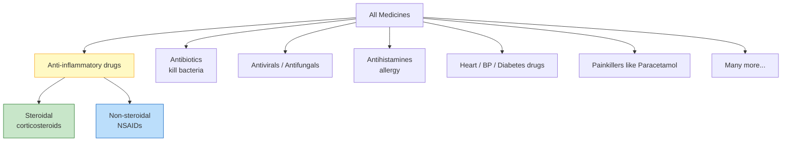
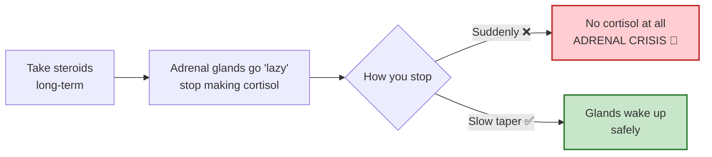
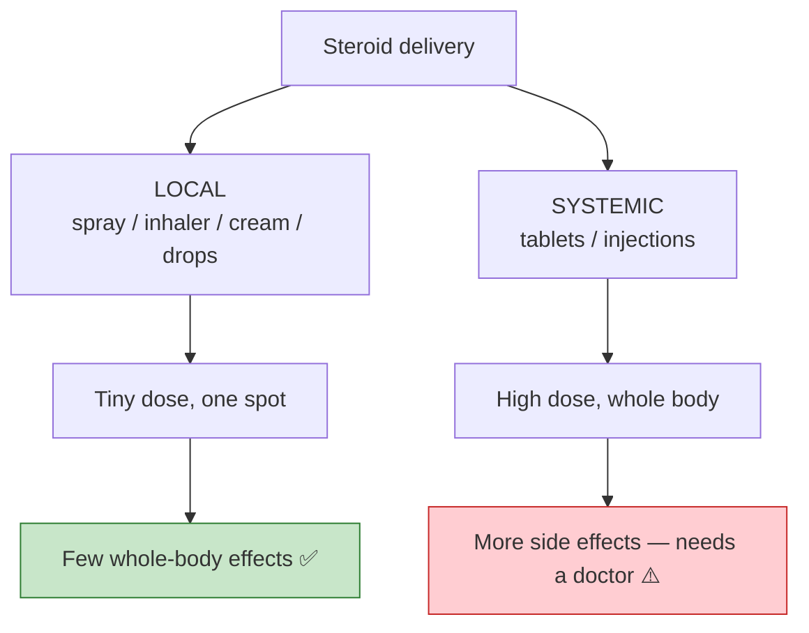

import Highlight from "@/react/Highlight/Highlight.jsx";
import { SvgWrapper } from "@/react/Svg/SvgWrapper.jsx";
import { STEROID_FIREFIGHTER } from "@/data/svg/steroid-firefighter.ts";
import { STEROID_VS_NSAID } from "@/data/svg/steroid-vs-nsaid.ts";
import { STEROID_LOCAL_SYSTEMIC } from "@/data/svg/steroid-local-systemic.ts";
import { STEROID_CUSHINGOID } from "@/data/svg/steroid-cushingoid.ts";

# Steroids vs Non-Steroidal Medicines 💊

"Steroid" is one of the most **misunderstood** words in medicine. Is it the muscle-building thing bodybuilders use? Is it dangerous? Why is it in your nasal spray *and* your skin cream *and* your asthma inhaler? And why do some people get puffy, round faces on it?

This guide answers all of that — starting with a **kid-simple** picture, then building up to the real science.

:::note[📋 Important Medical Disclaimer]
This is for **education only**, not medical advice. Steroids are powerful — **never start, stop, or change a steroid dose without a doctor.** Stopping some steroids suddenly can be dangerous.
:::

---

## <Highlight color='#b34700' highlight='fg' fontWeight='bold'> 🧒 First, Explained Like You're 5 </Highlight>

Imagine your body is a **house**. Sometimes a corner catches a small **fire** — that fire is called **inflammation** (the redness, swelling, pain, and itching you feel).

Your body already has its **own tiny firefighter**: a hormone called **cortisol**, made by two little glands (the **adrenal glands**) that sit on top of your kidneys.

<SvgWrapper svg={STEROID_FIREFIGHTER} width="100%" caption="A steroid medicine is basically an extra copy of your body's own firefighter hormone, cortisol." />

- **Steroid medicine** = a **big firefighter** brought in from outside. It's a copy of your own cortisol, and it puts out the inflammation fire **fast and powerfully**.
- **Non-steroidal medicine (NSAID)** = a **small water spray**. It cools pain and a little swelling, but it isn't the big firefighter — and it works a completely different way.

That's the whole idea. Now let's make it real.

---

## <Highlight color='#2e7d32' highlight='fg' fontWeight='bold'> 🟢 What Is a "Steroid Medicine" Really? </Highlight>

When doctors say "steroid," they almost always mean a **corticosteroid** — a lab-made copy of **cortisol**, the natural hormone from your adrenal glands.

**Common steroid medicines:** Prednisolone, Dexamethasone, Hydrocortisone, Betamethasone, Budesonide, Fluticasone, Mometasone, Clobetasol.

They do **two big jobs**:
1. **Crush inflammation** (swelling, redness, itching)
2. **Calm down an over-active immune system**

:::danger[Two Very Different "Steroids" — Don't Confuse Them!]
- **Corticosteroids** = the *medical* steroids in this article (anti-inflammatory). Copies of cortisol.
- **Anabolic steroids** = testosterone-like drugs some people misuse to build muscle. **Different drug, different purpose.**

Same word "steroid," but they are **not** the same thing.
:::

---

## <Highlight color='#1565c0' highlight='fg' fontWeight='bold'> 🔵 What Does "Non-Steroidal" Mean? </Highlight>

The word **"non-steroidal"** literally means **"not a steroid."** The famous group **NSAIDs** — **N**on-**S**teroidal **A**nti-**I**nflammatory **D**rugs — got that name to say: *"We also fight inflammation, but we are NOT steroids."*

**Common NSAIDs:** Ibuprofen, Diclofenac, Aspirin, Naproxen, Aceclofenac, Mefenamic acid.

They mainly relieve **pain, fever, and mild inflammation**.

<SvgWrapper svg={STEROID_VS_NSAID} width="100%" caption="Steroids act broadly inside the cell (switching off inflammation genes); NSAIDs act narrowly (blocking the COX enzyme)." />

### <Highlight color='#004080' highlight='fg' fontWeight='bold'> How They Work (the key difference) </Highlight>

- **Steroids** slip **inside the cell**, reach the **nucleus (the genes)**, and **switch off many inflammation genes at once** → broad and powerful.
- **NSAIDs** block a single enzyme called **COX**, so the body makes **fewer prostaglandins** (the pain-and-swelling chemicals) → narrower and milder, but also good for **pain and fever**.

---

## <Highlight color='#5e35b1' highlight='fg' fontWeight='bold'> ⚖️ Steroid vs NSAID — Side by Side </Highlight>

| | **Steroids (corticosteroids)** | **NSAIDs (non-steroidal)** |
|---|---|---|
| **What it is** | Copy of a body **hormone** (cortisol) | A **chemical** drug (not a hormone) |
| **Strength** | Very strong anti-inflammatory | Milder anti-inflammatory |
| **How it works** | Switches off inflammation **genes** | Blocks **COX** enzyme → fewer prostaglandins |
| **Also does** | Suppresses the **immune system** | Relieves **pain + fever** |
| **Common side effects** | Weight gain, high sugar, infections, bone thinning | Stomach ulcers, kidney strain |
| **Examples** | Prednisolone, Dexamethasone, Fluticasone | Ibuprofen, Diclofenac, Aspirin |
| **Stopping** | Must **taper slowly** (if long-term) | Can usually just stop |

---

## <Highlight color='#6a1b9a' highlight='fg' fontWeight='bold'> 🧩 Can We Group ALL Drugs as "Steroid" vs "Non-Steroid"? </Highlight>

**No — and this is the most common misunderstanding.** "Steroid vs non-steroidal" only makes sense **inside the anti-inflammatory family**. **Most medicines are neither.**

So:
- **"Steroid vs non-steroidal"** is a split **only** for anti-inflammatory medicines.
- Antibiotics, antivirals, antihistamines, blood-pressure pills, insulin, paracetamol — **none** are steroids or NSAIDs.
- Drugs are grouped by **the job they do** (antibiotic, antiviral, antihypertensive…), not by "steroid or not."

:::info[Other Big Drug Families]
Antibiotics • Antivirals • Antifungals • Antihistamines • Painkillers (paracetamol, opioids) • Bronchodilators • Blood thinners • Statins • Antidiabetics • Antidepressants • Immunosuppressants (biologics) — and more.
:::

---

## <Highlight color='#c62828' highlight='fg' fontWeight='bold'> 🩺 Why Must a Doctor Supervise Steroids? </Highlight>

Here's the single most important reason:

### <Highlight color='#004080' highlight='fg' fontWeight='bold'> Your body gets "lazy" and stops making its own cortisol </Highlight>

When you take steroids for a while, your adrenal glands notice there's already plenty around, so they **stop making their own cortisol**. If you then **stop the medicine suddenly**, your body has **no firefighter at all** for a while — a dangerous state called an **adrenal crisis**.

That's why long-term steroids must be **tapered down slowly**, never stopped overnight.

### <Highlight color='#004080' highlight='fg' fontWeight='bold'> Other reasons doctors watch steroids closely </Highlight>

| Risk | Why it happens |
|------|----------------|
| **More infections** | Immune system is dialed down |
| **High blood sugar / diabetes** | Steroids raise glucose |
| **High blood pressure** | Salt & water retention |
| **Bone thinning (osteoporosis)** | Steroids weaken bone over time |
| **Cataracts, thin skin, mood changes** | Long-term tissue effects |
| **Weight gain / puffiness** | Appetite + fat redistribution (next section) |

The doctor's job is to give the **lowest dose for the shortest time**, and to add protection (like calcium/vitamin D for bones) when needed.

---

## <Highlight color='#ad1457' highlight='fg' fontWeight='bold'> 🌙 Why Do People Get "Big and Fatty" on Steroids? </Highlight>

You've probably seen someone on long-term steroids (say, for **severe asthma**, kidney disease, or an autoimmune illness) develop a **round, puffy face** and a bigger belly. This is called the **Cushingoid** look — named after *Cushing's syndrome*, which is caused by too much cortisol.

<SvgWrapper svg={STEROID_CUSHINGOID} width="90%" caption="Long-term/high-dose steroids move fat to the face, upper back and belly, thin the limbs, and cause stretch marks." />

**Three things happen together:**
1. **More appetite** → you eat more → weight gain.
2. **Fat gets redistributed** — piled onto the **face ("moon face")**, the **back of the neck ("buffalo hump")**, and the **belly**, while the **arms and legs get thinner** (muscle wasting).
3. **Salt and water retention** → puffiness and swelling.

So the person looks **rounder and puffier**, even without eating enormously.

:::tip[Important nuance for the "asthma guy" example]
A normal **inhaler puff** or **nasal spray** gives a *tiny local dose* and **rarely** causes this. The big moon-face/weight changes come mostly from **steroid tablets (like prednisolone) or injections taken for a long time** — for example, someone with severe asthma on **oral steroids for months/years**, not just an inhaler.
:::

---

## <Highlight color='#33691e' highlight='fg' fontWeight='bold'> 💨 Why Are Steroids "Everywhere"? (Nasal Spray, Inhaler, Cream) </Highlight>

Two reasons:

### <Highlight color='#004080' highlight='fg' fontWeight='bold'> 1. Inflammation is behind SO many problems </Highlight>

Allergies, asthma, eczema, rashes, joint disease, sinus trouble — all involve **inflammation**, and steroids are the **most powerful anti-inflammatory we have**. So they show up in many conditions.

### <Highlight color='#004080' highlight='fg' fontWeight='bold'> 2. Clever "local" delivery makes them safe enough for daily use </Highlight>

<SvgWrapper svg={STEROID_LOCAL_SYSTEMIC} width="100%" caption="Local steroids (spray/inhaler/cream) act right where needed with tiny doses; systemic steroids (tablets/injections) spread through the whole body." />

The trick is **putting a tiny dose exactly where it's needed**:

- **Nasal spray** → works in the **nose** only (allergic rhinitis)
- **Inhaler** → works in the **lungs** only (asthma)
- **Cream** → works on the **skin** only (eczema, rashes)
- **Eye drops** → work in the **eye** only

Because so little is absorbed into the bloodstream, these **local** steroids cause **very few whole-body side effects** — which is why they're safe enough to be "everywhere."

:::warning[Where local steroids still need care]
- **Strong skin steroids (like Clobetasol)** overused for weeks/months **can** thin the skin and get absorbed — use only as prescribed, not for "fairness" or undiagnosed rashes.
- **Inhaled steroids** can cause **oral thrush** — rinse your mouth after each puff.
:::

---

## <Highlight color='#e65100' highlight='fg' fontWeight='bold'> 🪜 The Steroid "Strength Ladder" </Highlight>

Not all steroids are equally strong. Doctors pick the **weakest one that will do the job**.

| Strength | Examples | Typical use |
|----------|----------|-------------|
| **Mild** | Hydrocortisone 1% | Itching, insect bites, mild eczema |
| **Moderate–Potent** | Betamethasone, Mometasone | Eczema, dermatitis, allergies |
| **Super-potent** | Clobetasol | Severe psoriasis, thick stubborn patches |
| **Inhaled/Nasal (local)** | Budesonide, Fluticasone, Beclomethasone | Asthma, allergic rhinitis |
| **Systemic (whole body)** | Prednisolone, Dexamethasone, Hydrocortisone (IV) | Severe flares, autoimmune disease, emergencies |

---

## <Highlight color='#8B0000' highlight='fg' fontWeight='bold'> ⚠️ Steroid Safety — The Golden Rules </Highlight>

- 🚫 **Never stop long-term steroids suddenly** — taper under a doctor.
- 🎯 **Right steroid for the right problem** — never put a steroid cream on an *undiagnosed* rash (it can spread fungal infections).
- ⏱️ **Lowest dose, shortest time.**
- 🦠 **Watch for infections** — tell your doctor if you feel unwell on steroids.
- 🦴 **Long-term? Protect bones** — calcium, vitamin D, and monitoring as advised.
- 👶 **Extra caution in children** — growth can be affected by long-term systemic steroids.
- 🪪 **Carry a "steroid card"** if you're on long-term steroids, so any doctor knows in an emergency.

---

## <Highlight color='#006400' highlight='fg' fontWeight='bold'> தமிழில் சுருக்கம் (Tamil Summary) </Highlight>

- 🔥 **ஸ்டீராய்டு (corticosteroid)** = உடலின் இயற்கை ஹார்மோனான **cortisol**-இன் நகல்; வீக்கத்தை (inflammation) சக்தி வாய்ந்த முறையில் அடக்கும்.
- 💧 **NSAID (non-steroidal)** = ஸ்டீராய்டு அல்ல; வலி, காய்ச்சல், லேசான வீக்கத்தைக் குறைக்கும் (ibuprofen, diclofenac).
- 🩺 **ஸ்டீராய்டை திடீரென நிறுத்த வேண்டாம்** — உடல் தன் சொந்த cortisol-ஐ தயாரிப்பதை நிறுத்திவிடும்; மருத்துவர் ஆலோசனையுடன் மெதுவாக குறைக்க வேண்டும்.
- 🌙 **நீண்டகால மாத்திரை/ஊசி ஸ்டீராய்டு** உடலை வீங்க/பருமனாக (moon face) மாற்றும்; ஆனால் **spray/inhaler/cream** போன்ற local வகைகள் பாதுகாப்பானவை.
- 💨 வீக்கம் பல நோய்களில் இருப்பதால், ஸ்டீராய்டு நாசி ஸ்ப்ரே, இன்ஹேலர், க்ரீம் என எல்லா இடத்திலும் உள்ளது.

---

## <Highlight color='#4169E1' highlight='fg' fontWeight='bold'> Conclusion </Highlight>

**Steroids are strong, hormone-based "firefighters"** — brilliant at putting out inflammation, but they deserve respect because they can quiet your body's own cortisol and cause whole-body effects when taken as tablets/injections long-term. **NSAIDs are gentler, non-hormone pain-and-swelling sprays** that work a different way.

And remember: **"steroid vs non-steroidal" is just one small corner of the medicine world** — most drugs are neither. Local steroids (sprays, inhalers, creams) are usually safe because the dose is tiny and targeted; the real caution is with **systemic** steroids and **overused strong creams** — which is exactly why a doctor should guide them.

:::note[📚 Related Reading]
See the **Common Medicines Cheat Sheet — Part 3** (has an anti-allergic & steroid section) and the **Skin Creams & Ointments guide** (steroid potency ladder and misuse warnings).
:::
