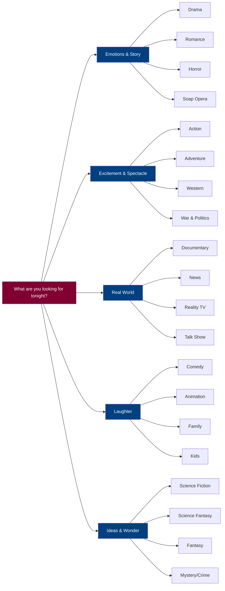

import Highlight from "@/react/Highlight/Highlight.jsx";

Imagine you walk into a giant library. There are thousands of books — no, hundreds of thousands. They are all stacked floor to ceiling, wall to wall, in every direction.

Now imagine someone just dumps them all in one big pile in the middle of the room and says: *"Have fun. Find something you like."*

That would be a nightmare, right?

That is exactly what watching television or browsing for movies would feel like **without genres.**

Genres are the labels on the shelves. They are the invisible hands that sort the pile into rows — *"over here, stories about cowboys; over there, stories about space; this corner, stories that will make you cry; that corner, stories that will make you laugh until you can't breathe."*

But genres are more than labels. They are a **promise.**

When you pick up a Horror movie, the genre is promising you something — chills, dread, a monster lurking somewhere, a moment where you grab the person next to you. When you pick a Romance, it is promising you butterflies in the stomach, misunderstandings, longing, and (usually) a happy ending.

This article is about **understanding that promise** — for every single major genre that exists. By the end, you will never stare blankly at a streaming menu again.

---

## <Highlight color='#800031' highlight='fg' fontWeight='bold'> But First — Why Do We Need So Many Genres? </Highlight>

Here is a little story.

Think of a person named Riya. On Monday she comes home after a brutal day at work. She wants to laugh and forget everything. She picks a Comedy. Perfect.

On Thursday, she is feeling restless, curious, like she wants to learn something real. She picks a Documentary. Perfect.

On Saturday, she is cozy in bed, wants to feel warmth and safety, wants to see a family come together. She picks a Family drama. Perfect.

Now imagine if those three completely different experiences were all called just... *"movies."* She would have to gamble every single time.

**Genres exist because human emotions are not one-size-fits-all.** We come to stories in different moods, seeking different things. Some nights we want to be scared. Some nights we want to feel hope. Some nights we just want noise and explosions and someone punching a villain off a cliff.

Genres let storytellers say: *"This one is for the person who wants THIS feeling tonight."*

Let's meet them all.

---

## <Highlight color='#800031' highlight='fg' fontWeight='bold'> The Genres: One by One </Highlight>

### <Highlight color='#004080' highlight='fg' fontWeight='bold'> 🤠 Western </Highlight>

**The simplest definition:** Stories set in the American frontier — usually the 1800s — involving cowboys, outlaws, sheriffs, deserts, saloons, and showdowns at high noon.

**The feeling it promises:** Dust. Wind. Silence before a gunfight. A lone hero who makes his own rules in a lawless land.

Picture this: A lone man rides into a small town on horseback. The town is terrified of a gang that has been stealing and killing. Nobody will stand up to them. Then this stranger, with very few words and very steady hands, decides to set things right — not because he is paid to, but because someone has to.

*That* is a Western.

The Western is one of the oldest and most American of all genres. It is really about a deeper question dressed up in cowboy hats: **What does a person do when there are no rules, no police, no society to protect them?** What kind of person do you become?

Classic examples: *The Good, the Bad and the Ugly* (film), *Yellowstone* (TV), *Deadwood* (TV).

> *"The man who kills without reason will find reason to kill himself."* — common wisdom in Westerns.

:::note[Fun Fact]
The term "Western" in modern culture has gone global. Today you can have a "Space Western" (*Firefly*) or an "Indian Western" (*Sholay*). The spirit of the lone hero in a lawless land travels well.
:::

---

### <Highlight color='#004080' highlight='fg' fontWeight='bold'> 💔 Soap Opera (or just "Soap") </Highlight>

**The simplest definition:** A never-ending dramatic TV series, usually running five days a week, about a group of characters whose personal, romantic, and family lives are constantly in crisis.

**The feeling it promises:** Gasp after gasp. "OH NO THEY DIDN'T." Constantly caring about what happens next. Coming back every single day.

Here is the story of where the name came from — and it tells you everything.

In the 1930s, American radio stations started airing serialized dramas in the daytime, aimed at housewives at home. The shows needed sponsors. Who stepped in? **Soap companies** — Procter & Gamble, Lever Brothers — because they wanted to advertise to the women listening at home. The soap companies *funded* these dramatic radio shows. So people started calling them "soap operas." The "opera" part is ironic — because real opera is highbrow art, and these melodramatic, over-the-top stories were... not.

The name stuck.

A Soap Opera works on one genius principle: **there is no ending.** Everything keeps going. Characters die and come back. Long-lost twins appear. Secret affairs are revealed at the worst possible moment. Someone always has amnesia. A character you thought was the villain turns out to have a tragic backstory that explains everything.

The longest-running Soap Opera in the world — *Guiding Light* — ran for **72 years**, from 1937 to 2009.

> *"In a soap opera, the most dramatic day of your life happens every Tuesday."*

The Soap is the genre that **invented binge-watching** — before it was even called that. People got hooked and couldn't stop.

---

### <Highlight color='#004080' highlight='fg' fontWeight='bold'> 😰 Thriller </Highlight>

**The simplest definition:** A story where the main character is in danger — and the audience's heart is racing alongside them, desperate to know if they will survive.

**The feeling it promises:** Tension. Suspense. The edge of your seat. A twist you did not see coming.

The best way to understand a Thriller is to understand *suspense* — and the master of suspense himself, Alfred Hitchcock, explained it perfectly:

> *"There is a bomb under the table. If it explodes, that's surprise. If the audience KNOWS it's there and watches two people chat for five minutes, not knowing — THAT is suspense."*

That is a Thriller. You know something bad is coming. The question is: will they escape it?

A Thriller is different from Horror in an important way. Horror wants you to be **frightened and disturbed.** A Thriller wants you to be **tensely, desperately engaged** — more like a chess match than a haunted house.

Classic examples: *Gone Girl*, *Knives Out*, *The Girl with the Dragon Tattoo*, *Succession* (TV).

---

### <Highlight color='#004080' highlight='fg' fontWeight='bold'> 😢 Drama </Highlight>

**The simplest definition:** A serious story about real human experiences — love, loss, family, identity, failure, redemption.

**The feeling it promises:** You will feel things. Real things. The kind of emotions you recognize from your own life.

Drama is perhaps the *oldest* genre in human storytelling. It is what theatre was invented for. It does not need explosions or monsters or comedy to work — it just needs true, complex, believable human beings placed in situations that test them.

Think of it this way: every other genre has a modifier that makes it special — *Action* Drama, *Romantic* Drama, *Historical* Drama. But plain Drama is the base. It is human experience, unadorned.

A Drama might follow a mother and daughter whose relationship breaks apart and slowly heals. Or a man who loses his job and has to confront what he has built his identity around. Or a community facing something that changes them forever.

It is the genre that makes you pause the screen and sit quietly for a moment.

> *"Drama is life with the dull bits cut out."* — Alfred Hitchcock

---

### <Highlight color='#004080' highlight='fg' fontWeight='bold'> 🚀 Science Fiction (Sci-Fi) </Highlight>

**The simplest definition:** Stories set in imagined futures or alternate realities, grounded in *plausible* science — space travel, artificial intelligence, genetic engineering, time travel, alien contact.

**The feeling it promises:** Wonder at what humanity might become. Anxiety about where technology is taking us. Questions bigger than any one person.

Here is the key word for Sci-Fi: **plausible.** A Sci-Fi story tries to imagine: *if this real scientific principle were extended into the future — what would the world look like?*

Isaac Asimov imagined robots with ethical programming. Arthur C. Clarke imagined geostationary satellites *decades* before they existed. Mary Shelley — the mother of the genre — imagined bringing dead tissue to life through electricity in *Frankenstein* (1818).

Sci-Fi is the genre that **asks the biggest questions** disguised as adventure:
- What does it mean to be human? (*Blade Runner*)
- Is technological progress always progress? (*Black Mirror*)
- Are we alone in the universe? (*Contact*, *Arrival*)

:::note[A key distinction]
**Science Fiction** asks: *Could this plausibly happen, given science?*
Real Sci-Fi keeps the "fiction" tethered to real scientific ideas — even if stretched far.
:::

---

### <Highlight color='#004080' highlight='fg' fontWeight='bold'> ✨ Science Fantasy </Highlight>

**The simplest definition:** The delightful child of Science Fiction and Fantasy — stories set in a science-fiction *aesthetic* (spaceships, lasers, aliens) but running on *fantasy logic* (magic, fate, chosen heroes, mystical forces).

**The feeling it promises:** The epic sweep of a fairy tale, dressed in the exciting costume of space adventure.

Here is the simplest test to tell them apart:

| | Science Fiction | Science Fantasy |
|---|---|---|
| **Faster-than-light travel** | Explained with real physics concepts (warp drives, wormholes) | Just... happens. "Jump to hyperspace." |
| **Special powers** | Mutant genes, radiation exposure, nanobots | The Force. Magic. Destiny. |
| **Story structure** | Often about ideas and consequences | Often about a hero's journey and destiny |
| **Famous example** | *The Martian*, *Arrival*, *Interstellar* | *Star Wars*, *Dune* (partially), *Avatar* |

The *Star Wars* franchise is the purest Science Fantasy ever made. There are spaceships and laser swords and alien planets — but the whole story runs on **The Force**, which is essentially magic with a cool name. There is a chosen one. There is a prophecy. There is good versus evil in cosmic terms. That is a fairy tale in a spaceship.

Neither is better than the other — they are just different promises.

---

### <Highlight color='#004080' highlight='fg' fontWeight='bold'> 🎙️ Talk (Talk Show) </Highlight>

**The simplest definition:** A show built around conversation — a host, guests, and discussion — live or semi-live, usually without a scripted plot.

**The feeling it promises:** The pleasure of watching interesting people talk. Laughter, insight, controversy, confession.

The Talk Show is one of the most honest genres because it makes no pretense — it is literally just people talking, and somehow that is enough. Great hosts make you feel like you are sitting at the best dinner party in the world, just listening.

Talk shows come in many flavours:
- **Celebrity interviews:** *The Tonight Show*, *Graham Norton Show* — celebrity gossip and charm.
- **Political discussion:** *The Daily Show*, *Last Week Tonight* — news with comedy.
- **Daytime emotional:** *The Oprah Winfrey Show* — confessions, healing, insight.
- **Debate and opinion:** *The View*, *Question Time* — hot topics, raised voices.

What they all share: a real human talking to another real human, and the camera just watching.

---

### <Highlight color='#004080' highlight='fg' fontWeight='bold'> ⚔️ War & Politics </Highlight>

**The simplest definition:** Stories set in the theaters of war, or in the corridors of political power — exploring how institutions, nations, and leaders operate under extreme pressure.

**The feeling it promises:** The weight of big decisions. The human cost of power. Moral complexity with no easy answers.

These two genres are often bundled together because they share a common subject: **what happens to people when they wield enormous power over other people.**

**War** stories like *Band of Brothers* or *Full Metal Jacket* put you in the boots of soldiers. They don't glorify — they show the horror, the brotherhood, the impossible choices, the mud and blood and boredom and sudden terror. The best war stories are **anti-war stories** told through the eyes of people who survived.

**Politics** stories like *The West Wing*, *House of Cards*, or *Veep* take you inside governments. They show the deal-making, the compromise, the idealism worn down by reality, the gap between what politicians promise and what they actually do.

Together, they remind us that history is not made by abstract forces — it is made by **people**, with all their flaws, fears, and occasional greatness.

---

### <Highlight color='#004080' highlight='fg' fontWeight='bold'> 📺 Reality </Highlight>

**The simplest definition:** Unscripted television that films real people (or supposedly real people) in real situations — competitions, relationships, survival, talent shows.

**The feeling it promises:** Vicarious experience. Watching real stakes, real tears, real triumph, real embarrassment — without being in the situation yourself.

Here is a confession about Reality TV: most of it is *not* quite as real as it claims. The situations are engineered, the editing shapes the narrative, the producers nudge drama along. But something *is* real — the people, the actual competition results, the genuine emotions.

Reality TV comes in wonderfully varied flavours:

- **Competition:** *The Great British Bake Off*, *MasterChef*, *The Voice* — talent tested to its limit.
- **Survival:** *Survivor*, *The Amazing Race* — what happens when comfort is stripped away?
- **Relationship:** *Love Island*, *The Bachelor* — can you fall in love on camera? (Sometimes, surprisingly, yes.)
- **Documentary-style:** *Keeping Up with the Kardashians*, *The Real Housewives* — following real people's lives.

> *"Reality TV didn't invent drama. It just installed cameras in the drama that was already happening."*

---

### <Highlight color='#004080' highlight='fg' fontWeight='bold'> 👨‍👩‍👧 Family </Highlight>

**The simplest definition:** Stories meant to be watched by all ages together — not specifically a children's show, but safe, warm, and meaningful for grandparents and five-year-olds alike.

**The feeling it promises:** Togetherness. Warmth. Stories that work on multiple levels — silly for kids, deeper for adults.

The Family genre is one of the hardest to get right, because it has to speak to completely different minds at the same time. A five-year-old and a forty-year-old are watching the same screen. The story has to give both of them something.

Pixar became the master of this. *Up* (2009) opens with a wordless montage of a couple's entire life together — love, joy, loss, aging — that makes adults weep before the adventure even begins. Then kids get talking dogs and a flying house. Everyone wins.

The family genre is not just "for kids" — it is **about** family: the love, the friction, the loyalty, the way family shapes who you are.

---

### <Highlight color='#004080' highlight='fg' fontWeight='bold'> 🎥 Documentary </Highlight>

**The simplest definition:** Non-fiction filmmaking — a film or series that investigates, records, or explains something real, using real footage, real people, and real events.

**The feeling it promises:** You will learn something true. You will see the world — or something in it — differently than when you started watching.

If Drama is "fiction that feels real," Documentary is "reality made to feel like a story."

A great documentary does something remarkable: it takes a subject — penguins in Antarctica, the music industry, a wrongful conviction, the collapse of a company — and makes it as gripping as any thriller, as emotional as any drama, as funny as any comedy. But nothing is made up.

Documentaries can make you care about things you never thought you would care about. You sit down not knowing anything about long-distance running, and forty minutes later you are crying about a Kenyan marathon runner you just met.

Types of Documentary:
- **Investigative:** *Making a Murderer*, *Icarus* — journalism on film.
- **Nature:** *Planet Earth*, *Our Planet* — the world's beauty and fragility.
- **Historical:** *13th*, *Apollo 11* — the past, revisited with fresh eyes.
- **Portrait:** *Won't You Be My Neighbor?* — one extraordinary person's life.

> *"Documentaries are empathy machines."* — Roger Ebert

---

### <Highlight color='#004080' highlight='fg' fontWeight='bold'> 📰 News </Highlight>

**The simplest definition:** Live or regularly broadcast reporting on current events — journalism on television or streaming.

**The feeling it promises:** Being informed. Knowing what is happening in your world right now.

News is technically not a "genre" in the same creative sense as the others — it is journalism. But as a *programming category*, it sits alongside everything else on the TV guide, and it is worth understanding what makes it distinct.

Good news programming answers: *What happened? Where? When? Who was involved? Why does it matter?*

The challenge of the news genre is **trust.** Unlike a fictional drama where you know everything is made up, news asks you to believe that what you are seeing is true and fairly presented. When news organizations do that well, it is one of the most valuable things media can provide. When they do it poorly — with bias, sensationalism, or misinformation — the damage can be enormous.

---

### <Highlight color='#004080' highlight='fg' fontWeight='bold'> 🧒 Kids </Highlight>

**The simplest definition:** Programming made specifically for children — educational, age-appropriate, entertaining, and imaginative.

**The feeling it promises:** Wonder. Silliness. Learning disguised as fun. The world explained in a way a child can hold.

Children's programming is wildly underestimated as a genre. Making something genuinely wonderful for a child is *harder* than making something for adults. Children are brutally honest audiences — they leave the room when they are bored. They cannot be fooled by prestige or reputation.

The best children's television does several things at once:
- Teaches something real (*Sesame Street* taught letters, numbers, empathy)
- Respects the child's intelligence
- Doesn't talk down or dumb things to the point of emptiness
- Gives children characters who look and feel like *them*

From *Bluey* (which Australian parents will tell you is just as good for adults) to *Avatar: The Last Airbender* (which is genuinely great for any age), the Kids genre at its peak is among the most creative television made.

---

### <Highlight color='#004080' highlight='fg' fontWeight='bold'> 🔍 Mystery </Highlight>

**The simplest definition:** A story built around a puzzle — usually a crime or disappearance — that the audience is invited to solve alongside the characters.

**The feeling it promises:** The pleasure of thinking. Clues, red herrings, deduction, and the satisfaction of the answer revealed.

Mystery is the genre that **makes you a detective.** As you watch, you are collecting clues, forming theories, suspecting characters, revising your guesses. When the solution is finally revealed, you feel either:
1. *"I KNEW IT!"* (very satisfying)
2. *"Oh my gosh, I never would have guessed — but looking back, all the clues were there!"* (even more satisfying)

The genius of a great Mystery is that it plays completely fair — every clue is shown to you — but hides them cleverly enough that you don't quite connect the dots.

Mystery differs from Thriller in its emotional tone: **Thriller = fear and urgency; Mystery = curiosity and intellectual delight.**

Agatha Christie invented the playbook that still runs: a closed setting, a cast of suspects who all have something to hide, and a clever detective who sees what others overlook. *Knives Out* (2019) and *Only Murders in the Building* are proof this formula is as alive as ever.

---

### <Highlight color='#004080' highlight='fg' fontWeight='bold'> 🔫 Crime </Highlight>

**The simplest definition:** Stories centered on criminal acts — their commission, investigation, prosecution, or consequences.

**The feeling it promises:** Darkness, moral complexity, the thrill of the hunt, the weight of justice and its failures.

Crime is a broader category than Mystery. A Mystery is always a puzzle to be solved. Crime is about the world of lawbreaking — and it can follow any perspective: the detective, the criminal, the victim, the lawyer, the corrupt system.

Crime comes in distinct flavours that feel very different:

| Crime Subtype | Follows | Famous Example | Tone |
|---|---|---|---|
| **Police Procedural** | The investigators | *The Wire*, *CSI* | Methodical, institutional |
| **True Crime** | Real events | *Making a Murderer* | Unsettling, journalistic |
| **Heist** | The criminals | *Ocean's Eleven*, *Money Heist* | Exciting, playful |
| **Noir** | A morally grey detective | *Chinatown*, *True Detective* | Atmospheric, dark |
| **Legal Drama** | The courtroom | *Better Call Saul*, *How to Get Away with Murder* | Tense, complex |

What all Crime stories share: a fascination with **why people break the law**, and what it costs everyone — criminal, victim, and society — when they do.

---

### <Highlight color='#004080' highlight='fg' fontWeight='bold'> 😂 Comedy </Highlight>

**The simplest definition:** Stories designed to make you laugh.

**The feeling it promises:** Joy. Release. The pleasure of recognizing the absurdity in everyday life.

Comedy sounds simple. It is the hardest genre to execute. Nothing fails as visibly as a joke that lands with silence.

What makes something funny? At its core, comedy is almost always about **surprise + truth**. Something happens that you did not expect, but the moment it happens, you recognize it as *real.* That collision — the unexpected truth — creates laughter.

Comedy comes in countless flavours:
- **Sitcom (Situational Comedy):** *Friends*, *The Office*, *Seinfeld* — recurring characters in everyday situations.
- **Sketch Comedy:** *Saturday Night Live*, *Monty Python* — quick, standalone comic scenarios.
- **Stand-up Special:** One comedian, a microphone, an audience.
- **Dark Comedy:** *Fleabag*, *Atlanta*, *Four Weddings and a Funeral* — funny, but the laughter comes from uncomfortable truths.
- **Romantic Comedy (RomCom):** Comedy + love story. The RomCom deserves its own section below.

> *"Comedy is tragedy plus time."* — Carol Burnett

---

### <Highlight color='#004080' highlight='fg' fontWeight='bold'> 🎨 Animation </Highlight>

**The simplest definition:** A genre defined not by its story type but by its *medium* — the visuals are drawn, computer-generated, or otherwise created frame by frame rather than filmed in live action.

**The feeling it promises:** Imagination without limits. Anything can happen in an animated world — because the artists can draw anything.

Animation is the only major genre defined entirely by *how* it looks rather than *what* the story is about. An animated story can be Comedy, Drama, Action, Fantasy, Horror, Musical — anything. The animation is the vessel, not the content.

This is why animation is so persistently underestimated: people assume "cartoon = for children." But animation can do things live action simply cannot:

- Show the interior world of a character's mind (*Inside Out*)
- Create worlds that would be impossibly expensive in live action (*Spirited Away*)
- Use visual style itself as emotional language (*Spider-Man: Into the Spider-Verse*)

The great animated works — *Hayao Miyazaki's films*, *Bojack Horseman*, *Arcane* — are simply great stories that happen to be drawn.

:::note[A World Divided]
Western animation and Japanese animation (Anime) have developed as almost entirely separate art traditions with their own aesthetics, storytelling conventions, and audiences. Both are Animation — but they feel like different languages.
:::

---

### <Highlight color='#004080' highlight='fg' fontWeight='bold'> 💥 Action </Highlight>

**The simplest definition:** Stories driven by physical excitement — chases, fights, explosions, stunts, and a protagonist who must overpower or outmaneuver physical threats.

**The feeling it promises:** Adrenaline. Momentum. The visceral satisfaction of watching someone move impossibly fast through impossible danger.

Action is about **the body in motion.** It asks you to hold your breath during a car chase, to lean forward during a fight scene, to feel your pulse rise as the hero sprints toward a closing door.

What separates good Action from mindless noise is character investment. You need to care about who is running. The best Action films work because you want the hero to survive — not just because survival is abstractly good, but because *this person* has become real to you.

Action almost never exists alone — it combines:
- **Action + Comedy:** *Jackie Chan films*, *The Nice Guys*
- **Action + Thriller:** *Mission: Impossible*, *Die Hard*
- **Action + Science Fiction:** *The Matrix*, *Edge of Tomorrow*
- **Action + Adventure:** See below.

---

### <Highlight color='#004080' highlight='fg' fontWeight='bold'> 🗺️ Adventure </Highlight>

**The simplest definition:** Stories about a journey — physical, geographical, or both — into the unknown, with discovery and danger along the way.

**The feeling it promises:** The open road. The horizon. The thrill of going somewhere new and not knowing what you will find.

If Action is about **the fight,** Adventure is about **the journey.** Adventure is less about combat and more about exploration, discovery, and the transformation that happens when someone leaves the familiar behind.

*The Lord of the Rings* is Adventure. *Indiana Jones* is Adventure. *Life of Pi* is Adventure. The common thread: a character sets out from somewhere safe, travels through a world of wonders and dangers, and arrives somewhere — changed.

Adventure is perhaps the oldest story genre of all. Homer's *Odyssey* — written over 2,700 years ago — is an Adventure. The genre is as old as the first human who went over the hill to see what was there, and came back with a story.

---

### <Highlight color='#004080' highlight='fg' fontWeight='bold'> 🐉 Fantasy </Highlight>

**The simplest definition:** Stories set in worlds where magic is real, the laws of nature as we know them do not apply, and mythical creatures, powers, and forces exist.

**The feeling it promises:** Escape into a world that operates by different, often more *symbolic* rules — where good and evil have clear forms, and the impossible is everyday.

Fantasy is the genre of **pure imagination** — it does not pretend to be scientific (that's Sci-Fi's job). Fantasy asks: *what if magic were real? What if there were dragons? What if the old gods walked the earth?*

The magic of great Fantasy is that it uses these invented worlds to explore **real human truths** more freely. Tolkien said that Fantasy is "sub-creation" — building a secondary world as real and internally consistent as our own, so that when things happen in it, they matter.

*Game of Thrones* is Fantasy — but its real story is about power, corruption, and the gap between ideals and reality. *Harry Potter* is Fantasy — but its real story is about belonging, prejudice, and choosing between fear and love.

The invented world is the stage. The human story is what plays on it.

---

### <Highlight color='#004080' highlight='fg' fontWeight='bold'> 😱 Horror </Highlight>

**The simplest definition:** Stories designed to frighten — to create dread, unease, fear, or disgust.

**The feeling it promises:** The safe experience of being terrified. A way to face your darkest fears from the safety of a couch.

This deserves a moment: why would anyone *want* to be scared? Why is Horror one of the most reliably popular genres in all of storytelling?

The answer is fascinating. Fear, in the controlled space of fiction, is **thrilling** rather than dangerous. Your body responds to the monster onscreen with real adrenaline — your heart races, your senses sharpen — but you are physically safe. It is like a roller coaster. The drop is terrifying. The fact that you chose it and survived it is exhilarating.

But the best Horror goes deeper than cheap scares. The best Horror stories are **about something:**
- *Get Out* is about racism — and uses Horror to make you *feel* the terror of it.
- *Hereditary* is about grief and inherited trauma.
- *The Babadook* is about depression.
- *A Quiet Place* is about parenthood in a world that seems designed to take your children.

Horror gives filmmakers a way to externalize internal fears and make them visible, tangible, and terrifying.

Horror subgenres are wonderfully specific: **Slasher** (masked killer, teens in a cabin), **Supernatural** (ghosts, demons, possession), **Psychological** (the horror is in the mind), **Body Horror** (the fear of bodily transformation), **Cosmic Horror** (forces so vast and alien that understanding them destroys you).

---

### <Highlight color='#004080' highlight='fg' fontWeight='bold'> 🎵 Music </Highlight>

**The simplest definition:** Film or TV programming where music is central — either as a subject (documentaries about musicians, biopics), as a structural element (musicals where characters sing), or as a showcase (concert films, music competition shows).

**The feeling it promises:** The emotional directness of music combined with the emotional depth of visual storytelling.

The Music genre is unusual because music itself is already the oldest emotional art form. When you add it to visual storytelling, the combination can be devastating.

Think of the moment in *La La Land* when two characters play piano together and the whole world around them seems to shimmer. Or the way a great music biopic — *Bohemian Rhapsody*, *Elvis*, *Rocketman* — lets you fall into someone's life through the songs they made.

Music Television (think MTV in its prime, or live concert broadcasts) is its own tradition — pure music for the eyes.

---

### <Highlight color='#004080' highlight='fg' fontWeight='bold'> 💕 Romance </Highlight>

**The simplest definition:** Stories where love — its pursuit, complications, and fulfillment — is the central plot.

**The feeling it promises:** The whole arc of falling in love: butterflies, longing, misunderstandings, obstacles, and — in most cases — the joy of two people finally finding each other.

Romance is the genre that bets on the most universal human experience: **wanting to be loved and known by another person.**

There is a reason Romance is consistently one of the best-selling genres in books and one of the most-watched in film: because everyone, at some level, wants to see love work out.

The classic Romance structure involves:
1. Two people who seem wrong for each other (or right for each other but in difficult circumstances)
2. Something that brings them close
3. Something that tears them apart
4. Something that brings them back together

Simple? Yes. Eternal? Also yes.

Romance is often unfairly dismissed as lightweight. But the best Romance stories — *Normal People*, *Before Sunrise*, *Pride and Prejudice* — are about **seeing and being seen** in the deepest sense. That is not lightweight at all.

---

### <Highlight color='#004080' highlight='fg' fontWeight='bold'> 🎬 TV Movie </Highlight>

**The simplest definition:** A film made specifically for television broadcast rather than theatrical release — feature-length, cinematic in form, but made for the small screen.

**The feeling it promises:** A complete movie experience without going to a cinema. An event film in your living room.

The TV Movie is a format distinction as much as a genre. A TV Movie can be any genre — Romance, Thriller, Drama, Horror — but it was produced for television. This distinction mattered enormously before streaming blurred all the lines.

In the golden age of network television, the "TV Movie of the Week" was a major cultural event. Families gathered to watch. Now, streaming services produce prestige films that never see a cinema, and the line between "TV movie" and "film" has almost entirely dissolved.

---

## <Highlight color='#800031' highlight='fg' fontWeight='bold'> How They All Relate: A Map </Highlight>

It helps to see them grouped not just as a list, but by what they are *trying to do* for you:

---

## <Highlight color='#800031' highlight='fg' fontWeight='bold'> The Genres: Quick-Reference Table </Highlight>

| Genre | Core Promise | Key Ingredient | Famous Example |
|---|---|---|---|
| **Western** | Lone hero in a lawless land | Dust, moral code, showdown | *Yellowstone*, *The Good the Bad and the Ugly* |
| **Soap Opera** | Never-ending emotional drama | A crisis every episode, forever | *Coronation Street*, *Days of Our Lives* |
| **Thriller** | You will be kept in suspense | Tension, stakes, twist | *Gone Girl*, *Knives Out* |
| **Drama** | Real human emotion | Believable people, real conflict | *Breaking Bad*, *Normal People* |
| **Science Fiction** | Plausible future, big ideas | Real science extrapolated far | *Black Mirror*, *Arrival* |
| **Science Fantasy** | Epic adventure with magic in space | Space setting + fantasy logic | *Star Wars*, *Dune* |
| **Talk Show** | Great conversation | A magnetic host, compelling guests | *Late Night*, *Oprah* |
| **War & Politics** | Power and its human cost | Institutions, leaders, moral weight | *The West Wing*, *Band of Brothers* |
| **Reality TV** | Real people, real stakes | Unscripted situations, genuine emotion | *Survivor*, *Love Island* |
| **Family** | For everyone at once | Works for all ages, warmth | *Pixar films*, *The Incredibles* |
| **Documentary** | Something true, made gripping | Real events, real people | *Planet Earth*, *Making a Murderer* |
| **News** | What is happening right now | Journalism, current events | Any major news channel |
| **Kids** | Delight and learning for children | Age-appropriate wonder | *Bluey*, *Avatar: The Last Airbender* |
| **Mystery** | A puzzle to solve | Clues, deduction, reveal | *Agatha Christie*, *Only Murders in the Building* |
| **Crime** | The world of lawbreaking | Moral complexity, the law's edge | *The Wire*, *Better Call Saul* |
| **Comedy** | Laughter | Surprise + truth | *Seinfeld*, *Fleabag* |
| **Animation** | Imagination without limits | Drawn/CGI worlds | *Studio Ghibli*, *Arcane* |
| **Action** | Physical excitement | Chases, fights, adrenaline | *Mad Max: Fury Road* |
| **Adventure** | A journey into the unknown | Discovery, transformation | *Lord of the Rings* |
| **Fantasy** | A world where magic is real | World-building, mythic stakes | *Game of Thrones*, *Harry Potter* |
| **Horror** | Safe fear | Dread, monster, the unknown | *Get Out*, *Hereditary* |
| **Music** | The power of song in story | Music as central element | *La La Land*, *Bohemian Rhapsody* |
| **Romance** | Love, pursued and won | Chemistry, obstacles, reunion | *Pride and Prejudice*, *Before Sunrise* |
| **TV Movie** | A complete film on television | Feature length, made for TV | Various, by platform |

---

## <Highlight color='#800031' highlight='fg' fontWeight='bold'> Why Genres Blur and Mix </Highlight>

Here is a secret: the most interesting films and shows are often the ones that don't fit cleanly into one genre.

*Get Out* is Horror + Social Thriller + Drama.
*The Grand Budapest Hotel* is Comedy + Mystery + Adventure.
*Severance* is Thriller + Science Fiction + dark Comedy + Drama.

This is not a failure of categorization. It is **genre maturity.** When creators know the rules and expectations of a genre deeply, they can bend them, combine them, and subvert them — giving audiences the pleasure of recognition plus the surprise of something new.

Genres are not walls. They are launchpads.

---

## <Highlight color='#800031' highlight='fg' fontWeight='bold'> Conclusion: The Genre Is the Conversation </Highlight>

Let us go back to Riya, our person from the beginning.

She now knows that when she wants to laugh and forget her troubles, she clicks **Comedy.** When she wants to be intellectually engaged and feel like she learned something real, she clicks **Documentary.** When she wants to feel warmth and safety, she clicks **Family.** When she wants her heart to race and her mind to race faster, she clicks **Thriller** or **Mystery.**

But now she also knows something deeper: each genre is a **relationship between the storyteller and the audience.** The genre is the storyteller saying: *"I know what you came here for tonight. Trust me. I have made something that will give you exactly that — and maybe a little more."*

Genres are a promise. The best films and shows are the ones that keep it.

> *"Every story ever told can be reduced to: a stranger comes to town, or a person goes on a journey. Everything else is genre — the dressing that tells you what kind of stranger, what kind of town, what kind of journey, and what kind of person you will be when you arrive."*

Now you know the dressing. Go find your story.

:::explore
[>] [IMDb Genre Guide](https://www.imdb.com/feature/genre/)
[>] [BFI: Understanding Film Genres](https://www.bfi.org.uk/)
[>] [Roger Ebert's Great Movies](https://www.rogerebert.com/great-movies)
:::
